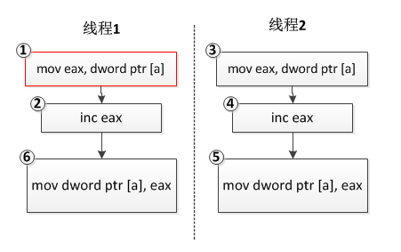

# Concurrency 并发元语

## 整型变量的原子操作

线程同步技术，指的是多个线程同时操作某个资源（从程序的术语来说，这里的资源可能是一个简单的整型变量，也可能是一个复杂的C++对象）。多线程同时操作资源指的是多线程同时对资源的读和写，我们需要采取一些特殊的措施去保护这些资源，以免引起一些资源访问冲突（如死锁）或者得到意料外的结果。

### 为什么整型变量赋值操作不是原子的

那么为什么整型变量的操作不是原子性的呢？常见的整型变量操作有如下几种情况：

- 给整型变量赋值一个确定的值，如

> int a = 1;

这条指令操作一般是原子的，因为对应着一条计算机指令，CPU将立即数1搬运到变量a的内存地址中即可，汇编指令如下：

> mov dword ptr [a], 2

然后这确是最不常见的情形，由于现代编译器一般存在优化策略，如果变量a的值在编译期间就可以计算出来（例如这里的例子中a的值就是1），那么a这个变量本身在正式版本的软件中（release版）就很有可能被编译器优化掉，凡是使用a的地方，直接使用常量1来代替。所以实际的执行指令中，这样的指令存在的可能性比较低。

- 变量自身增加或者减去一个值，如

> a++;

从C/C++语法的级别来看，这是一条语句，应该是原子的；但从编译得到的汇编指令来看，其实不是原子的，其一般对应三条指令，首先将变量a对应的内存值搬运到某个寄存器（如eax）中，然后将该寄存器中的值自增1，再将该寄存器中的值搬运回a代表的内存中：

> mov eax, dword ptr [a]  
> inc eax  
> mov dword ptr [a], eax

现在假设a的值是0，有两个线程，每个线程对变量a的值递增1，我们预想的结果应该是2，可实际运行的结果可能是1！是不是很奇怪？分析如下：

```c++
int a = 0;

//线程1
void thread_func1()
{
    a ++;
}

//线程2
void thread_func2()
{
    a ++;
}
```



我们预想的结果是线程1和线程2的三条指令各自执行，最终a的值变为2，但是由于操作系统线程调度的不确定性，线程1执行完指令①和②后，eax寄存器中的值变为1，此时操作系统切换到线程2执行，执行指令③④⑤，此时eax的值变为1；接着操作系统切回线程1
继续执行，执行指令⑥，得到a的最终结果1。

- 把一个变量的值赋值给另外一个变量，或者把一个表达式的值赋值给另外一个变量，如

> int a = b;

从C/C++语法的级别来看，这条语句应该是原子的；但是从编译得到的汇编指令来看，由于现代计算机CPU架构体系的限制，数据不能直接从内存某处搬运到内存另外一处，必须借助寄存器来中转，因此这条语句一般对应两条计算机指令，即将变量b的值搬运到某个寄存器（如eax）中，再从该寄存器搬运到变量a的内存地址：

```
mov eax, dword ptr [b]  
mov dword ptr [a], eax
```

> 既然是两条指令，那么多个线程在执行这两条指令时，某个线程可能会在第一条指令执行完毕后被剥夺CPU时间片，切换到另外一个线程而产生不确定的情况。

说点题外话，网上很多人强调某些特殊的整型数值类型（如bool类型）的操作是原子的，这是由于，某些CPU生产商开始有意识地从硬件平台保证这一类操作的原子性，但这并不是每一种类型的CPU架构都支持，在这一事实成为标准之前，我们在多线程操作整型时还是老老实实使用原子操作或线程同步技术来对这些数据类型进行保护。

### Windows 平台上整型变量的原子操作

整型变量的原子操作是一些非常常用且实用的操作，因此Windows操作系统也提供了API级别的支持，使用这些API可以直接对整型变量进行原子操作，而不用借助专门的锁对象，在Windows平台上，它们是Interlocked系列函数。这里给出Interlocked常用的API的一个列表：

| 函数名                        | 函数说明                       |
|----------------------------|----------------------------|
| InterlockedIncrement       | 将32位整型变量自增1                |
| InterlockedDecrement       | 将32位整型变量自减1                |
| InterlockedExchangeAdd     | 将32位整型值增加n（n可以是负值）         |
| InterlockedXor             | 将32位整型值与n进行异或操作            |
| InterlockedCompareExchange | 将32位整型值与n1进行比较，如果相等，则替换成n2 |

上表中仅列出了与32位（bit）整型相关的API函数，Windows还提供了对8位、16位以及64位的整型变量进行原子操作的API，在实际使用时可以自行参考
MSDN。

以上表中InterlockedIncrement为例来说明这类函数的用法，InterlockedIncrement 的函数签名是：

> LONG InterlockedIncrement(LONG volatile *Addend);

这个函数的作用是将变量Addend自增 1，并返回自增后的值。

> 注意：这里 LONG型即 long 型，在32位系统中，LONG占4个字节。

我们写一个例子来验证一下：

```c++
#include <Windows.h>

int main()
{
    LONG nPreValue = 99;
    LONG nPostValue = InterlockedIncrement(&nPreValue);

    printf("nPreValue=%d, nPostValue=%d\n", nPreValue, nPostValue);

    return 0;
}
```

### C++11对整型变量原子操作的支持

在C++
98/03标准中，如果想对整型变量进行原子操作，要么利用操作系统提供的相关原子操作API，要么利用对应操作系统提供的锁对象来对变量进行保护，无论是哪种方式，编写的代码都无法实现跨平台操作，例如上一小介绍的Interlocked系列API代码仅能运行于Windows系统，无法移植到Linux系统。C++11新标准发布以后，改变了这种困境，新标准提供了对整型变量原子操作的相关库，即
std::atomic ，这是一个模板类型：

```c++
template<class T>
struct atomic;
```

可以传入具体的整型类型（如bool、char、short、int、uint等）对模板进行实例化，实际上stl库也提供了这些实例化的模板类型：

| 类型别名                 | 定义                              |
|----------------------|---------------------------------|
| std::atomic_bool     | std::atomic<bool>               |
| std::atomic_char     | std::atomic<char>               |
| std::atomic_schar    | std::atomic<signed char>        |
| std::atomic_uchar    | std::atomic<unsigned char>      |
| std::atomic_short    | std::atomic<short>              |
| std::atomic_ushort   | std::atomic<unsigned short>     |
| std::atomic_int      | std::atomic<int>                |
| std::atomic_uint     | std::atomic<unsigned int>       |
| std::atomic_long     | std::atomic<long>               |
| std::atomic_ulong    | std::atomic<unsigned long>      |
| std::atomic_llong    | std::atomic<long long>          |
| std::atomic_ullong   | std::atomic<unsigned long long> |
| std::atomic_char16_t | std::atomic<char16_t>           |
| std::atomic_char32_t | std::atomic<char32_t>           |
| std::atomic_wchar_t  | std::atomic<wchar_t>            |
| std::atomic_int8_t   | std::atomic<std::int8_t>        |
| std::atomic_uint8_t  | std::atomic<std::uint8_t>       |
| std::atomic_int16_t  | std::atomic< std::int16_t>      |
| std::atomic_uint16_t | std::atomic<std::uint16_t>      |
| std::atomic_int32_t  | std::atomic<std::int32_t>       |
| std::atomic_uint32_t | std::atomic<std::uint32_t>      |
| std::atomic_int64_t  | std::atomic<std::int64_t>       |
| std::atomic_uint64_t | std::atomic<std::uint64_t>	     |

上表中仅列出了 C++ 11 支持的常用的整型原子变量，完整的列表读者可以参考如下：

> https://zh.cppreference.com/w/cpp/atomic/atomic

有了C++语言本身对原子变量的支持以后，我们就可以“愉快地”写出跨平台的代码了，我们来看一段代码：

```c++
#include <atomic>
#include <stdio.h>

int main()
{
    std::atomic<int> value;
    value = 99;
    printf("%d\n", (int)value);

    //自增1，原子操作
    value++;
    printf("%d\n", (int)value);

    return 0;
}
```

以上代码可以同时在Windows和Linux平台上运行，但是有读者可能会根据个人习惯将上述代码写成如下形式：

```c++
#include <atomic>
#include <stdio.h>

int main()
{
    std::atomic<int> value = 99;
    printf("%d\n", (int)value);

    //自增1，原子操作
    value++;
    printf("%d\n", (int)value);

    return 0;
}
```

代码仅仅做了一点简单的改动，这段代码在Windows平台上运行良好，但是在Linux平台上会无法编译通过（这里指的是在支持C++11语法的g++编译中编译），提示错误是：

> error: use of deleted function ‘std::atomic<int>::atomic(const std::atomic<int>&)’

产生这个错误的原因是：std::atomic<int> value = 99; 这一行代码调用的是std::atomic的拷贝构造函数，对于int型，其形式一般如下：

> std::atomic<int>::atomic(const std::atomic<int>& rhs);

而根据C++11的规范，这个拷贝构造函数是默认使用 =delete 语法禁止编译器生成的，g++遵循了这个标准（参见https:
//zh.cppreference.com/w/cpp/atomic/atomic/operator%3D）：

> atomic& operator=( const atomic& ) = delete;

所以Linux平台上编译器会提示错误，而Windows 的VC++编译器没有遵循这个规范。而对于代码：

> value = 99;

g++和VC++同时实现规范中的：

> T operator=( T desired )

因此，如果想利用C++11提供的std::atomic库编写跨平台的代码，在使用std::atomic提供的方法时建议参考官方std::
atomic提供的接口说明来使用，而不是想当然地认为一个方法在此平台上可以运行，在另外一个平台也能有相同的行为，避免出现上面说的这种情形。

上述代码中之所以可以对value进行自增（++）操作是因为std::atomic类内部重载了 operator = 运算符，除此以外， std::
atomic提供了大量有用的方法，读者可能会觉得这些方法似曾相识：

| 方法名                                                          | 方法说明                                      |
|--------------------------------------------------------------|-------------------------------------------|
| operator=                                                    | 存储值于原子对象                                  |
| store                                                        | 原子地以非原子对象替换原子对象的值                         |
| load                                                         | 原子地获得原子对象的值                               |
| exchange                                                     | 原子地替换原子对象的值并获得它先前持有的值                     |
| compare_exchange_weak、compare_exchange_strong                | 原子地比较原子对象与非原子参数的值，若相等则进行交换，若不相等则进行加载      |
| fetch_add                                                    | 原子地将参数加到存储于原子对象的值，并返回先前保有的值               |
| fetch_sub                                                    | 原子地从存储于原子对象的值减去参数，并获得先前保有的值               |
| fetch_and                                                    | 原子地进行参数和原子对象的值的逐位与，并获得先前保有的值              |
| fetch_or                                                     | 原子地进行参数和原子对象的值的逐位或，并获得先前保有的值              |
| fetch_xor                                                    | 原子地进行参数和原子对象的值的逐位异或，并获得先前保有的值             |
| operator++、operator++(int)、operator--、operator--(int)        | 令原子值增加或减少一                                |
| operator +=、operator -=、operator &=、operator \|=、operator ^= | 原子地与右边的参数进行加、减，或、按位与、按位或、按位异或并将结果存储在原子对象中 |


	
	
	
	
	

	
	
	
	
	
	
	
	
 
 

 

 
 
 


	


