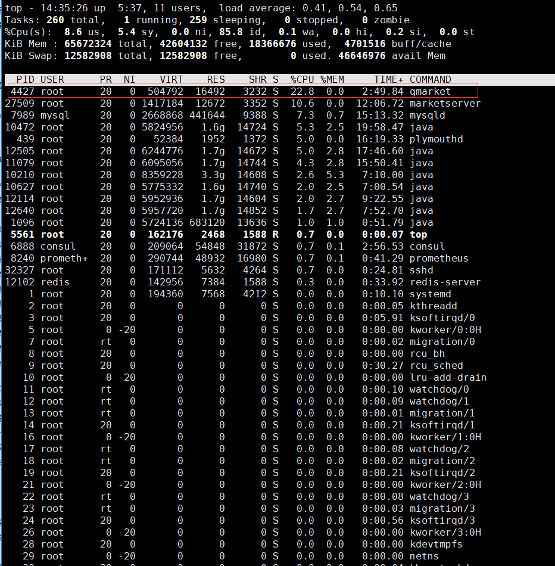
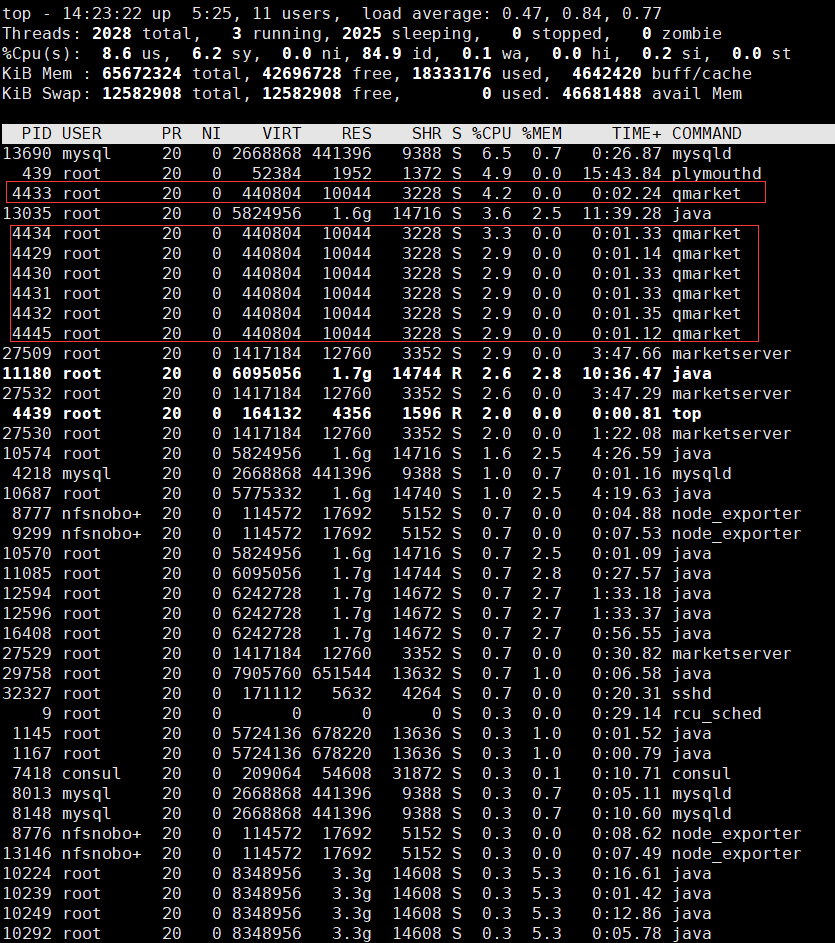
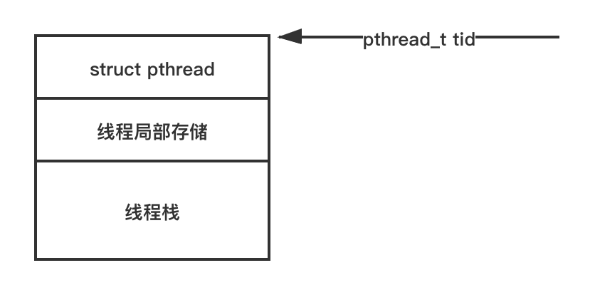

# Thread
在Windows系统中，当一个进程存在多个线程时，如果主线程执行结束了，那么这个时候即使支线程（也可以叫工作线程）还没完成相关的代码执行，支线程也会退出，也就是说，主线程一旦退出整个进程也就结束了。之所以强调这一点是，是因为很多多线程编程的初学者经常在工作线程写了很多逻辑代码，但是没有注意到主线程已经提前退出，导致这些工作线程的代码来不及执行。解决这一问题的方案很多，核心就是让主线程不要退出，或者至少在工作线程完成工作之前主线程不要退出。常见的解决方案有主线程启动一个循环或者主线程等待工作线程退出后再退出（下文将会详细介绍）。

在Linux系统中，如果主线程退出，工作线程一般不会受到影响，还会继续运行下去，但是此时这个进程就会变成所谓的僵尸进程，这是一种不好的做法，实际开发中应该避免产生僵尸进程。

```bash
# ps -ef 命令查看系统进程列表时，带有<defunct>字样的进程即僵尸进程
[root@localhost ~]# ps -ef
UID        PID  PPID  C STIME TTY          TIME CMD
root         2     0  0 Jan18 ?        00:00:01 [kthreadd]
root         3     2  0 Jan18 ?        00:00:25 [ksoftirqd/0]
root         5     2  0 Jan18 ?        00:00:00 [kworker/0:0H]
root     60928     1  0 14:48 pts/1    00:00:00 [linuxtid] <defunct>
```

> Linux版本众多，在某些Linux版本实现中，主线程退出也会导致支线程退出，这个行为就和Windows上一样了。在实际开发时应该以自己的机器测试结果为准。

## Linux 线程创建
Linux平台上使用pthread_create这个API来创建线程，其函数签名如下：

```text
int pthread_create(pthread_t *thread, 
				   const pthread_attr_t *attr,
                   void *(*start_routine) (void *), 
                   void *arg);
```

参数说明：

- thread：用于返回创建的线程ID，如果thread为NULL，则不返回线程ID。
- attr：线程属性，如果为NULL，则使用默认属性。
- start_routine：线程的入口函数，该函数的返回值将作为pthread_create函数的返回值, 需要注意的是这个函数的调用方式必须是 **__cdecl调用，即C** Declaration的缩写，这是C/C++中定义函数时默认的调用方式 ，一般很少有人注意到这一点。而后面我们介绍在Windows操作系统上使用CreateThread定义线程函数时必须使用 **__stdcall**调用方式时，由于函数不是默认函数调用方式，所以我们必须显式声明函数的调用方式了。
- arg：线程入口函数的参数。

返回值：

- 0：表示成功。
- 错误代码：表示失败，具体错误代码请参考errno.h。

也就是说，如下函数的调用方式是等价的：
```text
//代码片段1：不显式指定函数调用方式，其调用方式为默认的__cdecl
void* start_routine (void* args)
{
}

//代码片段2：显式指定函数调用方式为默认的__cdecl，等价于代码片段1
void* __cdecl start_routine (void* args)
{
}
```

- 参数arg，通过这一参数可以在创建线程时将某个参数传入线程函数中，由于这是一个void*类型，可以方便我们最大化地传入任意多的信息给线程函数。

- 返回值：如果成功创建线程，返回0；如果创建失败，则返回响应的错误码，常见的错误码有EAGAIN、EINVAL、EPERM。

下面是一个使用pthread_create创建线程的简单示例：
```c
#include <pthread.h>
#include <unistd.h>
#include <stdio.h>

void* threadfunc(void* arg)
{
	while (1)
	{
		//睡眠1秒
		sleep(1);

		printf("I am New Thread!\n");
	}

	return NULL;
}

int main()
{
	pthread_t threadid;
	pthread_create(&threadid, NULL, threadfunc, NULL);

	//权宜之计，让主线程不要提前退出
	while (1)
	{
		sleep(1);		
	}

	return 0;
}
```

## Windows 线程创建
在Windows系统中，使用CreateThread这个API来创建线程，其函数签名如下：

```text
HANDLE CreateThread(
	LPSECURITY_ATTRIBUTES lpThreadAttributes,
	SIZE_T dwStackSize,
	LPTHREAD_START_ROUTINE lpStartAddress,
	LPVOID lpParameter,
	DWORD dwCreationFlags,
	LPDWORD lpThreadId
);
```

参数说明：

- lpThreadAttributes：线程的属性，如果为NULL，则使用默认属性。
- dwStackSize：线程的栈大小，单位为字节数，如果为0，则使用默认栈大小。
- lpStartAddress：线程的入口函数，该函数的返回值将作为CreateThread函数的返回值，其类型是LPTHREAD_START_ROUTINE，这是一个函数指针类型，其定义如下：
> typedef DWORD ( __stdcall *LPTHREAD_START_ROUTINE )(LPVOID lpThreadParameter);

需要注意的是，Windows上创建的线程的线程函数其调用方式必须是 **__stdcall**，如果将如下函数设置成线程函数是不行的：

> DWORD threadfunc(LPVOID lpThreadParameter);

如上文所说，如果不指定函数的调用方式，默认使用默认调用方式 **__cdecl**，而这里的线程函数要求是 **__stdcall**，因此必须在函数名前面显式指定函数调用方式为 **__stdcall**。

> DWORD __stdcall threadfunc(LPVOID lpThreadParameter);

Windows上的宏WINAPI和CALLBACK这两个宏的定义都是 **__stdcall**，因此在很多项目中看到的线程函数的签名大多写成如下两种形式的一种：

```text
//写法1
DWORD WINAPI threadfunc(LPVOID lpThreadParameter);
//写法2
DWORD CALLBACK threadfunc(LPVOID lpThreadParameter);
```

- lpParameter：线程入口函数的参数，和Linux下的pthread_create函数的arg一样，这实际上也是一个void类型（LPVOID类型实际上是用typedef 包装后的void类型）。
> typedef void* LPVOID;

- dwCreationFlags：线程的创建标志，是一个32位无符号整型（DWORD）,如果为0，则使用默认标志，表示创建好线程后立即启动线程的运行；有一些特殊的情况，我们不希望创建线程后立即开始执行，可以将这个值设置为4（对应Windows定义的宏CREATE_SUSPENDED），后面在需要的时候，再使用ResumeThread这个API让线程运行起来。

- 参数lpThreadId，为线程创建成功返回的线程ID，这也是一个32位无符号整数（DWORD）的指针（LPDWORD）。

- 返回值：Windows上使用句柄（HANDLE类型）来管理线程对象，句柄本质上是内核句柄表中的索引值。如果成功创建线程，返回该线程的句柄；如果创建失败，返回NULL。

下面的代码片段，演示了Windows上如何创建一个线程：
```c
#include <Windows.h>
#include <stdio.h>

DWORD WINAPI ThreadProc(LPVOID lpParameters)
{
    while (true)
    {
        //睡眠1秒，Windows上的Sleep函数参数事件单位为毫秒
        Sleep(1000);

        printf("I am New Thread!\n");
    }
}

int main()
{
    DWORD dwThreadID;
    HANDLE hThread = CreateThread(NULL, 0, ThreadProc, NULL, 0, &dwThreadID);
    if (hThread == NULL)
    {
        printf("Failed to CreateThread.\n");
    }

	//权宜之计，让主线程不要提前退出
    while (true)
    {
        Sleep(1000);
    }
    
    return 0;
}
```

## Windows CRT提供的线程创建函数
这里的CRT，指的是C Runtime（C运行时），通俗地说就是C函数库。在Windows操作系统上，微软实现的C库也提供了一套用于创建线程的函数（当然这个函数底层还是调用相应的操作系统平台的线程创建 API）。在实际项目开发中推荐使用这个函数来创建线程而不是使用CreateThread函数。

Windows C库创建线程常用的函数是 **_beginthreadex**，声明位于process.h头文件中，其签名如下：
```c
uintptr_t _beginthreadex( 
   void *security,  
   unsigned stack_size,  
   unsigned ( __stdcall *start_address )( void * ),  
   void *arglist,  
   unsigned initflag,  
   unsigned *thrdaddr   
);
```

_beginthreadex函数签名和Windows的CreateThreadAPI 函数基本一致，这里就不再赘述了。

以下是使用 **_beginthreadex**创建线程的一个例子：
```c
#include <process.h>
#include <stdio.h>

unsigned int __stdcall threadfun(void* args)
{
    while (true)
    {        
        printf("I am New Thread!\n");
    }
}

int main(int argc, char* argv[])
{
    unsigned int threadid;
    _beginthreadex(0, 0, threadfun, 0, 0, &threadid);

	//权宜之计，让主线程不要提前退出
    while (true)
    {        
    }
    
    return 0;
}
```

## C++11提供的std::thread类
无论是Linux还是Windows上创建线程的API，都有一个非常不方便的地方，就是线程函数的签名必须是固定的格式（参数个数和类型、返回值类型都有要求）。C++11新标准引入了一个新的类std::thread（需要包含头文件<thread>），使用这个类可以将任何签名形式的函数作为线程函数。以下代码分别创建两个线程，线程函数签名不一样：

```c
#include <stdio.h>
#include <thread>

void threadproc1()
{
    while (true)
    {
        printf("I am New Thread 1!\n");
    }
}

void threadproc2(int a, int b)
{
    while (true)
    {
        printf("I am New Thread 2!\n");
    }
}

int main()
{
    //创建线程t1
    std::thread t1(threadproc1);
    //创建线程t2
    std::thread t2(threadproc2, 1, 2);

	//权宜之计，让主线程不要提前退出
    while (true)
    {
    }
    
    return 0;
}
```

当然， std::thread在使用上容易犯一个错误，即std::thread对象在线程函数运行期间必须是有效的。什么意思呢？我们来看一个例子：
```c
#include <stdio.h>
#include <thread>

void threadproc()
{
    while (true)
    {
        printf("I am New Thread!\n");
    }
}

void func()
{
    std::thread t(threadproc);
}

int main()
{
    func();
    
    //权宜之计，让主线程不要提前退出
    while (true)
    {
    }
    
    return 0;
}
```

上述代码在main函数中调用func函数，在func函数中创建了一个线程，乍一看代码好像没什么问题，但是实际运行时程序会产生崩溃。崩溃的原因是，当func函数调用结束后，func中局部变量t（线程对象）被销毁了，而此时线程函数仍然在运行。这就是我所说的，使用std::thread类时，必须保证线程函数运行期间，其线程对象有效。这是一个很容易犯的错误，解决这个问题的方法是，std::thread对象提供了一个detach方法，这个方法让线程对象与线程函数脱离关系，这样即使线程对象被销毁，仍然不影响线程函数的运行。我们只需要在func函数中调用detach方法即可，代码如下：

```c
//其他代码保持不变，这里仅贴出修改后的func函数
void func()
{
    std::thread t(threadproc);
    t.detach();
}
```

然而，在实际开发中，并不推荐这么做，原因是我们可能需要使用线程对象去控制和管理线程的运行和生命周期。所以，我们的代码应该尽量保证线程对象在线程运行期间有效，而不是单纯地调用detach方法使线程对象与线程函数的运行分离。

## 线程ID
一个线程创建成功以后，我们可以拿到一个线程ID，线程ID是在整个操作系统范围内是唯一的。我们可以使用线程ID来标识和区分线程，例如在日志文件中，输出日志的同时将输出日志的线程ID一起输出，这样可以方便我们判断和排查问题。上文也介绍了创建线程时可以通过pthread_create函数的第一个参数thread （Linux平台）和CreateThread函数的最后一个参数lpThreadId（Windows平台）得到线程的ID。大多数时候，我们需要在当前调用线程中获取当前线程的ID，在Linux平台上可以调用pthread_self函数，在Windows平台上可以调用GetCurrentThreadID函数获取，这两个函数的签名分别如下：

```c
pthread_t pthread_self(void);

DWORD GetCurrentThreadId();
```

这两个函数比较简单，这里就不介绍了，无论是pthread_t还是DWORD类型，都是一个32位无符号整型值。

### pstack命令
Linux系统中可以通过pstack命令查看一个进程的线程数量和每个线程的调用堆栈情况。

> pstack pid

pid设置为要查看的进程的ID即可。以nginx的worker进程为例，首先使用ps命令查看下nginx进程ID，然后使用pstack即可查看该进程每个线程的调用堆栈（笔者这里演示的nginx只有一个线程，如果有多个线程，会显示每个线程的调用堆栈）：

```bash
[root@localhost ~]# ps -ef | grep nginx
root      2150     1  0 May22 ?        00:00:00 nginx: master process /usr/sbin/nginx -c /etc/nginx/nginx.conf
nginx     2151  2150  0 May22 ?        00:00:07 nginx: worker process
root     16621 16541  0 18:53 pts/0    00:00:00 grep --color=auto nginx
[root@localhost ~]# pstack 2151
#0  0x00007f70a61ca2a3 in __epoll_wait_nocancel () from /lib64/libc.so.6
#1  0x0000000000437313 in ngx_epoll_process_events ()
#2  0x000000000042efc3 in ngx_process_events_and_timers ()
#3  0x0000000000435681 in ngx_worker_process_cycle ()
#4  0x0000000000434104 in ngx_spawn_process ()
#5  0x0000000000435854 in ngx_start_worker_processes ()
#6  0x000000000043631b in ngx_master_process_cycle ()
#7  0x0000000000412229 in main ()
```

> 注意：pstack命令查看的程序必须携带调试符号，且所使用的用户必须具有相应的查看权限。

### 利用pstack命令排查Linux进程CPU使用率过高的问题
在实际开发中，我们经常需要去排查和定位一个进程CPU占用率过高的问题，如何排查呢？这里可以使用Linux top和pstack命令结合使用来排查。我们来看一个具体的例子：

我们使用top命令发现我们的机器上有一个叫qmarket的进程CPU使用率非常高，如下图所示：


上图中进程ID为4427的qmarket进程占用CPU使用率达到22.8%。我们使用top -H命令再次输出下系统的“进程”列表。

> top命令的-H选项的作用是显示每个一个进程的各个线程运行状态（线程模式）。

我们来看下执行结果：


如上图所示，top命令第一栏虽然输出还叫PID，但此时显示的实际是每个线程的线程ID。我们可以发现qmarket线程ID为4429、4430、4431、4432、4433、4434、4445的这几个线程CPU使用率较高。那么这几个线程到底做了什么导致CPU使用率高呢？我们使用pstack 4427来看一下这几个线程（4427是qmarket的进程ID）。

```shell
[root@localhost ~]# pstack 4427
Thread 9 (Thread 0x7f315cb39700 (LWP 4428)):
#0  0x00007f315db3d965 in pthread_cond_wait@@GLIBC_2.3.2 () from /lib64/libpthread.so.0
#1  0x00007f315d8dc82c in std::condition_variable::wait(std::unique_lock<std::mutex>&) () from /lib64/libstdc++.so.6
#2  0x0000000000467a89 in CAsyncLog::WriteThreadProc () at ../../sourcebase/utility/AsyncLog.cpp:300
#3  0x0000000000469a0f in std::_Bind_simple<void (*())()>::_M_invoke<>(std::_Index_tuple<>) (this=0xddeb60) at /usr/include/c++/4.8.2/functional:1732
#4  0x0000000000469969 in std::_Bind_simple<void (*())()>::operator()() (this=0xddeb60) at /usr/include/c++/4.8.2/functional:1720
#5  0x0000000000469902 in std::thread::_Impl<std::_Bind_simple<void (*())()> >::_M_run() (this=0xddeb48) at /usr/include/c++/4.8.2/thread:115
#6  0x00007f315d8e0070 in ?? () from /lib64/libstdc++.so.6
#7  0x00007f315db39dd5 in start_thread () from /lib64/libpthread.so.0
#8  0x00007f315d043ead in clone () from /lib64/libc.so.6
Thread 8 (Thread 0x7f3157fff700 (LWP 4429)):
#0  0x00007f315d00ae2d in nanosleep () from /lib64/libc.so.6
#1  0x00007f315d03b704 in usleep () from /lib64/libc.so.6
#2  0x000000000043ed67 in CThread::SleepMs (this=0x7ffc5eed32e0, nMilliseconds=1000) at ../../sourcebase/event/Thread.cpp:106
#3  0x0000000000441f82 in CEventDispatcher::Run (this=0x7ffc5eed32e0) at ../../sourcebase/event/EventDispatcher.cpp:63
#4  0x000000000043eb33 in CThread::_ThreadEntry (pParam=0x7ffc5eed32e0) at ../../sourcebase/event/Thread.cpp:26
#5  0x00007f315db39dd5 in start_thread () from /lib64/libpthread.so.0
#6  0x00007f315d043ead in clone () from /lib64/libc.so.6
Thread 7 (Thread 0x7f31573fd700 (LWP 4430)):
#0  0x00007f315d00ae2d in nanosleep () from /lib64/libc.so.6
#1  0x00007f315d03b704 in usleep () from /lib64/libc.so.6
#2  0x000000000043ed67 in CThread::SleepMs (this=0x7f3150022390, nMilliseconds=1000) at ../../sourcebase/event/Thread.cpp:106
#3  0x0000000000441f82 in CEventDispatcher::Run (this=0x7f3150022390) at ../../sourcebase/event/EventDispatcher.cpp:63
#4  0x000000000043eb33 in CThread::_ThreadEntry (pParam=0x7f3150022390) at ../../sourcebase/event/Thread.cpp:26
#5  0x00007f315db39dd5 in start_thread () from /lib64/libpthread.so.0
#6  0x00007f315d043ead in clone () from /lib64/libc.so.6
Thread 6 (Thread 0x7f3156bfc700 (LWP 4431)):
#0  0x00007f315d00ae2d in nanosleep () from /lib64/libc.so.6
#1  0x00007f315d03b704 in usleep () from /lib64/libc.so.6
#2  0x000000000043ed67 in CThread::SleepMs (this=0x7f3150047890, nMilliseconds=1000) at ../../sourcebase/event/Thread.cpp:106
#3  0x0000000000441f82 in CEventDispatcher::Run (this=0x7f3150047890) at ../../sourcebase/event/EventDispatcher.cpp:63
#4  0x000000000043eb33 in CThread::_ThreadEntry (pParam=0x7f3150047890) at ../../sourcebase/event/Thread.cpp:26
#5  0x00007f315db39dd5 in start_thread () from /lib64/libpthread.so.0
#6  0x00007f315d043ead in clone () from /lib64/libc.so.6
Thread 5 (Thread 0x7f31563fb700 (LWP 4432)):
#0  0x00007f315d00ae2d in nanosleep () from /lib64/libc.so.6
#1  0x00007f315d03b704 in usleep () from /lib64/libc.so.6
#2  0x000000000043ed67 in CThread::SleepMs (this=0x7f3148041fd8, nMilliseconds=1000) at ../../sourcebase/event/Thread.cpp:106
#3  0x0000000000441f82 in CEventDispatcher::Run (this=0x7f3148041fd8) at ../../sourcebase/event/EventDispatcher.cpp:63
#4  0x000000000043eb33 in CThread::_ThreadEntry (pParam=0x7f3148041fd8) at ../../sourcebase/event/Thread.cpp:26
#5  0x00007f315db39dd5 in start_thread () from /lib64/libpthread.so.0
#6  0x00007f315d043ead in clone () from /lib64/libc.so.6
Thread 4 (Thread 0x7f3155bfa700 (LWP 4433)):
#0  0x00007f315d00ae2d in nanosleep () from /lib64/libc.so.6
#1  0x00007f315d03b704 in usleep () from /lib64/libc.so.6
#2  0x000000000043ed67 in CThread::SleepMs (this=0x7f3148052620, nMilliseconds=1000) at ../../sourcebase/event/Thread.cpp:106
#3  0x0000000000441f82 in CEventDispatcher::Run (this=0x7f3148052620) at ../../sourcebase/event/EventDispatcher.cpp:63
#4  0x000000000043eb33 in CThread::_ThreadEntry (pParam=0x7f3148052620) at ../../sourcebase/event/Thread.cpp:26
#5  0x00007f315db39dd5 in start_thread () from /lib64/libpthread.so.0
#6  0x00007f315d043ead in clone () from /lib64/libc.so.6
Thread 3 (Thread 0x7f31553f9700 (LWP 4434)):
#0  0x00007f315d00ae2d in nanosleep () from /lib64/libc.so.6
#1  0x00007f315d03b704 in usleep () from /lib64/libc.so.6
#2  0x000000000043ed67 in CThread::SleepMs (this=0x7f3148062ee0, nMilliseconds=1000) at ../../sourcebase/event/Thread.cpp:106
#3  0x0000000000441f82 in CEventDispatcher::Run (this=0x7f3148062ee0) at ../../sourcebase/event/EventDispatcher.cpp:63
#4  0x000000000043eb33 in CThread::_ThreadEntry (pParam=0x7f3148062ee0) at ../../sourcebase/event/Thread.cpp:26
#5  0x00007f315db39dd5 in start_thread () from /lib64/libpthread.so.0
#6  0x00007f315d043ead in clone () from /lib64/libc.so.6
Thread 2 (Thread 0x7f3154bf8700 (LWP 4445)):
#0  0x00007f315d00ae2d in nanosleep () from /lib64/libc.so.6
#1  0x00007f315d03b704 in usleep () from /lib64/libc.so.6
#2  0x000000000043ed67 in CThread::SleepMs (this=0x7f3150001b00, nMilliseconds=1000) at ../../sourcebase/event/Thread.cpp:106
#3  0x0000000000441f82 in CEventDispatcher::Run (this=0x7f3150001b00) at ../../sourcebase/event/EventDispatcher.cpp:63
#4  0x000000000043eb33 in CThread::_ThreadEntry (pParam=0x7f3150001b00) at ../../sourcebase/event/Thread.cpp:26
#5  0x00007f315db39dd5 in start_thread () from /lib64/libpthread.so.0
#6  0x00007f315d043ead in clone () from /lib64/libc.so.6
Thread 1 (Thread 0x7f315f2ca3c0 (LWP 4427)):
#0  0x00007f315db3af47 in pthread_join () from /lib64/libpthread.so.0
#1  0x000000000043edc7 in CThread::Join (this=0x7ffc5eed32e0) at ../../sourcebase/event/Thread.cpp:130
#2  0x000000000040cc61 in main (argc=1, argv=0x7ffc5eed3668) at ../../sourceapp/qmarket/qmarket.cpp:309
```

在pstack输出的各个线程中，只要逐一对照我们的程序源码来梳理下该线程中是否有大多数时间都处于空转的逻辑，然后修改和优化这些逻辑就可以解决CPU使用率过高的问题了，一般情况下，不工作的线程应尽量使用锁对象让其挂起，而不是空转，这样可以提高系统资源利用率。关于线程各种锁对象，下文中将详细介绍。

## Linux系统线程ID的本质
Linux系统中有三种方式可以获取一个线程的ID：

### 方法一
调用pthread_create函数时，第一个参数在函数调用成功后可以得到线程ID：
```c
#include <pthread.h>

pthread_t tid;
pthread_create(&tid, NULL, thread_proc, NULL);
```

### 方法二
在需要获取ID的线程中调用 **pthread_self()**函数获取。
```c
#include <pthread.h>

pthread_t tid = pthread_self();
```

### 方法三
通过系统调用获取线程ID。
```c
#include <sys/syscall.h>
#include <unistd.h>

int tid = syscall(SYS_gettid);
```

方法一和方法二获取的线程ID结果是一样的，这是一个pthread_t类型，输出时本质上是一块内存空间地址，示意图如下：


由于不同的进程可能有同样地址的内存块，因此方法一和方法二获取的线程ID可能不是全系统唯一的，一般是一个很大的数字（内存地址）。而方法三获取的线程ID是系统范围内全局唯一的，一般是一个不会太大的整数，这个数字也是就是所谓的LWP （Light Weight Process，轻量级进程，早期的Linux系统的线程是通过进程来实现的，这种线程被称为轻量级进程）的ID。

我们来看一段具体的代码：
```c
#include <sys/syscall.h>
#include <unistd.h>
#include <stdio.h>
#include <pthread.h>

void* thread_proc(void* arg)
{
	pthread_t* tid1 = (pthread_t*)arg;
	int tid2 = syscall(SYS_gettid);
	pthread_t tid3 = pthread_self();
	
	while(true)
	{
		printf("tid1: %ld, tid2: %ld, tid3: %ld\n", *tid1, tid2, tid3);
		sleep(1);
	}
	
}

int main()
{	
	pthread_t tid;
	pthread_create(&tid, NULL, thread_proc, &tid);
	
	pthread_join(tid, NULL);
	
	return 0;
}
```

上述代码在新开的线程中使用上面介绍的三种方式获取线程ID，并打印出来，输出结果如下：

> tid1: 140185007511296, tid2: 60837, tid3: 140185007511296

tid2即LWP的ID，而tid1和tid3是一个内存地址，转换成16进制是0x7F7F5D935700。

这与我们用pstack命令看到的线程ID是一样的：

```shell
[root@localhost ~]# ps -efL | grep linuxtid
root     60712 60363 60712  0    2 13:25 pts/1    00:00:00 ./linuxtid
root     60712 60363 60713  0    2 13:25 pts/1    00:00:00 ./linuxtid
root     60720 60364 60720  0    1 13:25 pts/3    00:00:00 grep --color=auto linuxtid
[root@localhost ~]# pstack 60712
Thread 2 (Thread 0x7fd897a50700 (LWP 60713)):
#0  0x00007fd897b15e2d in nanosleep () from /lib64/libc.so.6
#1  0x00007fd897b15cc4 in sleep () from /lib64/libc.so.6
#2  0x0000000000400746 in thread_proc (arg=0x7fff390921c8) at linuxtid.cpp:15
#3  0x00007fd898644dd5 in start_thread () from /lib64/libpthread.so.0
#4  0x00007fd897b4eead in clone () from /lib64/libc.so.6
Thread 1 (Thread 0x7fd898a6e740 (LWP 60712)):
#0  0x00007fd898645f47 in pthread_join () from /lib64/libpthread.so.0
#1  0x000000000040077e in main () at linuxtid.cpp:25
[root@localhost ~]# ps -ef | grep linuxtid
root     60838 60363  0 14:27 pts/1    00:00:00 ./linuxtid
root     60846 60364  0 14:28 pts/3    00:00:00 grep --color=auto linuxtid
[root@localhost ~]# pstack 60838
Thread 2 (Thread 0x7f7f5d935700 (LWP 60839)):
#0  0x00007f7f5d9fae2d in nanosleep () from /lib64/libc.so.6
#1  0x00007f7f5d9facc4 in sleep () from /lib64/libc.so.6
#2  0x0000000000400746 in thread_proc (arg=0x7fff0523ae68) at linuxtid.cpp:15
#3  0x00007f7f5e529dd5 in start_thread () from /lib64/libpthread.so.0
#4  0x00007f7f5da33ead in clone () from /lib64/libc.so.6
Thread 1 (Thread 0x7f7f5e953740 (LWP 60838)):
#0  0x00007f7f5e52af47 in pthread_join () from /lib64/libpthread.so.0
#1  0x000000000040077e in main () at linuxtid.cpp:25
```

## C++11的获取当前线程ID的方法

C++11的线程库可以使用std::this_thread类的get_id获取当前线程的ID，这是一个类静态方法。

当然也可以使用std::thread的get_id获取指定线程的ID，这是一个类实例方法。

但是get_id方法返回的是一个包装类型为std::thread::id的对象，不可以直接强转成整型，C++11线程库也没有为该对象提供任何转换成整型的接口。所以，我们一般使用std::cout这样的输出流来输出，或者先转换为std::ostringstream对象，再转换成字符串类型，然后把字符串类型转换成我们需要的整型。这一点算是C++11线程库获取线程ID一个不太方便的地方。
```c++
//cpp11_thread_id.cpp
#include <thread>
#include <iostream>
#include <sstream>

void worker_thread_func()
{
    while (true)
    {

    }
}

int main()
{
    std::thread t(worker_thread_func);
    //获取线程t的ID
    std::thread::id worker_thread_id = t.get_id();
    std::cout << "worker thread id: " << worker_thread_id << std::endl;

    //获取主线程的线程ID
    std::thread::id main_thread_id = std::this_thread::get_id();
    //先将std::thread::id转换成std::ostringstream对象
    std::ostringstream oss;
    oss << main_thread_id;
    //再将std::ostringstream对象转换成std::string
    std::string str = oss.str();
    std::cout << "main thread id: " << str << std::endl;
    //最后将std::string转换成整型值
    unsigned long long threadid = std::stoull(str);
    std::cout << "main thread id: " << threadid << std::endl;

    while (true)
    {
    	//权宜之计，让主线程不要提前退出
    }

    return 0;
}
```

在Linux x64系统上编译并运行程序，输出结果如下：
```shell
[root@localhost codes]# g++ -g -o cpp11_thread_id cpp11_thread_id.cpp -lpthread
[root@localhost codes]# ./cpp11_thread_id 
worker thread id: 139875808245504
main thread id: 139875825641280
main thread id: 139875825641280
```

### 等待线程结束
实际项目开发中，我们常常会有这样一种需求，即一个线程需要等待另外一个线程执行完任务并退出后再继续执行。这在Linux和Windows操作系统中都提供了相应的API。

#### Linux下等待线程结束
Linux线程库提供了pthread_join函数，用来等待某线程的退出并接收它的返回值。这种操作被称为汇接（join），pthread_join函数签名如下：

> int pthread_join(pthread_t thread, void** retval);

- 参数thread，需要等待的线程ID。

- 参数retval，输出参数，用于接收等待退出的线程的退出码（Exit Code），线程退出码可以通过调用pthread_exit退出线程时指定，也可以在线程函数中通过return语句返回。 pthread_exit函数的签名如下：

```shell
#include <pthread.h>

void pthread_exit(void* value_ptr);
```

参数value_ptr的值可以通过pthread_join函数的第二个参数得到，如果不需要使用这个参数，可以设置为NULL。

pthread_join函数等待目标线程退出期间会挂起当前线程（调用pthread_join的线程），被挂起的线程处于等待状态，不会消耗任何CPU时间片。直到目标线程退出后，调用pthread_join的线程会被唤醒，继续执行接下来的逻辑。

我们通过一个实例来演示一下这个函数的使用方法，实例功能如下：

程序启动时，开启一个工作线程，工作线程将当前系统时间写入文件中后退出，主线程等待工作线程退出后，从文件中读取出时间并显示在屏幕上。

相应的代码如下：
```c++
#include <stdio.h>
#include <string.h>
#include <pthread.h>

#define TIME_FILENAME "time.txt"

void* fileThreadFunc(void* arg)
{
	time_t now = time(NULL);
	struct tm* t = localtime(&now);
    char timeStr[32] = {0};
	snprintf(timeStr, 32, "%04d/%02d/%02d %02d:%02d:%02d", 
			 t->tm_year+1900,
			 t->tm_mon+1,
			 t->tm_mday,
			 t->tm_hour,
			 t->tm_min,
			 t->tm_sec);
	//文件不存在，则创建；存在，则覆盖。
	FILE* fp = fopen(TIME_FILENAME, "w");
	if (fp == NULL)
	{
	  	printf("Failed to create time.txt.\n");
		return NULL;
	}

    size_t sizeToWrite = strlen(timeStr) + 1;
	size_t ret = fwrite(timeStr, 1, sizeToWrite, fp);
	if (ret != sizeToWrite)
	{
		printf("Write file error.\n");
	}

	fclose(fp);
	return NULL;
}

int main()
{
    pthread_t fileThreadID;
    int ret = pthread_create(&fileThreadID, NULL, fileThreadFunc, NULL);
    if (ret != 0)
    {
      	printf("Failed to create fileThread.\n");
      	return -1;
    }

    int* retval;
    pthread_join(fileThreadID, (void**)&retval);
	
	//使用r选项，要求文件必须存在
	FILE* fp = fopen(TIME_FILENAME, "r");
	if (fp == NULL)
	{
	    printf("open file error.\n");
		return -2;
	}

	char buf[32] = {0};
	int sizeRead = fread(buf, 1, 32, fp);
	if (sizeRead == 0)
	{
	  	printf("read file error.\n");
	  	fclose(fp);
	  	return -3;
	}

	printf("Current Time is: %s.\n", buf);
	
	fclose(fp);

	return 0;
}
```

### Windows等待线程结束
Windows下使用API WaitForSingleObject或WaitForMultipleObjects函数，前者用于等待一个线程结束，后者可以同时等待多个线程结束。这是两个非常重要的函数，它们的作用不仅可以用于等待线程退出，还可以用于等待其他线程同步对象，后面章节将详细介绍这两个函数。与Linux的pthread_join函数不同，Windows的WaitForSingleObject函数提供了可选择等待时间的精细控制。

这里我们仅演示等待线程退出。我们将上面的Linux示例代码改写成Windows版本的：
```c++
#include <stdio.h>
#include <string.h>
#include <time.h>
#include <Windows.h>

#define TIME_FILENAME "time.txt"

DWORD WINAPI FileThreadFunc(LPVOID lpParameters)
{
    time_t now = time(NULL);
    struct tm* t = localtime(&now);
    char timeStr[32] = { 0 };
    sprintf_s(timeStr, 32, "%04d/%02d/%02d %02d:%02d:%02d",
              t->tm_year + 1900,
              t->tm_mon + 1,
              t->tm_mday,
              t->tm_hour,
              t->tm_min,
              t->tm_sec);
    //文件不存在，则创建；存在，则覆盖。
    FILE* fp = fopen(TIME_FILENAME, "w");
    if (fp == NULL)
    {
        printf("Failed to create time.txt.\n");
        return 1;
    }

    size_t sizeToWrite = strlen(timeStr) + 1;
    size_t ret = fwrite(timeStr, 1, sizeToWrite, fp);
    if (ret != sizeToWrite)
    {
        printf("Write file error.\n");
    }

    fclose(fp);

    return 2;
}


int main()
{
    DWORD dwFileThreadID;
    HANDLE hFileThread = CreateThread(NULL, 0, FileThreadFunc, NULL, 0, 
    								  &dwFileThreadID);
    if (hFileThread == NULL)
    {
        printf("Failed to create fileThread.\n");
        return -1;
    }
	
	//无限等待，直到文件线程退出，否则程序将一直挂起。
    WaitForSingleObject(hFileThread, INFINITE);

    //使用r选项，要求文件必须存在
    FILE* fp = fopen(TIME_FILENAME, "r");
    if (fp == NULL)
    {
        printf("open file error.\n");
        return -2;
    }

    char buf[32] = { 0 };
    int sizeRead = fread(buf, 1, 32, fp);
    if (sizeRead == 0)
    {
        printf("read file error.\n");
        fclose(fp);
        return -3;
    }

    printf("Current Time is: %s.\n", buf);
    
    fclose(fp);

    return 0;
}
```

## C++11提供的等待线程结果函数
可以想到，既然C++11的std::thread既然统一了Linux和Windows的线程创建函数，那么它应该也提供等待线程退出的接口，确实如此，std::thread的join方法就是用来等待线程退出的函数。当然使用这个函数时，必须保证该线程还处于运行中状态，也就是说等待的线程必须是可以“join” 的，如果需要等待的线程已经退出，此时调用join方法，程序会产生崩溃。因此，C++11的线程库同时提供了一个joinable方法来判断某个线程是否可以join，如果不确定当前线程是否可以”join”，可以先调用joinable函数判断一下是否可以“join”。

将上面的代码改写成C++11版本：
```c++
#include <stdio.h>
#include <string.h>
#include <time.h>
#include <thread>

#define TIME_FILENAME "time.txt"

void FileThreadFunc()
{
    time_t now = time(NULL);
    struct tm* t = localtime(&now);
    char timeStr[32] = { 0 };
    sprintf_s(timeStr, 32, "%04d/%02d/%02d %02d:%02d:%02d",
              t->tm_year + 1900,
              t->tm_mon + 1,
              t->tm_mday,
              t->tm_hour,
              t->tm_min,
              t->tm_sec);
    //文件不存在，则创建；存在，则覆盖。
    FILE* fp = fopen(TIME_FILENAME, "w");
    if (fp == NULL)
    {
        printf("Failed to create time.txt.\n");
        return;
    }

    size_t sizeToWrite = strlen(timeStr) + 1;
    size_t ret = fwrite(timeStr, 1, sizeToWrite, fp);
    if (ret != sizeToWrite)
    {
        printf("Write file error.\n");
    }

    fclose(fp);
}

int main()
{
    std::thread t(FileThreadFunc);
    if (t.joinable())
        t.join();

    //使用r选项，要求文件必须存在
    FILE* fp = fopen(TIME_FILENAME, "r");
    if (fp == NULL)
    {
        printf("open file error.\n");
        return -2;
    }

    char buf[32] = { 0 };
    int sizeRead = fread(buf, 1, 32, fp);
    if (sizeRead == 0)
    {
        printf("read file error.\n");
        fclose(fp);
        return -3;
    }

    printf("Current Time is: %s.\n", buf);
    
    fclose(fp);

    return 0;
}
```


