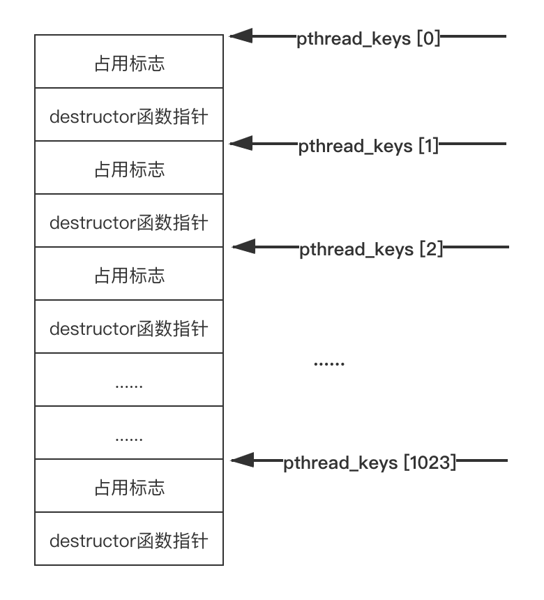

# thread杂项

## 如何确保创建的线程一定运行起来？
很少有人会注意到创建的线程如何确保一定运行起来了？很多人会说，对于使用系统 API 创建的线程，只需要判断一下创建的线程函数是否是调用成功的，这只做了一步，线程函数调用成功，也没法百分百保证线程函数一定运行起来了。

在一些“古老”或者“严谨”的项目中，你会发现这些代码创建线程时不仅判断线程创建函数是否调用成功，还会在线程函数中利用上文介绍的一些线程同步对象来通知线程的创建者线程是否创建成功。我们来看一段这样的代码：
```c++
#include <thread>
#include <mutex>
#include <condition_variable>
#include <iostream>

std::mutex 				mymutex;
std::condition_variable mycv;
bool success = false;

void thread_func()
{
    {
        std::unique_lock<std::mutex> lock(mymutex);
        success = true;
        mycv.notify_all();
    }

    //实际的线程执行的工作代码放在下面
    //这里为了模拟方便，简单地写个死循环
    while (true)
    {

    }
}

int main()
{
    std::thread t(thread_func);

    //使用花括号减小锁的粒度
    {
        std::unique_lock<std::mutex> lock(mymutex);
        while (!success)
        {
            mycv.wait(lock);
        }
    }

    std::cout << "start thread successfully." << std::endl;

    t.join();

    return 0;
}
```

上述代码，发出一个创建新线程的请求后，立刻阻塞在一个条件变量上，工作线程如果成功运行起来，会发送条件变量信号告知主线程，这样主线程就知道新线程一定成功运行起来了。

基于以上思路，我们创建一组线程时，可以一个一个地创建，每成功运行一个新线程再创建下一个，确保线程组中的每一个线程都可以运行起来。示例代码如下：
```c++
#include <thread>
#include <mutex>
#include <condition_variable>
#include <iostream>
#include <vector>
#include <memory>

std::mutex 				mymutex;
std::condition_variable mycv;
bool success = false;

void thread_func(int no)
{
    {
        std::unique_lock<std::mutex> lock(mymutex);
        success = true;
        mycv.notify_all();
    }

    std::cout << "worker thread started, threadNO: " << no << std::endl;
    //实际的线程执行的工作代码放在下面
    //这里为了模拟方便，简单地写个死循环
    while (true)
    {

    }
}

int main()
{
    std::vector<std::shared_ptr<std::thread>> threads;
    
    for (int i = 0; i < 5; ++i)
    {
        success = false;
        std::shared_ptr<std::thread> spthread;
        spthread.reset(new std::thread(thread_func, i));

        //使用花括号减小锁的粒度
        {
            std::unique_lock<std::mutex> lock(mymutex);
            while (!success)
            {
                mycv.wait(lock);
            }
        }

        std::cout << "start thread successfully， index: " << i << std::endl;

        threads.push_back(spthread);
    }

    for (auto& iter : threads)
    {
        iter->join();
    }

    return 0;
}
```

编译上述程序并运行，运行结果如下所示：
```shell
[root@localhost codes]# g++ -g -o makesurethreadgroup makesurethreadgroup.cpp -std=c++0x -lpthread
[root@localhost codes]# ./makesurethreadgroup 
worker thread started, threadNO: 0
start thread successfully， index: 0
worker thread started, threadNO: 1
start thread successfully， index: 1
worker thread started, threadNO: 2
start thread successfully， index: 2
worker thread started, threadNO: 3
start thread successfully， index: 3
worker thread started, threadNO: 4
start thread successfully， index: 4
```

可以看到，新线程挨个运行起来。当然，你不一定要使用条件变量，也可以使用其他类型的线程同步对象，如 Windows 平台的 Event 对象等等。

确保线程一定运行起来的做法时使用了两个词——“古老”和“严谨”，“严谨”不用多介绍，之所以说“古老”是因为现在在各种新型的项目中基本上再也看不到这种确保线程运行起来的做法了，许多年以前多线程编程开始流行起来的时候，那时由于软硬件的水平限制，加之很多开发人员对多线程编程技术的不熟悉，创建新线程时确保一个线程跑起来非常必要；而如今多线程编程已经如此的司空见惯，加上操作系统和 CPU 普遍对多线程技术的支持，我们再也不用写这样的“防御“代码了；甚至只要你正确使用线程创建函数，我们实际编码时连线程函数的返回值都不必判断，基本上可以认为新线程一定会创建成功，且线程可以正常跑起来。

## 多线程使用锁实践经验总结

### 减少锁的使用
实际开发中能不使用锁尽量不使用锁，当然这不是绝对的，如果使用锁也能满足性能要求，使用锁也无妨，一般使用了锁的代码会带来如下性能损失：

- 加锁和解锁操作，本身有一定的开销；

- 临界区的代码不能并发执行；

- 进入临界区的次数过于频繁，线程之间对临界区的争夺太过激烈，若线程竞争互斥体失败，就会陷入阻塞，让出 CPU，所以执行上下文切换的次数要远远多于不使用互斥体的版本。

替代锁的方式有很多，如无锁队列。


### 明确锁的范围
看下面这段代码：
```c++
if(hashtable.is_empty())
{
    pthread_mutex_lock(&mutex);
    htable_insert(hashtable, &elem);
    pthread_mutex_unlock(&mutex);
}
```

能看出这段代码的问题吗？虽然对 hashtable 的插入使用了锁做保护，但是判断 hash_table 是否为空也需要使用锁保护，所以正确的写法应该是：
```c++
pthread_mutex_lock(&mutex);
if(hashtable.is_empty())
{
    htable_insert(hashtable, &elem);
}
pthread_mutex_unlock(&mutex);
```

### 减少锁的粒度
所谓减小锁使用粒度指的是尽量减小锁作用的临界区代码范围，临界区的代码范围越小，多个线程排队进入临界区的时间就会越短。这就类似高速公路上堵车，如果堵车的路段越长，那么后续过来的车辆通行等待时间就会越长。

来看两个具体的例子：

**示例一**

```c++
void TaskPool::addTask(Task* task)
{
    std::lock_guard<std::mutex> guard(m_mutexList); 
    std::shared_ptr<Task> spTask;
    spTask.reset(task);            
    m_taskList.push_back(spTask);
          
    m_cv.notify_one();
}
```

上述代码中 guard 锁保护 m_taskList，仔细分析下这段代码发现，除了m_taskList其他代码其实没必要作为临界区内的代码的，所以建议挪到临界区外面去，修改如下：
```c++
std::shared_ptr<Task> spTask;
spTask.reset(task);
{
    std::lock_guard<std::mutex> guard(m_mutexList);
    m_taskList.push_back(spTask);  
}
m_cv.notify_one();
```
修改之后， guard 锁的作用范围就只有两行了，仅对 **m_taskList.push_back() ** 操作做保护，这样锁的粒度就变小了。

**示例二**
```c++
void EventLoop::doPendingFunctors()
{
    std::unique_lock<std::mutex> lock(m_mutex);
	for (size_t i = 0; i < m_pendingFunctors.size(); ++i)
	{
		m_pendingFunctors[i]();
	}
}
```

上述代码中 m_pendingFunctors 是被锁保护的对象，它的类型是 std::vector<Functor>，这样的代码效率比较低，必须等当前线程挨个处理完 m_pendingFunctors 中的元素后其他线程才能操作 m_pendingFunctors 。修改代码如下：

```c++
void EventLoop::doPendingFunctors()
{
	std::vector<Functor> functors;
	
	{
		std::unique_lock<std::mutex> lock(m_mutex);
		functors.swap(m_pendingFunctors);
	}

	for (size_t i = 0; i < functors.size(); ++i)
	{
		functors[i]();
	}	
}
```

修改之后的代码使用了一个局部变量 functors，然后把 m_pendingFunctors 中的内容倒换到 functors 中，这样就可以释放锁了，允许其他线程操作 m_pendingFunctors ，现在只要继续操作本地对象 functors 就可以了，提高了效率。

### 避免死锁的一些建议
**一个函数中，如果有一个加锁操作，那么一定要记得在函数退出时记得解锁，且每个退出路径上都不要忘记解锁路径。** 例如：

```c++
void some_func()
{
	//加锁代码
	
	if (条件1)
	{
		//其他代码
		//解锁代码
		return;
	} 
	else
	{
		//其他代码
		//解锁代码
		return;
	}
	
	
	if (条件2)
	{
		if (条件3)
		{
			//其他代码
			//解锁代码
			return;
		}
		
		if (条件4)
		{
			//其他代码
			//解锁代码
			return;
		}	
	} 
	
	while (条件5)
	{
		if (条件6)
		{
			//其他代码
			//解锁代码
			return;
		}
	}
}
```

上述函数中每个逻辑出口处都需要写上解锁代码。前面也说过，这种逻辑非常容易因为疏忽忘记在某个地方加上解锁代码而造成死锁，所以一般建议使用 RAII 技术将加锁和解锁代码封装起来，也就是说，我们可以定义一个锁对象包装类，其成员变量含有一个锁对象，在该包装类的构造函数中对锁对象进行加锁，在析构函数中对锁对象进行解锁，这样在函数出口处，锁对象包装类由于出了作用域被析构进而对其锁对象进行解锁。按照这个方法则上述代码就不需要在每个出口处加上解锁代码了：

```c++
//锁
class LockWrapper final
{
public:
	LockWrapper(SomeLock& lock) : someLock(lock)
	{
		//对someLock进行加锁
	}
	
	~LockWrapper()
	{
		//对someLock进行解锁
	}

private:
	//某个锁对象，如std::mutex、pthread_mutex_t等类型
	SomeLock&   someLock;
};

void some_func()
{
	SomeLock someLock;
	//在LockWrapper中对someLock进行加锁
	LockWrapper wrapper(someLock);
	
	if (条件1)
	{
		//其他代码
		return;
	} 
	else
	{
		//其他代码
		return;
	}
	
	
	if (条件2)
	{
		if (条件3)
		{
			//其他代码
			return;
		}
		
		if (条件4)
		{
			//其他代码
			return;
		}	
	} 
	
	while (条件5)
	{
		if (条件6)
		{
			//其他代码
			return;
		}
	}
}
```

这种利用 RAII 技术实现自动加解锁的方法，如boost::scoped_lock 和 std::lock_guard 的实现。

- **线程退出时一定要及时释放其持有的锁**

实际开发中会因一些特殊需求创建一些临时线程，这些线程执行完相应的任务后就会退出。对于这类线程，如果其持有了锁，在线程退出时，一定要记得释放其持有的锁对象。

- **多线程请求锁的方向要一致，以避免死锁**

假设现在有两个锁 A 和 B，线程 1 在请求了锁 A 之后再请求 B，线程 2 在请求了锁 B 后再请求锁 A，这种线程请求锁的方向就不一致了，线程 1 的方向是从 A 到 B，线程 2 的方向是从 B 到 A，多个线程请求锁的方向不一致容易造成死锁。所以建议的方式是 线程 1 和 线程 2 请求锁的方向保持一致，要么都从 A 到 B，要么都从 B 到 A。

- **当需要同一个线程重复请求一个锁时，搞清楚你所使用的锁的行为，是递增锁引用计数，还是会阻塞抑或是直接获得锁？**

### 避免活锁的一些建议
说了避免“死锁”，应该比较容易理解，但是这里出现的避免“活锁”。所谓活锁就是，当多个线程使用 trylock 系列的函数时，由于多个线程相互谦让，导致即使在某段时间内锁资源是可用的，也可能导致需要锁的线程拿不到锁。举个生活中的例子，马路上两个人迎面走来，两个人同时往一个方向避让，原来本意是给对方让路，结果还是发生了碰撞。

我们在实际编码时，尽量避免让过多的线程使用 trylock 请求锁，以免出现“活锁”现象，这是对资源的一种浪费。

## 线程局部存储
对于一个存在多个线程的进程来说，有时候我们需要有一份数据是每个线程都拥有一份的，也就是说每个线程自己操作自己的这份数据，这有点类似 C++ 类的实例属性，每个实例对象操作的都是自己的属性。我们把这样的数据称之为线程局部存储（Thread Local Storage，TLS），对应的存储区域叫做线程局部存储区。

### Windows 的线程局部存储
Windows 系统将线程局部存储区分成 TLS_MINIMUM_AVAILABLE 个块，每一块通过一个索引值对外提供访问。

```c++
//TLS_MINIMUM_AVAILABLE 的默认是 64，在 winnt.h 中定义：
#define TLS_MINIMUM_AVAILABLE 64
```
Windows 中使用函数 TlsAlloc 获得一个线程局部存储块的索引：

```c++
DWORD TlsAlloc();
```

如果这个函数调用失败，返回值是 TLS_OUT_OF_INDEXES（0xFFFFFFFF）；如果函数调用成功，得到一个索引，接下来就可以利用这个索引去往这个内存块中存储数据或者从这个内存块中得到数据，分别使用如下两个 API 函数：

```c++
LPVOID TlsGetValue(DWORD dwTlsIndex);
BOOL TlsSetValue(DWORD dwTlsIndex, LPVOID lpTlsValue);
```

当你不再需要这个存储区域时，你应该释放它，释放调用函数：

```c++
BOOL TlsFree(DWORD dwTlsIndex);
```

当然，使用线程局部存储除了使用上面介绍的 API 函数外，Microsoft VC++ 编译器还提供了如下方法定义一个线程局部变量：

```c++
__declspec(thread) int g_mydata = 1;
```

我们看一个具体例子：
```c++
#include <Windows.h>
#include <iostream>

__declspec(thread) int g_mydata = 1;

DWORD __stdcall WorkerThreadProc1(LPVOID lpThreadParameter)
{
    while (true)
    {
        ++g_mydata;
        
        Sleep(1000);
    }
    return 0;
}

DWORD __stdcall WorkerThreadProc2(LPVOID lpThreadParameter)
{
    while (true)
    {       
        std::cout << "g_mydata = " << g_mydata << ", ThreadID = " << GetCurrentThreadId() << std::endl;
        
        Sleep(1000);
    }
    return 0;
}

int main()
{
    HANDLE hWorkerThreads[2];
    hWorkerThreads[0] = CreateThread(NULL, 0, WorkerThreadProc1, NULL, 0, NULL);
    hWorkerThreads[1] = CreateThread(NULL, 0, WorkerThreadProc2, NULL, 0, NULL);
    
    CloseHandle(hWorkerThreads[0]);
    CloseHandle(hWorkerThreads[1]);

    while (true)
    {
        Sleep(1000);
    }
    
    return 0;
}
```

上述代码中全局变量 g_mydata 是一个线程局部变量，因此该进程中每一个线程都会拥有这样一个变量副本，由于是不同的副本，WorkerThreadProc1 中将这个变量不断递增，对 WorkerThreadProc2 的 g_mydata 不会造成任何影响，因此其值始终是 1。

> 需要说明的是，在 Windows 系统中被声明成线程局部变量的对象，在编译器生成可执行文件时，会在最终的 PE 文件中专门生成一个叫 tls 的节，这个节用于存放这些线程局部变量。

### Linux 的线程局部存储
Linux 系统上的 NTPL 提供了一套函数接口来实现线程局部存储的功能：
```c++
int pthread_key_create(pthread_key_t* key, void (*destructor)(void*));
int pthread_key_delete(pthread_key_t key);

int pthread_setspecific(pthread_key_t key, const void* value);
void* pthread_getspecific(pthread_key_t key);
```

**pthread_key_create 函数** 调用成功会返回 0 值，调用失败返回非 0 值，函数调用成功会为线程局部存储创建一个新键，用户通过参数 key 去设置（调用 pthread_setspecific）和获取（pthread_getspecific）数据，因为进程中的所有线程都可以使用返回的键，所以参数 key 应该指向一个全局变量。

参数 destructor 是一个自定义函数指针，其签名是：
```c++
void* destructor(void* value)
{
    /*多是为了释放value指针指向的资源*/
}
```

线程终止时，如果 key 关联的值不是 NULL，那么 NTPL 会自动执行定义的 destructor 函数；如果无须 解构，可以将 destructor 设置为 NULL。

我们来看一个具体例子：

```c++
#include <pthread.h>
#include <stdio.h>
#include <stdlib.h>

//线程局部存储key
pthread_key_t thread_log_key;

void write_to_thread_log(const char* message)
{
	if (message == NULL)
		return;
	
	FILE* logfile = (FILE*)pthread_getspecific(thread_log_key);
	fprintf(logfile, "%s\n", message);
	fflush(logfile);
} 

void close_thread_log(void* logfile)
{
	char logfilename[128];
	sprintf(logfilename, "close logfile: thread%ld.log\n", (unsigned long)pthread_self());
	printf(logfilename);
	
	fclose((FILE *)logfile);
} 

void* thread_function(void* args)
{
	char logfilename[128];
	sprintf(logfilename, "thread%ld.log", (unsigned long)pthread_self());
	
	FILE* logfile = fopen(logfilename, "w");
	if (logfile != NULL)
	{
		pthread_setspecific(thread_log_key, logfile);
	
		write_to_thread_log("Thread starting...");
	}
	
	return NULL;
} 

int main()
{
	pthread_t threadIDs[5];	
	pthread_key_create(&thread_log_key, close_thread_log);
	for(int i = 0; i < 5; ++i)
	{
		pthread_create(&threadIDs[i], NULL, thread_function, NULL);
	}
	
	for(int i = 0; i < 5; ++i)
	{
		pthread_join(threadIDs[i], NULL);
	}
	
	return 0;
}
```
上述程序一共创建 5 个线程，每个线程都会自己生成一个日志文件，每个线程将自己的日志写入自己的文件中，当线程执行结束时，会关闭打开的日志文件句柄。

生成的 5 个日志文件中，其内容都写入了一行“Thread starting...”。

上面的程序首先调用 pthread_key_create 函数来申请一个槽位。在NPTL实现下，pthread_key_t 是无符 号整型，pthread_key_create 调用成功时会将一个小于1024 的值填入第一个入参指向的 pthread_key_t 类型 的变量中。之所以小于1024，是因为 NPTL 实现一共提供了1024个槽位。 如图下图所示，记录槽位分配情况的数据结构 pthread_keys 是进程唯一的，pthread_keys 结构示意图如下：


和 Windows 一样 Linux gcc 编译器也提供了一个关键字 __thread 去简化定义线程局部变量。例如：

> __thread int val = 0;

再来看一个示例：
```c++
#include <pthread.h>
#include <iostream>
#include <unistd.h>

//线程局部存储key
__thread int g_mydata = 99;

void* thread_function1(void* args)
{
	while (true)
	{
		g_mydata ++;
	}
	
	return NULL;
} 

void* thread_function2(void* args)
{
	while (true)
	{		
		std::cout << "g_mydata = " << g_mydata << ", ThreadID: " << pthread_self() << std::endl;
		sleep(1);
	}
	
	return NULL;
} 

int main()
{
	pthread_t threadIDs[2];	
	pthread_create(&threadIDs[0], NULL, thread_function1, NULL);
	pthread_create(&threadIDs[1], NULL, thread_function2, NULL);
	
	for(int i = 0; i < 2; ++i)
	{
		pthread_join(threadIDs[i], NULL);
	}
	
	return 0;
}
```

由于 thread_function1 修改的是自己的 g_mydata，因此 thread_function2 输出 g_mydata 的值始终是 99。

```shell
[root@localhost testmultithread]# g++ -g -o linuxtls2 linuxtls2.cpp -lpthread
[root@localhost testmultithread]# ./linuxtls2
g_mydata = 99, ThreadID: 140243186276096
g_mydata = 99, ThreadID: 140243186276096
g_mydata = 99, ThreadID: 140243186276096
g_mydata = 99, ThreadID: 140243186276096
g_mydata = 99, ThreadID: 140243186276096
g_mydata = 99, ThreadID: 140243186276096
g_mydata = 99, ThreadID: 140243186276096
g_mydata = 99, ThreadID: 140243186276096
g_mydata = 99, ThreadID: 140243186276096
g_mydata = 99, ThreadID: 140243186276096
g_mydata = 99, ThreadID: 140243186276096
...更多输出结果省略...
```

### C++ 11 的 thread_local 关键字
C++ 11 标准提供了一个新的关键字 thread_local 来定义一个线程变量。使用方法如下：

> thread_local int g_mydata = 1;

有了这个关键字，使用线程局部存储的代码就可以同时在 Windows 和 Linux 上运行了。示例如下：

```c++
#include <thread>
#include <chrono>
#include <iostream>

thread_local int g_mydata = 1;

void thread_func1()
{
	while (true)
	{
		++g_mydata;
	}
}

void thread_func2()
{
	while (true)
	{
		std::cout << "g_mydata = " << g_mydata << ", ThreadID = " << std::this_thread::get_id() << std::endl;
		std::this_thread::sleep_for(std::chrono::seconds(1));
	}
}

int main()
{
	std::thread t1(thread_func1);
	std::thread t2(thread_func2);

	t1.join();
	t2.join();

	return 0;
}
```

需要注意的是，如果是在 Windows 平台下，虽然 thread_local 关键字在 C++ 11 标准中引入，但是 Visual Studio 2013 （支持 C++ 11 语法的最低的一个版本）编译器却并不支持这个关键字，建议在 Visual Studio 2015 及以上版本中测试上述代码。

最后，关于线程局部存储变量，我还需要再强调两点：

- 对于线程变量，每个线程都会有该变量的一个拷贝，并行不悖，互不干扰，该局部变量一直都在，直到线程退出为止。

- 系统的线程局部存储区域内存空间并不大，所以尽量不要利用这个空间存储大的数据块，如果不得不使用大的数据块，可以将大的数据块存储在堆内存中，再将该堆内存的地址指针存储在线程局部存储区域。


