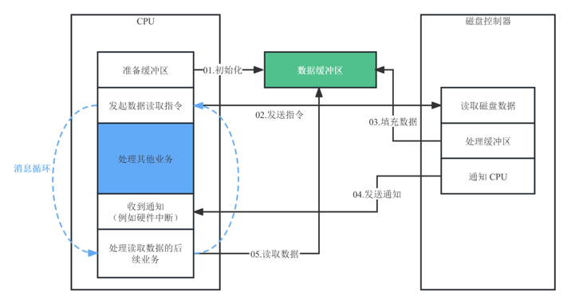

# Coroutines背景：异步I/O的复杂性
在日常工作中，我们经常会碰到有关异步编程的问题。但由于绝大多数异步计算都跟I/O有关，因此在很多现代编程语言中，都支持异步编程，并提供相关的工具。

不过在C++20以前，异步编程从未在C++语言层面得到支持，标准库的支持更是无从说起。往往需要借助其他库或者操作系统相关的编程接口，来实现C++中的异步编程，特别是异步I/O。比如libuv、MFC，它们都提供了对消息循环和异步编程的支持。

下面主要讨论C++ coroutines。为了更好地理解C++ coroutines，有必要先弄清楚同步与异步、并发与并行的概念以及它们之间的区别。同时还会通过传统C++解决方案实现异步I/O编程体验一下这种实现的复杂度。这样学习C++ coroutines的时候，更容易体会到它的优势以及解决了哪些棘手问题。

## 同步与异步

同步与异步的概念比较容易理解。所谓“同步”，指的是多个相关事务必须串行执行，后续事务需要等待前一事务完成后再进行。

日常使用的iostream，本质上就是一种同步I/O，在发起I/O任务后当前线程就会一直阻塞等待，直到当前任务完成后才会继续后续任务，同时不会处理其他的任务。

与同步相对的就是异步。所谓“异步”，指的是多个相关事务可以同时发生，并通过消息机制来回调对应的事务是否执行结束。

异步常被用于网络通信以及其他I/O处理中，其中网络通信可以认为是一种特殊的I/O，它通过网络适配器完成输入和输出操作。

在异步I/O中，发送网络请求、读写磁盘、发送中断等操作启动后并不会阻塞当前线程，当前线程还是会继续向下执行，当某个I/O任务完成后，程序会按照约定机制通知并发起I/O的任务。

通过后面这张图，可以看到同步和异步的区别。


从图中可以看出：

- 在同步任务中，主线程向硬件发出I/O请求后就需要等待硬件处理完成，这个时间内不能处理其他任何业务，因此这段时间浪费了CPU资源。
- 而在异步任务中，主线程向硬件发出I/O请求后还能继续处理其他的业务。因此，可以充分利用硬件工作的这段时间去处理其他业务，异步模式下可以更充分地利用CPU资源。

因此，相较于同步，异步系统在提升计算机资源的利用率方面有着先天优势，在现实环境的系统中也会优先考虑使用异步来解决I/O问题。

从计算机体系结构的层面来看，一个程序无论是向硬件写入数据还是从硬件读取数据，都需要事先准备好一个缓冲区。在这个基础上，CPU会通知硬件控制器将缓冲区数据写出（输出）或者将数据写入到缓冲区（输入），完成后再通过中断等方式通知CPU。

这个过程示意图如下。



可以看到，图中的消息循环，通过缓冲区实现了异步通知和调用。这两个消息循环的执行互不干扰，没有执行的先后之分，可以充分利用计算机资源。

## 并发与并行

除了同步与异步，也经常讨论并发与并行的概念。并发与并行的本质都是一种异步的计算模式，都是指一个计算单元，在一个时段内可以同时处理多个计算任务。

不过它们之前存在差别。并发无需多个计算任务真的同时执行。程序可以选择先执行任务A的一部分，再执行任务B的一部分，然后回到任务A继续执行……如此往复。但是，并行要求多个任务一定是同时执行的。

因此，在出现多核心CPU之前，计算任务只能用并发的方法处理。那个时候为了实现并行计算，需要在多台计算机上以多机并行的方式处理。类似地，现如今经常讨论的分布式计算，其实属于并行计算的一种泛化。

异步能够充分利用计算资源，而并行与并发为异步计算提供了不同的实现思路。

## C++的传统异步I/O实现

理解了异步是怎么回事，还需要掌握C++实现异步计算的方法，特别是在C++ coroutines出现之前的传统方案，这有助于理解现代标准下的异步实现方式。

因此回到异步I/O上，看看C++到底是如何解决异步I/O问题的。

### C++线程库

事实上，在C++20以前，C++标准库只提供了一种标准化异步处理技术——线程库。因此，对传统异步I/O，我们会使用C++11开始提供的线程库来实现消息循环。

C++11中线程库的核心是std::thread类。我们可以使用thread构造一个线程对象，构造函数接受一个函数或者函数对象作为参数，并立即开始执行。线程内部的具体实现，则需要依赖于操作系统底层调度。这里给出了一个最简单的线程实例，代码是后面这样。

```c++
#include <thread>
#include <iostream>
#include <cstdint>
 
static void count(int32_t maxValue) {
    int32_t sum = 0;
    for (int32_t i = 0; i < maxValue; i++) {
        sum += i;
        std::cout << "Value: " << i << std::endl;
    }
 
    std::cout << "Sum: " << sum << std::endl;
}
 
int main() {
    std::thread t(count, 10); // 创建线程对象，将10传递给线程的主执行函数
    t.join(); // 等待线程执行结束
    std::cout << "Join之后" << std::endl;
 
    return 0;
}
 
```

在这段代码中，创建了一个thread对象t，该线程以函数count为入口函数，以10为参数。当计算完所有数的和之后，会输出求和结果，并且退出主线程。同时，主线程启动t后，会使用join等待子线程结束，然后继续执行后续工作。最后输出截图是这样的。


### 简单的异步文件操作

好的，在简单回顾了C++11的线程库的基本用法以后，来看下如何实现异步文件操作。代码如下。

```c++
#include <filesystem> // C++17文件系统库
#include <iostream>   // 标准输出
#include <thread> // 线程库
 
namespace fs = std::filesystem;
 
void createDirectoriesAsync(std::string directoryPath) {
    std::cout << "创建目录: " << directoryPath << std::endl;
    fs::create_directories(directoryPath);
}
 
int main() {
    std::cout << "开始任务" << std::endl;
 
    // 创建三个线程对象
    std::thread makeDirTask1(createDirectoriesAsync, "dir1/a/b/c");
    std::thread makeDirTask2(createDirectoriesAsync, "dir2/1/2/3");
    std::thread makeDirTask3(createDirectoriesAsync, "dir3/A/B/C");
 
    // 等待线程执行结束
    makeDirTask1.join();
    makeDirTask2.join();
    makeDirTask3.join();
    std::cout << "所有任务结束" << std::endl;
 
    return 0;
}
 
```

在这段代码中，先定义了createDirectoriesAsync函数，该函数用于发起一个创建目录的异步任务，使用了C++17开始提供的文件系统库来创建目录。

接着，在main函数中创建了三个异步任务，给每个任务分别创建对应的目录。这三个任务会同时启动并独立执行。在这些线程对象上调用join，让主线程等待这三个线程结束。

不难发现，虽然这种实现方式很好地解决了异步并发问题。但是无法直接从线程的执行中获取处理结果，从编程的角度来看不够方便，而且线程执行过程中发生的异常也无法得到妥善处理。

为了解决这类问题，C++11提供了更完善的线程调度和获取线程返回结果的工具，这就是future和promise。类似地直接给出代码实现。

```c++
#include <filesystem>
#include <iostream>
#include <future>
#include <exception>
 
namespace fs = std::filesystem;
 
void createDirectoriesAsync(
    std::string directoryPath,
    std::promise<bool> promise
) {
    try {
        std::cout << "创建目录: " << directoryPath << std::endl;
        bool result = fs::create_directories(directoryPath);
 
        promise.set_value(result);
    } catch (...) {
        promise.set_exception(std::current_exception());
        promise.set_value(false);
    }
}
 
int main() {
    std::cout << "开始任务" << std::endl;
 
    std::promise<bool> taskPromise1;
    std::future<bool> taskFuture1 = taskPromise1.get_future();
    std::thread makeDirTask1(createDirectoriesAsync, "dir1/a/b/c", std::move(taskPromise1));
 
    std::promise<bool> taskPromise2;
    std::future<bool> taskFuture2 = taskPromise2.get_future();
    std::thread makeDirTask2(createDirectoriesAsync, "dir2/1/2/3", std::move(taskPromise2));
 
    std::promise<bool> taskPromise3;
    std::future<bool> taskFuture3 = taskPromise3.get_future();
    std::thread makeDirTask3(createDirectoriesAsync, "dir3/A/B/C", std::move(taskPromise3));
 
    taskFuture1.wait();
    taskFuture2.wait();
    taskFuture3.wait();
 
    std::cout << "Task1 result: " << taskFuture1.get() << std::endl;
    std::cout << "Task2 result: " << taskFuture2.get() << std::endl;
    std::cout << "Task3 result: " << taskFuture3.get() << std::endl;
 
    makeDirTask1.join();
    makeDirTask2.join();
    makeDirTask3.join();
 
    std::cout << "所有任务结束" << std::endl;
    return 0;
}
 
```

来比较一下这段代码实现和前面的有什么不同。可以看到，这里定义的createDirectoriesAsync函数多了一个参数，接受类型为std::promise<bool> 的参数。对promise，有两个成员函数供我们调用。

- set_value将线程的返回值返回给线程的调用者。
- set_exception将异常返回给线程的调用者。

在createDirectoriesAsync函数中，我们调用fs::create_directories创建目录，并通过promise.set_value将结果记录到promise对象中。

为了将线程的返回值或异常信息传递出去，返回给调用者做进一步处理。我们还使用try/catch将执行代码块包裹起来，在发生异常时通过std::current_exception获取异常信息，并通过promise.set_exception记录把异常信息记录到promise对象中。

接着，在main函数中，每次创建makeDirTask之前，我们都创建了一个promise对象，通过promise.get_future()成员函数获取promise对应的future对象。每个future对象对应着一个线程。在后续代码中，我们通过wait函数进行等待，直到获取到线程的结果为止，然后通过get获取线程的结果。最后，在所有线程join后退出程序。

可以看到，我们可以通过这种模式来获取函数的处理结果和异常信息，就能实现更精细化的线程同步和线程调度。

### 性能资源与线程池

回顾一下前面的代码实现，我们为每个异步动作创建了一个新线程，这样的实现虽然可以正常执行，但存在两方面问题。

一方面，每个线程的创建和销毁都需要固定的性能消耗与资源消耗。异步任务粒度越小，这种固定消耗带来的影响也就越大。此外，频繁地创建和销毁小对象可能也会引发内存碎片，导致内存难以在后续程序中有效回收使用。

另一方面的问题是，并发线程过多，反而会引发整体性能下降。线程的并行能力取决于CPU的核心数与线程数，超过这个数量后，线程之间就无法真正并行执行了。同时，线程之间的频繁切换也会带来一定性能损耗。需要切换线程栈，重新装载指令，同时可能引发CPU流水线机制失效。

因此，如果用多线程实现异步，就需要知道如何控制线程的创建销毁过程以及同时执行的线程数。为了提升执行中的线程的性能，让资源利用得更充分，往往就需要使用线程池这一技术。

所谓线程池，就是一个包含固定可用线程的资源池（比如固定包含5个可用线程）。有了线程池，可以更充分地利用CPU的并行、并发能力，同时避免给系统带来不必要的负担。

那线程池的工作机制是怎样的呢？当需要启动一个异步任务的时候，我们会调用线程池的函数从这些线程中选择一个空闲线程执行任务，任务结束后将线程放回空闲线程中。如果线程池中不包含空闲线程，那么这些任务就会等待一段时间，直到有任务结束出现空闲线程为止。

除此之外，我们还需要解决多线程系统下的数据竞争问题，我们必须有一种“数据屏障”的方法，在一个线程访问竞争区域时“阻挡”其他线程的访问，避免一起访问竞争区域引发无法预料的问题。最简单的一种方案就是通过C++11提供的互斥锁——mutex来解决，通常来说，我们可以通过结合lock_guard和mutex来避免多线程调用时的资源竞争问题。

## 总结

首先异步的特性，异步能够充分利用计算资源，同时并行与并发为异步计算提供了不同的实现思路。

在C++20以前，C++标准库只提供了一种标准化异步处理技术——线程库。我们可以通过promise和future在父子线程之间传递处理结果与异常。但考虑到性能与资源管理问题，我们还需要借助于线程池和互斥锁来实现代码。

事实上，通过线程这种方案来处理异步I/O问题是相当复杂的。无论是库的实现者还是调用者，都需要考虑大量的细节。与此同时，和多线程相伴的死锁问题会成为系统中的一颗定时炸弹，在复杂的业务中随时“爆炸”，调试解决起来非常难。

那么，C++20之后，是否有什么更好的方案来解决异步I/O问题呢？

# Coroutines：“零”开销降低异步编程复杂度
上面看到在传统的C++异步方案中，想要实现高效易用的异步方案是非常困难的。好消息是从C++20开始，提供了一个全新的解决异步问题（特别是异步I/O）的方案——那就是协程。

协程提供了泛化的协作式多任务模型，在并发计算和高性能I/O领域有着广泛的应用，相较于多线程或多进程运行时来说，可以实现几乎“零”开销的代码调度。虽说如此，协程并不是一个新概念，早在1958年Melvin E. Conway就提出这一概念，早期的C++也支持基于协程的任务模型编程。

但是，早期C++对协程的支持简陋且不可移植。与此同时，协程在设计上相较于规范函数调用来说更加泛化，因此针对C++的标准化协程方案很难得到一致认可。经过几十年的探索和努力，C++20及其后续演进中终于回归了标准化协程（C++ coroutines）。

由于以往的协程都被编写在非常底层的实现上，因此常见的应用系统上很少使用它。

但这次标准化让它重回大众视野，也启发了我们用另一种思维模式来解决高性能计算问题——通过协程，就能在几乎零性能开销的情况下，大幅降低异步编程复杂度。甚至可以说， **标准化协程促使C++20成长为全新的编程模型**，让我们用现代C++解决工程问题时更加游刃有余。

这是一次令人激动的C++标准化核心语言特性推进。

## 定义C++协程

现代C++20标准下的协程， **是一种可休眠、可恢复、不基于栈实现的函数**。为了方便起见，后续提到的“协程”均特指C++20及其后续演进标准中的协程。

协程相较于函数来说是一个更加泛化的概念。函数只有“调用”和“返回”两个行为，而协程在这一基础上进行了扩展，增加了“休眠”和“恢复”。


与此同时，协程这一核心语言特性不会定义协程的语义，库开发者需要根据一定的规则实现所需的接口约定，包括后面这些约定。

1. 调用者的传参方式。
2. 将值返回给调用者的方式。
3. 休眠与恢复执行的规则。
4. 异常处理方式。

由于C++协程属于无栈协程，因此C++并没有提供标准调度器，开发者必须在定义上述接口后，基于C++提供的关键字在协程调用函数中手动处理协程的调度。

协程的泛化特性在这里进一步展现，编译器在生成协程代码时，会调用库开发者定义的行为——即实现好的、标准的接口规定。

## 协程的执行

在掌握了协程的基本定义后，发现协程可以被认作是一种函数的扩展或泛化。为了进一步理解协程的工作机制，来看看协程在运行时的行为和生命周期管理。

前面说过相较于函数，协程是一种可休眠、可恢复、不基于栈实现的函数。因此，它的生命周期管理自然与普通函数不同。也可以预见，C++中的协程是基于堆来实现的。下图展示了协程与函数交互的过程。


根据图中的序号逐一解释每个过程。

1. 调用函数在堆上创建协程帧（coroutine frame），用于存储协程的各类数据。协程帧的结构属于内存模型，因此不同编译器可能会有不同实现。
2. 调用被调协程，开始执行协程代码。
3. 被调协程执行到某个特定点，通过co_await/co_yield将当前协程休眠，线程1恢复自身原本的执行流程继续执行剩余代码。co_await与co_yield。
4. 线程2通过协程句柄coroutine_handle的恢复函数resume恢复协程执行。
5. 协程在线程2上恢复执行，继续向下执行，直到协程执行结束为止。结束后回到线程2的原本执行流程继续执行代码。
6. 最后，线程2负责通过协程句柄coroutine_handle销毁协程帧。

同时，C++中的协程并不会像函数调用那样在栈上执行，它的状态储存在堆上。因此只能在函数调用过程中，通过协程句柄coroutine_handle改变“部分”协程的状态——恢复或销毁。

## Promise

在讲协程的执行时忽略了一些细节。C++的协程要求开发者实现大量接口约定，而很难通过阅读标准文档来编写实际的代码，所以有必要学习一下实现接口约定的实践方法，这对在C++里熟练应用协程非常重要。

实践里，有两个重要的用户自定义类型Promise和Awaitable。先来看看Promise。


Promise其实是异步编程领域（比如JavaScript）中常见的概念和关键字，它用于描述一个未知值的闭包，闭包在C++中以对象的形式体现。我们可以通过Promise对象提供一个值，而这个值会在未来某个时候计算得出。


如上图所示，生成器Generator用来控制协程，包括协程调用、返回值的操作、co_await/co_yield的具体行为以及promise_type的具体定义。那么，这些接口约定该如何实现呢？

我们要从coroutine_traits这一concept开始说起。标准中提供的代码如下。

```c++
template<class, class...>
struct coroutine_traits {};
 
template<class R, class... Args>
requires requires { typename R::promise_type; }
struct coroutine_traits<R, Args...> {
  using promise_type = typename R::promise_type;
};
 
```

从这段代码我们可以看出，实际编程代码中特化的coroutine_traits必须定义一个公有的promise_type成员（见代码第7行）。否则，这就不是一个有效的协程类且属于未定义行为。也就是说，编译器会查找协程类中的promise_type作为Promise，若promise_type不存在，就会发生编译时报错。

与此同时，一个协程类需要包含三个成员，分别是promise_type、coroutine_handle和coroutine_state。

**promise_type** 在协程内操作时使用，它必须满足一定规则的类型，包含一系列约束的函数来支持休眠和恢复等功能，包括提交协程的返回值、提交协程异常。通常来说，编译器会通过promise_type的具体实现来判断协程是否合法。

**coroutine_handle** 在协程外部操作时使用，可供调用者使用来休眠协程。它的类型是标准库提供的模板类，封装了协程帧的指针以及恢复、销毁协程帧的接口。

**coroutine_state** 用于支持协程的生命周期，是运行时分配在堆（如果开启了编译器优化选项，则有可能会被优化使用寄存器）上的对象，目的是进一步规范说明协程执行时在堆上创建的数据，包括以下内容。

- promise对象
- 参数（在协程创建时，会拷贝所有函数参数进入协程帧）
- 当前休眠的状态（在运行时，供后续恢复或销毁协程帧使用）
- 局部变量（在运行时，供协程帧使用）
- 临时变量（在运行时，供协程帧使用，它的生命周期是整个协程帧的生命周期）

**coroutine_state** 参数还可以细分成这两种情况。

- 值类型的参数会被移动或拷贝。
- 引用类型的参数会拷贝引用，当被引用的内存被释放了，那么协程状态中的引用会变成一个野引用。

这三个成员里，coroutine_state是比较特殊的抽象，是支持协程运行时的。但是需要进一步了解promise_type和coroutine_handle的接口约定，并在编写协程时实现它们。

### promise_type

对于promise_type，它是实现协程的最关键一环。开发者需要自己来实现它，代码如下所示。

```c++
template<typename T>
struct promise;
 
template<typename T>
struct Generator : std::coroutine_handle<promise<T>> {
  using promise_type = promise<T>;
};
 
template<typename T>
struct promise {
  T _value; // 待计算的值
  std::exception_ptr _exception; // 待抛出的异常
 
  template<typename Ty>
  promise(Ty&& lambdaObj, T value) : _value(value) {}
  promise(T value) : _value(value) {}
  promise() {}
 
  Generator<T> get_return_object() { return { Generator<T>::from_promise(*this) }; }
  std::suspend_always initial_suspend() noexcept { return {}; }
  std::suspend_always final_suspend() noexcept { return {}; }
  // optional，但co_yield需要这一函数实现
  std::suspend_always yield_value(T value) {
      _value = value;
      return {};
  }
  // optional，但co_return需要这一函数实现或return_void
  std::suspend_always return_value(T value) {
      _value = value;
      return {};
  }
  void return_void() {}
  void unhandled_exception() { _exception = std::current_exception(); }
};
 
```

关键部分已经在代码里做了注释可以仔细体会一下。

此外，用下图总结了协程生命周期内，这些接口的一般调用顺序，参考使用。


### coroutine_handle

在了解了promise_type的结构后，再来看看标准库提供的coroutine_handle这一模版类的定义。在编写协程代码的过程中，我们需要依据这一接口约定来实现。

标准中提供的代码如下。加了一些注释帮助你理解。

```c++
template<class Promise>
struct coroutine_handle {
  // 构造函数和赋值函数
  constexpr coroutine_handle() noexcept;
  constexpr coroutine_handle(nullptr_t) noexcept;
  static coroutine_handle from_promise(Promise&);
  coroutine_handle& operator=(nullptr_t) noexcept;
 
  // 导入和导出
  constexpr void* address() const noexcept; // 获取coroutine_handle内部数据的指针
  static constexpr coroutine_handle from_address(void* addr); // 将内部数据指针转换为对应的coroutine_handle对象，会创建一个新对象
 
  // 转换函数
  constexpr operator coroutine_handle<void>() const noexcept;
 
  // 查询协程状态
  constexpr explicit operator bool() const noexcept; // 用于确定coroutine_handle是否有效
  bool done() const; // 用于确定协程是否已经执行完成
 
  // 控制协程执行
  void operator()() const; // 行为同resume，用于唤醒协程
  void resume() const; // 用于唤醒协程
  void destroy() const; // 用于销毁协程
 
  // 访问Promise对象
  Promise& promise() const;
 
private:
  void* ptr;  // exposition only
};
 
template<>
struct coroutine_handle<void> {
  // 构造函数和赋值函数
  constexpr coroutine_handle() noexcept;
  constexpr coroutine_handle(nullptr_t) noexcept;
  coroutine_handle& operator=(nullptr_t) noexcept;
 
  // 导入和导出
  constexpr void* address() const noexcept;
  static constexpr coroutine_handle from_address(void* addr);
 
  // 查询协程状态
  constexpr explicit operator bool() const noexcept;
  bool done() const;
 
  // 恢复协程执行
  void operator()() const;
  void resume() const;
  void destroy() const;
 
private:
  void* ptr;  // exposition only
};
 
```

相比于void类型的特化版本，如果开发者指定了promise类型，那么就会用通用版本的coroutine_handle，这个类多了以下几个成员函数。

- from_promise：获取promise对应的coroutine_handle。实际行为会根据promise创建新的coroutine_handle对象。
- operator coroutine_handle<>：将promise版本的coroutine_handle转换为void类型的coroutine_handle。
- promise：获取coroutine_handle内部的promise对象。

两个版本最后一行用“exposition only”标识出来的部分，就是coroutine_handle的内部存储内容，这部分只是为了说明标准做的示例，实际不同编译器可以根据自己的需求定义这里的实现。

## 协程的调度

在了解如何实现协程类型与Promise后，还需要学习如何对协程进行调度，包括协程休眠、控制权转移和待计算值的传递。对协程进行调度的关键在于co_await和co_yield操作符（关键字）。

### co_await

co_await是协程中必须要了解的与编译器的约定。只有了解它，才能知道如何通过co_await灵活处理线程的休眠与唤醒。而搞清楚co_await操作符的具体行为表现，是我们理解Awaitable的重点，我们就从这个操作符开始讲起。

co_await操作符用于休眠协程，并将控制权返还给协程调用者，用法如下。

```c++
co_await 表达式;
 
```

与此同时，co_await的表达式需要满足下列两个条件之一。

1. 表达式类型必须定义了co_await操作符重载。
2. 可以通过当前协程的Promise::await_transform转换为定义了co_await操作符的类型。

请注意，co_await只能出现在函数体的执行表达式中，不能出现在异常处理、声明语句、简单声明表达式、默认参数和带static和thread_local的局部变量定义中。另外，co_await的执行过程较为复杂，其中涉及到两个类型。

1. Awaitable：用于获取Awaiter对象。
2. Awaiter：用于控制实际的休眠操作细节。

下面通过co_await的执行过程来看看这两个类型的作用。我们需要将其分为编译时和运行时两个阶段来理解。先看编译时，你可以结合下图来理解。


**编译时**，编译器通过以下方式，将表达式转换成Awaitable对象。

- 如果表达式是通过初始休眠点、结束休眠点或yield产生的，那么表达式本身就是Awaitable对象。
- 否则，如果当前协程的promise中包含await_transform函数，那么就会调用promise.await_transform将表达式转换为Awaitable对象。
- 否则，表达式本身就是Awaitable对象。

接着，编译器就会通过以下操作获取Awaiter对象。

- 如果Awaitable类型包含co_await操作符重载，那么就会将co_await重载的执行结果作为Awaiter。
- 如果没有找到co_await操作符重载，那么就会将Awaitable对象自身作为Awaiter对象。

接着，再了解一下co_await在运行时的执行过程，如下图所示。


在 **运行时**，代码会调用Awaiter对象的await_ready函数，如果该函数返回值为false，那么就会执行以下行为：首先，将协程休眠；然后，使用当前协程的句柄，调用Awaiter对象的await_suspend(handle)函数。

我们可以在await_suspend中通过句柄获取到当前协程的各种信息，在自己编写的调度器中选择何时唤醒或者销毁这个协程，你可以参照下表了解不同返回值对应的动作。


在唤醒协程时，会调用Awaiter的await_resume函数，并使用该函数的返回值作为co_await表达式的值。其中，await_resume函数的执行，会根据await_ready和await_suspend的执行结果有所不同。


这里可能会有一些关于多线程上执行协程的疑问。 **如果协程的执行涉及在不同线程上执行，会有线程安全问题吗？**

答案其实是不会。协程在进入await_suspend之前会休眠，因此await_suspend函数可以将协程句柄传递给任意的线程，而不需要考虑额外的线程同步问题。

举例来说，通过协程处理异步任务，await_suspend函数是某个Awaiter类的成员函数，其this指针指向Awaiter对象。


将句柄存储在一个回调函数中（如图中的lambda表达式）。然后，在预先设定的线程池中完成异步任务。最后，调用回调函数利用协程句柄调度唤醒协程。

在这种情况下，代码块2依然会在本线程继续执行，回调函数中的代码则会在其他线程执行。由于其他线程的调度时序是未知的，因此本线程在执行代码块2时，协程可能已经被其他线程唤醒。这种多线程同时访问同一内存块上数据的情况，我们通常称为 **数据竞争问题**。

为了避免出现这种数据竞争问题，将协程句柄传递给其他线程后，await_suspend后续代码（示例中代码块2）必须假定*this（也就是调用await_suspend的Awaiter对象）已经被销毁，并且再也不对其进行访问。

这是一种典型的使用异步I/O处理的场景，可以实现Awaitable和Awaiter对象以及异步I/O处理。

### 生成器和co_yield

除了co_await，在协程的上下文中还有一个常见操作符（关键字）——co_yield，它本质上是co_await的语法糖，一般用在生成器这种协程的常见场景中。 **那么，什么是生成器呢？**

生成器是基于协程的异步编程中常见的一种编程模式。最常见的应用场景就是，通过生成或其他数据源来获取某种序列。

生成器的核心思路是让协程的调用者和被调用的协程进行协同调度，其中被调用的协程就是生成器。

这个协同调度过程是这样的：首先，调用者唤醒生成器，生成器返回一个值，接着就会主动进入休眠状态；然后，调用者使用这个值来执行相应代码逻辑，然后重新唤醒生成器……这个过程如此往复，直到调用者从生成器获取了所需的值为止。

后面我画了一张过程示意图。


从图中可以看出，在生成器这种模式下，主要就是两个操作。

- 调用者作为调度方恢复协程执行。
- 协程将获取或生成的值返回给调用者并继续休眠，等待调用者恢复执行。

而其中的关键就是co_yield关键字，用法是这样。

```c++
co_yield 表达式;
 
```

协程可以通过该关键字将表达式的结果传回给调用方并自动休眠。代码等价于：

```c++
co_await promise.yield_value(表达式);
 
```

可以看出，调用co_yield的本质就是调用了promise的yield_value函数，并通过co_await将自身休眠。

为了进一步帮你理解，准备了下面的代码，演示一下最简单的生成器模式用法。

```c++
#include <coroutine>
#include <iostream>
#include <cstdint>
 
struct CountGenerator {
    struct promise_type {
        int32_t _value{ 0 };
 
        ~promise_type() {
            std::cout << "promise_type 对象销毁" << std::endl;
        }
        CountGenerator get_return_object() {
            return {
              ._handle = std::coroutine_handle<promise_type>::from_promise(*this)
            };
        }
        std::suspend_never initial_suspend() { return {}; }
        std::suspend_always final_suspend() noexcept { return {}; }
        void unhandled_exception() {}
        std::suspend_always yield_value(int32_t value) {
            _value = value;
            return {};
        }
        void return_void() {}
    };
 
    std::coroutine_handle<promise_type> _handle;
};
 
CountGenerator doCount() {
    for (int32_t i = 0; i < 3; ++i) {
        co_yield i;
    }
}
 
int main() {
    auto h = doCount()._handle;
    auto& promise = h.promise();
    while (!h.done()) {
        std::cout << "计数: " << promise._value << std::endl;
        h();
    }
    h.destroy();
 
    return 0;
}
 
```

在这里定义了一个协程类CountGenerator，比较特殊的是，这个类定义了一个yield_value成员函数，用于把co_yield的表达式值存储到promise对象内部，调用者通过这一方式来获取值。

由于调用方不知道协程什么时候结束执行，所以通过coroutine_handle中的done函数获取运行时状态。如果协程尚未结束执行，就获取相应的值并继续，否则就销毁协程并退出程序。

## 总结

协程是一种可休眠、可恢复的函数，可以实现几乎“零”开销的代码调度，是C++支持异步编程的重要一环，也是彻底迈向现代编程语言的关键标志之一。

一个协程类（Generator类）包含promise_type、coroutine_handle、coroutine_state。但是C++20的协程缺乏具体实现，接口约定都需要开发者来实现。

在这一讲中详细阐述了实现这些约定的代码和具体方法，并在这里对promise_type和Awaitable的接口约定，一并总结成用concept描述的约束表达式，供你今后参考。

```c++
// ============= Promise的Concept定义 ===================
// PromiseType是Promise的类型，ValueType是协程中待计算的值的类型
template<typename PromiseType, typename ValueType>
concept Promise = requires(PromiseType promise) {
  { promise.get_return_object() } -> Coroutine<PromiseType>;
  { promise.initial_suspend() } -> Awaiter;
  { promise.final_suspend() } -> Awaiter;
 
  requires (requires(ValueType value) { promise.return_value(value); } || { promise.return_void(); })
  { promise.unhandled_exception() };
};
 
// ============= Awaiter的Concept定义 ===================
// AwaitSuspendResult约束了await_suspend的返回值类型
// AwaiterType是Awaiter的类型，Promise是协程的Promise类型，下同
template <typename ResultType, typename Promise>
concept AwaitSuspendResult = std::same_as<ResultType, void> ||
  std::same_as<ResultType, bool> ||
  std::same_as<ResultType, std::coroutine_handle<Promise>>;
 
// Awaiter约束定义，Awaiter类型必须满足requires中的所有接口约定
template <typename AwaiterType, typename Promise>
concept Awaiter = requires(AwaiterType awaiter, std::coroutine_handle<Promise> h) {
    awaiter.await_resume();
    { awaiter.await_ready() } -> std::same_as<bool>;
    { awaiter.await_suspend(h) } -> AwaitSuspendResult<Promise>;
};
 
// ============= Awaitable的Concept定义 ===================
// ValidCoAwait约束用于判断对于AwaitableType是否存在正确的co_await操作符重载
// co_await可以重载为成员函数或者非成员函数，约束中都需要判断
// AwaitableType是Awaitable的类型，Promise是协程的Promise类型，下同
template <typename AwaitableType, typename Promise>
concept ValidCoAwait = requires(AwaitableType awaitable) {
    { awaitable.operator co_await() } -> Awaiter<Promise>;
} || requires(AwaitableType awaitable) {
    { operator co_await(static_cast<AwaitableType&&>(awaitable)) } -> Awaiter<Promise>;
};
 
// Awaitable约束定义
// Awaitable必须存在正确的co_await操作符重载，或者自身是一个Awaiter
template <typename AwaitableType, typename Promise>
concept Awaitable = ValidCoAwait<AwaitableType, Promise> ||
  Awaiter<AwaitableType, Promise>;
 
```

因此从整体上看，C++20中提供的coroutines较为粗糙，它仅提供了语言层面的支持，缺乏标准库的支持。我们期待更加成熟的支持会在C++26或后续标准中到来。


