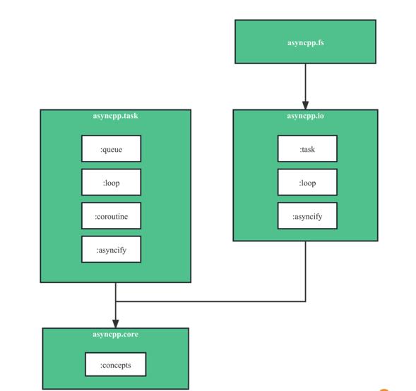
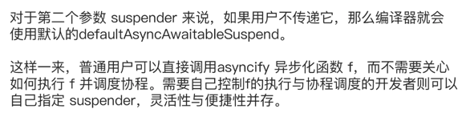
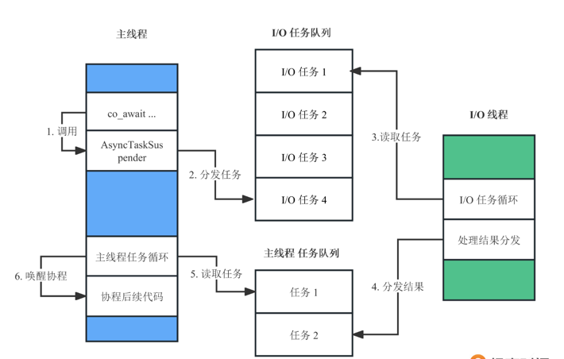
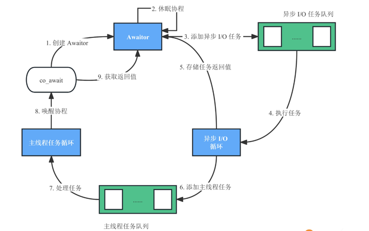

# Coroutines实战（一）：异步文件操作库

掌握了C++20标准下需要实现的协程接口约定。就目前来说，在没有标准库支持的情况下，这些约定都需要自己实现。

但是，仅通过阅读标准文档或参考代码，编写满足C++协程约定的程序比较困难。因此以一个异步文件系统操作库为例，学习如何编写满足C++协程约定的程序。

这一讲先明确模块架构，完成基础类型模块和任务调度模块，为后面实现基于协程的异步I/O调度打好基础，下面重点内容是任务调度模块。

## 模块组织方式

由于这是一个用C++实现的异步文件操作库，就将它命名为asyncpp，取async（即异步asynchronous这一单词的缩写）和cpp的组合。这个基于C++协程的库支持通用异步任务、I/O异步任务以及异步文件系统操作，主要用于I/O等任务而非计算任务。

整个项目的模块架构图如下。



用C++ Modules组装整个库，先了解一下里面的模块有哪些。

- asyncpp.core：核心的基础类型模块，主要用来定义基础的类型与concepts。
- asyncpp.task：通用异步任务模块，实现了主线程内的异步任务框架，包括queue、loop、coroutine和asyncify几个分区。
- asyncpp.io：异步I/O模块，实现了独立的异步I/O线程和任务处理框架，用于独立异步处理I/O，包括task、loop和asyncify几个分区。
- asyncpp.fs：异步文件系统模块，基于asyncpp.io模块实现了异步的文件系统处理函数。

对照示意图从下往上看，所有模块都是基于asyncpp.core这个基础类型模块实现的。而asyncpp.task是库的核心模块，asyncpp.io在该核心模块的基础上提供了异步I/O的支持。

有了清晰的模块划分，先从基础类型模块——asyncpp.core开始编写。

## 基础类型模块

基础类型模块提供了库中使用的基本类型的Concepts，因此重点关注这个concepts分区，实现在core/Concepts.cpp中。

```c++
export module asyncpp.core:concepts;
 
import <type_traits>;
 
namespace asyncpp::core {
    export template <typename T>
    concept Invocable = std::is_invocable_v<T>;
}
 
```

在这段代码中，定义了Invocable这个concept，用于判定T是否是可调用的。

这个concept定义的约束为std::is_invocable_v，用于判定T()这个函数调用表达式是否合法。由于用户传入的类型可能是普通函数、成员函数、函数对象或者lambda表达式，因此这里不能用std::is_function_v，因为这个traits只支持普通函数，不支持其他的可作为函数调用的类型。

接下来还要定义基础类型模块的导出模块，代码在core/Core.cpp中。可以看到，代码中导入并重新导出了所有的分区。

```c++
export module asyncpp.core;
 
export import :concepts;
 
```

基础类型模块的工作告一段落，接下来要实现的所有模块，都会直接或间接使用基础类型模块中的Concepts。

## 任务调度模块

接下来就到了重头戏——完成任务调度模块，这是库的核心模块。为了更直接地了解C++20以后可以怎么使用协程，接下来基于协程约定，实现异步任务的定义与调用。同时，也会看到，协程的调度细节隐藏在封装的接口实现中，这样可以降低协程的使用门槛。

先说说设计思路。因为asyncpp主要用于I/O等任务而非计算任务，所以模仿了NodeJS的实现——在主线程中实现任务循环，所有的异步任务都会放入这个任务循环中执行，并通过循环实现协程的调度。

如果要实现真正的异步，需要结合另外的工作线程来执行需要异步化的任务，task模块中提供了异步任务的提交接口，提交后的实现在后续的I/O调度模块中完成。

现在来实现任务调度模块的各个分区。

### queue分区

首先看一下queue分区task/AsyncTaskQueue.cpp，这是一个任务队列的实现。

```c++
export module asyncpp.task:queue;
 
import <functional>;
import <mutex>;
import <vector>;
 
namespace asyncpp::task {
 
export struct AsyncTask {
    // 异步任务处理函数类型
    using Handler = std::function<void()>;
 
    // 异步任务处理函数
    Handler handler;
};
 
export class AsyncTaskQueue {
public:
    static AsyncTaskQueue& getInstance();
 
    void enqueue(const AsyncTask& item) {
        std::lock_guard<std::mutex> guard(_queueMutex);
 
        _queue.push_back(item);
    }
 
    bool dequeue(AsyncTask* item) {
        std::lock_guard<std::mutex> guard(_queueMutex);
 
        if (_queue.size() == 0) {
            return false;
        }
 
        *item = _queue.back();
        _queue.pop_back();
 
        return true;
    }
 
    size_t getSize() const {
        return _queue.size();
    }
 
private:
    // 支持单例模式，通过default修饰符说明构造函数使用默认版本
    AsyncTaskQueue() = default;
    // 支持单例模式，通过delete修饰符说明拷贝构造函数不可调用
    AsyncTaskQueue(const AsyncTaskQueue&) = delete;
    // 支持单例模式，通过delete修饰符说明赋值操作符不可调用
    AsyncTaskQueue& operator=(const AsyncTaskQueue&) = delete;
 
    // 异步任务队列
    std::vector<AsyncTask> _queue;
    // 异步任务队列互斥锁，用于实现线程同步，确保队列操作的线程安全
    std::mutex _queueMutex;
};
 
AsyncTaskQueue& AsyncTaskQueue::getInstance() {
    static AsyncTaskQueue queue;
 
    return queue;
}
 
}
 
```

这段代码的核心部分是AsyncTaskQueue类，主要实现了enqueue函数和dequeue函数。

enqueue函数负责将任务添加到任务队列尾部，这里用到了互斥锁来实现线程同步。

dequeue则是从任务队列头部获取任务，取出任务后会将任务数据从队列中清理掉，防止重复执行任务。这里同样用了互斥锁来实现线程同步，如果任务不存在会返回false；如果任务存在会将任务写入到参数传入的指针中并返回true。

### loop分区

接下来是loop分区task/AsyncTaskLoop.cpp，实现了消息循环，会在loop分区使用刚才实现的queue分区，用作消息循环中的任务队列。后面是具体代码。

```c++
export module asyncpp.task:loop;
 
import :queue;
import <cstdint>;
import <chrono>;
 
namespace asyncpp::task {
 
export class AsyncTaskLoop {
public:
    // 常量，定义了任务循环的等待间隔时间（单位为毫秒）
    static const int32_t SLEEP_MS = 1000;
 
    static AsyncTaskLoop& getInstance();
    static void start() {
        getInstance().startLoop();
    }
 
private:
    // 支持单例模式，通过default修饰符说明构造函数使用默认版本
    AsyncTaskLoop() = default;
    // 支持单例模式，通过delete修饰符说明拷贝构造函数不可调用
    AsyncTaskLoop(const AsyncTaskLoop&) = delete;
    // 支持单例模式，通过delete修饰符说明赋值操作符不可调用
    AsyncTaskLoop& operator=(const AsyncTaskLoop&) = delete;
 
    void startLoop() {
        while (true) {
            loopExecution();
            std::this_thread::sleep_for(std::chrono::milliseconds(SLEEP_MS));
        }
    }
 
    void loopExecution() {
        AsyncTask asyncEvent;
        if (!AsyncTaskQueue::getInstance().dequeue(&asyncEvent)) {
            return;
        }
 
        asyncEvent.handler();
    }
};
 
AsyncTaskLoop& AsyncTaskLoop::getInstance() {
    static AsyncTaskLoop eventLoop;
 
    return eventLoop;
}
 
}
 
```

这段代码的核心是AsyncTaskLoop类，主要实现了start、startLoop和loopExecution这三个成员函数，依次来看看这些函数的作用。

start用于在当前线程启动任务循环，实现是调用startLoop，调用后当前线程会阻塞，直到出现需要执行的任务。

startLoop用来启动任务循环，其实现是一个循环，每次循环会调用loopExecution成员函数，然后通过this_thread的sleep睡眠等待一段时间，给其他线程让出CPU。

如果你足够细心，刚才看代码时可能已经注意到了，这里的时间定义成了一个常量。在真实的开发场景里，这个时间会很短，这里为了演示任务调度过程，特意将时间设置为1000ms，这样输出过程会更加明显。

loopExecution用来执行任务，其实现是从任务队列AsyncTaskQueue实例中获取最早的任务，如果任务不存在就直接返回。

### coroutine分区

接下来是coroutine分区task/Coroutine.cpp，实现了C++协程约定的几个类型与相关接口，为 **使用协程进行任务调度提供关键支持**。代码如下所示。

```c++
export module asyncpp.task:coroutine;
 
import <coroutine>;
import <functional>;
 
namespace asyncpp::task {
    // 协程类
    export struct Coroutine {
        // 协程Promise定义
        struct promise_type {
            Coroutine get_return_object() {
                return {
                    ._handle = std::coroutine_handle<promise_type>::from_promise(*this)
                };
            }
            std::suspend_never initial_suspend() { return {}; }
            std::suspend_never final_suspend() noexcept { return {}; }
            void return_void() {}
            void unhandled_exception() {}
        };
 
        // 协程的句柄，可用于构建Coroutine类，并在业务代码中调用接口进行相关操作
        std::coroutine_handle<promise_type> _handle;
    };
 
    // AsyncTaskSuspender类型声明
    export template <typename ResultType>
    struct Awaitable;
    export using AsyncTaskResumer = std::function<void()>;
    export using CoroutineHandle = std::coroutine_handle<Coroutine::promise_type>;
    export template <typename ResultType>
    using AsyncTaskSuspender = std::function<void(
        Awaitable<ResultType>*, AsyncTaskResumer, CoroutineHandle&
    )>;
 
    // Awaitable类型定义（当任务函数返回类型不为void时）
    export template <typename ResultType>
    struct Awaitable {
        // co_await时需要执行的任务，开发者可以在suspend实现中调用该函数执行用户期望的任务
        std::function<ResultType()> _taskHandler;
        // 存储任务执行的结果，会在await_resume中作为co_await表达式的值返回
        ResultType _taskResult;
        // 存储开发者自定义的await_suspend实现，会在await_suspend中调用
        AsyncTaskSuspender<ResultType> _suspender;
 
        bool await_ready() { return false; }
        void await_suspend(CoroutineHandle h) {
            _suspender(this, [h] { h.resume(); }, h);
        }
 
        ResultType await_resume() {
            return _taskResult;
        }
    };
 
    // Awaitable类型定义（当任务函数返回类型为void时）
    export template <>
    struct Awaitable<void> {
        // co_await时需要执行的任务，开发者可以在suspend实现中调用该函数执行用户期望的任务
        std::function<void()> _taskHandler;
        // 存储开发者自定义的await_suspend实现，会在await_suspend中调用
        AsyncTaskSuspender<void> _suspender;
 
        bool await_ready() { return false; }
        void await_suspend(CoroutineHandle h) {
            _suspender(this, [h] { h.resume(); }, h);
        }
 
        void await_resume() {}
    };
}
 
```

在这段代码中定义了C++协程支持的几个关键类型。首先，是协程类型Coroutine，协程调用者一般需要通过该类型操作coroutine_handle，来实现协程的调度，该定义包含了嵌套类型promise_type和协程句柄变量_handle。

接着，在Coroutine中定义了Promise类型，该对象在协程生命周期中一直存在，因此可以在不同的线程或者函数之间传递协程的各类数据与状态。

类型中的大多数接口没有特殊行为，所以都用了默认实现（空函数）。其中比较特殊的是get_return_object，协程调用者调用协程时获取到的返回值就是该函数的返回值。

这里通过coroutine_handle的from_promise函数获取到promise对象对应的协程句柄，调用Coroutine的构造函数生成Coroutine对象并返回，因此协程函数的调用者获取到该对象后，可以根据业务控制调度协程。

接着定义了CoroutineHandle类型，这是std::coroutine_handle的别名，也就是协程的句柄。

协程句柄是C++提供的唯一的协程标准类型，指向一次协程调用生成的协程帧，因此可以访问到存储在协程帧上的Promise对象。协程句柄提供了协程调度的标准函数，是协程调用者进行协程调度的基础。

由于该类型是一个泛型类（模板参数是Promise的类型），而且会在后续代码中频繁使用，为了方便为std::coroutine_handle<Coroutine:promise_type>定义了一个别名CoroutineHandle。

最后，定义了Awaitable类型，在协程中使用co_await进行休眠时需要该类型支持。


Awaitable对于实现协程调度至关重要，其中 **await_resume** 和 **await_suspend** 的实现是重点。在此做出进一步分析。

**首先，是await_resume的实现**。假设用户需要通过co_await异步执行函数f，并在f结束后获取到f的返回值作为co_await表达式的值，也就是希望实现的效果是：

```c++
auto result = co_await Awaitable(f);
 
```

当f执行结束后协程会被唤醒，并将f的返回值赋给result。


另外，考虑到函数f的返回类型为void的情况（相当于没有返回值），它与“返回值类型不为void”时的实现完全不同，不需要存储函数f的返回值。

因此，在这里定义了一个Awaitable的特化版本——当函数f的返回类型为void时，会使用该版本的Awaitable类。在该版本中，不会存储函数f的返回值，await_resume的返回类型固定为void，并且不会返回任何值。

**接着，是await_suspend的实现**，通过它，就能控制在“何时、何处”唤醒被co_await休眠的协程。

这里允许开发者通过AsyncTaskSuspender来实现await_suspend的具体行为。await_suspend中会调用开发者实现的函数，来唤醒休眠的协程。

AsyncTaskSuspender包含后面这三个参数，开发者可以利用这些参数实现不同的调度机制。

1. Awaiter对象指针：Awaitable*。
2. 协程的唤醒函数：AsyncTaskResumer。
3. 协程的句柄：CoroutineHandle&。

### asyncify分区

接下来是asyncify分区task/Asyncify.cpp，该分区实现了asyncify工具函数，用于将一个普通的函数f转换成一个返回Awaitable对象的函数asyncF。通过这个分区实现的工具，可以让库的用户更容易使用实现的Coroutine。

开发者通过co_await调用asyncF，就可以实现函数f的异步调用，并在f执行完成后，重新唤醒协程。如果了解过JavaScript，可以将其类比成ES6中的promsify。后面是代码实现。

```c++
export module asyncpp.task:asyncify;
 
export import :queue;
export import :loop;
export import :coroutine;
 
import asyncpp.core;
 
namespace asyncpp::task {
    using asyncpp::core::Invocable;
 
    // 默认的AsyncTaskSuspender（当任务函数返回类型不为void时）
    template <typename ResultType>
    void defaultAsyncAwaitableSuspend(
        Awaitable<ResultType>* awaitable,
        AsyncTaskResumer resumer,
        CoroutineHandle& h
    ) {
        auto& asyncTaskQueue = AsyncTaskQueue::getInstance();
        asyncTaskQueue.enqueue({
            .handler = [resumer, awaitable] {
                awaitable->_taskResult = awaitable->_taskHandler();
                resumer();
            }
        });
    }
 
    /* 默认的AsyncTaskSuspender（当任务函数返回类型为void时的特化版本）
     *
     * 当f的返回类型为void时，函数f没有返回值。因此定义了一个函数返回类型为void的特化版本，
     * 在该版本中构造的AsyncTask对象的handler调用用户函数f后，直接调用resumer唤醒协程，
     * 不会将f的返回值存储到Awaitable对象中。
    */
    template <>
    void defaultAsyncAwaitableSuspend<void>(
        Awaitable<void>* awaitable,
        AsyncTaskResumer resumer,
        CoroutineHandle& h
    ) {
        auto& asyncTaskQueue = AsyncTaskQueue::getInstance();
        asyncTaskQueue.enqueue({
            .handler = [resumer, awaitable] {
                awaitable->_taskHandler();
                resumer();
            }
        });
    }
 
    // 异步化工具函数，支持将普通函数f异步化
    export template <Invocable T>
    auto asyncify(
        T taskHandler,
        AsyncTaskSuspender<std::invoke_result_t<T>> suspender =
            defaultAsyncAwaitableSuspend<std::invoke_result_t<T>>
    ) {
        return Awaitable<std::invoke_result_t<T>> {
            ._taskHandler = taskHandler,
                ._suspender = suspender
        };
    }
}
 
```

在这段代码中，定义了两个版本的defaultAsyncAwaitableSuspend函数，它就是Coroutine模块中Awaitable类型所需的AsyncTaskSuspender函数，该函数的作用是在co_await休眠协程后，执行用户函数f和唤醒协程。

实现其实很简单，就是构造一个AsyncTask对象并添加到AsyncTaskQueue中。AsyncTask对象的handler会执行用户函数f，将f的返回值存储到awaitable对象中，最后调用resumer唤醒协程。

接着，定义了asyncify模版函数，模板参数T必须符合Invocable约束，也就是必须可调用，对应了用户函数f的类型。该函数包含两个参数。

1. taskHandler：期望异步执行的函数f。
2. suspender：Awaitable中用户可以自己设置的AsyncTaskSuspender函数。



## 总结

熟悉怎样编写满足C++协程约定的程序，实现了一个异步文件系统操作库中的任务调度模块。其中coroutine分区实现了C++协程约定的几个类型与相关接口，为使用协程进行任务调度提供关键支持。

一般来说，提供异步调用的库的底层实现各有不同，但是它们的目标是一致的，就是在某个消息循环上提供异步调用的基础设施。而我们选择使用C++ Coroutines来实现高性能异步调度能力。

在目前的设计中，只支持co_await去等待函数执行完成，然后恢复执行。那么，在co_await表达式中，是否可以执行并等待另一个协程执行结束？如果不可以，该如何修改代码来实现这一功能呢？

# Coroutines实战（二）：异步文件操作库

实现基于协程调度的异步文件系统操作库。同还要探讨一个重要话题，即实现所有调度线程全异步化的理想异步模型。

上面已经实现了任务调度模块，这意味着搭建好了基于协程的任务调度框架。但是，目前task模块是运行在主线程上的。因此，只有当主线程没有其他任务执行时，task模块才会从消息循环中获取任务执行，并唤醒协程。

这不是一个理想的异步框架模型， **我们更希望实现的是主线程和I/O调度全异步化。那么，这要如何实现呢？**

## I/O调度模块

其实，task模块中预留的AsyncTaskSuspender函数，就是为了实现自定义任务的处理与唤醒机制。为此，继续讨论异步I/O的实现——基于task模块的任务调度框架，实现基于协程的异步I/O调度。

基本思路是下图这样。



首先，要为I/O任务创建独立的任务队列。然后，AsyncTaskSuspender中的主线程，负责将任务与协程的唤醒函数分发到I/O任务队列中。

接下来还要创建一个有独立任务循环的新线程，读取I/O任务队列，用于处理I/O任务。最后，处理完I/O任务后，将任务的返回值和协程唤醒函数分发到主线程的任务队列中。根据主线程的任务循环机制，当主线程空闲时，唤醒协程。

接下来，看一下这个思路的具体实现，从task分区的实现开始。

### task分区

第一步，来看看io模块的task分区task/AsyncIoTask.cpp。该分区实现了I/O任务队列，后面是具体代码。

```c++
export module asyncpp.io:task;
 
import asyncpp.core;
import asyncpp.task;
import <functional>;
import <vector>;
import <mutex>;
 
namespace asyncpp::io {
 
export struct AsyncIoTask {
    using ResumeHandler = std::function<void()>;
    using TaskHandler = std::function<void()>;
 
    // 协程唤醒函数
    ResumeHandler resumeHandler;
    // I/O任务函数
    TaskHandler taskHandler;
};
 
export class AsyncIoTaskQueue {
public:
    static AsyncIoTaskQueue& getInstance();
 
    void enqueue(const AsyncIoTask& item) {
        std::lock_guard<std::mutex> guard(_queueMutex);
 
        _queue.push_back(item);
    }
 
    bool dequeue(AsyncIoTask* item) {
        std::lock_guard<std::mutex> guard(_queueMutex);
 
        if (_queue.size() == 0) {
            return false;
        }
 
        *item = _queue.back();
        _queue.pop_back();
 
        return true;
    }
 
    size_t getSize() const {
        return _queue.size();
    }
 
private:
    // I/O任务队列
    std::vector<AsyncIoTask> _queue;
    // I/O任务队列互斥锁，用于实现线程同步，确保队列操作的线程安全
    std::mutex _queueMutex;
};
 
AsyncIoTaskQueue& AsyncIoTaskQueue::getInstance() {
    static AsyncIoTaskQueue queue;
 
    return queue;
}
 
}
 
```

在这段代码中，AsyncIoTaskQueue的实现和AsyncTaskQueue类非常类似，不同之处就是AsyncIoTask的定义除了任务处理函数，还包含一个用于唤醒协程的处理函数resumeHandler。

### loop分区

接下来，看一下io模块的loop分区task/AsyncIoLoop.cpp。该分区定义了异步I/O循环的实现，代码如下。

```c++
export module asyncpp.io:loop;
 
import :task;
import asyncpp.task;
 
import <thread>;
import <chrono>;
import <thread>;
import <functional>;
 
namespace asyncpp::io {
    export class AsyncIoLoop {
    public:
        static AsyncIoLoop& start();
 
    private:
        AsyncIoLoop() {
            _thread = std::jthread(std::bind(&AsyncIoLoop::loopMain, this));
        }
 
        void loopExecution() {
            AsyncIoTask opItem;
            if (!AsyncIoTaskQueue::getInstance().dequeue(&opItem)) {
                return;
            }
 
            opItem.taskHandler();
 
            auto& asyncEventQueue = asyncpp::task::AsyncTaskQueue::getInstance();
            asyncEventQueue.enqueue({
                .handler = opItem.resumeHandler
            });
        }
 
        void loopMain() {
            while (true) {
                loopExecution();
                std::this_thread::sleep_for(std::chrono::milliseconds(1000));
            }
        }
 
        std::jthread _thread;
    };
 
    AsyncIoLoop& AsyncIoLoop::start() {
        static AsyncIoLoop ioLoop;
 
        return ioLoop;
    }
}
 
```

在这段代码中，AsyncIoLoop的主体实现和之前的AsyncTaskLoop非常类似，所以这里只讨论两个特别之处。

从代码里可以看到AsyncTaskLoop是直接在调用线程里执行的，而AsyncIoLoop类包含一个std::jthread对象。构造函数中会创建线程对象，并将loopMain作为线程的入口函数，用于启动一个线程来处理消息循环。

另一个特别的地方是，在任务循环的处理中，taskHandler执行结束之后，会将任务的resumeHandler添加到主线程AsyncTaskQueue中。根据主线程的任务循环机制，在主线程空闲之后，就会立刻执行resumeHandler唤醒协程。

### asyncify分区

接下来，看一下io模块的asyncify分区task/AsyncIoAsyncify.cpp。代码实现如下。

```c++
export module asyncpp.io:asyncify;
 
import <coroutine>;
import <type_traits>;
import asyncpp.core;
import asyncpp.task;
import :task;
 
namespace asyncpp::io {
    using asyncpp::core::Invocable;
    using asyncpp::task::Awaitable;
    using asyncpp::task::AsyncTaskResumer;
    using asyncpp::task::variantAsyncify;
    using asyncpp::task::AsyncTaskSuspender;
    using asyncpp::task::CoroutineHandle;
 
    template <typename ResultType>
    void ioAsyncAwaitableSuspend(
        Awaitable<ResultType>* awaitable,
        AsyncTaskResumer resumer,
        CoroutineHandle& h
    ) {
        asyncpp::io::AsyncIoTask operationItem{
            .resumeHandler = [h] {
                h.resume();
            },
            .taskHandler = [awaitable]() {
                awaitable->_taskResult = awaitable->_taskHandler();
            }
        };
 
        asyncpp::io::AsyncIoTaskQueue::getInstance().enqueue(operationItem);
    }
 
    template <>
    void ioAsyncAwaitableSuspend<void>(
        Awaitable<void>* awaitable,
        AsyncTaskResumer resumer,
        CoroutineHandle& h
    ) {
        asyncpp::io::AsyncIoTask operationItem{
            .resumeHandler = [h] {
                h.resume();
            },
            .taskHandler = [awaitable]() {
                awaitable->_taskHandler();
            }
        };
 
        asyncpp::io::AsyncIoTaskQueue::getInstance().enqueue(operationItem);
    }
 
    export template <Invocable T>
    auto ioAsyncify(T taskHandler) {
        using ResultType = std::invoke_result_t<T>;
 
        AsyncTaskSuspender<ResultType> suspender = ioAsyncAwaitableSuspend<ResultType>;
        return variantAsyncify(taskHandler, suspender);
    }
}
 
```

在这段代码中，调用asyncpp.task中的asyncify，将用户传递的taskHandler作为任务处理函数，将ioAsyncAwaitableSuspend作为suspend处理函数，这样就可以实现后面这样的异步I/O处理流程。



1. 在co_await时将当前协程休眠，并在异步I/O任务队列中添加一个任务。
2. 异步I/O任务循环获取任务，处理任务后将任务的返回值记录到Awaiter对象中，并将协程唤醒作为任务函数，添加到主线程的任务队列中。
3. 主线程的任务循环在空闲时获取异步I/O任务的协程唤醒任务，执行后唤醒休眠的协程。
4. 休眠的协程被唤醒后，通过co_await和Awaiter对象获取到任务处理的返回结果，协程继续执行。

这样就可以在协程中实现I/O任务处理的异步化，同时也屏蔽了所有的实现细节。用户可以简单地将普通函数变为支持在协程中异步执行的函数。

在几乎不增加任何运行时开销的前提下，通过协程实现了异步I/O的异步处理与任务调度。

## 文件系统模块

在完成任务调度模块和I/O调度模块后，来简单看一下文件系统操作模块fs/FileSystem.cpp。代码是后面这样。

```c++
export module asyncpp.fs;
 
import asyncpp.io;
import <string>;
import <filesystem>;
import <functional>;
import <iostream>;
 
namespace asyncpp::fs {
    using asyncpp::io::ioAsyncify;
    namespace fs = std::filesystem;
 
    export auto createDirectories(const std::string& directoryPath) {
        return ioAsyncify([directoryPath]() {
            return fs::create_directories(directoryPath);
        });
    }
 
    export auto exists(const std::string& directoryPath) {
        return ioAsyncify([directoryPath]() {
            return fs::exists(directoryPath);
        });
    }
 
    export auto removeAll(const std::string& directoryPath) {
        return ioAsyncify([directoryPath]() {
            return fs::remove_all(directoryPath);
        });
    }
}
 
```

这段代码的封装方法非常简单，调用ioAsyncify将一个普通函数转换成“可以通过co_await调用”的异步任务函数，这跟ES6中的promisify一样简单！

## 调用示例

现在实现了所有关键模块。最后来看看如何定义协程，并在协程中使用封装的函数。

还是对照代码来理解。

```c++
import asyncpp.core;
import asyncpp.task;
import asyncpp.io;
import asyncpp.fs;
 
#include <iostream>
 
using asyncpp::task::asyncify;
using asyncpp::task::AsyncTaskLoop;
using asyncpp::task::Coroutine;
 
using asyncpp::fs::createDirectories;
using asyncpp::fs::exists;
using asyncpp::fs::removeAll;
using asyncpp::fs::voidFsFunction;
 
using asyncpp::io::AsyncIoLoop;
 
/*
 * 用于演示如何在协程中通过co_await调用异步化的文件系统操作函数
 *  - co_await会自动控制协程的休眠和唤醒，调用者无需关心其实现细节
*/
Coroutine asyncF() {
    std::string dirPath = "dir1/a/b/c";
 
    // 创建目录
    std::string cmd = "createDirectories";
    std::cout << "[AWAIT] Before: " << cmd << std::endl;
    auto createResult = co_await createDirectories(dirPath);
    std::cout << "[AWAIT] After: " << cmd << ": " << std::boolalpha << createResult << std::endl;
 
    // 判断路径是否存在
    cmd = "exists1";
    std::cout << "[AWAIT] Before: " << cmd << std::endl;
    auto existsResult1 = co_await exists(dirPath);
    std::cout << "[AWAIT] After: " << cmd << ": " << std::boolalpha << existsResult1 << std::endl;
 
    // 删除目录
    cmd = "removeAll";
    std::cout << "[AWAIT] Before: " << cmd << std::endl;
    auto removeResult = co_await removeAll(dirPath);
    std::cout << "[AWAIT] After: " << cmd << ": " << std::boolalpha << removeResult << std::endl;
 
    // 判断路径是否存在
    cmd = "exists2";
    std::cout << "[AWAIT] Before: " << cmd << std::endl;
    auto existsResult2 = co_await exists(dirPath);
    std::cout << "[AWAIT] After: " << cmd << ": " << std::boolalpha << existsResult2 << std::endl;
}
 
void hello() {
    std::cout << "<HELLO>" << std::endl;
}
 
auto asyncHello() {
    return asyncify(hello);
}
 
/*
 * 用于演示如何调用asyncify来将一个普通的void函数异步化
 *  - asyncHello的返回值推荐使用auto让编译器诊断其类型，
 *。  如果不使用auto，这里需要写明其返回类型为asyncpp::task::Awaitable<void>
 *  - 在协程中就可以直接通过co_await调用asyncHello即可
 */
asyncpp::task::Coroutine testVoid() {
    // void函数封装示例
    co_await asyncHello();
}
 
int main() {
    // 启动异步I/O任务线程
    AsyncIoLoop::start();
 
    // 调用协程（协程会并发执行）
    asyncF();
    testVoid();
 
    // 启动主线程任务循环（一定要最后调用，这里会阻塞）
    AsyncTaskLoop::start();
 
    return 0;
}
 
```

在main函数中，首先调用AsyncIoLoop::start启动异步I/O任务线程，接着调用asyncF和testVoid。

在调用asyncF时遇到co_await createDirectories时会先休眠，此时控制权会交还给main函数，然后main函数就会马上调用testVoid这个协程，testVoid遇到co_await asyncHello后会休眠再回到main函数，然后启动主线程循环。

因此，程序会先输出[AWAIT] Before…，然后输出。因为是异步的，其实无法准确得知运行时的具体顺序，所以，程序的控制台输出可能是后面截图里展示的这样。


## 深入理解Coroutines

看完编程实战后，你是不是对异步的概念和基于协程的异步实现有了新的体会。现在回到C++ Coroutines的概念上，并做一些更深入的讨论，把协程调度的细节再梳理一下。

首先，协程是一个与线程独立的概念，协程的核心是让调用者和被调用的协程具备一种协同调度的能力：协程可以通过co_await暂时休眠并将控制权交还给调用者，调用者可以通过协程句柄的resume重新唤醒协程。

其次，协程通过较为复杂的约定为开发者提供了更细粒度控制协程调度的能力。我们一定要实现的类型是Coroutine、Promise，如果想要自定义co_await的行为，还需要实现Awaitable和Awaiter类型。

- Coroutine类型可以将协程的句柄作为自己的成员变量，并以协程句柄为基础为协程调用者提供调度协程的接口。
- Promise类型可以在协程帧中存储更多的自定义数据，实现协程的各种元数据以及自定义状态的存储与传递。
- Awaitable和Awaiter可以控制co_await的各种行为，包括co_await后协程是否休眠，休眠后何时重新唤醒协程等。

在细粒度实现协程调度时还可以细分成两种情况，来分别看一下。

针对调用者的协程调度，需要关注Coroutine和Promise的实现细节。Promise中可以通过get_return_object控制调用协程的返回值类型，一般返回类型就是Coroutine。而在Coroutine类型中，需要定义为调用者提供的各种调度控制函数，根据实际业务需求实现相关的接口。

针对协程的内部调度，C++是通过co_await实现的，需要关注Awaitable和Awaiter的实现细节。

为了真正实现协程的异步执行，可以在Awaiter的await_suspend中将协程的相关信息，包括Awaiter对象、协程句柄传递给其他的线程，在其他线程中执行任务函数并恢复协程执行。为了确保线程安全，甚至可以在一些应用中，当任务函数执行完后，将协程的相关数据传回主线程，让主线程自己唤醒协程。

因此，只要符合与C++协程接口的约定，就可以根据实际需求，定义整个协程的执行与调度过程。只要了解整个协程的执行机制和线程的切换机制，就可以通过协程实现各式各样的异步任务执行与调度。

## 总结

虽然就目前来说，C++20提供的协程看起来很粗糙——它仅提供了语言层面的支持，缺乏标准库的支持。因此，就目前来说入门门槛还相对比较高，但是已经能够实现足够灵活的异步调度、实现自己的协程框架，并满足各式各样的任务调度需求。

C++ Coroutines可以在几乎零开销的情况下，大幅降低C++中实现异步调度的复杂度。实现基于C++20中的协程，就是去实现标准中针对协程的一整套约定，包含定义promise_type类型和Awaitable类型。其中，Awaitable的实现决定了协程休眠的具体行为。

同时在代码中设计了asyncify和ioAsyncify函数，使用这两个函数可以在不修改原有接口的情况下简单包装， **以非侵入式的方式生成为协程提供的异步函数**。与调用原函数相比，在协程中调用生成的包装函数只需要加上co_await即可，其他地方没有任何区别。

也需要关注协程只是一种调度框架或者说是调度机制，协程和线程分别是独立的概念，甚至在实现具体协程机制的时候，往往也离不开线程技术，就像我们的实现一样。但是一旦实现了协程框架，就能降低调用者的异步编程门槛，这正是协程的价值所在。

我们期待更加成熟的支持会在C++26或后续演进标准中到来。可以预见，在未来C++标准支持协程是光明的。
