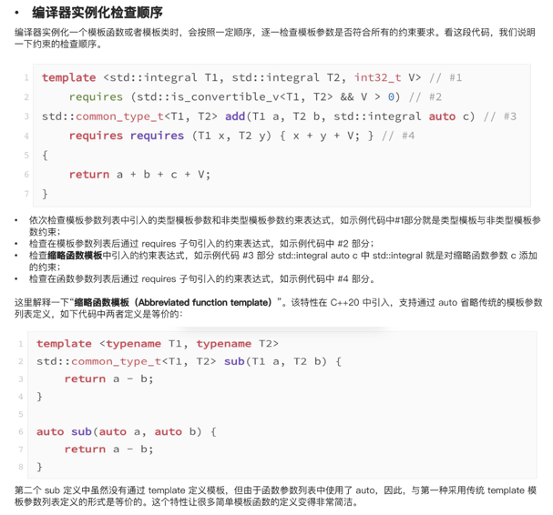

# Concepts：解决模板接口的类型与约束定义难题
C++模板不仅具备强大的泛化能力，自身也是一种“图灵完备”的语言，掀起了C++之父Bjarne Stroustrup自己都没料到的“模板元编程”这一子领域。

但是，使用模板做泛型编程，最大的问题就是缺少良好的接口，一旦使用过程中出现偏差，报错信息难以理解，甚至无从下手。更糟的是，使用模板的代码几乎无法做到程序ABI层面兼容。这些问题的根本原因是C++语言本身缺乏模板参数约束能力，因此，既能拥有良好接口、高性能表达泛化，又能融入语言本身是非常困难的。

好在C++20标准及其后续演进中，为我们带来了Concepts核心语言特性变更来解决这一难题。那么它能为我们的编程体验带来多大的革新？能解决多少模板元编程的历史遗留问题？

## 定义Concepts

首先我们看看Concepts是什么，它可不是横空出世的，C++20为模板参数列表添加了一个特性——约束，采用约束表达式对模板参数进行限制。约束表达式可以使用简单的编译期常量表达式，也可以使用C++20引入的requires表达式，并且支持约束的逻辑组合，这是对C++20之前enable_if和type_traits的进一步抽象。

在约束的基础上，C++20正式提出了Concepts，也就是由一组由约束组成的具名集合。

我们可以将一组通用的约束定义为一个concept，并且，在定义模板函数与模板类中，直接使用这些concept替换通用的typename和class，所以concept的定义必定是约束的表达式，定义方式就像这样。

```c++
template <参数模板>
concept 名称 = 约束表达式;

```

看一个最简单的例子如何定义一个concept，使用 type_traits的简单版本。

```c++
template<class T, class U>
concept Derived = std::is_base_of<U, T>::value;

```

这里定义了一个名为Derived的concept，有两个类型参数T和U，其中的约束定义为 `std::is_base_of<U, T>::value`，也就是判定U是否为T的基类。相比于传统基于SFINAE和enable_if的方式，这种约束定义明显更加清晰。

我们再来看一个更加具体的concept。

```c++
class BaseClass {
public:
 int32_t getValue() const {
 return 1;
 }
};

template<class T>
concept DerivedOfBaseClass = std::is_base_of_v<BaseClass, T>;

```

在这段代码中，我先定义了一个基类BaseClass，该类定义了一个成员函数getValue。我又定义了名为DerivedOfBaseClass的concept。需要注意的是，我在这里使用了一个C++17标准之后引入的工具变量模板is_base_of_v，相当于 `is_base_of<BaseClass, T>::value`。

简单来说，这里定义的concept，可以判定模板参数T是否为BaseClass的派生类，通过一些现代C++语法变换，我们定义的concept更易读和使用。

有了定义好的concept，如何使用呢，我写了一个例子。

```c++
template <DerivedOfBaseClass T>
void doGetValue(const T& a) {
 std::cout << "Get value:" << a.getValue() << std::endl;
}

class DerivedClass: public BaseClass {
public:
 int32_t getValue() const {
 return 2;
 }
};

int32_t c2() {
 DerivedClass d;
    doGetValue(d);

 BaseClass b;
    doGetValue(b);

 return 0;
}

```

我们先从代码的第6行开始，定义一个名为DerivedClass的类，它继承BaseClass，并重新定义了函数getValue的具体实现。接着，在函数c2中，我们定义了两个类型分别为DerivedClass和BaseClass的对象，并调用函数doGetValue，在编译时进一步验证我们编写的基于concept的代码。

doGetValue是代码开头定义的一个模板函数，它的模板参数很特别，采用DerivedOfBaseClass定义了T，而非typename/class，这个意思是实例化时传入的模板参数T，必须符合DerivedOfBaseClass这个concept的要求。

现在，我们编译运行这段代码，可以看到输出是后面这样。


那么，如果参数不是BaseClass的派生类，会发生什么呢？我们来看看后面这段代码。

```c++
class NonDerivedClass {
public:
 int32_t getValue() const {
 return 3;
 }
};

int32_t c2() {
 NonDerivedClass n;
 doGetValue(n);

 return 0;
}

```

这段代码在编译时会报错，报错信息是这样。


这段报错信息中，我们很容易知道，由于NonDerivedClass并非BaseClass的派生类，编译时发生了错误。

从这个案例看，如果C++模板通过concept进行了“约束”，调用者再也不需要从难以理解的模板编译错误中寻找问题根源了。基于concept的模板编译错误信息，极具指导性， **足够简单、易于理解和纠错。**

不过讲到这里，关于这段代码，模板参数T的概念是DerivedOfBaseClass，函数doGetValue的参数必须符合DerivedOfBaseClass这个概念。

```c++
template<class T>
concept DerivedOfBaseClass = std::is_base_of_v<BaseClass, T>;

```

你可能会有一个疑问： **为何不使用虚函数来解决这个问题呢？** 如果将getValue定义成虚函数，并将doGetValue的参数类型设定成const BaseClass&，不也可以实现一样的效果吗？

事实上，虚函数是基于虚函数表等特性来实现的，会对调用性能产生一定的损耗，也可能因为不同编译器内存模型，产生ABI兼容性问题。但是，如果用模板，编译器就可以通过编译期判定，直接消除虚函数造成的性能副作用，同时，编译器也可以充分利用各种跨函数调用的优化方式，生成性能更好的代码，有效提升生成代码的质量。因此，很多工程场景下，这种方法比基于虚函数实现的多态更加合理。

所以，我们可以看到， **通过约束与concept这两个C++核心语言特性变更（高级抽象），实现了对模板参数列表与参数的约束的逻辑分离**。这不仅能提升模板函数或类接口的质量，还可以彻底提升代码的可读性。

如果从语言设计的角度进一步探讨，Concepts，本质就是让开发者能够定义在模板参数列表中直接使用的“类型”，与我们在函数的参数列表上使用的由class定义的类型，理论上讲，是一样的。

所以，在面向对象的编程思想中，我们思考的如何设计清晰且可复用的class，那从此以后，在泛型编程中我们就需要转变一下，思考如何设计清晰且可复用的concept。可以说， **从C++20标准及其演进标准之后，concept之于C++泛型编程，正如class之于C++面向对象。**

了解了使用Concepts的优点，接下来，我们看看它的高级用法。我们会从requires关键字定义的约束表达式开始，掌握逻辑操作符的组合用法，之后会了解一下requires子句的概念、约束顺序规则，涵盖Concepts的各个重要方面。

## 约束表达式

定义Concepts时我们提到，一个concept被定义为约束表达式（constraint expression）。那什么是约束表达式呢？

从定义上来说，约束表达式是“用于描述模板参数要求的操作符与操作数的序列”，你也可以简单理解为布尔常量表达式。 **约束表达式，本身是通过逻辑操作符的方式进行组合的，用于定义更复杂的concept。**

约束的逻辑操作符一共有三种。

- 合取式（conjunctions）
- 析取式（disjunctions）
- 原子约束（atomic constraints）

编译器实例化一个模板函数或者模板类时，会按照一定顺序，逐一检查模板参数是否符合所有的约束要求。来深入理解一下这几种逻辑操作符。

### 合取式

合取（conjunctions）通俗易懂的说法就是“逻辑与”，AND。在约束表达式中，合取式就是通过 `&&` 操作符，把两个约束表达式连接到一起的。

来看三个例子。

```c++
template<class T>
concept Integral = std::is_integral_v<T>;

template<class T>
concept SignedIntegral = Integral<T> && std::is_signed_v<T>;

template<class T>
concept UnsignedIntegral = Integral<T> && !SignedIntegral<T>;

```

首先，定义了一个名为Integral的concept，表示参数模板类型需要为整型。

接着，定义了名为SignedIntegral的concept，表示参数模板类型需要为有符号整型。定义体就是一个合取式， `&&` 表示这个concept必须同时满足 `Integral<T>` 这一concept和 `std::is_signed_v<T>` 这一编译时常量表达式。

最后，还定义了名为UnsignedIntegral的concept，表示参数模板类型需要为无符号整型。其定义体表示必须满足 `Integral<T>` 和 `!SignedIntegral<T>` 这两个concept。

**编译器在处理合取式的时候，要求左右两侧约束都必须满足。检测过程遵循逻辑与表达式自左向右的短路运算原则**，也就是说，如果左侧表达式不满足要求，右侧表达式也不会执行。因此，即使右侧表达式执行存在问题，也不会被执行，引发检测失败。

```c++
template<typename T>
constexpr bool get_value() { return T::value; }

template<typename T>
 requires (sizeof(T) > 1 && get_value<T>())
void f(T) {
 std::cout << "template version" << std::endl;
}

void f(int32_t) {
 std::cout << "int version" << std::endl;
}

void c15() {
 f('A');
}

```

在调用函数f的时候，由于 `'A'` 的类型为char，其sizeof为1，因此sizeof(T) > 1为false。所以 `get_value<T>()` 是不会执行的，这里并不会引发编译错误（char类型没有::value）。虽然有些反直觉，但这就是合取式的短路运算原则。

### 析取式

析取（disjunctions）就是“逻辑或”，OR。在约束表达式中，析取式就是通过 `||` 操作符将两个约束表达式连接到一起。具体我们来看代码。

```c++
template <class T>
concept Integral = std::is_integral_v<T>;

template <class T>
concept FloatingPoint = std::is_floating_point_v<T>;

template <class T>
concept Number = Integral<T> || FloatingPoint<T>;

```

这里定义了三个concept：Integral、FloatingPoint和Number，其中Number这个concept通过 `||` 将Integral和FloatingPoint这两个concept连接在一起，表达只要为整型或者浮点型即可。

编译器在处理析取式的时候， **要求左右两侧约束满足其一即可，检测过程遵循逻辑或表达式自左向右的短路运算原则**，也就是只要左侧表达式满足要求，右侧表达式就不会执行。因此，即使这时右侧表达式执行存在问题，也不会被执行引发检测失败。

### 原子约束

原子约束（atomic constraints）是最后一种约束表达式，本身是一个很简单的概念，但是对编译器解析约束表达式非常重要。

原子约束，由表达式E与E的参数映射组成。参数映射指的是E中受约束实体的模板参数（template parameter）与实例化时使用的模板实参（template argument）之间的映射关系。原子约束是在约束规范化过程中形成的，一个原子约束不能包含逻辑与或表达式。

编译器在实例化过程中，会检查参数是否满足原子约束。编译器会根据参数映射关系，将模板实参替换成表达式E中的形参。

- 如果替换后的表达式是一个非法类型或者非法表达式，说明当前实例化参数不满足约束。
- 否则，编译器会对表达式的值进行左右值转换，只有得到的右值类型是bool类型，并且值为true时，编译器才认定为满足约束，否则就是不满足约束。

值得一提的是，E的值必须是bool类型，不允许通过任何隐式转换变为bool型（这个和C++中的if不一样）。听起来有些复杂，看一段代码，很好理解。

```c++
template<typename T>
struct S {
 constexpr operator bool() const { return true; }
};

template<typename T>
 requires (S<T>{})
void f1(T) {
 std::cout << "Template" << std::endl;
}

template<typename T>
 requires (1)
void f2(T) {
 std::cout << "Template" << std::endl;
}

template<typename T>
 requires (static_cast<bool>(S<T>{}))
void f3(T) {
 std::cout << "Template" << std::endl;
}

```

在这段代码中，函数f1和f2的约束都会编译失败，只有f3才是正确的原子约束表达式。

另外，如果在源代码中，两个原子约束表达式相同，参数映射也相等，那么这两个原子约束就是完全相同的。看下面这段代码。

```c++
template <class T>
concept Floating = std::is_floating_point_v<T>;

template <class T>
concept BadNumber = std::is_floating_point_v<T> && std::is_floating_point_v<T>;

template <class T>
concept Number = Floating<T> && std::is_floating_point_v<T>;

template <Floating T> // #1
void func(T) {}

template <BadNumber T> // #2
void func(T) {}

template <Number T> // #3
void func(T) {}

```

在这段代码中，如果调用func同时匹配#1和#2，会相互冲突导致编译失败，而同时匹配#1和#3不会。这是因为，BadNumber中第一个 `is_floating_v` 和Floating中的 `is_floating_v`，并不会识别为相同的原子约束，导致编译器认为匹配了两个版本，不知道选择哪个版本而失败。

Number中第一个原子约束直接使用了Floating，所以Number属于Floating的派生约束。虽然两个约束都能匹配，但Number是比Floating更精准的匹配，所以编译器最后会选择#3版本，并不会发生编译错误。

作为补充，编译器为了后续进行统一的语法和语义分析，会在约束表达式的解析过程中对约束表达式进行规范化。

学习了三种约束表达式，讨论几个重要细节，包括requires表达式、requires子句以及约束顺序等高级话题。

## requires关键字

在前面已经看到了由type_traits和requires构成的concept，针对requires表达式和requires子句这两个概念，简单说明一下。

### requires表达式

跟type_traits类似，requires表达式本身就是一个谓词。

requires与普通约束表达式不同，如果其定义体在完成参数替换后，存在非法的类型或表达式，或者requires定义中的约束存在冲突时，会返回false。反之，如果完成参数替换后语法检查以及约束检查全部成功之后，才会返回true。

定义方式是这样。

```c++
requires (可选参数) { // 表达式结果必须为 bool 类型
    表达式_1
    表达式_2
    ...
}

```

“可选参数”声明了一系列局部变量（不支持提供默认参数），大括号中的所有表达式都可以访问这些变量，如果表达式使用了未声明变量，编译时会报错。

requires大括号内，可以定义几种不同的表达式，分别用于约束接口或函数行为、变量、类型，同时还可以对约束进行组合和嵌套。在这里用一个例子来说明这几种不同表达式的用法。

```c++
template<typename T>
concept Histogram = requires(T h1, T h2) {
    h1.getMoments();         // 要求有getMoments接口
    T::count;                // 要求有静态变量count
    h1.moments;              // 要求有成员变量moments
    h1 + h2;                 // 要求对象能够进行+操作

    typename T::type;        // 要求存在类型成员type
    typename std::vector<T>; // 要求能够模板实例化并与std::vector组合使用

    { h1.getSubHistogram() } -> same_as<T>;    // 要求接口返回类型与T一致
    { h1.getUnit() } -> convertible_to<float>; // 要求接口返回类型能转换成float，本质上接口返回类型可能是double
    { h1 = std::move(h2) } noexcept;          // 要求表达式不能抛出异常

    requires sizeof(T) > 4;
};

```

requires表达式定义中的约束分为四种类型，分别是：

- 基本约束：第3到6行，这种独立的、不以关键词开头的表达式语句，都是基本约束，只会进行词法、语法和语义的正确性检查，并不会真实执行。编译器检查通过，则约束检查通过，否则检查失败。
- 类型约束：第8到9行，这种使用typename开头的表达式语句是类型约束，表达式用于描述一个类型，如果类型存在，则约束检查通过，否则检查失败。
- 组合约束：第11到13行，这种类似“ **{} [noexcept] ->约束**”形式的都是组合约束，编译器会执行{}中的语句，并检查其结果类型是否符合后续约束，如果符合约束则检查通过，否则检查失败。此外，还可以通过可选的noexcept检查表达式是否会抛出异常。
- 嵌套约束：第15行，requires开头的就是嵌套约束，用于嵌套新的requires表达式，如果requires表达式结果为true则检查通过，否则检查失败。

### requires子句

下面看一看，相较于requires表达式这一谓词，requires中出现的另一个关键字——requires子句，又是怎么回事？

由于requires子句和requires表达式并不是相同的概念，所以可能会看到这种代码：

```c++
export template <typename T1, typename  T2>
 requires requires (T1 x, T2 y) { x + y; }
std::common_type<T1, T2> func(
 T1 arg1, T2 arg2
) {
    return arg1 + arg2;
}

```

在模板头上定义了一条requires子句，它表达了模板参数应该在什么条件下工作，在这里我们还可以定义更复杂或具体的约束表达式。

这里有两个requires，但是含义完全不同， `requires (T1 x,T2 y) { x + y; }` 就是requires子句，而前面的requires就是requires子句的开头，后面所需的是一个约束表达式，只不过requires表达式是约束表达式的一种，所以这是合法的代码。

requires子句存在的意义是判断它所约束的声明在“上下文”中是否可行。所谓上下文，分为三种。

1.函数模板：是在执行重载决议中进行的。

2.模板类：在决策适合的特化版本当中。

3.模板类中的成员函数：决策当显式实例化时是否生成该函数。

## 约束顺序

在前面，看到了给模板施加约束后，受约束的版本比未受约束的版本更优。但是，如果两个版本同样含有约束且都满足，哪个最优呢？

编译器在后续分析前，会将模板中所有的具名concept和requires表达式都替换成其定义，接着进行正规化，直到所有的约束变成原子约束及其合取式或析取式为止。然后分析约束之间的蕴含关系，并根据约束偏序选择最优的版本。

这里解释一下蕴含关系。针对约束P和约束Q，只有通过P和Q中的原子约束证明P蕴含Q，才认定约束P蕴含约束Q（编译器并不会分析表达式和类型来判定蕴含关系，比如N>0并不蕴含N>=0）。

蕴含关系非常重要，决定了约束的偏序。如果声明D1所受约束蕴含D2所受约束（或者D2不受约束），并且声明D2所受约束并不蕴含声明D1所受约束，我们就可以认为，声明D1的约束比声明D2的约束更加精准。这说明，当编译器选择声明版本时，如果参数同时符合D1和D2所受约束，编译器会选择D1，也就不会引起编译错误。

只有了解并利用约束的偏序规则，才能更好地组织代码。

## 总结

什么是Concepts，它是由一组由约束组成的具名集合，约束支持普通编译期常量表达式，同时支持采用requires表达式，对模板参数进行更复杂的约束检查，并且支持约束的逻辑组合，这是对C++20之前enable_if和type_traits的进一步抽象。

在现代C++20标准及其后续演进中，约束的顺序通过概念约束进行决策，而约束的合取式、析取式以及Concepts，在模板函数重载决议与类模板特化决策过程中，扮演了核心角色。编译器通过约束的偏序规则决策出最优解。

Concepts这种高级抽象，妥善解决了模板接口的类型与约束定义难题，同时也改进了约束顺序决策。

结合C++泛型编程，约束表达是一个较为复杂的议题，如何正确且有效地利用这一全新特性呢？



## [Concepts实战：写个向量计算模板库](action.md)