# Modules：C++模块化问题的前世今生

从C++20中的核心特性变更——Modules模块开始，了解现代C++的编程范式、编程思想及现实问题解决方法上的革新。

都知道无论是编写C还是C++程序，总少不了使用include头文件机制，这是C/C++编程中组织代码的最基本方式，用法简单、直接，而且符合直觉。但很多人不知道的是，其实include头文件机制不仅有坑，在编程过程中还会出现一些难以解决的两难问题。

接下来就从这个“简单”机制开始探讨代码组织方式的门道，看看里面究竟存在哪些问题，语言设计者和广大语言使用者又是如何应对的，对这些问题的思考，将串联起关于C++代码组织方案的所有知识点，也终将引出主角——Modules。

首先来看看整个故事的背景，include头文件机制，它的出现是为了什么？

## 万物始于include

作为C语言的超集，C++语言从设计之初就沿袭了C语言的include头文件机制，即通过包含头文件的方式来引用其他符号，包括类型定义、接口声明这样的代码，起到分离符号定义与具体实现的作用。

早期，能放在头文件中的符号比较有限，头文件设计是足以支撑系统设计的。但是为了提高运行时性能，开发者也会考虑将实现直接放在头文件中。

一开始这看起来似乎没什么，但随着软件技术的发展，C++从C++98过渡到现代C++之后，越来越多的特性可以被定义或声明在头文件中，头文件对现代软件开发的支持就显得捉襟见肘了。

首先，由于模板元编程的特性，模板类、模板函数及其实现，往往需要全部定义在头文件中。

还可以在头文件中定义编译时（compile-time）常量表达（constexpr）的变量和函数（constexpr函数也可以在运行时调用）。

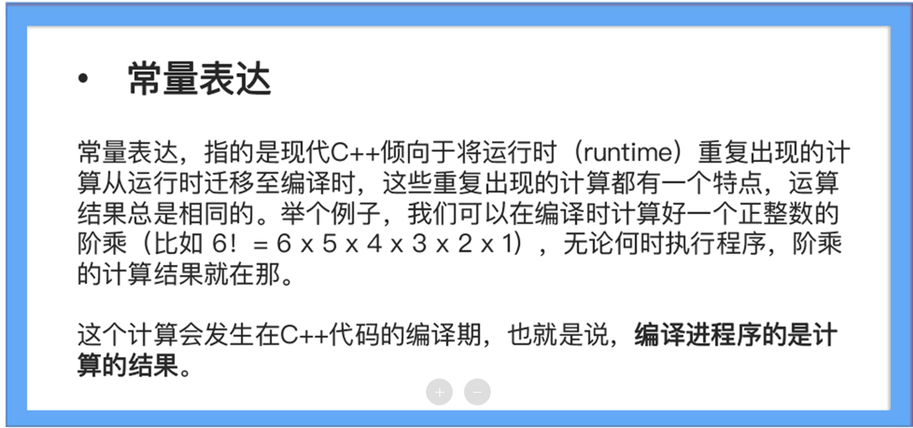

另外，类型推导auto、inline函数与变量、宏也可以被定义在头文件中。

这样看来，头文件包罗万象实至名归，但伴随而来的是一系列问题。

第一个问题是 **模糊的模块划分**。

传统的include头文件机制并没有提供清晰的模块划分能力，如果要在一份代码中使用来自不同目录的相同符号定义，编译器，在链接阶段没有足够的信息来区分这些相同符号定义的强弱关系，会出现符号覆盖或者链接错误的问题。

第二个问题是 **依赖符号导入顺序**。

一个头文件可能会因为导入符号顺序的不同，影响到代码中包含的另一个语义，如宏定义就有可能会影响到导入符号的顺序。因此，在大规模C++项目中，有时候导入头文件的顺序都是有讲究的，往往不能控制所有的代码编写工作，而来自不同开发团队的头文件可能会互相影响，导致头文件难以组合。

第三个问题是 **编译效率低下**。

C++语言由核心语言特性与库构成，那些可以定义在头文件中的特性（如类型推导auto、模板函数和模板类等）会对编译速度造成影响，而导入一个看似简单的STL库头文件，如sstream，在编译期展开后会达到数万行代码。include头文件会让这些计算、解析在编译阶段反复发生，进一步拖慢甚至拖垮编译效率。

第四个问题是 **命名空间污染**。

初学C++的时候，常常会为了方便大量使用using namespace来简化后续代码的编写工作，如果在这些库中含有与程序中定义的全局实体同名的实体，或者不同库之间有同名的实体，在编译时会出现名字冲突。如果在头文件中使用了using namespace，甚至会导致所有直接或间接包含了该头文件的代码都受到影响，产生不可预计的后果。

所以，为了解决C++头文件中的符号隔离问题，简单的理解include头文件是远不够的，问题实在不少。接下来看看在传统C++编程中是如何解决模块化问题的，进而引出C++ Modules。

## 传统C++模块化解决方案

事实上，在C++20以前，即便是现代C++（C++11～C++17）也没有在模块化方面有什么实质性的突破，一直没有统一的抽象模块概念。

但开发者在这么多年的实践中确总结出了一套较为行之有效的经验，可以在一定程度上表示“模块”，以达到两大目的。

一个目的是划分业务逻辑代码，将大规模的代码划分为小规模的代码，通过层层划分和模块组织，让每个模块代码足够内聚，专注自身业务，最终提升代码的可维护性。

第二个目的是提升代码的复用性，可能会抽离出很多功能模块，供其他模块调用，C++的标准库正是这种“模块”的代表，最终可以减少系统中的重复代码，提升系统的稳定性和可维护性。

既然C++没有提供标准的模块特性，那么传统项目中，会使用哪些基础设施来模拟模块呢？

结合实践经验，来看看几个常用特性，包括应对模块划分与符号复用的编译链接、头文件，应对符号隔离的命名空间。

 分别编译/链接/头文件

刚才提到模块化的两个目的，业务逻辑划分、代码复用。为了实现这两个目的，首先会利用从C开始就支持的编译-链接两阶段的构建过程。

C++编译过程中最基础的概念就是“编译单元”，所以每个实现文件（通常以.cpp结尾）都是完全独立的编译单元。会先在“编译”这个阶段对每个编译单元进行独立编译，生成独立的目标文件，也就是将C++代码转换成二进制机器码，在这个过程中，每个目标文件中的函数在编译过程中会生成一个“符号”，而每个符号包含一个名称和函数代码的首地址。

假设想在编译单元A（简称A）中引用编译单元add（简称add）中的函数，只需要确保引用的函数同名即可。

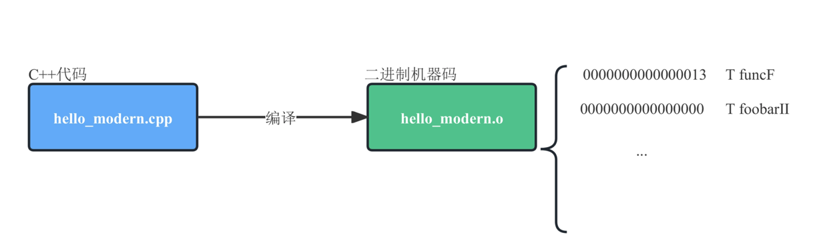

在A的编译过程中，如果引用的函数不存在，就会把函数的调用位置空出来，等到链接的时候，链接器会从其他的编译单元，比如add中，搜索编译时空出位置的函数符号。如果能找到，就将符号地址填入空出来的部分，如果找不到就会报出链接错误。

这个过程具体是怎么运作的呢？举个具体例子来看看，在add中定义了一个函数add，A中引用这个函数add。

main.cpp代码如下：
```c++
#include <cstdint>
#include <iostream>
extern int32_t add(int32_t a, int32_t add);
int main() {
 int32_t sum = add(1, 2);
 std::cout << "sum: " << sum << std::endl;
 return 0;
}

```

add.cpp代码如下：
```c++
#include <cstdint>
int32_t add(int32_t a, int32_t add) {
 return a + add;
}

```

可以看到，A中其实也“声明”了一个函数add，只不过声明的时候加了一个extern修饰符，并没有函数定义。

这是因为在编译A的时候，编译器并不知道add的存在，需要通过这种方式“告知”编译器其实有这个函数add，只是在其他的编译单元中，准备等到链接时再使用。这样一来，虽然编译器没有找到这个函数的定义，但是会暂时“放过”它，在生成的函数调用机器码中会将这个符号的地址空出来，等到链接的时候再来填充。

如果你使用gcc编译这两个源代码文件，可以看到add.o中会生成一个名为add的符号，这个符号就是准备在链接过程中使用的。

编译完成，继续执行链接动作。

此时，链接器首先将编译生成的main和add的目标文件（main.o和add.o）组装在一起，然后开始“填坑”——填补在编译过程中空出来的符号调用的符号地址。编译器会从add.o的代码中寻找符号add，找到使用这个符号的地址，去填补main.o在编译过程中空出来的调用符号的地址。

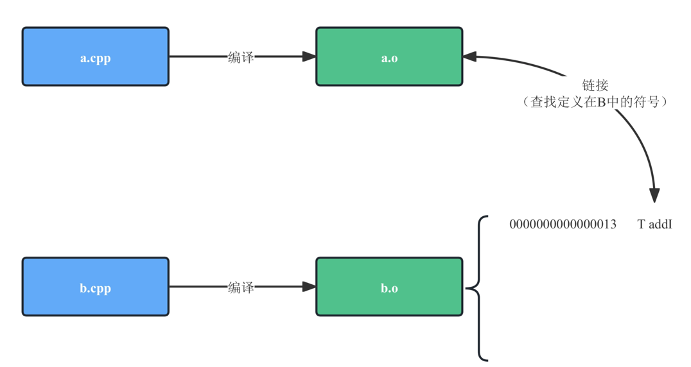

链接完成后，所有二进制代码中预留的地址全部都要被修补，如果所有编译单元中都找不到这个符号，就会在链接阶段报错。最后链接生成的二进制代码不允许出现空缺的调用地址。

Hmm，这种模式似乎可以解决业务逻辑划分问题，但有一个问题——现在，如果有一个新的编译单元C，C也希望使用add中定义的函数，那么也需要在C中重写一遍add函数的声明吗？

的确需要如此，因为编译器并不知道其他编译单元的定义。

不过，这会让引用其他编译单元的函数变得非常麻烦，而且更大的问题是，如果在引用符号的编译单元中写错了声明，只要符号一样，链接的时候也不会报错。怎么办呢？这个时候就要用头文件来解决这个问题了。

可以先定义一个头文件add.h。

```c++
#ifndef _MODULE_add_H
#define _MODULE_add_H
#include <cstdint>
extern int32_t add(int32_t a, int32_t add);
#endif //_MODULE_add_H

```

接着修改main.cpp和add.cpp（其中add.cpp暂无变化），修改后代码是这样。

```c++
#include <cstdint>
#include <iostream>
#include "add.h"
int main() {
 int32_t sum = add(1, 2);
 std::cout << "sum: " << sum << std::endl;
 return 0;
}

```

接着编译并链接写好的代码，命令是这样。

```c++
g++ -o add main.cpp add.cpp -std=c++11

```

以后add中增加了新的函数，只需在add.h中补充相应的声明即可。

这样在每个引用add的编译单元，都不用重复声明这个函数了，不过也需要知道这其实是通过“包含”头文件代码这种非常“低级”的技术方式实现的。而且这种方式可能还会产生一个问题，两个编译单元的符号可能会重复！也就是前面提到的“命名空间污染”。

比如在main.cpp中也定义一个add函数，然后进行编译、链接。

```c++
#include <cstdint>
#include <iostream>
#include "add.h"

int32_t add(int32_t a, int32_t add) {
 return a + add;
}

int main() {
 int32_t sum = add(1, 2);
 std::cout << "sum: " << sum << std::endl;

 return 0;
}

```

编译过程非常顺利。但是，在链接时，哦？出错了。

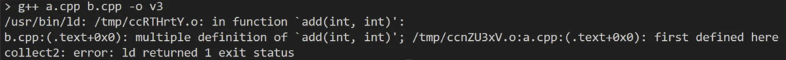

这是因为main.o中引用了add这个符号，但是add.o和main.o中都包含这个符号，就导致了冲突，因为链接器不知道main.o中想要使用的add到底是add.o中的还是main.o中的。

这就是所谓的符号隔离问题。那么一般应该如何解决呢？

在C和早期的C++中的解决方案非常简单粗暴，那就是添加前缀。比如在add.cpp中在所有定义的函数之前都添加前缀module_add_，在main.cpp中所有定义的函数之前都添加前缀module_add_main。如果在main.cpp中希望引用的是add.cpp中的add，那么就调用module_add_add，否则调用module_add_main，这就非常简单地解决了问题。

但这种方式继续带来了两个问题。

第一个问题是代码冗长，尤其是在add.cpp中定义的时候，所有函数都需要添加前缀module_add_，会让所有的函数定义非常复杂。

第二个问题是，如果前缀也重复怎么办？毕竟两个编译单元的编写者是不知道对方使用什么前缀的，在技术上无法避免，只能通过不同编译单元的编写者提前约定好双方的前缀来解决。真是一个问题接着一个问题……

不过，在C++中符号隔离问题，也可以通过隐藏一个编译单元中的私有符号来解决，也就是不让其他编译单元“看到”这些符号。

这也能大量减少编译单元之间的符号冲突问题，毕竟可能出现，两个编译单元定义了同名，但只想在编译单元内部使用函数的情况，并不想给这些函数加上冗长的前缀。那这个时候，只需要使用static修饰符。比如可以在main和add中都定义static函数to_int，然后再编译链接，这样就不会出现符号冲突的问题。

### 命名空间

虽然在不同编译单元中，相同的符号会引发链接错误，不过在不同的代码组件中是完全可以定义相同符号的，这其中可以包含符号常量、变量、函数、结构体、类、模板和对象等等。

但是，相同的符号并不意味着它们有相同的功能，而且随着C++工程越来越大，导入的库变多，这种命名冲突的可能性就越大。下图展示了不同编译单元、不同代码组件、namespace之间的关系和层次。

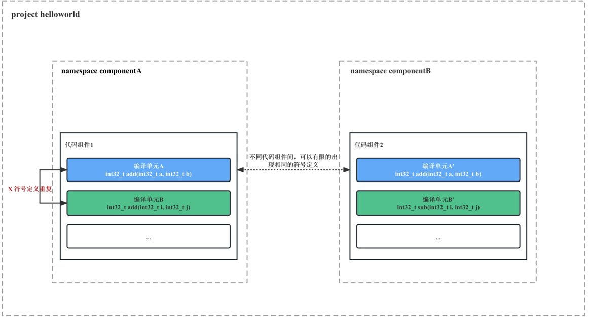

为了避免在C++编程过程中避免命名冲突，C++标准提供了关键字命名空间（namespace）的支持，可以更好地控制符号作用域。但通过namespace进行符号隔离，仍然存在局限性。

namespace可以通过命名空间避免符号名称冲突，但本身并不管理符号的可见性问题，不同namespace之间的符号可见性取决于编译单元的符号可见性，这让符号的管理变得非常复杂。另外不同编译器产生的namespace的符号修饰方式不同（毕竟这不是C++标准定义的内容），也就是ABI层面不同，会导致跨编译器的符号引用出现很大的问题。

**方法一：通过include头文件来统一声明符号**

这种方法的优点是简单粗暴，简洁明了，一定程度上解决了同一组件内相同符号定义冲突的问题。但这种方法也有硬伤，它利用了头文件代码这种非常“低级”的技术方式实现，而且仍无法避免两个编译单元的重复符号的问题。

**方法二：添加前缀来避免符号冲突**

这种方法简单明了，可操作性强，基本可以解决符号冲突问题。但是会大幅降低代码可读性，还会让符号声明变得更长，而且当前缀也重复了，真的很难解决问题，难道全局替换前缀？因此这种方式仍然不能解决符号重复和可见性的问题。

**方法三：通过namespace避免符号冲突**

*namespace可以通过命名空间避免符号名称冲突。但是，它本身并不管理符号的可见性问题，不同namespace之间的符号可见性取决于编译单元的符号可见性，这让符号的管理变得非常复杂。而且namespace在不同编译器上的表现不同，在ABI层面无法实现兼容。

可以看出，include头文件机制没能跟上现代C++标准的演进，提供一套行之有效的进行代码组合、符号和功能复用的方案。那么，有没有什么办法来保证库的独立性、易用性，同时提高代码编译速度呢？

### C++除了用include头文件机制以及C++20前解决符号可见性问题，那么在C++ Modules出现以前，你是怎么解决符号隔离问题的？

1. 命名空间（Namespace）： 将相关的变量、函数和类封装在命名空间中，以限定其作用域，避免命名冲突和符号污染。通过使用不同的命名空间，可以实现符号的隔离。
```c++
namespace MyLibrary {
    int someFunction() {
        // implementation
    }
}
```

2. 静态限定符（Static Qualifier）： 在函数或变量声明前加上static关键字，将它们限定在当前文件的作用域内，防止其被其他文件访问。
```c++
static int internalVariable; // 仅在当前文件内可见
```

3. 匿名命名空间（Unnamed Namespace）： 使用匿名命名空间可以在当前文件中创建一个唯一的命名空间，其中定义的变量和函数对外部文件不可见。
```c++
namespace {
    int internalVariable; // 仅在当前文件内可见
}
```

4. 文件作用域（File Scope）： 将变量或函数定义在文件的顶层作用域中，不加任何限定符，默认情况下这些符号只在当前文件内可见。
```c++
// File1.cpp
int globalVariable; // 只在 File1.cpp 中可见
```

# Modules（中）：解决编译性能和符号隔离的银弹
开发者为了业务逻辑划分和代码复用，需要模块化代码。但随着现代C++编程语言的演进，现代C++项目的规模越来越大，即便是最佳实践方法，在不牺牲编译性能的情况下，也没有完全解决 **符号可见性** 和 **符号名称隔离** 的问题。

如果从技术的本质来探究“模块”这个概念，其实 **模块主要解决的就是符号的可见性问题**。而控制符号可见性的灵活程度和粒度，决定了一门编程语言能否很好地支持现代化、标准化和模块化的程序开发。一般，模块技术需要实现以下几个必要特性。

- 每个模块使用模块名称进行标识。
- 模块可以不断划分为更多的子模块，便于大规模代码组织。
- 模块内部符号仅对模块内部可见，对模块外部不可见。
- 模块可以定义外部接口，外部接口中的符号对模块外部可见。
- 模块可以相互引用，并调用被引用模块的外部接口（也就是符号）。

include头文件机制虽然在一定程度上解决了同一组件内相同符号定义冲突的符号可见性问题，但头文件代码这种技术方式实现非常“低级”，仍无法避免两个编译单元的重复符号的符号名称隔离问题。迫切需要一种更加现代的、为未来编程场景提供完备支持的解决方案。

而C++ Modules，在满足上述特性的基础上，针对C++的特性将提供一种解决符号隔离问题的全新思路。看看如何使用C++ Modules解决旧世界的问题？

## 基本用法

首先了解一下什么是C++ Modules。

作为一种共享符号声明与定义的技术，C++ Modules目的是替代头文件的一些使用场景，也就是现代编程的模块化场景。前面说过，模块解决的是模块之间符号的可见性控制问题，不解决模块之间的符号名称隔离问题，因此C++ Modules与C++标准中的命名空间（namespace）在设计上是正交的，不会产生冲突。

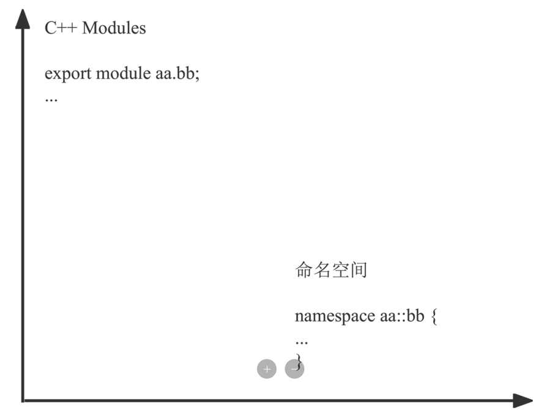

与其他现代化编程语言不同，C++包含一个预处理阶段来处理预处理指令，然后生成每个编译单元的最终代码。因此C++ Modules的设计必须考虑如何处理预处理指令，并在预处理阶段支持C++ Modules。目前，C++ Modules支持通过import导入C++的头文件并使用头文件中定义的预处理指令。

总之，在现代化的编程模式与编程习惯下，如果采用了C++ Modules，基本可以完全抛弃#include，而且大部分场景下，在不对遗留代码进行更改的情况下仍可以使用过去的头文件。

了解了基本概念，接着来看C++ Modules的具体细节，包括模块声明、导入导出的方法、全局和私有模块的划分、模块分区以及所有权问题。这些细节是掌握C++ Modules的关键，当然了也不是什么难题，毕竟对于核心语言特性的变更和设计哲学来说，“易用”是首要目标，也是重中之重。

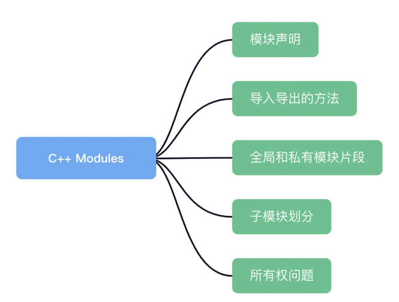

从每一个设定的引入中将看到如何通过C++ Modules提供的新特性方便地声明模块、引用模块、使用模块提供的接口，并更好地组织模块代码，学会使用新的特性替代传统的模块管理方式，编写更易于维护的代码。

#### 模块声明

在引入C++ Modules后，编译单元会被分为“模块单元”和“普通单元”两种类型。普通单元除了可以有限引用“模块”以外，和传统的C++编译单元没有任何区别，这也实现了对历史代码的向下兼容。只有“模块单元”才能用于定义模块并实现模块中的符号。

**如果想要将编译单元设置成“模块单元”，需要在编译单元的源代码头部**（除了包含全局模块片段的情况下） **采用module关键字**，比如现在如果要声明一个“模块单元”属于模块helloworld，需要采用如下方式声明。

```c++
module helloworld;

```

“模块单元”会被分为“模块接口单元（Module Interface Unit）”和“模块实现单元（Module Implementation Unit）”。

- 模块接口单元用于定义模块的对外接口，也就是控制哪些符号对外可见，作用类似于传统方案中的头文件。
- 模块实现单元用于实现模块接口模块中的符号，作用类似于传统方案中与头文件配套的编译单元。

模块单元默认是模块实现单元，如果想要将模块单元定义成模块接口单元，需要在module前添加export关键字。

```c++
export module helloworld;

```

在构建过程中多个编译单元声明为同名的模块单元，只要同名，这些编译单元的符号也就内部相互可见，也就是 **模块声明相同的编译单元都属于同一个模块**。

这里有个例外需要注意，整个项目中，每个模块只能有一个模块接口单元，换言之，模块接口单元的模块名称是不能重复的，否则就会出错。

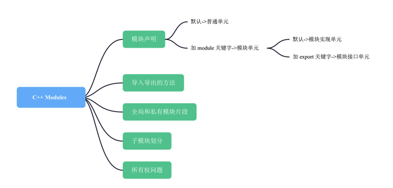

#### 导出声明

与传统的编译单元不同，一个模块单元中定义的符号对模块外部默认是不可见的。比如下面这段代码中定义的private_hello函数就是对模块外部不可见的。

```c++
export module helloworld;
void private_hello() {
 std::cout << "Hello world!" << std::endl;
}

```

如果想要定义对模块外部可见的函数，需要使用export关键字，比如下面这段代码中定义了一个对模块外部可见的hello函数。

```c++
export module helloworld;
void private_hello() {
 std::cout << "Hello world!" << std::endl;
}

export void hello() {
 std::cout << "Hello world!" << std::endl;
}

```

前面说过，C++ Modules与传统的命名空间（namespace）是保持正交设计的。因此可以在模块单元中导出命名空间。

```c++
export module helloworld;

export namespace hname {
 int32_t getNumber() {
 return 10;
 }
}

```

这里定义了一个对外可见的命名空间hname，包含一个getNumber函数。就可以在其他模块通过hname::getNumber调用这个函数，也就是hname::getNumber这个符号对外部可见。

不过需要知道的是，这样其实让该namespace中包含的所有符号对外可见了，因此也可以这样编码。

```c++
export module helloworld;

namespace hname {
 export int32_t getNumber() {
 return 10;
 }
}

```

这和前面的代码是等价的，只是如果namespace不标注export，可以在namespace内部通过export关键字更细粒度地标记符号的对外可见性，因此 **在编码实践上一般不建议直接在namespace上使用export**，当然特定场景除外（比如定义一个namespace作为对外接口）。

#### 导入模块

可以在其他编译单元中通过import关键字导入模块，而且，无论是模块单元还是普通单元都可以导入模块，比如编写main.cpp，使用了前面helloworld模块中定义的外部符号。

```c++
#include <iostream>

import helloworld;

int main() {
 hello();
 std::cout << "Hello " << hname::getNumber() << std::endl;

 return 0;
}

```

关键字import导入模块，实际其实是让被引用的模块中的符号对本编译单元可见，也就是将被导入模块中的符号直接暴露在本编译单元中，这就类似于传统C++技术中的using namespace。

说过C++ Modules并不解决符号名称隔离问题，也就是如果通过import导入了一个模块，并且被导入模块中有符号与本编译单元可见符号的名称冲突了，还是会产生命名空间污染。如果想避免污染，就需要结合使用namespace进行编码。

**需要注意的是，通过import导入的模块符号只在本编译单元可见**，其他的编译单元是无法使用被导入的模块符号的。同时，如果模块A通过import导入了模块B的符号，然后模块B通过import导入了模块C的符号，模块A中是无法直接使用模块C的符号的。毕竟模块系统就是为了严格规范符号可见性。

如果想要把通过import导入的符号对外导出，就需要在import前加上export来将导入的模块中的符号全部对外导出。比如：

```c++
export import bye;

```

就可以将bye模块的所有符号再对外导出。

接下来看看怎样直接在main.cpp中使用函数goodbye()。首先定义一个模块bye，编写bye.cpp。

```c++
export module bye;

import <iostream>;

export void goodbye() {
 std::cout << "Goodbye" << std::endl;
}

```

然后修改helloworld.cpp的定义。

```c++
export module helloworld;
export import bye;

void private_hello() {
 std::cout << "Hello world!" << std::endl;
}

export void hello() {
 std::cout << "Hello world!" << std::endl;
}

```

最后，编写main.cpp。

```c++
import helloworld;

int main() {
 hello();
 goodbye();

 return 0;
}

```

由于模块helloworld导出了bye模块的符号，可以在main.cpp中直接使用bye模块中的函数goodbye()。

#### 导入头文件

既然普通单元和模块单元都可以通过import导入模块，那么普通单元和模块单元的import的区别是什么呢？

事实上，最大的区别就是模块单元无法使用#include引入头文件，必须要使用import导入头文件。比如说，定义一个头文件h1.h。

```c++
#pragma once

#define H1 (1)

```

然后在helloworld.cpp中通过import引入这个头文件。

```c++
export module helloworld;

import <iostream>;
import "h1.h";

export void hello() {
 std::cout << "Hello world!" << std::endl;
 std::cout << "Hello2 " << H1 << std::endl;
}

```

就可以在helloworld.cpp中使用h1.h中定义的H1这个符号。

发现了吗？通过import导入头文件的兼容性是经过精心设计的，从设计上来说，依然可以认为import头文件是简单的文本操作，也就是将头文件的文本复制到编译单元中。

所以可以利用头文件的这种特性。比如编写一个h2.h。

```c++
#pragma once

#define H2 (H1 + 1)

```

然后修改一下helloworld.cpp，通过import导入这个新的头文件。

```c++
export module helloworld;

import <iostream>;
import "h1.h";
import "h2.h";

export void hello() {
 std::cout << "Hello world!" << std::endl;
 std::cout << "Hello2 " << H1 << std::endl;
 std::cout << "Hello2 " << H2 << std::endl;
}

```

可以看到，这里引用h2.h中的H2，而h2.h中也使用了h1.h中的H1。以此得知，通过import导入头文件依然可以实现原本预处理指令的效果，这是因为C++ Modules也规定了在预处理阶段对import的处理要求，所以import在预处理和编译阶段都会有对应的效果。

虽然可以通过import来导入头文件，但是import和以前的#include还是存在区别的。

区别就是， **通过import导入头文件的编译单元定义的预处理宏，是无法被import导入的文件访问的**，比如这样的代码就会出现编译错误。

```c++
export module helloworld;

import <iostream>;
#define H1 (1)
import "h2.h";

export void hello() {
 std::cout << "Hello world!" << std::endl;
 std::cout << "Hello2 " << H1 << std::endl;
 std::cout << "Hello2 " << H2 << std::endl;
}

```

这是因为H1是在编译单元中定义的，而编译单元本身是一个模块单元，因此h2.h中无法访问到这个编译单元中定义的H1。

但是在传统的C/C++代码中，很多头文件经常会要求用户通过定义预定义宏进行配置，比如这段代码就会影响头文件的行为。

```c++
#define _POSIX_C_SOURCE 200809L
#include <stdlib.h>

```

那么，在新的模块单元中要如何实现这种特性呢？这就需要“模块片段”来帮忙。

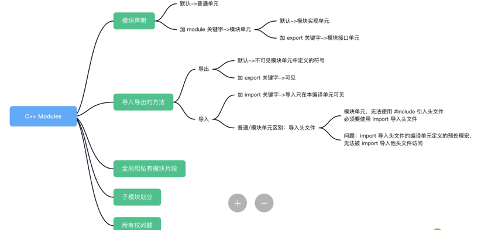

## 模块片段

模块片段又可以分为全局模块片段和私有模块片段。对于前面的问题需要的是全局模块片段。

#### 全局模块片段

全局模块片段（global module fragment）是实现向下兼容性的关键特性，当无法通过import导入传统的头文件实现#include指令的效果时，就要使用全局模块片段来导入头文件。

全局模块片段是一个模块单元的一部分，需要定义在模块单元的模块声明之前，声明语法如下。

```c++
module;
预处理指令
模块声明

```

如果需要在模块单元中定义全局模块片段，文件必须以modules;声明开头，表示这是一个模块单元的全局模块片段；接着就是全局模块片段的定义，内容只能包含预处理指令；编写完模块片段定义之后需要加上模块单元的模块声明，也就是export module或module声明。

比如可以修改一下前文中有问题的helloworld.cpp，解决无法通过import导入头文件的问题。

```c++
module;

#define H1 (1)
#include "h2.h"

export module helloworld;

import <iostream>;

export void hello() {
 std::cout << "Hello world!" << std::endl;
 std::cout << "Hello2 " << H1 << std::endl;
 std::cout << "Hello2 " << H2 << std::endl;
}

```

在全局模块片段中先定义了宏H1，然后再通过#include而非import包含头文件h2.h，这样h2.h就会以传统的预处理模式被包含在本模块单元内，这样就可以在模块单元中使用h2.h中的宏H2了。

#### 私有模块片段

除了可以在模块单元的模块定义前添加全局模块片段，在接口模块单元的模块单元接口定义后，还可以定义私有模块片段作为模块的内部实现。

如果想要编写一个单文件模块，就可以采用这个特性。在模块接口单元中定义“接口”部分和“实现”部分，也就是在模块单元定义中编写接口，在私有模块片段内编写实现。修改一下之前的helloworld.cpp，在代码尾部添加私有模块片段，如下所示。

```c++
export module helloworld;

import <iostream>;

export void hello()；

module : private;

void hiddenHello();

void hello() {
 std::cout << "Hello world!" << std::endl;
 std::cout << "Hello2 " << H1 << std::endl;
 std::cout << "Hello2 " << H2 << std::endl;
 hiddenHello();
}

void hiddenHello() {
 std::cout << "Hidden Hello!" << std::endl;
}

```

私有代码片段需要使用module : private标识，然后定义需要实现的代码。在私有代码片段中定义了函数hello()和hiddenHello()，并在模块单元代码中通过export导出这个符号。这里由于函数hiddenHello()定义在了函数hello()之后，因此需要在hello之前前置声明。

所以module : private就是提供了一种在单文件模块中标记接口部分和实现部分的手段，由于可能更倾向于使用模块接口单元和模块实现单元来组织模块，因此这种方式可能是使用较少的。

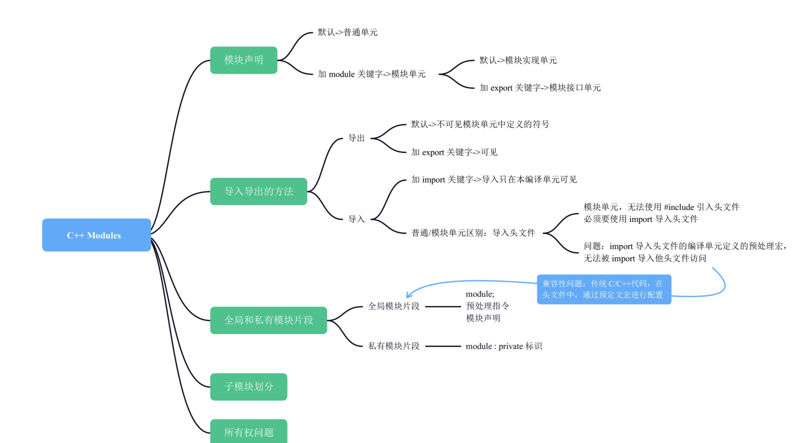

## 模块分区

模块的一个关键特性是可以划分为更多的子模块。在C++ Modules中，子模块主要有两种实现方式：通过模块名称进行区分、利用模块分区特性。

先看第一个方式，通过模块名称进行区分。

C++ Modules的模块名称除了可以使用C++标识符字符以外，还可以使用“.”这个符号，比如有一个名为utils的模块，如果需要定义一个utils中的图像处理子模块image，可以声明一个名为utils.image的模块，将其作为utils的子模块。这种子模块的模块名组织方式和其他现代编程语言更类似，所以使用起来也很简单易懂。

但这种方式存在一个问题：C++中并没有提供标注两个模块隶属关系的方法，所以子模块和父模块之间其实没有什么隶属关系，本质上通过这种方法进行模块分层，只是一种基于名称的约定，父模块使用子模块和其他模块使用子模块没区别。

因此有了第二种方式，C++ Modules提供“模块分区”作为一种划分子模块的方法。

模块分区的声明方法是将一个模块单元的名称命名为“模块名:分区名”，如果需要定义一个helloworld的分区B，可以创建一个名为helloworld_b.cpp的文件，并在文件开头使用如下方式声明模块。

```c++
module helloworld:B;

```

然后就可以像其他的模块单元一样定义模块的内容，比如定义一个函数helloworldB，完整代码如下所示。

```c++
export module helloworld:B;

import <iostream>;

void helloworldB() {
    std::cout << "HelloworldB" << std::endl;
}

```

模块分区单元也可以分为“模块分区接口单元”和“模块分区实现单元”，模块分区接口单元也就是在模块声明前追加export关键词。比如定义helloworld的分区A，文件名是helloworld_a.cpp。

```c++
export module helloworld:A;

export void helloworldA();

import <iostream>;

void helloworldA() {
    std::cout << "HelloworldA" << std::endl;
}

```

接下来就可以在helloworld模块中通过import导入这两个分区，并调用这两个函数。

```c++
export module helloworld;

import <iostream>;

export import :A;
import :B;

void hello() {
 std::cout << "Hello world!" << std::endl;
 helloworldA();
 helloworldB();
}

```

在模块中通过import导入分区的时候，需要直接指定分区名称，不需要指定模块名称，这样就可以导入本模块的不同分区。分区导入到本模块后，分区内部的符号也就对整个模块可见了，因此，分区内部是否将符号标识为export，并不影响分区内部符号对模块内部的可见性。

那么模块分区内部的export有什么作用呢？

作用是允许“模块接口单元”通过export，来控制是否将一个分区内导入的符号导出给其他模块，有两种方法。

1.在主模块的模块接口单元通过export import导入分区，分区内标识为export的符号就对其他模块可见。

2.在主模块中通过import导入分区，并在主模块的模块接口单元中通过export声明需要导出的符号。

第一种方式比较简单方便，第二种方式的控制粒度比较细，各有优劣需要在实际应用中根据实际情况选择处理方案。

使用模块分区后有一个很重要的特点， **模块分区单元中的符号，必须通过主模块的接口单元控制对外可见性**，因为一个模块无法通过import导入一个模块的分区。这就为模块的开发者提供了控制子模块符号可见性的有效工具。

## 模块所有权

在使用模块的时候需要注意符号声明的所有权问题，这个会影响两个方面，一个是符号的实现位置，另一个是符号的“链接性（linkage）”。

在模块单元的模块声明中出现的符号声明，属于（attached）这个模块。所有属于一个模块的符号声明，必须在这个模块的编译单元内实现，不能在模块之外的编译单元中实现这些符号。

模块所有权也会引发符号的链接性发生变化。在传统的C++中链接性分为无链接性（no linkage）、内部链接性（internal linkage）、外部链接性（external linkage）。

- 无链接性的符号只能在其声明作用域中使用。
- 内部链接性的符号可以在声明的编译单元内使用。
- 外部链接性的符号可以在其他的编译单元使用。

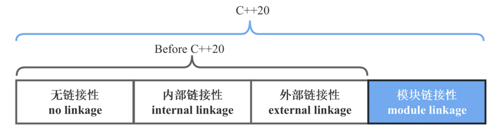


在C++支持Modules之后，新增了一种链接性叫做模块链接性（module linkage）。所有从属于模块而且没有通过export标记导出的符号就具备这种链接性。具备模块链接性的符号可以在属于这个模块的编译单元中使用。

模块中的符号如果满足下面两种情况，就不属于声明所在模块。

1.具备外部链接性的namespace。

2.使用“链接性指示符”修改符号的链接性。

用一段非常简单的代码来展示一下。

```c++
export module lib;

namespace hello {
 extern "C++" int32_t f();
 extern "C" int32_t g();
 int32_t x();
 export int32_t z();
}

```

定义模块lib，包含了5个符号，分别是命名空间hello、函数hello::f、hello::g、hello::x和hello::z，逐一分析一下这些符号的链接性与所有权。

- hello是命名空间，所以不从属于模块lib。
- 函数hello::f使用了extern “C++”指示符，说明这个符号是外部链接性，并采用C++的方式生成符号，所以不从属于模块lib。
- 函数hello::g使用了extern “C”指示符，说明这个符号是外部链接性，但采用了C的方式生成符号，所以不从属于模块lib。
- 函数hello::x是属于模块lib的符号，只不过符号本身是模块链接性，只能被相同模块的编译单元引用。
- 函数hello::z是属于模块lib的符号，并且添加了export，因此符号是外部链接性，可以被其他模块的编译单元引用。

其中hello、f、g都不从属于模块lib，因此这些符号都可以在其他模块中实现，而x和z只能在模块lib中实现。

使用C++ Modules，可以切实有效地提升构建性能，从语言层面，这不仅是为开发者提供了规范的模块化工具，更是解决了一个鱼与熊掌不可兼得的关键问题，即传统头文件编译范式，在编译性能和符号隔离之间二选一的难题。

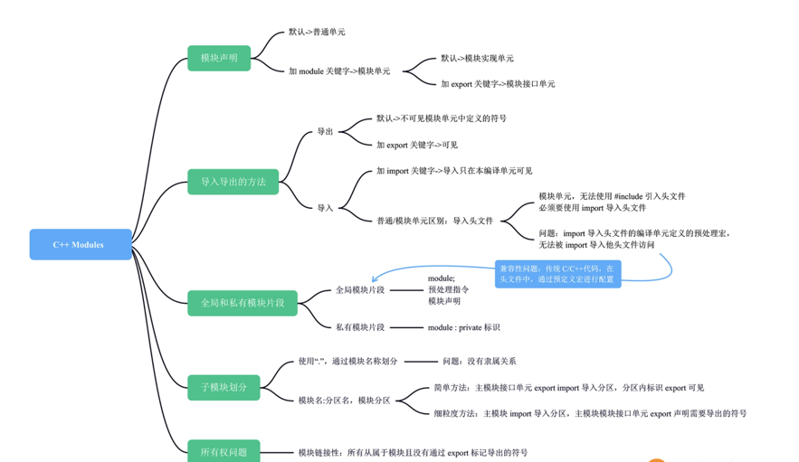

这里对Modules的基础概念简单总结一下。

- 使用module声明，可以将编译单元设置为模块单元，如果声明前包含export则为模块接口单元，否则就是模块实现单元。一个模块只能包含一个模块接口单元。
- 在module中声明的符号默认具有模块链接性，只能在模块内部使用，可以通过export将符号设置为对其他模块可见。
- 使用import，可以将其他模块的符号引入到一个模块中，被引用模块的符号对本编译单元可见。也可以使用import导入传统头文件，相对于#include会有一些限制。
- 模块支持定义分区。模块分区只能被本模块导入，不能被其他模块导入。模块分区内符号对其他模块的可见性需要通过主模块的接口模块控制。
- 在模块单元中通过modules;定义全局模块片段，通过module : private;定义私有模块片段，可以在特定场景中使用这些特性解决问题。
- 模块中声明的符号，归属权一般是模块本身，只能在相同模块实现。但是具备外部链接性的namespace和采用“链接性指示符”修改了链接性的符号是例外。

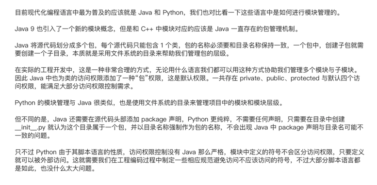

### C++ Modules带来的极大便利性以及当前仍旧存在的功能限制。能否举出在使用C++过程中碰到的有关于符号的编译、链接问题？

C++ Modules 是 C++20 引入的重要特性，它为 C++ 提供了更好的模块化支持，可以显著改善编译和链接过程中的一些问题。然而，即使有了 Modules，仍然存在一些功能限制以及与符号相关的编译和链接问题。以下是一些可能在使用 C++ 过程中遇到的与符号相关的问题：

1. 符号冲突（Symbol Conflicts）： 在传统的 C++ 中，当多个源文件包含相同的全局变量或函数定义时，可能会导致符号冲突，最终导致链接错误。虽然 Modules 有助于减少头文件包含带来的一些问题，但是如果多个模块都导出了相同的符号，则仍可能会遇到符号冲突问题。

2. 符号隐藏（Symbol Hiding）： 在传统的 C++ 中，通过将函数或变量声明为 static 或放置在匿名命名空间中可以隐藏符号，使其在链接时对外部不可见。在 Modules 中，虽然有导出和私有接口的概念，但并没有直接的符号隐藏机制，因此可能仍需要谨慎设计模块接口，以避免意外的符号泄露。

3. 模块接口设计（Module Interface Design）： 在设计模块接口时，需要考虑模块导出的符号以及对外部可见的接口。过度导出的符号可能会增加编译和链接时间，并且可能暴露模块内部的实现细节，从而限制了模块的封装性。

4. 编译和链接时间（Compilation and Linking Time）： 尽管 C++ Modules 可以显著减少编译时间，但是在大型项目中，仍可能遇到长时间的编译和链接过程，特别是在模块之间存在复杂的依赖关系时。合理的模块设计和组织可以帮助减少这些时间。

5. 调试和诊断（Debugging and Diagnostics）： 当遇到符号相关的编译或链接错误时，可能需要花费较多的时间进行调试和诊断。尤其是对于模块化的项目，需要确保正确地管理模块之间的依赖关系，并理解模块导出的符号及其可见性。
