# Redis 源码

## 调试 redis 环境与准备工作
分析 redis 源码与 gdb 调试相结合的方式，来探究 redis 并逐步搞清楚 redis 的网络通信模块结构。

### 编译和调试环境
在 Linux 机器上调试，代码分析和阅读使用的是 Mac 机器上的 CLion。

- Linux 调试机器：CentOS 7.0，gdb 8.3

- 代码阅读机器：macOS Catalina，CLion

- redis 版本：6.0.3

### redis 源码下载与编译
下载 redis 源码后解压并在 CentOS 系统中编译出带有调试符号可执行文件。

由于不同版本的代码可能存在与本章节内容中的行号不完全匹配的情况，为了方便读者阅读本文时与源码相对应，这里提供两个 redis-6.0.3 版本下载地址：

> github：https://github.com/balloonwj/redis-6.0.3

> 码云：https://gitee.com/balloonwj/redis-6.0.3

利用 gdb 启动 redis-server，进入 redis-6.0.3/src，其中 redis-server 和 redis-cli 是我们需要调试的程序。用 gdb 关联 redis-server，并设置通过命令行设置 redis.conf 文件的路径，然后启动，操作如下：

```shell
[root@myaliyun ~]# cd redis-6.0.3/src       
[root@myaliyun src]# gdb redis-server 
GNU gdb (GDB) 8.3
Reading symbols from redis-server...
(gdb) set args "../redis.conf"
(gdb) run
Starting program: /root/redis-6.0.3/src/redis-server "../redis.conf"
[Thread debugging using libthread_db enabled]
Using host libthread_db library "/usr/lib64/libthread_db.so.1".
7470:C 10 Jun 2020 20:32:19.625 # oO0OoO0OoO0Oo Redis is starting oO0OoO0OoO0Oo
7470:C 10 Jun 2020 20:32:19.625 # Redis version=6.0.3, bits=64, commit=00000000, modified=0, pid=7470, just started
7470:C 10 Jun 2020 20:32:19.625 # Configuration loaded
                _._                                                  
           _.-``__ ''-._                                             
      _.-``    `.  `_.  ''-._           Redis 6.0.3 (00000000/0) 64 bit
  .-`` .-```.  ```\/    _.,_ ''-._                                   
 (    '      ,       .-`  | `,    )     Running in standalone mode
 |`-._`-...-` __...-.``-._|'` _.-'|     Port: 6379
 |    `-._   `._    /     _.-'    |     PID: 7470
  `-._    `-._  `-./  _.-'    _.-'                                   
 |`-._`-._    `-.__.-'    _.-'_.-'|                                  
 |    `-._`-._        _.-'_.-'    |           http://redis.io        
  `-._    `-._`-.__.-'_.-'    _.-'                                   
 |`-._`-._    `-.__.-'    _.-'_.-'|                                  
 |    `-._`-._        _.-'_.-'    |                                  
  `-._    `-._`-.__.-'_.-'    _.-'                                   
      `-._    `-.__.-'    _.-'                                       
          `-._        _.-'                                           
              `-.__.-'                                               

7470:M 10 Jun 2020 20:32:19.627 # WARNING: The TCP backlog setting of 511 cannot be enforced because /proc/sys/net/core/somaxconn is set to the lower value of 128.
7470:M 10 Jun 2020 20:32:19.627 # Server initialized
7470:M 10 Jun 2020 20:32:19.627 # WARNING overcommit_memory is set to 0! Background save may fail under low memory condition. To fix this issue add 'vm.overcommit_memory = 1' to /etc/sysctl.conf and then reboot or run the command 'sysctl vm.overcommit_memory=1' for this to take effect.
7470:M 10 Jun 2020 20:32:19.627 # WARNING you have Transparent Huge Pages (THP) support enabled in your kernel. This will create latency and memory usage issues with Redis. To fix this issue run the command 'echo never > /sys/kernel/mm/transparent_hugepage/enabled' as root, and add it to your /etc/rc.local in order to retain the setting after a reboot. Redis must be restarted after THP is disabled.
[New Thread 0x7ffff0bb9700 (LWP 7475)]
[New Thread 0x7ffff03b8700 (LWP 7476)]
[New Thread 0x7fffefbb7700 (LWP 7477)]
[New Thread 0x7fffef3b6700 (LWP 7478)]
[New Thread 0x7fffeebb5700 (LWP 7479)]
[New Thread 0x7fffee3b4700 (LWP 7480)]
7470:M 10 Jun 2020 20:32:19.634 * Ready to accept connections


```

以上是 redis-server 的启动成功后的画面。

再开一个 session，再次进入 redis 源码所在的 src 目录，然后使用 gdb 启动 redis 客户端 redis-cli：
```shell
[root@myaliyun src]# gdb redis-cli
GNU gdb (GDB) 8.3
Reading symbols from redis-cli...
(gdb) r
Starting program: /root/redis-6.0.3/src/redis-cli 
[Thread debugging using libthread_db enabled]
Using host libthread_db library "/usr/lib64/libthread_db.so.1".
127.0.0.1:6379> 

```

### 通信示例与术语约定
由于主要目的是为了学习和研究 redis 的网络通信模块，并不关心 redis 其他一些内容，因此为了方便说明问题，使用的一个简单的通信实例，即通过 redis-cli 产生一个 key 为 "hello"，value 为 "world" 的 key-value 数据，然后得到 redis-server 的响应。我们通过这样一个实例来研究 redis 的网络通信模块。

```shell
127.0.0.1:6379> set hello world
OK
127.0.0.1:6379>
```

为了方便行文，我们先约定几个技术术语：

- listenfd，即侦听 fd，指的是网络通信中作为服务器端的一方，用于绑定 ip 和端口号，并调用 listen 函数启动侦听操作的 socket 对象；

- clientfd，即客户端 fd，指的是网络通信中作为服务器端的一方，调用 accept 函数接受连接返回的、与某路客户端连接对应的 socket；

- connfd，指的是网络通信中作为客户端一方，创建后可以调用 connect 函数去连接服务器的 socket。

Linux 系统上 socket 也是一种文件描述符（File Descriptor），因此也称之为 fd。

## 探究redis-server端的网络通信模块

### 侦听 fd 初始化工作

网络通信的本质在应用层上的大致流程如下：

1. 服务器端创建侦听 socket

2. 将侦听 socket 绑定到需要的ip地址和端口上（调用Socket API bind 函数）

3. 启动侦听（调用 socket API listen函数）

4. 无限等待客户端连接到来，调用Socket API accept 函数接受客户端连接，并产生一个与该客户端对应的客户端 socket。

5. 处理在客户端 socket 上的网络数据的收发，必要时关闭该 socket。

根据上面的流程，先来探究流程中的 1、2、3 这三步。由于 redis-server 默认对客户端的端口号是 6379，可以使用这个信息作为依据。

全局搜索一下 redis 的代码，寻找调用了 bind 函数的代码，经过过滤和筛选，确定了位于 anet.c 的 anetListen 函数。

```c++
static int anetListen(char *err, int s, struct sockaddr *sa, socklen_t len, int backlog) {
    if (bind(s,sa,len) == -1) {
        anetSetError(err, "bind: %s", strerror(errno));
        close(s);
        return ANET_ERR;
    }

    if (listen(s, backlog) == -1) {
        anetSetError(err, "listen: %s", strerror(errno));
        close(s);
        return ANET_ERR;
    }
    return ANET_OK;
}

```

按 Ctrl + C 将运行中的 redis-server 中断下来，然后用 gdb 的 b 命令在这个函数上加个断点，然后重新运行 redis-server：
```shell
7470:M 10 Jun 2020 20:32:19.634 * Ready to accept connections
^C
Thread 1 "redis-server" received signal SIGINT, Interrupt.
0x00007ffff71e2603 in epoll_wait () from /usr/lib64/libc.so.6
(gdb) b anetListen
Breakpoint 1 at 0x42aab2: file anet.c, line 455.
(gdb) r
The program being debugged has been started already.
Start it from the beginning? (y or n) y
Starting program: /root/redis-6.0.3/src/redis-server "../redis.conf"
[Thread debugging using libthread_db enabled]
Using host libthread_db library "/usr/lib64/libthread_db.so.1".
7770:C 10 Jun 2020 20:38:11.791 # oO0OoO0OoO0Oo Redis is starting oO0OoO0OoO0Oo
7770:C 10 Jun 2020 20:38:11.792 # Redis version=6.0.3, bits=64, commit=00000000, modified=0, pid=7770, just started
7770:C 10 Jun 2020 20:38:11.792 # Configuration loaded

Breakpoint 1, anetListen (err=0x568c48 <server+680> "", s=6, sa=0x6174c0, len=16, backlog=511) at anet.c:455
455         if (bind(s,sa,len) == -1) {
(gdb) 

```

当程序中断在这个函数时，我们使用 bt 命令查看一下此时的调用堆栈：
```shell
(gdb) bt
#0  anetListen (err=0x568c48 <server+680> "", s=6, sa=0x6174c0, len=16, backlog=511) at anet.c:455
#1  0x000000000042ad26 in _anetTcpServer (err=0x568c48 <server+680> "", port=6379, bindaddr=0x5debf0 "127.0.0.1", af=2, backlog=511) at anet.c:501
#2  0x000000000042adc2 in anetTcpServer (err=0x568c48 <server+680> "", port=6379, bindaddr=0x5debf0 "127.0.0.1", backlog=511) at anet.c:519
#3  0x0000000000430db3 in listenToPort (port=6379, fds=0x568b14 <server+372>, count=0x568b54 <server+436>) at server.c:2680
#4  0x00000000004312ef in initServer () at server.c:2792
#5  0x000000000043712a in main (argc=2, argv=0x7fffffffe308) at server.c:5128

```

通过这个堆栈，结合堆栈 #2 的 6379 端口号我们确认这是我们要找的逻辑，并且这个逻辑在主线程（因为从堆栈上看，最顶层堆栈是 main 函数）中进行的。

看下堆栈 #1 处的代码（anet.c 501 行）：
```c++
static int _anetTcpServer(char *err, int port, char *bindaddr, int af, int backlog)
{
    int s = -1, rv;
    char _port[6];  /* strlen("65535") */
    struct addrinfo hints, *servinfo, *p;

    snprintf(_port,6,"%d",port);
    memset(&hints,0,sizeof(hints));
    hints.ai_family = af;
    hints.ai_socktype = SOCK_STREAM;
    hints.ai_flags = AI_PASSIVE;    /* No effect if bindaddr != NULL */

    if ((rv = getaddrinfo(bindaddr,_port,&hints,&servinfo)) != 0) {
        anetSetError(err, "%s", gai_strerror(rv));
        return ANET_ERR;
    }
    for (p = servinfo; p != NULL; p = p->ai_next) {
        if ((s = socket(p->ai_family,p->ai_socktype,p->ai_protocol)) == -1)
            continue;

        if (af == AF_INET6 && anetV6Only(err,s) == ANET_ERR) goto error;
        if (anetSetReuseAddr(err,s) == ANET_ERR) goto error;
        //这一行对应 anet.c 501 行
        if (anetListen(err,s,p->ai_addr,p->ai_addrlen,backlog) == ANET_ERR) s = ANET_ERR;
        goto end;
    }
    if (p == NULL) {
        anetSetError(err, "unable to bind socket, errno: %d", errno);
        goto error;
    }

error:
    if (s != -1) close(s);
    s = ANET_ERR;
end:
    freeaddrinfo(servinfo);
    return s;
}

```

将堆栈切换至 #1，然后输入 info arg 可以查看传入给这个函数的参数：
```shell
(gdb) f 1
#1  0x000000000042ad26 in _anetTcpServer (err=0x568c48 <server+680> "", port=6379, bindaddr=0x5debf0 "127.0.0.1", af=2, backlog=511) at anet.c:501
501             if (anetListen(err,s,p->ai_addr,p->ai_addrlen,backlog) == ANET_ERR) s = ANET_ERR;
(gdb) info args
err = 0x568c48 <server+680> ""
port = 6379
bindaddr = 0x5debf0 "127.0.0.1"
af = 2
backlog = 511
(gdb) 

```

_anetTcpServer 函数中使用系统API getaddrinfo 来解析得到当前主机的 ip 地址和端口信息。这里没有选择使用 gethostbyname 这个 API 是因为 gethostbyname 仅能解析 ipv4 相关的主机信息，而 getaddrinfo 可同时解析 ipv4 和 ipv6 的主机信息，这个函数的签名如下：

```c++
int getaddrinfo(const char *node, const char *service,
                       const struct addrinfo *hints,
                       struct addrinfo **res);

```

可以在 Linux man 手册上查看这个函数的具体用法。通常服务器端在调用 getaddrinfo 之前，将 hints 参数的 ai_flags 设置 AI_PASSIVE，用于 bind；主机名 node 参数通常会设置为 NULL，返回通配地址 [::]。 当然，客户端调用 getaddrinfo 时，hints 参数的 ai_flags 一般不设置 AI_PASSIVE，但是主机名 node 参数和服务名 service参数则应该不为空。

解析完毕协议信息后，利用得到的主机信息（地址簇、ip 地址、协议类型）创建侦听 socket，并开启该 socket 的 reuseAddr 选项。然后调用 anetListen 函数，在该函数中先 bind 后 listen。

至此，redis-server 就可以在 6379 端口上接受客户端连接了。

### 接受客户端连接
同样的道理，研究 redis-server 如何接受客户端连接，只要搜索 socket API accept 函数即可。

经定位，最终在 anet.c 文件 545 行找到 anetGenericAccept 函数：
```c++
static int anetGenericAccept(char *err, int s, struct sockaddr *sa, socklen_t *len) {
    int fd;
    while(1) {
        fd = accept(s,sa,len);
        if (fd == -1) {
            if (errno == EINTR)
                continue;
            else {
                anetSetError(err, "accept: %s", strerror(errno));
                return ANET_ERR;
            }
        }
        break;
    }
    return fd;
}

```

用 b 命令在这个函数处加个断点，然后重新运行 redis-server。一直到程序全部运行起来，gdb 都没有触发该断点，新打开一个 redis-cli，以模拟新客户端连接到 redis-server 上的行为。断点触发了，查看下此时的调用堆栈。
```shell
[New Thread 0x7ffff0bb9700 (LWP 8454)]
[New Thread 0x7ffff03b8700 (LWP 8455)]
[New Thread 0x7fffefbb7700 (LWP 8456)]
[New Thread 0x7fffef3b6700 (LWP 8457)]
[New Thread 0x7fffeebb5700 (LWP 8458)]
[New Thread 0x7fffee3b4700 (LWP 8459)]
8451:M 10 Jun 2020 20:52:04.584 * Ready to accept connections

Thread 1 "redis-server" hit Breakpoint 2, anetGenericAccept (err=0x568c48 <server+680> "", s=6, sa=0x7fffffffe000, len=0x7fffffffdffc) at anet.c:548
548             fd = accept(s,sa,len);
(gdb) bt
#0  anetGenericAccept (err=0x568c48 <server+680> "", s=6, sa=0x7fffffffe000, len=0x7fffffffdffc) at anet.c:548
#1  0x000000000042afa8 in anetTcpAccept (err=0x568c48 <server+680> "", s=6, ip=0x7fffffffe0d0 "@\341\377\377\377\177", ip_len=46, port=0x7fffffffe104) at anet.c:566
#2  0x0000000000442540 in acceptTcpHandler (el=0x5e5830, fd=6, privdata=0x0, mask=1) at networking.c:979
#3  0x00000000004298bf in aeProcessEvents (eventLoop=0x5e5830, flags=27) at ae.c:479
#4  0x0000000000429ab6 in aeMain (eventLoop=0x5e5830) at ae.c:539
#5  0x00000000004372bb in main (argc=2, argv=0x7fffffffe308) at server.c:5175
(gdb) 

```

分析这个调用堆栈，我们梳理一下这个调用流程。在 main 函数的 initServer 函数中创建侦听 socket、绑定地址然后开启侦听，接着调用 aeMain 函数（ae.c 536 行）启动一个循环不断地处理“事件”。
```c++
void aeMain(aeEventLoop *eventLoop) {
    eventLoop->stop = 0;
    while (!eventLoop->stop) {
        aeProcessEvents(eventLoop, AE_ALL_EVENTS|
                                   AE_CALL_BEFORE_SLEEP|
                                   AE_CALL_AFTER_SLEEP);
    }
}

```

循环的退出条件是 eventLoop->stop 为 1。事件处理的代码如下（ae.c 386 行）：
```c++
int aeProcessEvents(aeEventLoop *eventLoop, int flags)
{
    int processed = 0, numevents;

    /* Nothing to do? return ASAP */
    if (!(flags & AE_TIME_EVENTS) && !(flags & AE_FILE_EVENTS)) return 0;

    /* Note that we want call select() even if there are no
     * file events to process as long as we want to process time
     * events, in order to sleep until the next time event is ready
     * to fire. */
    if (eventLoop->maxfd != -1 ||
        ((flags & AE_TIME_EVENTS) && !(flags & AE_DONT_WAIT))) {
        int j;
        aeTimeEvent *shortest = NULL;
        struct timeval tv, *tvp;
		//查找最近快到期的定时器事件
        if (flags & AE_TIME_EVENTS && !(flags & AE_DONT_WAIT))
            shortest = aeSearchNearestTimer(eventLoop);
        if (shortest) {
            long now_sec, now_ms;

            aeGetTime(&now_sec, &now_ms);
            tvp = &tv;

            /* How many milliseconds we need to wait for the next
             * time event to fire? */
            long long ms =
                (shortest->when_sec - now_sec)*1000 +
                shortest->when_ms - now_ms;

            if (ms > 0) {
                tvp->tv_sec = ms/1000;
                tvp->tv_usec = (ms % 1000)*1000;
            } else {
                tvp->tv_sec = 0;
                tvp->tv_usec = 0;
            }
        } else {
            /* If we have to check for events but need to return
             * ASAP because of AE_DONT_WAIT we need to set the timeout
             * to zero */
            if (flags & AE_DONT_WAIT) {
                tv.tv_sec = tv.tv_usec = 0;
                tvp = &tv;
            } else {
                /* Otherwise we can block */
                tvp = NULL; /* wait forever */
            }
        }

        if (eventLoop->flags & AE_DONT_WAIT) {
            tv.tv_sec = tv.tv_usec = 0;
            tvp = &tv;
        }

        if (eventLoop->beforesleep != NULL && flags & AE_CALL_BEFORE_SLEEP)
            eventLoop->beforesleep(eventLoop);

        /* Call the multiplexing API, will return only on timeout or when
         * some event fires. */
        numevents = aeApiPoll(eventLoop, tvp);

        /* After sleep callback. */
        if (eventLoop->aftersleep != NULL && flags & AE_CALL_AFTER_SLEEP)
            eventLoop->aftersleep(eventLoop);

        for (j = 0; j < numevents; j++) {
            aeFileEvent *fe = &eventLoop->events[eventLoop->fired[j].fd];
            int mask = eventLoop->fired[j].mask;
            int fd = eventLoop->fired[j].fd;
            int fired = 0; /* Number of events fired for current fd. */

            /* Normally we execute the readable event first, and the writable
             * event laster. This is useful as sometimes we may be able
             * to serve the reply of a query immediately after processing the
             * query.
             *
             * However if AE_BARRIER is set in the mask, our application is
             * asking us to do the reverse: never fire the writable event
             * after the readable. In such a case, we invert the calls.
             * This is useful when, for instance, we want to do things
             * in the beforeSleep() hook, like fsynching a file to disk,
             * before replying to a client. */
            int invert = fe->mask & AE_BARRIER;

            /* Note the "fe->mask & mask & ..." code: maybe an already
             * processed event removed an element that fired and we still
             * didn't processed, so we check if the event is still valid.
             *
             * Fire the readable event if the call sequence is not
             * inverted. */
            if (!invert && fe->mask & mask & AE_READABLE) {
                fe->rfileProc(eventLoop,fd,fe->clientData,mask);
                fired++;
                fe = &eventLoop->events[fd]; /* Refresh in case of resize. */
            }

            /* Fire the writable event. */
            if (fe->mask & mask & AE_WRITABLE) {
                if (!fired || fe->wfileProc != fe->rfileProc) {
                    fe->wfileProc(eventLoop,fd,fe->clientData,mask);
                    fired++;
                }
            }

            /* If we have to invert the call, fire the readable event now
             * after the writable one. */
            if (invert) {
                fe = &eventLoop->events[fd]; /* Refresh in case of resize. */
                if ((fe->mask & mask & AE_READABLE) &&
                    (!fired || fe->wfileProc != fe->rfileProc))
                {
                    fe->rfileProc(eventLoop,fd,fe->clientData,mask);
                    fired++;
                }
            }

            processed++;
        }
    }
    /* Check time events */
    if (flags & AE_TIME_EVENTS)
        processed += processTimeEvents(eventLoop);

    return processed; /* return the number of processed file/time events */
}

```

该段代码先通过 flag 标志检查是否有件事需要处理，如果有定时器事件（AE_TIME_EVENTS 标志），则寻找最近要到期的定时器（ae.c 272 行）。
```c++
/* Search the first timer to fire.
 * This operation is useful to know how many time the select can be
 * put in sleep without to delay any event.
 * If there are no timers NULL is returned.
 *
 * Note that's O(N) since time events are unsorted.
 * Possible optimizations (not needed by Redis so far, but...):
 * 1) Insert the event in order, so that the nearest is just the head.
 *    Much better but still insertion or deletion of timers is O(N).
 * 2) Use a skiplist to have this operation as O(1) and insertion as O(log(N)).
 */
static aeTimeEvent *aeSearchNearestTimer(aeEventLoop *eventLoop)
{
    aeTimeEvent *te = eventLoop->timeEventHead;
    aeTimeEvent *nearest = NULL;

    while(te) {
        if (!nearest || te->when_sec < nearest->when_sec ||
                (te->when_sec == nearest->when_sec &&
                 te->when_ms < nearest->when_ms))
            nearest = te;
        te = te->next;
    }
    return nearest;
}

```

这段代码有详细的注释，也非常好理解。代码作者注释告诉我们，由于这里的定时器集合是无序的，所以需要遍历一下这个链表，算法复杂度是 O(n)。同时，注释中也“暗示”了我们将来 redis 在这块的优化方向，即把这个链表按到期时间从小到大排下序，这样链表的头部就是我们要的最近时间点的定时器对象，算法复杂度是 O(1)。或者使用 redis 中的 skiplist，算法复杂度是 O(log(N))。

接着获取当前系统时间（ae.c 406、408 行）：
```c++
long now_sec, now_ms;

aeGetTime(&now_sec, &now_ms);

```

将最早要到期的定时器时间减去当前系统时间获得一个间隔（变量 tvp），这样下面最近到来的定时器事件的处理不会因为与下面的 IO 复用函数挂起时间不一致而受到太多影响：如果 IO 复用函数的挂起时间大于最近到来的定时器事件的时间，则会造成定时器事件延期执行；如果 IO 复用函数的挂起时间小于最近到来的定时器事件的时间，则可能造成对定时器事件是否到期做了多次不必要的检测。

```c++
long now_sec, now_ms;

aeGetTime(&now_sec, &now_ms);
tvp = &tv;

/* How many milliseconds we need to wait for the next
* time event to fire? */
long long ms =
    (shortest->when_sec - now_sec)*1000 +
    shortest->when_ms - now_ms;

if (ms > 0) {
    tvp->tv_sec = ms/1000;
    tvp->tv_usec = (ms % 1000)*1000;
} else {
    tvp->tv_sec = 0;
    tvp->tv_usec = 0;
}

```

如果发现最近的定时器事件的到期时间已经比当前系统时间小（ms > 0 的 else 分支），则说明这个定时器事件需要立即执行，则下面的 IO 复用函数的等待时间被设置为 0，即尝试检测一次是否有 IO 事件后立即返回。

这是 redis 在实现与含有定时器事件检测的的 one thread one loop 结构时使用的一个小技巧。

redis 对 one thread one loop 结构中各个函数的顺序略有改造，redis 中的这个结构如下：

```c++
while (!m_bQuitFlag)
{
	//这里的对定时器事件的检测是为了给下一步的IO函数设置一个合理的等待时间
	check_timers();
	
	epoll_or_select_func();

	handle_io_events();

	check_handle_timers();
}

```

时间间隔 tvp 接下来作为 numevents = aeApiPoll(eventLoop, tvp); 调用的参数，aeApiPoll() 在 Linux 平台上使用的 epoll_wait 函数。redis 在不同的操作系统平台上使用不同的 IO 复用函数，在 Windows 系统上使用 select，在 Mac 系统上使用 kqueue。这里我们以 Linux 平台下的实现为例来说明（ae_epoll.c 108 行）：
```c++
static int aeApiPoll(aeEventLoop *eventLoop, struct timeval *tvp) {
    aeApiState *state = eventLoop->apidata;
    int retval, numevents = 0;

    retval = epoll_wait(state->epfd,state->events,eventLoop->setsize,
            tvp ? (tvp->tv_sec*1000 + tvp->tv_usec/1000) : -1);
    if (retval > 0) {
        int j;

        numevents = retval;
        for (j = 0; j < numevents; j++) {
            int mask = 0;
            struct epoll_event *e = state->events+j;

            if (e->events & EPOLLIN) mask |= AE_READABLE;
            if (e->events & EPOLLOUT) mask |= AE_WRITABLE;
            if (e->events & EPOLLERR) mask |= AE_WRITABLE|AE_READABLE;
            if (e->events & EPOLLHUP) mask |= AE_WRITABLE|AE_READABLE;
            eventLoop->fired[j].fd = e->data.fd;
            eventLoop->fired[j].mask = mask;
        }
    }
    return numevents;
}

```

epoll_wait 这个函数的签名如下：
> int epoll_wait(int epfd, struct epoll_event *events, int maxevents, int timeout);

最后一个参数 timeout 的设置非常有讲究，如果传入进来的 tvp 是 NULL，根据上文的分析，说明没有定时器事件，则将等待时间设置为 -1，这会让 epoll_wait 无限期的挂起来，直到有事件时才会被唤醒。

```c++
//ae.c 405行
if (shortest) {
	//省略代码
} else {
    /* If we have to check for events but need to return
    * ASAP because of AE_DONT_WAIT we need to set the timeout
    * to zero */
    if (flags & AE_DONT_WAIT) {
        tv.tv_sec = tv.tv_usec = 0;
        tvp = &tv;
    } else {
        /* Otherwise we can block */
        tvp = NULL; /* wait forever */
    }
}

```

挂起的好处就是不浪费 CPU 时间片；反之，如前文所述，将 timeout 设置成最近的定时器事件间隔，将 epoll_wait 的等待时间设置为最近的定时器事件来临的时间间隔，可以及时唤醒 epoll_wait，这样程序流可以尽快处理这个到期的定时器事件。

对于 epoll_wait 这种系统调用，所有的 fd（对于网络通信，也叫 socket）信息包括侦听 fd 和普通客户端 fd 都记录在事件循环对象 aeEventLoop 对象上（ae.h 100 行）。
```c++
/* State of an event based program */
typedef struct aeEventLoop {
    int maxfd;   /* highest file descriptor currently registered */
    int setsize; /* max number of file descriptors tracked */
    long long timeEventNextId;
    time_t lastTime;     /* Used to detect system clock skew */
    aeFileEvent *events; /* Registered events */
    aeFiredEvent *fired; /* Fired events */
    aeTimeEvent *timeEventHead;
    int stop;
    void *apidata; /* This is used for polling API specific data */
    aeBeforeSleepProc *beforesleep;
    aeBeforeSleepProc *aftersleep;
    int flags;
} aeEventLoop;

```

这个对象就是 one thread one loop 结构中的 loop 对象，其中 events 字段记录所有注册到该 loop 上的所有 fd（普通 fd、侦听 fd），fired 字段记录 IO 复用函数返回后所有的有读写事件的 fd，apidata 存储的是特定 IO 复用函数关联的 fd 对象，如 epoll_wait 需要使用到的 epollfd。当某个 fd 上有事件触发时，从 events 中找到该 fd，并把事件类型（mask 字段）一起记录到 aeEventLoop 的 fired 字段中去。先把这个流程介绍完，再介绍 epoll_wait 函数中使用的 epfd 是在何时何地创建的、侦听 fd 和 客户端 fd 是如何挂载到 epfd 上去的。

在得到了有事件的 fd 以后，接下来就要处理这些事件了。在主循环 aeProcessEvents 中从 aeEventLoop 对象的 fired 数组中取出上一步记录的 fd，然后根据事件类型（读事件和写事件）分别进行处理。

```c++
//ae.c 453行
for (j = 0; j < numevents; j++) {
    aeFileEvent *fe = &eventLoop->events[eventLoop->fired[j].fd];
    int mask = eventLoop->fired[j].mask;
    int fd = eventLoop->fired[j].fd;
    int fired = 0; /* Number of events fired for current fd. */

    //读事件处理
    if (!invert && fe->mask & mask & AE_READABLE) {
        fe->rfileProc(eventLoop,fd,fe->clientData,mask);
        fired++;
        fe = &eventLoop->events[fd]; /* Refresh in case of resize. */
    }

    //写事件处理
    if (fe->mask & mask & AE_WRITABLE) {
        if (!fired || fe->wfileProc != fe->rfileProc) {
            fe->wfileProc(eventLoop,fd,fe->clientData,mask);
            fired++;
        }
    }

    //...部分代码省略...

    processed++;
}

```

读事件处理函数 rfileProc 和写事件处理函数 wfileProc 都是函数指针 ，它们在产生新的 fd 时被设置好，将在下文介绍它们是如何设置的。
```c++
typedef void aeFileProc(struct aeEventLoop *eventLoop, int fd, void *clientData, int mask);

/* File event structure */
typedef struct aeFileEvent {
    int mask; /* one of AE_(READABLE|WRITABLE) */
    aeFileProc *rfileProc;
    aeFileProc *wfileProc;
    void *clientData;
} aeFileEvent;

```

### epfd 的创建
通过搜索关键字 epoll_create 在 ae_epoll.c 文件中找到 epfd 的创建函数 aeApiCreate。

```c++
//ae_epoll.c 39行
static int aeApiCreate(aeEventLoop *eventLoop) {
    aeApiState *state = zmalloc(sizeof(aeApiState));

    if (!state) return -1;
    state->events = zmalloc(sizeof(struct epoll_event)*eventLoop->setsize);
    if (!state->events) {
        zfree(state);
        return -1;
    }
    state->epfd = epoll_create(1024); /* 1024 is just a hint for the kernel */
    if (state->epfd == -1) {
        zfree(state->events);
        zfree(state);
        return -1;
    }
    eventLoop->apidata = state;
    return 0;
}

```

创建好 epollfd 后（state->epfd），将整个 state 对象一起记录到上文说的 loop 对象的 apidata 字段中。接下来如果程序中需要将其他 fd 绑定到该 epollfd 上（EPOLL_CTL_ADD），或者从该 epollfd 上解绑 fd（EPOLL_CTL_DEL）、修改事件（EPOLL_CTL_MOD）就可以通过 loop 对象一层层的索引下去。由于 redis 是一个 C 程序，对于 C++ 程序，epollfd 一般作为 loop 对象的一个成员变量，道理也是一样。

使用 gdb的 b 命令在这个函数上加个断点，然后使用 run 命令重新运行一下 redis-server，触发断点，使用 bt 命令查看此时的调用堆栈。啊哈，发现 epfd 的创建函数 aeApiCreate 也是在上文介绍的 initServer 函数中被调用的。

```shell
[root@myaliyun src]# gdb redis-server 
Reading symbols from redis-server...
(gdb) set args "../redis.conf"
(gdb) b aeApiCreate
Breakpoint 1 at 0x428741: file ae_epoll.c, line 40.
(gdb) r
Starting program: /root/redis-6.0.3/src/redis-server "../redis.conf"
[Thread debugging using libthread_db enabled]
Using host libthread_db library "/usr/lib64/libthread_db.so.1".
17279:C 10 Jun 2020 23:51:19.382 # oO0OoO0OoO0Oo Redis is starting oO0OoO0OoO0Oo
17279:C 10 Jun 2020 23:51:19.382 # Redis version=6.0.3, bits=64, commit=00000000, modified=0, pid=17279, just started
17279:C 10 Jun 2020 23:51:19.382 # Configuration loaded

Breakpoint 1, aeApiCreate (eventLoop=0x5e5420) at ae_epoll.c:40
40          aeApiState *state = zmalloc(sizeof(aeApiState));
(gdb) bt
#0  aeApiCreate (eventLoop=0x5e5420) at ae_epoll.c:40
#1  0x0000000000428c74 in aeCreateEventLoop (setsize=10128) at ae.c:80
#2  0x0000000000431266 in initServer () at server.c:2781
#3  0x000000000043712a in main (argc=2, argv=0x7fffffffe308) at server.c:5128
(gdb)

```

在 aeCreateEventLoop 中不仅调用 aeApiCreate 创建了 epfd，同时也创建了整个事件循环需要的 aeEventLoop 对象，并把这个对象记录在 redis 的一个全局变量的 el 字段中。

```c++
void initServer(void) {
    //...其他代码省略...
    
    //server.c 2781 行
    server.el = aeCreateEventLoop(server.maxclients+CONFIG_FDSET_INCR);
    
    //...其他代码省略...
}

```

这个全局变量叫 server，这是一个结构体类型。其定义如下：
```c++
//server.c 72行
struct redisServer server; /* Server global state */

```

```c++
//server.h 1030行
struct redisServer {
    /* General */
    //省略部分字段...
    aeEventLoop *el;
    unsigned int lruclock;      /* Clock for LRU eviction */
    //太长了，省略部分字段...
}

```

### 侦听 fd 与客户端 fd 是如何挂载到 epfd 上去的
要把侦听 fd 挂载到 epfd 上去，也需要调用系统 API epoll_ctl，全文搜索一下这个函数名。在文件 ae_epoll.c 中我们找到 aeApiAddEvent 函数：

```c++
//ae_epoll.c 73行
static int aeApiAddEvent(aeEventLoop *eventLoop, int fd, int mask) {
    aeApiState *state = eventLoop->apidata;
    struct epoll_event ee = {0}; /* avoid valgrind warning */
    /* If the fd was already monitored for some event, we need a MOD
     * operation. Otherwise we need an ADD operation. */
    int op = eventLoop->events[fd].mask == AE_NONE ?
            EPOLL_CTL_ADD : EPOLL_CTL_MOD;

    ee.events = 0;
    mask |= eventLoop->events[fd].mask; /* Merge old events */
    if (mask & AE_READABLE) ee.events |= EPOLLIN;
    if (mask & AE_WRITABLE) ee.events |= EPOLLOUT;
    ee.data.fd = fd;
    if (epoll_ctl(state->epfd,op,fd,&ee) == -1) return -1;
    return 0;
}

```

当把一个 fd 绑定到 epfd 上去的时候，先从 eventLoop（aeEventLoop 类型）中寻找是否存在已关注的件类型，如果已经有了，说明使用 epoll_ctl 是更改已绑定的 fd 事件类型（EPOLL_CTL_MOD），否则就是添加 fd 到 epfd 上。

在 aeApiAddEvent 加个断点，再重启下 redis-server 。触发断点后的调用堆栈如下：
```shell
(gdb) b aeApiAddEvent
Breakpoint 1 at 0x4288a0: file ae_epoll.c, line 74.
(gdb) r
Starting program: /root/redis-6.0.3/src/redis-server "../redis.conf"
[Thread debugging using libthread_db enabled]
Using host libthread_db library "/usr/lib64/libthread_db.so.1".
18432:C 11 Jun 2020 00:12:32.192 # oO0OoO0OoO0Oo Redis is starting oO0OoO0OoO0Oo
18432:C 11 Jun 2020 00:12:32.192 # Redis version=6.0.3, bits=64, commit=00000000, modified=0, pid=18432, just started
18432:C 11 Jun 2020 00:12:32.192 # Configuration loaded

Breakpoint 1, aeApiAddEvent (eventLoop=0x5e5830, fd=6, mask=1) at ae_epoll.c:74
74          aeApiState *state = eventLoop->apidata;
(gdb) bt
#0  aeApiAddEvent (eventLoop=0x5e5830, fd=6, mask=1) at ae_epoll.c:74
#1  0x0000000000428f1e in aeCreateFileEvent (eventLoop=0x5e5830, fd=6, mask=1, proc=0x4424ff <acceptTcpHandler>, clientData=0x0) at ae.c:162
#2  0x000000000043184e in initServer () at server.c:2886
#3  0x000000000043712a in main (argc=2, argv=0x7fffffffe308) at server.c:5128
(gdb) 

```

同样也是在 initServer 函数中调用了 aeApiAddEvent 函数。我们结合上文分析的侦听 fd 的创建过程，去掉无关代码，抽出这个函数的主脉络得到如下伪代码：

```c++
void initServer(void) {
       
    //记录程序进程ID   
    server.pid = getpid();
      
    //创建程序的aeEventLoop对象和epfd对象
    server.el = aeCreateEventLoop(server.maxclients+CONFIG_FDSET_INCR);
     
	//创建redis的定时器，用于执行定时任务cron
	/* Create the timer callback, this is our way to process many background
     * operations incrementally, like clients timeout, eviction of unaccessed
     * expired keys and so forth. */
    aeCreateTimeEvent(server.el, 1, serverCron, NULL, NULL) == AE_ERR
	
	//将侦听fd绑定到epfd上去
    /* Create an event handler for accepting new connections in TCP and Unix
     * domain sockets. */
     aeCreateFileEvent(server.el, server.ipfd[j], AE_READABLE, acceptTcpHandler,NULL) == AE_ERR
    
	//创建一个管道，用于在需要时去唤醒epoll_wait挂起的整个EventLoop
    /* Register a readable event for the pipe used to awake the event loop
     * when a blocked client in a module needs attention. */
    aeCreateFileEvent(server.el, server.module_blocked_pipe[0], AE_READABLE, moduleBlockedClientPipeReadable,NULL) == AE_ERR)
}

```

> 注意：这里所说的“主脉络”是指我们这里关心的网络通信的主脉络，不代表这个函数中其他代码就不是主要的。

我们如何验证这个断点处挂载到 epfd 上的 fd 就是侦听 fd 呢？这个很容易，创建侦听 fd 时，记录下 gdb 打印出来的这个 fd 的值。例如，某次运行时，侦听 fd 的值是15。如下图（调试工具实际用的是 cgdb）：

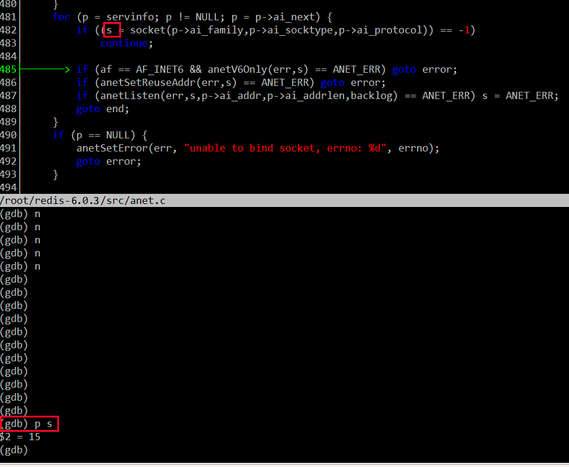

然后在运行程序至绑定 fd 的地方，确认一下绑定到 epfd 上的 fd 值：

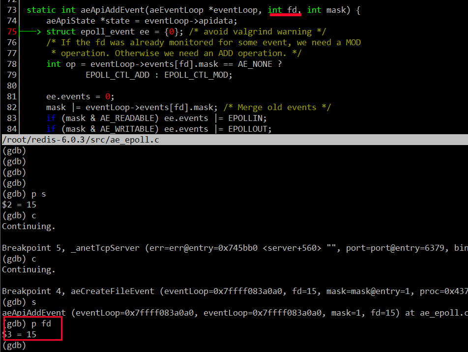

这里的 fd 值也是 15，说明绑定的 fd 是侦听 fd。当然在绑定侦听 fd 时，同时也指定了只关注可读事件，并设置事件回调函数为 acceptTcpHandler。对于侦听 fd，我们一般只要关注可读事件就可以了，一般当触发可读事件，说明有新的连接到来。

```c++
//server.c 2886行
if (aeCreateFileEvent(server.el, server.ipfd[j], AE_READABLE,
            acceptTcpHandler,NULL) == AE_ERR)
{
    serverPanic("Unrecoverable error creating server.ipfd file event.");
}

```

acceptTcpHandler 函数就是侦听 fd 的读事件回调函数 rfileProc 的实际指向，还记得前文中 fd 读事件处理函数 rfileProc 和写事件处理函数 wfileProc 吗？

acceptTcpHandler 函数调用 anetTcpAccept，anetTcpAccept 又调用 anetGenericAccept 。我们用 gdb 在 anetGenericAccept 函数处设置一个断点，然后重启 redis-server，再新开一个 shell 窗口启动一个 redis-cli 客户端，redis-server 就会在anetGenericAccept 处中断下来，查看此时的调用堆栈可以反映出上述调用关系（acceptTcpHandler =>anetTcpAccept=>anetGenericAccept）:
```shell
Thread 1 "redis-server" hit Breakpoint 1, anetGenericAccept (err=0x568c48 <server+680> "", s=7, sa=0x7fffffffe000, len=0x7fffffffdffc) at anet.c:548
548             fd = accept(s,sa,len);
(gdb) l
543     }
544
545     static int anetGenericAccept(char *err, int s, struct sockaddr *sa, socklen_t *len) {
546         int fd;
547         while(1) {
548             fd = accept(s,sa,len);
549             if (fd == -1) {
550                 if (errno == EINTR)
551                     continue;
552                 else {
(gdb) bt
#0  anetGenericAccept (err=0x568c48 <server+680> "", s=7, sa=0x7fffffffe000, len=0x7fffffffdffc) at anet.c:548
#1  0x000000000042afa8 in anetTcpAccept (err=0x568c48 <server+680> "", s=7, ip=0x7fffffffe0d0 "@\341\377\377\377\177", ip_len=46, port=0x7fffffffe104) at anet.c:566
#2  0x0000000000442540 in acceptTcpHandler (el=0x5e5760, fd=7, privdata=0x0, mask=1) at networking.c:979
#3  0x00000000004298bf in aeProcessEvents (eventLoop=0x5e5760, flags=27) at ae.c:479
#4  0x0000000000429ab6 in aeMain (eventLoop=0x5e5760) at ae.c:539
#5  0x00000000004372bb in main (argc=1, argv=0x7fffffffe308) at server.c:5175
(gdb)

```

在 acceptTcpHandler 中成功接受新连接后，产生客户端 cfd（即 clientfd），然后调用 acceptCommonHandler 函数，传递第一个参数时调用 connCreateAcceptedSocket 函数创建与每个 cfd 对应的 connection 对象。
```c++
//networking.c 971行
void acceptTcpHandler(aeEventLoop *el, int fd, void *privdata, int mask) {
    int cport, cfd, max = MAX_ACCEPTS_PER_CALL;
    char cip[NET_IP_STR_LEN];
    UNUSED(el);
    UNUSED(mask);
    UNUSED(privdata);

    while(max--) {
        cfd = anetTcpAccept(server.neterr, fd, cip, sizeof(cip), &cport);
        if (cfd == ANET_ERR) {
            if (errno != EWOULDBLOCK)
                serverLog(LL_WARNING,
                    "Accepting client connection: %s", server.neterr);
            return;
        }
        serverLog(LL_VERBOSE,"Accepted %s:%d", cip, cport);
        //传递第一个参数时调用connCreateAcceptedSocket创建connection对象
        acceptCommonHandler(connCreateAcceptedSocket(cfd),0,cip);
    }
}

```

connCreateAcceptedSocket 内部调用 connCreateSocket 函数，这个函数是实际创建 connection 对象的函数，connCreateAcceptSocket 函数定义如下：
```c++
//connection.c 91行
connection *connCreateAcceptedSocket(int fd) {
    //connCreateSocket是实际创建connection对象的函数
    connection *conn = connCreateSocket();
    conn->fd = fd;
    conn->state = CONN_STATE_ACCEPTING;
    return conn;
}

```

connCreateSocket 函数定义如下：
```c++
//connection.c 71行
connection *connCreateSocket() {
    connection *conn = zcalloc(sizeof(connection));
    conn->type = &CT_Socket;
    conn->fd = -1;

    return conn;
}

```

connection 对象的定义如下：
```c++
//connection.h 69行
struct connection {
    ConnectionType *type;
    ConnectionState state;
    short int flags;
    short int refs;
    int last_errno;
    void *private_data;
    ConnectionCallbackFunc conn_handler;
    ConnectionCallbackFunc write_handler;
    ConnectionCallbackFunc read_handler;
    int fd;
};

```

fd 字段记录上述 cfd，注意一下 type 字段，这个字段中记录了这个 fd 的发生读写等事件的各种回调函数和设置回调函数的函数（有点拗口哦），ConnectionType 定义如下：

```c++
//connection.h 53行
typedef struct ConnectionType {
    void (*ae_handler)(struct aeEventLoop *el, int fd, void *clientData, int mask);
    int (*connect)(struct connection *conn, const char *addr, int port, const char *source_addr, ConnectionCallbackFunc connect_handler);
    //侦听 fd 不使用这个回调
    int (*write)(struct connection *conn, const void *data, size_t data_len);
    //cfd 会设置这个字段
    int (*read)(struct connection *conn, void *buf, size_t buf_len);
    void (*close)(struct connection *conn);
    int (*accept)(struct connection *conn, ConnectionCallbackFunc accept_handler);
    int (*set_write_handler)(struct connection *conn, ConnectionCallbackFunc handler, int barrier);
    int (*set_read_handler)(struct connection *conn, ConnectionCallbackFunc handler);
    const char *(*get_last_error)(struct connection *conn);
    int (*blocking_connect)(struct connection *conn, const char *addr, int port, long long timeout);
    ssize_t (*sync_write)(struct connection *conn, char *ptr, ssize_t size, long long timeout);
    ssize_t (*sync_read)(struct connection *conn, char *ptr, ssize_t size, long long timeout);
    ssize_t (*sync_readline)(struct connection *conn, char *ptr, ssize_t size, long long timeout);
} ConnectionType;

```

回调函数指的是上述代码段中的 ae_handler、connect、write、read、close、accept 字段，设置回调函数的函数指的是上述代码段中的 set_write_handler、set_read_handler、get_last_error、blocking_connect、sync_write、sync_read、sync_readline 字段。

设置回调函数的函数在 fd 创建时（无论是 listenfd 还是 clientfd），统一调用 connCreateSocket 函数创建 connection 对象的指定，如何指定的呢？在 connCreateSocket 函数中有这么一行：
```c++
//connection.c 71行
connection *connCreateSocket() {
    connection *conn = zcalloc(sizeof(connection));
    //这一行设置回调函数的函数
    conn->type = &CT_Socket;
    conn->fd = -1;

    return conn;
}

```

conn->type 的类型为 ConnectionType*，这里设置其引用一个全局变量 CT_Socket，CT_Socket 定义如下：
```c++
ConnectionType CT_Socket = {
    .ae_handler = connSocketEventHandler,
    .close = connSocketClose,
    .write = connSocketWrite,
    .read = connSocketRead,
    .accept = connSocketAccept,
    .connect = connSocketConnect,
    .set_write_handler = connSocketSetWriteHandler,
    .set_read_handler = connSocketSetReadHandler,
    .get_last_error = connSocketGetLastError,
    .blocking_connect = connSocketBlockingConnect,
    .sync_write = connSocketSyncWrite,
    .sync_read = connSocketSyncRead,
    .sync_readline = connSocketSyncReadLine
};

```

如此设置之后，clientfd 对应的 connection 对象的 type 字段的各个回调字段就被设置好了，例如 ae_handler 实际指向 connSocketEventHandler，set_read_handler 实际指向 connSocketSetReadHandler 函数。

struct ConnectionType 注意不同类型的 fd 只要使用这个结构中的某几个回调，例如对于侦听 fd 就不使用 write 回调。对于这里的 cfd，初始状态下我们只关心这个 fd 的读事件，因此只要设置 read 字段就可以了。在哪里设置的呢？

创建好 connection 对象后，这个对象被当做 acceptCommonHandler 函数的第一个参数传入，

acceptCommonHandler 函数定义如下：
```c++
//networking.c 915行
static void acceptCommonHandler(connection *conn, int flags, char *ip) {
    
    //...省略部分代码...

    /* Create connection and client */
    if ((c = createClient(conn)) == NULL) {
        char conninfo[100];
        serverLog(LL_WARNING,
            "Error registering fd event for the new client: %s (conn: %s)",
            connGetLastError(conn),
            connGetInfo(conn, conninfo, sizeof(conninfo)));
        connClose(conn); /* May be already closed, just ignore errors */
        return;
    }

    //...省略部分代码...
}

```

在 acceptCommonHandler 函数中调用 createClient 函数，createClient 函数的定义如下：
```c++
//networking.c 88行
client *createClient(connection *conn) {
	//...省略部分代码...

    connNonBlock(conn);
    connEnableTcpNoDelay(conn);

    connKeepAlive(conn,server.tcpkeepalive);
    connSetReadHandler(conn, readQueryFromClient);
    
    //...省略部分代码...
}

```

在 createClient 函数中先将客户端 fd 设置成非阻塞的，然后将该 fd 绑定到 epfd 上去，同时记录到整个程序的 aeEventLoop 对象上，并调用 connSetReadHandler 函数设置处理该 fd （上文中的 cfd）可读事件的回调函数为 readQueryFromClient。connSetReadHandler 实际调用的是我们上文说的 connection 对象的 type 字段的 set_read_handler 字段指向的回调函数。
```c++
//connection.h 161行
static inline int connSetReadHandler(connection *conn, ConnectionCallbackFunc func) {
    //func参数值是readQueryFromClient，一路下传
    return conn->type->set_read_handler(conn, func);
}

```

conn->type->set_read_handler 上文已经介绍过了，实际指向 connSocketSetReadHandler 函数，在 connSocketSetReadHandler 这个函数中将 clientfd 对应的 connection 对象的 read_handler 设置为 readQueryFromClient， connSocketSetReadHandler 函数的定义如下：
```c++
//connection.c 225行
static int connSocketSetReadHandler(connection *conn, ConnectionCallbackFunc func) {
    if (func == conn->read_handler) return C_OK;

	//func值是readQueryFromClient，因此
	//在这里将conn->read_handler设置为readQueryFromClient函数
    conn->read_handler = func;
    if (!conn->read_handler)
        aeDeleteFileEvent(server.el,conn->fd,AE_READABLE);
    else
        if (aeCreateFileEvent(server.el,conn->fd,
                    AE_READABLE,conn->type->ae_handler,conn) == AE_ERR) return C_ERR;
    return C_OK;
}

```

在 connSocketSetReadHandler 函数中，当 clientfd 首次创建时，调用 aeCreateFileEvent 函数将 clientfd 绑定到 epollfd 上并设置监听读事件，读事件触发后的回调函数是 conn->type->ae_handler，aeCreateFileEvent 前文已经介绍过了，clientfd 与 listenfd 在此处的处理逻辑是一样的。

conn->type->ae_handler 函数在前文中介绍过了，实际指向的是 connSocketEventHandler，connSocketEventHandler 函数定义如下：
```c++
static void connSocketEventHandler(struct aeEventLoop *el, int fd, void *clientData, int mask)
{
    //...省略部分代码...

    int call_read = (mask & AE_READABLE) && conn->read_handler;

    /* Handle normal I/O flows */
    if (!invert && call_read) {
    	//conn->read_handler实际指向readQueryFromClient
        if (!callHandler(conn, conn->read_handler)) return;
    }
    
     //...省略部分代码...
}

```

在 connSocketEventHandler 函数中，对于读事件，最终调用的是 callHandler(conn, conn->read_handler)：
```c++
//connhelpers.h 77行
static inline int callHandler(connection *conn, ConnectionCallbackFunc handler) {
    connIncrRefs(conn);
    //实际指向关系
    //handler(conn) => conn->read_handler(conn) => readQueryFromClient(conn)
    if (handler) handler(conn);
    connDecrRefs(conn);
    if (conn->flags & CONN_FLAG_CLOSE_SCHEDULED) {
        if (!connHasRefs(conn)) connClose(conn);
        return 0;
    }
    return 1;
}

```

由于 conn->read_handler 实际指向的是 readQueryFromClient，因此最终调用了 readQueryFromClient 函数。

上述通过回调指针在各个函数之间传递很容易让人迷惑，在 readQueryFromClient 处设置一个断点，然后使用 redis-cli 发送一条指令，此时会触发该函数，调用堆栈如下所示：
```shell
Thread 1 "redis-server" hit Breakpoint 1, readQueryFromClient (conn=0x629510) at networking.c:1891
1891        client *c = connGetPrivateData(conn);
(gdb) bt
#0  readQueryFromClient (conn=0x629510) at networking.c:1891
#1  0x00000000004dc455 in callHandler (conn=0x629510, handler=0x444809 <readQueryFromClient>) at connhelpers.h:79
#2  0x00000000004dcae2 in connSocketEventHandler (el=0x5e5750, fd=8, clientData=0x629510, mask=1) at connection.c:281
#3  0x00000000004298bf in aeProcessEvents (eventLoop=0x5e5750, flags=27) at ae.c:479
#4  0x0000000000429ab6 in aeMain (eventLoop=0x5e5750) at ae.c:539
#5  0x00000000004372bb in main (argc=1, argv=0x7fffffffe318) at server.c:5175
(gdb) 

```

将从侦听 fd 的初始化到客户端 fd 的可读事件回调函数被调用整个流程绘制成如下图示：
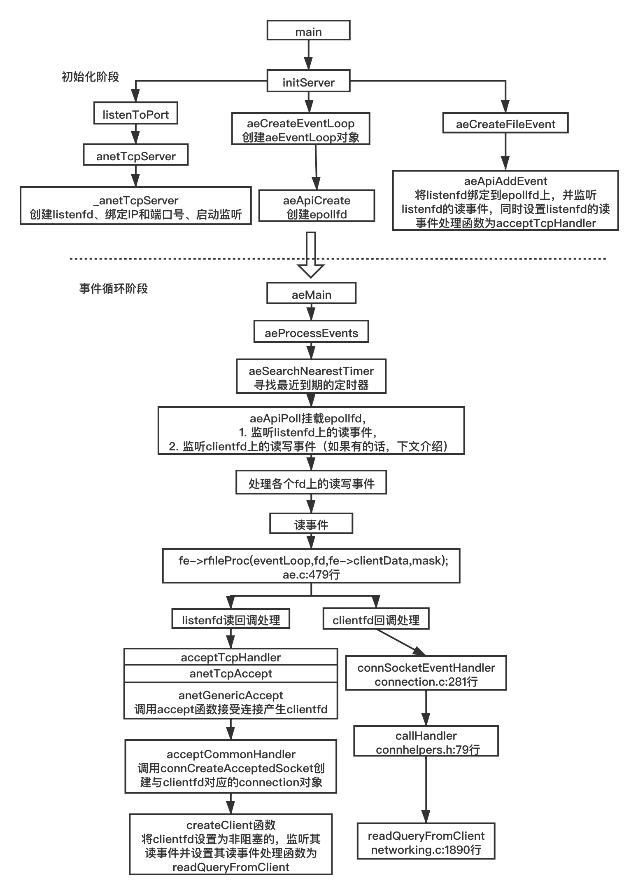

### readQueryFromClient 函数
readQueryFromClient 函数中的主要逻辑是从 clientfd 收取数据并解包成相应 redis 命令加以处理。
```shell
//networking.c 1890行
void readQueryFromClient(connection *conn) {
    //...省略部分代码...
    int nread, readlen;
    size_t qblen;

    //这里的逻辑用于redis多线程IO逻辑
    if (postponeClientRead(c)) return;

	//每次最大收取字节数目，PROTO_IOBUF_LEN=1024*16
    readlen = PROTO_IOBUF_LEN;
    
    //...省略部分代码...

	//计算当前接受缓冲区已有数据的偏移量
    qblen = sdslen(c->querybuf);
    //扩大缓冲区数量至readlen
    c->querybuf = sdsMakeRoomFor(c->querybuf, readlen);
    //从clientfd上读取数据
    nread = connRead(c->conn, c->querybuf+qblen, readlen);
    
    //...省略部分代码...
    
    //接收数据后更新接收缓冲区的数据长度
    sdsIncrLen(c->querybuf,nread);
    
    //...省略部分代码...
    
    //处理接受缓冲区的数据
    processInputBuffer(c);
}

```

readQueryFromClient 函数在准备好合适的接收缓冲区后，调用 connRead 函数进行实际的数据读取，connRead 函数定义如下：
```c++
//connection.h 147行
static inline int connRead(connection *conn, void *buf, size_t buf_len) {
    return conn->type->read(conn, buf, buf_len);
}

```

conn->type->read 是一个函数指针，实际指向 connSocketRead 函数，这个函数中调用 socket read API 进行数据收取：
```c++
//connection.c 173行
static int connSocketRead(connection *conn, void *buf, size_t buf_len) {
    int ret = read(conn->fd, buf, buf_len);
    if (!ret) {
        conn->state = CONN_STATE_CLOSED;
    } else if (ret < 0 && errno != EAGAIN) {
        conn->last_errno = errno;
        conn->state = CONN_STATE_ERROR;
    }

    return ret;
}

```

收取的数据记录在 client 对象的 querybuf 中（接受缓冲区），然后调用 processInputBuffer 函数对数据进行解包，然后调用 processCommandAndResetClient 函数执行相应的命令，这些命令来自客户端。
```c++
//networking.c 1807行
void processInputBuffer(client *c) {
    //...省略部分代码...

    /* We are finally ready to execute the command. */
    if (processCommandAndResetClient(c) == C_ERR) {
        /* If the client is no longer valid, we avoid exiting this
        * loop and trimming the client buffer later. So we return
        * ASAP in that case. */
        return;
    }
    
    //...省略部分代码...
}

```

processCommandAndResetClient 函数内部调用 processCommand 函数，processCommand 函数是实际处理客户端命令的函数：
```c++
//networking.c 1789行
int processCommandAndResetClient(client *c) {
    int deadclient = 0;
    server.current_client = c;
    if (processCommand(c) == C_OK) {
        commandProcessed(c);
    }
    if (server.current_client == NULL) deadclient = 1;
    server.current_client = NULL;
    /* freeMemoryIfNeeded may flush slave output buffers. This may
     * result into a slave, that may be the active client, to be
     * freed. */
    return deadclient ? C_ERR : C_OK;
}

```

## 如何处理可写事件
processCommand 函数在处理完命令之后生成给客户端应答数据，调用 addReply 函数，addReply 函数定义如下：
```c++
//networking.c 306行
void addReply(client *c, robj *obj) {
    if (prepareClientToWrite(c) != C_OK) return;

    if (sdsEncodedObject(obj)) {
        if (_addReplyToBuffer(c,obj->ptr,sdslen(obj->ptr)) != C_OK)
            _addReplyProtoToList(c,obj->ptr,sdslen(obj->ptr));
    } else if (obj->encoding == OBJ_ENCODING_INT) {
        /* For integer encoded strings we just convert it into a string
         * using our optimized function, and attach the resulting string
         * to the output buffer. */
        char buf[32];
        size_t len = ll2string(buf,sizeof(buf),(long)obj->ptr);
        if (_addReplyToBuffer(c,buf,len) != C_OK)
            _addReplyProtoToList(c,buf,len);
    } else {
        serverPanic("Wrong obj->encoding in addReply()");
    }
}

```

addReply 函数内部先调用 prepareClientToWrite，prepareClientToWrite 内部检测如果当前客户端在发送缓冲区已经存在未发送数据，则当前 socket 理论上说处于不可写状态，注册可写事件、设置可写事件触发回调：
```c++
int prepareClientToWrite(client *c) {
    //...省略部分代码...

    //检测如果当前客户端在发送缓冲区已经存在未发送数据，
    //如果是，则将数据附加至未发送数据尾部并注册可写事件、设置可写事件触发回调：
    if (!clientHasPendingReplies(c)) clientInstallWriteHandler(c);

    //...省略部分代码...
}

```

addReply 接着调用 _addReplyToBuffer 函数，_addReplyToBuffer 函数定义如下：
```c++
//networking.c 247行
int _addReplyToBuffer(client *c, const char *s, size_t len) {
    size_t available = sizeof(c->buf)-c->bufpos;

    if (c->flags & CLIENT_CLOSE_AFTER_REPLY) return C_OK;

    /* If there already are entries in the reply list, we cannot
     * add anything more to the static buffer. */
    if (listLength(c->reply) > 0) return C_ERR;

    /* Check that the buffer has enough space available for this string. */
    if (len > available) return C_ERR;

    memcpy(c->buf+c->bufpos,s,len);
    c->bufpos+=len;
    return C_OK;
}

```

_addReplyToBuffer 函数将待发送的数据放入发送缓冲区中（c->buf，即 client 对象的 buf 字段），如果发送缓冲区已经有数据了，则本次的数据在附加在上一次数据的尾部。

现在待发送的数据已经存入发送缓冲区了，那么这些数据何时被发出去呢？

上面介绍了 redis-server 如何处理可读事件，整个流程就是注册可读事件回调函数，在回调函数中调用操作系统 API read 函数收取数据，然后解析数据得到 redis 命令，处理命令接着将应答数据包放到 client 对象的buf字段中去。那么放入 buf 字段的数据何时发给客户端呢？

还记得那个 while 事件循环吗？来回顾一下它的代码：
```c++
//ae.c 536行
void aeMain(aeEventLoop *eventLoop) {
    eventLoop->stop = 0;
    while (!eventLoop->stop) {
        if (eventLoop->beforesleep != NULL)
            eventLoop->beforesleep(eventLoop);
        aeProcessEvents(eventLoop, AE_ALL_EVENTS|AE_CALL_AFTER_SLEEP);
    }
}

```

其中，先判断 eventLoop 对象的 beforesleep 对象是否设置了，这是一个回调函数。在 redis-server 初始化时已经设置好了。
```c++
//ae.c 549行
void aeSetBeforeSleepProc(aeEventLoop *eventLoop, aeBeforeSleepProc *beforesleep) {
    eventLoop->beforesleep = beforesleep;
}

```

在 aeSetBeforeSleepProc 这个函数上设置一个断点，然后重启一下 redis-server 来验证一下在何处设置的这个回调。
```shell
(gdb) b aeSetBeforeSleepProc
Breakpoint 1 at 0x429ada: file ae.c, line 550.
(gdb) r
Starting program: /root/redis-6.0.3/src/redis-server 
[Thread debugging using libthread_db enabled]
Using host libthread_db library "/usr/lib64/libthread_db.so.1".
31514:C 21 Jun 2020 15:57:56.254 # oO0OoO0OoO0Oo Redis is starting oO0OoO0OoO0Oo
31514:C 21 Jun 2020 15:57:56.254 # Redis version=6.0.3, bits=64, commit=00000000, modified=0, pid=31514, just started
31514:C 21 Jun 2020 15:57:56.254 # Warning: no config file specified, using the default config. In order to specify a config file use /root/redis-6.0.3/src/redis-server /path/to/redis.conf

Breakpoint 1, aeSetBeforeSleepProc (eventLoop=0x5e5750, beforesleep=0x42f866 <beforeSleep>) at ae.c:550
550         eventLoop->beforesleep = beforesleep;
(gdb) bt
#0  aeSetBeforeSleepProc (eventLoop=0x5e5750, beforesleep=0x42f866 <beforeSleep>) at ae.c:550
#1  0x00000000004319ac in initServer () at server.c:2916
#2  0x000000000043712a in main (argc=1, argv=0x7fffffffe318) at server.c:5128
(gdb) 

```

使用 f 1 命令切换到堆栈 #1，并输入 l 显示断点附近的代码：
```shell
(gdb) f 1
#1  0x00000000004319ac in initServer () at server.c:2916
2916        aeSetBeforeSleepProc(server.el,beforeSleep);
(gdb) l
2911                    "blocked clients subsystem.");
2912        }
2913
2914        /* Register before and after sleep handlers (note this needs to be done
2915         * before loading persistence since it is used by processEventsWhileBlocked. */
2916        aeSetBeforeSleepProc(server.el,beforeSleep);
2917        aeSetAfterSleepProc(server.el,afterSleep);
2918
2919        /* Open the AOF file if needed. */
2920        if (server.aof_state == AOF_ON) {
(gdb) 

```

在 server.c 2916 行将这个回调设置成 beforeSleep 函数。因此每一轮循环都会调用这个 beforeSleep 函数。aeSetBeforeSleepProc 第一个参数 server.el 就是 aeEventLoop 对象。在这个 beforeSleep 函数中有一个 handleClientsWithPendingWritesUsingThreads 调用（位于文件 server.c 中）：
```c
//server.c 2106行
void beforeSleep(struct aeEventLoop *eventLoop) {
    //...省略部分代码...

	//server.c 2185行
    /* Handle writes with pending output buffers. */
    handleClientsWithPendingWritesUsingThreads();
	
	//...省略部分代码...
}

```

handleClientsWithPendingWritesUsingThreads 函数调用即把记录在每个 client 中的数据发送出去。具体看一下发送的逻辑（位于 networking.c 文件中）：
```c
int handleClientsWithPendingWritesUsingThreads(void) {
    //...省略部分代码...

    /* If I/O threads are disabled or we have few clients to serve, don't
     * use I/O threads, but thejboring synchronous code. */
    if (server.io_threads_num == 1 || stopThreadedIOIfNeeded()) {
        return handleClientsWithPendingWrites();
    }

    /* Start threads if needed. */
    if (!io_threads_active) startThreadedIO();

    //...省略部分代码...
}

```

在 redis 6.0 版本之前，redis 的网络 IO 线程都是单线程的，从 redis 6.0 之后引入了多线程 IO，handleClientsWithPendingWritesUsingThreads 函数中有这样一段逻辑，如果 redis.conf 配置文件中多线程网络 IO 未开启或者客户端连接数比较少，则直接调用 handleClientsWithPendingWrites 函数，反之，根据 redis.conf 配置文件中配置多线程数量来开启新的网络 IO 线程（startThreadedIO 函数）。

先来开不开启多线程网络 IO 的情况下，会调用 handleClientsWithPendingWrites 函数，该函数定义如下：
```c
//networking 1398行
listIter li;
    listNode *ln;
    int processed = listLength(server.clients_pending_write);

    listRewind(server.clients_pending_write,&li);
    while((ln = listNext(&li))) {
        client *c = listNodeValue(ln);
        c->flags &= ~CLIENT_PENDING_WRITE;
        listDelNode(server.clients_pending_write,ln);

        /* If a client is protected, don't do anything,
         * that may trigger write error or recreate handler. */
        if (c->flags & CLIENT_PROTECTED) continue;

        /* Try to write buffers to the client socket. */
        if (writeToClient(c,0) == C_ERR) continue;

        /* If after the synchronous writes above we still have data to
         * output to the client, we need to install the writable handler. */
        if (clientHasPendingReplies(c)) {
            int ae_barrier = 0;
            /* For the fsync=always policy, we want that a given FD is never
             * served for reading and writing in the same event loop iteration,
             * so that in the middle of receiving the query, and serving it
             * to the client, we'll call beforeSleep() that will do the
             * actual fsync of AOF to disk. the write barrier ensures that. */
            if (server.aof_state == AOF_ON &&
                server.aof_fsync == AOF_FSYNC_ALWAYS)
            {
                ae_barrier = 1;
            }
            if (connSetWriteHandlerWithBarrier(c->conn, sendReplyToClient, ae_barrier) == C_ERR) {
                freeClientAsync(c);
            }
        }
    }
    return processed;

```

handleClientsWithPendingWrites 函数先从全局 server 对象的 clients_pending_write 字段（存储 client 对象的链表）挨个取出有数据要发送的 client 对象，然后调用 writeToClient 函数尝试将 client 中存储的应答数据发出去。
```c
//networking.c 1292行
int writeToClient(client *c, int handler_installed) {
    ssize_t nwritten = 0, totwritten = 0;
    size_t objlen;
    clientReplyBlock *o;

    while(clientHasPendingReplies(c)) {
        if (c->bufpos > 0) {
            nwritten = connWrite(c->conn,c->buf+c->sentlen,c->bufpos-c->sentlen);
            if (nwritten <= 0) break;
            c->sentlen += nwritten;
            totwritten += nwritten;

            /* If the buffer was sent, set bufpos to zero to continue with
             * the remainder of the reply. */
            if ((int)c->sentlen == c->bufpos) {
                c->bufpos = 0;
                c->sentlen = 0;
            }
        } else {
            o = listNodeValue(listFirst(c->reply));
            objlen = o->used;

            if (objlen == 0) {
                c->reply_bytes -= o->size;
                listDelNode(c->reply,listFirst(c->reply));
                continue;
            }

            nwritten = connWrite(c->conn, o->buf + c->sentlen, objlen - c->sentlen);
            if (nwritten <= 0) break;
            c->sentlen += nwritten;
            totwritten += nwritten;

            /* If we fully sent the object on head go to the next one */
            if (c->sentlen == objlen) {
                c->reply_bytes -= o->size;
                listDelNode(c->reply,listFirst(c->reply));
                c->sentlen = 0;
                /* If there are no longer objects in the list, we expect
                 * the count of reply bytes to be exactly zero. */
                if (listLength(c->reply) == 0)
                    serverAssert(c->reply_bytes == 0);
            }
        }
        /* Note that we avoid to send more than NET_MAX_WRITES_PER_EVENT
         * bytes, in a single threaded server it's a good idea to serve
         * other clients as well, even if a very large request comes from
         * super fast link that is always able to accept data (in real world
         * scenario think about 'KEYS *' against the loopback interface).
         *
         * However if we are over the maxmemory limit we ignore that and
         * just deliver as much data as it is possible to deliver.
         *
         * Moreover, we also send as much as possible if the client is
         * a slave or a monitor (otherwise, on high-speed traffic, the
         * replication/output buffer will grow indefinitely) */
        if (totwritten > NET_MAX_WRITES_PER_EVENT &&
            (server.maxmemory == 0 ||
             zmalloc_used_memory() < server.maxmemory) &&
            !(c->flags & CLIENT_SLAVE)) break;
    }
    server.stat_net_output_bytes += totwritten;
    if (nwritten == -1) {
        if (connGetState(c->conn) == CONN_STATE_CONNECTED) {
            nwritten = 0;
        } else {
            serverLog(LL_VERBOSE,
                "Error writing to client: %s", connGetLastError(c->conn));
            freeClientAsync(c);
            return C_ERR;
        }
    }
    if (totwritten > 0) {
        /* For clients representing masters we don't count sending data
         * as an interaction, since we always send REPLCONF ACK commands
         * that take some time to just fill the socket output buffer.
         * We just rely on data / pings received for timeout detection. */
        if (!(c->flags & CLIENT_MASTER)) c->lastinteraction = server.unixtime;
    }
    if (!clientHasPendingReplies(c)) {
        c->sentlen = 0;
        /* Note that writeToClient() is called in a threaded way, but
         * adDeleteFileEvent() is not thread safe: however writeToClient()
         * is always called with handler_installed set to 0 from threads
         * so we are fine. */
        if (handler_installed) connSetWriteHandler(c->conn, NULL);

        /* Close connection after entire reply has been sent. */
        if (c->flags & CLIENT_CLOSE_AFTER_REPLY) {
            freeClientAsync(c);
            return C_ERR;
        }
    }
    return C_OK;
}

```

writeToClient 函数先把自己处理的 client 对象的 buf 字段的数据发出去，如果出错的话则释放这个 client。如果数据能够全部发完，发完以后，则会移除对应的 fd 上的可写事件（如果添加了）；如果当前 client 设置了 CLIENT_CLOSE_AFTER_REPLY 标志，则发送完数据，立即释放这个 client 对象。

实际发送数据的函数是 connWrite，这个函数内部调用最初设置的写回调函数：
```c
//connection.h 135行
static inline int connWrite(connection *conn, const void *data, size_t data_len) {
    return conn->type->write(conn, data, data_len);
}

```

如前文所分析，conn->type->write 实际指向 connSocketWrite：
```c
//connection.c 163行
static int connSocketWrite(connection *conn, const void *data, size_t data_len) {
    int ret = write(conn->fd, data, data_len);
    if (ret < 0 && errno != EAGAIN) {
        conn->last_errno = errno;
        conn->state = CONN_STATE_ERROR;
    }

    return ret;
}

```

当然，可能存在一种情况是，由于网络或者客户端的原因，redis-server 某个客户端的数据发送不出去，或者只有部分可以发出去（例如：服务器端给客户端发数据，客户端的应用层一直不从 TCP 内核缓冲区中取出数据，这样服务器发送一段时间的数据后，客户端内核缓冲区满了，服务器再发数据就会发不出去了。由于 fd 是非阻塞的，这个时候服务器调用 send 或者 **write** 函数会直接返回，返回值是 -1，错误码是 EAGAIN ，见上面的代码。）。不管哪种情况，数据这一次发不完，这个时候就需要监听可写事件了，在 handleClientsWithPendingWrites 函数中有如下代码：
```c
//networking.c 1398行
int handleClientsWithPendingWrites(void) {
    	//...省略部分代码...

        /* Try to write buffers to the client socket. */
        if (writeToClient(c,0) == C_ERR) continue;

        /* If after the synchronous writes above we still have data to
         * output to the client, we need to install the writable handler. */
        if (clientHasPendingReplies(c)) {
            //...省略部分代码...
            
            if (connSetWriteHandlerWithBarrier(c->conn, sendReplyToClient, ae_barrier) == C_ERR) {
                freeClientAsync(c);
            }
        }
        
    //...省略部分代码...
}

```

实际注册可写事件的函数是 connSetWriteHandlerWithBarrier，该函数定义如下：
```c
//connection.h 170行
static inline int connSetWriteHandlerWithBarrier(connection *conn, ConnectionCallbackFunc func, int barrier) {
    return conn->type->set_write_handler(conn, func, barrier);
}

```

conn->type->set_write_handler 如前所述，实际指向
```c
//connection.c 206行
static int connSocketSetWriteHandler(connection *conn, ConnectionCallbackFunc func, int barrier) {
    if (func == conn->write_handler) return C_OK;

    conn->write_handler = func;
    if (barrier)
        conn->flags |= CONN_FLAG_WRITE_BARRIER;
    else
        conn->flags &= ~CONN_FLAG_WRITE_BARRIER;
    if (!conn->write_handler)
        aeDeleteFileEvent(server.el,conn->fd,AE_WRITABLE);
    else
    	//在这一行注册可写事件
        if (aeCreateFileEvent(server.el,conn->fd,AE_WRITABLE,
                    conn->type->ae_handler,conn) == AE_ERR) return C_ERR;
    return C_OK;
}

```

需要注册可写事件的时，执行的逻辑是 aeCreateFileEvent，反之则是移除注册可写事件，执行逻辑 aeDeleteFileEvent，这种情形是当注册的可写事件触发后数据全部发送完毕后。

这里注册可写事件 AE_WRITABLE 的回调函数是 sendReplyToClient。也就是说，当下一次某个触发可写事件时，调用的就是 sendReplyToClient 函数了。可以猜想，sendReplyToClient 发送数据的逻辑和上面的 writeToClient 函数一模一样，不信请看：
```c
//networking.c 1389行
void sendReplyToClient(connection *conn) {
    client *c = connGetPrivateData(conn);
    writeToClient(c,1);
}

```

至此，redis-server 发送数据的逻辑也理清楚了。这里简单做个总结：

- 如果有数据要发送给某个 client，不是一上来就专门注册可写事件、等触发可写事件再发送，通常的做法是，在应答数据产生的地方直接发送，如果是因为对端 TCP 窗口太小引起的发送不完，则将剩余的数据存储至发送缓冲区中并注册监听可写事件，等下次触发可写事件后再尝试发送，一直到数据全部发送完毕后移除可写事件。

- redis-server 数据的发送逻辑与这个稍微有点差别，就是将数据发送的时机放到了 EventLoop 的某个时间点上（这里是在 ProcessEvents 之前），其他的逻辑与上面介绍的通常逻辑一样。

之所以不注册监听可写事件，等可写事件触发再发送数据，原因是通常情况下，网络通信的两端数据一般都是正常收发的，一般不会出现某一端由于 TCP 窗口太小而使另外一端发不出去的情况。如果注册监听可写事件，那么这个事件会频繁触发，而触发时不一定有数据需要发送，这样不仅浪费系统资源，同时也浪费服务器程序宝贵的 CPU 时间片。

### redis 6.0 多线程网络 IO
redis 6.0 中默认是不启用多线程网络 IO，可以通过修改 redis.conf 的相关配置项打开，打开方法如下所示：
```c
# So for instance if you have a four cores boxes, try to use 2 or 3 I/O
# threads, if you have a 8 cores, try to use 6 threads. In order to
# enable I/O threads use the following configuration directive:
#
# io-threads 4
#
# Setting io-threads to 1 will just use the main thread as usually.
# When I/O threads are enabled, we only use threads for writes, that is
# to thread the write(2) syscall and transfer the client buffers to the
# socket. However it is also possible to enable threading of reads and
# protocol parsing using the following configuration directive, by setting
# it to yes:
#
# io-threads-do-reads no
#

```

将 io-threads 打开（去掉前面的 # ）设置成你期望的线程数目，io-threads-do-reads 配置也要打开（去掉前面的 # ），其值改为 yes。

修改了这两个配置项后，使用 gdb 命令 set args "../redis.conf" 给 redis-server 设置参数，然后重启 redis-server。

```shell
(gdb) set args "../redis.conf"
(gdb) r
The program being debugged has been started already.
Start it from the beginning? (y or n) y
Starting program: /root/redis-6.0.3/src/redis-server "../redis.conf"
[Thread debugging using libthread_db enabled]
Using host libthread_db library "/usr/lib64/libthread_db.so.1".

```

然后按 Ctrl + C 将程序中断下来，使用 info threads 命令查看此时的线程状况：
```c
(gdb) info threads
  Id   Target Id                                          Frame 
* 1    Thread 0x7ffff7feb740 (LWP 11992) "redis-server"   0x00007ffff71e2603 in epoll_wait () from /usr/lib64/libc.so.6
  2    Thread 0x7ffff0bb9700 (LWP 11993) "bio_close_file" 0x00007ffff74bc965 in pthread_cond_wait@@GLIBC_2.3.2 () from /usr/lib64/libpthread.so.0
  3    Thread 0x7ffff03b8700 (LWP 11994) "bio_aof_fsync"  0x00007ffff74bc965 in pthread_cond_wait@@GLIBC_2.3.2 () from /usr/lib64/libpthread.so.0
  4    Thread 0x7fffefbb7700 (LWP 11995) "bio_lazy_free"  0x00007ffff74bc965 in pthread_cond_wait@@GLIBC_2.3.2 () from /usr/lib64/libpthread.so.0
  5    Thread 0x7fffef3b6700 (LWP 11996) "io_thd_1"       0x00007ffff74bf4ed in __lll_lock_wait () from /usr/lib64/libpthread.so.0
  6    Thread 0x7fffeebb5700 (LWP 11997) "io_thd_2"       0x00007ffff74bf4ed in __lll_lock_wait () from /usr/lib64/libpthread.so.0
  7    Thread 0x7fffee3b4700 (LWP 11998) "io_thd_3"       0x00007ffff74bf4ed in __lll_lock_wait () from /usr/lib64/libpthread.so.0
(gdb) 

```

与未开启多线程网络 IO 的线程情况相比，多了线程名为 io_thd_1、io_thd_2、io_thd_3 线程，加上主线程一共四个 IO 线程（io-threads = 4），我们重点来看下这三个 IO 工作线程，这三个工作线程的逻辑一样，我们以 io_thd_1 为例。使用 thread 5 命令切换到 io_thd_1 线程，使用 bt 命令查看这个线程的调用堆栈：
```shell
(gdb) thread 5
(gdb) bt
#0  0x00007ffff74bf4ed in __lll_lock_wait () from /usr/lib64/libpthread.so.0
#1  0x00007ffff74badcb in _L_lock_883 () from /usr/lib64/libpthread.so.0
#2  0x00007ffff74bac98 in pthread_mutex_lock () from /usr/lib64/libpthread.so.0
#3  0x0000000000447907 in IOThreadMain (myid=0x1) at networking.c:2921
#4  0x00007ffff74b8dd5 in start_thread () from /usr/lib64/libpthread.so.0
#5  0x00007ffff71e202d in clone () from /usr/lib64/libc.so.6

```

堆栈 #3 处的代码如下：
```c
//networking.c 2903行
void *IOThreadMain(void *myid) {
    /* The ID is the thread number (from 0 to server.iothreads_num-1), and is
     * used by the thread to just manipulate a single sub-array of clients. */
    long id = (unsigned long)myid;
    char thdname[16];

    snprintf(thdname, sizeof(thdname), "io_thd_%ld", id);
    redis_set_thread_title(thdname);
    redisSetCpuAffinity(server.server_cpulist);

    while(1) {
        /* Wait for start */
        for (int j = 0; j < 1000000; j++) {
            if (io_threads_pending[id] != 0) break;
        }

        /* Give the main thread a chance to stop this thread. */
        if (io_threads_pending[id] == 0) {
            pthread_mutex_lock(&io_threads_mutex[id]);
            pthread_mutex_unlock(&io_threads_mutex[id]);
            continue;
        }

        serverAssert(io_threads_pending[id] != 0);

        if (tio_debug) printf("[%ld] %d to handle\n", id, (int)listLength(io_threads_list[id]));

        /* Process: note that the main thread will never touch our list
         * before we drop the pending count to 0. */
        listIter li;
        listNode *ln;
        listRewind(io_threads_list[id],&li);
        while((ln = listNext(&li))) {
            client *c = listNodeValue(ln);
            if (io_threads_op == IO_THREADS_OP_WRITE) {
                writeToClient(c,0);
            } else if (io_threads_op == IO_THREADS_OP_READ) {
                readQueryFromClient(c->conn);
            } else {
                serverPanic("io_threads_op value is unknown");
            }
        }
        listEmpty(io_threads_list[id]);
        io_threads_pending[id] = 0;

        if (tio_debug) printf("[%ld] Done\n", id);
    }
}

```

IOThreadMain 函数是工作线程函数，主要逻辑是一些初始化工作和一个主要的 while 循环，初始化工作主要逻辑是设置线程的名称：
```c
//networking.c 2906行
long id = (unsigned long)myid;
char thdname[16];

snprintf(thdname, sizeof(thdname), "io_thd_%ld", id);
redis_set_thread_title(thdname);

```

这就是在 gdb 中看到线程名为 io_thd_1、io_thd_2、io_thd_3 的原因。工作线程 id 是主线程创建线程时通过线程参数传递过来的，从 1 开始，0 号 IO 线程是主线程。主线程在 main 函数中调用 InitServerLast 函数，InitServerLast 函数中调用 initThreadedIO 函数，initThreadedIO 函数中根据配置文件中的线程数量创建对应数量的 IO 工作线程数量。我们可以给 initThreadedIO 函数加个断点，然后重启 gdb，就可以看到对应的调用关系和相应的代码位置：
```c
Thread 1 "redis-server" hit Breakpoint 2, initThreadedIO () at networking.c:2954
2954        io_threads_active = 0; /* We start with threads not active. */
(gdb) bt
#0  initThreadedIO () at networking.c:2954
#1  0x0000000000431aa8 in InitServerLast () at server.c:2954
#2  0x0000000000437195 in main (argc=2, argv=0x7fffffffe308) at server.c:5142
(gdb) 

```

initThreadedIO 函数定义如下：
```c
//networking.c 2953行
void initThreadedIO(void) {
    io_threads_active = 0; /* We start with threads not active. */

    /* Don't spawn any thread if the user selected a single thread:
     * we'll handle I/O directly from the main thread. */
    if (server.io_threads_num == 1) return;

    if (server.io_threads_num > IO_THREADS_MAX_NUM) {
        serverLog(LL_WARNING,"Fatal: too many I/O threads configured. "
                             "The maximum number is %d.", IO_THREADS_MAX_NUM);
        exit(1);
    }

    /* Spawn and initialize the I/O threads. */
    for (int i = 0; i < server.io_threads_num; i++) {
        /* Things we do for all the threads including the main thread. */
        io_threads_list[i] = listCreate();
        //编号为 0 时是主线程
        if (i == 0) continue; /* Thread 0 is the main thread. */

        /* Things we do only for the additional threads. */
        pthread_t tid;
        pthread_mutex_init(&io_threads_mutex[i],NULL);
        io_threads_pending[i] = 0;
        pthread_mutex_lock(&io_threads_mutex[i]); /* Thread will be stopped. */
        if (pthread_create(&tid,NULL,IOThreadMain,(void*)(long)i) != 0) {
            serverLog(LL_WARNING,"Fatal: Can't initialize IO thread.");
            exit(1);
        }
        io_threads[i] = tid;
    }
}

```

通过上述代码段，我们可以得到两个结论：

- redis 最大允许 IO 工作线程数目为 128个（IO_THREADS_MAX_NUM 宏）；

- 序号为 0 的线程是主线程，因此实际的工作线程数目是 io-threads - 1。

创建新的 IO 线程之前，为每个线程创建一个存储代表客户端的 client 对象链表 io_threads_list[i]，它们在存储在全局数组对象 io_threads_list 中，与线程序号一一对应；同时创建相应数量的整型变量（unsigned long）存储于另外一个全局数组 io_threads_pending 中，同样与线程序号一一对应，这些整型变量和 另外一组 Linux 互斥体对象（存储在 io_threads_mutex 数组中）一起让主线程可以控制工作线程的启动与停止，控制逻辑如下：

1. 将 io_threads_pending[i] 设置为 0；

2. 在上述循环中，初始化 io_threads_mutex[i] 对象后，立刻调用 pthread_mutex_lock(&io_threads_mutex[i]) 将这些互斥体锁定；

3. 接着开始创建对应的 IO 工作线程，在 IO 工作线程函数 IOThreadMain 中有如下代码：

```c
//networking.c 2903行
void *IOThreadMain(void *myid) {
    //...省略部分代码...

    while(1) {
        /* Wait for start */
        for (int j = 0; j < 1000000; j++) {
            if (io_threads_pending[id] != 0) break;
        }

        /* Give the main thread a chance to stop this thread. */
        if (io_threads_pending[id] == 0) {
            pthread_mutex_lock(&io_threads_mutex[id]);
            pthread_mutex_unlock(&io_threads_mutex[id]);
            continue;
        }

        //...省略部分代码...
        
        /* Process: note that the main thread will never touch our list
         * before we drop the pending count to 0. */
        listIter li;
        listNode *ln;
        listRewind(io_threads_list[id],&li);
        while((ln = listNext(&li))) {
            client *c = listNodeValue(ln);
            if (io_threads_op == IO_THREADS_OP_WRITE) {
                writeToClient(c,0);
            } else if (io_threads_op == IO_THREADS_OP_READ) {
                readQueryFromClient(c->conn);
            } else {
                serverPanic("io_threads_op value is unknown");
            }
        }
        listEmpty(io_threads_list[id]);
        io_threads_pending[id] = 0;
    }
}

```

工作线程执行上述代码 pthread_mutex_lock(&io_threads_mutex[id]) 行时，由于 io_threads_mutex[id] 这个互斥体已经被主线程加锁了，因此工作线程阻塞在这里。如果想启用这些 IO 工作线程，可以调用 startThreadedIO 函数，startThreadedIO 函数实现如下：
```c
//networking.c 2985行
void startThreadedIO(void) {
    //...省略部分代码...
    for (int j = 1; j < server.io_threads_num; j++)
        pthread_mutex_unlock(&io_threads_mutex[j]);
    io_threads_active = 1;
}

```

startThreadedIO 对相应的互斥体 io_threads_mutex[id] 进行解锁，同时设置启用 IO 线程的标志变量 io_threads_active，这个变量将在下文介绍。有读者可能会注意到：即使解锁 io_threads_mutex[id] 互斥体后，continue 之后，下一轮循环由于 io_threads_pending[id] 仍然为 0，循环会继续加锁解锁再 continue，仍然不能执行 IOThreadMain 处理由 client 对象组成的链表对象。确实如此，因此除了解锁 io_threads_mutex[id] 互斥体还必须将 io_threads_pending[id] 设置为非 0 值，才能执行 IO 工作线程的主要逻辑。那么 io_threads_pending[id] 在什么地方被设置成非 0 值呢？

在 beforeSleep 函数中分别调用了 handleClientsWithPendingReadsUsingThreads 和 handleClientsWithPendingWritesUsingThreads() ，这两个函数分别对应读和写的情况。
```c
//server.c 2106行
void beforeSleep(struct aeEventLoop *eventLoop) {
    //...省略部分代码...

    /* We should handle pending reads clients ASAP after event loop. */
    handleClientsWithPendingReadsUsingThreads();

    //...省略部分代码...

    /* Handle writes with pending output buffers. */
    handleClientsWithPendingWritesUsingThreads();

  	//...省略部分代码...
}

```

先来看读的情况，handleClientsWithPendingReadsUsingThreads 函数定义如下：
```c
//networking 3126行
int handleClientsWithPendingReadsUsingThreads(void) {
    if (!io_threads_active || !server.io_threads_do_reads) return 0;
    int processed = listLength(server.clients_pending_read);
    if (processed == 0) return 0;

    if (tio_debug) printf("%d TOTAL READ pending clients\n", processed);

    /* Distribute the clients across N different lists. */
    listIter li;
    listNode *ln;
    listRewind(server.clients_pending_read,&li);
    int item_id = 0;
    //主线程给工作线程分配client对象的策略
    while((ln = listNext(&li))) {
        client *c = listNodeValue(ln);
        int target_id = item_id % server.io_threads_num;
        listAddNodeTail(io_threads_list[target_id],c);
        item_id++;
    }

    /* Give the start condition to the waiting threads, by setting the
     * start condition atomic var. */
    io_threads_op = IO_THREADS_OP_READ;
    for (int j = 1; j < server.io_threads_num; j++) {
        int count = listLength(io_threads_list[j]);
        io_threads_pending[j] = count;
    }

    /* Also use the main thread to process a slice of clients. */
    listRewind(io_threads_list[0],&li);
    while((ln = listNext(&li))) {
        client *c = listNodeValue(ln);
        readQueryFromClient(c->conn);
    }
    listEmpty(io_threads_list[0]);

    /* Wait for all the other threads to end their work. */
    while(1) {
        unsigned long pending = 0;
        for (int j = 1; j < server.io_threads_num; j++)
            pending += io_threads_pending[j];
        if (pending == 0) break;
    }
    if (tio_debug) printf("I/O READ All threads finshed\n");

    /* Run the list of clients again to process the new buffers. */
    while(listLength(server.clients_pending_read)) {
        ln = listFirst(server.clients_pending_read);
        client *c = listNodeValue(ln);
        c->flags &= ~CLIENT_PENDING_READ;
        listDelNode(server.clients_pending_read,ln);

        if (c->flags & CLIENT_PENDING_COMMAND) {
            c->flags &= ~CLIENT_PENDING_COMMAND;
            if (processCommandAndResetClient(c) == C_ERR) {
                /* If the client is no longer valid, we avoid
                 * processing the client later. So we just go
                 * to the next. */
                continue;
            }
        }
        processInputBuffer(c);
    }
    return processed;
}

```

上述代码先通过 io_threads_active 和 server.io_threads_do_reads 两个标志判断是否开启了 IO 线程，如果没开启则直接退出该函数，所有的 IO 操作在主线程中处理。如果开启了 IO 线程，第一个 while 循环处是主线程给 IO 线程分配 client 对象的策略，这里的策略也很简单，即所谓的 Round-Robin（轮询策略），根据当前处理序号与线程数量求余，分别将对应的 client 对象放入相应的线程（包括主线程）存储 client 的链表中。假设现在包括主线程一共有 4 个 IO 线程，则第 0 个 client 对象分配给主线程，第 1 个分配给 1 号工作线程，第 2 个分配 2 号工作线程，第 3 个 分配给 3 号线程，第 4 个再次分配给主线程，第 5 个分配给 1 号线程，第 6 个分配给 2 号线程......以此类推。

分配好 client 对象到相应的 IO 线程的链表中后，设置与这些工作线程相对应的 io_threads_pending[j] 变量值为非 0 值，这里实际设置的值是对应的工作线程的链表的长度，因为在 client 对象少于 IO 线程数量的情况下，某些IO 线程的链表长度为 0，此时就没必要唤醒该工作线程。
```c
//networking.c 3147行
io_threads_op = IO_THREADS_OP_READ;
for (int j = 1; j < server.io_threads_num; j++) {
    int count = listLength(io_threads_list[j]);
    io_threads_pending[j] = count;
}

```

主线程给 IO 工作线程分配好相应的 client 对象、并设置唤醒标志（io_threads_pending[j]）后，由于主线程自己也参与了分配，因此接下来需要处理自己被分配到的 client 对象，然后开始遍历自己的链表挨个处理：
```c
//networking.c 3153行
/* Also use the main thread to process a slice of clients. */
listRewind(io_threads_list[0],&li);
while((ln = listNext(&li))) {
client *c = listNodeValue(ln);
	readQueryFromClient(c->conn);
}
listEmpty(io_threads_list[0]);

```

上述代码，主线程从自己的链表（io_threads_list[0]）中挨个取出各个 client 对象，然后调用 readQueryFromClient 读取数据和解包。处理完毕后，将自己的链表清空。

同样的道理，IO 工作线程在处理自己的链表时也是一样的操作：
```c
//networking.c 2903行
void *IOThreadMain(void *myid) {
    //...省略部分代码...

    while(1) {
        //...省略部分代码...
        
        /* Give the main thread a chance to stop this thread. */
        if (io_threads_pending[id] == 0) {
            pthread_mutex_lock(&io_threads_mutex[id]);
            pthread_mutex_unlock(&io_threads_mutex[id]);
            continue;
        }
        
        //...省略部分代码...
        
        listIter li;
        listNode *ln;
        listRewind(io_threads_list[id],&li);
        while((ln = listNext(&li))) {
            client *c = listNodeValue(ln);
            if (io_threads_op == IO_THREADS_OP_WRITE) {
                writeToClient(c,0);
            } else if (io_threads_op == IO_THREADS_OP_READ) {
                readQueryFromClient(c->conn);
            } else {
                serverPanic("io_threads_op value is unknown");
            }
        }
        //处理完成后将自己的清空自己的链表
        listEmpty(io_threads_list[id]);
        //重置状态标志值
        io_threads_pending[id] = 0;

        //...省略部分代码...
    }
}

```

由于每个 IO 工作线程在处理完自己的链表中的 client 对象后，会将自己的 io_threads_pending[id] 重置为 0，这样最终主线程的 for 循环的 pending 值会变为 0，退出这个 while 无限循环。

以上就是 redis 6.0 之后如何利用 IO 工作线程对读事件的处理。但是如果读者仔细研究源码会发现两个问题：

1. 要想让主线程在 handleClientsWithPendingReadsUsingThreads 函数中给 IO 工作线程分配含有读事件的 client 对象，必须满足 io_threads_active 和 server.io_threads_do_reads 这两个标志都是非 0 值。
```c
//networking.c 3126行
int handleClientsWithPendingReadsUsingThreads(void) {
    if (!io_threads_active || !server.io_threads_do_reads) return 0;
    
    //...省略部分代码...
}

```
server.io_threads_do_reads 的值只要在配置文件中配置一下就可以了，前文已经介绍了；但是 io_threads_active 标志默认值是 0：
```c
//networking.c 2953行
void initThreadedIO(void) {
    io_threads_active = 0; /* We start with threads not active. */

    //...省略部分代码...
}

```
io_threads_active 标志只会在 startThreadedIO 函数中被设置为非 0 值：
```c
//networking.c 2985行
void startThreadedIO(void) {
    //...省略部分代码...
    
    for (int j = 1; j < server.io_threads_num; j++)
        pthread_mutex_unlock(&io_threads_mutex[j]);
    io_threads_active = 1;
}

```

但是 handleClientsWithPendingReadsUsingThreads 函数中并没有调用 startThreadedIO 函数，这是问题一。

2. 问题二是根据工作线程中的逻辑，必须同时满足两个条件才能执行处理自己链表中的 client 对象。

条件一：io_threads_pending[id] 不等于 0，这在 handleClientsWithPendingReadsUsingThreads 给工作 IO 线程分配 client 对象后就已经满足；

条件二：工作线程创建后，阻塞在 pthread_mutex_lock(&io_threads_mutex[id]); 处，必须解锁 io_threads_mutex[id] 这个互斥体才能让线程继续往下运行。

```c
void *IOThreadMain(void *myid) {
    //...省略部分代码...

    while(1) {
        //...省略部分代码...
        
        /* Give the main thread a chance to stop this thread. */
        if (io_threads_pending[id] == 0) {
        	//工作线程创建后阻塞在这里
            pthread_mutex_lock(&io_threads_mutex[id]);
            pthread_mutex_unlock(&io_threads_mutex[id]);
            continue;
        }

        //...省略部分代码...
        
        listIter li;
        listNode *ln;
        listRewind(io_threads_list[id],&li);
        while((ln = listNext(&li))) {
            client *c = listNodeValue(ln);
            if (io_threads_op == IO_THREADS_OP_WRITE) {
                writeToClient(c,0);
            } else if (io_threads_op == IO_THREADS_OP_READ) {
                readQueryFromClient(c->conn);
            } else {
                serverPanic("io_threads_op value is unknown");
            }
        }
        listEmpty(io_threads_list[id]);
        io_threads_pending[id] = 0;

        //...省略部分代码...
    }
}

```
综上所述，只有调用了 startThreadedIO 先解锁 io_threads_mutex[id] 并设置 io_threads_active 标志非0，然后 handleClientsWithPendingReadsUsingThreads 函数中才会分配 client 对象给 IO 工作线程，并设置 io_threads_pending[id] 为非 0 值，这样 IO 工作线程才能处理分配的 client 对象。所以大的前提是 startThreadedIO 函数被调用，但是通过分析流程发现，在主循环第一次调用 beforeSleep，beforeSleep 第一次调用 handleClientsWithPendingReadsUsingThreads 函数时 startThreadedIO 未被调用，也就是说，第一次是不会使用 IO 工作线程处理 client 对象上的读事件的。那么 startThreadedIO 函数在哪里被调用的呢？

答案是 beforeSleep 函数中除了调用了 handleClientsWithPendingReadsUsingThreads 处理读事件，还有另外一个函数 handleClientsWithPendingWritesUsingThreads 用于处理写事件：
```c
//server.c 2106行
void beforeSleep(struct aeEventLoop *eventLoop) {
    //...省略部分代码...

    /* We should handle pending reads clients ASAP after event loop. */
    handleClientsWithPendingReadsUsingThreads();

    //...省略部分代码...

    /* Handle writes with pending output buffers. */
    handleClientsWithPendingWritesUsingThreads();

  	//...省略部分代码...
}

```

handleClientsWithPendingWritesUsingThreads 函数定义如下：
```c
//networking.c 3031行
int handleClientsWithPendingWritesUsingThreads(void) {
    int processed = listLength(server.clients_pending_write);
    if (processed == 0) return 0; /* Return ASAP if there are no clients. */

    /* If I/O threads are disabled or we have few clients to serve, don't
     * use I/O threads, but thejboring synchronous code. */
    if (server.io_threads_num == 1 || stopThreadedIOIfNeeded()) {
        return handleClientsWithPendingWrites();
    }

    /* Start threads if needed. */
    if (!io_threads_active) startThreadedIO();

    if (tio_debug) printf("%d TOTAL WRITE pending clients\n", processed);

    /* Distribute the clients across N different lists. */
    listIter li;
    listNode *ln;
    listRewind(server.clients_pending_write,&li);
    int item_id = 0;
    while((ln = listNext(&li))) {
        client *c = listNodeValue(ln);
        c->flags &= ~CLIENT_PENDING_WRITE;
        int target_id = item_id % server.io_threads_num;
        listAddNodeTail(io_threads_list[target_id],c);
        item_id++;
    }

    /* Give the start condition to the waiting threads, by setting the
     * start condition atomic var. */
    io_threads_op = IO_THREADS_OP_WRITE;
    for (int j = 1; j < server.io_threads_num; j++) {
        int count = listLength(io_threads_list[j]);
        io_threads_pending[j] = count;
    }

    /* Also use the main thread to process a slice of clients. */
    listRewind(io_threads_list[0],&li);
    while((ln = listNext(&li))) {
        client *c = listNodeValue(ln);
        writeToClient(c,0);
    }
    listEmpty(io_threads_list[0]);

    /* Wait for all the other threads to end their work. */
    while(1) {
        unsigned long pending = 0;
        for (int j = 1; j < server.io_threads_num; j++)
            pending += io_threads_pending[j];
        if (pending == 0) break;
    }
    if (tio_debug) printf("I/O WRITE All threads finshed\n");

    /* Run the list of clients again to install the write handler where
     * needed. */
    listRewind(server.clients_pending_write,&li);
    while((ln = listNext(&li))) {
        client *c = listNodeValue(ln);

        /* Install the write handler if there are pending writes in some
         * of the clients. */
        if (clientHasPendingReplies(c) &&
                connSetWriteHandler(c->conn, sendReplyToClient) == AE_ERR)
        {
            freeClientAsync(c);
        }
    }
    listEmpty(server.clients_pending_write);
    return processed;
}

```

handleClientsWithPendingWritesUsingThreads 有几段关键逻辑，我们来挨个看一下：

**逻辑一**

按需停止 IO 线程，在 IO 线程停止的情况下，直接调用 handleClientsWithPendingWrites 函数处理客户端可写事件。

```c
//networking.c 3037行
if (server.io_threads_num == 1 || stopThreadedIOIfNeeded()) {
	return handleClientsWithPendingWrites();
}

```

stopThreadedIOIfNeeded 函数中按需停止 IO 工作线程：
```c
//networking.c 3017行
int stopThreadedIOIfNeeded(void) {
    int pending = listLength(server.clients_pending_write);

    /* Return ASAP if IO threads are disabled (single threaded mode). */
    if (server.io_threads_num == 1) return 1;

    if (pending < (server.io_threads_num*2)) {
        if (io_threads_active) stopThreadedIO();
        return 1;
    } else {
        return 0;
    }
}

```

停止 IO 工作线程的时机是当前需要处理写事件的客户端数量少于 IO 线程数的两倍，例如如果 IO 线程数量为 4（包括主线程），则当前需要处理写事件的客户端数量少于 8 个的时候，则停止 IO 工作线程。停止 IO 线程的方法是调用 stopThreadedIO() 函数，该函数中会给 io_threads_mutex[id] 加锁，并将 io_threads_active 设置为 0。stopThreadedIO 函数定义如下：
```c
//networking.c 2994行
void stopThreadedIO(void) {
    /* We may have still clients with pending reads when this function
     * is called: handle them before stopping the threads. */
    handleClientsWithPendingReadsUsingThreads();
    
    //...省略部分代码...
    
    for (int j = 1; j < server.io_threads_num; j++)
        pthread_mutex_lock(&io_threads_mutex[j]);
    io_threads_active = 0;
}

```

在停止 IO 工作线程之前必须调用 handleClientsWithPendingReadsUsingThreads()，这是需要注意的地方，因为一旦 IO 工作线程之前分配给各个 IO 工作线程有读事件的 client 对象可能还没来得及处理，所以必须在停止 IO 线程之前主动调用一次 handleClientsWithPendingReadsUsingThreads() 函数将这些 client 对象的读事件处理掉。

我们回到 handleClientsWithPendingWritesUsingThreads 主流程上来。

**逻辑二**

如果逻辑一中未导致退出 handleClientsWithPendingWritesUsingThreads 函数，则根据 io_threads_active 标志值启动网络 IO 工作线程。

```c
//networking.c 3031行
int handleClientsWithPendingWritesUsingThreads(void) {
    //...省略部分代码...
    
    /* If I/O threads are disabled or we have few clients to serve, don't
     * use I/O threads, but thejboring synchronous code. */
    if (server.io_threads_num == 1 || stopThreadedIOIfNeeded()) {
        //如果是单线程模式或者停止 IO 工作线程，则执行流在此处直接退出
        return handleClientsWithPendingWrites();
    }

    /* Start threads if needed. */
    if (!io_threads_active) startThreadedIO();
    
    //...省略部分代码...
}

```

根据上面的分析，开启 IO 工作线程需要满足如下三个条件：

1. 配置文件中配置了工作线程数目大于 1；

2. 待处理写事件的客户端数目达到所有 IO 线程数目的两倍或更多；

3. IO 工作线程还没处于激活状态（全局变量 io_threads_active 记录该状态）。

**逻辑三**

handleClientsWithPendingWritesUsingThreads 函数接下来的几个逻辑就和 handleClientsWithPendingReadsUsingThreads 中一样了。

1. 使用 round-robin 策略将有读事件分配给各个工作线程；

2. 设置io_threads_pending[id]标志值，以激活工作线程；

3. 主线程处理分配给自己链表中的client对象的写事件；

4. 等待工作线程处理完对应的链表中所有的写事件；

5. 所有写事件处理完毕之后，仍有一些client存在未发送完的数据，则继续为这些 client 注册写事件。

```c
//networking.c 3031行
int handleClientsWithPendingWritesUsingThreads(void) {
    //...省略部分代码...

	//使用 round-robin 策略将有读事件分配给各个工作线程
    /* Distribute the clients across N different lists. */
    listIter li;
    listNode *ln;
    listRewind(server.clients_pending_write,&li);
    int item_id = 0;
    while((ln = listNext(&li))) {
        client *c = listNodeValue(ln);
        c->flags &= ~CLIENT_PENDING_WRITE;
        int target_id = item_id % server.io_threads_num;
        listAddNodeTail(io_threads_list[target_id],c);
        item_id++;
    }

	//设置io_threads_pending[id]标志值，以激活工作线程
    /* Give the start condition to the waiting threads, by setting the
     * start condition atomic var. */
    io_threads_op = IO_THREADS_OP_WRITE;
    for (int j = 1; j < server.io_threads_num; j++) {
        int count = listLength(io_threads_list[j]);
        io_threads_pending[j] = count;
    }

	//主线程处理分配给自己链表中的client对象的写事件
    /* Also use the main thread to process a slice of clients. */
    listRewind(io_threads_list[0],&li);
    while((ln = listNext(&li))) {
        client *c = listNodeValue(ln);
        writeToClient(c,0);
    }
    listEmpty(io_threads_list[0]);

	//等待工作线程处理完对应的链表中所有的写事件
    /* Wait for all the other threads to end their work. */
    while(1) {
        unsigned long pending = 0;
        for (int j = 1; j < server.io_threads_num; j++)
            pending += io_threads_pending[j];
        if (pending == 0) break;
    }
    if (tio_debug) printf("I/O WRITE All threads finshed\n");

	//所有写事件处理完毕之后，仍有一些client存在未发送完的数据，则继续为这些 client 注册写事件
    /* Run the list of clients again to install the write handler where
     * needed. */
    listRewind(server.clients_pending_write,&li);
    while((ln = listNext(&li))) {
        client *c = listNodeValue(ln);

        /* Install the write handler if there are pending writes in some
         * of the clients. */
        if (clientHasPendingReplies(c) &&
                connSetWriteHandler(c->conn, sendReplyToClient) == AE_ERR)
        {
            freeClientAsync(c);
        }
    }
    listEmpty(server.clients_pending_write);
    return processed;
}

```

无论读写事件，工作线程处理完自己的链表中含有读写事件的 client 对象后立刻挂起自己，下一次在是情况被主线程再次唤醒。

本质上来看，redis 6.0 中新增的多线程 IO 只是在 client 较多的情况下，利用多个 IO 工作线程加快处理速度，在工作线程处理这些 client 期间，主线程必须等待直到所有工作线程处理完毕。

将 redis 6.0 多线程网络 IO 处理逻辑绘制成如下流程图：
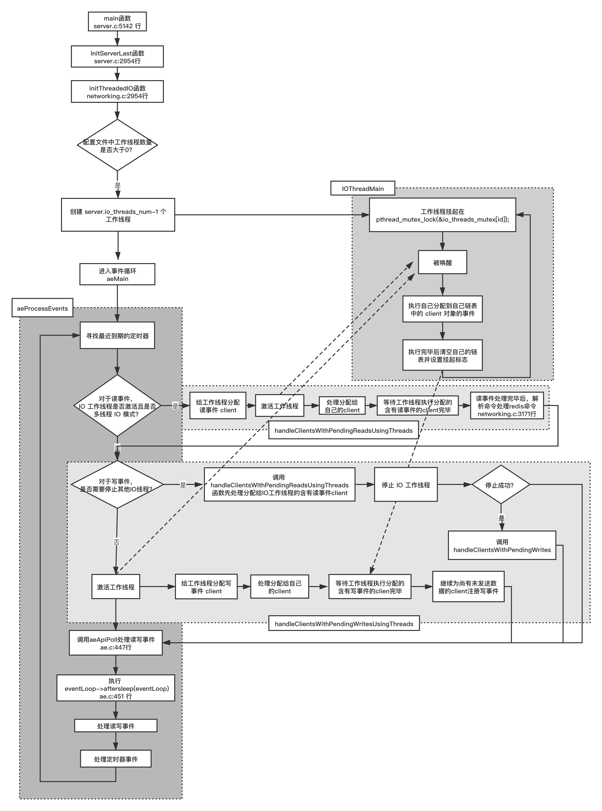

### redis 对客户端的管理
所有连接到 redis-server 上的客户端 redis 使用一个 client 结构体去管理，该结构体的定义如下：
```c
//server.h 768行
typedef struct client {
    uint64_t id;            /* Client incremental unique ID. */
    connection *conn;
    int resp;               /* RESP protocol version. Can be 2 or 3. */
    redisDb *db;            /* Pointer to currently SELECTed DB. */
    robj *name;             /* As set by CLIENT SETNAME. */
    sds querybuf;           /* Buffer we use to accumulate client queries. */
    size_t qb_pos;          /* The position we have read in querybuf. */
  
  	//...省略部分字段...
} client;

```

其中底层和网络通信相关的信息，如 clientfd、连接状态、读写事件回调函数记录在其 conn 字段上。
```c
//connection.h 69行
struct connection {
    ConnectionType *type;
    ConnectionState state;
    short int flags;
    short int refs;
    int last_errno;
    //指向自己的client对象
    void *private_data;
    ConnectionCallbackFunc conn_handler;
    ConnectionCallbackFunc write_handler;
    ConnectionCallbackFunc read_handler;
    int fd;
};

```

为了方便 connection 对象引用自己的 client 对象，在 connection 对象的 private_data 字段记录了 client 对象的指针。
```c
//networking.c 88行
client *createClient(connection *conn) {
    client *c = zmalloc(sizeof(client));
	
	//...省略部分代码...
   
    //networking.c 101行
    connSetPrivateData(conn, c);
    
    //...省略部分代码...    
}

//connection.c 128行
void connSetPrivateData(connection *conn, void *data) {
    conn->private_data = data;
}

```

client 对象在接受连接时调用 acceptCommonHandler 函数创建：
```c
//networking.c 915行
static void acceptCommonHandler(connection *conn, int flags, char *ip) {
    client *c;
    
    //...省略部分代码...
    
    if (listLength(server.clients) >= server.maxclients) {
        char *err = "-ERR max number of clients reached\r\n";

        /* That's a best effort error message, don't check write errors.
         * Note that for TLS connections, no handshake was done yet so nothing is written
         * and the connection will just drop.
         */
        if (connWrite(conn,err,strlen(err)) == -1) {
            /* Nothing to do, Just to avoid the warning... */
        }
        server.stat_rejected_conn++;
        connClose(conn);
        return;
    }

    /* Create connection and client */
    if ((c = createClient(conn)) == NULL) {
        //...省略部分代码...
        
        return;
    }

    //...省略部分代码...
}

```

上述代码中也展示了，redis-server 可接受的最大连接数 server.maxclients，这个值可以在 redis.conf 中修改：
```text
################################### CLIENTS ####################################

# Set the max number of connected clients at the same time. By default
# this limit is set to 10000 clients, however if the Redis server is not
# able to configure the process file limit to allow for the specified limit
# the max number of allowed clients is set to the current file limit
# minus 32 (as Redis reserves a few file descriptors for internal uses).
#
# Once the limit is reached Redis will close all the new connections sending
# an error 'max number of clients reached'.
#
# maxclients 10000

```

server.maxclients 默认是 10000。当超过连接数到达这个数量时，redis 给新连接返回一个错误消息 ”-ERR max number of clients reached\r\n“，并关闭这个连接。

在 createClient 函数中创建 client 对象并初始化数据后，调用 linkClient 函数将 client 对象附加到 server.clients 这个全局链表中：
```c
//networking.c 88行
client *createClient(connection *conn) {
    client *c = zmalloc(sizeof(client));

    //...省略部分代码...
    
    //networking.c 167行
    if (conn) linkClient(c);
    
    //...省略部分代码...
    
    return c;
}

```

linkClient 函数定义如下：
```c
//networking.c 78行
void linkClient(client *c) {
    listAddNodeTail(server.clients,c);
    /* Note that we remember the linked list node where the client is stored,
     * this way removing the client in unlinkClient() will not require
     * a linear scan, but just a constant time operation. */
    c->client_list_node = listLast(server.clients);
    uint64_t id = htonu64(c->id);
    raxInsert(server.clients_index,(unsigned char*)&id,sizeof(id),c,NULL);
}

```

server.clients 的类型 list，这是一个双向链表：
```c
//adlist.h 47行
typedef struct list {
    listNode *head;
    listNode *tail;
    void *(*dup)(void *ptr);
    void (*free)(void *ptr);
    int (*match)(void *ptr, void *key);
    unsigned long len;
} list;

//adlist.h 36行
typedef struct listNode {
    struct listNode *prev;
    struct listNode *next;
    void *value;
} listNode;

```

为了提高从链表中删除某个 client 对象时避免遍历链表，提高效率，client 对象另外用字段 client_list_node 记录了 client 对象对应的节点（类型是 listNode ）在链表中的位置，这样如果要删除该 client 对象对应的节点时，使用 client.client_list_node 可以很方便做删除操作。从链表中删除逻辑如下：
```c
//从server.clients中删除某个client节点
listDelNode(server.clients,c->client_list_node);

//adlist.c 167行
void listDelNode(list *list, listNode *node)
{
    if (node->prev)
        node->prev->next = node->next;
    else
        list->head = node->next;
    if (node->next)
        node->next->prev = node->prev;
    else
        list->tail = node->prev;
    if (list->free) list->free(node->value);
    zfree(node);
    list->len--;
}

```

另外，每一个 client 对象有一个 id 字段，类型是 uint64_t，这个字段用于唯一标识一个 client 对象，这个字段值利用全局对象 server.next_client_id 生成，server.next_client_id 在每次产生新的 client 对象不断递增，server.next_client_id 从 1 开始。
```c
//networking.c 88行
client *createClient(connection *conn) {
    client *c = zmalloc(sizeof(client));

    //...省略部分代码
    
    //networking.c 105行
    uint64_t client_id = ++server.next_client_id;
    c->id = client_id;
    
    //...省略部分代码  
}

```

client 的 id 值最终被转换成网络字节序作为 server.clients_index 中的 key 去索引一个 client 对象：
```c
void linkClient(client *c) {
    
    uint64_t id = htonu64(c->id);
    raxInsert(server.clients_index,(unsigned char*)&id,sizeof(id),c,NULL);
}

```

server.clients_index 类型是 redis 自定义的一个特殊数据结构 rax（rax 结构体的定义位于 rax.h 98 行）。

当事件循环中，某个 fd 的读事件或写事件触发时，redis 是如何将通过 fd 找到对应的 client 对象的呢？

在全局 aeEventLoop 对象中定义了两个数组指针 events 和 fired：
```c
//ae.h 100行
typedef struct aeEventLoop {
    int maxfd;   /* highest file descriptor currently registered */
    int setsize; /* max number of file descriptors tracked */
    long long timeEventNextId;
    time_t lastTime;     /* Used to detect system clock skew */
    aeFileEvent *events; /* Registered events */
    aeFiredEvent *fired; /* Fired events */
    aeTimeEvent *timeEventHead;
    int stop;
    void *apidata; /* This is used for polling API specific data */
    aeBeforeSleepProc *beforesleep;
    aeBeforeSleepProc *aftersleep;
    int flags;
} aeEventLoop;

```

events 和 fired 这两个指针在程序启动时被定义成一个很大的数组：
```c
//ae.c 63行
aeEventLoop *aeCreateEventLoop(int setsize) {
    aeEventLoop *eventLoop;
    int i;

    if ((eventLoop = zmalloc(sizeof(*eventLoop))) == NULL) goto err;
    //注意这两行
    eventLoop->events = zmalloc(sizeof(aeFileEvent)*setsize);
    eventLoop->fired = zmalloc(sizeof(aeFiredEvent)*setsize);
    if (eventLoop->events == NULL || eventLoop->fired == NULL) goto err;
    eventLoop->setsize = setsize;
    eventLoop->lastTime = time(NULL);
    eventLoop->timeEventHead = NULL;
    eventLoop->timeEventNextId = 0;
    eventLoop->stop = 0;
    eventLoop->maxfd = -1;
    eventLoop->beforesleep = NULL;
    eventLoop->aftersleep = NULL;
    eventLoop->flags = 0;
    //注意这一行
    if (aeApiCreate(eventLoop) == -1) goto err;
    /* Events with mask == AE_NONE are not set. So let's initialize the
     * vector with it. */
    for (i = 0; i < setsize; i++)
        eventLoop->events[i].mask = AE_NONE;
    return eventLoop;

err:
    if (eventLoop) {
        zfree(eventLoop->events);
        zfree(eventLoop->fired);
        zfree(eventLoop);
    }
    return NULL;
}

```

上述代码调用 aeApiCreate(eventLoop)，在这个调用中创建了与 events 和 fired 这两个数组一样长的数组用于记录挂载到 epollfd 上的事件信息：
```c
//ae_epoll.c 39行
static int aeApiCreate(aeEventLoop *eventLoop) {
    aeApiState *state = zmalloc(sizeof(aeApiState));

    if (!state) return -1;
    state->events = zmalloc(sizeof(struct epoll_event)*eventLoop->setsize);
    if (!state->events) {
        zfree(state);
        return -1;
    }
    state->epfd = epoll_create(1024); /* 1024 is just a hint for the kernel */
    if (state->epfd == -1) {
        zfree(state->events);
        zfree(state);
        return -1;
    }
    eventLoop->apidata = state;
    return 0;
}

```

因此可以通过 eventLoop->apidata->events[fd] 获得某个 fd 注册到 epollfd 上的事件，eventLoop->apidata 的类型是 aeApiState，其定义如下：
```c
//ae_epoll.c 34行
typedef struct aeApiState {
    int epfd;
    //大小为eventLoop->setsize的数组指针
    struct epoll_event *events;
} aeApiState;

```

eventLoop 的 events 指针指向的数组元素类型是 aeFileEvent，eventLoop 的 fired 指针指向的数组元素类型是 aeFiredEvent，aeFileEvent 和 aeFiredEvent 类型定义如下：
```c
//ae.h 72行
typedef struct aeFileEvent {
    int mask; /* one of AE_(READABLE|WRITABLE|BARRIER) */
    aeFileProc *rfileProc;
    aeFileProc *wfileProc;
    void *clientData;
} aeFileEvent;

//ae.h 94行
typedef struct aeFiredEvent {
    int fd;
    int mask;
} aeFiredEvent;

```

由于 events 和 fired 这两个数组足够大，而代表客户端的 clientfd 类型是一个 int，不会超出两个数组的长度，因此 redis 将 clientfd 作为数组的下标，而数组对应位置的值的结构体 aeFileEvent 可以得到该 fd 的注册事件（mask 字段）、读写事件回调函数（rfileProc 和 wfileProc 字段），而 clientData 字段则在注册时指向 fd 对应的 connection 对象，上文我们介绍过，connection 对象的 private_data 字段记录了对应的 client 对象的指针，以注册一个 fd 的读事件为例：
```c
//connection.c 225行
static int connSocketSetReadHandler(connection *conn, ConnectionCallbackFunc func) {
    if (func == conn->read_handler) return C_OK;

    conn->read_handler = func;
    if (!conn->read_handler)
        aeDeleteFileEvent(server.el,conn->fd,AE_READABLE);
    else
    	//注意这一行
        if (aeCreateFileEvent(server.el,conn->fd,
                    AE_READABLE,conn->type->ae_handler,conn) == AE_ERR) return C_ERR;
    return C_OK;
}

```

再看一下 aeCreateFileEvent 函数的定义：
```c
//ae.c 153行
int aeCreateFileEvent(aeEventLoop *eventLoop, int fd, int mask,
        aeFileProc *proc, void *clientData)
{
    if (fd >= eventLoop->setsize) {
        errno = ERANGE;
        return AE_ERR;
    }
    
    //这一行将fd作为数组下标与对应的事件信息绑定
    aeFileEvent *fe = &eventLoop->events[fd];

    if (aeApiAddEvent(eventLoop, fd, mask) == -1)
        return AE_ERR;
    
    //设置掩码和读写事件回调
    fe->mask |= mask;
    if (mask & AE_READABLE) fe->rfileProc = proc;
    if (mask & AE_WRITABLE) fe->wfileProc = proc;
    fe->clientData = clientData;
    if (fd > eventLoop->maxfd)
        eventLoop->maxfd = fd;
    return AE_OK;
}

```

至此，一个 fd => connection => client 以及其对应的事件类型和回调函数的关系就确定了。我们以读事件为例，对于 Linux 系统中，事件循环中 epoll_wait 返回后：
```c
//ae_epoll.c 108行
static int aeApiPoll(aeEventLoop *eventLoop, struct timeval *tvp) {
    aeApiState *state = eventLoop->apidata;
    int retval, numevents = 0;

    retval = epoll_wait(state->epfd,state->events,eventLoop->setsize,
            tvp ? (tvp->tv_sec*1000 + tvp->tv_usec/1000) : -1);
    if (retval > 0) {
        int j;

        numevents = retval;
        for (j = 0; j < numevents; j++) {
            int mask = 0;
            struct epoll_event *e = state->events+j;

            if (e->events & EPOLLIN) mask |= AE_READABLE;
            if (e->events & EPOLLOUT) mask |= AE_WRITABLE;
            if (e->events & EPOLLERR) mask |= AE_WRITABLE|AE_READABLE;
            if (e->events & EPOLLHUP) mask |= AE_WRITABLE|AE_READABLE;
            eventLoop->fired[j].fd = e->data.fd;
            eventLoop->fired[j].mask = mask;
        }
    }
    return numevents;
}

```

注意上述代码，redis 中在设置 epoll_wait 的 struct poll_event 数组（epoll_wait 的第二个参数）时，直接使用了一个很大的值 eventLoop->setsize，这个值默认等于最大连接数 server.maxclients 加上 CONFIG_FDSET_INCR 宏，值为 10128。epoll_wait 返回后，将本次触发事件的序号（变量 j） 作为数组下标，将 fd、事件掩码记录到对应的 eventLoop->fired 数组位置上去。

aeApiPoll 函数调用返回后，根据本次触发的 fd 的序号（变量 j）从 eventLoop->fired 数组中取出 fd 和 掩码 mask，然后以 fd 为下标从 eventLoop->events 数组中取出 aeFileEvent 对象，这样通过这个 aeFileEvent 对象就能得到对应 fd 的读写事件回调和 connection 对象了（通过 fe->clientData 字段）。

```c
//ae.c 386行
int aeProcessEvents(aeEventLoop *eventLoop, int flags)
{
    	//...省略部分代码...
    	
        numevents = aeApiPoll(eventLoop, tvp);

        //...省略部分代码...

        for (j = 0; j < numevents; j++) {
            aeFileEvent *fe = &eventLoop->events[eventLoop->fired[j].fd];
            int mask = eventLoop->fired[j].mask;
            int fd = eventLoop->fired[j].fd;
            int fired = 0; /* Number of events fired for current fd. */

            int invert = fe->mask & AE_BARRIER;

            if (!invert && fe->mask & mask & AE_READABLE) {
                fe->rfileProc(eventLoop,fd,fe->clientData,mask);
                fired++;
                fe = &eventLoop->events[fd]; /* Refresh in case of resize. */
            }

            /* Fire the writable event. */
            if (fe->mask & mask & AE_WRITABLE) {
                if (!fired || fe->wfileProc != fe->rfileProc) {
                    fe->wfileProc(eventLoop,fd,fe->clientData,mask);
                    fired++;
                }
            }

            /* If we have to invert the call, fire the readable event now
             * after the writable one. */
            if (invert) {
                fe = &eventLoop->events[fd]; /* Refresh in case of resize. */
                if ((fe->mask & mask & AE_READABLE) &&
                    (!fired || fe->wfileProc != fe->rfileProc))
                {
                    fe->rfileProc(eventLoop,fd,fe->clientData,mask);
                    fired++;
                }
            }

            processed++;
        }
    }
    
    //...省略部分代码...
}

```

这部分逻辑和相应的数据结构可以用如下流程图表示：
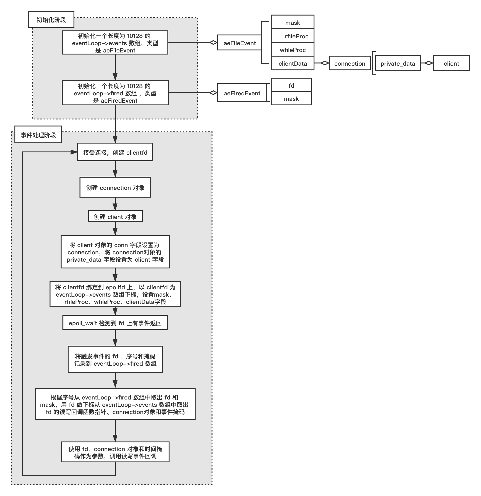

clientfd 的读事件回调函数是 readQueryFromClient，因此 clientfd 的读事件回调实际是调用 readQueryFromClient 函数，调用 readQueryFromClient 函数时，根据其参数 connection 对象的 private_data 字段得到 client 对象，client 含有各种信息这样就可以进行相关读逻辑了。

```c
//networking.c 1890行
void readQueryFromClient(connection *conn) {
    //通过connection对象获取client对象
    client *c = connGetPrivateData(conn);
	
	//...省略部分代码...
}

//connection.c 133行
void *connGetPrivateData(connection *conn) {
    return conn->private_data;
}

```
同样的逻辑，对于写事件回调最终调用的是 sendReplyToClient ，sendReplyToClient 也是通过 connection 对象得到 client 对象然后进一步操作。
```c
//networking.c 1389行
void sendReplyToClient(connection *conn) {
    //通过connection对象获取client对象
    client *c = connGetPrivateData(conn);
    writeToClient(c,1);
}

```
上文介绍了所有的 client 对象会被放在 server.clients 双向链表中，server 对象还有另外两个相同类型的字段用于存放有读事件和写事件的 client 对象，分别是 clients_pending_read 和 clients_pending_write。这两个字段用于在开启 IO 工作线程时，主线程会在各个 fd 触发读写事件时将对应的 client 对象放入 clients_pending_read 和 clients_pending_write 字段中。以读事件为例，在 readQueryFromClient 中有如下调用：
```c
//networking.c 1890行
void readQueryFromClient(connection *conn) {
    client *c = connGetPrivateData(conn);
    
    //postponeClientRead中判断是否开启了IO工作现象
    //如果条件满足，将client对象放入clients_pending_read链表中
    if (postponeClientRead(c)) return;

	//...省略部分代码
}

```

如果含有读事件的 client 被放入 clients_pending_read 链表中，那么 readQueryFromClient 函数就不会继续往下执行了，因为接下来的对 socket 数据的读取和解析将交由 IO 工作线程来做了。postponeClientRead 函数逻辑如下：
```c
//networking.c 3106行server.clients_pending_read链表中
int postponeClientRead(client *c) {
    //满足相应的条件后将client对象加入
    if (io_threads_active &&
        server.io_threads_do_reads &&
        !ProcessingEventsWhileBlocked &&
        !(c->flags & (CLIENT_MASTER|CLIENT_SLAVE|CLIENT_PENDING_READ)))
    {
        c->flags |= CLIENT_PENDING_READ;
        listAddNodeHead(server.clients_pending_read,c);
        return 1;
    } else {
        return 0;
    }
}

```

然后下一轮循环，主线程在 handleClientsWithPendingReadsUsingThreads 函数中将 server.clients_pending_read 中的 client 对象按 round-robin 策略分配给各个 IO 工作线程。

同样的逻辑也适用于写事件和 clients_pending_write 链表。

### 客户端断开流程
redis 服务器断开客户端的连接主要有两类场景：

**场景一** 连接数到达上限断开连接

当服务器端连接数目到达 redis-server 连接数量上限，这个时候会给通过 clientfd 给客户端发送一条错误信息，然后关闭连接，关闭连接的函数是 connClose，connClose 函数定义如下：
```c
//connection.h 174行
static inline void connClose(connection *conn) {
    conn->type->close(conn);
}

```

conn->type->close 是个回调指针，实际上指向 connSocketClose 函数，connSocketClose 函数定义如下：
```c
//connection.c 144行
static void connSocketClose(connection *conn) {
    if (conn->fd != -1) {
        aeDeleteFileEvent(server.el,conn->fd,AE_READABLE);
        aeDeleteFileEvent(server.el,conn->fd,AE_WRITABLE);
        close(conn->fd);
        conn->fd = -1;
    }

    /* If called from within a handler, schedule the close but
     * keep the connection until the handler returns.
     */
    if (connHasRefs(conn)) {
        conn->flags |= CONN_FLAG_CLOSE_SCHEDULED;
        return;
    }

    zfree(conn);
}

```

场景一由于只创建了 connection 对象而没有创建 client 对象，因此只需要在关闭 fd 后释放 connection 对象即可。再看一下 acceptCommonHandler 中的逻辑，可以发现达到最大连接上限时 connClose 在 createClient 之前调用：
```c
//networking.c 915行
static void acceptCommonHandler(connection *conn, int flags, char *ip) {
    //...省略部分代码...
    
    if (listLength(server.clients) >= server.maxclients) {
        char *err = "-ERR max number of clients reached\r\n";

        //...省略部分代码...
        
        if (connWrite(conn,err,strlen(err)) == -1) {
            /* Nothing to do, Just to avoid the warning... */
        }
        server.stat_rejected_conn++;
        
        //在这里调用connClose函数关闭fd
        connClose(conn);
        return;
    }

    //在这里创建client对象
    if ((c = createClient(conn)) == NULL) {
        //...省略部分代码...
    }

    //...省略部分代码...
}

```
每次需要回收 connection 对象时并不是立即销毁 connection 对象，而是先判断 connection 的引用计数是否为 0，如果是 0 才销毁，这个引用计数值记录在 connection 对象的 refs 字段中。由于创建 connection 对象使用的是 zcalloc 函数，这个函数会把 connection 对象所在内存清零，所以对于 connection 的 refs 字段也会被设置成 0，这是 refs 的初始值。refs 这个引用计数不是为了实现类似于智能指针自动销毁自己的功能，而是结合 connection 对象的 flag 标志（只支持 CONN_FLAG_CLOSE_SCHEDULED 标志）在合适的时机去销毁 connection 对象。这一部分比较难理解，我们来详细分下一下，先看下销毁 connection 的逻辑：
```c
//connhelpers.h 77行
static inline int callHandler(connection *conn, ConnectionCallbackFunc handler) {
    connIncrRefs(conn);
    if (handler) handler(conn);
    connDecrRefs(conn);
    if (conn->flags & CONN_FLAG_CLOSE_SCHEDULED) {
        if (!connHasRefs(conn)) connClose(conn);
        return 0;
    }
    return 1;
}

```
设计 callHandler 函数有两个目的：一是为了某些逻辑可以复用，减少重复逻辑；二是让 handler 中的业务逻辑全部执行完再关闭连接。注意到 callHandler 第二个参数 handler 了吗？这是一个自定义函数，由于无法保证这个自定义函数中不会调用 connSocketClose 函数造成 handler 流程没走完就关闭了连接，因此在调用 handler 之前，递增 connection 的 refs 字段，而关闭连接的函数 connSocketClose 内部会判断 connection 的 refs 字段是否大于 0，如果大于 0 则设置 connection 的 flag 为延迟关闭标志 CONN_FLAG_CLOSE_SCHEDULED，等 handler 执行完毕后递减 connection 的 refs 值，接着判断 connection 的 flag 是否设置了 CONN_FLAG_CLOSE_SCHEDULED，如果设置了该标志说明前面的逻辑中需要关闭这个 conn，此时关闭 connection。这个逻辑有点绕，可以绘制成如下流程图：
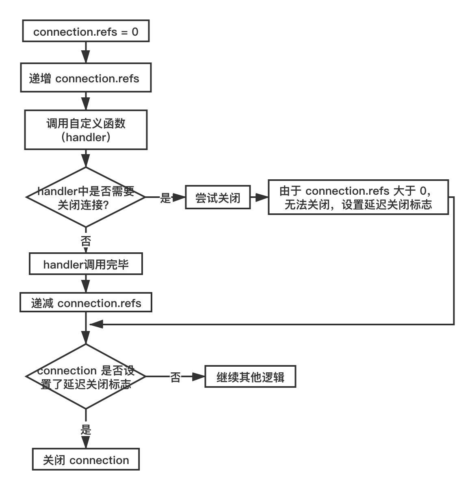

connSocketClose 函数中调用 aeDeleteFileEvent 函数从 epollfd 中解绑 clientfd 和读写事件并关闭 clientfd。aeDeleteFileEvent 函数的定义如下：
```c
//ae.c 173行
void aeDeleteFileEvent(aeEventLoop *eventLoop, int fd, int mask)
{
    if (fd >= eventLoop->setsize) return;
    aeFileEvent *fe = &eventLoop->events[fd];
    //按需移除事件
    if (fe->mask == AE_NONE) return;

    /* We want to always remove AE_BARRIER if set when AE_WRITABLE
     * is removed. */
    if (mask & AE_WRITABLE) mask |= AE_BARRIER;

    aeApiDelEvent(eventLoop, fd, mask);
    fe->mask = fe->mask & (~mask);
    if (fd == eventLoop->maxfd && fe->mask == AE_NONE) {
        /* Update the max fd */
        int j;
		
		//倒序遍历eventLoop->events数组找到mask不是AE_NONE的fd即是新的maxfd
        for (j = eventLoop->maxfd-1; j >= 0; j--)
            if (eventLoop->events[j].mask != AE_NONE) break;
        eventLoop->maxfd = j;
    }
}

```

关于 aeDeleteFileEvent 函数有三个注意点：

1. 虽然外层调用 connSocketClose 会同时尝试移除一个 fd 上的读事件和写事件，但 aeDeleteFileEvent 内部会根据自己记录事件掩码（fe->mask）字段去移除已有的事件，言下之意是某个 fd 并不一定同时注册了读写事件。

2. 如果移除某个 fd 上已经注册的所有事件，我们只需将 eventLoop->events 数组中以 fd 为下标的 aeFileEvent 对象的 mask 值设置为 0 （AE_NONE），而不需要实际销毁这个对象，因为如果一个 fd 上至少会注册读事件，如果连读事件都不注册了，就会将这个 fd 从epollfd 上移除，此时我们可以这个 fd 即将被回收。

3. eventLoop 对象有一个 maxfd 字段记录当前所有 fd ，当有 fd 被关闭时（事件掩码为 AE_NONE），需要重新计算这个 maxfd，此时先看下这个 fd 是否是 maxfd，如果是，就要重新确定新的 maxfd。 只需从 maxfd - 1 开始倒序遍历 eventLoop->events 数组找到 mask 不是 AE_NONE 的 fd（有效 fd）。假设遍历时最终找到符合要求的 eventLoop->event 数组下标是 j，那么 j 就是此后所有 fd 中最大的值，将 maxfd 更新成 j 。操作示意图如下：

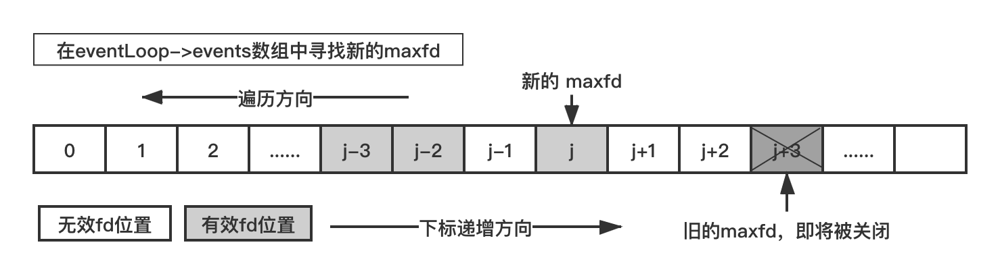

为什么需要记录所有 fd 的最大值 maxfd 呢？因为 redis-server 在不同系统上使用相应的 IO 复用函数，当使用 select 函数作为事件循环的 IO 复用函数时，select 第一个参数要求是需要监视的所有 fd 中最大值加 1，代码如下：
```c
//ae_select.c 77行
static int aeApiPoll(aeEventLoop *eventLoop, struct timeval *tvp) {
    //...省略部分代码...

    retval = select(eventLoop->maxfd+1,
                &state->_rfds,&state->_wfds,NULL,tvp);
    
    //...省略部分代码...
}

```

**场景二** 正常读写事件中出错或者主动关闭连接

以读事件处理为例，根据前文所述，读事件的回调函数为 readQueryFromClient，当收取数据时失败时调用 freeClientAsync 函数，我们以这种情形为例：

```c
//networking.c 1890行
void readQueryFromClient(connection *conn) {
    //...省略部分代码...
    
    nread = connRead(c->conn, c->querybuf+qblen, readlen);
    if (nread == -1) {
        if (connGetState(conn) == CONN_STATE_CONNECTED) {
            return;
        } else {
            serverLog(LL_VERBOSE, "Reading from client: %s",connGetLastError(c->conn));
            freeClientAsync(c);
            return;
        }
    } else if (nread == 0) {
        serverLog(LL_VERBOSE, "Client closed connection");
        freeClientAsync(c);
        return;
    }

    //...省略代码...
}

```

freeClientAsync 将 client 对象放入 server.clients_to_close 队列中，由于不是立即释放 client 对象而是放在释放队列中，这是这个函数中 “Async” 的含义。
```c
//networking.c 1241行
void freeClientAsync(client *c) {
    //...省略部分代码...
    
    if (server.io_threads_num == 1) {
        /* no need to bother with locking if there's just one thread (the main thread) */
        listAddNodeTail(server.clients_to_close,c);
        return;
    }
    static pthread_mutex_t async_free_queue_mutex = PTHREAD_MUTEX_INITIALIZER;
    pthread_mutex_lock(&async_free_queue_mutex);
    listAddNodeTail(server.clients_to_close,c);
    pthread_mutex_unlock(&async_free_queue_mutex);
}

```

上述代码中，如果没有启动 IO 工作线程，则生产者和消费者都是位于主线程中，因此不需要加锁保护，这里的代码直接将 client 放入 server.clients_to_close 队列；如果启动了 IO 工作线程，则需要使用互斥体 async_free_queue_mutex 对 server.clients_to_close 进行保护，因为主线程和工作线程都会调用 readQueryFromClient 函数，readQueryFromClient 函数调用 freeClientAsync，因此在主线程和工作线程中都可能将 client 对象放入 server.clients_to_close 队列（生产者是主线程和 IO 工作线程），接下来从队列中取出 client 对象去做实际回收 client 的操作在主线程中（消费者是主线程）。那消费者具体在哪里呢？

实际释放 client 对象的操作位于 beforeSleep 函数中，这个函数前文我们介绍过了，这次我们的关注点是另外一段逻辑：
```c
//server.c 2106行
void beforeSleep(struct aeEventLoop *eventLoop) {
    //...省略部分代码...
    
    //server.c 2189行
    freeClientsInAsyncFreeQueue();

    //...省略部分代码...
}

```

freeClientsInAsyncFreeQueue 函数的定义如下：
```c
//networking.c 1262行
int freeClientsInAsyncFreeQueue(void) {
    int freed = listLength(server.clients_to_close);
    while (listLength(server.clients_to_close)) {
        listNode *ln = listFirst(server.clients_to_close);
        client *c = listNodeValue(ln);

        c->flags &= ~CLIENT_CLOSE_ASAP;
        freeClient(c);
        listDelNode(server.clients_to_close,ln);
    }
    return freed;
}

```

上述代码遍历 server.clients_to_close 队列挨个取出 client 对象，然后调用 freeClient 对象释放之。freeClient 对象定义如下：
```c
void freeClient(client *c) {
    //...省略部分代码...

    /* Free the query buffer */
    sdsfree(c->querybuf);
    sdsfree(c->pending_querybuf);
    c->querybuf = NULL;

    //...省略部分代码...
   
    unlinkClient(c);

    //...省略部分代码...
}

```

在 freeClient 对象中不仅释放 client 对象同时也释放相应的缓冲区对象 c->querybuf、c->pending_querybuf。

实际释放 client 对象的函数是 unlinkClient，我们前面介绍过这个函数：
```c
void unlinkClient(client *c) {
    //...省略部分代码...
    
    if (c->conn) {
        /* Remove from the list of active clients. */
        if (c->client_list_node) {
            uint64_t id = htonu64(c->id);
            raxRemove(server.clients_index,(unsigned char*)&id,sizeof(id),NULL);
            listDelNode(server.clients,c->client_list_node);
            c->client_list_node = NULL;
        }

        //...省略部分代码...
        
        connClose(c->conn);
        c->conn = NULL;
    }

    //...省略部分代码...
}

```

在 unlinkClient 函数中释放 client 对象的同时也会调用 connClose 函数释放相应的 connection 对象，释放 connection 对象的同时意味着释放连接对应的底层 fd 和取消注册各种读写事件。

### 收发缓冲区设计
**接收缓冲区**

来看下 redis 中收发缓冲区是如何设计的，redis 中接收缓冲区对象是 client 对象的 querybuf 字段，其类型是 sds，sds 本质上是 char*：
```c
//sds.h 43行
typedef char *sds;

```
如果发送缓冲区的类型只是 char*，那么如何记录缓冲区的长度和当前读写位置呢？

client.querybuf 对象在创建 client 对象时调用 sdsempty 函数初始化。
```c
//networking.c 88行
client *createClient(connection *conn) {
    client *c = zmalloc(sizeof(client));

    //...省略部分代码...
    
    c->querybuf = sdsempty();
    
    //...省略部分代码...
}

```

sdsempty 实际上是调用 sdnewlen 函数：
```c
//sds.c 149行
sds sdsempty(void) {
    return sdsnewlen("",0);
}

```

sdsnewlen 函数定义如下：
```c
//sds.c 89行
sds sdsnewlen(const void *init, size_t initlen) {
    void *sh;
    sds s;
    char type = sdsReqType(initlen);
    /* Empty strings are usually created in order to append. Use type 8
     * since type 5 is not good at this. */
    if (type == SDS_TYPE_5 && initlen == 0) type = SDS_TYPE_8;
    int hdrlen = sdsHdrSize(type);
    unsigned char *fp; /* flags pointer. */

    sh = s_malloc(hdrlen+initlen+1);
    if (sh == NULL) return NULL;
    if (init==SDS_NOINIT)
        init = NULL;
    else if (!init)
        memset(sh, 0, hdrlen+initlen+1);
    s = (char*)sh+hdrlen;
    fp = ((unsigned char*)s)-1;
    switch(type) {
        case SDS_TYPE_5: {
            *fp = type | (initlen << SDS_TYPE_BITS);
            break;
        }
        case SDS_TYPE_8: {
            SDS_HDR_VAR(8,s);
            sh->len = initlen;
            sh->alloc = initlen;
            *fp = type;
            break;
        }
        case SDS_TYPE_16: {
            SDS_HDR_VAR(16,s);
            sh->len = initlen;
            sh->alloc = initlen;
            *fp = type;
            break;
        }
        case SDS_TYPE_32: {
            SDS_HDR_VAR(32,s);
            sh->len = initlen;
            sh->alloc = initlen;
            *fp = type;
            break;
        }
        case SDS_TYPE_64: {
            SDS_HDR_VAR(64,s);
            sh->len = initlen;
            sh->alloc = initlen;
            *fp = type;
            break;
        }
    }
    if (initlen && init)
        memcpy(s, init, initlen);
    s[initlen] = '\0';
    return s;
}

```

sdsnewlen 函数中根据初始化长度 initlen 值分为如下类型：

- 当 initlen < 32 时，type = SDS_TYPE_5；

- 当 32 <= initlen < 256，type = SDS_TYPE_8；

- 当 256 <= initlen < 64k（k 这里是 1024），type = SDS_TYPE_16；

- 当 64k <= initlen < 4G，type = SDS_TYPE_32；

- 当 initlen > 4G，type = SDS_TYPE_64。

考虑到当初始化一个空的字符串时，这个字符串大概率是后期用于往缓冲区中追加数据的，因此为了避免后面追加数据时减少内存分配次数，当初始化的内容是空字符串，长度为 0，此时本应该使用 SDS_TYPE_5 类型，却使用 SDS_TYPE_8 类型。

各个 type 类型的定义如下：
```c
//sds.h 76行
#define SDS_TYPE_5  0
#define SDS_TYPE_8  1
#define SDS_TYPE_16 2
#define SDS_TYPE_32 3
#define SDS_TYPE_64 4

```

接下来根据得到 sds 结构的内存结构，如下图所示：
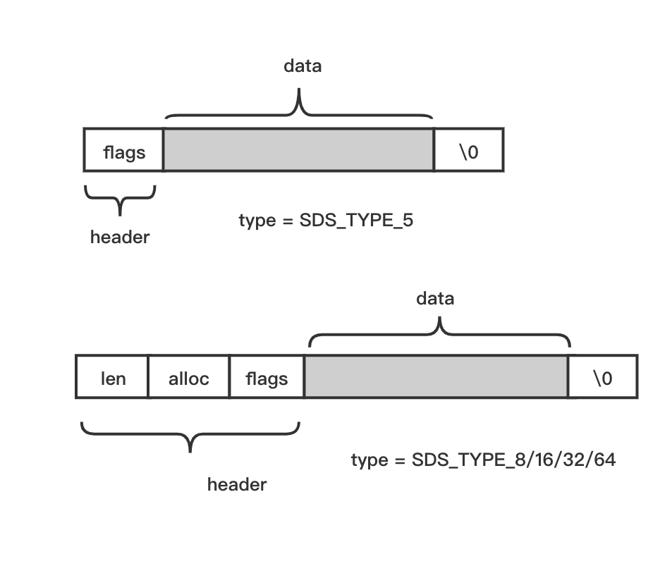

sds 在内存开始处存储的是数据的“头部信息”，头部信息记录了这段内存数据的一些状态信息，当 type = SDS_TYPE_5 时，头部信息有两个 flags 和 buf 两个字段，当 type = SDS_TYPE_8/16/32/64 时，头部有 len、alloc、flags 和 buf 四个字段。初始状态下 len 和 alloc 都记录着实际给存储数据分配的长度，flags 字段记录中类型 type 信息，sds 所在内存最后一个字节被填充为 \0。

其实图中类型 type = SDS_TYPE_5 的内存结构在 redis 中从未被用到过。

根据上面的分析，初始状态下 client.querybuf 的内存结构如下：
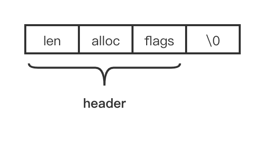

上述图中 len、alloc、flags 字段各占一个字节，没有 data 区域，len = alloc = 0，type = 1（SDS_TYPE_8）。

当我们在开始利用 client.querybuf 收取数据时，我们执行了以下逻辑：
```c
//networking.c 1890行
void readQueryFromClient(connection *conn) {
    client *c = connGetPrivateData(conn);
    int nread, readlen;
    size_t qblen;

  	//...省略部分代码...
  	
  	readlen = PROTO_IOBUF_LEN;
  	
  	//...省略部分代码...

    qblen = sdslen(c->querybuf);
    if (c->querybuf_peak < qblen) c->querybuf_peak = qblen;
    c->querybuf = sdsMakeRoomFor(c->querybuf, readlen);
    nread = connRead(c->conn, c->querybuf+qblen, readlen);
    
    //...省略部分代码...
}

```

qblen = sdslen(c->querybuf); 计算当前接收缓冲区的可用空间大小，实际上就是取 sds 结构中的 len 字段的值。connRead 尝试一次最大读取 PROTO_IOBUF_LEN 字节的数据（PROTO_IOBUF_LEN = 16 k），因此需要先调用 sdsMakeRoomFor 函数为 client.query 扩展空间，如何扩展呢？

sdsMakeRoomFor 函数定义如下：
```c
//sds.c 204行
sds sdsMakeRoomFor(sds s, size_t addlen) {
    void *sh, *newsh;
    size_t avail = sdsavail(s);
    size_t len, newlen;
    char type, oldtype = s[-1] & SDS_TYPE_MASK;
    int hdrlen;

    /* Return ASAP if there is enough space left. */
    if (avail >= addlen) return s;

    len = sdslen(s);
    sh = (char*)s-sdsHdrSize(oldtype);
    newlen = (len+addlen);
    if (newlen < SDS_MAX_PREALLOC)
        newlen *= 2;
    else
        newlen += SDS_MAX_PREALLOC;

    type = sdsReqType(newlen);

    /* Don't use type 5: the user is appending to the string and type 5 is
     * not able to remember empty space, so sdsMakeRoomFor() must be called
     * at every appending operation. */
    if (type == SDS_TYPE_5) type = SDS_TYPE_8;

    hdrlen = sdsHdrSize(type);
    if (oldtype==type) {
        newsh = s_realloc(sh, hdrlen+newlen+1);
        if (newsh == NULL) return NULL;
        s = (char*)newsh+hdrlen;
    } else {
        /* Since the header size changes, need to move the string forward,
         * and can't use realloc */
        newsh = s_malloc(hdrlen+newlen+1);
        if (newsh == NULL) return NULL;
        memcpy((char*)newsh+hdrlen, s, len+1);
        s_free(sh);
        s = (char*)newsh+hdrlen;
        s[-1] = type;
        sdssetlen(s, len);
    }
    sdssetalloc(s, newlen);
    return s;
}

```

我们知道既然作为接收缓冲区，那么当扩展空间时必须保留已经存在接收缓冲区中的数据，先计算待扩展的缓冲区中还剩余容量 avail，计算方式就是上述 alloc - len 的差值。如果当前剩余空间 avail 大于等于需要新增的大小 addlen，则没必要扩展空间，直接退出即可。反之需要扩展的最终大小是当前已存储数据的大小 len 加上新增的 大小 addlen，即上述代码中的 newlen。这里 redis 使用了一个确定最终大小的策略，当 newlen < SDS_MAX_PREALLOC 时，newlen 变更成其自身的 2 倍，反之加上 SDS_MAX_PREALLOC 作为新的 newlen。

接下来根据 newlen 重新计算内部的 type 类型，重新分配内存，然后重新设置 header 区域的 len、alloc 和 flags 字段值，并将旧的 data 区域的数据拷贝至新的 data 区域，然后释放旧的内存。这就是 redis 扩展自定义接收缓冲区的实现思路。

调用收取数据的函数 connRead 成功后，实际收取的数据长度为 nread，此时我们需要调用 sdsIncrLen 函数更新 client.querybuf 内部的已存数据占用空间：

```c
//networking.c 1940行
sdsIncrLen(c->querybuf,nread);

```

由于前面 sds 内部结构已经扩大了足够的空间，因此只需要更新 sds 内部的已用内存长度 len 的值就可以了，即 len 更新成 len 加上 nread 后的值。

虽然，sds 内部结构能解决内存扩展问题，但是作为接收缓冲区我们在解包时，从 client.querybuf 中读取一部分数据后，会造成从 header 结束位置到读取位置之间的数据为空，我们必须记录一下上一次读取的位置。示意图如下：
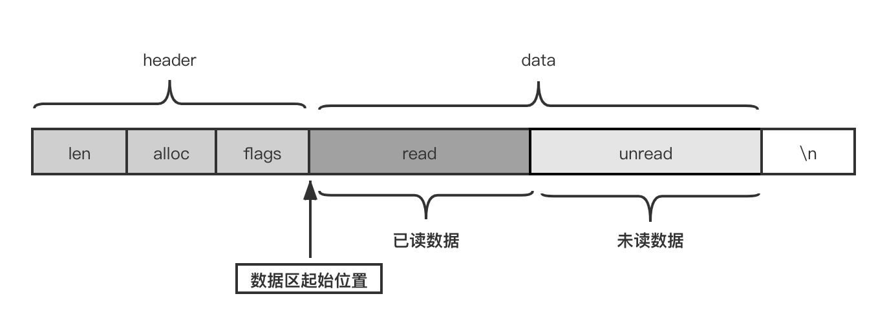

如上图所示，当我们对 client.querybuf 中的数据进行读取时，当出现已经读取了一部分还剩余一部分，如果我们不记录当前读取的位置，我们下次就不知道从什么位置开始读取了，当前已读取位置记录在 client 对象的 qb_pos 中，每次读取一部分我们只要更新这个字段值就可以了，下一次读取时从 qb_pos 记录位置开始读就可以了。

**发送缓冲区**

与接收缓冲区相比，redis-server 的发送缓冲区的结构设计比较简单，client 对象有三个字段：

```c
//server.h 768行
typedef struct client {
	//...省略其他无关字段...
	
	size_t sentlen; 
	
	//...省略其他无关字段...
	
    int bufpos;
    char buf[PROTO_REPLY_CHUNK_BYTES];
} client;

```

发送缓冲区 buf 是一个大小为 16 k 的固定数组，bufpos 字段记录存储的数据长度，sentlen 记录每次发送了多少，则发送缓冲区中剩余的数据区域如下图所示：
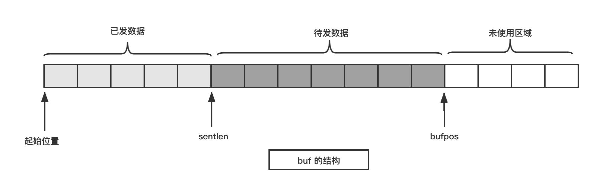

总的来说，redis-server 的接收和发送缓冲区的设计和使用方法是两种典型的高效设计。

### 定时器逻辑
一个网络通信模块是离不开定时器的，前面介绍了在事件处理函数的中如何去除最早到期的定时器对象，这里我们接着这个问题继续讨论。在 aeProcessEvents 函数的结尾处有这样一段代码：
```c
//ae.c 386行
int aeProcessEvents(aeEventLoop *eventLoop, int flags)
{
	//..省略部分代码...
	
	//ae.c 507行  
	/* Check time events */
	if (flags & AE_TIME_EVENTS)
		processed += processTimeEvents(eventLoop);

	return processed; /* return the number of processed file/time events */
}

```

如果存在定时器事件，则调用 processTimeEvents 函数进行处理。
```c
//ae.c 287行
/* Process time events */
static int processTimeEvents(aeEventLoop *eventLoop) {
    int processed = 0;
    aeTimeEvent *te, *prev;
    long long maxId;
    time_t now = time(NULL);

    /* If the system clock is moved to the future, and then set back to the
     * right value, time events may be delayed in a random way. Often this
     * means that scheduled operations will not be performed soon enough.
     *
     * Here we try to detect system clock skews, and force all the time
     * events to be processed ASAP when this happens: the idea is that
     * processing events earlier is less dangerous than delaying them
     * indefinitely, and practice suggests it is. */
    if (now < eventLoop->lastTime) {
        te = eventLoop->timeEventHead;
        while(te) {
            te->when_sec = 0;
            te = te->next;
        }
    }
    eventLoop->lastTime = now;

    prev = NULL;
    te = eventLoop->timeEventHead;
    maxId = eventLoop->timeEventNextId-1;
    while(te) {
        long now_sec, now_ms;
        long long id;

        /* Remove events scheduled for deletion. */
        if (te->id == AE_DELETED_EVENT_ID) {
            aeTimeEvent *next = te->next;
            if (prev == NULL)
                eventLoop->timeEventHead = te->next;
            else
                prev->next = te->next;
            if (te->finalizerProc)
                te->finalizerProc(eventLoop, te->clientData);
            zfree(te);
            te = next;
            continue;
        }

        /* Make sure we don't process time events created by time events in
         * this iteration. Note that this check is currently useless: we always
         * add new timers on the head, however if we change the implementation
         * detail, this check may be useful again: we keep it here for future
         * defense. */
        if (te->id > maxId) {
            te = te->next;
            continue;
        }
        aeGetTime(&now_sec, &now_ms);
        if (now_sec > te->when_sec ||
            (now_sec == te->when_sec && now_ms >= te->when_ms))
        {
            int retval;

            id = te->id;
            retval = te->timeProc(eventLoop, id, te->clientData);
            processed++;
            if (retval != AE_NOMORE) {
                aeAddMillisecondsToNow(retval,&te->when_sec,&te->when_ms);
            } else {
                te->id = AE_DELETED_EVENT_ID;
            }
        }
        prev = te;
        te = te->next;
    }
    return processed;
}

```

这段代码核心逻辑就是通过 eventLoop->timeEventHead 中记录的定时器对象链表遍历每个定时器对象的时间，然后与当前时间比较，如果定时器已经到期，则调用定时器对象设置的回调函数 timeProc 进行处理。这段代码，没有什么特别需要注意的地方。但是代码中作者考虑到了一种特殊场景，就是假设有人将当前的计算机时间调到了未来某个时刻，然后再调回来。这样就会出现 now（当前时间）小于 eventLoop->lastTime（记录在 aeEventLoop 中的上一次时间）。出现这种情况怎么办呢？redis 的作者的做法是遍历该定时器对象链表，将这个链表中的所有定时器对象的时间设置成 0。这样，这些定时器就会立即得到处理了。这也就是作者在代码注释中说的：
```c
//ae.c 294~301行
/* If the system clock is moved to the future, and then set back to the
 * right value, time events may be delayed in a random way. Often this
 * means that scheduled operations will not be performed soon enough.
 *
 * Here we try to detect system clock skews, and force all the time
 * events to be processed ASAP when this happens: the idea is that
 * processing events earlier is less dangerous than delaying them
 * indefinitely, and practice suggests it is. */

```

注释中 ASAP 是英文 As Soon As Possible（尽快）的缩写。

那么 redis-server 中到底哪些地方使用了定时器呢？我们可以在 redis 源码中搜索创建定时器的函数 aeCreateTimeEvent ，在 initServer 函数中有这么一行：
```c
//server.c 2878行
if (aeCreateTimeEvent(server.el, 1, serverCron, NULL, NULL) == AE_ERR) {
        serverPanic("Can't create event loop timers.");
        exit(1);
 }

```

经常使用 Linux 系统的读者应该很熟悉 “Cron” 一词，它是 Linux 操作系统的一种定时任务机制，在 redis 中用于 Cron 任务。这个任务具体做些什么工作，可以阅读下 serverCron 函数源码（位于 server.c:1848 行处）。

### 钩子函数
通常情形下，在一个 EventLoop 中除了有定时器、IO Multiplexing 和 IO 事件处理逻辑外，可以根据需求自定义一些函数，这类函数我们称之为“钩子函数”。钩子函数可以位于 Loop 的任何位置，前面我们介绍的 beforesleep 函数就是在事件处理之前的自定义钩子函数（位于定时器时间检测逻辑之前）。

在 redis-server 中，在 IO Multiplexing 调用与 IO 事件处理逻辑之间也有一个自定义钩子函数叫 aftersleep 。
```c
//networking.c 386行
int aeProcessEvents(aeEventLoop *eventLoop, int flags)
{
    //无关代码省略...
    numevents = aeApiPoll(eventLoop, tvp);

    /* After sleep callback. */
    if (eventLoop->aftersleep != NULL && flags & AE_CALL_AFTER_SLEEP)
    	eventLoop->aftersleep(eventLoop);

    for (j = 0; j < numevents; j++) {
        //无关代码省略...
    }	
}

```

这个函数在 main 函数中设置：
```c
//server.c 4969行
int main(int argc, char **argv) {
	//无关代码省略...
	
	//server.c 2916行
	aeSetBeforeSleepProc(server.el,beforeSleep);
    aeSetAfterSleepProc(server.el,afterSleep);
    
     return 0;
}

```

由于 afterSleep 函数的具体作用与我们的网络通信无关，这里也就不再介绍了，但是要理解在 one thread one loop 中自定义其他钩子函数的思想。

### redis-server 端网络通信模块小结
用一张图来概括一下 redis-server 端的网络通信模型。

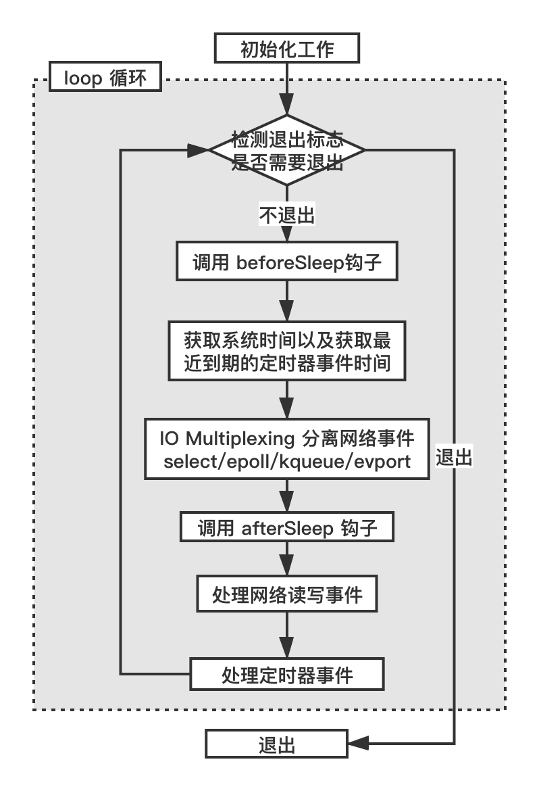

如上图所示，redis-server 就是典型的利用 one loop one thread 思想实现的主程序结构，也是目前最主流的网络通信架构。在 redis 6.0 版本之前或者在没启动额外的 IO 工作线程的情况下，redis 在主线程处理自定义钩子函数、调用 IO 复用函数、处理各种 IO 事件和定时器事件，所以通常也说 redis 的网络通信模型是单线程的。

## redis-cli 端的网络通信模型
使用 gdb 把 redis-cli 跑起来以后，原来打算按 Ctrl + C 让程序中断下来查看一下 redis-cli 跑起来有几个线程，但是实验之后发现，这样并不能让程序中断下来，反而会导致 redis-cli 这个进程退出。

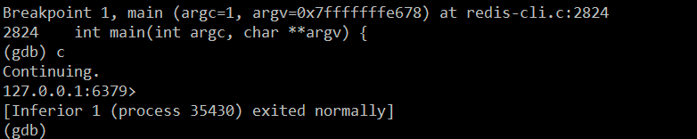

退出的原因是 redis-cli 启动后会在一个 while 循环里面等待用户输入，这个逻辑位于 reply.c 函数中：
```c
//redis-cli.c 1909行
static void repl(void) {
   //...省略部分代码...
   
   //redis-cli.c 1939行
   while((line = linenoise(context ? config.prompt : "not connected> ")) != NULL) {
       //...省略部分代码...
   }
   exit(0);
}

```

如果输入的不符合预期，例如按下 Ctrl+C，while 条件不成立导致 while 循环结束就会退出主进程。

换个方法来调试 redis-cli，先直接把 redis-cli 跑起来，然后查看下 redis-cli 的进程 id，并用 gdb attach 命令附加到 redis-cli 进程上。
```shell
[root@myaliyun src]# ps -ef | grep redis-cli
root     27559 25850  0 14:35 pts/2    00:00:00 ./redis-cli
root     27813 26804  0 14:39 pts/0    00:00:00 grep --color=auto redis-cli
[root@myaliyun src]# gdb attach 27559           
...省略部分输出...
Attaching to process 27559
Reading symbols from /root/redis-6.0.3/src/redis-cli...
...省略部分输出...
(gdb) info threads
  Id   Target Id                                     Frame 
* 1    Thread 0x7f3d3c6cf740 (LWP 27559) "redis-cli" 0x00007f3d3bba16e0 in __read_nocancel () from /usr/lib64/libpthread.so.0
(gdb) 

```

使用 info threads 查看线程数目，通过上面的输出，发现 redis-cli 只有一个主线程。既然只有一个主线程，那么我们可以断定 redis-cli 中的发给 redis-server 的命令肯定都是同步的，这里同步的意思是发送命令后一直等待服务器应答或者应答超时。

在 **redis-cli** 的 main 函数（位于文件 redis-cli.c 中）有这样一段代码：
```c
//redis-cli.c 8091行
/* Start interactive mode when no command is provided */
if (argc == 0 && !config.eval) {
    /* Ignore SIGPIPE in interactive mode to force a reconnect */
    signal(SIGPIPE, SIG_IGN);

    /* Note that in repl mode we don't abort on connection error.
    * A new attempt will be performed for every command send. */
    cliConnect(0);
    repl();
}

```

其中 cliConnect(0) 调用代码如下：
```c
//redis-cli.c 859行
static int cliConnect(int force) {
    if (context == NULL || force) {
        if (context != NULL) {
            redisFree(context);
        }

        if (config.hostsocket == NULL) {
            context = redisConnect(config.hostip,config.hostport);
        } else {
            context = redisConnectUnix(config.hostsocket);
        }

        if (context->err) {
            fprintf(stderr,"Could not connect to Redis at ");
            if (config.hostsocket == NULL)
                fprintf(stderr,"%s:%d: %s\n",config.hostip,config.hostport,context->errstr);
            else
                fprintf(stderr,"%s: %s\n",config.hostsocket,context->errstr);
            redisFree(context);
            context = NULL;
            return REDIS_ERR;
        }

        /* Set aggressive KEEP_ALIVE socket option in the Redis context socket
         * in order to prevent timeouts caused by the execution of long
         * commands. At the same time this improves the detection of real
         * errors. */
        anetKeepAlive(NULL, context->fd, REDIS_CLI_KEEPALIVE_INTERVAL);

        /* Do AUTH and select the right DB. */
        if (cliAuth() != REDIS_OK)
            return REDIS_ERR;
        if (cliSelect() != REDIS_OK)
            return REDIS_ERR;
    }
    return REDIS_OK;
}

```

这个函数做的工作可以分为三步：

1. context = redisConnect(config.hostip,config.hostport);

2. cliAuth()

3. cliSelect()

先来看第一步 redisConnect 函数，这个函数实际又调用 redisConnectWithOptions 函数，后者又调用 redisContextConnectBindTcp，redisContextConnectBindTcp 内部调用 _redisContextConnectTcp 函数。为了清晰的表达这种调用关系，我们在 _redisContextConnectTcp 处加个断点，然后使用 run 命令重启下，程序触发断点后，输入 bt 命令查看一下此时的调用堆栈：

```shell
(gdb) b _redisContextConnectTcp
Breakpoint 2 at 0x42e7c2: file net.c, line 342.
(gdb) r
The program being debugged has been started already.
Start it from the beginning? (y or n) y
Starting program: /root/redis-6.0.3/src/redis-cli 
[Thread debugging using libthread_db enabled]
Using host libthread_db library "/usr/lib64/libthread_db.so.1".

Breakpoint 2, _redisContextConnectTcp (c=0x44e050, addr=0x44e011 "127.0.0.1", port=6379, timeout=0x0, source_addr=0x0) at net.c:342
342         int blocking = (c->flags & REDIS_BLOCK);
(gdb) bt
#0  _redisContextConnectTcp (c=0x44e050, addr=0x44e011 "127.0.0.1", port=6379, timeout=0x0, source_addr=0x0) at net.c:342
#1  0x000000000042ef17 in redisContextConnectBindTcp (c=0x44e050, addr=0x44e011 "127.0.0.1", port=6379, timeout=0x0, source_addr=0x0) at net.c:513
#2  0x0000000000426202 in redisConnectWithOptions (options=0x7fffffffe1a0) at hiredis.c:767
#3  0x0000000000426317 in redisConnect (ip=0x44e011 "127.0.0.1", port=6379) at hiredis.c:792
#4  0x000000000040c585 in cliConnect (flags=0) at redis-cli.c:866
#5  0x00000000004213f8 in main (argc=0, argv=0x7fffffffe320) at redis-cli.c:8098
(gdb) 

```

_redisContextConnectTcp 函数是实际连接 redis-server 的地方，先调用 API getaddrinfo 解析传入进来的 ip 地址和端口号（这里是 127.0.0.1 和 6379），然后创建 socket，并将socket 设置成非阻塞模式，接着调用 API connect 函数，由于 socket 是非阻塞模式，connect 函数会立即返回 -1。接着调用 redisContextWaitReady 函数，该函数中调用 API poll 检测连接的 socket 是否可写（POLLOUT），如果可写则表示连接 redis-server 成功。由于 _redisContextConnectTcp 代码较多，去掉一些无关的代码，整理出关键逻辑的伪码如下：
```c
//net.c 335行
static int _redisContextConnectTcp(redisContext *c, const char *addr, int port,
                                   const struct timeval *timeout,
                                   const char *source_addr) {
    //...省略部分代码...    

    rv = getaddrinfo(c->tcp.host,_port,&hints,&servinfo)) != 0

    s = socket(p->ai_family,p->ai_socktype,p->ai_protocol)) == -1

    redisSetBlocking(c,0) != REDIS_OK

    connect(s,p->ai_addr,p->ai_addrlen)

    redisContextWaitReady(c,timeout_msec) != REDIS_OK

    return rv;  // Need to return REDIS_OK if alright
}

```

redisContextWaitReady 函数的代码（位于 net.c 文件中）如下：
```c
//net.c 241行
static int redisContextWaitReady(redisContext *c, long msec) {
    struct pollfd   wfd[1];

    wfd[0].fd     = c->fd;
    wfd[0].events = POLLOUT;

    if (errno == EINPROGRESS) {
        int res;

        if ((res = poll(wfd, 1, msec)) == -1) {
            __redisSetErrorFromErrno(c, REDIS_ERR_IO, "poll(2)");
            redisContextCloseFd(c);
            return REDIS_ERR;
        } else if (res == 0) {
            errno = ETIMEDOUT;
            __redisSetErrorFromErrno(c,REDIS_ERR_IO,NULL);
            redisContextCloseFd(c);
            return REDIS_ERR;
        }

        if (redisCheckSocketError(c) != REDIS_OK)
            return REDIS_ERR;

        return REDIS_OK;
    }

    __redisSetErrorFromErrno(c,REDIS_ERR_IO,NULL);
    redisContextCloseFd(c);
    return REDIS_ERR;
}

```

使用 b redisContextWaitReady 增加一个断点，然后使用 run 命令重新运行下 redis-cli，程序会停在我们设置的断点出，然后使用 bt 命令得到当前调用堆栈：
```shell
(gdb) b redisContextWaitReady
Breakpoint 4 at 0x42e460: file net.c, line 244.
(gdb) r
The program being debugged has been started already.
Start it from the beginning? (y or n) y
Starting program: /root/redis-6.0.3/src/redis-cli 
[Thread debugging using libthread_db enabled]
Using host libthread_db library "/usr/lib64/libthread_db.so.1".

Breakpoint 4, redisContextWaitReady (c=0x44e050, msec=-1) at net.c:244
244         wfd[0].fd     = c->fd;
(gdb) bt
#0  redisContextWaitReady (c=0x44e050, msec=-1) at net.c:244
#1  0x000000000042edad in _redisContextConnectTcp (c=0x44e050, addr=0x44e011 "127.0.0.1", port=6379, timeout=0x0, source_addr=0x0) at net.c:475
#2  0x000000000042ef17 in redisContextConnectBindTcp (c=0x44e050, addr=0x44e011 "127.0.0.1", port=6379, timeout=0x0, source_addr=0x0) at net.c:513
#3  0x0000000000426202 in redisConnectWithOptions (options=0x7fffffffe1a0) at hiredis.c:767
#4  0x0000000000426317 in redisConnect (ip=0x44e011 "127.0.0.1", port=6379) at hiredis.c:792
#5  0x000000000040c585 in cliConnect (flags=0) at redis-cli.c:866
#6  0x00000000004213f8 in main (argc=0, argv=0x7fffffffe320) at redis-cli.c:8098
(gdb) 

```

连接 redis-server 成功以后，会接着调用上文中提到的 cliAuth 和 cliSelect 函数，这两个函数分别根据是否配置了 config.auth 和 config.dbnum 来给 redis-server 发送相关命令。由于我们这里没配置，所以这两个函数实际什么也不做。
```shell
583     static int cliSelect(void) {
(gdb) n
585         if (config.dbnum == 0) return REDIS_OK;
(gdb) p config.dbnum
$11 = 0

```

接着调用 repl 函数，在这个函数中是一个 while 循环，不断从命令行中获取用户输入：
```c
//redis-cli.c 1909行
static void repl(void) {
    //...省略无关代码...
    while((line = linenoise(context ? config.prompt : "not connected> ")) != NULL) {
        if (line[0] != '\0') {
            argv = cliSplitArgs(line,&argc);
            if (history) linenoiseHistoryAdd(line);
            if (historyfile) linenoiseHistorySave(historyfile);

            if (argv == NULL) {
                printf("Invalid argument(s)\n");
                linenoiseFree(line);
                continue;
            } else if (argc > 0) {
                if (strcasecmp(argv[0],"quit") == 0 ||
                    strcasecmp(argv[0],"exit") == 0)
                {
                    exit(0);
                } else if (argv[0][0] == ':') {
                    cliSetPreferences(argv,argc,1);
                    continue;
                } else if (strcasecmp(argv[0],"restart") == 0) {
                    if (config.eval) {
                        config.eval_ldb = 1;
                        config.output = OUTPUT_RAW;
                        return; /* Return to evalMode to restart the session. */
                    } else {
                        printf("Use 'restart' only in Lua debugging mode.");
                    }
                } else if (argc == 3 && !strcasecmp(argv[0],"connect")) {
                    sdsfree(config.hostip);
                    config.hostip = sdsnew(argv[1]);
                    config.hostport = atoi(argv[2]);
                    cliRefreshPrompt();
                    cliConnect(1);
                } else if (argc == 1 && !strcasecmp(argv[0],"clear")) {
                    linenoiseClearScreen();
                } else {
                    long long start_time = mstime(), elapsed;
                    int repeat, skipargs = 0;
                    char *endptr;

                    repeat = strtol(argv[0], &endptr, 10);
                    if (argc > 1 && *endptr == '\0' && repeat) {
                        skipargs = 1;
                    } else {
                        repeat = 1;
                    }

                    issueCommandRepeat(argc-skipargs, argv+skipargs, repeat);

                    /* If our debugging session ended, show the EVAL final
                     * reply. */
                    if (config.eval_ldb_end) {
                        config.eval_ldb_end = 0;
                        cliReadReply(0);
                        printf("\n(Lua debugging session ended%s)\n\n",
                            config.eval_ldb_sync ? "" :
                            " -- dataset changes rolled back");
                    }

                    elapsed = mstime()-start_time;
                    if (elapsed >= 500 &&
                        config.output == OUTPUT_STANDARD)
                    {
                        printf("(%.2fs)\n",(double)elapsed/1000);
                    }
                }
            }
            /* Free the argument vector */
            sdsfreesplitres(argv,argc);
        }
        /* linenoise() returns malloc-ed lines like readline() */
        linenoiseFree(line);
    }
    exit(0);
}

```

得到用户输入的一行命令后，先保存到历史记录中（以便下一次按键盘上的上下箭头键再次输入），然后校验命令的合法性，如果是本地命令（不需要发送给服务器的命令，如 quit、exit）则直接执行，如果是远端命令，则调用 issueCommandRepeat 函数发送给服务器端：
```c
//redis-cli.c 1820行
static int issueCommandRepeat(int argc, char **argv, long repeat) {
    while (1) {
        config.cluster_reissue_command = 0;
        if (cliSendCommand(argc,argv,repeat) != REDIS_OK) {
            cliConnect(1);

            /* If we still cannot send the command print error.
             * We'll try to reconnect the next time. */
            if (cliSendCommand(argc,argv,repeat) != REDIS_OK) {
                cliPrintContextError();
                return REDIS_ERR;
            }
         }
         /* Issue the command again if we got redirected in cluster mode */
         if (config.cluster_mode && config.cluster_reissue_command) {
            cliConnect(1);
         } else {
             break;
        }
    }
    return REDIS_OK;
}

```

实际发送命令的函数是 cliSendCommand，在 cliSendCommand 函数中又调用 cliReadReply 函数，后者又调用 redisGetReply 函数，在 redisGetReply 函数中又调用 redisBufferWrite 函数，在 redisBufferWrite 函数中最终调用系统 API write 将我们输入的命令发出去。

redisBufferWrite 函数定义如下：
```c
//hiredis.c 903行
int redisBufferWrite(redisContext *c, int *done) {
    int nwritten;

    /* Return early when the context has seen an error. */
    if (c->err)
        return REDIS_ERR;

    if (sdslen(c->obuf) > 0) {
        nwritten = write(c->fd,c->obuf,sdslen(c->obuf));
        if (nwritten == -1) {
            if ((errno == EAGAIN && !(c->flags & REDIS_BLOCK)) || (errno == EINTR)) {
                /* Try again later */
            } else {
                __redisSetError(c,REDIS_ERR_IO,NULL);
                return REDIS_ERR;
            }
        } else if (nwritten > 0) {
            if (nwritten == (signed)sdslen(c->obuf)) {
                sdsfree(c->obuf);
                c->obuf = sdsempty();
            } else {
                sdsrange(c->obuf,nwritten,-1);
            }
        }
    }
    if (done != NULL) *done = (sdslen(c->obuf) == 0);
    return REDIS_OK;
}

```

使用 b redisBufferWrite 增加一个断点，然后使用 run 命令将 redis-cli 重新运行起来，接着在 redis-cli 中输入 set hello world （hello 是 key， world 是 value）这一个简单的指令后，使用 bt 命令查看调用堆栈如下：
```c
127.0.0.1:6379> set hello world

Breakpoint 5, redisBufferWrite (c=0x44e050, done=0x7fffffffe09c) at hiredis.c:906
906         if (c->err)
(gdb) bt
#0  redisBufferWrite (c=0x44e050, done=0x7fffffffe09c) at hiredis.c:906
#1  0x0000000000426942 in redisGetReply (c=0x44e050, reply=0x7fffffffe0c8) at hiredis.c:948
#2  0x000000000040d565 in cliReadReply (output_raw_strings=0) at redis-cli.c:1192
#3  0x000000000040ddbd in cliSendCommand (argc=3, argv=0x4a4800, repeat=0) at redis-cli.c:1361
#4  0x000000000040f94a in issueCommandRepeat (argc=3, argv=0x4a4800, repeat=1) at redis-cli.c:1823
#5  0x000000000041010a in repl () at redis-cli.c:2018
#6  0x00000000004213fd in main (argc=0, argv=0x7fffffffe320) at redis-cli.c:8099
(gdb) 

```

当然，待发送的数据需要存储在一个全局静态变量 context 中，这是一个结构体，定义在 hiredis.h 文件中。
```c
//hiredis.c 206行
/* Context for a connection to Redis */
typedef struct redisContext {
    int err; /* Error flags, 0 when there is no error */
    char errstr[128]; /* String representation of error when applicable */
    int fd;
    int flags;
    char *obuf; /* Write buffer */
    redisReader *reader; /* Protocol reader */

    enum redisConnectionType connection_type;
    struct timeval *timeout;

    struct {
        char *host;
        char *source_addr;
        int port;
    } tcp;

    struct {
        char *path;
    } unix_sock;

} redisContext;

```

其中字段 obuf 指向的是一个 sds 类型的对象，这个对象用来存储当前需要发送的命令，这也同时解决了命令一次发不完需要暂时缓存下来的问题。

在 redisGetReply 函数中发完数据后立马调用 redisBufferRead 去收取服务器的应答。
```c
//redis-cli.c 1186行
int redisGetReply(redisContext *c, void **reply) {
    int wdone = 0;
    void *aux = NULL;

    /* Try to read pending replies */
    if (redisGetReplyFromReader(c,&aux) == REDIS_ERR)
        return REDIS_ERR;

    /* For the blocking context, flush output buffer and read reply */
    if (aux == NULL && c->flags & REDIS_BLOCK) {
        /* Write until done */
        do {
            if (redisBufferWrite(c,&wdone) == REDIS_ERR)
                return REDIS_ERR;
        } while (!wdone);

        /* Read until there is a reply */
        do {
            if (redisBufferRead(c) == REDIS_ERR)
                return REDIS_ERR;
            if (redisGetReplyFromReader(c,&aux) == REDIS_ERR)
                return REDIS_ERR;
        } while (aux == NULL);
    }

    /* Set reply object */
    if (reply != NULL) *reply = aux;
    return REDIS_OK;
}

```

拿到应答后就可以解析并显示在终端了。

总结起来，redis-cli 是一个实实在在的网络同步通信方式，只不过通信的 socket 仍然设置成非阻塞模式，这样有如下三个好处：

1. 使用 connect 连接服务器时，connect 函数不会阻塞，可以立即返回，之后调用 poll 检测 socket 是否可写来判断是否连接成功。

2. 在发数据时，如果因为对端 TCP 窗口太小发不出去，write函数也会立即返回，不会阻塞，此时可以将未发送的数据暂存，下次继续发送。

3. 在收数据时，如果当前没有数据可读，则 read 函数也不会阻塞，程序也可以立即返回，继续响应用户的输入。

redis-cli 的代码不多，但是包含了很多常用的网络编程经典写法，如果想提高自己的网络编程能力，redis-cli 的代码是一份不错的学习素材。


