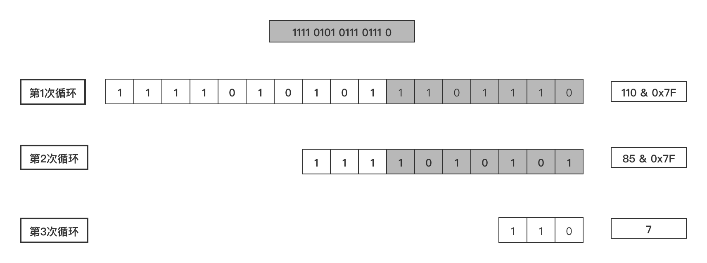

# 相关协议

## TCP 协议是流式协议

很多读者从接触网络知识以来，应该听说过这句话：TCP
协议是流式协议。那么这句话到底是什么意思呢？所谓流式协议，即协议的内容是像流水一样的字节流，内容与内容之间没有明确的分界标志，需要我们人为地去给这些协议划分边界。

举个例子，A 与 B 进行 TCP 通信，A 先后给 B 发送了一个 100 字节和 200 字节的数据包，那么 B 是如何收到呢？B 可能先收到 100
字节，再收到 200 字节；也可能先收到 50 字节，再收到 250 字节；或者先收到 100 字节，再收到 100 字节，再收到 100 字节；或者先收到
20 字节，再收到 20 字节，再收到 60 字节，再收到 100 字节，再收到 50 字节，再收到 50 字节......

不知道读者看出规律没有？规律就是 A 一共给 B 发送了 300 字节，B 可能以一次或者多次任意形式的总数为 300 字节收到。假设 A 给 B
发送两个大小分别是 100 字节和 200 字节的数据包，作为发送方的 A 来说，A 是知道如何划分这两个数据包的界限的，但是对于 B
来说，如果不人为规定多少字节作为一个数据包，B 每次是不知道应该把收到的数据中多少字节作为一个有效的数据包的，而规定每次把多少数据当成一个包就是协议格式定义的内容之一。

经常会有新手写出类似下面这样的代码：

**发送端：**

```c++
//...省略创建socket，建立连接等部分不相关的逻辑...
char buf[] = "the quick brown fox jumps over a lazy dog.";
int n = send(socket, buf, strlen(buf), 0);
//...省略出错处理逻辑...
```

**接收端：**

```c++
//省略创建socket，建立连接等部分不相关的逻辑...
char recvBuf[50] = { 0 };
int n = recv(socket, recvBuf, 50, 0);
//省略出错处理逻辑...
printf("recvBuf: %s", recvBuf);
```

为了专注问题本身的讨论，我这里省略掉了建立连接和错误处理的逻辑。上述代码中发送端给接收端发送了一串字符”the quick brown fox
jumps over a lazy dog.“，接收端收到后将其打印出来。

类似这样的代码在本机一般会工作的很好，接收端也如期打印出来预料的字符串，但是一放到局域网或者公网环境就出问题了，即接收端可能打印出来字符串并不完整；如果发送端连续多次发送字符串，接收端会打印出来的字符串不完整或出现乱码。不完整的原因很好理解，即对端某次收到的数据小于完整字符串的长度，recvBuf
数组开始被清空成 \0，收到部分字符串后，该字符串的末尾仍然是 \0，printf 函数寻找以 \0
为结束标志的字符结束输出；乱码的原因是如果某次收入的数据不仅包含一个完整的字符串，还包含下一个字符串部分内容，那么 recvBuf
数组将会被填满，printf 函数输出时仍然会寻找以 \0 为结束标志的字符结束输出，这样读取的内存就越界了，一直找到 \0
为止，而越界后的内存可能是一些不可读字符，显示出来后就乱码了。

我举这个例子的目的是希望你能对“ TCP
协议是流式协议”有一个直观的认识。正因为如此，我们需要人为地在发送端和接收端规定每一次的字节流边界，以便接收端知道从什么位置取出多少字节来当成一个数据包去解析，这是我们设计网络通信协议格式要做的工作之一。

### 如何解决粘包问题

网络通信程序实际开发中，或者技术面试时，面试官通常会问的比较多的一个问题是：网络通信时，如何解决粘包？

有的面试官可能会这么问：网络通信时，如何解决粘包、丢包或者包乱序问题？这个问题其实是面试官在考察面试者的网络基础知识，如果是
TCP 协议，在大多数场景下，是不存在丢包和包乱序问题的，TCP 通信是可靠通信方式，TCP 协议栈通过序列号和包重传确认机制保证数据包的有序和一定被正确发到目的地；如果是
UDP 协议，如果不能接受少量丢包，那就要自己在 UDP 的基础上实现类似 TCP 这种有序和可靠传输机制了（例如 RTP 协议、RUDP
协议）。所以，问题拆解后，只剩下如何解决粘包的问题。

先来解释一下什么是粘包，所谓粘包就是连续给对端发送两个或者两个以上的数据包，对端在一次收取中收到的数据包数量可能大于 1
个，当大于 1 个时，可能是几个（包括一个）包加上某个包的部分，或者干脆就是几个完整的包在一起。当然，也可能收到的数据只是一个包的部分，这种情况一般也叫半包。

粘包示意图如下：


无论是半包还是粘包问题，其根源是上文介绍中 TCP 协议是流式数据格式。解决问题的思路还是想办法从收到的数据中把包与包的边界给区分出来。那么如何区分呢？一般有三种分包方法：

**固定包长的数据包**

顾名思义，即每个协议包的长度都是固定的。举个例子，例如我们可以规定每个协议包的大小是 64 个字节，每次收满 64
个字节，就取出来解析（如果不够，就先存起来）。

这种通信协议的格式简单但灵活性差。如果包内容不足指定的字节数，剩余的空间需要填充特殊的信息，如
\0（如果不填充特殊内容，如何区分包里面的正常内容与填充信息呢？）；如果包内容超过指定字节数，又得分包分片，需要增加额外处理逻辑——在发送端进行分包分片，在接收端重新组装包片（分包和分片内容在接下来会详细介绍）。

**以指定字符（串）为包的结束标志**
这种协议包比较常见，即字节流中遇到特殊的符号值时就认为到一个包的末尾了。例如，我们熟悉的 FTP协议，发邮件的 SMTP
协议，一个命令或者一段数据后面加上"\r\n"（即所谓的 CRLF）表示一个包的结束。对端收到后，每遇到一个”\r\n“就把之前的数据当做一个数据包。

这种协议一般用于一些包含各种命令控制的应用中，其不足之处就是如果协议数据包内容部分需要使用包结束标志字符，就需要对这些字符做转码或者转义操作，以免被接收方错误地当成包结束标志而误解析。

**包头 + 包体格式**
这种格式的包一般分为两部分，即包头和包体，包头是固定大小的，且包头中必须含有一个字段来说明接下来的包体有多大。

例如：

```c++
struct msg_header
{
  int32_t bodySize;
  int32_t cmd;
};
```

这就是一个典型的包头格式，bodySize 指定了这个包的包体是多大。由于包头大小是固定的（这里是 size(int32_t) + sizeof(int32_t) =
8 字节），对端先收取包头大小字节数目（当然，如果不够还是先缓存起来，直到收够为止），然后解析包头，根据包头中指定的包体大小来收取包体，等包体收够了，就组装成一个完整的包来处理。在有些实现中，包头中的
bodySize可能被另外一个叫 packageSize 的字段代替，这个字段的含义是整个包的大小，这个时候，我们只要用 packageSize 减去包头大小（这里是
sizeof(msg_header)）就能算出包体的大小，原理同上。

> 在使用大多数网络库时，通常你需要根据协议格式自己给数据包分界和解析，一般的网络库不提供这种功能是出于需要支持不同的协议，由于协议的不确定性，因此没法预先提供具体解包代码。当然，这不是绝对的，也有一些网络库提供了这种功能。在
> Java Netty 网络框架中，提供了FixedLengthFrameDecoder 类去处理长度是定长的协议包，提供了 DelimiterBasedFrameDecoder
> 类去处理按特殊字符作为结束符的协议包，提供 ByteToMessageDecoder 去处理自定义格式的协议包（可用来处理包头 + 包体
> 这种格式的数据包），然而在继承 ByteToMessageDecoder 子类中你需要根据你的协议具体格式重写 decode() 方法来对数据包解包。

### 解包与处理

以包头 + 包体 这种格式的数据包来说明，处理流程如下：


假设我们的包头格式如下：

```c++
//强制1字节对齐
#pragma
pack(push, 1)
//协议头
struct msg_header
{
int32_t  bodysize;         //包体大小  
};
#pragma
pack(pop)
```

那么上面的流程实现代码如下：

```c++
//包最大字节数限制为10M
#define
MAX_PACKAGE_SIZE    10 * 1024 * 1024

void ChatSession::OnRead(const std::shared_ptr<TcpConnection>& conn, Buffer* pBuffer, Timestamp receivTime)
{
while (true)
{
//不够一个包头大小
if (pBuffer->readableBytes() < (size_t)sizeof(msg_header))
{
//LOGI << "buffer is not enough for a package header, pBuffer->readableBytes()=" << pBuffer->readableBytes() << ", sizeof(msg_header)=" << sizeof(msg_header);
return;
}

//取包头信息
msg_header header;
memcpy(&header, pBuffer->peek(), sizeof(msg_header));

//包头有错误，立即关闭连接
if (header.bodysize <= 0 || header.bodysize > MAX_PACKAGE_SIZE)
{
//客户端发非法数据包，服务器主动关闭之
LOGE("Illegal package, bodysize: %lld, close TcpConnection, client: %s", header.bodysize, conn->peerAddress().toIpPort().c_str());
conn->forceClose();
return;
}

//收到的数据不够一个完整的包
if (pBuffer->readableBytes() < (size_t)header.bodysize + sizeof(msg_header))
return;

pBuffer->retrieve(sizeof(msg_header));
//inbuf用来存放当前要处理的包
std::string inbuf;
inbuf.append(pBuffer->peek(), header.bodysize);
pBuffer->retrieve(header.bodysize);
//解包和业务处理
if (!Process(conn, inbuf.c_str(), inbuf.length()))
{
//客户端发非法数据包，服务器主动关闭之
LOGE("Process package error, close TcpConnection, client: %s", conn->peerAddress().toIpPort().c_str());
conn->forceClose();
return;
}
}// end while-loop
}
```

上述流程代码的处理过程和流程图中是一致的，pBuffer
这里是一个自定义的接收缓冲区，这里的代码，已经将收到的数据放入了这个缓冲区，所以判断当前已收取的字节数目只需要使用这个对象的相应方法即可。上述代码有些细节需要强调一下：

- 取包头时，你应该拷贝一份数据包头大小的数据出来，而不是从缓冲区 pBuffer 中直接将数据取出来（即取出来的数据从 pBuffer
  中移除），这是因为倘若接下来根据包头中的字段得到包体大小时，如果剩余数据不够一个包体大小，你又得把这个包头数据放回缓冲区。为了避免这种不必要的操作，只有缓冲区数据大小够整个包的大小（代码中：header.bodysize +
  sizeof(msg)）你才需要把整个包大小的数据从缓冲区移除，这也是这里的 pBuffer->peek() 方法 peek 单词的含义（中文可以翻译成”瞟一眼“或者”偷窥“）。

- 通过包头得到包体大小时，你一定要对 bodysize 的数值进行校验，我这里要求 bodysize 必须大于 0 且不大于 10 * 1024 * 1024（即
  10 M）。当然，你可以根据实际情况决定 bodysize 的上下限（包体大小是 0 字节的包在某些业务场景下是允许的）。记住，一定要判断这个上下限，因为假设这是一个非法的客户端发来的数据，其
  bodysize 设置了一个比较大的数值，例如 1 * 1024 * 1024 * 1024（即 1
  G），你的逻辑会让你一直缓存该客户端发来的数据，那么很快你的服务器内存将会被耗尽，操作系统在检测到你的进程占用内存达到一定阈值时会杀死你的进程，导致服务不能再正常对外服务。如果你判断了
  bodysize 字段是否满足你设置的上下限，对于非法的 bodysize，直接关闭这路连接即可。这也是服务的一种自我保护措施，避免因为非法数据包带来的损失。还有另外一种情况下
  bodysize 也可能不是预期的合理值，即因为网络环境差或者某次数据解析逻辑错误，导致后续的数据错位，把不该当包头数据的数据当成了包头，这个时候解析出来的
  bodysize 也可能不是合理值，同样，这种情形下也会被这段检验逻辑检测到，最终关闭连接。

- 不知道你有没有注意到整个判断包头、包体以及处理包的逻辑放在一个 while 循环里面，这是必要的。如果没有这个 while
  循环，当你一次性收到多个包时，你只会处理一个，下次接着处理就需要等到新一批数据来临时再次触发这个逻辑。这样造成的结果就是，对端给你发送了多个请求，你最多只能应答一个，后面的应答得等到对端再次给你发送数据时。这就是对粘包逻辑的正确处理。

以上逻辑和代码是最基本的粘包和半包处理机制，也就是所谓的技术上的解包处理逻辑。在理解它的基础之上，可以给解包拓展很多功能，例如，再给我们的协议包增加一个支持压缩的功能，包头变成下面这个样子：

```c++
#pragma pack(push, 1)
//协议头
struct msg_header
{
    char     compressflag;     //压缩标志，如果为1，则启用压缩，反之不启用压缩
    int32_t  originsize;       //包体压缩前大小
    int32_t  compresssize;     //包体压缩后大小
    char     reserved[16];	   //保留字段，用于将来拓展
};
#pragma pack(pop)
```

修改后的代码如下：

```c++
//包最大字节数限制为10M
#define
MAX_PACKAGE_SIZE    10 * 1024 * 1024

void ChatSession::OnRead(const std::shared_ptr<TcpConnection>& conn, Buffer* pBuffer, Timestamp receivTime)
{
while (true)
{
//不够一个包头大小
if (pBuffer->readableBytes() < (size_t)sizeof(msg_header))
{
//LOGI << "buffer is not enough for a package header, pBuffer->readableBytes()=" << pBuffer->readableBytes() << ", sizeof(msg_header)=" << sizeof(msg_header);
return;
}

//取包头信息
msg_header header;
memcpy(&header, pBuffer->peek(), sizeof(msg_header));

//数据包压缩过
if (header.compressflag == PACKAGE_COMPRESSED)
{
//包头有错误，立即关闭连接
if (header.compresssize <= 0 || header.compresssize > MAX_PACKAGE_SIZE ||
header.originsize <= 0 || header.originsize > MAX_PACKAGE_SIZE)
{
//客户端发非法数据包，服务器主动关闭之
LOGE("Illegal package, compresssize: %lld, originsize: %lld, close TcpConnection, client: %s", header.compresssize, header.originsize, conn->peerAddress().toIpPort().c_str());
conn->forceClose();
return;
}

//收到的数据不够一个完整的包
if (pBuffer->readableBytes() < (size_t)header.compresssize + sizeof(msg_header))
return;

pBuffer->retrieve(sizeof(msg_header));
std::string inbuf;
inbuf.append(pBuffer->peek(), header.compresssize);
pBuffer->retrieve(header.compresssize);
std::string destbuf;
if (!ZlibUtil::UncompressBuf(inbuf, destbuf, header.originsize))
{
LOGE("uncompress error, client: %s", conn->peerAddress().toIpPort().c_str());
conn->forceClose();
return;
}

//业务逻辑处理
if (!Process(conn, destbuf.c_str(), destbuf.length()))
{
//客户端发非法数据包，服务器主动关闭之
LOGE("Process error, close TcpConnection, client: %s", conn->peerAddress().toIpPort().c_str());
conn->forceClose();
return;
}
}
//数据包未压缩
else
{
//包头有错误，立即关闭连接
if (header.originsize <= 0 || header.originsize > MAX_PACKAGE_SIZE)
{
//客户端发非法数据包，服务器主动关闭之
LOGE("Illegal package, compresssize: %lld, originsize: %lld, close TcpConnection, client: %s", header.compresssize, header.originsize, conn->peerAddress().toIpPort().c_str());
conn->forceClose();
return;
}

//收到的数据不够一个完整的包
if (pBuffer->readableBytes() < (size_t)header.originsize + sizeof(msg_header))
return;

pBuffer->retrieve(sizeof(msg_header));
std::string inbuf;
inbuf.append(pBuffer->peek(), header.originsize);
pBuffer->retrieve(header.originsize);
//业务逻辑处理
if (!Process(conn, inbuf.c_str(), inbuf.length()))
{
//客户端发非法数据包，服务器主动关闭之
LOGE("Process error, close TcpConnection, client: %s", conn->peerAddress().toIpPort().c_str());
conn->forceClose();
return;
}
}// end else

}// end while-loop
}
```

这段代码先根据包头的压缩标志字段判断包体是否有压缩，如果有压缩，则取出包体大小去解压，解压后的数据才是真正的业务数据。整个程序执行流程图如下：


代码中有一个接收缓冲区变量 pBuffer。

## 从 struct 到 TLV——协议的演化历史

假设现在 A 与 B 之间要传输一个关于用户信息的数据包，可以将该数据包格式定义成如下形式：

```c++
#pragma pack(push, 1)
struct userinfo
{
    //命令号
    int32_t cmd;
    //用户性别
    char    gender;
    //用户昵称
    char	name[8];
};
#pragma pack(pop)
```

相信很多读者曾经都定义过这样的协议，这种数据结构简单明了，对端只要直接拷贝按字段解析就可以了。但是，需求总是不断变化的，某一天根据新的需求需要在这个结构中增加一个字段表示用户的年龄，于是修改协议结构成：

```c++
#pragma pack(push, 1)
struct userinfo
{
    //命令号
    int32_t cmd;
    //用户性别
    char    gender;
    //用户昵称
    char	name[8];
    //用户年龄
    int32_t	age;
};
#pragma pack(pop)
```

问题并没有直接增加一个字段那么简单，新修改的协议格式导致旧的客户端无法兼容（旧的客户端已经分发出去），这个时候我们升级服务器端的协议格式成新的，会导致旧的客户端无法使用。所以我们在最初设计协议的时候，我们需要增加一个版本号字段，针对不同的版本来做不同的处理，即：

```c++
/**
 * 旧的协议，版本号是 1
 */
#pragma
pack(push, 1)
struct userinfo
{
//版本号
short version;
//命令号
int32_t cmd;
//用户性别
char gender;
//用户昵称
char name[8];
};
#pragma
pack(pop)

/**
 * 新的协议，版本号是 2
 */
#pragma
pack(push, 1)
struct userinfo
{
//版本号
short version;
//命令号
int32_t cmd;
//用户性别
char gender;
//用户昵称
char name[8];
//用户年龄
int32_t    age;
};
#pragma
pack(pop)
```

这样我们可以用以下伪码来兼容新旧协议：

```c++
//从包中读取一个 short 型字段
short version = <从包中读取一个 short 型字段>;
if (version == 1)
{
//当旧的协议格式进行处理
}
else if (version == 2)
{
//当新的协议格式进行处理
}
```

上述方法是一个兼容旧版协议的常见做法。但是这样也存在一个问题，如果我们的业务需求变化快，我们可能需要经常调整协议字段（增、删、改），这样我们的版本号数量会比较多，我们的代码会变成类似下面这种形式：

```c++
//从包中读取一个 short 型字段
short version = <从包中读取一个 short 型字段>;
if (version == 版本号1)
{
//对版本号1格式进行处理
}
else if (version == 版本号2)
{
//对版本号2格式进行处理
}
else if (version == 版本号3)
{
//对版本号3格式进行处理
}
else if (version == 版本号4)
{
//对版本号4格式进行处理
}
else if (version == 版本号5)
{
//对版本号5格式进行处理
}
...省略更多...
```

这只是考虑了协议顶层结构，还没有考虑更多复杂的嵌套结构，不管怎样，这样的代码会变得越来越难以维护。

> 这里只是为了说明问题，实际开发中，建议在设计协议时尽量考虑周全，避免反复修改协议结构。

上述协议格式还存在另外一个问题，对于 name 字段，其长度为 8
个字节，这种定长的字段，长度大小不具有伸缩性，太长很多情况都用不完则造成内存和网络带宽的浪费，太短则某些情况下不够用。那么有没有什么方法来解决呢？

方法是有的，对于字符串类型的字段，我们可以在该字段前面加一个表示字符串长度（length）的标志，那么上面的协议在内存中的状态可以表示成如下图示：


这种方法解决了定义字符串类型时太长浪费太短不够用的问题，但是没有解决修改协议（如新增字段）需要兼容众多旧版本的问题，对于这个问题，我们可以通过在每个字段前面加一个
type 类型来解决，我们可以使用一个 char 类型来表示常用的类型，规定如下：

| 类型               | Type值 | 类型描述      |
|------------------|-------|-----------|
| bool             | 0     | 布尔值       |
| char             | 1     | char 型    |
| int16            | 2     | 16 位整型    |
| int32            | 3     | 32 位整型    |
| int64            | 4     | 64 位整形    |
| string           | 5     | 字符串或二进制序列 |
| list             | 6     | 列表        |
| map              | 7     | map       |
| 更多自定义类型省略......	 |       |           |

那么对于上述协议，其内存格式变成：


这样，每个字段的类型就是自解释了。这就是所谓的 TLV（Type-Length-Value，有的资料也称 Tag-Length-Value，其设计思想来源于 ANS.1
规范中一种叫 BER（Basic Encoding Rules）的编码格式）。这种格式的协议，我们可以方便地增删和修改字段类型，程序解析时根据每个字段的
type 来得到字段的类型。

这里再根据笔者的经验多说几句，实际开发中 TLV 类型虽然易于扩展，但是也存在如下缺点：

- TLV 格式因为每个字段增加了一个 type 类型，导致所占空间增大；

- 我们在解析字段时需要额外增加一些判断 type 的逻辑，去判断字段的类型，做相应的处理，即：

```c++
//读取第一个字节得到 type
if (type == Type::BOOL)
{
//bool型处理
}
else if (type == Type::CHAR)
{
//char型处理
}
else if (type == Type::SHORT)
{
//short型处理
}
...更多类型省略...
```

如上代码所示，每个字段我们都需要有这样的逻辑判断，这样的编码方式是非常麻烦的。

- 即使我们知道了每个字段的技术类型（相对业务来说），每个字段的业务含义仍然需要我们制定文档格式，也就是说 TLV 格式只是做到了技术上自解释。

所以，在实际的开发中，完全遵循 TLV 格式的协议并不多，尤其是针对一些整型类型的字段，例如整型字段的大小一旦在知道类型后，其长度就是固定下来的，例如
short 类型占 2 个字节，int32 类型占 4 个字节，因此不必专门浪费一段空间去存储其长度信息。

TLV 格式还可以嵌套，如下图所示：


> 有的项目在 TLV 格式的基础上还扩展了一种叫 TTLV 格式的协议，即 Tag-Type-Length-Value，每个字段前面再增加一个 Tag 类型，这个时候
> Type 表示数据类型，Tag 的含义由协议双方协定。

## 协议的分类

根据协议的内容是否是文本格式（即人为可读格式），我们将协议分为文本协议和二进制协议，像 http 协议的包头部分和 FTP
协议等都是典型的文本协议的例子。

### 协议设计工具

虽然 TLV 很简单，但是每搞一套新的协议都要从头编解码、调试，写编解码是一个毫无技术含量的枯燥体力活。在大量复制粘贴过程中，容易出错。

因此出现了一种叫 IDL（Interface Description Language）的语言规范，它是一种描述语言，也是一个中间语言，IDL
规范协议的使用类型，提供跨语言特性。可以定义一个描述协议格式的 IDL 文件，然后通过 IDL 工具分析 IDL
文件，就可以生成各种语言版本的协议代码。Google Protobuf 库自带的工具 protoc 就是这样一个工具。

### 整型数值的压缩

在实际设计协议时，整型数值（如 int32、int64）在协议字段中出现频率非常高，以上面介绍的 TLV 格式为例，L 代表每个字段的长度，假设用一个
int32 类型表示，int32 占 4 个字节，对于无符号的 int32 类型来说，其可表示的范围为 0 ~
4294967295，实际用途中，我们不会用到太长的字段值，因此可以根据字段实际的 length 值使用 1 ~ n 个字节表示这个 int32 值。

在实际处理中，一个字节（Byte）的共有 8 位（bit），该字节的最高位我们用来作为标志位，用于说明一个整型数值是否到此字节结束，如果某个字节的最高位为
0 表示该整型值的内容到此字节结束，最高位为 1 表示表示下一个字节仍然是该整型值的内容。说的有点抽象，我们来看一个具体的例子。假设在一串字节流中，存在如下二进制数字表示某个整型值：

```text
第1个字节  第2个字节 第3个字节  第4个字节
10111011 11110000 01110000 11110111 ...其他省略...
```

如上图所示，第一个字节是 10111011 ，其最高位为 1，说明其下一个字节仍然属于表示该整型的序列，下一个字节是第二个字节
11110000，其最高位仍然是 1，再看第三个字节的内容 01110000，第三个字节的最高位是
0，因此表示这个整数的字节序列到此就结束了。假定我们压缩时的顺序是低位内容字节在内存地址较小的位置，高位内容在内存地址较大的位置，则将每个字节的标志位（最高位）去掉后，其值是：

```text
第3个字节  第2个字节 第1个字节 
1110000  1110000  0111011   => 11100 00111000 00111011
```

使用上述技巧进行压缩的整型，由于一个字节只使用低 7 位（最高位为标志位，一般称为“字节前导位”），一个 int32 的整型共 4
个字节（4 * 8 = 32）位，因此一个 int32 使用上述方法进行压缩其长度可能是 1 ~ 5 个字节。实际协议中，我们基本上很少遇到使用超过
3 个字节以上长度，因此这种压缩还是比较实用的（节省空间）。

有了上面的分析，对于一个无符号 int32 的整型的压缩算法如下，以下代码节选自 POCO C++ 库，代码格式略有调整：

```text
01 //poco-master\Foundation\src\BinaryWriter.cpp
02 //将一个 uint32 压缩成 1 ~ 5 个字节的算法
03 void BinaryWriter::write7BitEncoded(UInt32 value)
04 {
05 	 do
06	 {
07		 unsigned char c = (unsigned char) (value & 0x7F);
08		 value >>= 7;
09		 if (value) 
10			 c |= 0x80;
11			
12		 _ostr.write((const char*) &c, 1);
13	 }
14	 while (value);
15 }
```

上述代码对一个 uint32_t 整型 value 从低到高每次取 7 bit，判断下 value 的值在去掉 7 bit 后是否有剩余（非 0 则说明有剩余，代码第
8 和 9 行），如果则将当前字节最高 bit （标志位）设置为 1，这样得到一个字节的值后，放入字节流容器 _ostr
中，字节流容器的类型只要具有连续的内存存储序列即可，如 std::string。

假设现在 value 的值是十进制 125678，其二进制是 1 1110 1010 1110 1110，我们来看一下上述函数执行过程：

**第一次循环**

十六进制 0x7F 的二进制为 0111 1111，执行
> unsigned char c = (unsigned char) (value & 0x7F);

后， c = 110（十进制），二进制是 0110 1110，接着将 value 右移 7 bit，看看还有没有剩余（与 0 判断），此时 value 变为
981（十进制），对应二进制 11 1101 0101 ，代码第 9 行 if 条件为真，说明一个字节表示不了这个数值，给算出的字节 c 最高位 bit
设置标志值 1（与 0x80 做或运算，0x80 的二进制是 1000 0000，代码第 **10** 行），得到第一个字节值 238（十进制），对应二进制 1110
1110。

**第二次循环**

c 开始等于 85（十进制），执行代码第 7、8 行后，发现 value 的值仍有剩余，再次在该字节的高位设置标志 1，得到第二个字节值
213（十进制）。

**第三次循环**

c 开始等于 7，执行代码第 7、8 行后，发现 value 的值已经没有剩余，得到第三个字节值 7，然后退出循环。

程序执行过程如下图所示：


在理解了整型的压缩算法，其对应的解压算法也很容易弄明白了，代码如下，同样节选自 POCO C++ 库，代码格式略有调整：

```text
//poco-master\Foundation\src\BinaryReader.cpp
//将一个字节流中 1 ~ 5 个字节的还原成一个 uint32 整型
void BinaryReader::read7BitEncoded(UInt32& value)
{
	char c;
	value = 0;
	int s = 0;
	do
	{
		c = 0;
		_istr.read(&c, 1);
		UInt32 x = (c & 0x7F);
		x <<= s;
		value += x;
		s += 7;
	}
	while (c & 0x80);
}
```

上述代码从字节流容器 _istr 中挨个读取一个字节 ，将当前字节与 0x7F 进行与运算，以取得该字节的低 7 位内容（代码 12
行），然后再将字节内容与 0x80 进行与运算，以判断该字节的最高位是否为 1 进而进一步确定下一个字节是不是也属于整型值的内容。

同样的道理，对于 uint64 位的整型数值，我们可以将其压缩成 1 ~ 10 个字节大小的字节数组，其压缩和解压算法与 uint32 位整型值一样。

## 通信协议设计时的注意事项

### 字节对齐

前面讨论的协议示例中：

```text
// Windows（MSVC）:
#pragma pack(push, 1)
struct userinfo
{
    //版本号
    short   version;
    //命令号
    int32_t cmd;
    //用户性别
    char    gender;
    //用户昵称
    char	name[8];
    //用户年龄
    int32_t	age;
};
#pragma pack(pop)
```

```text
// Linux（GCC）:
struct userinfo
{
    //版本号
    short   version;
    //命令号
    int32_t cmd;
    //用户性别
    char    gender;
    //用户昵称
    char	name[8];
    //用户年龄
    int32_t	age;
} __attribute__((packed));
```

有一组成对的 #pragma XX 指令，其中 #pragma pack(push, n)，是告诉编译器接下来的所有结构体（这里就是 userinfo 协议）的每一个字段按
n 个字节对齐，这里 n = 1，按一个字节对齐，即去除任何 padding 字节。这样做的目的是为了内存更加紧凑，节省存储空间。

不再需要这个对齐功能后，应该使用 #pragma pack(pop) 让编译器恢复之前的对齐方式。

> 注意：#pragma pack(push, n) 与 #pragma pack(pop) 一定要成对使用，如果你漏掉其中任何一个，编译出来的代码可能会出现很多奇怪的运行结果。

### 显式指定整型字段的长度

对于一个 int 型字段，在作为协议传输时，我们应该显式地指定该类型的长度，也就是说，你应该使用 int32_t、int64_t 这样的类型来代替
int、long。之所以这么做，是因为在不同字长的机器上，对于默认的 int 和 long 的长度可能不一样，例如 long 型，在 32 位操作系统上其长度是
4 个字节，而在 64 位机器上其长度是 8 个字节。如果不显式指定这种整形的长度，可能因为不同机器字长不同，导致协议解析出错或者产生错误的结果。

### 涉及到浮点数要考虑精度问题，建议放大成整数或者使用字符串去传输

由于计算机表示浮点数存在精度取舍不准确的问题，例如对于 1.000000，有的计算机可能会得到
0.999999，在某些应用中，如果这个浮点数的业务单位比较大（如表示金额，单位为亿），就会造成很大的影响。因此为了避免不同的机器解析得到不同的结果，建议在网络传输时将浮点数值放大相应的倍数变成整数或者转换为字符串来进行传输。

### 大小端编码问题

大小端的问题（即主机字节序和网络字节序），在设计协议格式时，如果协议中存在整型字段，建议使用同一个字节序。通常的做法是在进行网络传输时将所有的整型转换为网络字节序（大端编码，Big
Endian），避免不同的机器因为大小端问题解析得到不同的整型值。

当然，不一定非要转换为网络字节序，如果明确的知道通信的双方使用的是相同的字节序，则也可以不转换。

### 协议与自动升级功能

对于一个商业的产品，发布出去的客户端一般通过客户端的自动升级功能去获得更新（IOS App 除外，苹果公司要求所有的 App 必须在其
App Store 上更新新版本，禁止热更新）。在客户端与服务器通信的所有协议格式中，自动升级协议是最重要的一个，无论版本如何迭代，一定要保证自动升级协议的新旧兼容，这样做有如下原因：

-
如果新的服务器不能兼容旧客户端中的自动升级协议，那么旧的客户端用户将无法升级成新的版本了，这样的产品相当于把自己给“阉割”了。对于不少产品，不通过自动升级而让众多用户去官网下载新的版本是一件很难做到的事情，这种决策可能会导致大量用户流失；

- 退一步讲，对于一些测试不完善，或者处于快速迭代中的产品，只要保证自动升级功能正常，旧版本任何 bug
  和瑕疵都可以通过升级新版本解决。这对于一些想投放市场试水，但又可能设计不充分的产品尤其重要。

> 顺便提一下，一般自动升级功能是根据当前版本的版本号与服务器端新版本的版本号进行比较，如果二者之间存在一个大版本号的差别（如1.0.0
> 与 2.0.0），即有重大功能更新，则应该强制客户端更新下载最新版本；如果只是一个小版本号的更新（如 1.0.0 与
> 1.1.0），则可以让用户选择是否更新。当然，如果是新版本修正了前一个版本中严重影响使用的 bug，也应当强制用户更新。

## 包分片

这里说的包分片，指的是应用层的对包的拆分。当一个包的数据较大，超过一个包的最长长度时，我们需要对包进行分片。有的读者可能会有疑问：分成多个包就行了，为什么要对包进行分片？在实际应用中，一般会根据业务需求对包的类型进行编号，例如使用一个
wCmd 表示业务号，但某些业务类型某次携带的数据可能比较大，超过了单个包的最大长度，这个时候我们需要将该数据拆分成多个包片，但其业务号隶属于同一个包，这就是所谓的”包分片“。

在理解了包分片的原理后，设计包分片功能也很简单了。这里提供两种包分片的思路。

1. 设置分片标志

> 在包头部分设置一个字段表示当前包是否属于某个大包的分片，分片标志字段一般有 4
> 种取值类型：无分片标志、包的第一个分片标志、包的最后一个分片标志、第一个分片与最后一个分片之间的包分片标志。

2. 每个包分片的包头部分有该包的总分片数目和当前分片编号。

> 对于 TCP 协议来说，由于其数据传输本身是有序的，因此多个分片，只要我们一端按顺序依次发送，另外一端收包时一定会按发送的顺序收到。因此，我们不用考虑包分片的顺序问题。

我们来看一个具体的包分片的例子：

假设现在有如下协议头定义：

```text
//与客户端交互协议包头
#pragma pack(push, 1)
typedef struct tagNtPkgHead
{
    unsigned char   bStartFlag;     //协议包起始标志 0xFF
    unsigned char   bVer;           //版本号
    unsigned char   bEncryptFlag;   //加密标志(如果不加密,则为0)
    unsigned char   bFrag;          //是否有包分片(1 有包分片 0 无包分片)
    unsigned short  wLen;           //总包长
    unsigned short  wCmd;           //命令号
    unsigned short  wSeq;           //包的序列号,业务使用
    unsigned short  wCrc;           //Crc16校验码
    unsigned int    dwSID;          //会话ID
    unsigned short  wTotal;         //有包分片时，分片总数
    unsigned short  wCurSeq;        //有包分片时，分片序号，从0开始，无分片时也为0
} NtPkgHead, *PNtPkgHead;
#pragma pack(pop)
```

对端在处理包分片的逻辑伪码如下：

```c++
UINT CSocketClient::RecvDataThreadProc(LPVOID lpParam)
{
    LOG_NORMAL("Start recv data thread.");
    DWORD           dwWaitResult;
    std::string     strPkg;
    //临时存放一个完整的包数据的变量
    std::string     strTotalPkg;
    unsigned short  uPkgLen = 0;
    unsigned int    uBodyLen = 0;
    unsigned int    uTotalPkgLen = 0;
    unsigned int    uCmd = 0;
    NtPkgHead       pkgHead;
    unsigned short  uTotal = 0;
    //记录上一次的包分片序号，包分片序号从0开始
    unsigned short  uCurSeq = 0;
    int             nWaitTimeout = 1;

    CSocketClient* pSocketClient = (CSocketClient*)lpParam;

    while (!m_bExit)
    {      
        //检测是否有数据
        if (!pSocketClient->CheckReceivedData())
        {
            //休眠10豪秒
            Sleep(10);
            continue;
        }
            
        //接收数据，并放入pSocketClient->m_strRecvBuf中
        if (!pSocketClient->Recv())
        {
            LOG_ERROR("Recv data error");
                
            //收数据出错，清空接收缓冲区，可以做一些关闭连接、重连等动作，
            pSocketClient->m_strRecvBuf.clear();

            Reconnect();
            continue;
        }

        //一定要放在一个循环里面解包，因为当前缓冲区中可能存在多个数据包
        while (true)
        {
            //判断当前收到的数据是否够一个包头大小
            if (pSocketClient->m_strRecvBuf.length() < sizeof(NtPkgHead))
                break;

            memset(&pkgHead, 0, sizeof(pkgHead));
            memcpy_s(&pkgHead, sizeof(pkgHead), pSocketClient->m_strRecvBuf.c_str(), sizeof(pkgHead));
            
            //对包消息头检验
            if (!CheckPkgHead(&pkgHead))
            {
                //如果包头检验不通过，缓冲区里面的数据已经是脏数据了，直接清空掉，
                //可以做一些关闭连接并重连的动作             
                LOG_ERROR("Check package head error, discard data %d bytes", (int)pSocketClient->m_strRecvBuf.length());
                
                pSocketClient->m_strRecvBuf.clear();

                Reconnect();
                break;
            }

            //判断当前数据是否够一个整包的大小
            uPkgLen = ntohs(pkgHead.wLen);
            if (pSocketClient->m_strRecvBuf.length() < uPkgLen)
                break;

            strPkg.clear();
            strPkg.append(pSocketClient->m_strRecvBuf.c_str(), uPkgLen);

            //从收取缓冲区中移除已经处理的数据部分
            pSocketClient->m_strRecvBuf.erase(0, uPkgLen);

            uTotal = ::ntohs(pkgHead.wTotal);
            uCurSeq = ::ntohs(pkgHead.wCurSeq);
            //无分片或第一个分片
            if (uCurSeq == 0)
            {
                strTotalPkg.clear();
                uTotalPkgLen = 0;
            }

            uBodyLen = uPkgLen - sizeof(NtPkgHead);
            uTotalPkgLen += uBodyLen;
            strTotalPkg.append(strPkg.data() + sizeof(NtPkgHead), uBodyLen);

            //无分包 或 分包的最后一个包 则将组装后的包发送出去
            if (uTotal == 0 || (uTotal != 0 && uTotal == uCurSeq + 1))
            {
                uCmd = ::ntohs(pkgHead.wCmd);

                //ProxyPackage是解析出来的业务包定义
                ProxyPackage proxyPackage;
                //拷贝业务号
                proxyPackage.nCmd = uCmd;
                //拷贝包长度
                proxyPackage.nLength = uTotalPkgLen;
                //拷贝包体内容
                proxyPackage.pszJson = new char[uTotalPkgLen];
                memset(proxyPackage.pszJson, 0, uTotalPkgLen * sizeof(char));
                memcpy_s(proxyPackage.pszJson, uTotalPkgLen, strTotalPkg.c_str(), strTotalPkg.length());

                //将一个完整的包交给业务处理
                pSocketClient->m_pNetProxy->AddPackage((const char*)&proxyPackage, sizeof(proxyPackage));
            }
        }// end inner-while-loop


    }// end outer-while-loop


    LOG_NORMAL("Exit recv data thread.");

    return 0;
}
```

上述代码在一个网络数据收取线程中，先检测是否有可读数据，如果有可读数据，则从 socket 上读取该数据存入接收缓冲区
pSocketClient->m_strRecvBuf 中，然后判断收到的数据是否够一个包头的大小（sizeof(NtPkgHead)
），如果不够，退出当前循环等待后续数据到来；如果够，对包头数据进行校验后，从包头中得到整包的大小（ntohs(pkgHead.wLen)
）（这里表示整包的大小的字段 wLen 使用了网络字节序，我们调用 ntohs()
函数得到本机字节序）；然后判断收到的数据是否够一个整包的大小，如果不够，退出当前循环等待后续数据到来；如果够，则根据记录当前包分片序号的变量
uCurSeq （uCurSeq = ::ntohs(pkgHead.wCurSeq)）来确定该包是否是某个分片，uCurSeq 等于 0
时说明此次从一个新的包片或完整的包开始的；从接收缓冲区中将当前包片或者完整包的数据放入变量 strTotalPkg 中存储起来（注意
pkgHead.wTotal 和 pkgHead.wCurSeq 均使用了网络字节序，需要转换成本地字节序）。接着，根据包头字段 pkgHead.wTotal 和
pkgHead.wCurSeq 转换成本机字节序的值判断这是否是一个完整的包（当 uTotal == 0 时）或者是最后一个包分片（当 uTotal != 0 &&
uTotal == uCurSeq + 1 时），此时 strTotalPkg 存放的就是一个完整的包数据了，接着将其拷贝出来（这里是拷贝至 ProxyPackage
结构中），进行业务逻辑处理。如果当前包片只是一个大包的中间包片，则继续进行下一轮数据的处理。strTotalPkg
中存放的数据达到一个完整的包时会在业务处理后、下一轮循环存入新的包片数据前清空掉(strTotalPkg.clear();)。

上述流程可用如下流程图表示：


## 跨语言之间的网络通信协议识别与解析

在实际开发中，由于不同平台开发工具和编程语言的差别，我们需要不同编程语言之间去解析通信协议，这里以 C++ 和 Java
语言为例，通过一个示例来分析如何跨语言之间解析通信协议，编写跨平台代码。

这里以在 Java 中解析 C++ 网络数据包为例。 通常，这对于很多人来说是一件很困难的事情，所以只能变着法子使用第三方的库。其实只要你掌握了一定的基础知识，利用一些现成的字节流抓包工具（如
tcpdump、wireshark）很容易解决这个问题。我们这里使用 tcpdump 工具来尝试分析和解决这个问题。

首先，在我们需要明确字节序列的概念后，我们知道 x86 和 x64 系列的 CPU 使用小端编码，而数据在网络上传输，以及 Java
语言中，使用的是大端编码。 举个例子，看一个 x64 机器上的 32 位数值在内存中的存储方式，代码如下：

```c++
int main()
{
	int32_t i = 123456;
	
	return 0;
}
```

变量 i 在内存中的地址序列是 0x003CF7C4 ~ 0x003CF7C8，值为 40 e2 01 00。


十六进制 0001e240 值等于 10 进制 123456，对于整数 123456，十万位的数字 1 是权重最高的位，个位的数字 6
是权重最低的位，小端编码中权重高的位存储在内存地址高（内存地址值大）的位置，权重值低的位存储在内存地址低（内存地址值小）的位置，这就是所谓的"
高高低低原则"（高位高地址，低位低地址）。 大端编码的规则与小端编码的规则相反，大端编码使用的是"高低低高原则"
，即权重高的位存储在内存地址值低的位置，权重低的位存储在内存地址高的位置。

如果我们一个 C++ 程序的 int32 值 123456 不作转换地传给 Java 程序，那么 Java 按照大端编码的形式读出来的值是：十六进制
40E20100 = 十进制 1088553216。所以，为了表达同样的值，要么在发送方将数据转换成网络字节序（big endian），要么让接收端做转换。

下面看一下如果 C++ 端传送一个类型为 msg 数据结构，Java 端该如何解析（由于 Java 中是没有指针的，也无法操作内存地址，导致很多开发者无从下手），下面利用
tcpdump 来寻找解决这个问题的思路。

```c++
#pragma pack(push, 1)
struct msg
{
	char 	compressflag;
	int32_t originsize;
	int32_t compresssize;
	char 	reservered[16];
	char 	buf[63];
}
#pragma pack(pop)
```

客户端发送的数据包：


利用 tcpdump 抓到的包如下：


放大一点：


白色标识出来就是我们收到的数据包。这里想说明两点：

- 如果我们知道发送端发送的字节流，再比对接收端收到的字节流，我们就能检测数据包的完整性，也可以利用这个来排查一些网络通信问题；

- 对于 Java 程序只要按照这个顺序，先利用 java.net.Socket 的输出流 java.io.DataOutputStream 对象的
  readByte、readInt32、readInt32、readBytes、readBytes 方法依次读出一个 char、int32、int32、16 个字节的字节数组、63
  个字节数组即可。当然，为了还原像 int32 这样的整型值，我们需要额外做一些从 little-endian 向 big-endian 的转换工作。

## xml 与 json 格式协议

xml 和 json 这两种格式由于其良好的自我解释性，是开发中使用的非常广泛的两种数据格式。一个 xml 格式的示例如下所示：

```xml
<?xml version="1.0" encoding="utf-8"?>
<SkinList>
    <Skin>
        <SkinID>0</SkinID>
        <SkinName>默认皮肤</SkinName>
        <SkinPath>Skin0\</SkinPath>
    </Skin>
    <Skin>
        <SkinID>1</SkinID>
        <SkinName>冰凉清爽</SkinName>
        <SkinPath>Skin1\</SkinPath>
    </Skin>
    <CurSkinID>0</CurSkinID>
</SkinList>
```

一个 json 格式的示例如下：

```json
{
  "userid": 1001,
  "username": "fufeng",
  "nickname": "扶风",
  "facetype": 0,
  "gender": 1,
  "birthday": 19980101,
  "signature": "生活需要很多的力气呀。xx",
  "clienttype": 1
}
```

那么 xml 和 json 格式可以单独用来作为网络通信协议吗？

当然可以，但是一般单独使用 xml 或者 json 格式作为网络通信协议的服务非常少，其原因是在给数据包分界得到一个个完整的包时非常不方便。

无论是 xml 还是 json 格式，如果单独作为协议，一般由于业务数据内容不同，每个包的长度不一样。那么在 TCP
流式数据中只能采取固定结束符的方式来分割，对于不确定长度的 xml 和 json，在频繁进行数据交换的网络通信程序中，每次解包前都得遍历一次
xml 或 json 字符串以寻找特定的包结束符。例如，对于上面的 xml 示例，就是在流式数据中寻找 </SkinList> 字符串以作为一个 xml
格式的包结束符，对于上面的 json 格式，仅仅寻找 json 结束的花括号（}）容易造成误判的，还得在这基础上加上其他限定标记，例如，json
的最后一个节点可以加一个特殊字段标志作为结束标记，以上述 json 为例，在其末尾增加一个 endFlag 标志后变成如下形式：

```json
{
  "userid": 1001,
  "username": "fufeng",
  "nickname": "扶风",
  "facetype": 0,
  "gender": 1,
  "birthday": 19980101,
  "signature": "生活需要很多的力气呀。xx",
  "clienttype": 1,
  "endFlag": 0
}
```

这样当该 json 作为一个数据包时，在判断包结束标志时可以通过寻找 "“endFlag”: 0" 加一个 “}” 这样的字符串作为包分界符号。但这种方法很不灵活，json
在某些系统或库中解析时各个字段的位置顺序可能会被调整，也就是说，像 "“endFlag”: 0" 这样的字段可能会被调整到 json 中的非末尾位置；另外
json 被格式化后某些字段值后面会被追加 “\n” 或 “\r\n” 这样的换行符，这就给程序寻找指定包结束符带来了困扰。

所以通常情况下，xml 或者 json 格式不会被单独作为协议格式，而是会作为某个协议的一部分出现，例如如下格式：

```c++
struct msg
{
	//在消息头header中说明整个包的大小，减去header、cmd和seq的大小就是buf的长度
	//即是xml或者json的长度
	msgheader header;
	int32_t	  cmd;
	int32_t   seq;
	char*     buf;	//buf是一个字符串，其格式可以是一个 xml 或者 json
};
```

> 凡事可能存在特例，业界也有使用 xml 格式的协议，例如 XMPP，有兴趣的可以通过XMPP官网了解一下。

## 一个自定义协议示例

演示如何自定义一个灵活的通信协议类。在开源即时通讯 Flamingo 中自定义了一个协议格式，这个协议也分为包头和包体两部分，其中包头的定义如下：

```c++
#pragma pack(push, 1)
//协议头
struct chat_msg_header
{
    char     compressflag;     //压缩标志，如果为1，则启用压缩，反之不启用压缩
    int32_t  originsize;       //包体压缩前大小
    int32_t  compresssize;     //包体压缩后大小
    char     reserved[16];
};
#pragma pack(pop)
```

包体的内容长度无论是否设置了 compressflag 压缩标志，最后其实际长度都是 originsize，在得到了包体内容后，我们可以按通信两端规定好的协议来解析一个个的业务字段。

假设是一个聊天内容协议，发送方示例代码如下：

```c++
//发送方组装包体的格式
std::string outbuf;
net::BinaryStreamWriter writeStream(&outbuf);
writeStream.WriteInt32(msg_type_chat);
writeStream.WriteInt32(m_seq);
//senderId
writeStream.Write(senderId);
//消息内容
writeStream.WriteString(chatMsg);
//receiverId
writeStream.WriteInt32(receiverId);
writeStream.Flush();
```

上述代码开始处定义一个自动扩展的字符串缓冲区 outbuf（这里使用了 std::string），然后依次写入如下信息：

| 字段标号 | 字段名        | 类型/字节数目         | 说明                    |
|------|------------|-----------------|-----------------------|
| 字段 1 | msgType    | int32/4 字节      | 消息类型                  |
| 字段 2 | seq        | int32/4 字节      | 消息序号                  |
| 字段 3 | senderId   | int32/4 字节      | 发送者 id                |
| 字段 4 | chatMsg    | string/长度由消息内容定 | 聊天消息，可以定义成一个 json 字符串 |
| 字段 5 | receiverId | int32/4 字节      | 接收者 id                |

写入上述几个字段后，消息体结构示意图如下：


上图中有一个小的细节，即对于 string 类型的消息，在写入实际的字符串内容之前会先写入这个字符串的长度，writeStream.WriteString(chatMsg); 函数的实现如下：
```c++
//WriteString实际上调用了WriteCString方法
bool BinaryStreamWriter::WriteString(const string& str)
{
	return WriteCString(str.c_str(), str.length());
}

bool BinaryStreamWriter::WriteCString(const char* str, size_t len)
{
    std::string buf;
    write7BitEncoded(len, buf);

    m_data->append(buf);
    m_data->append(str, len);
    return true;
}
```

这里的 m_data 是前面介绍的 outbuf 的指针，也就是说使用一个 std::string 来存放二进制流， BinaryStreamWriter::WriteCString() 方法会先将字符串的长度写入流中，再写入字符串本身的内容，对于字符串的长度会根据其长度值压缩成 1 ~ 5 个字节。
```c++
//将一个4字节的整型数值压缩成1~5个字节
void write7BitEncoded(uint32_t value, std::string& buf)
{
    do
    {
        unsigned char c = (unsigned char)(value & 0x7F);
        value >>= 7;
        if (value)
        	c |= 0x80;

        buf.append(1, c);
    } while (value);
}
```

再写入上述 5 个字段后会调用 writeStream.Flush() 方法，该方法的实现如下：
```c++
void BinaryStreamWriter::Flush()
{
    char* ptr = &(*m_data)[0];
    unsigned int ulen = htonl(m_data->length());
    memcpy(ptr, &ulen, sizeof(ulen));
}
```
这个函数的作用是在流的前 4 个字节处存放流数据的长度，存储长度使用的是网络字节序，这 4 个字节在创建 BinaryStreamWriter 对象时被预留出来。
```c++
std::string outbuf;
net::BinaryStreamWriter writeStream(&outbuf);
```

上述代码调用 BinaryStreamWriter 的构造函数：
```c++
enum
{
	//4字节头长度
	BINARY_PACKLEN_LEN_2 = 4,                       
	CHECKSUM_LEN = 2,
};

BinaryStreamWriter::BinaryStreamWriter(string* data) :
        m_data(data)
{
	m_data->clear();
	char str[BINARY_PACKLEN_LEN_2 + CHECKSUM_LEN];
	m_data->append(str, sizeof(str));
}
```

实际上在 m_data 指向流起始处一共预留了 6 个字节，前 4 个字节是放置将来整个流数据的长度（网络字节序），后 2 个字节存放数据的校验和（checksum，这里未使用）。

因此调用 writeStream.Flush() 方法后，流对象的结构变成如下所示：


上图 streamLength 表示包体长度。

至此，这个二进制流虽然在我们这里的含义是包体部分，但是已经可以做到自我分界和解析了。在简单的业务中，我们先读取 4 个字节的 streamLength，然后根据 streamLength 转换成本机字节序后的长度来获取实际的内容长度。但是，我觉得这个不够方便，我没有在这个流的基础上继续扩展，而是选择在这个流的前面再加一个包头定义（即上述代码中的 chat_msg_header struct）。 chat_msg_header struct（包头）和这里的流（包体）组装成一个完整的包：

```c++
//p 即是包体流的指针
void TcpSession::sendPackage(const char* p, int32_t length)
{   
    string srcbuf(p, length);
    string destbuf;
    //按需压缩
    if (m_bNeedCompress)
    {
    	if (!ZlibUtil::compressBuf(srcbuf, destbuf))
        {
            LOGE("compress buf error");
            return;
        }
    }
    
 
    string strPackageData;
    chat_msg_header header;   
    if (m_bNeedCompress)
    {
    	//设置压缩标志
    	header.compressflag = PACKAGE_COMPRESSED;
    	//设置压缩后的包体大小
    	header.compresssize = destbuf.length();
    }
    else
    	header.compressflag = PACKAGE_UNCOMPRESSED;
    	   	    
    //设置压缩前的包体大小            
    header.originsize = length;
    
    //插入真正的包头
    strPackageData.append((const char*)&header, sizeof(header));
    strPackageData.append(destbuf);
  
  	//将整个包发到网络上去
    conn->send(strPackageData);
}
```

> 实际上可以基于 BinaryStreamWriter 这个流对象进行扩展，而不用单独再定义一个 chat_msg_header 结构体作为包头。

在 BinaryStreamWriter 对于浮点型的处理，是先将浮点数按一定的精度转换成字符串，然后将字符串写入流中：
```c++
// isNULL 参数表示可以写入一个 double 类型占位符
bool BinaryStreamWriter::WriteDouble(double value, bool isNULL)
{
    char doublestr[128];
    if (isNULL == false)
    {
        sprintf(doublestr, "%f", value);
        WriteCString(doublestr, strlen(doublestr));
    }
    else
    	WriteCString(doublestr, 0);
    	
    return true;
}
```

上面是对这个自定义协议的装包过程，解包过程实现了一个 BinaryStreamReader 类，该类的操作对象是去除了包头 chat_msg_header 结构后拿到的包体流。上述聊天协议的解包代码如下：
```c++
bool CRecvMsgThread::HandleMessage(const std::string& strMsg)
{
    //strMsg是包体流
	net::BinaryStreamReader readStream(strMsg.c_str(), strMsg.length());
	
	//读取消息类型
    int32_t msgType;
    if (!readStream.ReadInt32(msgType))
    {
        return false;
    }

	//读取消息序列号
    if (!readStream.ReadInt32(m_seq))
    {
        return false;
    }

	//根据消息类型做处理
    switch (msgType)
    {       
        //聊天消息
        case msg_type_chat:
        {
            //从流中读取发送者id
			int32_t senderId;
            if (!readStream.ReadInt32(senderId))
            {
                break;
            }
			
			//从流中读取聊天消息本身
			std::string chatMsg;
			size_t chatMsgLength;
			if (!readStream.ReadString(&chatMsg, 0, chatMsgLength))
			{
				return false;
			}

			//从流中读取接收者id
            int32_t receiverId;
            if (!readStream.ReadInt32(receiverId))
            {
                break;
            }
			
			//对聊天消息进行处理
            HandleChatMessage(senderId, receiverId, data);
        }
            break;
			
		//对其他消息的处理
	}// end switch	
		
	return false;
}
```

上述代码根据写入的流的字段类型顺序依次读出相应的字段值，在拿到各个字段值后就可以进行相应的业务处理了。

BinaryStreamReader 和 BinaryStreamWriter 类完整实现如下：

ProtocolStream.h（文件位置：flamingoserver/net/ProtocolStream.h）

```c++
/**
 *  一个强大的协议类, protocolstream.h
 */

#ifndef __PROTOCOL_STREAM_H__
#define __PROTOCOL_STREAM_H__

#include <stdlib.h>
#include <sys/types.h>
#include <string>
#include <sstream>
#include <stdint.h>

 //二进制协议的打包解包类，内部的服务器之间通讯，统一采用这些类
namespace net
{
    enum
    {
        TEXT_PACKLEN_LEN = 4,
        TEXT_PACKAGE_MAXLEN = 0xffff,
        BINARY_PACKLEN_LEN = 2,
        BINARY_PACKAGE_MAXLEN = 0xffff,

        TEXT_PACKLEN_LEN_2 = 6,
        TEXT_PACKAGE_MAXLEN_2 = 0xffffff,

        BINARY_PACKLEN_LEN_2 = 4,               //4字节头长度
        BINARY_PACKAGE_MAXLEN_2 = 0x10000000,   //包最大长度是256M,足够了

        CHECKSUM_LEN = 2,
    };

    //计算校验和
    unsigned short checksum(const unsigned short* buffer, int size);
    //将一个4字节的整型数值压缩成1~5个字节
    void write7BitEncoded(uint32_t value, std::string& buf);
    //将一个8字节的整型值编码成1~10个字节
    void write7BitEncoded(uint64_t value, std::string& buf);

    //将一个1~5个字节的字符数组值还原成4字节的整型值
    void read7BitEncoded(const char* buf, uint32_t len, uint32_t& value);
    //将一个1~10个字节的值还原成4字节的整型值
    void read7BitEncoded(const char* buf, uint32_t len, uint64_t& value);

    class BinaryStreamReader final
    {
    public:
        BinaryStreamReader(const char* ptr, size_t len);
        ~BinaryStreamReader() = default;

        virtual const char* GetData() const;
        virtual size_t GetSize() const;
        bool IsEmpty() const;
        bool ReadString(std::string* str, size_t maxlen, size_t& outlen);
        bool ReadCString(char* str, size_t strlen, size_t& len);
        bool ReadCCString(const char** str, size_t maxlen, size_t& outlen);
        bool ReadInt32(int32_t& i);
        bool ReadInt64(int64_t& i);
        bool ReadShort(short& i);
        bool ReadChar(char& c);
        size_t ReadAll(char* szBuffer, size_t iLen) const;
        bool IsEnd() const;
        const char* GetCurrent() const { return cur; }

    public:
        bool ReadLength(size_t& len);
        bool ReadLengthWithoutOffset(size_t& headlen, size_t& outlen);

    private:
        BinaryStreamReader(const BinaryStreamReader&) = delete;
        BinaryStreamReader& operator=(const BinaryStreamReader&) = delete;

    private:
        const char* const ptr;
        const size_t      len;
        const char* cur;
    };

    class BinaryStreamWriter final
    {
    public:
        BinaryStreamWriter(std::string* data);
        ~BinaryStreamWriter() = default;

        virtual const char* GetData() const;
        virtual size_t GetSize() const;
        bool WriteCString(const char* str, size_t len);
        bool WriteString(const std::string& str);
        bool WriteDouble(double value, bool isNULL = false);
        bool WriteInt64(int64_t value, bool isNULL = false);
        bool WriteInt32(int32_t i, bool isNULL = false);
        bool WriteShort(short i, bool isNULL = false);
        bool WriteChar(char c, bool isNULL = false);
        size_t GetCurrentPos() const { return m_data->length(); }
        void Flush();
        void Clear();

    private:
        BinaryStreamWriter(const BinaryStreamWriter&) = delete;
        BinaryStreamWriter& operator=(const BinaryStreamWriter&) = delete;

    private:
        std::string* m_data;
    };

}// end namespace

#endif //!__PROTOCOL_STREAM_H__
```

ProtocolStream.cpp （文件位置：flamingoserver/net/ProtocolStream.cpp）
```c++
#ifndef _WIN32
#include <arpa/inet.h>
#else
#include <Winsock2.h>
#pragma comment(lib, "Ws2_32.lib")
#endif

#include "ProtocolStream.h"
#include <string.h>
#include <stdio.h>
#include <sys/types.h>
#include <cassert>
#include <algorithm>
#include <stdio.h>

using namespace std;

namespace net
{
    //计算校验和
    unsigned short checksum(const unsigned short* buffer, int size)
    {
        unsigned int cksum = 0;
        while (size > 1)
        {
            cksum += *buffer++;
            size -= sizeof(unsigned short);
        }
        if (size)
        {
            cksum += *(unsigned char*)buffer;
        }
        //将32位数转换成16位数
        while (cksum >> 16)
            cksum = (cksum >> 16) + (cksum & 0xffff);

        return (unsigned short)(~cksum);
    }

    //将一个4字节的整型数值压缩成1~5个字节
    void write7BitEncoded(uint32_t value, std::string& buf)
    {
        do
        {
            unsigned char c = (unsigned char)(value & 0x7F);
            value >>= 7;
            if (value)
                c |= 0x80;

            buf.append(1, c);
        } while (value);
    }

    //将一个8字节的整型值编码成1~10个字节
    void write7BitEncoded(uint64_t value, std::string& buf)
    {
        do
        {
            unsigned char c = (unsigned char)(value & 0x7F);
            value >>= 7;
            if (value)
                c |= 0x80;

            buf.append(1, c);
        } while (value);
    }

    //将一个1~5个字节的字符数组值还原成4字节的整型值
    void read7BitEncoded(const char* buf, uint32_t len, uint32_t& value)
    {
        char c;
        value = 0;
        int bitCount = 0;
        int index = 0;
        do
        {
            c = buf[index];
            uint32_t x = (c & 0x7F);
            x <<= bitCount;
            value += x;
            bitCount += 7;
            ++index;
        } while (c & 0x80);
    }

    //将一个1~10个字节的值还原成4字节的整型值
    void read7BitEncoded(const char* buf, uint32_t len, uint64_t& value)
    {
        char c;
        value = 0;
        int bitCount = 0;
        int index = 0;
        do
        {
            c = buf[index];
            uint64_t x = (c & 0x7F);
            x <<= bitCount;
            value += x;
            bitCount += 7;
            ++index;
        } while (c & 0x80);
    }

    BinaryStreamReader::BinaryStreamReader(const char* ptr_, size_t len_)
        : ptr(ptr_), len(len_), cur(ptr_)
    {
        cur += BINARY_PACKLEN_LEN_2 + CHECKSUM_LEN;
    }
    
    bool BinaryStreamReader::IsEmpty() const
    {
        return len <= BINARY_PACKLEN_LEN_2;
    }
    
    size_t BinaryStreamReader::GetSize() const
    {
        return len;
    }
    
    bool BinaryStreamReader::ReadCString(char* str, size_t strlen, /* out */ size_t& outlen)
    {
        size_t fieldlen;
        size_t headlen;
        if (!ReadLengthWithoutOffset(headlen, fieldlen)) {
            return false;
        }

        // user buffer is not enough
        if (fieldlen > strlen) {
            return false;
        }

        // 偏移到数据的位置
        //cur += BINARY_PACKLEN_LEN_2;	
        cur += headlen;
        if (cur + fieldlen > ptr + len)
        {
            outlen = 0;
            return false;
        }
        memcpy(str, cur, fieldlen);
        outlen = fieldlen;
        cur += outlen;
        return true;
    }
    
    bool BinaryStreamReader::ReadString(string* str, size_t maxlen, size_t& outlen)
    {
        size_t headlen;
        size_t fieldlen;
        if (!ReadLengthWithoutOffset(headlen, fieldlen)) {
            return false;
        }

        // user buffer is not enough
        if (maxlen != 0 && fieldlen > maxlen) {
            return false;
        }

        // 偏移到数据的位置
        //cur += BINARY_PACKLEN_LEN_2;	
        cur += headlen;
        if (cur + fieldlen > ptr + len)
        {
            outlen = 0;
            return false;
        }
        str->assign(cur, fieldlen);
        outlen = fieldlen;
        cur += outlen;
        return true;
    }
    
    bool BinaryStreamReader::ReadCCString(const char** str, size_t maxlen, size_t& outlen)
    {
        size_t headlen;
        size_t fieldlen;
        if (!ReadLengthWithoutOffset(headlen, fieldlen)) {
            return false;
        }
        // user buffer is not enough
        if (maxlen != 0 && fieldlen > maxlen) {
            return false;
        }

        // 偏移到数据的位置
        //cur += BINARY_PACKLEN_LEN_2;	
        cur += headlen;

        //memcpy(str, cur, fieldlen);
        if (cur + fieldlen > ptr + len)
        {
            outlen = 0;
            return false;
        }
        *str = cur;
        outlen = fieldlen;
        cur += outlen;
        return true;
    }
    
    bool BinaryStreamReader::ReadInt32(int32_t& i)
    {
        const int VALUE_SIZE = sizeof(int32_t);

        if (cur + VALUE_SIZE > ptr + len)
            return false;

        memcpy(&i, cur, VALUE_SIZE);
        i = ntohl(i);

        cur += VALUE_SIZE;

        return true;
    }
    
    bool BinaryStreamReader::ReadInt64(int64_t& i)
    {
        char int64str[128];
        size_t length;
        if (!ReadCString(int64str, 128, length))
            return false;

        i = atoll(int64str);

        return true;
    }
    
    bool BinaryStreamReader::ReadShort(short& i)
    {
        const int VALUE_SIZE = sizeof(short);

        if (cur + VALUE_SIZE > ptr + len) {
            return false;
        }

        memcpy(&i, cur, VALUE_SIZE);
        i = ntohs(i);

        cur += VALUE_SIZE;

        return true;
    }
    
    bool BinaryStreamReader::ReadChar(char& c)
    {
        const int VALUE_SIZE = sizeof(char);

        if (cur + VALUE_SIZE > ptr + len) {
            return false;
        }

        memcpy(&c, cur, VALUE_SIZE);
        cur += VALUE_SIZE;

        return true;
    }
    
    bool BinaryStreamReader::ReadLength(size_t& outlen)
    {
        size_t headlen;
        if (!ReadLengthWithoutOffset(headlen, outlen)) {
            return false;
        }

        //cur += BINARY_PACKLEN_LEN_2;
        cur += headlen;
        return true;
    }
    
    bool BinaryStreamReader::ReadLengthWithoutOffset(size_t& headlen, size_t& outlen)
    {
        headlen = 0;
        const char* temp = cur;
        char buf[5];
        for (size_t i = 0; i < sizeof(buf); i++)
        {
            memcpy(buf + i, temp, sizeof(char));
            temp++;
            headlen++;

            //if ((buf[i] >> 7 | 0x0) == 0x0)
            if ((buf[i] & 0x80) == 0x00)
                break;
        }
        if (cur + headlen > ptr + len)
            return false;

        unsigned int value;
        read7BitEncoded(buf, headlen, value);
        outlen = value;

        /*if ( cur + BINARY_PACKLEN_LEN_2 > ptr + len ) {
        return false;
        }

        unsigned int tmp;
        memcpy(&tmp, cur, sizeof(tmp));
        outlen = ntohl(tmp);*/
        return true;
    }
    
    bool BinaryStreamReader::IsEnd() const
    {
        assert(cur <= ptr + len);
        return cur == ptr + len;
    }
    
    const char* BinaryStreamReader::GetData() const
    {
        return ptr;
    }
    
    size_t BinaryStreamReader::ReadAll(char* szBuffer, size_t iLen) const
    {
        size_t iRealLen = min(iLen, len);
        memcpy(szBuffer, ptr, iRealLen);
        return iRealLen;
    }

    //=================class BinaryStreamWriter implementation============//
    BinaryStreamWriter::BinaryStreamWriter(string* data) :
        m_data(data)
    {
        m_data->clear();
        char str[BINARY_PACKLEN_LEN_2 + CHECKSUM_LEN];
        m_data->append(str, sizeof(str));
    }
    
    bool BinaryStreamWriter::WriteCString(const char* str, size_t len)
    {
        std::string buf;
        write7BitEncoded(len, buf);

        m_data->append(buf);

        m_data->append(str, len);

        //unsigned int ulen = htonl(len);
        //m_data->append((char*)&ulen,sizeof(ulen));
        //m_data->append(str,len);
        return true;
    }
    
    bool BinaryStreamWriter::WriteString(const string& str)
    {
        return WriteCString(str.c_str(), str.length());
    }
    
    const char* BinaryStreamWriter::GetData() const
    {
        return m_data->data();
    }
    
    size_t BinaryStreamWriter::GetSize() const
    {
        return m_data->length();
    }
    
    bool BinaryStreamWriter::WriteInt32(int32_t i, bool isNULL)
    {
        int32_t i2 = 999999999;
        if (isNULL == false)
            i2 = htonl(i);
        m_data->append((char*)& i2, sizeof(i2));
        return true;
    }
    
    bool BinaryStreamWriter::WriteInt64(int64_t value, bool isNULL)
    {
        char int64str[128];
        if (isNULL == false)
        {
#ifndef _WIN32
            sprintf(int64str, "%ld", value);
#else
            sprintf(int64str, "%lld", value);
#endif
            WriteCString(int64str, strlen(int64str));
        }
        else
            WriteCString(int64str, 0);
        return true;
    }
    
    bool BinaryStreamWriter::WriteShort(short i, bool isNULL)
    {
        short i2 = 0;
        if (isNULL == false)
            i2 = htons(i);
        m_data->append((char*)& i2, sizeof(i2));
        return true;
    }
    
    bool BinaryStreamWriter::WriteChar(char c, bool isNULL)
    {
        char c2 = 0;
        if (isNULL == false)
            c2 = c;
        (*m_data) += c2;
        return true;
    }
    
    bool BinaryStreamWriter::WriteDouble(double value, bool isNULL)
    {
        char   doublestr[128];
        if (isNULL == false)
        {
            sprintf(doublestr, "%f", value);
            WriteCString(doublestr, strlen(doublestr));
        }
        else
            WriteCString(doublestr, 0);
        return true;
    }
    
    void BinaryStreamWriter::Flush()
    {
        char* ptr = &(*m_data)[0];
        unsigned int ulen = htonl(m_data->length());
        memcpy(ptr, &ulen, sizeof(ulen));
    }
    
    void BinaryStreamWriter::Clear()
    {
        m_data->clear();
        char str[BINARY_PACKLEN_LEN_2 + CHECKSUM_LEN];
        m_data->append(str, sizeof(str));
    }
}// end namespace
```

该协议类提供了对 char、short、int32、int64、string 等常用的字段类型的读写，功能非常强大，免去了定义各种结构体的麻烦。但是从业务上来讲，在实际开发中，每个字段的含义以及读写字段的顺序需要通信的双方提前协商好。

## http 协议
http 协议是用途最广泛的协议之一，相信绝大多数开发者都知道 http 协议和 http 请求，但是很多人只停留在“会用”的阶段。一说到 http 协议，大家都能滔滔不绝，然后问 http 协议的具体格式是啥样子的？很多人说不清楚，说不清楚就不清楚吧，有人甚至能将 html 文档页面的头部 <head> 标签当作 http 协议的头。大多数开发者都知道 http GET 和 POST 请求，也可以利用一些库或者框架发送 http GET 或者 POST 请求。但是 GET/POST 请求的数据放在协议包的哪里，服务器如何识别并解析这些数据，很多人又说不清楚。

当说到 http 服务器时，很多人离开了 Apache、nginx 这样现成的 http web server 之外，自己实现一个 http 服务器不知道如何下手，如果实际应用场景有需要使用到一些简单 http 请求时，例如需要某个服务提供一个支持 http 请求的健康检查接口，此时使用 Apache、nginx 这样的 http 服务器程序实在太劳师动众，此时我们最好可以自己实现一个简单的 http 服务。

### http 格式协议介绍
http 协议是建立在 TCP 协议之上的应用层协议，HTTP 的全写是 Hypertext Transfer Protocol，超级文本传输协议。

http 协议的格式如下：
```c++
1 GET或POST 请求的url路径（一般是去掉域名的路径） HTTP协议版本号\r\n
2 字段1名: 字段1值\r\n
3 字段2名: 字段2值\r\n
4      ...
5 字段n名 : 字段n值\r\n
6 \r\n
7 http协议包体内容
```

如上所示， http 协议由包头（1 ~ 6 行）和包体（7 行以后）两部分组成，包头与包体之间使用一个 \r\n 分割，其中包头每一行均以 \r\n 结束，最后包头结束时再添加一个\r\n（空行）表示包头结束。也就是说 http 协议大多数情况下是文本形式的明文格式，这也是 Hypertext Transfer Protocol 中的 **text（文本）** 的名称含义。

由于 http 协议包头的每一行都是以 \r\n 结束，所以 http 协议包头以 \r\n\r\n 结束，我们在用程序解析 http 格式的数据时可以通过 \r\n\r\n 来界定包头的结束位置和包体的起始位置。

也就是说，http 协议也分为 head（包头） 和 body（包体） 两部分，注意这里的 head 和 body 不是指 html 文档中的 <head> 和 <body> 标签，实际上，html 文档中内容（当然也包括其中的 <head> 和 <body> 标签）仅是 http 协议包的 body 的一部分。


### GET 与 POST 方法
HTTP 请求的方法有 GET、POST、HEAD、PUT、DELETE 等，其中 GET 和 POST 是我们用的最多的两个方法。我们来以一个具体的例子说明使用 GET 方法时 HTTP 协议包格式。

假设，我们在浏览器中请求 http://www.hootina.org/index_2013.php 这个网址，这是一个典型的 GET 方法，浏览器为我们组装的 http 数据包格式如下：

```http request
GET /index_2013.php HTTP/1.1\r\n
Host: www.hootina.org\r\n
Connection: keep-alive\r\n
Upgrade-Insecure-Requests: 1\r\n
User-Agent: Mozilla/5.0 (Windows NT 6.1; Win64; x64) AppleWebKit/537.36 (KHTML, like Gecko) Chrome/65.0.3325.146 Safari/537.36\r\n
Accept: text/html,application/xhtml+xml,application/xml;q=0.9,image/webp,image/apng,*/*;q=0.8\r\n
Accept-Encoding: gzip, deflate\r\n
Accept-Language: zh-CN,zh;q=0.9,en;q=0.8\r\n
\r\n
```

可以通过打开浏览器的调试窗口查看得到上面的信息，例如，对于 Chrome 浏览器，在页面上右键选择【检查】菜单即可，快捷键 F12。

上面这个请求只有包头没有包体，http 协议的包体部分不是必需的，也就是说 GET 请求一般没有包体部分。

如果 GET 请求带参数，那么一般是附加在请求的 URL 后面，参数与参数之间使用 & 分割，例如请求 http://www.hootina.org/index_2013.php?param1=value1&param2=value2&param3=value3，这个请求有三个参数 param1、param2 和 param3，其对应的参数值分别是 value1、value2、value3。

看下这个请求组装的 http 协议报文格式：
```http request
GET /index_2013.php?param1=value1&param2=value2&param3=value3 HTTP/1.1\r\n
Host: www.hootina.org\r\n
Connection: keep-alive\r\n
Upgrade-Insecure-Requests: 1\r\n
User-Agent: Mozilla/5.0 (Windows NT 6.1; Win64; x64) AppleWebKit/537.36 (KHTML, like Gecko) Chrome/65.0.3325.146 Safari/537.36\r\n
Accept: text/html,application/xhtml+xml,application/xml;q=0.9,image/webp,image/apng,*/*;q=0.8\r\n
Accept-Encoding: gzip, deflate\r\n
Accept-Language: zh-CN,zh;q=0.9,en;q=0.8\r\n
\r\n
```

由于浏览器对 URL 的长度最大值有限制，因此放在 URL 后面的 GET 参数数量和长度也是有限制的，不同的浏览器最大长度限制值不一样。

再来看下 POST 方法。

POST 方法请求的数据放在 HTTP 协议包的什么位置呢？再来看一个例子，以 12306 网站（https://kyfw.12306.cn/otn/login/init）中登录输入用户名、密码和选择正确的图片验证码后点击登录按钮为例，这是一个典型的 http post 请求。

浏览器以 POST 方式组装了 http 协议包发送了我们的用户名、密码和图片验证码等信息，组装的 HTTP 包内容格式如下：
```http request
POST /passport/web/login HTTP/1.1\r\n
Host: kyfw.12306.cn\r\n
Connection: keep-alive\r\n
Content-Length: 55\r\n
Accept: application/json, text/javascript, */*; q=0.01\r\n
Origin: https://kyfw.12306.cn\r\n
X-Requested-With: XMLHttpRequest\r\n
User-Agent: Mozilla/5.0 (Windows NT 6.1; Win64; x64) AppleWebKit/537.36 (KHTML, like Gecko) Chrome/65.0.3325.146 Safari/537.36\r\n
Content-Type: application/x-www-form-urlencoded; charset=UTF-8\r\n
Referer: https://kyfw.12306.cn/otn/login/init\r\n
Accept-Encoding: gzip, deflate, br\r\n
Accept-Language: zh-CN,zh;q=0.9,en;q=0.8\r\n
Cookie: _passport_session=0b2cc5b86eb74bcc976bfa9dfef3e8a20712; _passport_ct=18d19b0930954d76b8057c732ce4cdcat8137; route=6f50b51faa11b987e576cdb301e545c4; RAIL_EXPIRATION=1526718782244; RAIL_DEVICEID=QuRAhOyIWv9lwWEhkq03x5Yl_livKZxx7gW6_-52oTZQda1c4zmVWxdw5Zk79xSDFHe9LJ57F8luYOFp_yahxDXQAOmEV8U1VgXavacuM2UPCFy3knfn42yTsJM3EYOy-hwpsP-jTb2OXevJj5acf40XsvsPDcM7; BIGipServerpool_passport=300745226.50215.0000; BIGipServerotn=1257243146.38945.0000; BIGipServerpassport=1005060362.50215.0000\r\n
\r\n
username=abc%40qq.com&password=abc&appid=otn
```

其中 username=abc%40qq.com&password=abc&appid=otn 就是我们的 POST 请求携带的数据，但是读者需要注意以下几个事项：

1. 我的用户名是 abc@qq.com，在包体里面变成 abc%40qq.com，其中 %40 是 @ 符号的 16 进制转码形式。浏览器会对部分 URL 或者包体部分的部分字符做一下 16 进制转码，这个码表可以参考这里：http://www.w3school.com.cn/tags/html_ref_urlencode.html。

2. 这里有三个变量，分别是 username、password 和 appid，它们之间使用 & 符号分割，但是请注意，这不意味着 POST 请求传递多个数据时必须使用 & 符号分割。只不过这里是浏览器 html 表单（浏览器中输入用户名和密码的文本框是 html 表单的一种）分割多个变量采用的默认方式而已。读者可以根据自己的需求，灵活组织 POST 方法携带的数据格式，只要收发端协商好格式就可以。例如分割多个变量也可以使用如下几种形式：

```http request
方法一：
username=abc%40qq.com|password=abc|appid=otn

方法二：
username:abc%40qq.com\r\n
password:abc\r\n
appid:otn\r\n

方法三
username,password,appid=abc%40qq.com,abc,otn
```

3. POST 方法请求的数据是放在 http 包体中的（\r\n\r\n 标志之后）。


如上图所示，由于 http 协议是基于 TCP 协议的，TCP 协议是流式协议，包头部分可以通过多出的 \r\n 来分界，但对端如何知道包体部分有多长呢？这是协议本身要解决的问题。目前一般有两种方式，第一种方式就是在包头中设置一个 Content-Length 字段（字段名不区分大小写），这个字段的值标识了包体的长度。

上图中 Content-Length 值为 55，这是数据 username=abc%40qq.com&password=abc&appid=otn 字符串的长度，服务器收到一个数据包后，先从包头解析出这个字段的值，再根据这个值去读取相应长度的数据作为 http 协议的包体数据。

#### GET 与 POST 请求的安全性比较
在了解了 http 的 GET 和 POST 方法之后，有的开发者可能会有这样一种认识，即 POST 请求比 GET 请求要安全，其理由是：GET 请求的数据直接暴露在 URL 后面，而 POST 请求的数据在 http 协议包的包体里面。这种认识其实是偏颇的，就算是 POST 请求，仍然可以通过打开浏览器的调试窗口查看，或者进行抓包分析，所以理论上说这两种类型的请求方式数据被破解的难度是相同的，因此在实际开发中，无论是 POST 还是 GET 请求，会对一些关键性的信息进行一些混淆和加密。

在对安全要求更高的应用中，如交易支付，会将 SSL 与 HTTP 结合起来，即所谓的 HTTPS。 HTTPS 是在 HTTP 的基础上通过传输加密和身份认证保证了传输过程的安全性，SSL 全称是 Secure Socket Layer（安全套接字层），即在 TCP 层与 HTTP 层再加入一个 SSL 层。HTTPS 使用一个不同于 HTTP 的默认端口及一个加密/身份验证层，HTTPS 默认端口为 443。HTTPS 现在被广泛用于互联网上对安全敏感的通讯。

### HTTP chunk 编码
HTTP 协议在传输的过程中，如果包体过大，例如使用 http 上传一个大文件，或者传输内容给对端时，内容是动态产生的，例如一个动态 php 页面，传输方无法预先知道传输的内容有多大，这个时候就可以使用 http chunk 编码技术了。

HTTP chunked 技术原理是将整个 HTTP 包体分成多个小块，每一块都有自己的字段说明自身的长度，对端收到这些块后，去除说明部分，将多个小块合并在一起得到完整的包体内容。传输方在 http 包头中设置 Transfer-Encoding：chunked 来告诉对端这个数据是分块传输的（代替 Content-Length 字段）。

分块传输的编码格式：
```http request
[chunkSize][\r\n][chunkData][\r\n][chunkSize][\r\n][chunkData][\r\n][chunkSize=0][\r\n][\r\n]
```

编码格式中使用若干个 chunk 组成，每一个 chunk 为 [chunkSize][\r\n][chunkData][\r\n]，最后以一个 chunkSize 为 0 且没有 chunkData 的 chunk 结束。每个 chunk 有两部分组成，第一部分是该 chunk 的长度（chunkSize），第二部分是指定长度的内容，每个部分用 \r\n 隔开。需要注意的是最后一个长度为 0 的 chunk 只有 chunkSize 没有 chunkData，因此其格式变成了 [chunkSize=0][\r\n][\r\n]。

chunkSize 是以十六进制的 ASCII 码表示每个字节，例如某个 chunkSize 部分一共两个字节，第一个字节值是 35（十六进制），第二个字节值是 36（十六进制），十六进制的 35 和十六进制 36 在 ASCII 码表中分别表示阿拉伯数字 5 和 6，因此被 http 协议解释为十六进制数 56，十六进制 56 对应十进制的 86，后面紧跟 \r\n（0d 0a），再接着是连续的 86 个字节的 chunkData。chunk 数据以 0 长度的 chunk 块结束，也就是 30 0d 0a 0d 0a，十六进制 30 对应阿拉伯数字 0。


在介绍了 chunked 技术的编码格式后，对端对 chunked 格式的解压也很容易了。首先对端要在收到的 http 头部找到 Transfer-Encoding 字段，并且其值是 chunked，说明这个 HTTP 数据包使用 chunked 技术编码的。接下来按格式对分块进行解析就可以了：

- 找到 HTTP 包体开始的地方（HTTP 头部 \r\n\r\n 下一个位置）和接下来一个 \r\n 中间的部分，这是第一个 chunkSize 内容；

- 假设第一个 chunkSize 的长度是 n 个字节，对照 ASCII 码表将这 n 个字节依次转换成数字，然后将这些数字拼凑起来当成十六进制数值，再转换成十进制，这就是接下来的 chunkData 的长度。

- 接下就跳过 \r\n 去获取下一个数据块的 chunkSize 和 chunkData，直到遇到一个 chunkSize 为 0 的数据块。

- 然后将各个数据块的 chunkData 按顺序拼接在一起得到这个 http 数据包的完整包体。

### http 客户端的编码实现
如果能理解上面说的 http 协议格式，就可以自己通过代码组装 http 协议报文来发送 http 请求了，这也是各种 http 工具和库模拟 HTTP 请求的基本原理。这个过程大致如下：

举个例子，我们要请求 http://www.hootina.org/index_2013.php 这个 URL，我们先取出 URL 中的域名部分，即 hootina.org，然后通过 socket API gethostbyname() 函数得到 hootina.org 这个域名对应的 ip 地址，因为这个 URL 中没有显式指定请求的端口号，所以使用 HTTP 协议的默认端口号 80。有了 ip 和端口号之后，我们使用 socket API connect() 函数 去连接服务器，然后根据上面介绍的格式组装成 http 协议包，并利用 socket API send() 函数将组装的协议包发出去，如果服务器有应答，我们可以使用 socket API recv() 去接收数据，然后再按 http 协议格式进行解包（分为解析包头和包体两个步骤）就可以了。

### http 服务端的实现
这里简化一些问题，假设客户端发送的请求都是 GET 请求，当客户端发来 http 请求之后，我们拿到 http 包后就可以做相应的处理，这里用 Flamingo 服务器实现一个支持 http 协议格式的注册请求为例。假设用户在浏览器里面输入以下网址，就可以实现一个注册功能：

> http://120.55.94.78:12345/register.do?p={"username": "13917043329", "nickname": "abc", "password": "123"}

这里我们的 http 协议使用的是 12345 端口号而不是默认的 80 端口。当我们收到数据以后：
```c++
void HttpSession::OnRead(const std::shared_ptr<TcpConnection>& conn, Buffer* pBuffer, Timestamp receiveTime)
{
    string inbuf;
    //先把所有数据都取出来
    inbuf.append(pBuffer->peek(), pBuffer->readableBytes());
    //因为一个http包头的数据至少\r\n\r\n，所以大于4个字符
    //小于等于4个字符，说明数据未收完，退出，等待网络底层接着收取
    if (inbuf.length() <= 4)
        return;

    //我们收到的GET请求数据包一般格式如下：
    /*
    GET /register.do?p={%22username%22:%20%2213917043329%22,%20%22nickname%22:%20%22abc%22,%20%22password%22:%20%22123%22} HTTP/1.1\r\n
    Host: 120.55.94.78:12345\r\n
    Connection: keep-alive\r\n
    Upgrade-Insecure-Requests: 1\r\n
    User-Agent: Mozilla/5.0 (Windows NT 6.1; Win64; x64) AppleWebKit/537.36 (KHTML, like Gecko) Chrome/65.0.3325.146 Safari/537.36\r\n
    Accept-Encoding: gzip, deflate\r\n
    Accept-Language: zh-CN, zh; q=0.9, en; q=0.8\r\n
    \r\n
     */
    //检查是否以\r\n\r\n结束，如果不是说明包头不完整，退出
    string end = inbuf.substr(inbuf.length() - 4);
    if (end != "\r\n\r\n")
        return;

    //以\r\n分割每一行
    std::vector<string> lines;
    StringUtil::Split(inbuf, lines, "\r\n");
    if (lines.size() < 1 || lines[0].empty())
    {
        conn->forceClose();
        return;
    }

    std::vector<string> chunk;
    StringUtil::Split(lines[0], chunk, " ");
    //chunk中至少有三个字符串：GET url HTTP版本号
    if (chunk.size() < 3)
    {
        conn->forceClose();
        return;
    }

    LOG_INFO << "url: " << chunk[1] << " from " << conn->peerAddress().toIpPort();
    //inbuf = /register.do?p={%22username%22:%20%2213917043329%22,%20%22nickname%22:%20%22abc%22,%20%22password%22:%20%22123%22}
    std::vector<string> part;
    //通过?分割成前后两端，前面是url，后面是参数
    StringUtil::Split(chunk[1], part, "?");
    //chunk中至少有三个字符串：GET、url和HTTP版本号
    if (part.size() < 2)
    {
        conn->forceClose();
        return;
    }

    string url = part[0];
    string param = part[1].substr(2);
        
    if (!Process(conn, url, param))
    {
        LOG_ERROR << "handle http request error, from:" << conn->peerAddress().toIpPort() << ", request: " << pBuffer->retrieveAllAsString();
    }

    //短连接，处理完关闭连接
    conn->forceClose();
}
```

上述代码中，在接收到的字节流中必须存在 \r\n\r\n 标志（即至少有一个 http 包头部分），然后利用 \r\n 分割得到每一行，其中第一行的数据是：

```http request
GET /register.do?p={%22username%22:%20%2213917043329%22,%20%22nickname%22:%20%22abc%22,%20%22password%22:%20%22123%22} HTTP/1.1
```

> 注意：这里为了方便说明问题，并没有处理对端是 http chunked 传输的 http 包。

其中 %22 是 "（双引号）的 URL 转码形式，%20 是空格的 URL 转码形式，然后我们根据空格分成三段，其中第二段就是我们的网址 URL和参数：

```http request
/register.do?p={%22username%22:%20%2213917043329%22,%20%22nickname%22:%20%22abc%22,%20%22password%22:%20%22123%22}
```

然后我们根据网址与参数之间的问号将这个分成两段，第一段是 URL，第二段是 GET 参数内容，然后我们根据 URL 匹配网址。
```c++
bool HttpSession::Process(const std::shared_ptr<TcpConnection>& conn, const std::string& url, const std::string& param)
{
    if (url.empty())
        return false;

    if (url == "/register.do")
        OnRegisterResponse(param, conn);
    else if (url == "/login.do")
        OnLoginResponse(param, conn);
    else
        return false;

    
    return true;
}
```

如果是注册请求，会走注册处理逻辑：
```c++
void HttpSession::OnRegisterResponse(const std::string& data, const std::shared_ptr<TcpConnection>& conn)
{
    string retData;
    string decodeData;
    URLEncodeUtil::Decode(data, decodeData);
    BussinessLogic::RegisterUser(decodeData, conn, false, retData);
    if (!retData.empty())
    {
        std::string response;
        URLEncodeUtil::Encode(retData, response);
        MakeupResponse(retData, response);
        conn->send(response);

        LOG_INFO << "Response to client: cmd=msg_type_register" << ", data=" << retData << conn->peerAddress().toIpPort();;
    }
}
```

注册结果放在 retData 中，为了发给客户端，我们对应答结果中的特殊字符（如双引号）进行转码，如返回结果是：
```json
{"code":0, "msg":"ok"}
```

会被转码成：
```json
{%22code%22:0,%20%22msg%22:%22ok%22}
```

然后，将数据组装成 http 协议发给客户端，给客户端的应答协议与 http 请求协议有一点点差别，就是将请求的 URL 路径换成 http 响应码，如 200 表示应答正常返回、404 表示页面不存在。应答协议格式如下：
```http request
GET或POST 响应码 HTTP协议版本号\r\n
字段1名: 字段1值\r\n
字段2名: 字段2值\r\n
      ...
字段n名 : 字段n值\r\n
\r\n
http协议包体内容
```

举个例子如：
```http request
HTTP/1.1 200 OK\r\n
Content-Type: text/html\r\n
Content-Length:42\r\n
\r\n
{%22code%22:%200,%20%22msg%22:%20%22ok%22}
```

注意，包头中的 Content-Length 字段值必须设置成包体（即字符串 {%22code%22:%200,%20%22msg%22:%20%22ok%22} ）的长度，这里是 42。

浏览器会得到如下应答结果，如下图所示：
```json
{"code":0, "msg":"ok"}
```

需要注意的是， http 请求一般是短连接，即一次请求完数据后连接就会断开，这里我们也实现了这个功能，在上述代码：
> conn->forceClose();

这里的实现是无论一个 http 请求是否成功，服务器处理完后会立即关闭连接。

当然，上述实现代码中还存在一些没处理好的地方，例如，如果你仔细观察上面的代码就会发现，上述代码在处理收到的数据时，没有考虑到如下情形：即对不满足一个 http 包头时的处理，如果某个客户端（不是使用浏览器）通过程序模拟了一个连接请求，但是迟迟不发含有 \r\n\r\n 的数据，这路连接将会一直占用。因此，我们可以判断收到的数据长度，防止别有用心的客户端给我们的服务器乱发数据。我们假定每个 http 请求最大数据包长度是 2048，如果用户发送的数据累积不含 \r\n\r\n 且超过 2048 个，我们认为连接非法，将其断开。代码修改成如下形式：
```c++
void HttpSession::OnRead(const std::shared_ptr<TcpConnection>& conn, Buffer* pBuffer, Timestamp receivTime)
{
    //LOG_INFO << "Recv a http request from " << conn->peerAddress().toIpPort();
    
    string inbuf;
    //先把所有数据都取出来
    inbuf.append(pBuffer->peek(), pBuffer->readableBytes());
    //因为一个http包头的数据至少\r\n\r\n，所以大于4个字符
    //小于等于4个字符，说明数据未收完，退出，等待网络底层接着收取
    if (inbuf.length() <= 4)
        return;

    //我们收到的GET请求数据包一般格式如下：
    /*
    GET /register.do?p={%22username%22:%20%2213917043329%22,%20%22nickname%22:%20%22balloon%22,%20%22password%22:%20%22123%22} HTTP/1.1\r\n
    Host: 120.55.94.78:12345\r\n
    Connection: keep-alive\r\n
    Upgrade-Insecure-Requests: 1\r\n
    User-Agent: Mozilla/5.0 (Windows NT 6.1; Win64; x64) AppleWebKit/537.36 (KHTML, like Gecko) Chrome/65.0.3325.146 Safari/537.36\r\n
    Accept-Encoding: gzip, deflate\r\n
    Accept-Language: zh-CN, zh; q=0.9, en; q=0.8\r\n
    \r\n
     */
    
    string end = inbuf.substr(inbuf.length() - 4);  
    if (end != "\r\n\r\n")
    {
        if (inbuf.length() >= MAX_URL_LENGTH)
        {
            //超过2048个字符，且不含\r\n\r\n，我们认为是非法请求
            conn->forceClose();
        }
        
        //检查是否以\r\n\r\n结束，如果不是且长度不超过2048个字符说明包头不完整，退出
        return;           
    } 

    //找到完整的包头
    //以\r\n分割每一行
    std::vector<string> lines;
    StringUtil::Split(inbuf, lines, "\r\n");
    if (lines.size() < 1 || lines[0].empty())
    {
        conn->forceClose();
        return;
    }

    std::vector<string> chunk;
    StringUtil::Split(lines[0], chunk, " ");
    //chunk中至少有三个字符串：GET+url+HTTP版本号
    if (chunk.size() < 3)
    {
        conn->forceClose();
        return;
    }

    LOG_INFO << "url: " << chunk[1] << " from " << conn->peerAddress().toIpPort();
    //inbuf = /register.do?p={%22username%22:%20%2213917043329%22,%20%22nickname%22:%20%22balloon%22,%20%22password%22:%20%22123%22}
    std::vector<string> part;
    //通过?分割成前后两端，前面是url，后面是参数
    StringUtil::Split(chunk[1], part, "?");
    //chunk中至少有三个字符串：GET+url+HTTP版本号
    if (part.size() < 2)
    {
        conn->forceClose();
        return;
    }

    string url = part[0];
    string param = part[1].substr(2);
        
    if (!Process(conn, url, param))
    {
        LOG_ERROR << "handle http request error, from:" << conn->peerAddress().toIpPort() << ", request: " << pBuffer->retrieveAllAsString();
    }

    //短连接，处理完关闭连接
    conn->forceClose();
}
```

上述代码逻辑只能解决客户端发送非法数据的情况，如果一个客户端连上来不给我们发任何数据，这段逻辑就无能为力了。如果不断有客户端这么做，会浪费我们大量的连接资源，所以我们还需要一个定时器去定时检测哪些 http 连接超过一定时间内没给我们发数据，找到后将连接断开。这又涉及到服务器定时器如何设计了。

> 实际开发中，在设计通用 web 服务器时，需要对对端发过来的 http 数据做的校验远比这个例子考虑的情形要多。这里只是为了说明问题方便，仅列举了少数几种情形。大多数 Web 服务器在接收到请求时可能会从磁盘加载某个文件内容返回给客户端，其基本原理也是利用文件内容组装成 http 应答包。

### http 协议与长连接
在大多数开发者的认知中，一提到 http 协议和 http 请求，那么必然要和短连接关联起来，这种认识是不正确的。尽管目前大多数的 Web 服务器，其实现的 http 连接基本上都是短连接，但可以在 http 协议头中设置 keepalive 字段，该字段建议连接的双方使用长连接进行通信，而不是每次请求都建立新的连接，但这只是一个建议选项，不少 Web 服务器并不遵循 keepalive 字段的建议。

相反，在实际商业项目中，有这样一种场景会使用长连接的 http 协议：在一些业务需要对外保密的企业，一般禁止内部员工通过除浏览器以外任何客户端访问外网，企业内部会安装一些安全软件，这类软件会过滤掉除 http 协议格式以外的所有数据包。为了应对这种网络场景，可以使用 http 长连接访问外网，这是很多客户端支持 http 代理的原因。

### libcurl
libcurl 是一个被广泛使用、跨平台用于发送 http 请求的第三方 C/C++ 库，其下载地址是： https://curl.haxx.se/libcurl/ 。其基本用法如下：

1. 使用 curl_easy_init() 函数初始化一个 CURL 对象；

> CURL* curl = curl_easy_init();

2. 调用 curl_easy_setopt() 函数给 CURL 对象设置相关选项，如请求的 URL 地址、请求的方法、请求最大超时时间、是否需要在请求结果中保留 HTTP 协议头信息、请求结果放在哪里等。

```c++
//设置请求的URL
curl_easy_setopt(curl, CURLOPT_URL, url); 
//设置CURLOPT_POST这个选项值，则使用POST方法进行请求，否则为GET方法
curl_easy_setopt(curl, CURLOPT_POST, 1L); 
//将请求结果放到response中，response的类型是std::string
curl_easy_setopt(curl, CURLOPT_WRITEDATA, (void*)&response);
//设置连接超时时间
curl_easy_setopt(curl, CURLOPT_CONNECTTIMEOUT, connTimeout); 
//设置读取数据的超时时间
curl_easy_setopt(curl, CURLOPT_TIMEOUT, readTimeout);
//请求结果中保留应答的http协议头信息
curl_easy_setopt(curl, CURLOPT_HEADER, 1L);
```

3. 调用 curl_easy_perform() 函数发送实际的 http 请求，并得到一个类型为 CURLcode 的返回值，如果返回值为 CURLE_OK 说明请求成功。

> CURLcode res = curl_easy_perform(curl);

4. 无论调用成功与否，调用 curl_easy_cleanup() 函数释放 curl_easy_init() 函数分配的 CURL 对象。

> curl_easy_cleanup(curl);

基于 libcurl 做了一个简单的封装，实现如下：

CurlClient.h
```c++
/** 
 * 封装curl的http库, CurlClient.h
 */

#ifndef __CURL_CLIENT_H__
#define __CURL_CLIENT_H__

#include <string>

#include "curl.h"

class CCurlClient final
{
public:
    CCurlClient();
    ~CCurlClient();

    CCurlClient(const CCurlClient& rhs) = delete;
    CCurlClient& operator=(const CCurlClient& rhs) = delete;

    /**
     * 初始化libcurl
     * 非线程安全函数，建议在程序初始化时调用一次，以免出现多线程调用curl_easy_init出现崩溃问题
     */
    static void init();
    /**
     * 反初始化libcurl
     * 非线程安全函数，建议在程序退出时调用一次
     */
    static void uninit();

    /** 发送http get请求
     * @param url 请求的网址
     * @param headers 随请求发送的自定义http头信息，多个自定义头之间使用\r\n分割，最后一个以\r\n结束，无自定义http头信息则设置为nullptr
     * @param response 如果请求成功则存储http请求结果(注意：response在函数调用中是追加模式，也就是说如果上一次response的值不清空，调用这个函数时会追加，而不是覆盖)
     * @param autoRedirect 请求得到http 3xx的状态码是否自动重定向至新的url
     * @param bReserveHeaders 请求的结果中（存储于response），是否保留http头部信息
     * @param connTimeout 连接超时时间，单位为秒（对于某些http URI资源不好的，总是返回超时可以将该参数设置大一点）
     * @param readTimeout 读取数据超时时间，单位为秒（对于某些http URI资源不好的，总是返回超时可以将该参数设置大一点）
     */
    bool get(const char* url, const char* headers, std::string& response, bool autoRedirect = false, bool bReserveHeaders = false, int64_t connTimeout = 1L, int64_t readTimeout = 5L);
    
    /** 发送http post请求
     * @param url 请求的网址
     * @param headers 随请求发送的自定义http头信息，多个自定义头之间使用\r\n分割，最后一个以\r\n结束，无自定义http头信息则设置为nullptr
     * @param postParams post参数内容
     * @param response 如果请求成功则存储http请求结果(注意：response在函数调用中是追加模式，也就是说如果上一次response的值不清空，调用这个函数时会追加，而不是覆盖)
     * @param autoRedirect 请求得到http 3xx的状态码是否自动重定向至新的url
     * @param bReserveHeaders 请求的结果中（存储于response），是否保留http头部信息
     * @param connTimeout 连接超时时间，单位为秒（对于某些http URI资源不好的，总是返回超时可以将该参数设置大一点）
     * @param readTimeout 读取数据超时时间，单位为秒（对于某些http URI资源不好的，总是返回超时可以将该参数设置大一点）
     */
    bool post(const char* url, const char* headers, const char* postParams, std::string& response, bool autoRedirect = false, bool bReserveHeaders = false, int64_t connTimeout = 1L, int64_t readTimeout = 5L);


private:
    static bool  m_bGlobalInit;
};

#endif //!__CURL_CLIENT_H__
```

```c++
/**
 * 封装curl的http库, CurlClient.cpp
 */

#include "CurlClient.h"
#include <iostream>  

void* returnback = NULL;
// reply of the requery  

size_t req_reply(void* ptr, size_t size, size_t nmemb, void* stream)
{
    std::string* str = (std::string*)stream;
    (*str).append((char*)ptr, size * nmemb);
    return size * nmemb;
}

bool CCurlClient::m_bGlobalInit = false;

CCurlClient::CCurlClient()
{
}

CCurlClient::~CCurlClient()
{
}

void CCurlClient::init()
{
    if (!m_bGlobalInit)
    {
        curl_global_init(CURL_GLOBAL_ALL);
        m_bGlobalInit = true;
    }
}

void CCurlClient::uninit()
{
    if (m_bGlobalInit)
    {
        curl_global_cleanup();
        m_bGlobalInit = false;
    }
}

// http GET  
bool CCurlClient::get(const char* url, const char* headers, std::string& response,
                      bool autoRedirect/* = false*/, bool bReserveHeaders/* = false*/, int64_t connTimeout/* = 1L*/, int64_t readTimeout/* = 5L*/)
{
    // init curl  
    CURL* curl = curl_easy_init();
    if (curl == nullptr)
        return false;

    // set params  
    curl_easy_setopt(curl, CURLOPT_URL, url); // url  
    curl_easy_setopt(curl, CURLOPT_SSL_VERIFYPEER, false); // if want to use https  
    curl_easy_setopt(curl, CURLOPT_SSL_VERIFYHOST, false); // set peer and host verify false  
    curl_easy_setopt(curl, CURLOPT_VERBOSE, 0L);
    curl_easy_setopt(curl, CURLOPT_READFUNCTION, NULL);
    curl_easy_setopt(curl, CURLOPT_WRITEFUNCTION, req_reply);
    curl_easy_setopt(curl, CURLOPT_WRITEDATA, (void*)&response);
    //禁用SIGALRM+sigsetjmp/siglongjmp的超时机制，
    //采用其他超时机制，因为该机制修改了一个全局变量，在多线程下可能会出现问题
    curl_easy_setopt(curl, CURLOPT_NOSIGNAL, 1L);
    curl_easy_setopt(curl, CURLOPT_CONNECTTIMEOUT, connTimeout); // set transport and time out time  
    curl_easy_setopt(curl, CURLOPT_TIMEOUT, readTimeout);

    //遇到 http 3xx 状态码是否自定重定位
    if (autoRedirect)
        curl_easy_setopt(curl, CURLOPT_FOLLOWLOCATION, 1L);
    else
        curl_easy_setopt(curl, CURLOPT_FOLLOWLOCATION, 0L);

    if (bReserveHeaders)
        curl_easy_setopt(curl, CURLOPT_HEADER, 1L);
    else
        curl_easy_setopt(curl, CURLOPT_HEADER, 0L);

    //添加自定义头信息
    if (headers != nullptr)
    {
        struct curl_slist* chunk = NULL;
        chunk = curl_slist_append(chunk, headers);
        curl_easy_setopt(curl, CURLOPT_HTTPHEADER, chunk);
    }

    // start req  
    CURLcode res = curl_easy_perform(curl);

    // release curl  
    curl_easy_cleanup(curl);

    return res == CURLcode::CURLE_OK;
}

// http POST  
bool CCurlClient::post(const char* url, const char* headers, const char* postParams, std::string& response,
                       bool autoRedirect/* = false*/, bool bReserveHeaders/* = false*/, int64_t connTimeout/* = 1L*/, int64_t readTimeout/* = 5L*/)
{
    // init curl  
    CURL* curl = curl_easy_init();
    if (curl == nullptr)
        return false;

    // set params  
    curl_easy_setopt(curl, CURLOPT_POST, 1L); // post req  
    curl_easy_setopt(curl, CURLOPT_URL, url); // url  
    curl_easy_setopt(curl, CURLOPT_POSTFIELDS, postParams); // params  
    curl_easy_setopt(curl, CURLOPT_SSL_VERIFYPEER, false); // if want to use https  
    curl_easy_setopt(curl, CURLOPT_SSL_VERIFYHOST, false); // set peer and host verify false  
    curl_easy_setopt(curl, CURLOPT_VERBOSE, 0L);
    curl_easy_setopt(curl, CURLOPT_READFUNCTION, NULL);
    curl_easy_setopt(curl, CURLOPT_WRITEFUNCTION, req_reply);
    curl_easy_setopt(curl, CURLOPT_WRITEDATA, (void*)& response);
    //禁用SIGALRM+sigsetjmp/siglongjmp的超时机制，
    //采用其他超时机制，因为该机制修改了一个全局变量，在多线程下可能会出现问题
    curl_easy_setopt(curl, CURLOPT_NOSIGNAL, 1L);
    curl_easy_setopt(curl, CURLOPT_CONNECTTIMEOUT, connTimeout);
    curl_easy_setopt(curl, CURLOPT_TIMEOUT, readTimeout);

    //遇到 http 3xx 状态码是否自定重定位
    if (autoRedirect)
        curl_easy_setopt(curl, CURLOPT_FOLLOWLOCATION, 1L);
    else
        curl_easy_setopt(curl, CURLOPT_FOLLOWLOCATION, 0L);

    if (bReserveHeaders)
        curl_easy_setopt(curl, CURLOPT_HEADER, 1L);
    else
        curl_easy_setopt(curl, CURLOPT_HEADER, 0L);

    //添加自定义头信息
    if (headers != nullptr)
    {
        struct curl_slist* chunk = NULL;
        chunk = curl_slist_append(chunk, headers);
        curl_easy_setopt(curl, CURLOPT_HTTPHEADER, chunk);
    }

    // start req   
    CURLcode res = curl_easy_perform(curl);

    // release curl  
    curl_easy_cleanup(curl);

    return res == CURLcode::CURLE_OK;
}
```

上述代码实现中，有以下几个需要注意的事项：

1. 函数 curl_easy_init() 第一次调用时其内部会调用 curl_global_init(CURL_GLOBAL_ALL)，**curl_global_init()** 函数会初始化 libcurl 的一些内部全局状态，这个步骤是非线程安全的，也就是说如果多个线程同时首次调用 curl_easy_init() 函数可能会出现线程安全问题，笔者在实际开发中遇到的现象就是程序莫名其妙的在 curl_easy_init() 函数中崩溃，因此我将 curl_global_init() 函数调用单独提取出来封装成一个 init() 方法，你的程序调用这个库的 CCurlClient::get/post() 方法之前应该调用且只调用一个 CCurlClient::init() 方法。

2. 以下两行代码分别设置了 http 请求的连接超时时间和读取数据的超时时间，对于一些 URL 资源地址网络不是很畅通的 web 服务器，应该将这两个超时值稍微设置长一点，而不是使用我这里给的默认值，否则可能会因为超时时间太短而无法得到期望的结果。
```c++
curl_easy_setopt(curl, CURLOPT_CONNECTTIMEOUT, connTimeout);
curl_easy_setopt(curl, CURLOPT_TIMEOUT, readTimeout);
```

3. 有些 http 请求的结果，资源所在的 web 服务器会返回一个 3xx 开头的重定向 HTTP 状态码，服务器是想告诉你资源已经被挪到其他地址去了，可以使用重定向提示的地址去访问你要的资源。对于这种情况，我们需要将 CCurlClient::get/post() 方法的 autoRedirect 参数值设置为 true 以告诉 libcurl 自动重定向至新的 URL 获取数据。

CCurlClient 类用法示例：
```c++
std::string httpResponse;
CCurlClient curlClient;
std::ostringstream headers;
headers << "CLIENT-ID: " << m_strClientID << "\r\n" << "ACCOUNT-ID: " << m_strAccountID << "\r\n";
if (!curlClient.get(someURL, headers.str().c_str(), httpResponse))
{
	//TODO：请求失败的操作
	return;
}

//请求成功后，应答结果就存储在httpResponse中
//TODO：对httpResponse进一步操作
```

### Restful 接口与 Java SpringMVC
时下最流行的对于提供 http 接口的 web 服务都建议遵循 Restful 设计风格，这是一种建议将 http URL 的路径定义为可对资源类型和特性进行描述的规范。

从事 Java 开发的读者应该对 SpringMVC 框架很熟悉，该框架提供的 Controller 很容易提供一个对外访问的 http 接口（当然，实际提供此功能的是框架自带的 Tomcat 服务器），一个 Controller 可以按如下方式提供一个 http 接口：
```java
@GetMapping(value = "/symbol")
public String fixKlineItem(@RequestParam(value = "symbol") String symbol,
						 @RequestParam(value = "type") String type) {	
	//TODO：对http请求的一些处理工作
	return "{\"symbol\": \"600053\"}";
}
```

上述 rest 接口提供了一个对外访问的 http 接口，可以通过如下 URL 去访问：
> http://somehost.com/symbo?symbol=600053&type=1

这个接口需要提供两个参数，分别是 symbol 和 type。

这种方式开发对外的 http 接口很方便，不需要手动处理接收过来的 http 请求协议包，但并不意味着这些工作不存在，这些工作已经由 tomcat 和 SpringMVC 框架替开发者做掉了，开发者可以专注于业务逻辑的开发。

但需要提醒一下一些做 Java 开发的读者，虽然你不再需要手动解析 http 协议包，但是框架是如何做的这些工作，建议还是在业余时间认真学习一下，这样才能知其然也知其所以然，提高自己的开发水平。

关于 http 协议的内容其实非常多，本节只介绍了实际开发中较常用的部分内容，关于 http 协议有许多专业的资料，HTTP 协议的 RFC 文档可以参考这里： https://www.ietf.org/rfc/rfc2616 (opens new window)

## SMTP、POP3 协议与邮件客户端

### 邮件协议概况
与邮件收发有关的协议有 POP3、SMPT 和 IMAP 等。

#### POP3
POP3 全称是 Post Office Protocol 3 ，即邮局协议的第 3 个版本，它规定怎样将个人计算机连接到 Internet 的邮件服务器和下载电子邮件的电子协议，它是因特网电子邮件的第一个离线协议标准，POP3 允许用户从服务器上把邮件存储到本地主机（即自己的计算机）上，同时删除保存在邮件服务器上的邮件，而 POP3 服务器则是遵循 POP3 协议的接收邮件服务器，用来接收电子邮件的。

#### SMTP
SMTP 的全称是 Simple Mail Transfer Protocol，即简单邮件传输协议。它是一组用于从源地址到目的地址传输邮件的规范，它帮助每台计算机在发送或中转邮件时找到下一个目的地。SMTP 服务器就是遵循 SMTP 协议的邮件发送服务器。

#### IMAP
IMAP全称是 Internet Mail Access Protocol，即交互式邮件存取协议，它是与 POP3 协议类似的邮件访问标准协议之一。不同的是，开启了 IMAP 后，在电子邮件客户端收取的邮件仍然保留在服务器上，同时在客户端上的操作都会反馈到服务器上，如：删除邮件，标记已读等，服务器上的邮件也会做相应的动作。所以无论从浏览器登录邮箱或者客户端软件登录邮箱，看到的邮件以及状态都是一致的，而 POP3 对邮件的操作只会在本地邮件客户端起作用。

读者如果需要自己编写相关的邮件收发客户端，需要登录对应的邮件服务器开启相应的 POP3/SMTP/IMAP 服务。以 163 邮箱为例：

请登录 163 邮箱(http://mail.163.com/)，点击页面正上方的“设置”，再点击左侧上“POP3/SMTP/IMAP”，其中“开启 SMTP 服务”是系统默认勾选开启的。读者可勾选图中另两个选项，点击确定，即可开启成功。不勾选图中两个选项，点击确定，可关闭成功。

网易163免费邮箱相关服务器信息：


POP3、SMTP、IMAP 协议是我们前面介绍的、使用指定字符（串）作为包结束标志的典型例子。我们来以 SMTP 协议和 POP3 协议为例来讲解一下。

### SMTP 协议
先来介绍 SMTP 协议吧，SMTP 全称是 Simple Mail Transfer Protocol，即简单邮件传输协议，该协议用于发送邮件。

SMTP 协议的格式：
> 关键字 自定义内容\r\n

“自定义内容”根据“关键字”的类型选择是否设置，对于使用 SMTP 作为客户端的一方常用的“关键字“如下所示：
```text
//连接上邮件服务器之后登录服务器之前向服务器发送的问候信息
HELO 自定义问候语\r\n

//请求登录邮件服务器
AUTH LOGIN\r\n
base64形式的用户名\r\n
base64形式的密码\r\n

//设置发件人邮箱地址
MAIL FROM:发件人地址\r\n

//设置收件人地址，每次发送可设置一个收件人地址，如果有多个收件地址，要分别设置对应次数
rcpt to:收件人地址\r\n

//发送邮件正文开始标志
DATA\r\n
//发送邮件正文，注意邮件正文以.\r\n结束
邮件正文\r\n.\r\n

//登出服务器
QUIT\r\n
```

使用 SMTP 作为邮件服务器的一方常用的“关键字“是定义的各种应答码，应答码后面可以带上自己的信息，然后以\r\n作为结束，格式如下：
> 应答码 自定义消息\r\n

常用的应答码含义如下所示：
```text
211 帮助返回系统状态
214 帮助信息
220 服务准备就绪
221 关闭连接
235 用户验证成功
250 请求操作就绪
251 用户不在本地，转寄到其他路径
334 等待用户输入验证信息
354 开始邮件输入
421 服务不可用
450 操作未执行，邮箱忙
451 操作中止，本地错误
452 操作未执行，存储空间不足
500 命令不可识别或语言错误
501 参数语法错误
502 命令不支持（未实现）
503 命令顺序错误
504 命令参数不支持
550 操作未执行，邮箱不可用
551 非本地用户
552 中止存储空间不足
553 操作未执行，邮箱名不正确
554 传输失败
```

更多的 SMTP 协议的细节可以参考相应的 RFC 文档。

下面我们来看一个具体的使用 SMTP 发送邮件的代码示例，假设我们现在要实现一个邮件报警系统，根据上文的介绍，我们实现一个 SmtpSocket 类来综合常用邮件的功能：

SmtpSocket.h
```c++
/**
 * 发送邮件类，SmtpSocket.h
 */

#pragma once

#include <string>
#include <vector>
#include "Platform.h"

class SmtpSocket final
{
public:
    static bool sendMail(const std::string& server, short port, const std::string& from, const std::string& fromPassword,
                         const std::vector<std::string>& to, const std::string& subject, const std::string& mailData);

public:
	SmtpSocket(void);
	~SmtpSocket(void);
	
	bool isConnected() const { return m_hSocket; }
	bool connect(const char* pszUrl, short port = 25);
	bool logon(const char* pszUser, const char* pszPassword);
	bool setMailFrom(const char* pszFrom);
	bool setMailTo(const std::vector<std::string>& sendTo);
	bool send(const std::string& subject, const std::string& mailData);

	void closeConnection();
	void quit();	//退出

private:
	/**
	 *	验证从服务器返回的前三位代码和传递进来的参数是否一样
	 */
	bool checkResponse(const char* recvCode);

private:	
	bool		                m_bConnected;
	SOCKET		                m_hSocket;
    std::string                 m_strUser;
    std::string                 m_strPassword;
    std::string                 m_strFrom;
    std::vector<std::string>    m_strTo;
};
```

SmtpSocket.cpp
```c++
#include "SmtpSocket.h"
#include <sstream>
#include <time.h>
#include <string.h>
#include "Base64Util.h"
#include "Platform.h"

bool SmtpSocket::sendMail(const std::string& server, short port, const std::string& from, const std::string& fromPassword, 
                          const std::vector<std::string>& to, const std::string& subject, const std::string& mailData)
{
    size_t atSymbolPos = from.find_first_of("@");
    if (atSymbolPos == std::string::npos)
        return false;

    std::string strUser = from.substr(0, atSymbolPos);
    
    SmtpSocket smtpSocket;
    //smtp.163.com 25
    if (!smtpSocket.connect(server.c_str(), port))
        return false;

    //abc abc
    if (!smtpSocket.logon(strUser.c_str(), fromPassword.c_str()))
        return false;

    //abc@163.com 
    if (!smtpSocket.setMailFrom(from.c_str()))
        return false;

    if (!smtpSocket.setMailTo(to))
        return false;

    if (!smtpSocket.send(subject, mailData))
        return false;

    return true;
}

SmtpSocket::SmtpSocket() : m_bConnected(false), m_hSocket(-1)
{

}

SmtpSocket::~SmtpSocket()
{
    quit();
}

bool SmtpSocket::checkResponse(const char* recvCode)
{
    char recvBuffer[1024] = { 0 };
    long lResult = 0;
    lResult = recv(m_hSocket, recvBuffer, 1024, 0);
    if (lResult == SOCKET_ERROR || lResult < 3)
        return false;

    return  recvCode[0] == recvBuffer[0] && \
            recvCode[1] == recvBuffer[1] && \
            recvCode[2] == recvBuffer[2] ? true : false;
}

void SmtpSocket::quit()
{
    if (m_hSocket < 0)
        return;

    //退出
    if (::send(m_hSocket, "QUIT\r\n", strlen("QUIT\r\n"), 0) == SOCKET_ERROR)
    {
        closeConnection();
        return;
    }

    if (!checkResponse("221")) 
        return;
}


bool SmtpSocket::logon(const char* pszUser, const char* pszPassword)
{
    if (m_hSocket < 0)
        return false;

    //发送"AUTH LOGIN"
    if (::send(m_hSocket, "AUTH LOGIN\r\n", strlen("AUTH LOGIN\r\n"), 0) == SOCKET_ERROR) 
        return false;

    if (!checkResponse("334")) 
        return false;

    //发送经base64编码的用户名
    char szUserEncoded[64] = { 0 };
    Base64Util::encode(szUserEncoded, pszUser, strlen(pszUser), '=', 64);
    strncat(szUserEncoded, "\r\n", 64);
    if (::send(m_hSocket, szUserEncoded, strlen(szUserEncoded), 0) == SOCKET_ERROR) 
        return false;

    if (!checkResponse("334")) 
        return false;

    //发送经base64编码的密码
    //验证密码
    char szPwdEncoded[64] = { 0 };
    Base64Util::encode(szPwdEncoded, pszPassword, strlen(pszPassword), '=', 64);
    strncat(szPwdEncoded, "\r\n", 64);
    if (::send(m_hSocket, szPwdEncoded, strlen(szPwdEncoded), 0) == SOCKET_ERROR)
        return false;

    if (!checkResponse("235")) 
        return false;

    m_strUser = pszUser;
    m_strPassword = pszPassword;

    return true;
}

void SmtpSocket::closeConnection()
{
    if (m_hSocket >= 0)
    {
        closesocket(m_hSocket);
        m_hSocket = -1;
        m_bConnected = false;
    }
}

bool SmtpSocket::connect(const char* pszUrl, short port/* = 25*/)
{
    struct sockaddr_in server = { 0 };
    struct hostent* pHostent = NULL;
    unsigned int addr = 0;

    closeConnection();
    m_hSocket = socket(AF_INET, SOCK_STREAM, IPPROTO_TCP);

    if (m_hSocket < 0) 
        return false;

    long tmSend(15 * 1000L), tmRecv(15 * 1000L), noDelay(1);
    setsockopt(m_hSocket, IPPROTO_TCP, TCP_NODELAY, (char*)& noDelay, sizeof(long));
    setsockopt(m_hSocket, SOL_SOCKET, SO_SNDTIMEO, (char*)& tmSend, sizeof(long));
    setsockopt(m_hSocket, SOL_SOCKET, SO_RCVTIMEO, (char*)& tmRecv, sizeof(long));

    if (inet_addr(pszUrl) == INADDR_NONE)
    {
        pHostent = gethostbyname(pszUrl);
    }
    else
    {
        addr = inet_addr(pszUrl);
        pHostent = gethostbyaddr((char*)& addr, sizeof(addr), AF_INET);
    }

    if (!pHostent)
        return false;

    server.sin_family = AF_INET;
    server.sin_port = htons((u_short)port);
    server.sin_addr.s_addr = *((unsigned long*)pHostent->h_addr);
    if (::connect(m_hSocket, (struct sockaddr*) & server, sizeof(server)) == SOCKET_ERROR)
        return false;

    if (!checkResponse("220")) 
        return false;

    //向服务器发送"HELO "+服务器名
    //string strTmp="HELO "+SmtpAddr+"\r\n";
    char szSend[256] = { 0 };
    snprintf(szSend, sizeof(szSend), "HELO %s\r\n", pszUrl);
    if (::send(m_hSocket, szSend, strlen(szSend), 0) == SOCKET_ERROR) 
        return false;

    if (!checkResponse("250")) 
        return false;

    m_bConnected = true;

    return true;
}

bool SmtpSocket::setMailFrom(const char* pszFrom)
{
    if (m_hSocket < 0) 
        return false;

    char szSend[256] = { 0 };
    snprintf(szSend, sizeof(szSend), "MAIL FROM:<%s>\r\n", pszFrom);
    if (::send(m_hSocket, szSend, strlen(szSend), 0) == SOCKET_ERROR) 
        return false;

    if (!checkResponse("250")) 
        return false;

    m_strFrom = pszFrom;

    return true;
}

bool SmtpSocket::setMailTo(const std::vector<std::string>& sendTo)
{
    if (m_hSocket < 0)
        return false;

    char szSend[256] = { 0 };

    for (const auto& iter : sendTo)
    {
        snprintf(szSend, sizeof(szSend), "rcpt to:  <%s>\r\n", iter.c_str());
        if (::send(m_hSocket, szSend, strlen(szSend), 0) == SOCKET_ERROR)
            return false;

        if (!checkResponse("250"))
            return false;
    }
    

    m_strTo = sendTo;

    return true;
}

bool SmtpSocket::send(const std::string& subject, const std::string& mailData)
{
    if (m_hSocket < 0) 
        return false;

    std::ostringstream osContent;

    //注意：邮件正文内容与其他附属字样之间一定要空一行
    osContent << "Date: " << time(nullptr) << "\r\n";
    osContent << "from: " << m_strFrom << "\r\n";
    osContent << "to: ";
    for (const auto& iter : m_strTo)
    {
        osContent << iter << ";";
    }
    osContent << "\r\n";
    osContent << "subject: " << subject << "\r\n";
    osContent << "Content-Type: text/plain; charset=UTF-8\r\n";
    osContent << "Content-Transfer-Encoding: quoted-printable\r\n\r\n";
    osContent << mailData << "\r\n.\r\n";

    std::string data = osContent.str();
    const char* lpSendBuffer = data.c_str();

    //发送"DATA\r\n"
    if (::send(m_hSocket, "DATA\r\n", strlen("DATA\r\n"), 0) == SOCKET_ERROR)
        return false;

    if (!checkResponse("354"))
        return false;

    long dwSend = 0;
    long dwOffset = 0;
    long lTotal = data.length();
    long lResult = 0;
    const long SEND_MAX_SIZE = 1024 * 100000;
    while ((long)dwOffset < lTotal)
    {
        if (lTotal - dwOffset > SEND_MAX_SIZE) 
            dwSend = SEND_MAX_SIZE;
        else 
            dwSend = lTotal - dwOffset;

        lResult = ::send(m_hSocket, lpSendBuffer + dwOffset, dwSend, 0);
        if (lResult == SOCKET_ERROR) 
            return false;

        dwOffset += lResult;
    }

    if (!checkResponse("250")) 
        return false;

    return true;
}
```

然后使用另外一个类 MailMonitor 对 SmtpSocket 对象的功能进行高层抽象：

MailMonitor.h
```c++
/**
 * 邮件监控线程, MailMonitor.h
 */

#pragma once

#include <string>
#include <vector>
#include <list>
#include <memory>
#include <mutex>
#include <condition_variable>
#include <thread>

struct MailItem
{
    std::string subject;
    std::string content;
};

class MailMonitor final
{
public:
    static MailMonitor& getInstance();

private:
    MailMonitor() = default;
    ~MailMonitor() = default;
    MailMonitor(const MailMonitor & rhs) = delete;
    MailMonitor& operator=(const MailMonitor & rhs) = delete;

public:
    bool initMonitorMailInfo(const std::string& servername, const std::string& mailserver, short mailport, const std::string& mailfrom, const std::string& mailfromPassword, const std::string& mailto);
    void uninit();
    void wait();

    void run();

    bool alert(const std::string& subject, const std::string& content);

private:
    void alertThread();

    void split(const std::string& str, std::vector<std::string>& v, const char* delimiter = "|");
    
private:
    std::string                             m_strMailName;              //用于标识是哪一台服务器发送的邮件
    std::string                             m_strMailServer;
    short                                   m_nMailPort;
    std::string                             m_strFrom;
    std::string                             m_strFromPassword;
    std::vector<std::string>                m_strMailTo;

    std::list<MailItem>                     m_listMailItemsToSend;      //待写入的日志
    std::shared_ptr<std::thread>            m_spMailAlertThread;
    std::mutex                              m_mutexAlert;
    std::condition_variable                 m_cvAlert;
    bool                                    m_bExit;                    //退出标志
    bool                                    m_bRunning;                 //运行标志
};
```

MailMonitor.cpp
```c++
#include "MailMonitor.h"
#include <functional>
#include <sstream>
#include <iostream>
#include <string.h>
#include "SmtpSocket.h"

MailMonitor& MailMonitor::getInstance()
{
    static MailMonitor instance;
    return instance;
}

bool MailMonitor::initMonitorMailInfo(const std::string& servername, const std::string& mailserver, short mailport, const std::string& mailfrom, const std::string& mailfromPassword, const std::string& mailto)
{
    if (servername.empty() || mailserver.empty() || mailport < 0 || mailfrom.empty() || mailfromPassword.empty() || mailto.empty())
    {
        std::cout << "Mail account info is not config, not start MailAlert" << std::endl;
        return false;
    }
        

    m_strMailName = servername;

    m_strMailServer = mailserver;
    m_nMailPort = mailport;
    m_strFrom = mailfrom;
    m_strFromPassword = mailfromPassword;

    split(mailto, m_strMailTo, ";");

    std::ostringstream osSubject;
    osSubject << "[" << m_strMailName << "]";

    SmtpSocket::sendMail(m_strMailServer, m_nMailPort, m_strFrom, m_strFromPassword, m_strMailTo, osSubject.str(), "You have started Mail Alert System.");

    return true;
}

void MailMonitor::uninit()
{
    m_bExit = true;

    m_cvAlert.notify_one();

    if (m_spMailAlertThread->joinable())
        m_spMailAlertThread->join();
}

void MailMonitor::wait()
{
    if (m_spMailAlertThread->joinable())
        m_spMailAlertThread->join();
}

void MailMonitor::run()
{
    m_spMailAlertThread.reset(new std::thread(std::bind(&MailMonitor::alertThread, this)));
}

void MailMonitor::alertThread()
{
    m_bRunning = true;

    while (true)
    {        
        MailItem mailItem;
        {
            std::unique_lock<std::mutex> guard(m_mutexAlert);
            while (m_listMailItemsToSend.empty())
            {
                if (m_bExit)
                    return;

                m_cvAlert.wait(guard);
            }

            mailItem = m_listMailItemsToSend.front();
            m_listMailItemsToSend.pop_front();
        }

        std::ostringstream osSubject;
        osSubject << "[" << m_strMailName << "]" << mailItem.subject;
        SmtpSocket::sendMail(m_strMailServer, m_nMailPort, m_strFrom, m_strFromPassword, m_strMailTo, osSubject.str(), mailItem.content);
    }// end outer-while-loop

    m_bRunning = false;
}

bool MailMonitor::alert(const std::string& subject, const std::string& content)
{
    if (m_strMailServer.empty() || m_nMailPort < 0 || m_strFrom.empty() || m_strFromPassword.empty() || m_strMailTo.empty())
        return false;

    MailItem mailItem;
    mailItem.subject = subject;
    mailItem.content = content;

    {
        std::lock_guard<std::mutex> lock_guard(m_mutexAlert);
        m_listMailItemsToSend.push_back(mailItem);
        m_cvAlert.notify_one();
    }
    
    return true;
}

void MailMonitor::split(const std::string& str, std::vector<std::string>& v, const char* delimiter/* = "|"*/)
{
    if (delimiter == NULL || str.empty())
        return;

    std::string buf(str);
    size_t pos = std::string::npos;
    std::string substr;
    int delimiterlength = strlen(delimiter);
    while (true)
    {
        pos = buf.find(delimiter);
        if (pos != std::string::npos)
        {
            substr = buf.substr(0, pos);
            if (!substr.empty())
                v.push_back(substr);

            buf = buf.substr(pos + delimiterlength);
        }
        else
        {
            if (!buf.empty())
                v.push_back(buf);
            break;
        }
    }
}
```

在 main 函数模拟产生一条新的报警邮件：
```c++
/**
 *  邮件报警demo
 **/

#include <iostream>
#include <stdlib.h>
#include "Platform.h"
#include "MailMonitor.h"

//Winsock网络库初始化
#ifdef WIN32
NetworkInitializer windowsNetworkInitializer;
#endif


#ifndef WIN32
void prog_exit(int signo)
{
    std::cout << "program recv signal [" << signo << "] to exit." << std::endl;

    //停止邮件发送服务
    MailMonitor::getInstance().uninit();
}

#endif

const std::string servername = "MailAlertSysem";
const std::string mailserver = "smtp.163.com";
const short mailport = 25;
const std::string mailuser = "abc@163.com";
const std::string mailpassword = "abc";
const std::string mailto = "abc@qq.com;def@qq.com";

int main(int argc, char* argv[])
{
#ifndef WIN32
    //设置信号处理
    signal(SIGCHLD, SIG_DFL);
    signal(SIGPIPE, SIG_IGN);
    signal(SIGINT, prog_exit);
    signal(SIGTERM, prog_exit);
#endif
  
    
    bool bInitSuccess = MailMonitor::getInstance().initMonitorMailInfo(servername, mailserver, mailport, mailuser, mailpassword, mailto);
    if (bInitSuccess)
        MailMonitor::getInstance().run();

    const std::string subject = "Alert Mail";
    const std::string content = "This is an alert mail from " + mailuser;
    MailMonitor::getInstance().alert(subject, content);

    //等待报警邮件线程退出
    MailMonitor::getInstance().wait();

    return 0;
}
```

上述代码使用了 163 邮箱账号 abc@163.com 给 QQ 邮箱账户 abc@qq.com 和 def@qq.com 分别发送邮件，发送邮件的函数是 MailMonitor::alert() 函数，实际发送邮件的函数是 SmtpSocket::send() 函数。

无论在 Windows 或者 Linux 上编译运行程序，我们的两个邮箱都会分别收到两封邮件。

产生第一封邮件的原因是在 main 函数中调用 MailMonitor::getInstance().initMonitorMailInfo() 初始化邮箱服务器名、地址、端口号、用户名和密码时，MailMonitor::initMonitorMailInfo() 函数内部会调用 SmtpSocket::sendMail() 函数发送一封邮件通知指定联系人邮件报警系统已经启动：
```c++
bool MailMonitor::initMonitorMailInfo(const std::string& servername, const std::string& mailserver, short mailport, const std::string& mailfrom, const std::string& mailfromPassword, const std::string& mailto)
{
    //...无关代码省略...

    SmtpSocket::sendMail(m_strMailServer, m_nMailPort, m_strFrom, m_strFromPassword, m_strMailTo, osSubject.str(), "You have started Mail Alert System.");

    return true;
}
```

产生第二封邮件则是我们在 main 函数中主动调用产生报警邮件的函数：
```c++
const std::string subject = "Alert Mail";
const std::string content = "This is an alert mail from " + mailuser;
MailMonitor::getInstance().alert(subject, content);
```

以第一封邮件为例来说明整个邮件发送过程中，我们的程序（客户端）与 163 邮件服务器之间的协议数据的交换内容，核心的邮件发送功能在 SmtpSocket::sendMail() 函数中：
```c++
bool SmtpSocket::sendMail(const std::string& server, short port, const std::string& from, const std::string& fromPassword, 
                          const std::vector<std::string>& to, const std::string& subject, const std::string& mailData)
{
    size_t atSymbolPos = from.find_first_of("@");
    if (atSymbolPos == std::string::npos)
        return false;

    std::string strUser = from.substr(0, atSymbolPos);
    
    SmtpSocket smtpSocket;
    //smtp.163.com 25
    if (!smtpSocket.connect(server.c_str(), port))
        return false;

    //abc abc
    if (!smtpSocket.logon(strUser.c_str(), fromPassword.c_str()))
        return false;

    //abc@163.com 
    if (!smtpSocket.setMailFrom(from.c_str()))
        return false;

    if (!smtpSocket.setMailTo(to))
        return false;

    if (!smtpSocket.send(subject, mailData))
        return false;

    return true;
}
```

这个函数先创建 socket，再使用指定的地址和端口号去连接服务器（smtpSocket.connect() 函数内部额外做了一步将域名解析成 ip 地址的工作），连接成功后开始和服务器端进行数据交换：
```text
client: 尝试连接服务器
client: 连接成功
server: 220\r\n

client: helo 自定义问候语\r\n
server: 250\r\n

client: AUTH LOGIN\r\n
server: 334\r\n

client: base64编码后的用户名\r\n
server: 334\r\n

client: base64编码后的密码\r\n
server: 235\r\n

client: MAIL FROM:<发件人地址>\r\n
server: 250\r\n

client: rcpt to:<收件人地址1>\r\n
server: 250\r\n

client: rcpt to:<收件人地址2>\r\n
server: 250\r\n

client: DATA\r\n
server: 354\r\n

client: 邮件正文\r\n.\r\n
server: 250\r\n

client：QUIT\r\n
server：221\r\n
```

将上述过程绘制成如下示意图：


最终邮件就发出去了，这里我们模拟了客户端使用 smtp 协议给服务器端发送邮件，我们自己实现服务器端接收客户端发送的邮件请求也是一样的道理。这就是 SMTP 协议的格式，SMTP 协议是以特定标记作为分隔符的协议格式典型。

> 可以在 Windows 上或者 Linux 主机上测试上述程序，如果读者在阿里云这样的云主机上测试，阿里云等云主机为了避免在网络上产生大量垃圾邮件默认是禁止发往其他服务器的 25 号端口的数据的，读者需要申请解除该端口限制，或者将邮件服务器的 25 端口改成其他端口（一般改成 465 端口）。

上文我们介绍了 SMTP 协议常用的协议命令，SMTP 协议支持的完整命令列表读者可以参考 rfc5321 文档。

### POP3 协议
再来看下 POP3 协议
```text
client：尝试连接邮箱pop服务器，连接成功
server：+OK Welcome to coremail Mail Pop3 Server (163coms[10774b260cc7a37d26d71b52404dcf5cs])\r\n

client：USER 用户名\r\n
server：+OK core mail

client：PASS 密码\r\n
server：+OK 202 message(s) [3441786 byte(s)]\r\n

client：LIST\r\n
server：+OK 5 30284\r\n1 8284\r\n2 11032\r\n3 2989\r\n4 3871\r\n5 4108\r\n.\r\n

client：RETR 100\r\n
server：
+OK 4108 octets\r\n
Received: from sonic310-21.consmr.mail.gq1.yahoo.com (unknown [98.137.69.147])
by mx29 (Coremail) with SMTP id T8CowABHlztmml5erAoHAQ--.23443S3;
Wed, 04 Mar 2020 01:56:57 +0800 (CST)\r\n
DKIM-Signature: v=1; a=rsa-sha256; c=relaxed/relaxed; d=yahoo.com; s=s2048; t=1583258213; bh=ABL3sF+YL/syl+mwknwxiAlvKPRNYq4AYTujNrPA86g=; h=Date:From:Reply-To:Subject:References:From:Subject;\r\n
b=OrAQTs0GJnA
...省略部分内容...
6Mzu2lmr07WwMCE7wgqwOSWRnYNCz2rWcLmXA_TVDtdJ85
bHZ79FY6Vs5pGJjp.7YgDnVqysBp95w--\r\n
Received: from sonic.gate.mail.ne1.yahoo.com by sonic310.consmr.mail.gq1.yahoo.com with HTTP; Tue, 3 Mar 2020 17:56:53 +0000\r\n
Date: Tue, 3 Mar 2020 17:56:49 +0000 (UTC)\r\n
From: Peter Edward Copley <noodlelife@yahoo.com>\r\n
Reply-To: Peter Edward Copley <pshun3592@gmail.com>\r\n
Message-ID: <729348196.5391236.1583258209467@mail.yahoo.com>\r\n
Subject: Re:Hello\r\n
MIME-Version: 1.0\r\n
Content-Type: multipart/alternative; \r\n
boundary="----=_Part_5391235_1821490954.1583258209466"\r\n
References: <729348196.5391236.1583258209467.ref@mail.yahoo.com>\r\n
X-Mailer: WebService/1.1.15302 YMailNorrin Mozilla/5.0 (Windows NT 10.0; Win64; x64) AppleWebKit/537.36 (KHTML, like Gecko) Chrome/80.0.3987.122 Safari/537.36\r\n
X-CM-TRANSID:T8CowABHlztmml5erAoHAQ--.23443S3\r\n
Authentication-Results: mx29; spf=pass smtp.mail=noodlelife@yahoo.com;\r\n
dkim=pass header.i=@yahoo.com\r\n
X-Coremail-Antispam: 1Uf129KBjDUn29KB7ZKAUJUUUUU529EdanIXcx71UUUUU7v73
VFW2AGmfu7bjvjm3AaLaJ3UbIYCTnIWIevJa73UjIFyTuYvjxU-NtIUUUUU\r\n
\r\n
------=_Part_5391235_1821490954.1583258209466\r\n
.\r\n

client：QUIT\r\n
server：+OK core mail\r\n
```
上述过程如下示意图所示：


当我们收取邮件正文之后，我们就可以根据邮件正文中的各种 tag 来解析邮件内容得到邮件的 MessageID、收件人、发件人、邮件主题、正文和附件，注意附件内容也会被拆成特定的编码格式放在邮件中。邮件正文里面按所谓的 boundary 来分成多个块，例如上文中的 boundary="----=_Part_5391235_1821490954.1583258209466"。


上述邮件的主题是“测试邮件”，内容是纯文本“这是一封测试邮件，含有两个附件。”，还有两个附件，一张名为 self.jpg 的图片，一个名为 test.docx 的文档。我们将邮件下载下来后得到邮件原文是：
```text
+OK 93763 octets
Received: from qq.com (unknown [183.3.226.165])
	by mx27 (Coremail) with SMTP id TcCowABHJo+dMqReI+72Bg--.18000S3;
	Sat, 25 Apr 2020 20:52:45 +0800 (CST)
DKIM-Signature: v=1; a=rsa-sha256; c=relaxed/relaxed; d=qq.com; s=s201512;
	t=1587819165; bh=RLNDml5+GusG7KQTgkjeS/Mpn1m/LmqBUaz6Nmo6ukY=;
	h=From:To:Subject:Mime-Version:Date:Message-ID;
	b=K3sJK+aPQ9zHu1GUvKckofm3cfocpze10XBp9FufVVVYS423myQnFWMaREpGGbeaS
	 vrCGdjawcfhXpkvGZnhOkJZrtut1er5zWZRkmsDnqvoekRURXKt3wWyOv5WUuSPHZI
	 NzGjMQbtYmbWjFla7zs1Cg81UQKRtg1s5KxWwGVQ=
X-QQ-FEAT: CPmoSFXLZ/TSSc3nxNJn8bUc57myjtkH8mxkmSC9/G9nP1mNDXcYVAAERmmiE
	038rlXj8w6qkTmh1317bdJp9MqMMEUSgpJC5DulJn4k6WCURo4NEYDiuUQK/J+YfUQnpETt
	w4aQYpj6nKAIqKgorGGK0zy6oQWavfOgssyvSU15d6wqlw904x6aZhS3KAUAM4+eGitBRk9
	fxUEABnV/opGuLtZ/fex+UsUAVgXFbTZPoYjhxoM4ZKJsDEJ38x/9QHR1FymBebmAvNzzbB
	JT45M4OYwynKE/mrFR1FPSeXA=
X-QQ-SSF: 00010000000000F000000000000000Z
X-HAS-ATTACH: no
X-QQ-BUSINESS-ORIGIN: 2
X-Originating-IP: 255.21.142.175
X-QQ-STYLE: 
X-QQ-mid: webmail504t1587819163t7387219
From: "=?gb18030?B?1/PRp7fG?=" <abc@qq.com>
To: "=?gb18030?B?dGVzdGZvcm15Ym9vaw==?=" <def@163.com>
Subject: =?gb18030?B?suLK1NPKvP4=?=
Mime-Version: 1.0
Content-Type: multipart/mixed;
	boundary="----=_NextPart_5EA4329B_0FBAC2B8_51634C9D"
Content-Transfer-Encoding: 8Bit
Date: Sat, 25 Apr 2020 20:52:43 +0800
X-Priority: 3
Message-ID: <tencent_855A7727508F28D762951979338305E06B08@qq.com>
X-QQ-MIME: TCMime 1.0 by Tencent
X-Mailer: QQMail 2.x
X-QQ-Mailer: QQMail 2.x
X-QQ-SENDSIZE: 520
Received: from qq.com (unknown [127.0.0.1])
	by smtp.qq.com (ESMTP) with SMTP
	id ; Sat, 25 Apr 2020 20:52:44 +0800 (CST)
Feedback-ID: webmail:qq.com:bgweb:bgweb16
X-CM-TRANSID:TcCowABHJo+dMqReI+72Bg--.18000S3
Authentication-Results: mx27; spf=pass smtp.mail=abc@qq.com; dki
	m=pass header.i=@qq.com
X-Coremail-Antispam: 1Uf129KBjDUn29KB7ZKAUJUUUUU529EdanIXcx71UUUUU7v73
	VFW2AGmfu7bjvjm3AaLaJ3UbIYCTnIWIevJa73UjIFyTuYvjxU-LIDUUUUU

This is a multi-part message in MIME format.

------=_NextPart_5EA4329B_0FBAC2B8_51634C9D
Content-Type: multipart/alternative;
	boundary="----=_NextPart_5EA4329B_0FBAC2B8_71508FA9";

------=_NextPart_5EA4329B_0FBAC2B8_71508FA9
Content-Type: text/plain;
	charset="gb18030"
Content-Transfer-Encoding: base64

1eLKx9K7t+Ky4srU08q8/qOsuqzT0MG9uPa4vbz+oaM=

------=_NextPart_5EA4329B_0FBAC2B8_71508FA9
Content-Type: text/html;
	charset="gb18030"
Content-Transfer-Encoding: base64

PG1ldGEgaHR0cC1lcXVpdj0iQ29udGVudC1UeXBlIiBjb250ZW50PSJ0ZXh0L2h0bWw7IGNo
YXJzZXQ9R0IxODAzMCI+PGRpdj7V4srH0ru34rLiytTTyrz+o6y6rNPQwb249ri9vP6hozwv
ZGl2Pg==

------=_NextPart_5EA4329B_0FBAC2B8_71508FA9--

------=_NextPart_5EA4329B_0FBAC2B8_51634C9D
Content-Type: application/octet-stream;
	charset="gb18030";
	name="self.jpg"
Content-Disposition: attachment; filename="self.jpg"
Content-Transfer-Encoding: base64

/9j/4AAQSkZJRgABAQEAYABgAAD/2wBDAAgGBgcGBQgHBwcJCQgKDBQNDAsLDBkSEw8UHRof
限于篇幅，这里省去部分内容
RzNNWJfvT1Kz+LvDctsBHqW0p0Bik/8AiKrr4v0HH/H+P+/Mn+FFFZz3Gf/Z

------=_NextPart_5EA4329B_0FBAC2B8_51634C9D
Content-Type: application/octet-stream;
	charset="gb18030";
	name="test.docx"
Content-Disposition: attachment; filename="test.docx"
Content-Transfer-Encoding: base64

UEsDBBQABgAIAAAAIQCshlBXjgEAAMAFAAATAAgCW0NvbnRlbnRfVHlwZXNdLnhtbCCiBAIo
（限于篇幅，省去部分内容...）
AQAAxQIAABAAAAAAAAAAAAAAAAAAcb8AAGRvY1Byb3BzL2FwcC54bWxQSwUGAAAAAA0ADQBM
AwAAF8IAAAAA

------=_NextPart_5EA4329B_0FBAC2B8_51634C9D--
.

```

如何去解析这样的邮件格式呢？

这封邮件内容主要由两部分组成，第一部分是“OK”关键字，第二部分是邮件内容，邮件内容以 点 + \r\n 结束。其中邮件内容中前面一部分是一个的 tag 和 tag 值，我们可以从这些 tag 中得到邮件的 MessageID、收件人姓名和地址、发件人姓名和地址、邮件主题，例如：

```text
From: "=?gb18030?B?1/PRp7fG?=" <balloonwj@qq.com>
To: "=?gb18030?B?dGVzdGZvcm15Ym9vaw==?=" <testformybook@163.com>
Subject: =?gb18030?B?suLK1NPKvP4=?=
Date: Sat, 25 Apr 2020 20:52:43 +0800
Message-ID: <tencent_855A7727508F28D762951979338305E06B08@qq.com>
```

其中像邮件的收发人姓名（From 和 To）使用了 base64 编码，我们使用 base64 解码即可还原其内容。

Content-Type: multipart/mixed; 说明邮件有多个部分组成。

我们先根据boundary="----=_NextPart_5EA4329B_0FBAC2B8_71508FA9";中指定的 ----=_NextPart_5EA4329B_0FBAC2B8_71508FA9 分隔符得到除了邮件附件内容外的邮件正文内容，一共有两段：

#### 正文段一
```text
Content-Type: text/plain;
	charset="gb18030"
Content-Transfer-Encoding: base64

1eLKx9K7t+Ky4srU08q8/qOsuqzT0MG9uPa4vbz+oaM=
```

这段内容为纯文本格式（text/plain），使用 base64 编码，字符集格式为 gb18030，解码之后得到正文即：


#### 正文段二
```text
Content-Type: text/html;
	charset="gb18030"
Content-Transfer-Encoding: base64

PG1ldGEgaHR0cC1lcXVpdj0iQ29udGVudC1UeXBlIiBjb250ZW50PSJ0ZXh0L2h0bWw7IGNo
YXJzZXQ9R0IxODAzMCI+PGRpdj7V4srH0ru34rLiytTTyrz+o6y6rNPQwb249ri9vP6hozwv
ZGl2Pg==
```

这段内容为富文本格式（text/html），使用 base64 编码，字符集格式为 gb18030，解码之后得到正文即邮件中的那个带超级链接的英语广告，这是我使用的 163 邮件服务器自动插入到邮件正文中的：


接下来就是两个附件的内容了，使用的编码格式也是 base64，我们使用 base64 解码还原成 ASCII 字节流后作为文件的内容，再取 tag 中附件文件名生成对应的文件即可还原成附件内容。

上文介绍了 POP3 协议常用的命令，POP3 完整的命令读者可以参考 rfc1939 文档。

### 邮件客户端
上面介绍了 POP3 和 SMTP 协议，IMAP 与此类似这里就不再介绍了，可以参考 rfc3501文档。

除了上面说的三种协议，邮件还有使用 Exchange 协议的，可以参考这里 Microsoft 官方关于 Exchange 协议的说明文档。

在理解了上述邮件协议之后，就可以编写自己的邮件客户端了，且可以自由定制邮件展示功能（如上文中 163 邮箱在收到的邮件内部插入自定义英语广告）。

## WebSocket 协议
WebSocket 协议是为了解决 http 协议的无状态、短连接（通常是）和服务端无法主动给客户端推送数据等问题而开发的新型协议，其通信基础也是基于 TCP。由于较旧的浏览器可能不支持 WebSocket 协议，所以使用 WebSocket 协议的通信双方在进行 TCP 三次握手之后，还要再额外地进行一次握手，这一次的握手通信双方的报文格式是基于 HTTP 协议改造的。

### WebSocket 握手过程
TCP 三次握手的过程这里就不再赘述了，很多网络通信书籍中都有详细的介绍。这里来介绍一下 WebSocket 通信最后一次的握手过程。

握手开始后，一方给另外一方发送一个 http 协议格式的报文，这个报文格式大致如下：
```text
GET /realtime HTTP/1.1\r\n
Host: 127.0.0.1:9989\r\n
Connection: Upgrade\r\n
Pragma: no-cache\r\n
Cache-Control: no-cache\r\n
User-Agent: Mozilla/5.0 (Windows NT 10.0; Win64; x64)\r\n
Upgrade: websocket\r\n
Origin: http://xyz.com\r\n
Sec-WebSocket-Version: 13\r\n
Accept-Encoding: gzip, deflate, br\r\n
Accept-Language: zh-CN,zh;q=0.9,en;q=0.8\r\n
Sec-WebSocket-Key: IqcAWodjyPDJuhGgZwkpKg==\r\n
Sec-WebSocket-Extensions: permessage-deflate; client_max_window_bits\r\n
\r\n

```

对这个格式有如下要求：

- 握手必须是一个有效的 HTTP 请求；

- 请求的方法必须为 GET，且 HTTP 版本必须是 1.1；

- 请求必须包含 Host 字段信息；

- 请求必须包含 Upgrade字段信息，值必须为 websocket；

- 请求必须包含 Connection 字段信息，值必须为 Upgrade；

- 请求必须包含 Sec-WebSocket-Key 字段，该字段值是客户端的标识编码成 base64 格式；

- 请求必须包含 Sec-WebSocket-Version 字段信息，值必须为 13；

- 请求必须包含 Origin 字段；

- 请求可能包含 Sec-WebSocket-Protocol 字段，规定子协议；

- 请求可能包含 Sec-WebSocket-Extensions字段规定协议扩展；

- 请求可能包含其他字段，如 cookie 等。

对端收到该数据包后如果支持 WebSocket 协议，会回复一个 http 格式的应答，这个应答报文的格式大致如下：
```text
HTTP/1.1 101 Switching Protocols\r\n
Upgrade: websocket\r\n
Connection: Upgrade\r\n
Sec-WebSocket-Accept: 5wC5L6joP6tl31zpj9OlCNv9Jy4=\r\n
\r\n

```
上面列出了应答报文中必须包含的几个字段和对应的值，即 Upgrade、Connection、Sec-WebSocket-Accept，注意：第一行必须是 HTTP/1.1 101 Switching Protocols\r\n。

对于字段 Sec-WebSocket-Accept 字段，其值是根据对端传过来的 Sec-WebSocket-Key 的值经过一定的算法计算出来的，这样应答的双方才能匹配。算法如下：

- 将 Sec-WebSocket-Key 值与固定字符串“258EAFA5-E914-47DA-95CA-C5AB0DC85B11” 进行拼接；

- 将拼接后的字符串进行 SHA-1 处理，然后将结果再进行 base64 编码。

算法公式：
```text
mask  = "258EAFA5-E914-47DA-95CA-C5AB0DC85B11";  // 这是算法中要用到的固定字符串
accept = base64( sha1( Sec-WebSocket-Key + mask ) );
```

用 C++ 实现了该算法：
```c++
namespace uWS {

struct WebSocketHandshake {
    template <int N, typename T>
    struct static_for {
        void operator()(uint32_t *a, uint32_t *b) {
            static_for<N - 1, T>()(a, b);
            T::template f<N - 1>(a, b);
        }
    };

    template <typename T>
    struct static_for<0, T> {
        void operator()(uint32_t *a, uint32_t *hash) {}
    };

    template <int state>
    struct Sha1Loop {
        static inline uint32_t rol(uint32_t value, size_t bits) {return (value << bits) | (value >> (32 - bits));}
        static inline uint32_t blk(uint32_t b[16], size_t i) {
            return rol(b[(i + 13) & 15] ^ b[(i + 8) & 15] ^ b[(i + 2) & 15] ^ b[i], 1);
        }

        template <int i>
        static inline void f(uint32_t *a, uint32_t *b) {
            switch (state) {
            case 1:
                a[i % 5] += ((a[(3 + i) % 5] & (a[(2 + i) % 5] ^ a[(1 + i) % 5])) ^ a[(1 + i) % 5]) + b[i] + 0x5a827999 + rol(a[(4 + i) % 5], 5);
                a[(3 + i) % 5] = rol(a[(3 + i) % 5], 30);
                break;
            case 2:
                b[i] = blk(b, i);
                a[(1 + i) % 5] += ((a[(4 + i) % 5] & (a[(3 + i) % 5] ^ a[(2 + i) % 5])) ^ a[(2 + i) % 5]) + b[i] + 0x5a827999 + rol(a[(5 + i) % 5], 5);
                a[(4 + i) % 5] = rol(a[(4 + i) % 5], 30);
                break;
            case 3:
                b[(i + 4) % 16] = blk(b, (i + 4) % 16);
                a[i % 5] += (a[(3 + i) % 5] ^ a[(2 + i) % 5] ^ a[(1 + i) % 5]) + b[(i + 4) % 16] + 0x6ed9eba1 + rol(a[(4 + i) % 5], 5);
                a[(3 + i) % 5] = rol(a[(3 + i) % 5], 30);
                break;
            case 4:
                b[(i + 8) % 16] = blk(b, (i + 8) % 16);
                a[i % 5] += (((a[(3 + i) % 5] | a[(2 + i) % 5]) & a[(1 + i) % 5]) | (a[(3 + i) % 5] & a[(2 + i) % 5])) + b[(i + 8) % 16] + 0x8f1bbcdc + rol(a[(4 + i) % 5], 5);
                a[(3 + i) % 5] = rol(a[(3 + i) % 5], 30);
                break;
            case 5:
                b[(i + 12) % 16] = blk(b, (i + 12) % 16);
                a[i % 5] += (a[(3 + i) % 5] ^ a[(2 + i) % 5] ^ a[(1 + i) % 5]) + b[(i + 12) % 16] + 0xca62c1d6 + rol(a[(4 + i) % 5], 5);
                a[(3 + i) % 5] = rol(a[(3 + i) % 5], 30);
                break;
            case 6:
                b[i] += a[4 - i];
            }
        }
    };
	
	/**
     * sha1 函数的实现
     */
    static inline void sha1(uint32_t hash[5], uint32_t b[16]) {
        uint32_t a[5] = {hash[4], hash[3], hash[2], hash[1], hash[0]};
        static_for<16, Sha1Loop<1>>()(a, b);
        static_for<4, Sha1Loop<2>>()(a, b);
        static_for<20, Sha1Loop<3>>()(a, b);
        static_for<20, Sha1Loop<4>>()(a, b);
        static_for<20, Sha1Loop<5>>()(a, b);
        static_for<5, Sha1Loop<6>>()(a, hash);
    }
	
	/**
     * base64 编码函数
     */
    static inline void base64(unsigned char *src, char *dst) {
        const char *b64 = "ABCDEFGHIJKLMNOPQRSTUVWXYZabcdefghijklmnopqrstuvwxyz0123456789+/";
        for (int i = 0; i < 18; i += 3) {
            *dst++ = b64[(src[i] >> 2) & 63];
            *dst++ = b64[((src[i] & 3) << 4) | ((src[i + 1] & 240) >> 4)];
            *dst++ = b64[((src[i + 1] & 15) << 2) | ((src[i + 2] & 192) >> 6)];
            *dst++ = b64[src[i + 2] & 63];
        }
        *dst++ = b64[(src[18] >> 2) & 63];
        *dst++ = b64[((src[18] & 3) << 4) | ((src[19] & 240) >> 4)];
        *dst++ = b64[((src[19] & 15) << 2)];
        *dst++ = '=';
    }

public:
    /** 
     * 生成 Sec-WebSocket-Accept 算法
     * @param input 对端传过来的Sec-WebSocket-Key值
     * @param output 存放生成的 Sec-WebSocket-Accept 值
     */
    static inline void generate(const char input[24], char output[28]) {
        uint32_t b_output[5] = {
            0x67452301, 0xefcdab89, 0x98badcfe, 0x10325476, 0xc3d2e1f0
        };
        uint32_t b_input[16] = {
            0, 0, 0, 0, 0, 0, 0x32353845, 0x41464135, 0x2d453931, 0x342d3437, 0x44412d39,
            0x3543412d, 0x43354142, 0x30444338, 0x35423131, 0x80000000
        };

        for (int i = 0; i < 6; i++) {
            b_input[i] = (input[4 * i + 3] & 0xff) | (input[4 * i + 2] & 0xff) << 8 | (input[4 * i + 1] & 0xff) << 16 | (input[4 * i + 0] & 0xff) << 24;
        }
        sha1(b_output, b_input);
        uint32_t last_b[16] = {0, 0, 0, 0, 0, 0, 0, 0, 0, 0, 0, 0, 0, 0, 0, 480};
        sha1(b_output, last_b);
        for (int i = 0; i < 5; i++) {
            uint32_t tmp = b_output[i];
            char *bytes = (char *) &b_output[i];
            bytes[3] = tmp & 0xff;
            bytes[2] = (tmp >> 8) & 0xff;
            bytes[1] = (tmp >> 16) & 0xff;
            bytes[0] = (tmp >> 24) & 0xff;
        }
        base64((unsigned char *) b_output, output);
    }
};
```

握手完成之后，通信双方就可以保持连接并相互发送数据了。

### WebSocket 协议格式
WebSocket 协议格式读者可以参见rfc6455文档。

常听人说 WebSocket 协议是基于 http 协议的，因此我在刚接触 WebSocket 协议时总以为每个 WebSocket 数据包都是 http 格式，其实不然，WebSocket 协议除了上文中提到的这次握手过程中使用的数据格式是 http 协议格式，之后的通信双方使用的是另外一种自定义格式。每一个 WebSocket 数据包我们称之为一个 Frame（帧），其格式图如下：

```text
0                   1                   2                   3
0 1 2 3 4 5 6 7 8 9 0 1 2 3 4 5 6 7 8 9 0 1 2 3 4 5 6 7 8 9 0 1
+-+-+-+-+-------+-+-------------+-------------------------------+
|F|R|R|R| opcode|M| Payload len |    Extended payload length    |
|I|S|S|S|  (4)  |A|     (7)     |             (16/64)           |
|N|V|V|V|       |S|             |   (if payload len==126/127)   |
| |1|2|3|       |K|             |                               |
+-+-+-+-+-------+-+-------------+ - - - - - - - - - - - - - - - +
|     Extended payload length continued, if payload len == 127  |
+ - - - - - - - - - - - - - - - +-------------------------------+
|                               |Masking-key, if MASK set to 1  |
+-------------------------------+-------------------------------+
| Masking-key (continued)       |          Payload Data         |
+-------------------------------- - - - - - - - - - - - - - - - +
:                     Payload Data continued ...                :
+ - - - - - - - - - - - - - - - - - - - - - - - - - - - - - - - +
|                     Payload Data continued ...                |
+---------------------------------------------------------------+
```

来逐一介绍一下上文中各字段的含义：

#### 第一个字节内容：

- FIN 标志，占第一个字节中的第一位（bit），即一字节中的最高位（一字节是 8 位），该标志置 0 时表示当前包未结束后续有该包的分片，置 1 时表示当前包已结束后续无该包的分片。我们在解包时，如果发现该标志为 0，则需要将当前包的“包体”数据（即图中 Payload Data）缓存起来，与后续包分片组装在一起，才是一个完整的包体数据。

- RSV1、RSV2、RSV3 每个占一位，一共三位，这三个位是保留字段（默认都是 0），你可以用它们作为通信的双方协商好的一些特殊标志；

- opCode 操作类型，占四位，目前操作类型及其取值如下：
```c++
// 4 bits
enum OpCode
{
    //表示后续还有新的 Frame
    CONTINUATION_FRAME  = 0x0,
    //包体是文本类型的Frame
    TEXT_FRAME          = 0x1,
    //包体是二进制类型的 Frame
    BINARY_FRAME        = 0x2,
    //保留值
    RESERVED1           = 0x3,
    RESERVED2           = 0x4,
    RESERVED3           = 0x5,
    RESERVED4           = 0x6,
    RESERVED5           = 0x7,
    //建议对端关闭的 Frame
    CLOSE               = 0x8,
    //心跳包中的 ping Frame
    PING                = 0x9,
    //心跳包中的 pong Frame
    PONG                = 0xA,
    //保留值
    RESERVED6           = 0xB,
    RESERVED7           = 0xC,
    RESERVED8           = 0xD,
    RESERVED9           = 0xE,
    RESERVED10          = 0xF
};

```

#### 第二个字节内容：
- mask 标志，占一位，该标志为 1 时，表明该 Frame 在包体长度字段后面携带 4 个字节的 masking-key 信息，为 0 时则没有 masking-key 信息。

- Payload len，占七位，该字段表示包体的长度信息。由于 Payload length 值使用了一个字节的低七位（7 bit），因此其能表示的长度范围是 0 ~ 127，其中 126 和 127 被当做特殊标志使用。

当该字段值是 0~125 时，表示跟在 masking-key 字段后面的就是包体内容长度；当该值是 126 时，接下来的 2 个字节内容表示跟在 masking-key 字段后面的包体内容的长度（即图中的 Extended Payload Length）。由于 2 个字节最大表示的无符号整数是 0xFFFF（十进制是 65535， 编译器提供了一个宏 UINT16_MAX 来表示这个值）。如果包体长度超过 65535，包长度就记录不下了，此时应该将 Payload length 设置为 127，以使用更多的字节数来表示包体长度。

当 Payload length 是 127 时，接下来则用 8 个字节内容表示跟在 masking-key 字段后面的包体内容的长度（Extended Payload Length）。

```text
总结起来，Payload length = 0 ~ 125，Extended Payload Length 不存在， 0 字节；Payload length = 126, Extended Payload Length 占 2 字节；Payload length = 127 时，Extended Payload Length 占 8 字节。

另外需要注意的是，当 Payload length = 125 或 126 时接下来存储实际包长的 2 字节或 8 字节，其值必须转换为网络字节序（Big Endian）。
```

- Masking-key ，如果前面的 mask 标志设置成 1，则该字段存在，占 4 个字节；反之，则 Frame 中不存在存储 masking-key 字段的字节。

```text
网络上一些资料说，客户端（主动发起握手请求的一方）给服务器（被动接受握手的另一方）发的 frame 信息（包信息），mask 标志必须是 1，而服务器给客户端发送的 frame 信息中 mask 标志是 0。因此，客户端发给服务器端的数据帧中存在 4 字节的 masking-key，而服务器端发给客户端的数据帧中不存在 masking-key 信息。
``` 

> 在 Websocket 协议的 RFC 文档中并没有看到有这种强行规定，另外在研究了一些 websocket 库的实现后发现，此结论并不一定成立，客户端发送的数据也可能没有设置 mask 标志。

如果存在 masking-key 信息，则数据帧中的数据（图中 Payload Data）都是经过与 masking-key 进行运算后的内容。无论是将原始数据与 masking-key 运算后得到传输的数据，还是将传输的数据还原成原始数据，其算法都是一样的。算法如下：
```text
假设：
original-octet-i：为原始数据的第 i 字节。
transformed-octet-i：为转换后的数据的第 i 字节。
j：为i mod 4的结果。
masking-key-octet-j：为 mask key 第 j 字节。
```

算法描述为： original-octet-i 与 masking-key-octet-j 异或后，得到 transformed-octet-i。
```text
j  = i MOD 4
transformed-octet-i = original-octet-i XOR masking-key-octet-j
```

用 C++ 实现了该算法：
```c++
/**
* @param src 函数调用前是原始需要传输的数据，函数调用后是mask或者unmask后的内容
* @param maskingKey 四字节
*/
void maskAndUnmaskData(std::string& src, const char* maskingKey)
{
  char j;
  for (size_t n = 0; n < src.length(); ++n)
  {
    j = n % 4;
    src[n] = src[n] ^ maskingKey[j];
  }
}

```

使用上面的描述可能还不是太清楚，举个例子，假设有一个客户端发送给服务器的数据包，那么 mask = 1，即存在 4 字节的 masking-key，当包体数据长度在 0 ~ 125 之间时，该包的结构：
```text
第 1 个字节第 0 位    => FIN
第 1 个字节第 1 ~ 3位 => RSV1 + RSV2 + RSV3
第 1 个字节第 4 ~ 7位 => opcode
第 2 个字节第 0 位    => mask(等于 1)
第 2 个字节第 1 ~ 7位 => 包体长度
第 3 ~ 6 个字节      =>  masking-key
第 7 个字节及以后     =>  包体内容

```

这种情形，包头总共 6 个字节。

当包体数据长度大于125 且小于等于 UINT16_MAX 时，该包的结构：
```text
第 1 个字节第 0 位    => FIN
第 1 个字节第 1 ~ 3位 => RSV1 + RSV2 + RSV3
第 1 个字节第 4 ~ 7位 => opcode
第 2 个字节第 0 位    => mask(等于 1)
第 2 个字节第 1 ~ 7位 => 开启扩展包头长度标志，值为 126
第 3 ~ 4 个字节      =>  包头长度
第 5 ~ 8 个字节      =>  masking-key
第 9 个字节及以后     =>  包体内容

```

这种情形，包头总共 8 个字节。

当包体数据长度大于 UINT16_MAX 时，该包的结构：
```text
第 1 个字节第 0 位    => FIN
第 1 个字节第 1 ~ 3位 => RSV1 + RSV2 + RSV3
第 1 个字节第 4 ~ 7位 => opcode
第 2 个字节第 0 位    => mask(等于 1)
第 2 个字节第 1 ~ 7位 => 开启扩展包头长度标志，值为 127
第 3 ~ 10 个字节      =>  包头长度
第 11 ~ 14 个字节     =>  masking-key
第 15 个字节及以后     =>  包体内容

```
这种情形，包头总共 14 个字节。由于存储包体长度使用 8 字节存储（无符号），因此最大包体长度是 0xFFFFFFFFFFFFFFFF，这是一个非常大的数字，但实际开发中，我们用不到这么长的包体，且当包体超过一定值时，我们就应该分包（分片）了。

分包的逻辑经过前面的分析也很简单，假设将一个包分成 3 片，那么应将第一个和第二个包片的第一个字节的第一位 FIN 设置为 0，OpCode 设置为 CONTINUATION_FRAME（也是 0）；第三个包片 FIN 设置为 1，表示该包至此就结束了，OpCode 设置为想要的类型（如 TEXT_FRAME、BINARY_FRAME 等）。对端收到该包时，如果发现标志 FIN = 0 或 OpCode = 0，将该包包体的数据暂存起来，直到收到 FIN = 1，OpCode ≠ 0 的包，将该包的数据与前面收到的数据放在一起，组装成一个完整的业务数据。示例代码如下：
```text
//某次解包后得到包体 payloadData，根据 FIN 标志判断，
//如果 FIN = true，则说明一个完整的业务数据包已经收完整，
//调用 processPackage() 函数处理该业务数据
//否则，暂存于 m_strParsedData 中
//每次处理完一个完整的业务包数据，即将暂存区m_strParsedData中的数据清空
if (FIN)
{
    m_strParsedData.append(payloadData);
    processPackage(m_strParsedData);
    m_strParsedData.clear();
}
else
{
	m_strParsedData.append(payloadData);
}

```

### WebSocket 压缩格式
WebSocket 对于包体也支持压缩的，是否需要开启压缩需要通信双方在握手时进行协商。让我们再看一下握手时主动发起一方的包内容：

```text
GET /realtime HTTP/1.1\r\n
Host: 127.0.0.1:9989\r\n
Connection: Upgrade\r\n
Pragma: no-cache\r\n
Cache-Control: no-cache\r\n
User-Agent: Mozilla/5.0 (Windows NT 10.0; Win64; x64)\r\n
Upgrade: websocket\r\n
Origin: http://xyz.com\r\n
Sec-WebSocket-Version: 13\r\n
Accept-Encoding: gzip, deflate, br\r\n
Accept-Language: zh-CN,zh;q=0.9,en;q=0.8\r\n
Sec-WebSocket-Key: IqcAWodjyPDJuhGgZwkpKg==\r\n
Sec-WebSocket-Extensions: permessage-deflate; client_max_window_bits\r\n
\r\n

```

在该包中 Sec-WebSocket-Extensions 字段中有一个值 permessage-deflate，这是 websocket 数据包是否支持压缩功能的标志。如果发起方支持压缩功能，则在发起握手的数据包中添加该标志，对端收到后，如果对端也支持压缩功能，则在应答的包也设置该标志，反之没有该标志则表示不支持压缩。例如：

```text
HTTP/1.1 101 Switching Protocols\r\n
Upgrade: websocket\r\n
Connection: Upgrade\r\n
Sec-WebSocket-Accept: 5wC5L6joP6tl31zpj9OlCNv9Jy4=\r\n
Sec-WebSocket-Extensions: permessage-deflate; client_no_context_takeover
\r\n

```

如果双方都支持压缩，此后通信的包中的包体部分都是经过压缩后的，反之是未压缩过的。在解完包得到包体（即 Payload Data） 后，如果有握手时有压缩标志并且乙方也回复了支持压缩，则需要对该包体进行解压；同理，在发数据组装 WebSocket 包时，需要先将包体（即 Payload Data）进行压缩。

收到包需要解压示例代码：
```c++
bool MyWebSocketSession::processPackage(const std::string& data)
{
    std::string out;
    //m_bClientCompressed在握手确定是否支持压缩
    if (m_bClientCompressed)
    {
        //解压
        if (!ZlibUtil::inflate(data, out))
        {
            LOGE("uncompress failed, dataLength: %d", data.length());
            return false;
        }
            
    }
    else
        out = data;

	//如果不需要解压，则out=data，反之则out是解压后的数据
    LOGI("receid data: %s", out.c_str());


    return Process(out);
}

```

对包进行压缩的算法：
```c++
size_t dataLength = data.length();
std::string destbuf;
if (m_bClientCompressed)
{
    //按需压缩
    if (!ZlibUtil::deflate(data, destbuf))
    {
        LOGE("compress buf error, data: %s", data.c_str());
        return;
	}
}
else
	destbuf = data;

LOGI("destbuf.length(): %d", destbuf.length());    

```

压缩和解压算法即 gzip 压缩算法。

压缩和解压的函数使用 zlib 库的 deflate 和 inflate 函数实现了如下：
```c++
/**
 * gzip压缩算法
 * @param strSrc 压缩前的字符串
 * @param strDest 压缩后的字符串
 */
bool ZlibUtil::deflate(const std::string& strSrc, std::string& strDest)
{
    int err = Z_DATA_ERROR;
    // Create stream
    z_stream zS = { 0 };
    // Set output data streams, do this here to avoid overwriting on recursive calls
    const int OUTPUT_BUF_SIZE = 8192;
    Bytef bytesOut[OUTPUT_BUF_SIZE] = { 0 };

    // Initialise the z_stream
    err = ::deflateInit2(&zS, 1, Z_DEFLATED, -15, 8, Z_DEFAULT_STRATEGY);
    if (err != Z_OK)
    {
        return false;
    }
    // Use whatever input is provided
    zS.next_in = (Bytef*)(strSrc.c_str());
    zS.avail_in = strSrc.length();

    do {
        try
        {
            // Initialise stream values
            //zS->zalloc = (alloc_func)0;
            //zS->zfree = (free_func)0;
            //zS->opaque = (voidpf)0;

            zS.next_out = bytesOut;
            zS.avail_out = OUTPUT_BUF_SIZE;

            // Try to unzip the data
            err = ::deflate(&zS, Z_SYNC_FLUSH);

            // Is zip finished reading all currently available input and writing all generated output
            if (err == Z_STREAM_END)
            {
                // Finish up
                int kerr = ::deflateEnd(&zS);
                //不关心返回结果
                //if (err != Z_OK)
                //{
                //    //TRACE_UNZIP("; Error: end stream failed: %d\n", err);
                //    return false;
                //}

                // Got a good result, set the size to the amount unzipped in this call (including all recursive calls)

                strDest.append((const char*)bytesOut, OUTPUT_BUF_SIZE - zS.avail_out);
                return true;
            }
            else if ((err == Z_OK) && (zS.avail_out == 0) && (zS.avail_in != 0))
            {
                // Output array was not big enough, call recursively until there is enough space
                strDest.append((const char*)bytesOut, OUTPUT_BUF_SIZE - zS.avail_out);

                continue;
            }
            else if ((err == Z_OK) && (zS.avail_in == 0))
            {                
                // All available input has been processed, everything ok.
                // Set the size to the amount unzipped in this call (including all recursive calls)              
                strDest.append((const char*)bytesOut, OUTPUT_BUF_SIZE - zS.avail_out);

                int kerr = ::deflateEnd(&zS);
                //不关心结果
                //if (err != Z_OK)
                //{
                //    //TRACE_UNZIP("; Error: end stream failed: %d\n", err);
                //    return false;
                //}

                break;
            }
            else
            {
                return false;
            }
        }
        catch (...)
        {
            return false;
        }
    } while (true);


    if (err == Z_OK)
    {
        //减去4是为了去掉deflat函数加在末尾多余的00 00 ff ff
        strDest = strDest.substr(0, strDest.length() - 4);
        return true;
    }

    return false;
}

/**
 * gzip解压算法
 * @param strSrc 压缩前的字符串
 * @param strDest 压缩后的字符串
 */
bool ZlibUtil::inflate(const std::string& strSrc, std::string& strDest)
{
    int err = Z_DATA_ERROR;
    // Create stream
    z_stream zS = { 0 };
    // Set output data streams, do this here to avoid overwriting on recursive calls
    const int OUTPUT_BUF_SIZE = 8192;
    Bytef bytesOut[OUTPUT_BUF_SIZE] = { 0 };

    // Initialise the z_stream
    err = ::inflateInit2(&zS, -15);
    if (err != Z_OK)
    {
        return false;
    }

    // Use whatever input is provided
    zS.next_in = (Bytef*)(strSrc.c_str());
    zS.avail_in = strSrc.length();

    do {
        try
        {
            // Initialise stream values
            //zS->zalloc = (alloc_func)0;
            //zS->zfree = (free_func)0;
            //zS->opaque = (voidpf)0;
        
            zS.next_out = bytesOut;
            zS.avail_out = OUTPUT_BUF_SIZE;
                  
            // Try to unzip the data
            err = ::inflate(&zS, Z_SYNC_FLUSH);

            // Is zip finished reading all currently available input and writing all generated output
            if (err == Z_STREAM_END)
            {
                // Finish up
                int kerr = ::inflateEnd(&zS);
                //不关心返回结果
                //if (err != Z_OK)
                //{
                //    //TRACE_UNZIP("; Error: end stream failed: %d\n", err);
                //    return false;
                //}

                // Got a good result, set the size to the amount unzipped in this call (including all recursive calls)

                strDest.append((const char*)bytesOut, OUTPUT_BUF_SIZE - zS.avail_out);
                return true;
            }
            else if ((err == Z_OK) && (zS.avail_out == 0) && (zS.avail_in != 0))
            {
                // Output array was not big enough, call recursively until there is

                strDest.append((const char*)bytesOut, OUTPUT_BUF_SIZE - zS.avail_out);

                continue;
            }
            else if ((err == Z_OK) && (zS.avail_in == 0))
            {
                // All available input has been processed, everything ok.
                // Set the size to the amount unzipped in this call (including all recursive calls)
                strDest.append((const char*)bytesOut, OUTPUT_BUF_SIZE - zS.avail_out);

                int kerr = ::inflateEnd(&zS);
                //不关心结果
                //if (err != Z_OK)
                //{
                //    //TRACE_UNZIP("; Error: end stream failed: %d\n", err);
                //    return false;
                //}

                break;
            }
            else
            {
                return false;
            }
        }
        catch (...)
        {
            return false;
        }
    } while (true);
    

    return err == Z_OK;
}

```

需要注意的是，在使用 zlib 的 deflate 函数进行压缩时，压缩完毕后要将压缩后的字节流末尾多余的 4 个字节删掉，这是因为 deflate 函数在压缩后会将内容为 00 00 ff ff 的特殊标志放入压缩后的缓冲区中去，这个标志不是我们需要的正文内容。

> 如果你分不清楚 deflate 和 inflate 哪个是压缩哪个是解压，可以这么记忆：deflate 原意是给轮胎放气，即压缩，inflate 是给轮胎充气，即解压，in 有放入的意思，带 in 的单词是解压，不带 in 的单词是压缩。

### WebSocket 装包和解包示例代码
这里以服务器端发送给客户端的装包代码为例，根据上文所述，服务器端发包时不需要设置 mask 标志，因此包中不需要填充 4 字节的 masking-key，所以也不需要对包体内容进行 mask 运算。注意以下代码我没有为大包进行分片。

```c++
void MyWebSocketSession::send(const std::string& data, int32_t opcode/* = MyOpCode::TEXT_FRAME*/, bool compress/* = false*/)
{
	//data是待发送的业务数据
    size_t dataLength = data.length();
    std::string destbuf;
    //按需压缩
    if (m_bClientCompressed && dataLength > 0)
    {
        if (!ZlibUtil::deflate(data, destbuf))
        {
            LOGE("compress buf error, data: %s", data.c_str());
            return;
        }
    }
    else
        destbuf = data;

    LOGI("destbuf.length(): %d", destbuf.length());
    
    dataLength = destbuf.length();

    char firstTwoBytes[2] = { 0 };
    //设置分片标志FIN
    firstTwoBytes[0] |= 0x80;

    //设置opcode
    firstTwoBytes[0] |= opcode;
    
    const char compressFlag = 0x40;
    if (m_bClientCompressed)
        firstTwoBytes[0] |= compressFlag;
    
    //mask = 0;
    //实际发送的数据包
    std::string actualSendData;

	//包体长度小于 126 不使用扩展的包体长度字节
    if (dataLength < 126)
    {
        firstTwoBytes[1] = dataLength;
        actualSendData.append(firstTwoBytes, 2);
    }
    //包体长度大于等于 126 且小于 UINT16_MAX 使用 2 字节的扩展包体长度
    else if (dataLength <= UINT16_MAX)  //2字节无符号整数最大数值（65535）
    {
        firstTwoBytes[1] = 126;
        char extendedPlayloadLength[2] = { 0 };
        //转换为网络字节序
        uint16_t tmp = ::htons(dataLength);
        memcpy(&extendedPlayloadLength, &tmp, 2);
        actualSendData.append(firstTwoBytes, 2);
        actualSendData.append(extendedPlayloadLength, 2);
    }
    //包体长度大于 UINT16_MAX 使用 8 字节的扩展包体长度
    else
    {
        firstTwoBytes[1] = 127;
        char extendedPlayloadLength[8] = { 0 };
        //转换为网络字节序
        uint64_t tmp = ::htonll((uint64_t)dataLength);
        memcpy(&extendedPlayloadLength, &tmp, 8);
        actualSendData.append(firstTwoBytes, 2);
        actualSendData.append(extendedPlayloadLength, 8);
    }   
    
    //actualSendData是实际组包后的内容
    actualSendData.append(destbuf);

	//发送到网络上去
    sendPackage(actualSendData.c_str(), actualSendData.length());
}

```

服务器收到客户端的数据包时，解包过程就稍微有一点复杂，根据客户端传送过来的数据包是否设置了 mask 标志，决定是否必须取出 4 字节的 masking-key，然后使用它们对包体内容进行还原，得到包体后我们还需要根据是否有压缩标志进行解压，再根据 FIN 标志把包体数据当做一个完整的业务数据还是先暂存起来等收完整后再处理。

```c++
bool MyWebSocketSession::decodePackage(Buffer* pBuffer, const std::shared_ptr<TcpConnection>& conn)
{
    //readableBytesCount是当前收到的数据长度
    size_t readableBytesCount = pBuffer->readableBytes();
    
    const int32_t TWO_FLAG_BYTES = 2;

    //最大包头长度
    const int32_t MAX_HEADER_LENGTH = 14;
    char pBytes[MAX_HEADER_LENGTH] = {0};
    //已经收到的数据大于最大包长时仅拷贝可能是包头的最大部分
    if (readableBytesCount > MAX_HEADER_LENGTH)
        memcpy(pBytes, pBuffer->peek(), MAX_HEADER_LENGTH * sizeof(char));
    else
        memcpy(pBytes, pBuffer->peek(), readableBytesCount * sizeof(char));
	
	//检测是否有FIN标志
    bool FIN = (pBytes[0] & 0x80);
    //TODO: 这里就不校验了，因为服务器和未知的客户端之间无约定
    //bool RSV1, RSV2, RSV3;
    //取第一个字节的低4位获取数据类型
    int32_t opcode = (int32_t)(pBytes[0] & 0xF);

    //取第二个字节的最高位，理论上说客户端发给服务器的这个字段必须设置为1
    bool mask = ((pBytes[1] & 0x80));
    
    int32_t headerSize = 0;
    int64_t bodyLength = 0;
    //按mask标志加上四个字节的masking-key长度
    if (mask)
        headerSize += 4;

    //取第二个字节的低七位，即得到payload length
    int32_t payloadLength = (int32_t)(pBytes[1] & 0x7F);
    if (payloadLength <= 0 && payloadLength > 127)
    {
        LOGE("invalid payload length, payloadLength: %d, client: %s", payloadLength, conn->peerAddress().toIpPort().c_str());
        return false;
    }

    if (payloadLength > 0 && payloadLength <= 125)
    {
        headerSize += TWO_FLAG_BYTES;
        bodyLength = payloadLength;
    }               
    else if (payloadLength == 126)
    {
        headerSize += TWO_FLAG_BYTES;
        headerSize += sizeof(short);

        if ((int32_t)readableBytesCount < headerSize)
            return true;

        short tmp;
        memcpy(&tmp, &pBytes[2], 2);
        int32_t extendedPayloadLength = ::ntohs(tmp);
        bodyLength = extendedPayloadLength;
        //包体长度不符合要求
        if (bodyLength < 126 || bodyLength > UINT16_MAX)
        {
            LOGE("illegal extendedPayloadLength, extendedPayloadLength: %d, client: %s", bodyLength, conn->peerAddress().toIpPort().c_str());
            return false;
        }        
    }
    else if (payloadLength == 127)
    {
        headerSize += TWO_FLAG_BYTES;
        headerSize += sizeof(uint64_t);
        
        //包长度不够
        if ((int32_t)readableBytesCount < headerSize)
            return true;

        int64_t tmp;
        memcpy(&tmp, &pBytes[2], 8);
        int64_t extendedPayloadLength = ::ntohll(tmp);
        bodyLength = extendedPayloadLength;
        //包体长度不符合要求
        if (bodyLength <= UINT16_MAX)
        {
            LOGE("illegal extendedPayloadLength, extendedPayloadLength: %lld, client: %s", bodyLength, conn->peerAddress().toIpPort().c_str());
            return false;
        }        
    }

    if ((int32_t)readableBytesCount < headerSize + bodyLength)
        return true;

    //取出包头
    pBuffer->retrieve(headerSize);
    std::string payloadData(pBuffer->peek(), bodyLength);
    //取出包体
    pBuffer->retrieve(bodyLength);

    if (mask)
    {
        char maskingKey[4] = { 0 };
        //headerSize - 4即masking-key的位置
        memcpy(maskingKey, pBytes + headerSize - 4, 4);
        //对包体数据进行unmask还原
        unmaskData(payloadData, maskingKey);
    }
    
    if (FIN)
    {
        //最后一个分片，与之前的合并（如果有的话）后处理
        m_strParsedData.append(payloadData);
        //包处理出错
        if (!processPackage(m_strParsedData, (MyOpCode)opcode, conn))
            return false;

        m_strParsedData.clear();
    }
    else
    {
        //非最后一个分片，先缓存起来
        m_strParsedData.append(payloadData);
    }

    return true;
}

```

### 解析握手协议示例代码
这里以服务器端处理客户端主动发过来的握手协议为准，代码中检测了上文中介绍的几个必需字段和值，同时获取客户端是否支持压缩的标志，如果所有检测都能通过则组装应答协议包，根据自己是否支持压缩带上压缩标志。
```c++
bool MyWebSocketSession::handleHandshake(const std::string& data, const std::shared_ptr<TcpConnection>& conn)
{
    std::vector<std::string> vecHttpHeaders;
    //按\r\n拆分成每一行
    StringUtil::Split(data, vecHttpHeaders, "\r\n");
    //至少有3行
    if (vecHttpHeaders.size() < 3)
        return false;

    std::vector<std::string> v;
    size_t vecLength = vecHttpHeaders.size();
    for (size_t i = 0; i < vecLength; ++i)
    {
        //第一行获得参数名称和协议版本号
        if (i == 0)
        {
            if (!parseHttpPath(vecHttpHeaders[i]))
                return false;
        }
        else
        {
            //解析头标志
            v.clear();
            StringUtil::Cut(vecHttpHeaders[i], v, ":");
            if (v.size() < 2)
                return false;

            StringUtil::trim(v[1]);
            m_mapHttpHeaders[v[0]] = v[1];
        }
    }

	//请求必须包含 Upgrade: websocket 头,值必须为 websocket
    auto target = m_mapHttpHeaders.find("Connection");
    if (target == m_mapHttpHeaders.end() || target->second != "Upgrade")
        return false;

	//请求必须包含 Connection: Upgrade 头,值必须为 Upgrade
    target = m_mapHttpHeaders.find("Upgrade");
    if (target == m_mapHttpHeaders.end() || target->second != "websocket")
        return false;
	
	//请求必须包含 Host 头
    target = m_mapHttpHeaders.find("Host");
    if (target == m_mapHttpHeaders.end() || target->second.empty())
        return false;

	//请求必须包含 Origin 头
    target = m_mapHttpHeaders.find("Origin");
    if (target == m_mapHttpHeaders.end() || target->second.empty())
        return false;

    target = m_mapHttpHeaders.find("User-Agent");
    if (target != m_mapHttpHeaders.end())
    {
        m_strUserAgent = target->second;
    }

	//检测是否支持压缩
    target = m_mapHttpHeaders.find("Sec-WebSocket-Extensions");
    if (target != m_mapHttpHeaders.end())
    {
        std::vector<std::string> vecExtensions;
        StringUtil::Split(target->second, vecExtensions, ";");

        for (const auto& iter : vecExtensions)
        {
            if (iter == "permessage-deflate")
            {
                m_bClientCompressed = true;
                break;
            }
        }
    }

    target = m_mapHttpHeaders.find("Sec-WebSocket-Key");
    if (target == m_mapHttpHeaders.end() || target->second.empty())
        return false;

    char secWebSocketAccept[29] = {};
    balloon::WebSocketHandshake::generate(target->second.c_str(), secWebSocketAccept);
    std::string response;
    makeUpgradeResponse(secWebSocketAccept, response);
    conn->send(response);
    
    m_bUpdateToWebSocket = true;


    return true;
}

bool MyWebSocketSession::parseHttpPath(const std::string& str)
{
    std::vector<std::string> vecTags;
    StringUtil::Split(str, vecTags, " ");
    if (vecTags.size() != 3)
        return false;

    //TODO: 应该改为不区分大小写的比较
    if (vecTags[0] != "GET")
        return false;

    std::vector<std::string> vecPathAndParams;
    StringUtil::Split(vecTags[1], vecPathAndParams, "?");
    //至少有一个路径参数
    if (vecPathAndParams.empty())
        return false;

    m_strURL = vecPathAndParams[0];
    if (vecPathAndParams.size() >= 2)
        m_strParams = vecPathAndParams[1];

    //WebSocket协议版本号必须1.1
    if (vecTags[2] != "HTTP/1.1")
        return false;

    return true;
}

void MyWebSocketSession::makeGradeResponse(const char* secWebSocketAccept, std::string& response)
{
    response = "HTTP/1.1 101 Switching Protocols\r\n"
               "Content-Length: 0\r\n"
               "Upgrade: websocket\r\n"
               "Sec-Websocket-Accept: ";  
    response += secWebSocketAccept;
    response +="\r\n"
               "Server: WebsocketServer 1.0.0\r\n"
               "Connection: Upgrade\r\n"
               "Sec-WebSocket-Version: 13\r\n";
    if (m_bClientCompressed)
        response += "Sec-WebSocket-Extensions: permessage-deflate; client_no_context_takeover\r\n";
    response += "Host: 127.0.0.1:9988\r\n";
     //时间可以改成动态的
     response +="Date: Wed, 21 Jun 2017 03:29:14 GMT\r\n"
               "\r\n";     
}

```


