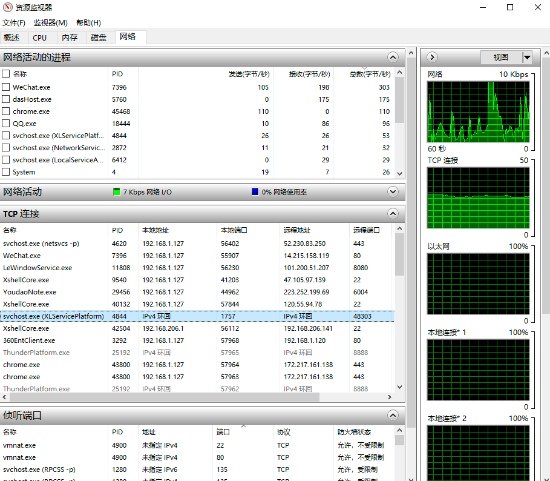

# 网络工具篇

## ifconfig

ifconfig 是我们查看当前系统的网卡和 ip 地址信息的最常用命令。如果你的机器上还没安装 ifconfig 命令，可以使用如下命令安装：

> yum install net-tools

安装成功以后，就可以使用 ifconfig 查看机器网卡信息了：

```shell
[root@localhost ~]# ifconfig
ens33: flags=4163<UP,BROADCAST,RUNNING,MULTICAST>  mtu 1500
        inet 192.168.206.140  netmask 255.255.255.0  broadcast 192.168.206.255
        inet6 fe80::1599:dcc4:b3e8:7fce  prefixlen 64  scopeid 0x20<link>
        ether 00:0c:29:ee:01:80  txqueuelen 1000  (Ethernet)
        RX packets 1005  bytes 77224 (75.4 KiB)
        RX errors 0  dropped 0  overruns 0  frame 0
        TX packets 349  bytes 47206 (46.0 KiB)
        TX errors 0  dropped 0 overruns 0  carrier 0  collisions 0

lo: flags=73<UP,LOOPBACK,RUNNING>  mtu 65536
        inet 127.0.0.1  netmask 255.0.0.0
        inet6 ::1  prefixlen 128  scopeid 0x10<host>
        loop  txqueuelen 1000  (Local Loopback)
        RX packets 4  bytes 352 (352.0 B)
        RX errors 0  dropped 0  overruns 0  frame 0
        TX packets 4  bytes 352 (352.0 B)
        TX errors 0  dropped 0 overruns 0  carrier 0  collisions 0
```

上述输出显示了本机当前激活的网卡列表，以及每个激活的网卡（网络设备）的 ipv4、ipv6 地址、子网掩码、广播地址等信息，这里一共两个网卡，分别是
ens33 和 lo。

可以使用 -s 选项显示网卡信息的精简列表：

```shell
[root@localhost ~]# ifconfig -s
Iface      MTU    RX-OK RX-ERR RX-DRP RX-OVR    TX-OK TX-ERR TX-DRP TX-OVR Flg
ens33            1500     1086      0      0 0           379      0      0      0 BMRU
lo              65536        4      0      0 0             4      0      0      0 LRU
```

默认情况下，ifconfig 命令只会显示激活的网卡信息，可以使用 -a 选项显示所有的（包括未激活）的网卡信息。

使用 ifconfig up 命令激活某个网卡，使用 ifconfig down 命令禁用某个网卡，这两个命令的用法如下：

```shell
ifconfig 网卡名 up
ifconfig 网卡名 down
```

演示一下这两个命令的用法：

```shell
[root@localhost ~]# ifconfig
ens33: flags=4163<UP,BROADCAST,RUNNING,MULTICAST>  mtu 1500
        inet 192.168.206.140  netmask 255.255.255.0  broadcast 192.168.206.255
        inet6 fe80::1599:dcc4:b3e8:7fce  prefixlen 64  scopeid 0x20<link>
        ether 00:0c:29:ee:01:80  txqueuelen 1000  (Ethernet)
        RX packets 1398  bytes 114269 (111.5 KiB)
        RX errors 0  dropped 0  overruns 0  frame 0
        TX packets 601  bytes 97657 (95.3 KiB)
        TX errors 0  dropped 0 overruns 0  carrier 0  collisions 0

lo: flags=73<UP,LOOPBACK,RUNNING>  mtu 65536
        inet 127.0.0.1  netmask 255.0.0.0
        inet6 ::1  prefixlen 128  scopeid 0x10<host>
        loop  txqueuelen 1000  (Local Loopback)
        RX packets 12  bytes 1056 (1.0 KiB)
        RX errors 0  dropped 0  overruns 0  frame 0
        TX packets 12  bytes 1056 (1.0 KiB)
        TX errors 0  dropped 0 overruns 0  carrier 0  collisions 0

## 禁用网卡 lo 后默认只能看到一个网卡信息
[root@localhost ~]# ifconfig lo down
[root@localhost ~]# ifconfig 
ens33: flags=4163<UP,BROADCAST,RUNNING,MULTICAST>  mtu 1500
        inet 192.168.206.140  netmask 255.255.255.0  broadcast 192.168.206.255
        inet6 fe80::1599:dcc4:b3e8:7fce  prefixlen 64  scopeid 0x20<link>
        ether 00:0c:29:ee:01:80  txqueuelen 1000  (Ethernet)
        RX packets 1510  bytes 123232 (120.3 KiB)
        RX errors 0  dropped 0  overruns 0  frame 0
        TX packets 657  bytes 104751 (102.2 KiB)
        TX errors 0  dropped 0 overruns 0  carrier 0  collisions 0

[root@localhost ~]# ifconfig -a
ens33: flags=4163<UP,BROADCAST,RUNNING,MULTICAST>  mtu 1500
        inet 192.168.206.140  netmask 255.255.255.0  broadcast 192.168.206.255
        inet6 fe80::1599:dcc4:b3e8:7fce  prefixlen 64  scopeid 0x20<link>
        ether 00:0c:29:ee:01:80  txqueuelen 1000  (Ethernet)
        RX packets 1543  bytes 125948 (122.9 KiB)
        RX errors 0  dropped 0  overruns 0  frame 0
        TX packets 675  bytes 107251 (104.7 KiB)
        TX errors 0  dropped 0 overruns 0  carrier 0  collisions 0

lo: flags=8<LOOPBACK>  mtu 65536
        inet 127.0.0.1  netmask 255.0.0.0
        loop  txqueuelen 1000  (Local Loopback)
        RX packets 12  bytes 1056 (1.0 KiB)
        RX errors 0  dropped 0  overruns 0  frame 0
        TX packets 12  bytes 1056 (1.0 KiB)
        TX errors 0  dropped 0 overruns 0  carrier 0  collisions 0
## 再次启用网卡 lo
[root@localhost ~]# ifconfig lo up
[root@localhost ~]# ifconfig 
ens33: flags=4163<UP,BROADCAST,RUNNING,MULTICAST>  mtu 1500
        inet 192.168.206.140  netmask 255.255.255.0  broadcast 192.168.206.255
        inet6 fe80::1599:dcc4:b3e8:7fce  prefixlen 64  scopeid 0x20<link>
        ether 00:0c:29:ee:01:80  txqueuelen 1000  (Ethernet)
        RX packets 1615  bytes 131924 (128.8 KiB)
        RX errors 0  dropped 0  overruns 0  frame 0
        TX packets 715  bytes 112423 (109.7 KiB)
        TX errors 0  dropped 0 overruns 0  carrier 0  collisions 0

lo: flags=73<UP,LOOPBACK,RUNNING>  mtu 65536
        inet 127.0.0.1  netmask 255.0.0.0
        inet6 ::1  prefixlen 128  scopeid 0x10<host>
        loop  txqueuelen 1000  (Local Loopback)
        RX packets 12  bytes 1056 (1.0 KiB)
        RX errors 0  dropped 0  overruns 0  frame 0
        TX packets 12  bytes 1056 (1.0 KiB)
        TX errors 0  dropped 0 overruns 0  carrier 0  collisions 0
```

ifconfig 还可以将一个 ip 地址绑定到某个网卡上，或将一个 ip 地址从某个网卡上解绑，使用如下命令：

```shell
# 将指定ip地址绑定到某个网卡
ifconfig 网卡名 add ip地址
# 从某个网卡解绑指定ip地址
ifconfig 网卡名 del ip地址
```

演示上述两个操作如下：

```shell
[root@localhost ~]# ifconfig 
ens33: flags=4163<UP,BROADCAST,RUNNING,MULTICAST>  mtu 1500
        inet 192.168.206.140  netmask 255.255.255.0  broadcast 192.168.206.255
        inet6 fe80::1599:dcc4:b3e8:7fce  prefixlen 64  scopeid 0x20<link>
        ether 00:0c:29:ee:01:80  txqueuelen 1000  (Ethernet)
        RX packets 1615  bytes 131924 (128.8 KiB)
        RX errors 0  dropped 0  overruns 0  frame 0
        TX packets 715  bytes 112423 (109.7 KiB)
        TX errors 0  dropped 0 overruns 0  carrier 0  collisions 0

lo: flags=73<UP,LOOPBACK,RUNNING>  mtu 65536
        inet 127.0.0.1  netmask 255.0.0.0
        inet6 ::1  prefixlen 128  scopeid 0x10<host>
        loop  txqueuelen 1000  (Local Loopback)
        RX packets 12  bytes 1056 (1.0 KiB)
        RX errors 0  dropped 0  overruns 0  frame 0
        TX packets 12  bytes 1056 (1.0 KiB)
        TX errors 0  dropped 0 overruns 0  carrier 0  collisions 0

[root@localhost ~]# ifconfig ens33 add 192.168.206.150
[root@localhost ~]# ifconfig
ens33: flags=4163<UP,BROADCAST,RUNNING,MULTICAST>  mtu 1500
        inet 192.168.206.140  netmask 255.255.255.0  broadcast 192.168.206.255
        inet6 fe80::1599:dcc4:b3e8:7fce  prefixlen 64  scopeid 0x20<link>
        ether 00:0c:29:ee:01:80  txqueuelen 1000  (Ethernet)
        RX packets 1804  bytes 145940 (142.5 KiB)
        RX errors 0  dropped 0  overruns 0  frame 0
        TX packets 781  bytes 119581 (116.7 KiB)
        TX errors 0  dropped 0 overruns 0  carrier 0  collisions 0

ens33:0: flags=4163<UP,BROADCAST,RUNNING,MULTICAST>  mtu 1500
        inet 192.168.206.150  netmask 255.255.255.0  broadcast 192.168.206.255
        ether 00:0c:29:ee:01:80  txqueuelen 1000  (Ethernet)

lo: flags=73<UP,LOOPBACK,RUNNING>  mtu 65536
        inet 127.0.0.1  netmask 255.0.0.0
        inet6 ::1  prefixlen 128  scopeid 0x10<host>
        loop  txqueuelen 1000  (Local Loopback)
        RX packets 12  bytes 1056 (1.0 KiB)
        RX errors 0  dropped 0  overruns 0  frame 0
        TX packets 12  bytes 1056 (1.0 KiB)
        TX errors 0  dropped 0 overruns 0  carrier 0  collisions 0
```

上述操作中，网卡 ens33 开始绑定了 ip 地址 192.168.206.140，使用 ifconfig add 命令绑定了一个新的 ip
：192.168.206.150，现在可以使用这个新的 ip 地址来访问原来的网络了。

同理，如果要解绑这个 ip 地址，可以按如下操作：

```shell
[root@localhost ~]# ifconfig ens33 del 192.168.206.150
[root@localhost ~]# ifconfig -a
ens33: flags=4163<UP,BROADCAST,RUNNING,MULTICAST>  mtu 1500
        inet 192.168.206.140  netmask 255.255.255.0  broadcast 192.168.206.255
        inet6 fe80::1599:dcc4:b3e8:7fce  prefixlen 64  scopeid 0x20<link>
        ether 00:0c:29:ee:01:80  txqueuelen 1000  (Ethernet)
        RX packets 2127  bytes 172321 (168.2 KiB)
        RX errors 0  dropped 0  overruns 0  frame 0
        TX packets 953  bytes 139954 (136.6 KiB)
        TX errors 0  dropped 0 overruns 0  carrier 0  collisions 0

lo: flags=73<UP,LOOPBACK,RUNNING>  mtu 65536
        inet 127.0.0.1  netmask 255.0.0.0
        inet6 ::1  prefixlen 128  scopeid 0x10<host>
        loop  txqueuelen 1000  (Local Loopback)
        RX packets 18  bytes 1560 (1.5 KiB)
        RX errors 0  dropped 0  overruns 0  frame 0
        TX packets 18  bytes 1560 (1.5 KiB)
        TX errors 0  dropped 0 overruns 0  carrier 0  collisions 0
```

> 在 Windows 上与 ifconfig 相对应的命令是 ipconfig，如在 Windows 上查看所有网卡信息可以使用 ipconfig /all。

## ping

ping 命令是我们最常用的命令之一，一般用于侦测本机到目标主机的网络是否通畅。其使用方法是：

> ping ip地址

使用方法如下：

```shell
[root@localhost ~]# ping 120.55.94.78
PING 120.55.94.78 (120.55.94.78) 56(84) bytes of data.
64 bytes from 120.55.94.78: icmp_seq=1 ttl=128 time=11.0 ms
64 bytes from 120.55.94.78: icmp_seq=2 ttl=128 time=17.3 ms
64 bytes from 120.55.94.78: icmp_seq=3 ttl=128 time=16.2 ms
64 bytes from 120.55.94.78: icmp_seq=4 ttl=128 time=10.6 ms
64 bytes from 120.55.94.78: icmp_seq=5 ttl=128 time=10.2 ms
64 bytes from 120.55.94.78: icmp_seq=6 ttl=128 time=18.7 ms
64 bytes from 120.55.94.78: icmp_seq=7 ttl=128 time=15.8 ms
64 bytes from 120.55.94.78: icmp_seq=8 ttl=128 time=10.8 ms
64 bytes from 120.55.94.78: icmp_seq=9 ttl=128 time=10.8 ms
64 bytes from 120.55.94.78: icmp_seq=10 ttl=128 time=11.5 ms
```

上面的输出为目标网络可达的情形。在 Linux 操作系统上，如果目标网络不可达，ping 命令会一直发送而无输出结果，直到按下 Ctrl + C
中断下来才会有统计结果，效果如下：

```shell
[root@localhost ~]# ping 120.55.94.79
PING 120.55.94.79 (120.55.94.79) 56(84) bytes of data.
^C
--- 120.55.94.79 ping statistics ---
578 packets transmitted, 0 received, 100% packet loss, time 577119ms
```

> Windows 系统上，这种情况下，ping 命令会返回超时的包数量，而不是一直阻塞。且在 Linux 系统上 ping 命令是一直发送数据包，直到人工主动中断；而
> Windows 机器上默认会发送 4 个数据包后停止，如果想一直发送而不停止，可以使用 -t 选项。

当然，ping 命令的目标也可以是一个域名，这样通过 ping 这个域名，我们可以得到这个域名解析后的 ip 地址：

```shell
[root@localhost ~]# ping www.baidu.com
PING www.a.shifen.com (61.135.169.121) 56(84) bytes of data.
64 bytes from 61.135.169.121 (61.135.169.121): icmp_seq=1 ttl=128 time=30.3 ms
64 bytes from 61.135.169.121 (61.135.169.121): icmp_seq=2 ttl=128 time=28.8 ms
64 bytes from 61.135.169.121 (61.135.169.121): icmp_seq=3 ttl=128 time=29.0 ms
64 bytes from 61.135.169.121 (61.135.169.121): icmp_seq=4 ttl=128 time=31.9 ms
64 bytes from 61.135.169.121 (61.135.169.121): icmp_seq=5 ttl=128 time=28.8 ms
64 bytes from 61.135.169.121 (61.135.169.121): icmp_seq=6 ttl=128 time=27.8 ms
64 bytes from 61.135.169.121 (61.135.169.121): icmp_seq=7 ttl=128 time=29.0 ms
^C
--- www.a.shifen.com ping statistics ---
7 packets transmitted, 7 received, 0% packet loss, time 6011ms
rtt min/avg/max/mdev = 27.822/29.430/31.968/1.244 ms
```

这里得到 www.baidu.com 对应的 ip 地址是 61.135.169.121。

> ping 命令是通过发送 ICMP 数据包来实现的。

ICMP（Internet Control Message Protocol）是因特网控制消息协议，是互联网协议族的一个组成部分。它用于在 IP
网络上发送控制消息，主要用于网络故障排除和错误报告。ICMP 是在网络层（OSI 模型中的第三层）操作的。

以下是 ICMP 的一些常见用途：

1. 网络故障排除： ICMP 提供了用于检测网络连接和诊断网络问题的工具。例如，通过 ICMP Echo 请求和回应（常见的 Ping 工具使用了
   ICMP Echo 请求和回应），可以测试主机之间的可达性。

2. 差错报告： 当 IP 数据包在传输过程中遇到问题时，网络设备可以使用 ICMP 报告错误。例如，当一个数据包无法传递到目标主机时，中间路由器可能会发送
   ICMP 差错报文通知源主机。

3. 跟踪路由（Traceroute）： ICMP 的一种类型被用于跟踪数据包从源到目的地的路径。通过在数据包的 TTL（Time To
   Live）字段上逐渐减小数值，可以收到每个中间路由器的 ICMP 时间超时报文，从而追踪整个路径。

4. 重定向消息： ICMP 可以用于通知主机将其数据流量发送到更优选的路由器。

ICMP 主要包括不同类型的消息，每种消息用于不同的目的。一些常见的 ICMP 消息类型包括：

- Echo Request / Echo Reply： 用于 Ping 测试。

- Destination Unreachable： 当一个主机无法访问目标主机时发送。

- Time Exceeded： 当数据包在传输过程中超过一定的时间限制时发送，用于跟踪路由。

- Redirect： 用于通知主机发送数据包到更优选的路由器。

> 请注意，由于 ICMP 可能被滥用用于进行攻击，一些网络环境中可能会对 ICMP 消息进行过滤。

## telnet

telnet 命令是我们最常用的网络调试命令之一。如果你的机器上还没有安装 telnet 命令，可以使用如下命令安装一下：

> yum install telnet

如果一个服务程序对外开启了侦听服务，我们都可以使用 telnet ip port 来连接上去，例如：

```shell
[root@localhost ~]# telnet 120.55.94.78 8888
Trying 120.55.94.78...
Connected to 120.55.94.78.
Escape character is '^]'.
```

> 如果不指定端口号，telnet 会使用默认 23 号端口。

反过来说，可以通过 telnet 命令去检测指定 ip 地址和端口号的侦听服务是否存在。知道这点很重要，我们可以利用这个去检测一个服务是否可以正常连接。举个例子，比如某次从某处得到一个代码下载地址，这是一个
svn 地址：svn://120.55.94.78/mycode/mybook。为了检测这个 svn 服务是否还能正常对外服务，我们可以先用 ping 命令去检测一下到达这个
ip：120.55.94.78 的网络是否畅通：

```shell
[root@localhost ~]# ping 120.55.94.78
PING 120.55.94.78 (120.55.94.78) 56(84) bytes of data.
64 bytes from 120.55.94.78: icmp_seq=1 ttl=128 time=15.3 ms
64 bytes from 120.55.94.78: icmp_seq=2 ttl=128 time=14.3 ms
64 bytes from 120.55.94.78: icmp_seq=3 ttl=128 time=16.4 ms
64 bytes from 120.55.94.78: icmp_seq=4 ttl=128 time=16.1 ms
64 bytes from 120.55.94.78: icmp_seq=5 ttl=128 time=15.5 ms
^C
--- 120.55.94.78 ping statistics ---
5 packets transmitted, 5 received, 0% packet loss, time 4007ms
rtt min/avg/max/mdev = 14.343/15.568/16.443/0.723 ms
```

如果网络畅通，我们再用 telnet 去连接上去，由于 svn 服务器使用的默认端口是 3690，我们执行如下命令：

```shell
[root@localhost ~]# telnet 120.55.94.78 3690
Trying 120.55.94.78...
Connected to 120.55.94.78.
Escape character is '^]'.
( success ( 2 2 ( ) ( edit-pipeline svndiff1 absent-entries commit-revprops depth log-revprops atomic-revprops partial-replay ) ) ) 
```

如上所示，证明这个 svn 服务是正常开启对外服务的。反之，如果 telnet 命令连不上，说明这个服务不能被外部网络正常连接，我们就没必要去做进一步的尝试了。

同样的道理，对于一个 Web 服务，如 baidu.com，由于我们平常都可以通过 www.baidu.com 去访问百度的页面，Web 服务器默认的端口号是
80，我们使用 telnet www.baidu.com 80 应该也可以连接成功的：

```shell
[root@localhost ~]# telnet www.baidu.com 80
Trying 115.239.211.112...
Connected to www.baidu.com.
Escape character is '^]'.
hello
HTTP/1.1 400 Bad Request

Connection closed by foreign host.
```

我们使用 telnet 命令连接上以后，我们随意发送了一个 hello 消息，由于是非法的 http 请求，被服务器关闭了连接。

telnet 命令不仅可以连接某个服务器，还能与服务器进行交互，这通常用于操作一些接受纯文本数据的服务器程序，如 FTP
服务、邮件服务等等。为了演示如何利用 telnet 命令收发数据，我们这里利用 telnet 命令来模拟给某个邮箱发送一封邮件，发送邮件我们通常使用的是
SMTP 协议，该协议默认使用的端口为 25。

假设我们的发件地址是：abc@163.com，收件地址是：abc@qq.com。

其中发件地址是一个 163 邮箱，如果你没有的话可以去申请一个，申请后进入邮箱，在设置页面获得网易邮箱的 smtp 服务的服务器地址：


我们得到的地址 smptp 地址是 smtp.163.com，端口号是 25。

同时，需要开启客户端授权，设置一个客户端授权码：


这里将授权码设置为 xkshjee。

>
早些年很多邮件服务器允许在其他客户端登陆只需要输入正确的邮件服务器地址、用户名和密码就可以了，后来出于安全考虑，很多邮箱采用了授权码机制，在其他第三方客户端登陆该邮箱时需要输入授权码（不是密码），且需要用户主动打开允许第三方客户端登陆的配置选项。

配置完成以后，现在就可以利用 telnet 命令连接 163 邮件服务器并发送邮件了，由于在登陆的过程中需要验证用户名和授权码，而且用户名和授权码必须使用
base64 编码之后的，我们先将用户名和授权码的 base64 码准备好，用的时候直接拷贝过去：

| 原文      | base64 码     |   
|---------|--------------|
| abc     | YWJj         |   
| xkshjee | eGtzaGplZQ== |   

```shell
base 64 编码：
base64 < input_file > output_file
echo -n "Hello, World!" | base64

base 64 解码：
base64 -d < input_file > output_file
echo "SGVsbG8sIFdvcmxkIQ==" | base64 -d
```

如果你不知道 base64 编码的原理，可以从网上搜索找一个 base64 编解码工具，例如：https://base64.supfree.net/。

在整个演示过程一共需要使用如下 SMTP 协议命令：

| 命令         | 含义               |
|------------|------------------|
| helo       | 向 smtp 服务器发送问候信息 |
| auth login | 请求登陆验证           |
| data       | 请求输入邮件正文         |


SMTP 协议 是文本协议，每一个数据包以 \r\n 结束（Windows 系统下默认换行符）。

来看一下演示过程：
```shell
[root@localhost ~]# telnet smtp.163.com 25
Trying 220.181.12.14...
Connected to smtp.163.com.
Escape character is '^]'.
220 163.com Anti-spam GT for Coremail System (163com[20141201])
helo 163.com
250 OK
auth login
334 dXNlcm5hbWU6
YWJj
334 UGFzc3dvcmQ6
eGtzaGplZQ==
235 Authentication successful
mail from: <abc@163.com>
250 Mail OK
rcpt to:  <abc@qq.com>
250 Mail OK
data
354 End data with <CR><LF>.<CR><LF>
from:abc@163.com
to: abc@qq.com
subject: Test

Hello, this is a message from 163.

.
250 Mail OK queued as smtp10,DsCowADHAgQS1IBcwtExJA--.62308S2 1551946998
Connection closed by foreign host.
[root@localhost ~]# 
```

来分析一下上述操作过程：

1. 使用 telnet smtp.163.com 25 连接 163 邮件服务器；连接成功以后，服务器给我们发送了一条欢迎消息：
> 220 163.com Anti-spam GT for Coremail System (163com[20141201])\r\n

2. 接着，必须向服务器发送一条问候消息，使用 helo 163.com，当然 163.com 这个是问候内容，可以随意填写，然后回车，最终组成的数据包内容是：
> helo 163.com\r\n

3. 接着服务器会回复一条状态码是 250 的消息，这里是：
> 250 OK\r\n

4. 再输入命令 auth login 请求验证，然后按回车，实际发送给服务器的是：
> auth login\r\n

5. 服务器应答状态码 334：
> 334 dXNlcm5hbWU6\r\n

dXNlcm5hbWU6 是字符串 **username: ** 的 base64 码。

6. 输入用户名 abc 的 base64 码，然后按回车：
> YWJj\r\n

7. 服务器应答状态码 334：
> 334 UGFzc3dvcmQ6\r\n

UGFzc3dvcmQ6 是字符串 Password: 的 base64 码。这里实际上要求输入的是上文介绍的授权码，而不是密码。

8. 输入 eGtzaGplZQ==，并回车：
> eGtzaGplZQ==\r\n

服务器提示我们授权成功（应答状态码 235）：
> 235 Authentication successful\r\n

9. 接着输入邮件的发件地址和收件地址，服务器也会给我们响应的应答（应答状态码 250）：
```shell
mail from: <testformybook@163.com>\r\n
250 Mail OK\r\n
rcpt to:  <balloonwj@qq.com>\r\n
250 Mail OK\r\n
```

接着输入 data 命令设置邮件的主题、正文、对方收到邮件后显示的的发件人信息等：
```shell
data\r\n
354 End data with <CR><LF>.<CR><LF>
```

服务器应答 354，并且提示，如果确定结束输入邮件正文就先按一个回车键，再输入一个点 .，再接着回车，这样邮件就发送出去了。

11. 服务器应答 250：
> 250 Mail OK queued as smtp10,DsCowADHAgQS1IBcwtExJA--.62308S2 1551946998

12. 如果想退出，输入 quit 或 close 都可以。

最终，这封邮件就发出去了，去 abc@qq.com 这个邮箱查看一下.

> 如果在实际实验时，对端没有收到邮件，请查看下你的垃圾箱或者邮箱反垃圾邮件设置，有可能被邮箱反垃圾邮件机制给拦截了。

上述在组装 SMTP 协议包时涉及到很多状态码，常见的 SMTP 状态码含义如下：
```text
211 帮助返回系统状态
214 帮助信息
220 服务准备就绪
221 关闭连接
235 用户验证成功
250 请求操作就绪
251 用户不在本地，转寄到其他路径
334 等待用户输入验证信息
354 开始邮件输入
421 服务不可用
450 操作未执行，邮箱忙
451 操作中止，本地错误
452 操作未执行，存储空间不足
500 命令不可识别或语言错误
501 参数语法错误
502 命令不支持（未实现）
503 命令顺序错误
504 命令参数不支持
550 操作未执行，邮箱不可用
551 非本地用户
552 中止存储空间不足
553 操作未执行，邮箱名不正确
554 传输失败
```

> 如果使用的开发机器是 Windows ，默认情况下，Windows 系统的 telnet 命令是没有开启的，可以在【控制面板】- 【程序】- 【程序和功能】- 【打开或关闭Windows功能】中打开telnet功能。

## netstat
Windows 和 Linux 操作系统均提供了 netstat 命令，经常使用这个命令查看网络连接状态。这里以 Linux 系统为例，netstat 命令常见选项如下所示：

```text
-a (all)显示所有选项，netstat 默认不显示 LISTEN 相关。
-t (tcp)仅显示 tcp 相关选项
-u (udp)仅显示 udp 相关选项
-n 不显示别名，能显示数字的全部转化成数字
-l 仅列出有在 Listen (监听) 的服務状态
-p 显示建立相关链接的程序名
-r 显示路由信息，路由表
-e 显示扩展信息，例如uid等
-s 按各个协议进行统计 (重要)
-c 每隔一个固定时间，执行该 netstat 命令。
```

来详细介绍一下 -n 选项，默认情况下，对于一些有别名的 ip 地址和端口号 netstat 会以其别名来显示，例如 127.0.0.1 会显示成 localhost，80 端口会显示成 http。如下所示：
```shell
[root@iZ238vnojlyZ ~]# netstat -at
Active Internet connections (servers and established)
Proto Recv-Q Send-Q Local Address           Foreign Address         State      
tcp        0      0 0.0.0.0:svn             0.0.0.0:*               LISTEN     
tcp        0      0 0.0.0.0:http            0.0.0.0:*               LISTEN     
tcp        0      0 0.0.0.0:ssh             0.0.0.0:*               LISTEN     
tcp        0      0 0.0.0.0:ddi-tcp-1       0.0.0.0:*               LISTEN     
tcp        0      0 0.0.0.0:italk           0.0.0.0:*               LISTEN     
tcp        0      0 0.0.0.0:dnp             0.0.0.0:*               LISTEN     
tcp        0      0 localhost:32000         0.0.0.0:*               LISTEN     
tcp        0      0 0.0.0.0:commtact-http   0.0.0.0:*               LISTEN     
tcp        0    404 iZ238vnojlyZ:ssh        101.224.250.233:57844   ESTABLISHED
tcp        0      0 iZ238vnojlyZ:59520      100.100.45.131:http     ESTABLISHED
tcp        0      0 localhost:32000         localhost:31000         ESTABLISHED
tcp6       0      0 [::]:mysql              [::]:*                  LISTEN     
tcp6       0      0 [::]:ftp                [::]:*                  LISTEN     
tcp6       0      0 localhost:31000         localhost:32000         ESTABLISHED
```

加上 -n 选项看一下效果：
```shell
[root@iZ238vnojlyZ ~]# netstat -atn
Active Internet connections (servers and established)
Proto Recv-Q Send-Q Local Address           Foreign Address         State      
tcp        0      0 0.0.0.0:3690            0.0.0.0:*               LISTEN     
tcp        0      0 0.0.0.0:80              0.0.0.0:*               LISTEN     
tcp        0      0 0.0.0.0:22              0.0.0.0:*               LISTEN     
tcp        0      0 0.0.0.0:8888            0.0.0.0:*               LISTEN     
tcp        0      0 0.0.0.0:12345           0.0.0.0:*               LISTEN     
tcp        0      0 0.0.0.0:20000           0.0.0.0:*               LISTEN     
tcp        0      0 127.0.0.1:32000         0.0.0.0:*               LISTEN     
tcp        0      0 0.0.0.0:20002           0.0.0.0:*               LISTEN     
tcp        0    404 120.55.94.78:22         101.224.250.233:57844   ESTABLISHED
tcp        0      0 10.117.203.175:59520    100.100.45.131:80       ESTABLISHED
tcp       15      0 127.0.0.1:32000         127.0.0.1:31000         ESTABLISHED
tcp6       0      0 :::3306                 :::*                    LISTEN     
tcp6       0      0 :::21                   :::*                    LISTEN     
tcp6       0      0 127.0.0.1:31000         127.0.0.1:32000         ESTABLISHED
```

如上所示，所有的 ip 地址和端口号就不再以别名形式显示了。

> 在 Windows 系统上，除了可以使用 netstat 查看网络状态信息以外，还可以通过任务管理器打开资源监视器来查看当前系统各种网络连接状态（以下是 Win10 的截图）：



## lsof
lsof 命令是 Linux 系统的扩展工具，它的含义是 list opened filedesciptor （列出已经打开的文件描述符），在 Linux 系统中，所有的与资源句柄相关的东西都可以统一抽象成文件描述符（filedescriptor，简称 fd）。一个文件句柄是一个 fd，一个 socket 对象也可以称之为 fd 等等。

## lsof 命令的基本用法
默认情况下，系统是不存在这个命令的，你需要安装一下，使用如下命令安装：

> yum install lsof

来看一下这个命令的使用效果：
```shell
COMMAND     PID   TID    USER   FD      TYPE             DEVICE  SIZE/OFF       NODE NAME
systemd       1          root  cwd       DIR              202,1      4096          2 /
nscd        453   469    nscd    8u  netlink                          0t0      11017 ROUTE
nscd        453   470    nscd  cwd       DIR              202,1      4096          2 /
nscd        453   470    nscd  rtd       DIR              202,1      4096          2 /
nscd        453   470    nscd  txt       REG              202,1    180272     146455 /usr/sbin/nscd
nscd        453   470    nscd  mem       REG              202,1    217032     401548 /var/db/nscd/hosts
nscd        453   470    nscd  mem       REG              202,1     90664     132818 /usr/lib64/libz.so.1.2.7
nscd        453   470    nscd  mem       REG              202,1     68192     133155 /usr/lib64/libbz2.so.1.0.6
nscd        453   470    nscd  mem       REG              202,1    153192     133002 /usr/lib64/liblzma.so.5.0.99
nscd        453   470    nscd  mem       REG              202,1     91496     133088 
nscd        453   471    nscd    5u  a_inode                0,9         0       4796 [eventpoll]
nscd        453   471    nscd    6r      REG              202,1    217032     401548 /var/db/nscd/hosts
nscd        453   471    nscd    7u     unix 0xffff880037497440       0t0      11015 /var/run/nscd/socket
nscd        453   471    nscd    8u  netlink                          0t0      11017 ROUTE
imgserver   611       localhost  cwd       DIR              202,1      4096    1059054 /home/localhost/flamingoserver
imgserver   611       localhost  rtd       DIR              202,1      4096          2 /
imgserver   611       localhost  txt       REG              202,1   4788917    1057044 /home/localhost/flamingoserver/imgserver
imgserver   611       localhost   24u  a_inode                0,9         0       4796 [eventfd]
imgserver   611       localhost   25u     IPv4           55707643       0t0        TCP *:commtact-http (LISTEN)
imgserver   611       localhost   26r      CHR                1,3       0t0       4800 /dev/null
imgserver   611   613 localhost   32w      REG              202,1    131072    2754609 /home/localhost/flamingoserver/imgcache/258bfb8945288a117d98d440986d7a03
```
结果显示中列出了各个进程打开的各种 fd 类型，对于 Uinx Socket，lsof 命令会显示出其详细的路径，打开的文件 fd 亦是如此。

使用 lsof 命令有三点需要注意：
- 默认情况下，lsof 的输出比较多，我们可以使用 grep 命令过滤我们想要查看的进程打开的 fd 信息，如：

> lsof -i | grep myapp

或者使用 lsof -p pid 也能过滤出指定的进程打开的 fd 信息：
```shell
[root@iZ238vnojlyZ ~]# lsof -p 26621
COMMAND     PID    USER   FD      TYPE   DEVICE SIZE/OFF    NODE NAME
chatserve 26621 localhost  cwd       DIR    202,1     4096 1059054 /home/localhost/flamingoserver
chatserve 26621 localhost  rtd       DIR    202,1     4096       2 /
chatserve 26621 localhost  txt       REG    202,1  8027035 1051942 /home/localhost/flamingoserver/chatserver
chatserve 26621 localhost  mem       REG    202,1    61928  141417 /usr/lib64/libnss_files-2.17.so
chatserve 26621 localhost  mem       REG    202,1    44096  143235 /usr/lib64/librt-2.17.so
chatserve 26621 localhost  mem       REG    202,1    19520  137064 /usr/lib64/libdl-2.17.so
chatserve 26621 localhost  mem       REG    202,1  2112384  132824 /usr/lib64/libc-2.17.so
chatserve 26621 localhost  mem       REG    202,1   142304  132850 /usr/lib64/libpthread-2.17.so
chatserve 26621 localhost  mem       REG    202,1    88720  135291 /usr/lib64/libgcc_s-4.8.5-20150702.so.1
chatserve 26621 localhost  mem       REG    202,1  1141560  137077 /usr/lib64/libm-2.17.so
chatserve 26621 localhost  mem       REG    202,1   999944  140059 /usr/lib64/libstdc++.so.6.0.19
chatserve 26621 localhost  mem       REG    202,1  9879756  269001 /usr/lib64/mysql/libmysqlclient.so.20.3.4
chatserve 26621 localhost  mem       REG    202,1   164440  133622 /usr/lib64/ld-2.17.so
chatserve 26621 localhost    0u      CHR      1,3      0t0    4800 /dev/null
chatserve 26621 localhost    1u      CHR      1,3      0t0    4800 /dev/null
chatserve 26621 localhost    2u      CHR      1,3      0t0    4800 /dev/null
chatserve 26621 localhost    3u  a_inode      0,9        0    4796 [eventpoll]
chatserve 26621 localhost    4u  a_inode      0,9        0    4796 [timerfd]
chatserve 26621 localhost    5u  a_inode      0,9        0    4796 [eventfd]
chatserve 26621 localhost    7u  a_inode      0,9        0    4796 [eventpoll]
```

- lsof 命令只能查看到当前用户有权限查看到的进程 fd 信息，对于其没有权限的进程，最右边一列会显示 “Permission denied”。如下所示：
```shell
sshd      26759          root  cwd   unknown                              /proc/26759/cwd (readlink: Permission denied)
sshd      26759          root  rtd   unknown                              /proc/26759/root (readlink: Permission denied)
sshd      26759          root  txt   unknown                              /proc/26759/exe (readlink: Permission denied)
sshd      26759          root NOFD                                        /proc/26759/fd (opendir: Permission denied)
bash      26761          root  cwd   unknown                              /proc/26761/cwd (readlink: Permission denied)
bash      26761          root  rtd   unknown                              /proc/26761/root (readlink: Permission denied)
bash      26761          root  txt   unknown                              /proc/26761/exe (readlink: Permission denied)
bash      26761          root NOFD                                        /proc/26761/fd (opendir: Permission denied)
```

- lsof 命令第一栏进程名在显示的时候，默认显示前 n 个字符，这样如果我们需要显示完整的进程名以方便过滤的话，可以使用 +c 选项。用法如下：
```shell
#最左侧的程序名最大显示 15 个字符
[localhost@iZ238vnojlyZ ~]$ lsof +c 15
```

> 当然，如果你设置值太大， lsof 便不会采用你设置的最大值，而是使用默认最大值。

上文也介绍了，socket 也是一种 fd，如果需要仅显示系统的网络连接信息，使用的是 -i 选项即可，这个选项可以形象地显示出系统当前的出入连接情况：


看到图中的连接方向了吧？

当然，和 netstat 命令一样，lsof -i 默认也会显示 ip 地址和端口号的别名，我们只要使用 -n 和 -P 选项就能相对应地显示 ip 地址和端口号了，综合起来就是 lsof -Pni：


## 使用 lsof 命令恢复被删除的文件
这里再介绍一个利用 lsof 命令恢复被删除的文件的小技巧。下面来演示一下，为了避免出现意外造成损失，建议在实验之前备份要删除的文件。

某时某刻，某个日志文件 fileserver.20190814145718.12975.log 被一个叫 fileserver 的程序正使用着。可以使用 lsof 命令验证：

> [localhost@iZ238vnojlyZ logs]$ lsof | grep fileserve


上图的输出证明 fileserver.20190814145718.12975.log 确实被进程 fileserver 使用，进程 ID 是 12976。

将该日志文件删除：
> [localhost@iZ238vnojlyZ logs]$ rm -rf fileserver.20190814145718.12975.log

然后再次使用 lsof 查看一下进程 fileserver 使用该文件的状态信息：


此时该进程中该文件已经被标记为 deleted 状态了。

进入目录 /proc/pid/fd/ 并使用 ll （ls -l 的别名）命令查看文件状态，这里的 pid 要换成相应进程的 ID，这里就是 12976：
```shell
[localhost@iZ238vnojlyZ 12976]$ cd /proc/12976/fd/
[localhost@iZ238vnojlyZ fd]$ ll
```

此时到了被删除的文件：


标号 6 正好对应我们删除的文件，使用这个标号进行恢复：
```shell
[localhost@iZ238vnojlyZ fd]$ cat 6 > /home/localhost/flamingoserver/logs/fileserver.20190814145718.12975.log
```

这样文件就被恢复到 /home/localhost/flamingoserver/logs/ 目录处了。

使用 lsof 命令恢复的文件需要注意两点：

- 如果想成功恢复文件，使用文件的进程必须处于存活状态，这里如果 fileserver 已经退出或被杀死，那就无法用这种方式恢复。

- 用这种方式恢复的文件，再次用 lsof 命令查看时这个文件的状态仍然是 deleted 状态，也就是说虽然能够手工恢复，但是进程不会再使用这个文件了。对于这里的日志文件，fileserver 继续运行也不会再往这个文件中写入日志了。所以这里恢复文件一般只是用于某些特殊情况下删除一些重要数据文件的应急恢复。

## nc
nc 即 netcat 命令，这个工具在排查网络故障时非常有用，功能非常强大，因而被业绩称为网络界的“瑞士军刀”，请读者务必掌握。默认系统是没有这个命令的，你需要安装一下，安装方法：

```shell
yum install nc
```

nc 命令常见的用法是模拟一个服务器程序被其他客户端连接，或者模拟一个客户端连接其他服务器，连接之后就可以进行数据收发。By default, nc(1) uses the TCP protocol. However, if you execute nc(1) with the -u flag, then nc(1) will use the UDP protocol.来逐一介绍一下：

- **模拟一个服务器程序**
使用 -l 选项（单词 listen 的首字母）在某个 ip 地址和端口号上开启一个侦听服务，以便让其他客户端连接。通常为了显示更详细的信息，会带上 -v 选项。

示例如下：
```shell
[root@iZ238vnojlyZ ~]# nc -v -l 127.0.0.1 6000
Ncat: Version 6.40 ( http://nmap.org/ncat )
Ncat: Listening on 127.0.0.1:6000
```

上述命令启动了一个侦听服务器，侦听 ip 地址为 127.0.0.1，侦听端口为 6000 ；如果你的机器可以被外网访问，你可以使用 0.0.0.0 这样的侦听地址（当然也可以使用其他公网 ip 作为侦听地址），示例：
```shell
[root@iZ238vnojlyZ ~]# nc -v -l 0.0.0.0 6000
Ncat: Version 6.40 ( http://nmap.org/ncat )
Ncat: Listening on 0.0.0.0:6000
```

- **模拟一个客户端程序**
用 nc 命令模拟一个客户端程序时，我们不需要使用 -l 选项，直接写上 ip 地址（或域名，nc 命令可以自动解析域名）和端口号即可，示例如下：
```shell
## 连接百度 web 服务器
[root@iZ238vnojlyZ ~]# nc -v www.baidu.com 80
Ncat: Version 6.40 ( http://nmap.org/ncat )
Ncat: Connected to 115.239.211.112:80.
```
输出提示成功连接上百度 Web 服务器。

我们知道客户端连接服务器一般都是操作系统随机分配一个可用的端口号连接到服务器上去，使用 nc 命令作为客户端时可以使用 -p 选项指定使用哪个端口号连接服务器，例如，我们希望通过本地 5555 端口连接百度的 Web 服务器，可以这么输入：
```shell
[root@iZ238vnojlyZ ~]# nc -v -p 5555 www.baidu.com 80
Ncat: Version 6.40 ( http://nmap.org/ncat )
Ncat: Connected to 115.239.211.112:80.
```

再开一个 shell 窗口，我们使用上文中介绍的 lsof 命令验证一下，是否确实通过 5555 端口连接上了百度 Web 服务器。
```shell
[root@iZ238vnojlyZ ~]# lsof -Pni | grep nc
nc        32610    root    3u  IPv4 113369437      0t0  TCP 120.55.94.78:5555->115.239.211.112:80 (ESTABLISHED)
```

结果确实如我们所期望的。

当然，当使用 nc 命令与对端建立连接后，我们可以发送消息。下面通过一个具体的例子来演示一下这个过程

- 使用 nc -v -l 0.0.0.0 6000 模拟一个侦听服务，再新建一个 shell 窗口利用 nc -v 127.0.0.1 6000 模拟一个客户端程序连接刚才的服务器。

- 此时在客户端和服务器就可以相互发消息了。可以达到一个简化版的 IM 软件聊天效果：

> 如果在使用 nc 命令发消息时不小心输入错误，可以使用 Ctrl + Backspace 键删除。

nc 命令默认会将 \n 作为每条消息的结束标志，如果你指定了 -C 选项，将会使用 \r\n 作为消息结束标志。

nc 命令不仅可以发消息，也能发文件。我们也来演示一下：

需要注意的是是接收文件的一方是服务器端，发送文件的一方是客户端。

1. 服务器端命令：

> nc -l ip地址 端口号 > 接收的文件名

2. 客户端命令：

> nc ip地址 端口号 < 发送的文件名

```shell
## 接收文件
[root@iZ238vnojlyZ ~]# nc -l 0.0.0.0 6000 > /home/localhost/xxx.html

## 传输文件
[root@iZ238vnojlyZ ~]# nc 127.0.0.1 6000 < /home/localhost/index.html
```

> 注意：这里客户端发送一个文件叫 index.html，服务器端以文件名 xxx.html 来保存，也就是说服务器端保存接收的文件名时不一定要使用客户端发送的文件名。

根据上面的介绍，当我们需要调试我们自己的服务器或者客户端程序时，又不想自己开发相应的对端，我们就可以使用 nc 命令去模拟。

当然，nc 命令非常强大，其功能远非本节介绍的这些，如果有兴趣可以去 nc 的 man 手册上获取更多的信息。


