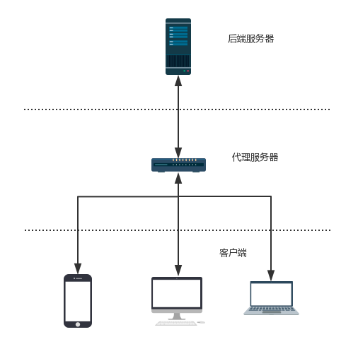

# 网络程序

## 如何设计断线自动重连机制

### 断线自动重连应用场景和逻辑设计
在有连接依赖关系的服务与服务之间，或客户端与服务器之间，无论是出于方便使用、降低运维成本、提高通信效率（服务与服务之间），还是优化用户体验（客户端与服务器之间）自动重连功能通常是一个非常重要的功能。

自动重连功能一般用于如下场景：

- 情景一

对于一组服务之间，如果其中一些服务（主动连接方，下文以 A 代称）需要与另外一些服务（被连接方，下文以 B 代称）建立 TCP 长连接，如果 A 没有自动连接 B 的功能，那么在部署或者测试这些服务的时候，必须先启动 B，再启动 A，因为一旦先启动 A，A 此时去尝试连接 B（由于 B 还没有启动）会失败，之后 A 再也不会去连接 B了（即使随后 B 被启动了），从而导致整个系统不能正常工作。

- 情景二

即使部署或测试的时候，先启动了 B，再启动 A，A 与 B 之间的连接在运行期间内，可能由于网络波动等原因导致 A 与 B 之间连接断开，之后整个系统也不能再正常工作了。

- 情景三

如果我们想升级 B，更新完程序后，重启 B，也必须重启 A。如果这种依赖链比较长（例如 A 连接 B，B 连接 C，C 连接 D，D 连接 E，等等），那么更新某个程序的效率会变得很低，更新成本非常高。

- 情景四

对于客户端软件来说，如果因为用户的网络短暂故障导致客户端与服务器失去连接，等网络恢复后，较好的用户体验是客户端能检测到用户网络变化后，自动与服务器重连，以便用户能及时收到最新的消息。

以上四个情景说明了断线自动重连功能的重要性，那如何去设计好的断线重连机制呢？

重连本身的功能开发很简单，其实就是调用 socket 函数 connect 函数，不断去“重试”。这里的“重试”我使用了双引号，是为了说明重试的技巧非常有讲究：

- 对于服务器端程序，例如 A 连接 B，如果连接不上，整个系统将无法工作，那么我们开发 A 服务时，重连的逻辑可以很简单，即 A 一旦发现与 B 断开了连接，就立即尝试与 B 重新连接，如果连接不上，隔一段时间再重试（一般设置为 3 秒或 5 秒即可），一直到连接成功为止。当然，期间可以发送报警邮件或者输出错误日志，让开发或者运维人员尽快干预，以便尽快解决问题。

- 对于客户端软件，以上做法也是可以的，但是不是最优的。客户端所处的网络环境比服务器程序所处的网络环境一般要恶劣的多，等间隔的定时去重连，一般作用不大（例如用户拔掉了网线）。因此，对于客户端软件，当出现断线会尝试去重连，如果连接不上，会隔一个比前一次时间更长的时间间隔去重连，例如这个时间间隔可以是 2 秒、4 秒、8 秒、16秒等等。但是，这样也存在一个问题，随着重连次数的变多，重连的时间间隔会越来越大（当然，你也可以设置一个最大重连时间间隔，之后恢复到之前较小的时间间隔）。如果网络此时已经恢复（例如用户重新插上网线），我们的程序需要等待一个很长的时间间隔（如 16 秒）才能恢复连接，这同样用户体验不好。解决办法是，如果网络发生波动，我们的程序应该检测网络状态，如果网络状态恢复正常此时应该立即进行一次重连，而不是一成不变地按照设置的时间间隔去重连。

> 操作系统提供了检测网络状态变化的 API 函数，例如对于 Windows 可以使用 IsNetworkAlive() 函数去检测，对于 Android，网络变化时会发送消息类型是 WifiManager.NETWORK_STATE_CHANGED_ACTION 的广播通知。

另外，还需要注意的是，如果客户端网络断开，应该在界面某个地方显式地告诉用户当前连接状态，并告诉用户当前正在进行断线重连，且应该有一个可以让用户放弃断线重连或者立即进行一次断线重连的功能。

综上所述，归纳一下：对于服务器程序之间的重连可以设计成等时间间隔的定时重连，对于客户端程序要结合依次放大重连时间间隔、网络状态变化立即重连或用户主动发起重连这三个因素来设计。

### 不需要重连的情形
不需要重连一般有以下情形：

- 用户使用客户端主动放弃重连；

- 因为一些业务上的规定，禁止客户端重连；

举个例子，如果某个系统同一时刻同一个账户只允许登录一个，某个账户在机器 A 上登录，此时接着又在机器 B 上登录，此时 A 将被服务器踢下线，那么此时 A 客户端的逻辑就应该禁止自动重连。

### 技术上的断线重连和业务上的断线重连
这里说的技术上的重连，指的是调用 connect 函数连接，在实际开发中，大多数系统光有技术上的重连成功（即 connect 连接成功）是没有任何意义的，网络连接成功以后，接下来还得再次向服务器发送账号验证信息等等（如登录数据包），只有这些数据验签成功后，才能算是真正的重连成功，这里说的发送账号验证信息并验签成功就是业务上的重连成功。复杂的系统可能会需要连续好几道验签流程。因此，我们在设计断线重连机制的时候，不仅要考虑技术上的重连，还要考虑业务上的重连。只有完整地包含这两个流程，才算是完备的断线自动重连功能。

## 保活机制与心跳包
在实际开发中，我们需要处理下面两种情形中遇到的问题：

**情形一**： 一个客户端连接服务器以后，如果长期没有和服务器有数据来往，可能会被防火墙程序关闭连接，有时候我们并不想要被关闭连接。例如，对于一个即时通讯软件，如果服务器没有消息时，我们确实不会和服务器有任何数据交换，但是如果连接被关闭了，有新消息来时，我们再也没法收到了，这就违背了“即时通讯”的设计要求。

**情形二**：通常情况下，服务器与某个客户端一般不是位于同一个网络，其之间可能经过数个路由器和交换机，如果其中某个必经路由器或者交换器出现了故障，并且一段时间内没有恢复，导致这之间的链路不再畅通，而此时服务器与客户端之间也没有数据进行交换，由于 TCP 连接是状态机，对于这种情况，无论是客户端或者服务器都无法感知与对方的连接是否正常，这类连接我们一般称之为“死链”。

**情形一**中的应用场景要求必须保持客户端与服务器之间的连接正常，就是我们通常所说的“保活“。如上文所述，当服务器与客户端一定时间内没有有效业务数据来往时，我们只需要给对端发送心跳包即可实现保活。

**情形二**中的死链，只要我们此时任意一端给对端发送一个数据包即可检测链路是否正常，这类数据包我们也称之为”心跳包”，这种操作我们称之为“心跳检测”。顾名思义，如果一个人没有心跳了，可能已经死亡了；一个连接长时间没有正常数据来往，也没有心跳包来往，就可以认为这个连接已经不存在，为了节约服务器连接资源，我们可以通过关闭 socket，回收连接资源。

根据上面的分析，让我再强调一下，心跳检测一般有两个作用：

- 保活

- 检测死链

### TCP keepalive 选项
操作系统的 TCP/IP 协议栈其实提供了这个的功能，即 keepalive 选项。在 Linux 操作系统中，我们可以通过代码启用一个 socket 的心跳检测（即每隔一定时间间隔发送一个心跳检测包给对端），代码如下：

```c
//on 是 1 表示打开 keepalive 选项，为 0 表示关闭，0 是默认值
int on = 1;
setsockopt(fd, SOL_SOCKET, SO_KEEPALIVE, &on, sizeof(on));

```

但是，即使开启了这个选项，这个选项默认发送心跳检测数据包的时间间隔是 7200 秒（2 小时），这时间间隔实在是太长了，不具有实用性。

当然，我们可以通过继续设置 keepalive 相关的三个选项来改变这个时间间隔，它们分别是 TCP_KEEPIDLE、TCP_KEEPINTVL 和 TCP_KEEPCNT，示例代码如下：
```c
//发送 keepalive 报文的时间间隔
int val = 7200;
setsockopt(fd, IPPROTO_TCP, TCP_KEEPIDLE, &val, sizeof(val));

//两次重试报文的时间间隔
int interval = 75;
setsockopt(fd, IPPROTO_TCP, TCP_KEEPINTVL, &interval, sizeof(interval));

int cnt = 9;
setsockopt(fd, IPPROTO_TCP, TCP_KEEPCNT, &cnt, sizeof(cnt));

```

TCP_KEEPIDLE 选项设置了发送 keepalive 报文的时间间隔，发送时如果对端回复 ACK。则本端 TCP 协议栈认为该连接依然存活，继续等 7200 秒后再发送 keepalive 报文；如果对端回复 RESET，说明对端进程已经重启，本端的应用程序应该关闭该连接。

如果对端没有任何回复，则本端做重试，如果重试 9 次（TCP_KEEPCNT 值）（前后重试间隔为 75 秒（TCP_KEEPINTVL 值））仍然不可达，则向应用程序返回 ETIMEOUT（无任何应答）或 EHOST 错误信息。

我们可以使用如下命令查看 Linux 系统上的上述三个值的设置情况：
```c
[root@mycentos ~]# sysctl -a | grep keepalive
net.ipv4.tcp_keepalive_intvl = 75
net.ipv4.tcp_keepalive_probes = 9
net.ipv4.tcp_keepalive_time = 7200

```

在 Windows 系统设置 keepalive 及对应选项的代码略有不同：
```c
//开启 keepalive 选项
const char on = 1;
setsockopt(socket, SOL_SOCKET, SO_KEEPALIVE, (char *)&on, sizeof(on);

// 设置超时详细信息
DWORD cbBytesReturned;
tcp_keepalive klive;
// 启用保活
klive.onoff = 1;
klive.keepalivetime = 7200;
// 重试间隔为10秒
klive.keepaliveinterval = 1000 * 10; 
WSAIoctl(socket, SIO_KEEPALIVE_VALS, &klive, sizeof(tcp_keepalive), NULL, 0, &cbBytesReturned, NULL, NULL);

```

### 应用层的心跳包机制设计
由于 keepalive 选项需要为每个连接中的 socket 开启，由于这不一定是必须的，可能会产生大量无意义的带宽浪费，且 keepalive 选项不能与应用层很好地交互，因此一般实际的服务开发中，还是建议读者在应用层设计自己的心跳包机制。那么如何设计呢？

从技术来讲，心跳包其实就是一个预先规定好格式的数据包，在程序中启动一个定时器，定时发送即可，这是最简单的实现思路。但是，如果通信的两端有频繁的数据来往，此时到了下一个发心跳包的时间点了，此时发送一个心跳包。这其实是一个流量的浪费，既然通信双方不断有正常的业务数据包来往，这些数据包本身就可以起到保活作用，为什么还要浪费流量去发送这些心跳包呢？所以，对于用于保活的心跳包，我们最佳做法是，设置一个上次包时间，每次收数据和发数据时，都更新一下这个包时间，而心跳检测计时器每次检测时，将这个包时间与当前系统时间做一个对比，如果时间间隔大于允许的最大时间间隔（实际开发中根据需求设置成 15 ~ 45 秒不等），则发送一次心跳包。总而言之，就是在与对端之间，没有数据来往达到一定时间间隔时才发送一次心跳包。

发心跳包的伪码：
```c
bool CIUSocket::Send()
{
    int nSentBytes = 0;
    int nRet = 0;
    while (true)
    {
        nRet = ::send(m_hSocket, m_strSendBuf.c_str(), m_strSendBuf.length(), 0);
        if (nRet == SOCKET_ERROR)
        {
            if (::WSAGetLastError() == WSAEWOULDBLOCK)
                break;
            else
            {
                LOG_ERROR("Send data error, disconnect server:%s, port:%d.", m_strServer.c_str(), m_nPort);
                Close();
                return false;
            }
        }
        else if (nRet < 1)
        {
            //一旦出现错误就立刻关闭Socket
            LOG_ERROR("Send data error, disconnect server:%s, port:%d.", m_strServer.c_str(), m_nPort);
            Close();
            return false;
        }

        m_strSendBuf.erase(0, nRet);
        if (m_strSendBuf.empty())
            break;

        ::Sleep(1);
    }

    {
        //记录一下最近一次发包时间
        std::lock_guard<std::mutex> guard(m_mutexLastDataTime);
        m_nLastDataTime = (long)time(NULL);
    }

    return true;
}


bool CIUSocket::Recv()
{
    int nRet = 0;
    char buff[10 * 1024];
    while (true)
    {

        nRet = ::recv(m_hSocket, buff, 10 * 1024, 0);
        if (nRet == SOCKET_ERROR)
        {
            if (::WSAGetLastError() == WSAEWOULDBLOCK)
                break;
            else
            {
                //一旦出现错误就立刻关闭Socket
                LOG_ERROR("Recv data error, errorNO=%d.", ::WSAGetLastError());
                Close();
                return false;
            }
        }
        else if (nRet < 1)
        {
            LOG_ERROR("Recv data error, errorNO=%d.", ::WSAGetLastError());
            Close();
            return false;
        }

        m_strRecvBuf.append(buff, nRet);

        ::Sleep(1);
    }

    {
        std::lock_guard<std::mutex> guard(m_mutexLastDataTime);
        //记录一下最近一次收包时间
        m_nLastDataTime = (long)time(NULL);
    }

    return true;
}

void CIUSocket::RecvThreadProc()
{
    LOG_INFO("Recv data thread start...");

    int nRet;
    //上网方式 
    DWORD   dwFlags;
    BOOL    bAlive;
    while (!m_bStop)
    {
        //检测到数据则收数据
        nRet = CheckReceivedData();
        //出错
        if (nRet == -1)
        {
            m_pRecvMsgThread->NotifyNetError();
        }
        //无数据
        else if (nRet == 0)
        {           
            long nLastDataTime = 0;
            {
                std::lock_guard<std::mutex> guard(m_mutexLastDataTime);
                nLastDataTime = m_nLastDataTime;
            }

            if (m_nHeartbeatInterval > 0)
            {
                //当前系统时间与上一次收发数据包的时间间隔超过了m_nHeartbeatInterval
                //则发一次心跳包
                if (time(NULL) - nLastDataTime >= m_nHeartbeatInterval)
                    SendHeartbeatPackage();
            }
        }
        //有数据
        else if (nRet == 1)
        {
            if (!Recv())
            {
                m_pRecvMsgThread->NotifyNetError();
                continue;
            }

            DecodePackages();
        }// end if
    }// end while-loop

    LOG_INFO("Recv data thread finish...");
}

```

同理，检测心跳包的一端，应该是在与对端没有数据来往达到一定时间间隔时才做一次心跳检测。

心跳检测一端的伪码如下：
```c
void BusinessSession::send(const char* pData, int dataLength)
{
    bool sent = TcpSession::send(pData, dataLength);

	//发送完数据更新下发包时间
	updateHeartbeatTime();      
}
void BusinessSession::handlePackge(char* pMsg, int msgLength, bool& closeSession, std::vector<std::string>& vectorResponse)
{
    //对数据合法性进行校验
    if (pMsg == NULL || pMsg[0] == 0 || msgLength <= 0 || msgLength > MAX_DATA_LENGTH)
    {
        //非法刺探请求，不做任何应答，直接关闭连接
        closeSession = true;
        return;
    }

    //更新下收包时间
    updateHeartbeatTime();
    
    //省略包处理代码...
}

void BusinessSession::updateHeartbeatTime()
{
    std::lock_guard<std::mutex> scoped_guard(m_mutexForlastPackageTime);
    m_lastPackageTime = (int64_t)time(nullptr);
}

bool BusinessSession::doHeartbeatCheck()
{
    const Config& cfg = Singleton<Config>::Instance();
    int64_t now = (int64_t)time(nullptr);

    std::lock_guard<std::mutex> lock_guard(m_mutexForlastPackageTime);
    if (now - m_lastPackageTime >= cfg.m_nMaxClientDataInterval)
    {
        //心跳包检测，超时，关闭连接
        LOGE("heartbeat expired, close session");
        shutdown();
        return true;
    }

    return false;
}

void TcpServer::checkSessionHeartbeat()
{
    int64_t now = (int64_t)time(nullptr);
    if (now - m_nLastCheckHeartbeatTime >= m_nHeartbeatCheckInterval)
    {
        m_spSessionManager->checkSessionHeartbeat();
        m_nLastCheckHeartbeatTime = (int64_t)time(nullptr);
    }      
}

void SessionManager::checkSessionHeartbeat()
{   
    std::lock_guard<std::mutex> scoped_lock(m_mutexForSession);
    for (const auto& iter : m_mapSessions)
    {
        //这里调用 BusinessSession::doHeartbeatCheck()
        iter.second->doHeartbeatCheck();
    }  
}

```

> 需要注意的是：一般是客户端主动给服务器端发送心跳包，服务器端做心跳检测决定是否断开连接。而不是反过来，从客户端的角度来说，客户端为了让自己得到服务器端的正常服务有必要主动和服务器保持连接状态正常，而服务器端不会局限于某个特定的客户端，如果客户端不能主动和其保持连接，那么就会主动回收与该客户端的连接。当然，服务器端在收到客户端的心跳包时应该给客户端一个心跳应答。

### 有代理的心跳包设计机制
上文介绍了通用的心跳包设计机制，但是有一种情况不适用，为了说明问题，请看下图：


当我们的服务程序与客户端之间存在代理服务，后端服务与代理服务之间是长连接，代理服务与客户端之间也是长连接，且后端服务器的业务类型是订阅类型，也就是说客户端一旦订阅某个类型的主题后，就很少或者不再给服务器发送消息了，而后端服务不断将客户端订阅的特定主题数据下发给客户端（如股票交易中的行情服务），此时使用上文介绍的更新心跳包的最新时间使用服务器的上行数据或者下行数据的发包时间，就可能无法检测到客户端是否已经断开了。因为，此时客户端和代理服务之间可能已经断开，但代理服务与后端服务之间的连接是正常的（这很常见，对于大多数企业应用，后端服务和代理服务一般位于同一个内网环境，二者之间的网络状态很好）。后端服务由于与代理服务之间的连接正常，后端服务的下行数据会一直畅通，但此时客户端与代理服务可能已经断开好一会儿了，而由于后端服务通过下行数据更新最新发包时间，导致心跳检测机制一直不会超过最大允许的数据间隔。如果通过后端服务的日志输出来看会发现后端一直有正常发包记录，而通过客户端日志（或者从客户端的表现）来看客户端的这路连接早已断开，断开的这段时间内已经收不到服务器的数据包。

因此，对于这种情形下，我们应该将更新数据包的时间戳机制改为只通过后端服务的上行数据来统计，这样超过某段时间，仍然没有上行数据，说明客户端已经断开了（在这段时间内客户端既无业务数据也无心跳包数据发过来）。

### 带业务数据的心跳包
上面介绍的心跳包是从纯技术的角度来说的，在实际应用中，有时候我们需要定时或者不定时从服务器端更新一些数据，我们可以把这类数据放在心跳包中，定时或者不定时更新。

这类带业务数据的心跳包，就不再是纯粹技术上的作用了（这里说的技术的作用指的上文中介绍的心跳包起保活和检测死链作用）。

这类心跳包实现也很容易，即在心跳包数据结构里面加上需要的业务字段信息，然后在定时器中定时发送，客户端发给服务器，服务器在应答心跳包中填上约定的业务数据信息即可。

### 心跳包与流量
通常情况下，多数应用场景下，与服务器端保持连接的多个客户端中，同一时间段活跃用户（这里指的是与服务器有频繁数据来往的客户端）一般不会太多。当连接数较多时，进出服务器程序的数据包通常都是心跳包（为了保活）。所以为了减轻网络代码压力，节省流量，尤其是针对一些 3/4 G 手机应用，我们在设计心跳包数据格式时应该尽量减小心跳包的数据大小。

### 心跳包与调试
如前文所述，对于心跳包，服务器端的逻辑一般是在一定时间间隔内没有收到客户端心跳包时会主动断开连接。在我们开发调试程序过程中，我们可能需要将程序通过断点中断下来，这个过程可能是几秒到几十秒不等。等程序恢复执行时，连接可能因为心跳检测逻辑已经被断开。

调试过程中，我们更多的关注的是业务数据处理的逻辑是否正确，不想被一堆无意义的心跳包数据干扰实线。

鉴于以上两点原因，我们一般在调试模式下通过配置开关变量或者条件编译选项关闭心跳包检测逻辑。代码示例如下：

1. 通过开关变量控制心跳包检测逻辑开启
```c
if (config.heartbeatCheckEnabled)
{
    EnableHearbeatCheck();
}
```

2. 通过条件编译控制心跳包检测逻辑开启
```c
//这里设置了非调试模式下才开启心跳包检测功能
#ifndef _DEBUG
EnableHearbeatCheck();
#endif
```

### 心跳包与日志
实际生产环境，我们一般会将程序收到的和发出去的数据包写入日志中，但是无业务信息的心跳包信息是个例外，一般会刻意不写入日志，这是因为心跳包数据一般比较多，如果写入日志会导致日志文件变得很大，且充斥大量无意义的心跳包日志，所以一般在写日志时会屏蔽心跳包信息写入。

我这里的建议是，可以将心跳包信息是否写入日志做成一个配置开关，一般处于关闭状态，有需要时再开启。例如，对于一个 WebSocket 服务，ping 和 pong 是心跳包数据，下面示例代码按需输出心跳日志信息：
```c
void BusinessSession::send(std::string_view strResponse)
{   
    bool success = WebSocketSession::send(strResponse);
    if (success)
    {
        bool enablePingPongLog = Singleton<Config>::Instance().m_bPingPongLogEnabled;

        //其他消息正常打印，心跳消息则根据enablePingPongLog变量的值按需打印
        if (strResponse != "pong" || enablePingPongLog)
        {
            LOGI("msg sent to client [%s], sessionId: %s, clientId: %s, accountId: %s, frontId: %s, msg: %s",
                 getClientInfo(), m_strSessionId.c_str(), m_strClientID.c_str(), m_strAccountID.c_str(), BusinessSession::m_strFrontId.c_str(), strResponse.data());
        }
    }
}

```

以上示例代码使用 C/C++ 语言编写，但是心跳包机制设计思路和注意事项是普适性原理，同样适用于其他编程语言。


