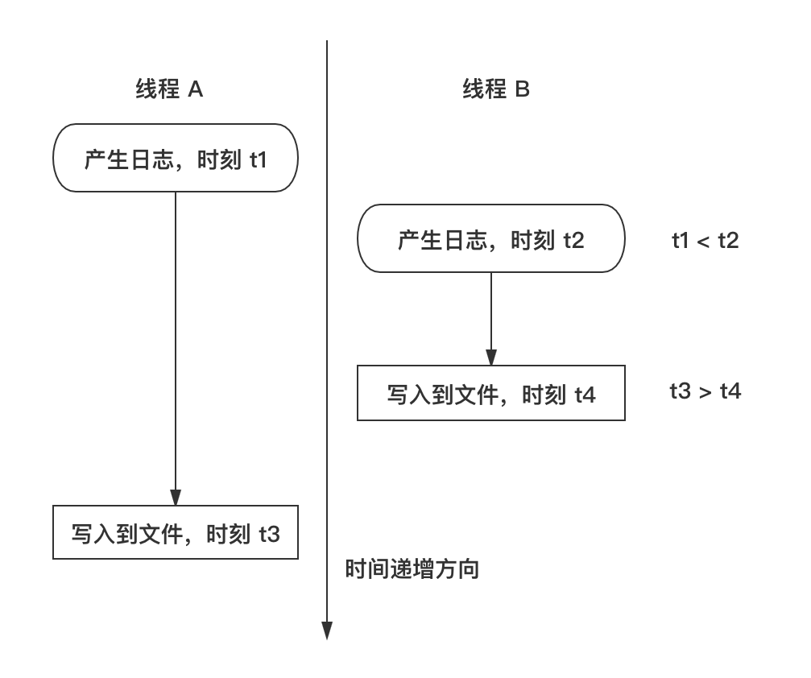
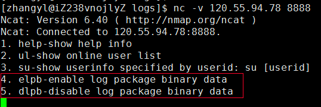
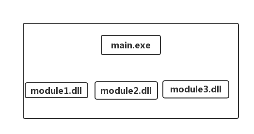
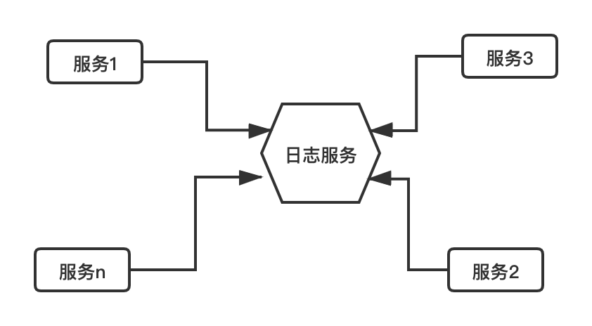
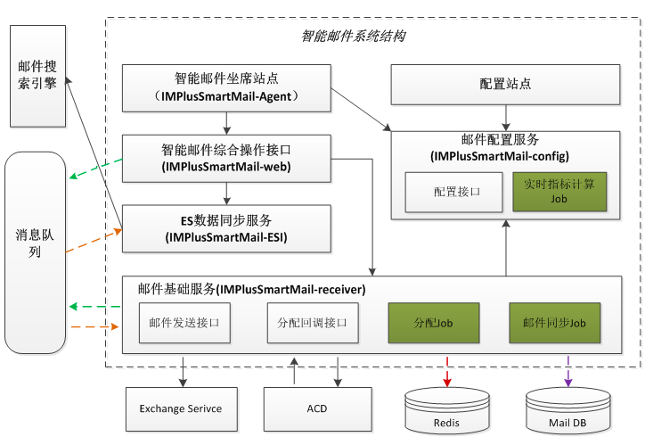
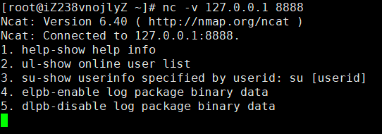
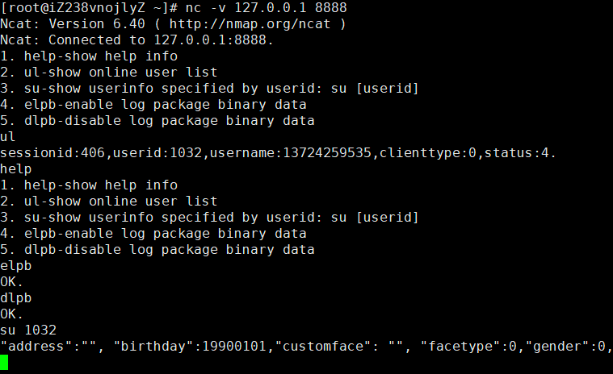
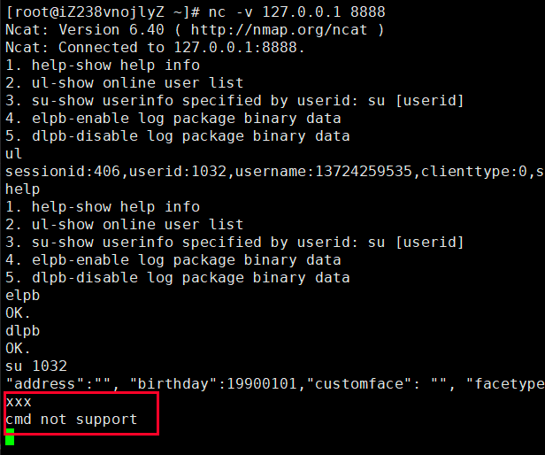

# 网络程序

## 如何设计断线自动重连机制

### 断线自动重连应用场景和逻辑设计

在有连接依赖关系的服务与服务之间，或客户端与服务器之间，无论是出于方便使用、降低运维成本、提高通信效率（服务与服务之间），还是优化用户体验（客户端与服务器之间）自动重连功能通常是一个非常重要的功能。

自动重连功能一般用于如下场景：

- 情景一

对于一组服务之间，如果其中一些服务（主动连接方，下文以 A 代称）需要与另外一些服务（被连接方，下文以 B 代称）建立 TCP 长连接，如果
A 没有自动连接 B 的功能，那么在部署或者测试这些服务的时候，必须先启动 B，再启动 A，因为一旦先启动 A，A 此时去尝试连接 B（由于
B 还没有启动）会失败，之后 A 再也不会去连接 B了（即使随后 B 被启动了），从而导致整个系统不能正常工作。

- 情景二

即使部署或测试的时候，先启动了 B，再启动 A，A 与 B 之间的连接在运行期间内，可能由于网络波动等原因导致 A 与 B
之间连接断开，之后整个系统也不能再正常工作了。

- 情景三

如果我们想升级 B，更新完程序后，重启 B，也必须重启 A。如果这种依赖链比较长（例如 A 连接 B，B 连接 C，C 连接 D，D 连接
E，等等），那么更新某个程序的效率会变得很低，更新成本非常高。

- 情景四

对于客户端软件来说，如果因为用户的网络短暂故障导致客户端与服务器失去连接，等网络恢复后，较好的用户体验是客户端能检测到用户网络变化后，自动与服务器重连，以便用户能及时收到最新的消息。

以上四个情景说明了断线自动重连功能的重要性，那如何去设计好的断线重连机制呢？

重连本身的功能开发很简单，其实就是调用 socket 函数 connect 函数，不断去“重试”。这里的“重试”我使用了双引号，是为了说明重试的技巧非常有讲究：

- 对于服务器端程序，例如 A 连接 B，如果连接不上，整个系统将无法工作，那么我们开发 A 服务时，重连的逻辑可以很简单，即 A 一旦发现与
  B 断开了连接，就立即尝试与 B 重新连接，如果连接不上，隔一段时间再重试（一般设置为 3 秒或 5
  秒即可），一直到连接成功为止。当然，期间可以发送报警邮件或者输出错误日志，让开发或者运维人员尽快干预，以便尽快解决问题。

-
对于客户端软件，以上做法也是可以的，但是不是最优的。客户端所处的网络环境比服务器程序所处的网络环境一般要恶劣的多，等间隔的定时去重连，一般作用不大（例如用户拔掉了网线）。因此，对于客户端软件，当出现断线会尝试去重连，如果连接不上，会隔一个比前一次时间更长的时间间隔去重连，例如这个时间间隔可以是
2 秒、4 秒、8
秒、16秒等等。但是，这样也存在一个问题，随着重连次数的变多，重连的时间间隔会越来越大（当然，你也可以设置一个最大重连时间间隔，之后恢复到之前较小的时间间隔）。如果网络此时已经恢复（例如用户重新插上网线），我们的程序需要等待一个很长的时间间隔（如
16 秒）才能恢复连接，这同样用户体验不好。解决办法是，如果网络发生波动，我们的程序应该检测网络状态，如果网络状态恢复正常此时应该立即进行一次重连，而不是一成不变地按照设置的时间间隔去重连。

> 操作系统提供了检测网络状态变化的 API 函数，例如对于 Windows 可以使用 IsNetworkAlive() 函数去检测，对于
> Android，网络变化时会发送消息类型是 WifiManager.NETWORK_STATE_CHANGED_ACTION 的广播通知。

另外，还需要注意的是，如果客户端网络断开，应该在界面某个地方显式地告诉用户当前连接状态，并告诉用户当前正在进行断线重连，且应该有一个可以让用户放弃断线重连或者立即进行一次断线重连的功能。

综上所述，归纳一下：对于服务器程序之间的重连可以设计成等时间间隔的定时重连，对于客户端程序要结合依次放大重连时间间隔、网络状态变化立即重连或用户主动发起重连这三个因素来设计。

### 不需要重连的情形

不需要重连一般有以下情形：

- 用户使用客户端主动放弃重连；

- 因为一些业务上的规定，禁止客户端重连；

举个例子，如果某个系统同一时刻同一个账户只允许登录一个，某个账户在机器 A 上登录，此时接着又在机器 B 上登录，此时 A
将被服务器踢下线，那么此时 A 客户端的逻辑就应该禁止自动重连。

### 技术上的断线重连和业务上的断线重连

这里说的技术上的重连，指的是调用 connect 函数连接，在实际开发中，大多数系统光有技术上的重连成功（即 connect
连接成功）是没有任何意义的，网络连接成功以后，接下来还得再次向服务器发送账号验证信息等等（如登录数据包），只有这些数据验签成功后，才能算是真正的重连成功，这里说的发送账号验证信息并验签成功就是业务上的重连成功。复杂的系统可能会需要连续好几道验签流程。因此，我们在设计断线重连机制的时候，不仅要考虑技术上的重连，还要考虑业务上的重连。只有完整地包含这两个流程，才算是完备的断线自动重连功能。

## 保活机制与心跳包

在实际开发中，我们需要处理下面两种情形中遇到的问题：

**情形一**：
一个客户端连接服务器以后，如果长期没有和服务器有数据来往，可能会被防火墙程序关闭连接，有时候我们并不想要被关闭连接。例如，对于一个即时通讯软件，如果服务器没有消息时，我们确实不会和服务器有任何数据交换，但是如果连接被关闭了，有新消息来时，我们再也没法收到了，这就违背了“即时通讯”的设计要求。

**情形二**
：通常情况下，服务器与某个客户端一般不是位于同一个网络，其之间可能经过数个路由器和交换机，如果其中某个必经路由器或者交换器出现了故障，并且一段时间内没有恢复，导致这之间的链路不再畅通，而此时服务器与客户端之间也没有数据进行交换，由于
TCP 连接是状态机，对于这种情况，无论是客户端或者服务器都无法感知与对方的连接是否正常，这类连接我们一般称之为“死链”。

**情形一**中的应用场景要求必须保持客户端与服务器之间的连接正常，就是我们通常所说的“保活“。如上文所述，当服务器与客户端一定时间内没有有效业务数据来往时，我们只需要给对端发送心跳包即可实现保活。

**情形二**
中的死链，只要我们此时任意一端给对端发送一个数据包即可检测链路是否正常，这类数据包我们也称之为”心跳包”，这种操作我们称之为“心跳检测”。顾名思义，如果一个人没有心跳了，可能已经死亡了；一个连接长时间没有正常数据来往，也没有心跳包来往，就可以认为这个连接已经不存在，为了节约服务器连接资源，我们可以通过关闭
socket，回收连接资源。

根据上面的分析，让我再强调一下，心跳检测一般有两个作用：

- 保活

- 检测死链

### TCP keepalive 选项

操作系统的 TCP/IP 协议栈其实提供了这个的功能，即 keepalive 选项。在 Linux 操作系统中，我们可以通过代码启用一个 socket
的心跳检测（即每隔一定时间间隔发送一个心跳检测包给对端），代码如下：

```c
//on 是 1 表示打开 keepalive 选项，为 0 表示关闭，0 是默认值
int on = 1;
setsockopt(fd, SOL_SOCKET, SO_KEEPALIVE, &on, sizeof(on));

```

但是，即使开启了这个选项，这个选项默认发送心跳检测数据包的时间间隔是 7200 秒（2 小时），这时间间隔实在是太长了，不具有实用性。

当然，我们可以通过继续设置 keepalive 相关的三个选项来改变这个时间间隔，它们分别是 TCP_KEEPIDLE、TCP_KEEPINTVL 和
TCP_KEEPCNT，示例代码如下：

```c
//发送 keepalive 报文的时间间隔
int val = 7200;
setsockopt(fd, IPPROTO_TCP, TCP_KEEPIDLE, &val, sizeof(val));

//两次重试报文的时间间隔
int interval = 75;
setsockopt(fd, IPPROTO_TCP, TCP_KEEPINTVL, &interval, sizeof(interval));

int cnt = 9;
setsockopt(fd, IPPROTO_TCP, TCP_KEEPCNT, &cnt, sizeof(cnt));

```

TCP_KEEPIDLE 选项设置了发送 keepalive 报文的时间间隔，发送时如果对端回复 ACK。则本端 TCP 协议栈认为该连接依然存活，继续等
7200 秒后再发送 keepalive 报文；如果对端回复 RESET，说明对端进程已经重启，本端的应用程序应该关闭该连接。

如果对端没有任何回复，则本端做重试，如果重试 9 次（TCP_KEEPCNT 值）（前后重试间隔为 75 秒（TCP_KEEPINTVL 值））仍然不可达，则向应用程序返回
ETIMEOUT（无任何应答）或 EHOST 错误信息。

我们可以使用如下命令查看 Linux 系统上的上述三个值的设置情况：

```c
[root@mycentos ~]# sysctl -a | grep keepalive
net.ipv4.tcp_keepalive_intvl = 75
net.ipv4.tcp_keepalive_probes = 9
net.ipv4.tcp_keepalive_time = 7200

```

在 Windows 系统设置 keepalive 及对应选项的代码略有不同：

```c
//开启 keepalive 选项
const char on = 1;
setsockopt(socket, SOL_SOCKET, SO_KEEPALIVE, (char *)&on, sizeof(on);

// 设置超时详细信息
DWORD cbBytesReturned;
tcp_keepalive klive;
// 启用保活
klive.onoff = 1;
klive.keepalivetime = 7200;
// 重试间隔为10秒
klive.keepaliveinterval = 1000 * 10;
WSAIoctl(socket, SIO_KEEPALIVE_VALS, &klive, sizeof(tcp_keepalive), NULL, 0, &cbBytesReturned, NULL, NULL);

```

### 应用层的心跳包机制设计

由于 keepalive 选项需要为每个连接中的 socket 开启，由于这不一定是必须的，可能会产生大量无意义的带宽浪费，且 keepalive
选项不能与应用层很好地交互，因此一般实际的服务开发中，还是建议读者在应用层设计自己的心跳包机制。那么如何设计呢？

从技术来讲，心跳包其实就是一个预先规定好格式的数据包，在程序中启动一个定时器，定时发送即可，这是最简单的实现思路。但是，如果通信的两端有频繁的数据来往，此时到了下一个发心跳包的时间点了，此时发送一个心跳包。这其实是一个流量的浪费，既然通信双方不断有正常的业务数据包来往，这些数据包本身就可以起到保活作用，为什么还要浪费流量去发送这些心跳包呢？所以，对于用于保活的心跳包，我们最佳做法是，设置一个上次包时间，每次收数据和发数据时，都更新一下这个包时间，而心跳检测计时器每次检测时，将这个包时间与当前系统时间做一个对比，如果时间间隔大于允许的最大时间间隔（实际开发中根据需求设置成
15 ~ 45 秒不等），则发送一次心跳包。总而言之，就是在与对端之间，没有数据来往达到一定时间间隔时才发送一次心跳包。

发心跳包的伪码：

```c
bool CIUSocket::Send()
{
    int nSentBytes = 0;
    int nRet = 0;
    while (true)
    {
        nRet = ::send(m_hSocket, m_strSendBuf.c_str(), m_strSendBuf.length(), 0);
        if (nRet == SOCKET_ERROR)
        {
            if (::WSAGetLastError() == WSAEWOULDBLOCK)
                break;
            else
            {
                LOG_ERROR("Send data error, disconnect server:%s, port:%d.", m_strServer.c_str(), m_nPort);
                Close();
                return false;
            }
        }
        else if (nRet < 1)
        {
            //一旦出现错误就立刻关闭Socket
            LOG_ERROR("Send data error, disconnect server:%s, port:%d.", m_strServer.c_str(), m_nPort);
            Close();
            return false;
        }

        m_strSendBuf.erase(0, nRet);
        if (m_strSendBuf.empty())
            break;

        ::Sleep(1);
    }

    {
        //记录一下最近一次发包时间
        std::lock_guard<std::mutex> guard(m_mutexLastDataTime);
        m_nLastDataTime = (long)time(NULL);
    }

    return true;
}


bool CIUSocket::Recv()
{
    int nRet = 0;
    char buff[10 * 1024];
    while (true)
    {

        nRet = ::recv(m_hSocket, buff, 10 * 1024, 0);
        if (nRet == SOCKET_ERROR)
        {
            if (::WSAGetLastError() == WSAEWOULDBLOCK)
                break;
            else
            {
                //一旦出现错误就立刻关闭Socket
                LOG_ERROR("Recv data error, errorNO=%d.", ::WSAGetLastError());
                Close();
                return false;
            }
        }
        else if (nRet < 1)
        {
            LOG_ERROR("Recv data error, errorNO=%d.", ::WSAGetLastError());
            Close();
            return false;
        }

        m_strRecvBuf.append(buff, nRet);

        ::Sleep(1);
    }

    {
        std::lock_guard<std::mutex> guard(m_mutexLastDataTime);
        //记录一下最近一次收包时间
        m_nLastDataTime = (long)time(NULL);
    }

    return true;
}

void CIUSocket::RecvThreadProc()
{
    LOG_INFO("Recv data thread start...");

    int nRet;
    //上网方式 
    DWORD   dwFlags;
    BOOL    bAlive;
    while (!m_bStop)
    {
        //检测到数据则收数据
        nRet = CheckReceivedData();
        //出错
        if (nRet == -1)
        {
            m_pRecvMsgThread->NotifyNetError();
        }
        //无数据
        else if (nRet == 0)
        {           
            long nLastDataTime = 0;
            {
                std::lock_guard<std::mutex> guard(m_mutexLastDataTime);
                nLastDataTime = m_nLastDataTime;
            }

            if (m_nHeartbeatInterval > 0)
            {
                //当前系统时间与上一次收发数据包的时间间隔超过了m_nHeartbeatInterval
                //则发一次心跳包
                if (time(NULL) - nLastDataTime >= m_nHeartbeatInterval)
                    SendHeartbeatPackage();
            }
        }
        //有数据
        else if (nRet == 1)
        {
            if (!Recv())
            {
                m_pRecvMsgThread->NotifyNetError();
                continue;
            }

            DecodePackages();
        }// end if
    }// end while-loop

    LOG_INFO("Recv data thread finish...");
}

```

同理，检测心跳包的一端，应该是在与对端没有数据来往达到一定时间间隔时才做一次心跳检测。

心跳检测一端的伪码如下：

```c
void BusinessSession::send(const char* pData, int dataLength)
{
    bool sent = TcpSession::send(pData, dataLength);

	//发送完数据更新下发包时间
	updateHeartbeatTime();      
}
void BusinessSession::handlePackge(char* pMsg, int msgLength, bool& closeSession, std::vector<std::string>& vectorResponse)
{
    //对数据合法性进行校验
    if (pMsg == NULL || pMsg[0] == 0 || msgLength <= 0 || msgLength > MAX_DATA_LENGTH)
    {
        //非法刺探请求，不做任何应答，直接关闭连接
        closeSession = true;
        return;
    }

    //更新下收包时间
    updateHeartbeatTime();
    
    //省略包处理代码...
}

void BusinessSession::updateHeartbeatTime()
{
    std::lock_guard<std::mutex> scoped_guard(m_mutexForlastPackageTime);
    m_lastPackageTime = (int64_t)time(nullptr);
}

bool BusinessSession::doHeartbeatCheck()
{
    const Config& cfg = Singleton<Config>::Instance();
    int64_t now = (int64_t)time(nullptr);

    std::lock_guard<std::mutex> lock_guard(m_mutexForlastPackageTime);
    if (now - m_lastPackageTime >= cfg.m_nMaxClientDataInterval)
    {
        //心跳包检测，超时，关闭连接
        LOGE("heartbeat expired, close session");
        shutdown();
        return true;
    }

    return false;
}

void TcpServer::checkSessionHeartbeat()
{
    int64_t now = (int64_t)time(nullptr);
    if (now - m_nLastCheckHeartbeatTime >= m_nHeartbeatCheckInterval)
    {
        m_spSessionManager->checkSessionHeartbeat();
        m_nLastCheckHeartbeatTime = (int64_t)time(nullptr);
    }      
}

void SessionManager::checkSessionHeartbeat()
{   
    std::lock_guard<std::mutex> scoped_lock(m_mutexForSession);
    for (const auto& iter : m_mapSessions)
    {
        //这里调用 BusinessSession::doHeartbeatCheck()
        iter.second->doHeartbeatCheck();
    }  
}

```

>
需要注意的是：一般是客户端主动给服务器端发送心跳包，服务器端做心跳检测决定是否断开连接。而不是反过来，从客户端的角度来说，客户端为了让自己得到服务器端的正常服务有必要主动和服务器保持连接状态正常，而服务器端不会局限于某个特定的客户端，如果客户端不能主动和其保持连接，那么就会主动回收与该客户端的连接。当然，服务器端在收到客户端的心跳包时应该给客户端一个心跳应答。

### 有代理的心跳包设计机制

上文介绍了通用的心跳包设计机制，但是有一种情况不适用，为了说明问题，请看下图：


当我们的服务程序与客户端之间存在代理服务，后端服务与代理服务之间是长连接，代理服务与客户端之间也是长连接，且后端服务器的业务类型是订阅类型，也就是说客户端一旦订阅某个类型的主题后，就很少或者不再给服务器发送消息了，而后端服务不断将客户端订阅的特定主题数据下发给客户端（如股票交易中的行情服务），此时使用上文介绍的更新心跳包的最新时间使用服务器的上行数据或者下行数据的发包时间，就可能无法检测到客户端是否已经断开了。因为，此时客户端和代理服务之间可能已经断开，但代理服务与后端服务之间的连接是正常的（这很常见，对于大多数企业应用，后端服务和代理服务一般位于同一个内网环境，二者之间的网络状态很好）。后端服务由于与代理服务之间的连接正常，后端服务的下行数据会一直畅通，但此时客户端与代理服务可能已经断开好一会儿了，而由于后端服务通过下行数据更新最新发包时间，导致心跳检测机制一直不会超过最大允许的数据间隔。如果通过后端服务的日志输出来看会发现后端一直有正常发包记录，而通过客户端日志（或者从客户端的表现）来看客户端的这路连接早已断开，断开的这段时间内已经收不到服务器的数据包。

因此，对于这种情形下，我们应该将更新数据包的时间戳机制改为只通过后端服务的上行数据来统计，这样超过某段时间，仍然没有上行数据，说明客户端已经断开了（在这段时间内客户端既无业务数据也无心跳包数据发过来）。

### 带业务数据的心跳包

上面介绍的心跳包是从纯技术的角度来说的，在实际应用中，有时候我们需要定时或者不定时从服务器端更新一些数据，我们可以把这类数据放在心跳包中，定时或者不定时更新。

这类带业务数据的心跳包，就不再是纯粹技术上的作用了（这里说的技术的作用指的上文中介绍的心跳包起保活和检测死链作用）。

这类心跳包实现也很容易，即在心跳包数据结构里面加上需要的业务字段信息，然后在定时器中定时发送，客户端发给服务器，服务器在应答心跳包中填上约定的业务数据信息即可。

### 心跳包与流量

通常情况下，多数应用场景下，与服务器端保持连接的多个客户端中，同一时间段活跃用户（这里指的是与服务器有频繁数据来往的客户端）一般不会太多。当连接数较多时，进出服务器程序的数据包通常都是心跳包（为了保活）。所以为了减轻网络代码压力，节省流量，尤其是针对一些
3/4 G 手机应用，我们在设计心跳包数据格式时应该尽量减小心跳包的数据大小。

### 心跳包与调试

如前文所述，对于心跳包，服务器端的逻辑一般是在一定时间间隔内没有收到客户端心跳包时会主动断开连接。在我们开发调试程序过程中，我们可能需要将程序通过断点中断下来，这个过程可能是几秒到几十秒不等。等程序恢复执行时，连接可能因为心跳检测逻辑已经被断开。

调试过程中，我们更多的关注的是业务数据处理的逻辑是否正确，不想被一堆无意义的心跳包数据干扰实线。

鉴于以上两点原因，我们一般在调试模式下通过配置开关变量或者条件编译选项关闭心跳包检测逻辑。代码示例如下：

1. 通过开关变量控制心跳包检测逻辑开启

```c
if (config.heartbeatCheckEnabled)
{
    EnableHearbeatCheck();
}
```

2. 通过条件编译控制心跳包检测逻辑开启

```c
//这里设置了非调试模式下才开启心跳包检测功能
#ifndef
_DEBUG
EnableHearbeatCheck();
#endif
```

### 心跳包与日志

实际生产环境，我们一般会将程序收到的和发出去的数据包写入日志中，但是无业务信息的心跳包信息是个例外，一般会刻意不写入日志，这是因为心跳包数据一般比较多，如果写入日志会导致日志文件变得很大，且充斥大量无意义的心跳包日志，所以一般在写日志时会屏蔽心跳包信息写入。

我这里的建议是，可以将心跳包信息是否写入日志做成一个配置开关，一般处于关闭状态，有需要时再开启。例如，对于一个 WebSocket
服务，ping 和 pong 是心跳包数据，下面示例代码按需输出心跳日志信息：

```c
void BusinessSession::send(std::string_view strResponse)
{   
    bool success = WebSocketSession::send(strResponse);
    if (success)
    {
        bool enablePingPongLog = Singleton<Config>::Instance().m_bPingPongLogEnabled;

        //其他消息正常打印，心跳消息则根据enablePingPongLog变量的值按需打印
        if (strResponse != "pong" || enablePingPongLog)
        {
            LOGI("msg sent to client [%s], sessionId: %s, clientId: %s, accountId: %s, frontId: %s, msg: %s",
                 getClientInfo(), m_strSessionId.c_str(), m_strClientID.c_str(), m_strAccountID.c_str(), BusinessSession::m_strFrontId.c_str(), strResponse.data());
        }
    }
}

```

以上示例代码使用 C/C++ 语言编写，但是心跳包机制设计思路和注意事项是普适性原理，同样适用于其他编程语言。

## 日志模块的设计

日志模块是应用程序一个重要的组件。

### 为什么需要日志

商业软件的生产一般都有这样一个流程——即先开发、测试，再发布生产，由于人的因素或者环境的因素，软件产品不可能百分百没有 bug
或者逻辑错误，对于已经发布到生产的项目，一旦某个时刻产生非预期的结果，我们就需要去定位和排查问题。但是一般正式的生产环境的服务器或者产品是不允许开发人员通过附加调试器去排查问题的，主要有如下可能原因：

1. 在很多互联网企业，开发部门、测试部分和产品运维部门是分工明确的，软件产品一旦发布到生产环境以后，将全部交由运维部门人员去管理和维护，而原来开发此产品的开发人员不再拥有相关的操作程序的权限。

2. 对于已经上了生产环境的服务，其数据和程序稳定性是公司的核心产值所在，一般不敢或不允许被开发人员随意调试或者操作，以免造成损失。

3. 发布到生产环境的服务，一般为了让程序执行效率更高、文件体积更小，都是去掉调试符号后的版本，不方便调试。

既然在这种场景下我们无法通过调试器去调试，为了跟踪和回忆当时的程序行为进而定位问题，我们就需要日志系统。

退一步说，即使在开发或者测试环境，虽然我们可以把程序附加到调试器上去调试，但是对于一些特定的程序行为，我们无法通过设置断点，让程序在某个时刻暂停下来进行调试。例如，对于某些网络通信功能，如果暂停时间过长（相对于某些程序逻辑来说），通信的对端可能由于彼端没有在规定时间内响应而断开连接，导致程序逻辑无法进入我们想要的执行流中去；再例如，对于一些高频操作（如心跳包、定时器、界面绘制下的某些高频重复行为），可能在少量次数下无法触发我们想要的行为，而通过断点的暂停方式，我们不得不重复操作几十次、上百次甚至更多，这样排查问题效率是非常低下的。对于这类操作，我们可以通过打印日志，将当时的程序行为上下文现场记录下来，然后从日志系统中找到某次不正常的行为的上下文信息。这是日志的另外一个作用。

本文将从技术和业务上两个方面来介绍日志系统相关的设计与开发，所谓技术上，就是如何从程序开发的角度设计一款功能强大、性能优越、使用方便的日志系统；而业务上，是指在使用日志系统时，应该去记录哪些行为和数据可以做到既简洁、不啰嗦，又能方便、快捷地定位问题。

### 日志系统的技术上的实现

日志的最初的原型即将程序运行的状态打印出来，对于 C/C++ 这门语言来说，利用 printf、std::cout
等控制台输出函数，将日志信息输出到控制台，这类简单的情形我们不在此过多赘述。

对于商业项目，为了方便排查问题，我们一般不将日志写到控制台，而是输出到文件或者数据库系统。不管哪一种，其基本思路是相同的，这里我们以写文件为例来详细介绍。

#### 1. 同步写日志

所谓同步写日志，指的是在输出日志的地方，将日志即时写入到文件中去。根据笔者的经验，这种设计广泛地用于相当多的的客户端软件。笔者曾从事过数年的客户端开发（包括
PC、安卓软件），设计过一些功能复杂的金融客户端产品，在这些系统中采用的就是这种同步写日志的方式。之所以使用这种方式其主要原因就是设计简单，而又不会影响用户使用体验。说到这里读者可能有这样一个疑问：一般的客户端软件，一般存在界面，而界面部分所属的逻辑就是程序的主线程，如果采取这种同步写日志的方式，当写日志时，写文件是磁盘
IO 操作，相比较程序其他部分是 CPU
操作，前者要慢很多，这样势必造成CPU等待，进而导致主线程“卡”在写文件处，进而造成界面卡顿，从而导致用户使用软件的体验不好。读者的这种顾虑确实是存在的。但是，很多时候我们不用担心这种问题，主要有两个原因：

1. 对于客户端程序，即使在主线程（UI
   线程）中同步写文件，其单次或者几次磁盘操作累加时间，与人（用户）的可感知时间相比，也是非常小的，也就是说用户根本感觉不到这种同步写文件造成的延迟。当然，这里也给您一个提醒就是，如果在
   UI 线程里面写日志，尤其是在一些高频操作中（如 Windows 的界面绘制消息 WM_PAINT
   处理逻辑中），一定要控制写日志的长度和次数，否则就会因频繁写文件或一次写入数据过大而对界面造成卡顿。

2. 客户端程序除了 UI 线程，还有其他与界面无关的工作线程，在这些线程中直接写文件，一般不会对用户的体验产生什么影响。

**日志类的 .h 文件**

```c
/**
 *@desc:   IULog.h
 */
#ifndef
__LOG_H__
#define
__LOG_H__

enum LOG_LEVEL
{
LOG_LEVEL_INFO,
LOG_LEVEL_WARNING,
LOG_LEVEL_ERROR
};

//注意：如果打印的日志信息中有中文，则格式化字符串要用_T()宏包裹起来，
#define
LOG_INFO(...)     CIULog::Log(LOG_LEVEL_INFO, __FUNCSIG__, __LINE__, __VA_ARGS__)
#define
LOG_WARNING(...)  CIULog::Log(LOG_LEVEL_WARNING, __FUNCSIG__, __LINE__, __VA_ARGS__)
#define
LOG_ERROR(...)    CIULog::Log(LOG_LEVEL_ERROR, __FUNCSIG__, __LINE__, __VA_ARGS__)

class CIULog
{
public:
static bool Init(bool bToFile, bool bTruncateLongLog, PCTSTR pszLogFileName);
static void Uninit();

static void SetLevel(LOG_LEVEL nLevel);

//不输出线程ID号和所在函数签名、行号
static bool Log(long nLevel, PCTSTR pszFmt, ...);
//输出线程ID号和所在函数签名、行号
static bool Log(long nLevel, PCSTR pszFunctionSig, int nLineNo, PCTSTR pszFmt, ...);        //注意:pszFunctionSig参数为Ansic版本
static bool Log(long nLevel, PCSTR pszFunctionSig, int nLineNo, PCSTR pszFmt, ...);
private:
CIULog() = delete;
~CIULog() = delete;

CIULog(const CIULog& rhs) = delete;
CIULog& operator=(const CIULog& rhs) = delete;

static void GetTime(char* pszTime, int nTimeStrLength);

private:
static bool m_bToFile;                //日志写入文件还是写到控制台  
static HANDLE            m_hLogFile;
static bool m_bTruncateLongLog;     //长日志是否截断
static LOG_LEVEL        m_nLogLevel;            //日志级别
};

#endif // !__LOG_H__

```

**日志的 cpp 文件**

```c++
/**
 *@desc:   IULog.cpp
 */
#include
"stdafx.h"
#include
"IULog.h"
#include
"EncodingUtil.h"
#include
<tchar.h>

#ifndef
LOG_OUTPUT
#define
LOG_OUTPUT
#endif

#define
MAX_LINE_LENGTH 256

bool CIULog::m_bToFile = false;
bool CIULog::m_bTruncateLongLog = false;
HANDLE CIULog::m_hLogFile = INVALID_HANDLE_VALUE;
LOG_LEVEL CIULog::m_nLogLevel = LOG_LEVEL_INFO;

bool CIULog::Init(bool bToFile, bool bTruncateLongLog, PCTSTR pszLogFileName)
{
#ifdef
LOG_OUTPUT
m_bToFile = bToFile;
m_bTruncateLongLog = bTruncateLongLog;

if (pszLogFileName == NULL || pszLogFileName[0] == NULL)
return FALSE;

TCHAR szHomePath[MAX_PATH] = { 0 };
::GetModuleFileName(NULL, szHomePath, MAX_PATH);
for (int i = _tcslen(szHomePath); i >= 0; --i)
{
if (szHomePath[i] == _T('\\'))
{
szHomePath[i] = _T('\0');
break;
}
}

TCHAR szLogDirectory[MAX_PATH] = {
0
};
_stprintf_s(szLogDirectory, _T("%s\\Logs\\"), szHomePath);

DWORD dwAttr =::GetFileAttributes(szLogDirectory);
if (!((dwAttr != 0xFFFFFFFF) && (dwAttr & FILE_ATTRIBUTE_DIRECTORY)))
{
TCHAR cPath[MAX_PATH] = {
0
};
TCHAR cTmpPath[MAX_PATH] = { 0 };
TCHAR* lpPos = NULL;
TCHAR cTmp = _T('\0');

_tcsncpy_s(cPath, szLogDirectory, MAX_PATH);

for (int i = 0; i < (int)_tcslen(cPath); i++)
{
if (_T('\\') == cPath[i])
cPath[i] = _T('/');
}

lpPos = _tcschr(cPath, _T('/'));
while (lpPos != NULL)
{
if (lpPos == cPath)
{
lpPos++;
}
else
{
cTmp = *lpPos;
*lpPos = _T('\0');
_tcsncpy_s(cTmpPath, cPath, MAX_PATH);
::CreateDirectory(cTmpPath, NULL);
*lpPos = cTmp;
lpPos++;
}
lpPos = _tcschr(lpPos, _T('/'));
}
}

m_hLogFile =::CreateFile(pszLogFileName, GENERIC_READ | GENERIC_WRITE, FILE_SHARE_READ, NULL, CREATE_NEW, FILE_ATTRIBUTE_NORMAL, NULL);
if (m_hLogFile == INVALID_HANDLE_VALUE)
return false;

#endif // end LOG_OUTPUT

return true;
}

void CIULog::Uninit()
{
#ifdef
LOG_OUTPUT
if (m_hLogFile != INVALID_HANDLE_VALUE)
{
::CloseHandle(m_hLogFile);
m_hLogFile = INVALID_HANDLE_VALUE;
}
#endif //end LOG_OUTPUT
}

void CIULog::SetLevel(LOG_LEVEL nLevel)
{
m_nLogLevel = nLevel;
}

bool CIULog::Log(long nLevel, PCTSTR pszFmt, ...)
{
#ifdef
LOG_OUTPUT
if (nLevel < m_nLogLevel)
return false;

char szTime[64] = { 0 };
GetTime(szTime, ARRAYSIZE(szTime));
std::string strDebugInfo(szTime);

std::string strLevel("[INFO]");
if (nLevel == LOG_LEVEL_WARNING)
strLevel = "[Warning]";
else if (nLevel == LOG_LEVEL_ERROR)
strLevel = "[Error]";

strDebugInfo += strLevel;

//当前线程信息
char szThreadID[32] = { 0 };
DWORD dwThreadID =::GetCurrentThreadId();
sprintf_s(szThreadID, ARRAYSIZE(szThreadID), "[ThreadID: %u]", dwThreadID);
strDebugInfo += szThreadID;

//log正文
std::wstring strLogMsg;
va_list ap;
va_start(ap, pszFmt);
int nLogMsgLength = _vsctprintf(pszFmt, ap);
//容量必须算上最后一个\0
if ((int)strLogMsg.capacity() < nLogMsgLength + 1)
{
strLogMsg.resize(nLogMsgLength + 1);
}
_vstprintf_s((TCHAR*)strLogMsg.data(), strLogMsg.capacity(), pszFmt, ap);
va_end(ap);

//string内容正确但length不对，恢复一下其length
std::wstring strMsgFormal;
strMsgFormal.append(strLogMsg.c_str(), nLogMsgLength);

//如果日志开启截断，长日志只取前MAX_LINE_LENGTH个字符
if (m_bTruncateLongLog)
strMsgFormal = strMsgFormal.substr(0, MAX_LINE_LENGTH);

std::string strLogMsgAscii;
strLogMsgAscii = EncodeUtil::UnicodeToAnsi(strMsgFormal);

strDebugInfo += strLogMsgAscii;
strDebugInfo += "\r\n";

if (m_bToFile)
{
if (m_hLogFile == INVALID_HANDLE_VALUE)
return false;

::SetFilePointer(m_hLogFile, 0, NULL, FILE_END);
DWORD dwBytesWritten = 0;
::WriteFile(m_hLogFile, strDebugInfo.c_str(), strDebugInfo.length(), &dwBytesWritten, NULL);
::FlushFileBuffers(m_hLogFile);
return true;
}

::OutputDebugStringA(strDebugInfo.c_str());

#endif // end LOG_OUTPUT

return true;
}

bool CIULog::Log(long nLevel, PCSTR pszFunctionSig, int nLineNo, PCTSTR pszFmt, ...)
{
#ifdef
LOG_OUTPUT
if (nLevel < m_nLogLevel)
return false;

//时间
char szTime[64] = { 0 };
GetTime(szTime, ARRAYSIZE(szTime));
std::string strDebugInfo(szTime);

//错误级别
std::string strLevel("[INFO]");
if (nLevel == LOG_LEVEL_WARNING)
strLevel = "[Warning]";
else if (nLevel == LOG_LEVEL_ERROR)
strLevel = "[Error]";

strDebugInfo += strLevel;

//当前线程信息
char szThreadID[32] = { 0 };
DWORD dwThreadID =::GetCurrentThreadId();
sprintf_s(szThreadID, ARRAYSIZE(szThreadID), "[ThreadID: %u]", dwThreadID);
strDebugInfo += szThreadID;

//函数签名
char szFuncSig[512] = { 0 };
sprintf_s(szFuncSig, "[%s:%d]", pszFunctionSig, nLineNo);
strDebugInfo += szFuncSig;

//log正文
std::wstring strLogMsg;
va_list ap;
va_start(ap, pszFmt);
int nLogMsgLength = _vsctprintf(pszFmt, ap);
//容量必须算上最后一个\0 
if ((int)strLogMsg.capacity() < nLogMsgLength + 1)
{
strLogMsg.resize(nLogMsgLength + 1);
}
_vstprintf_s((TCHAR*)strLogMsg.data(), strLogMsg.capacity(), pszFmt, ap);
va_end(ap);

//string内容正确但length不对，恢复一下其length
std::wstring strMsgFormal;
strMsgFormal.append(strLogMsg.c_str(), nLogMsgLength);

//如果日志开启截断，长日志只取前MAX_LINE_LENGTH个字符
if (m_bTruncateLongLog)
strMsgFormal = strMsgFormal.substr(0, MAX_LINE_LENGTH);

std::string strLogMsgAscii;
strLogMsgAscii = EncodeUtil::UnicodeToAnsi(strMsgFormal);

strDebugInfo += strLogMsgAscii;
strDebugInfo += "\r\n";

if (m_bToFile)
{
if (m_hLogFile == INVALID_HANDLE_VALUE)
return false;

::SetFilePointer(m_hLogFile, 0, NULL, FILE_END);
DWORD dwBytesWritten = 0;
::WriteFile(m_hLogFile, strDebugInfo.c_str(), strDebugInfo.length(), &dwBytesWritten, NULL);
::FlushFileBuffers(m_hLogFile);
return true;
}

::OutputDebugStringA(strDebugInfo.c_str());

#endif // end LOG_OUTPUT

return true;
}

bool CIULog::Log(long nLevel, PCSTR pszFunctionSig, int nLineNo, PCSTR pszFmt, ...)
{
#ifdef
LOG_OUTPUT
if (nLevel < m_nLogLevel)
return false;

//时间
char szTime[64] = { 0 };
GetTime(szTime, ARRAYSIZE(szTime));
std::string strDebugInfo(szTime);

//错误级别
std::string strLevel("[INFO]");
if (nLevel == LOG_LEVEL_WARNING)
strLevel = "[Warning]";
else if (nLevel == LOG_LEVEL_ERROR)
strLevel = "[Error]";

strDebugInfo += strLevel;

//当前线程信息
char szThreadID[32] = { 0 };
DWORD dwThreadID =::GetCurrentThreadId();
sprintf_s(szThreadID, ARRAYSIZE(szThreadID), "[ThreadID: %u]", dwThreadID);
strDebugInfo += szThreadID;

//函数签名
char szFuncSig[512] = { 0 };
sprintf_s(szFuncSig, "[%s:%d]", pszFunctionSig, nLineNo);
strDebugInfo += szFuncSig;

//日志正文
std::string strLogMsg;
va_list ap;
va_start(ap, pszFmt);
int nLogMsgLength = _vscprintf(pszFmt, ap);
//容量必须算上最后一个\0
if ((int)strLogMsg.capacity() < nLogMsgLength + 1)
{
strLogMsg.resize(nLogMsgLength + 1);
}
vsprintf_s((char*)strLogMsg.data(), strLogMsg.capacity(), pszFmt, ap);
va_end(ap);

//string内容正确但length不对，恢复一下其length
std::string strMsgFormal;
strMsgFormal.append(strLogMsg.c_str(), nLogMsgLength);

//如果日志开启截断，长日志只取前MAX_LINE_LENGTH个字符
if (m_bTruncateLongLog)
strMsgFormal = strMsgFormal.substr(0, MAX_LINE_LENGTH);

strDebugInfo += strMsgFormal;
strDebugInfo += "\r\n";

if (m_bToFile)
{
if (m_hLogFile == INVALID_HANDLE_VALUE)
return false;

::SetFilePointer(m_hLogFile, 0, NULL, FILE_END);
DWORD dwBytesWritten = 0;
::WriteFile(m_hLogFile, strDebugInfo.c_str(), strDebugInfo.length(), &dwBytesWritten, NULL);
::FlushFileBuffers(m_hLogFile);
return true;
}

::OutputDebugStringA(strDebugInfo.c_str());

#endif // end LOG_OUTPUT

return true;
}

void CIULog::GetTime(char* pszTime, int nTimeStrLength)
{
SYSTEMTIME st = {
0
};
::GetLocalTime(&st);
sprintf_s(pszTime, nTimeStrLength, "[%04d-%02d-%02d %02d:%02d:%02d:%04d]", st.wYear, st.wMonth, st.wDay, st.wHour, st.wMinute, st.wSecond, st.wMilliseconds);
}

```

上述代码中根据日志级别定义了三个宏 LOG_INFO、LOG_WARNING、LOG_ERROR，如果要使用该日志模块，只需要在程序启动处的地方调用
CIULog::Init 函数初始化日志：

```c
SYSTEMTIME st = {0};
::GetLocalTime(&st);
TCHAR szLogFileName[MAX_PATH] = {0};
_stprintf_s(szLogFileName, MAX_PATH, _T("%s\\Logs\\%04d%02d%02d%02d%02d%02d.log"), g_szHomePath, st.wYear, st.wMonth, st.wDay, st.wHour, st.wMinute, st.wSecond);
CIULog::Init(true, false, szLogFileName);

```

当然，最佳的做法，在程序退出的地方，调用 CIULog::Uninit 回收日志模块相关的资源：

```c++
CIULog::Uninit();

```

在做好这些准备工作以后，如果你想在程序的某个地方写一条日志，只需要这样写：

```c++
//打印一条 INFO 级别的日志
LOG_INFO("Request logon: Account=%s, Password=*****, Status=%d, LoginType=%d.", pLoginRequest->m_szAccountName, pLoginRequest->m_szPassword, pLoginRequest->m_nStatus, (long)pLoginRequest->m_nLoginType);
//打印一条 WARNING 级别的日志
LOG_WARN("Some warning...");
//打印一条 ERROR 级别的日志
LOG_ERROR("Recv data error, errorNO=%d.",::WSAGetLastError());

```

关于 CIULog
这个日志模块类，可以从链接（https://github.com/baloonwj/flamingo/tree/master/flamingoclient）下载完整的项目代码来运行。该日志输出效果如下：

```text
[2018-11-09 23:52:54:0826][INFO][ThreadID: 7252][bool __thiscall CIUSocket::Login(const char *,const char *,int,int,int,class std::basic_string<char,struct std::char_traits<char>,class std::allocator<char> > &):1107]Request logon: Account=zhangy, Password=*****, Status=76283204, LoginType=1.
[2018-11-09 23:52:56:0352][INFO][ThreadID: 5828][void __thiscall CIUSocket::SendThreadProc(void):794]Recv data thread start...
[2018-11-09 23:52:56:0385][INFO][ThreadID: 6032][void __thiscall CSendMsgThread::HandleUserBasicInfo(const class CUserBasicInfoRequest *):298]Request to get userinfo.
[2018-11-09 23:52:56:0355][INFO][ThreadID: 7140][void __thiscall CIUSocket::RecvThreadProc(void):842]Recv data thread start...
[2018-11-09 23:52:57:0254][INFO][ThreadID: 7220][int __thiscall CRecvMsgThread::HandleFriendListInfo(const class std::basic_string<char,struct std::char_traits<char>,class std::allocator<char> > &):593]Recv user basic info, info count=1.

```

##### 1) 多线程同步写日志出现的问题一

从上面的日志输出来看，这种同步的日志输出方式，也存在时间顺序不正确的问题（时间戳大的日志比时间戳小的日志靠前）。这是由于多线程同时写日志到同一个文件时，产生日志的时间和实际写入磁盘的时间不是一个原子操作。下图解释了该现象出现的根源：



好在这种时间顺序不正确只会出现在不同线程之间，对于同一个线程的不同时间的日志记录顺序肯定是正确的。所以这种日期错乱现象，并不影响我们使用日志。

##### 2) 多线程同步写日志出现的问题二

多线程同时写入同一个日志文件还有一个问题，就是假设线程 A 写某一个时刻追加日志内容为 “AAAAA” ，线程 B 在同一时刻追加日志内容为
“BBBBB” ，线程 C 在同一时刻追加日志内容为 “CCCCC” ，那么最终的日志文件中的内容会不会出现 “AABBCCABCAACCBB” 这种格式？

在类 Unix 系统上（包括 Linux），同一个进程内针对同一个 FILE* 的操作是线程安全的，也就是说，在这类操作系统上得到的日志结果
A、B、C 各个字母组一定是连续在一起，也就是说最终得到的日志内容可能是 “AAAAACCCCCBBBBB” 或 “AAAAABBBBBCCCCC” 等这种连续的格式，绝不会出现
A、B、C 字母交错相间的现象。

而在Windows系统上，对于 FILE* 的操作并不是线程安全的。但是笔者做了大量实验，在 Windows 系统上也没有出现这种 A、B、C
字母相间的现象。（关于这个问题的讨论，可以参考这里：https://www.zhihu.com/question/40472431）

这种同步日志的实现方式，一般用于低频写日志的软件系统中（如客户端软件），所以我可以认为这种多线程同时写日志到一个文件中是可行的。

#### 2. 异步写日志

当然，对于性能要求不高的应用（如大多数客户端程序、某些并发数量不高的服务）来说，这种同步写日志的实现方式是可以满足要求的。但是对于
QPS 要求很高或者对性能有一定要求的服务器程序，同步写日志等待磁盘 IO
的完成对于服务的关键性逻辑的快速执行和及时响应性会造成一定的性能损失。为了减小这种损失，我们可以采用异步日志。

所谓异步写日志，与同步写日志相反，即产生日志的地方，不会将日志实时写入到文件中去，而是通过一些线程同步技术将日志先暂存下来，然后再通过一个或多个专门的日志写入线程去将这些缓存的日志写入到磁盘中去，这样的话，原来输出日志的线程就不存在等待写日志到磁盘这样的效率损耗了。这本质上，其实就是一个生产者和消费者，产生日志的线程是生产者，将日志写入文件的线程是消费者。当然，对于日志的消费者线程，我这里提到“一个”或“多个”日志线程，在实际开发中，如果多个日志消费线程，我们又要考虑多个线程可能会造成写日志的时间顺序错位（时间较晚的日志写在时间较早的日志前面），这在上文中已经讨论过，这里不再赘述。

总结起来，为了方便读者理解和编码，我们可以认为异步写日志的逻辑一般存在一组专门写日志的线程（一个或多个），程序的其他线程为这些日志线程生产日志。

至于其他线程如何将产生的日志交给日志线程，这就是多线程之间资源同步的问题了。我们可以使用一个队列来存储其他线程产生的日志，日志线程从该队列中取出日志，然后将日志内容写入文件。最简单的方式是日志生产线程将每次产生的日志信息放入一个队列时、日志写入线程从队列中取出日志时，都使用一个
**互斥体( mutex )** 保护起来。代码示例如下（C++11 代码）：

```text
/**
 *@desc: AsyncLogger.cpp
 */
#include "stdafx.h"
#include <thread>
#include <mutex>
#include <list>
#include <string>
#include <sstream>
#include <iostream>

//保护队列的互斥体
std::mutex log_mutex;
std::list<std::string> cached_logs;
FILE* log_file = NULL;

bool init_log_file()
{
    //以追加内容的形式写入文件内容，如果文件不存在，则创建
    log_file = fopen("my.log", "a+");
    return log_file != NULL;
}

void uninit_log_file()
{
    if (log_file != NULL)
        fclose(log_file);
}

bool write_log_tofile(const std::string& line)
{
    if (log_file == NULL)
        return false;

    if (fwrite((void*)line.c_str(), 1, line.length(), log_file) != line.length())
        return false;

    //将日志立即冲刷到文件中去
    fflush(log_file);

    return true;
}

void log_producer()
{
    int index = 0;
    while (true)
    {
        ++ index;
        std::ostringstream os;
        os << "This is log, index: " << index << ", producer threadID: " << std::this_thread::get_id() << "\n";
        //使用花括号括起来为的是减小锁的粒度
        {
            std::lock_guard<std::mutex> lock(log_mutex);
            cached_logs.emplace_back(os.str());
        }
           
        std::chrono::milliseconds duration(100);
        std::this_thread::sleep_for(duration);
    }
}

void log_consumer()
{
    std::string line;
    while (true)
    {
        //使用花括号括起来为的是减小锁的粒度
        {
            std::lock_guard<std::mutex> lock(log_mutex);
            if (!cached_logs.empty())
            {
                line = cached_logs.front();
                cached_logs.pop_front();
            }
        }

        if (line.empty())
        {        
            std::chrono::milliseconds duration(1000);
            std::this_thread::sleep_for(duration);

            continue;
        }

        write_log_tofile(line);

        line.clear();
    }
}

int main(int argc, char* argv[])
{
    if (!init_log_file())
    {
        std::cout << "init log file error." << std::endl;
        return -1;
    }
    
    std::thread log_producer1(log_producer);
    std::thread log_producer2(log_producer);
    std::thread log_producer3(log_producer);

    std::thread log_consumer1(log_consumer);
    std::thread log_consumer2(log_consumer);
    std::thread log_consumer3(log_consumer);

    log_producer1.join();
    log_producer2.join();
    log_producer3.join();

    log_consumer1.join();
    log_consumer2.join();
    log_consumer3.join();

    uninit_log_file();
    
    return 0;
}

```

上述代码分别模拟了三个生产日志的线程（log_producer1～3）和三个消费日志线程（log_consumer1～3）。当然上述代码可以继续优化，如果当前缓存队列中没有日志记录，那么消费日志线程会做无用功。

##### 1) 优化方法一

可以使用条件变量，如果当前队列中没有日志记录，则将日志消费线程挂起；当生产日志的线程产生了新的日志后，**置信（signal）**
条件变量，这样日志消费线程会被唤醒，以将日志从队列中取出来并写入文件。我们来看下代码：

```text
/**
 *@desc: AsyncLoggerLinux.cpp
 */
#include "stdafx.h"
#include <thread>
#include <mutex>
#include <condition_variable>
#include <list>
#include <string>
#include <sstream>
#include <iostream>

std::mutex log_mutex;
std::condition_variable log_cv;
std::list<std::string> cached_logs;
FILE* log_file = NULL;

bool init_log_file()
{
    //以追加内容的形式写入文件内容，如果文件不存在，则创建
    log_file = fopen("my.log", "a+");
    return log_file != NULL;
}

void uninit_log_file()
{
    if (log_file != NULL)
        fclose(log_file);
}

bool write_log_tofile(const std::string& line)
{
    if (log_file == NULL)
        return false;

    if (fwrite((void*)line.c_str(), 1, line.length(), log_file) != line.length())
        return false;

    //将日志立即冲刷到文件中去
    fflush(log_file);

    return true;
}

void log_producer()
{
    int index = 0;
    while (true)
    {
        ++ index;
        std::ostringstream os;
        os << "This is log, index: " << index << ", producer threadID: " << std::this_thread::get_id() << "\n";
        //使用花括号括起来为的是减小锁的粒度
        {
            std::lock_guard<std::mutex> lock(log_mutex);
            cached_logs.emplace_back(os.str());
            log_cv.notify_one();
        }
           
        std::chrono::milliseconds duration(100);
        std::this_thread::sleep_for(duration);
    }
}

void log_consumer()
{
    std::string line;
    while (true)
    {
        //使用花括号括起来为的是减小锁的粒度
        {
            std::unique_lock<std::mutex> lock(log_mutex);
            if (cached_logs.empty())
            {
                //无限等待
                log_cv.wait(lock);
            }

            line = cached_logs.front();
            cached_logs.pop_front();
        }

        if (line.empty())
        {        
            std::chrono::milliseconds duration(1000);
            std::this_thread::sleep_for(duration);

            continue;
        }

        write_log_tofile(line);

        line.clear();
    }
}

int main(int argc, char* argv[])
{
    if (!init_log_file())
    {
        std::cout << "init log file error." << std::endl;
        return -1;
    }
    
    std::thread log_producer1(log_producer);
    std::thread log_producer2(log_producer);
    std::thread log_producer3(log_producer);

    std::thread log_consumer1(log_consumer);
    std::thread log_consumer2(log_consumer);
    std::thread log_consumer3(log_consumer);

    log_producer1.join();
    log_producer2.join();
    log_producer3.join();

    log_consumer1.join();
    log_consumer2.join();
    log_consumer3.join();

    uninit_log_file();
    
    return 0;
}

```

##### 2) 优化方法二

除了条件变量以外，我们还可以使用信号量来设计我们的异步日志系统，信号量是带有资源计数的线程同步对象，当每产生一条日志时，我们将信号量资源计数自增1，日志消费线程默认是等待这个信号量是否受信，如果受信，每唤醒一个日志消费线程，信号量字数计数将自动减1。通俗地说就是生成者每生产一个资源，就将资源计数加1，而消费者每消费一个资源数量，就将资源计数减一；如果当前资源计数已经为0，则消费者将自动挂起。

由于 C++ 11 没有提供对不同平台的信号量对象的封装，我们这里分别给出 Windows 和 Linux
两个平台的实现代码，读者可以根据需要来学习其中一个或两个同时学习。注意，为了保持代码风格一致，对于线程和读写文件相关函数，在不同的操作系统平台，我们使用该系统平台相关的
API 接口，而不再使用 C++ 11 的相关函数和类库。

**Windows 平台代码**

```text
/**
 *@desc: AsyncLogger.cpp，Windows版本
 */
#include "stdafx.h"
#include <windows.h>
#include <list>
#include <string>
#include <iostream>
#include <sstream>

std::list<std::string> cached_logs;
CRITICAL_SECTION g_cs;
HANDLE g_hSemaphore = NULL;
HANDLE g_hLogFile = INVALID_HANDLE_VALUE;

bool Init()
{
    InitializeCriticalSection(&g_cs);
    
    //假设资源数量上限是0xFFFFFFFF
    g_hSemaphore = CreateSemaphore(NULL, 0, 0xFFFFFFFF, NULL);
    
    //如果文件不存在，则创建
    g_hLogFile = CreateFile(_T("my.log"), GENERIC_WRITE, FILE_SHARE_READ, NULL, CREATE_ALWAYS, FILE_ATTRIBUTE_NORMAL, NULL);
    if (g_hLogFile == INVALID_HANDLE_VALUE)
        return false;

    return true;
}

void Uninit()
{
    DeleteCriticalSection(&g_cs);
    
    if (g_hSemaphore != NULL)
        CloseHandle(g_hSemaphore);
    
    if (g_hLogFile != INVALID_HANDLE_VALUE)
        CloseHandle(g_hLogFile);
}

bool WriteLogToFile(const std::string& line)
{
    if (g_hLogFile == INVALID_HANDLE_VALUE)
        return false;

    DWORD dwBytesWritten;
    //如果对于比较长的日志，应该分段写入，因为单次写入可能只能写入部分，这里为了演示方便，逻辑从简
    if (!WriteFile(g_hLogFile, line.c_str(), line.length(), &dwBytesWritten, NULL) || dwBytesWritten != line.length())
        return false;
    
    //将日志立即冲刷到文件中去
    FlushFileBuffers(g_hLogFile);

    return true;
}

DWORD CALLBACK LogProduceThreadProc(LPVOID lpThreadParameter)
{
    int index = 0;
    while (true)
    {
        ++ index;
        std::ostringstream os;
        os << "This is log, index: " << index << ", producer threadID: " << GetCurrentThreadId() << "\n";
      
        EnterCriticalSection(&g_cs);       
        cached_logs.emplace_back(os.str());
        LeaveCriticalSection(&g_cs);

        ReleaseSemaphore(g_hSemaphore, 1, NULL);
                   
        Sleep(100);
    }

    return 0;
}

DWORD CALLBACK LogConsumeThreadProc(LPVOID lpThreadParameter)
{
    std::string line;
    while (true)
    {     
        //无限等待
        WaitForSingleObject(g_hSemaphore, INFINITE);

        EnterCriticalSection(&g_cs);
        if (!cached_logs.empty())
        {
            line = cached_logs.front();
            cached_logs.pop_front();
        }     
        LeaveCriticalSection(&g_cs);          

        if (line.empty())
        {        
            Sleep(1000);

            continue;
        }

        WriteLogToFile(line);

        line.clear();
    }
}

int main(int argc, char* argv[])
{
    if (!Init())
    {
        std::cout << "init log file error." << std::endl;
        return -1;
    }
    
    HANDLE hProducers[3];
    for (int i = 0; i < sizeof(hProducers) / sizeof(hProducers[0]); ++i)
    {
        hProducers[i] = CreateThread(NULL, 0, LogProduceThreadProc, NULL, 0, NULL);
    }

    HANDLE hConsumers[3];
    for (int i = 0; i < sizeof(hConsumers) / sizeof(hConsumers[0]); ++i)
    {
        hConsumers[i] = CreateThread(NULL, 0, LogConsumeThreadProc, NULL, 0, NULL);
    }

    //等待消费者线程退出
    for (int i = 0; i < sizeof(hProducers) / sizeof(hProducers[0]); ++i)
    {
        WaitForSingleObject(hProducers[i], INFINITE);
    }

    //等待生产者线程退出
    for (int i = 0; i < sizeof(hConsumers) / sizeof(hConsumers[0]); ++i)
    {
        WaitForSingleObject(hConsumers[i], INFINITE);
    }

    Uninit();
    
    return 0;
}

```

上述代码，在多线程向队列中增加日志记录和从队列中取出日志记录使用了Windows的上的**临界区（CRITICAL_SECTION，有的书上译作“关键段”）
** 对象来对队列进行保护。

**Linux 平台代码**

```text
/**
 *@desc: AsyncLogger.cpp，linux版本
 */
#include <unistd.h>
#include <list>
#include <stdio.h>
#include <pthread.h>
#include <semaphore.h>
#include <string>
#include <iostream>
#include <sstream>


std::list<std::string> cached_logs;
pthread_mutex_t log_mutex = PTHREAD_MUTEX_INITIALIZER;
sem_t           log_semphore;
FILE* plogfile = NULL;

bool init()
{
    pthread_mutex_init(&log_mutex, NULL);
    //初始信号量资源数目是0
    sem_init(&log_semphore, 0, 0);
 
    //如果文件不存在，则创建
    plogfile = fopen("my.log", "a++");

    return plogfile != NULL;
}

void uninit()
{
    pthread_mutex_destroy(&log_mutex);
    sem_destroy(&log_semphore);
       
    if (plogfile != NULL)
        fclose(plogfile);
}

bool write_log_to_file(const std::string& line)
{
    if (plogfile == NULL)
        return false;

    //如果对于比较长的日志，应该分段写入，因为单次写入可能只能写入部分，这里为了演示方便，逻辑从简
    if (fwrite((void*)line.c_str(), 1, line.length(), plogfile) != line.length())
        return false;
    
    //将日志立即冲刷到文件中去
    fflush(plogfile);

    return true;
}

void* producer_thread_proc(void* arg)
{
    int index = 0;
    while (true)
    {
        ++ index;
        std::ostringstream os;
        os << "This is log, index: " << index << ", producer threadID: " << pthread_self() << "\n";
      
        pthread_mutex_lock(&log_mutex);
        cached_logs.push_back(os.str());
        pthread_mutex_unlock(&log_mutex);

        sem_post(&log_semphore);
                   
        usleep(100000);
    }
}

void* consumer_thread_proc(void* arg)
{
    std::string line;
    while (true)
    {     
        //无限等待
        sem_wait(&log_semphore);

        pthread_mutex_lock(&log_mutex);
        if (!cached_logs.empty())
        {
            line = cached_logs.front();
            cached_logs.pop_front();
        }     
        pthread_mutex_unlock(&log_mutex);

        if (line.empty())
        {        
            sleep(1);

            continue;
        }

        write_log_to_file(line);

        line.clear();
    }
}

int main(int argc, char* argv[])
{
    if (!init())
    {
        std::cout << "init log file error." << std::endl;
        return -1;
    }
    
    pthread_t producer_thread_id[3];
    for (int i = 0; i < sizeof(producer_thread_id) / sizeof(producer_thread_id[0]); ++i)
    {
        pthread_create(&producer_thread_id[i], NULL, producer_thread_proc, NULL);
    }

    pthread_t consumer_thread_id[3];
    for (int i = 0; i < sizeof(consumer_thread_id) / sizeof(consumer_thread_id[0]); ++i)
    {
        pthread_create(&consumer_thread_id[i], NULL, consumer_thread_proc, NULL);
    }

    //等待消费者线程退出
    for (int i = 0; i < sizeof(producer_thread_id) / sizeof(producer_thread_id[0]); ++i)
    {
        pthread_join(producer_thread_id[i], NULL);
    }

    //等待生产者线程退出
    for (int i = 0; i < sizeof(consumer_thread_id) / sizeof(consumer_thread_id[0]); ++i)
    {
        pthread_join(consumer_thread_id[i], NULL);
    }

    uninit();
    
    return 0;
}

```

使用 g++ 编译器编译上述代码，使用如下命令生成可移植性文件 AsyncLoggerLinux：

> g++ -g -o AsyncLoggerLinux AsyncLoggerLinux.cpp -lpthread

接着执行生成的 AsyncLoggerLinux 文件，然后生成的日志效果如下：

```text
This is log, index: 1, producer threadID: 140512358795008
This is log, index: 1, producer threadID: 140512367187712
This is log, index: 1, producer threadID: 140512375580416
This is log, index: 2, producer threadID: 140512358795008
This is log, index: 2, producer threadID: 140512367187712
This is log, index: 2, producer threadID: 140512375580416
This is log, index: 3, producer threadID: 140512358795008
This is log, index: 3, producer threadID: 140512367187712
This is log, index: 3, producer threadID: 140512375580416
This is log, index: 4, producer threadID: 140512358795008
This is log, index: 4, producer threadID: 140512367187712
This is log, index: 4, producer threadID: 140512375580416
This is log, index: 5, producer threadID: 140512358795008
This is log, index: 5, producer threadID: 140512367187712
This is log, index: 5, producer threadID: 140512375580416
//省略更多的输出

```

> 当然，您可能需要同时能在 Windows 和 Linux 同时运行的代码，我们自然而然想到用 C++11 语法的信号量，由于 C++ 11
> 本身没有提供现成的信号量库，我们可以自己利用std::mutex、std::condition_variable模拟一下信号量的功能。

以上就是异步日志的基本原理，在这个原理的基础上，我们可以增加很多的特性。下面将继续介绍实际生产中，日志系统设计的一些常用技巧。

#### 3. 日志的级别

有使用过日志系统的读者应该对日志的级别并不陌生，常见的日志系统根据级别从高到低一般分为
ERROR、WARNING、INFO，这些名称都是自解释了，当然还有些系统会有更细粒度的级别，如 INFO 级别之下还有TRACE、VERBOSE 级别，ERROR
级别之上还有 FATAL 之类。

> FATAL > ERROR > WARNING > INFO > TRACE > VERBOSE

各个级别的说明如下：

- FATAL
  这个级别一般用于记录程序中产生的一些致命错误，对于这种级别的日志处理，程序不仅仅是记录一条日志，一般还会让程序主动“崩溃”退出。对于C++程序，这很容易实现，只要向内存地址为0处随便写入一个数据即可，操作系统会检测到这是非法操作，然后终止程序，代码示例如下：

```text
int* p = 0;
*p = 0;

```

那哪些错误是致命错误呢？读者可以记住这样一条规则：凡是程序中，一些关键性的逻辑必须可以正常、正确地执行的而没有执行，出现这类错误可以认为是“致命错误“。举个例子，某服务程序提供8888端口号对外服务，但是程序启动时，由于端口占用等原因，无法在这个端口上启动侦听，那么此时程序也没有必须继续跑下去。此时侦听端口失败时，就可以打印一条致命错误，让程序退出。

但是需要注意的，这类日志级别一般用于程序开发或者灰度发布的早期阶段，便于我们尽早地排查出程序中存在的逻辑漏洞和错误。当程序稳定一段时间后，尤其是发布到生产环境，就尽量不要在程序中有这样的日志级别了。因为生产环境下，产品的崩溃尤其是服务器程序的宕机退出，对有一定数量的用户的公司造成的损失和影响是非常恶劣的。

- ERROR 这个级别用的比较多，一般用于记录程序中产生的错误，如某次请求超时、数据无应答、下载头像失败、写入数据库失败等等。

- WARNING 这个级别用于记录一些程序出现的另外一些不太影响功能使用的一些错误。我们可以通过这个类型的日志记录，进一步优化我们的程序，精益求精。

- INFO 这个级别的日志用的也比较多。用于记录程序运行过程中各种状态信息、重要事件等等。当然，由于这个级别的日志可能写入非常频繁，一般也是写满磁盘的一种常见原因之一。

- TRACE 和 VERBOSE 和 INFO 类似，一般在调试和测试阶段，用于记录程序非常细粒的程序代码执行的一些情况，因此如若存在这类日志，也会写入比较频繁。这类级别的日志，不是日志系统必需的。

在实际的项目当中，我们通过设置日志的级别来选择性地不输出部分级别的日志。举个例子，我们开发阶段，为了快速定位问题，我们需要开启
TRACE 和 VERBOSE级别的日志，当我们的项目发布生产以后，大量的TRACE 和
VERBOSE级别日志会很容易写满磁盘，同时也不利于我们过滤有效信息，我们一般将日志级别设置的更高一些，如级别设置成INFO级别甚至更高。这在逻辑上非常实现，伪码如下：

```c++
enum LOG_LEVEL
{
    VERBOSE = 0,
    TRACE   = 1,
    INFO    = 2,
    WARNING = 3,
    ERROR   = 4,
    FATAL   = 5
};

bool writeToLogFile(int level, const std::string& line)
{
    //当前设置的日志级别大于需要输出的日志级别
    if (m_nCurrentLogLevel > level)
        return false;

    //将一行日志line写入文件

    return true;
}

```

一般日志的级别会写在每一行的日志内容的前面，这样方便我们使用过滤工具或命令（如Linux的grep命令）过滤，举个例子，如某个 my.log
日志文件内容如下所示：

```text
20181110 12:38:20 INFO  get notify msg cache, userid: 449, m_mapNotifyMsgCache.size(): 16, cached size: 0 - MsgCacheManager.cpp:49
20181110 12:38:20 INFO  get chat msg cache, userid: 449, m_listChatMsgCache.size(): 3968, cached size: 0 - MsgCacheManager.cpp:81
20181110 12:38:20 INFO  Request from client: userid=449, cmd=1003, seq=0, data=, datalength=0, buflength=15 - ChatSession.cpp:166
20181110 12:38:20 INFO  Response to client: userid=449, cmd=msg_type_getofriendlist, data={"code": 0, "msg": "ok", "userinfo":[{"members":[],"teamname":"My Friends"}]
} - ChatSession.cpp:571
20181110 12:38:33 ERROR TcpConnection::handleError [FLAMINGO-SERVER:0.0.0.0:8270#831] - SO_ERROR = 104 Connection reset by peer - TcpConnection.cpp:403
20181110 12:38:33 INFO  client disconnected: 27.38.22.252:34988 - ChatServer.cpp:106
20181110 12:38:33 INFO  current online user count: 1 - ChatServer.cpp:111
20181110 12:38:33 INFO  TcpServer::removeConnectionInLoop [FLAMINGO-SERVER] - connection FLAMINGO-SERVER:0.0.0.0:8270#831 - TcpServer.cpp:104
20181110 12:38:33 INFO  Remove channel, channel = 0xFEC5D0, fd = 6 - EventLoop.cpp:243
20181110 14:45:19 INFO  TcpServer::newConnection [FLAMINGO-SERVER] - new connection [FLAMINGO-SERVER:0.0.0.0:8270#832] from 122.54.229.114:38811 - TcpServer.cpp:75

```

可以使用 cat my.log | grep ERROR 过滤出来所有的 ERROR 级别的日志。

#### 4. 每行日志应该包含哪些基本信息

这里说的基本信息，指的是日志系统设计技术上的，不是业务上的。除了上文中提到的日志级别，为了快速排查和定位问题，一般每行日志的头部我们还应该包含改行写入的时间、打印日志所在的线程
ID、打印日志的所在文件的名称和行号，示例如下：

> [2018-11-09 23:53:01:0271][INFO][ThreadID: 6032][void __thiscall CSendMsgThread::HandleGroupBasicInfo(const class CGroupBasicInfoRequest *):336]
> Request to get group members, groupid=268435552.

#### 5. 日志文件的命名规则

日志文件的命名这个比较自由，常用的方式就是以日志创建时的系统时间戳为名称，如
20181111164800567.log，表示创建日志的时间是2018年11月11日16时48分00秒567毫秒。对于一组服务来说，这种命令方式可能就难以区分了，我们可以在日志文件名中加上服务的名称或者程序的AppID，如
chatserver-20181111164800567.log 或 11840-20181111164800567.log。

#### 6. 日志文件的大小控制

由于磁盘空间有限，另外如果一个日志文件体积太大，我们难以打开，即使打开了可能由于包含信息巨大，也非常不利于查找我们需要的信息，所以实际开发中对单个日志文件的体积也会做一些控制，即当大小超过某个大小时（如
10 M），我们就重新创建一个新的日志文件来继续写。这个大小上限，我们称之为 rollSize。在技术上也很好实现，伪码如下：

```c
bool writeToLogFile(int level, const std::string& line)
{   
    if (m_WrittenSize + line.length() > m_rollSize)
    {
        //关闭当前日志文件，创建一个新日志
        //将已经写的字节数大小清零
        m_WrittenSize = 0;
    }

    //将一行日志line写入文件

    //累加已经写入的大小
    m_WrittenSize += line.length();

    return true;
}

```

当然即使是这样，累计的日志文件如果没有一种清理机制，终究有一天也会写满磁盘，很多企业内部都有专门的运维人员去定时清理过期的日志，或者对磁盘空间大小做监控，一旦磁盘空间过小就会给相关人员报警。如果读者的公司不存在这样的一种策略，请养成定期检查磁盘空间大小的习惯，及时清理无效的日志，以便为新的日志腾出足够的空间。

对于一些客户端软件，会将日志写到本地，如果不及时清理，也会占据用户大量磁盘空间，所以这类软件会有在程序启动时或者固定的日期里面清理日志的功能。flamingo
的客户端软件，在每次程序启动时会将上一次产生的日志清理掉，可以参考这里（https://github.com/baloonwj/flamingo/blob/master/flamingoclient/Source/Startup.cpp）的实现：

```c
//节选自Startup.cpp
int WINAPI _tWinMain(HINSTANCE hInstance, HINSTANCE /*hPrevInstance*/, LPTSTR lpstrCmdLine, int nCmdShow)
{
//无关代码省略...
CIniFile iniFile;
CString strIniFilePath(g_szHomePath);
strIniFilePath += _T("config\\flamingo.ini");
bool bNeedClear = true;
if (iniFile.ReadInt(_T("app"), _T("clearexpirelog"), 0, strIniFilePath) == 0)
bNeedClear = false;

if (bNeedClear)
{
//清理过期的日志文件
ClearExpiredLog(_T("log"));
}

//无关代码省略...
}

```

ClearExpiredLog 函数实现如下：

```c
void ClearExpiredLog(PCTSTR pszFileSuffixName)
{    
    if (pszFileSuffixName == NULL)
        return;
    
    WIN32_FIND_DATA win32FindData = { 0 };
    TCHAR szLogFilePath[MAX_PATH] = { 0 };
    _stprintf_s(szLogFilePath, MAX_PATH, _T("%sLogs\\*.%s"), g_szHomePath, pszFileSuffixName);
    HANDLE hFindFile = ::FindFirstFile(szLogFilePath, &win32FindData);
    if (hFindFile == INVALID_HANDLE_VALUE)
        return;

    do
    {
        if (_tcsicmp(win32FindData.cFileName, _T(".")) != 0 ||
            _tcsicmp(win32FindData.cFileName, _T("..")) != 0)
        {
            memset(szLogFilePath, 0, sizeof(szLogFilePath));
            _stprintf_s(szLogFilePath, MAX_PATH, _T("%sLogs\\%s"), g_szHomePath, win32FindData.cFileName);
            //这里不用检测是否删除成功,因为最新的一个log是我们需要的,不能删除,它正被此进程占用着,所以删不掉
            ::DeleteFile(szLogFilePath);
        }

        if (!::FindNextFile(hFindFile, &win32FindData))
            break;

    } while (true);

    ::FindClose(hFindFile);
}

```

ClearExpiredLog 函数的逻辑也很容易理解，遍历指定目录下的指定格式文件（这里是 *
.log），然后将其删除。当然最后的日志文件，是程序正在使用的日志文件，这个文件无法删除是我们预期的效果。

### C/C++ 输出网络数据包日志

众所周知，对于 C/C++，一个字符串类型，一般假定其最后有一个ASCII码值为0的字符（表示成 **\0或者NULL** ），表示该字符串的结束标识，当大多数
API 函数处理这个字符串时，遇到这个结束标识就停止处理。如使用 strlen 函数计算宽字符串（wchar_t类型）”hello“，您不会得到预想的结果
5，只会得到 1。

```c
wchar_t str = L"hello";
//length值是1而不是5
int length = strlen(str);

```

这是因为对于宽字符，strlen 仍按单字符处理，其序列实际上是这样的：


当 strlen 处理到第二个字符时，发现是一个 \0，就会中止处理，因此得到的结果是0。（strlen 不计算末尾的 **\0** 在内）

设计日志系统时，免不了要使用像 strlen 这样的字符串处理函数，但是如果输出网络数据包时候，网络数据包中字段与字段的间隙中一般都会存在这种
ASCII 码为 0 的字节。因此我们我们在处理网络数据包的时候，如果不注意这种现象，就会造成输出的日志不完整（被截断）。举个例子：

```c
struct msg
{
    char     compressflag;     //压缩标志，如果为1，则启用压缩，反之不启用压缩
    int32_t  originsize;       //包体压缩前大小
    int32_t  compresssize;     //包体压缩后大小
    char     reserved[16];
};

msg m = { 0 };
m.compressflag = 1;
m.originsize = 100;
m.compresssize = 30;

printf("%s", (const char*)&m);

```

我们这里使用 printf 函数来模拟输出（这里是输出到控制台而不是输出到文件），这里将结构体m当字符串输出时，遇到m的内容是 \0
时，将会截断。

为了解决这类问题，我们有两种方式，第一种方式就是通过使用一些所谓的安全函数指定完整的字符串长度，而不是让函数自动通过 \0
来判断字符串结束。如：

```c
std::string str;
//错误，不要让其自动判断结束
//str.append((const char*)&m);
//正确做法
str.append((const char*)&m, sizeof(m));

```

另外一种方式就是逐个字节去处理，这种方式尤其是适用于网络通信双方收到的数据包，我在
flamingoserver(https://github.com/baloonwj/flamingo/tree/master/flamingoserver)代码中实现了一个简易的打印网络数据包的函数叫
LOG_DEBUG_BIN，使用方式如下：

```c
LOG_DEBUG_BIN((unsigned char*)inbuf, buflength);

```

打印效果如下：

```text
000000  01fc000000d300000002000000000000 0000000000000000f3789c2d4e3d0bc2
000001  30102df8472473871617db7f9336310d 6d9292b44315c10f0427271717051174
000002  707495fe18ad157f838339f586e3debb 77ef9de3386fc756e7057d9a8d50ac08
000003  4561d773bb48186627a452644169a8e6 c4e29efb9d25165687860996ac0281e4
000004  71fa27dbcdb6395c9af9b1592cdbf50e b6031cd3a2cac1ba6f615c9a420920ad
000005  1cf68c4a42350a2137e2ba4808ae50e8 0781e7f99e6f49c399c445a9e1e071de
000006  3febd5fd5ab7ebd320c3824ba66e9319 f86042343506fe0698274a52598a08bc
000007  7f94c03c83d0f1076b63553d

```

其基本原理就是挨个字节输出，实现代码（完整的代码可以参考：https://github.com/baloonwj/flamingo/blob/master/flamingoserver/base/Logging.cpp）如下：

```c
const char* ullto4Str(int n)
{
    static char buf[64 + 1];
    memset(buf, 0, sizeof(buf));
    sprintf(buf, "%06u", n);
    return buf;
}

char g_szchar[17] = "0123456789abcdef";

char* FormLog(int &index, char* szbuf, size_t size_buf, unsigned char* buffer, size_t size)
{
        size_t len = 0;
        size_t lsize = 0;
        int headlen = 0;
        char szhead[64 + 1];
        memset(szhead, 0, sizeof(szhead));
        while (size > lsize && len + 10 < size_buf)
        {
            if (lsize % 32 == 0)
            {
                if (0 != headlen)
                {
                    szbuf[len++] = '\n';
                }

                memset(szhead, 0, sizeof(szhead));
                strncpy(szhead, ullto4Str(index++), sizeof(szhead) - 1);
                headlen = strlen(szhead);
                szhead[headlen++] = ' ';

                strcat(szbuf, szhead);
                len += headlen;

            }
            if (lsize % 16 == 0 && 0 != headlen)
                szbuf[len++] = ' ';
            szbuf[len++] = g_szchar[(buffer[lsize] >> 4) & 0xf];
            szbuf[len++] = g_szchar[(buffer[lsize]) & 0xf];
            lsize++;
        }
        szbuf[len++] = '\n';
        szbuf[len++] = '\0';
        return szbuf;
}

```

输出网络数据包可以非常方便地定位网络通信问题，另外一款开源的日志工具
yaolog（https://www.codeproject.com/Articles/508529/yaolog-A-powerful-easy-use-cross-platform-Cplusplu）也提供了类似的功能，有兴趣的读者可以下载下来学习研究一下。

### 调试时的日志

这个标题可能起的让您比较困惑。一个好的日志模块，其输出媒介应该是可以灵活适应的，例如，对于正式运行的程序，它会将日志写入到文件中去；而对于被附加到调试器中的程序，我们希望其能输出到控制台（如使用GDB调试linux程序）或调试器的输出面板（如使用Visual
Studio输出到Output面板）。在调试的时候，去文件中查找需要的信息是很麻烦的事情，没有直接在调试器中查看方便。这也是我们在设计日志系统，需要考虑的一个功能。

实现这个功能其实并不难，我们只要设置一个控制变量用于标识是否要输入到控制台，或者干脆在写文件的地方直接使用 printf、std::
cout、OutputDebugString 这样的控制台函数输出即可，后者在程序发布时，这些输出都是没有意义的，但是会对程序性能产生影响，所以建议采用变量（可以是宏变量）的方式。如下面的代码：

```c
void asyncOutput(const char* msg, int len)
{
    g_asyncLog.append(msg, len);
    std::cout << msg << std::endl;
}

```

### 统计程序性能日志

在实际的开发中，有时候为了优化程序执行速度，我们需要计算某段关键性的或者存在性能瓶颈的代码执行时间，然后记录到日志中，这类日志我们叫做”性能日志“。这个功能实现的原理也很简单，即在某段代码的开始和结束处分别记下系统时间，然后计算二者的时间差。需要注意的一个问题时，操作系统提供了不同精确度的时间计算函数，而对于一段代码的单次执行时间往往很短（一般是纳秒、微秒或者毫秒级），所以我们选择计算时间的系统函数一定要尽量选一些精度高一点的。下面是我实现的一个计算Windows程序某段代码的执行时间的工具代码：

```c
/**
 * 性能计数器，统计一段代码执行的耗时，并打印出来,PerformanceCounter.h
 */
#ifndef
__PERMANCE_COUNTER_H__
#define
__PERMANCE_COUNTER_H__

//#ifdef PERMANCECOUNTER_EXPORTS
//#define PERMANCECOUNTER_API __declspec(dllexport)
//#else
//#define PERMANCECOUNTER_API __declspec(dllimport)
//#endif

#define
PERMANCECOUNTER_API

#define
BEGIN_PERFORMANCECOUNTER    CPerformanceCounter::Begin(__FUNCSIG__, __LINE__);
#define
END_PERFORMANCECOUNTER      CPerformanceCounter::End(__FUNCSIG__, __LINE__);

class PERMANCECOUNTER_API CPerformanceCounter
{
public:
static bool Init(bool bToFile, PCTSTR pszLogFileName);
static void Uninit();

//输出线程ID号和所在函数签名、行号
static bool Begin(PCSTR pszFunctionSig, int nLineNo);        //注意:pszFunctionSig参数为Ansic版本
static bool End(PCSTR pszFunctionSig, int nLineNo);

private:
CPerformanceCounter() = delete;
~CPerformanceCounter() = delete;

CPerformanceCounter(const CPerformanceCounter& rhs) = delete;
CPerformanceCounter& operator=(const CPerformanceCounter& rhs) = delete;

static void GetTime(char* pszTime, int nTimeStrLength);

private:
static bool m_bToFile;                //日志写入文件还是写到控制台  
static HANDLE            m_hPerformanceFile;
static LARGE_INTEGER    m_liFreq;
static LARGE_INTEGER    m_liBegin;
static LARGE_INTEGER    m_liEnd;
};

#endif // !__PERMANCE_COUNTER_H__

```

```c
/**
 * 性能计数器，统计一段代码执行的耗时，并打印出来,PerformanceCounter.cpp
 */
#include
"PerformanceCounter.h"
#include
"EncodingUtil.h"
#include
<tchar.h>

#ifndef
PERFORMANCE_OUTPUT
#define
PERFORMANCE_OUTPUT
#endif

bool CPerformanceCounter::m_bToFile = false;
HANDLE CPerformanceCounter::m_hPerformanceFile = INVALID_HANDLE_VALUE;
LARGE_INTEGER CPerformanceCounter::m_liFreq;
LARGE_INTEGER CPerformanceCounter::m_liBegin;
LARGE_INTEGER CPerformanceCounter::m_liEnd;

bool CPerformanceCounter::Init(bool bToFile, PCTSTR pszLogFileName)
{
#ifdef
PERFORMANCE_OUTPUT
m_bToFile = bToFile;

if (0 >= _tcslen(pszLogFileName))
return FALSE;

TCHAR szHomePath[MAX_PATH] = { 0 };
::GetModuleFileName(NULL, szHomePath, MAX_PATH);
for (int i = _tcslen(szHomePath); i >= 0; --i)
{
if (szHomePath[i] == _T('\\'))
{
szHomePath[i] = _T('\0');
break;
}
}

TCHAR szLogDirectory[MAX_PATH] = {
0
};
_stprintf_s(szLogDirectory, _T("%s\\logs\\"), szHomePath);

DWORD dwAttr =::GetFileAttributes(szLogDirectory);
if (!((dwAttr != 0xFFFFFFFF) && (dwAttr & FILE_ATTRIBUTE_DIRECTORY)))
{
TCHAR cPath[MAX_PATH] = {
0
};
TCHAR cTmpPath[MAX_PATH] = { 0 };
TCHAR* lpPos = NULL;
TCHAR cTmp = _T('\0');

_tcsncpy_s(cPath, szLogDirectory, MAX_PATH);

for (int i = 0; i < (int)_tcslen(cPath); i++)
{
if (_T('\\') == cPath[i])
cPath[i] = _T('/');
}

lpPos = _tcschr(cPath, _T('/'));
while (lpPos != NULL)
{
if (lpPos == cPath)
{
lpPos++;
}
else
{
cTmp = *lpPos;
*lpPos = _T('\0');
_tcsncpy_s(cTmpPath, cPath, MAX_PATH);
::CreateDirectory(cTmpPath, NULL);
*lpPos = cTmp;
lpPos++;
}
lpPos = _tcschr(lpPos, _T('/'));
}
}

m_hPerformanceFile =::CreateFile(pszLogFileName, GENERIC_READ | GENERIC_WRITE, FILE_SHARE_READ, NULL, CREATE_NEW, FILE_ATTRIBUTE_NORMAL, NULL);
if (m_hPerformanceFile == INVALID_HANDLE_VALUE)
{
if (GetLastError() == ERROR_ALREADY_EXISTS)
{
return true;
}
return false;
}

::QueryPerformanceFrequency(&m_liFreq);

#endif // end PERFORMANCE_OUTPUT

return true;
}

void CPerformanceCounter::Uninit()
{
#ifdef
PERFORMANCE_OUTPUT
if (m_hPerformanceFile != INVALID_HANDLE_VALUE)
{
::CloseHandle(m_hPerformanceFile);
m_hPerformanceFile = INVALID_HANDLE_VALUE;
}
#endif //end PERFORMANCE_OUTPUT
}

bool CPerformanceCounter::Begin(PCSTR pszFunctionSig, int nLineNo)
{
#ifdef
PERFORMANCE_OUTPUT
//时间
char szTime[64] = {
0
};
SYSTEMTIME st = { 0 };
::GetLocalTime(&st);
sprintf_s(szTime, ARRAYSIZE(szTime), "[%04d-%02d-%02d %02d:%02d:%02d:%04d]", st.wYear, st.wMonth, st.wDay, st.wHour, st.wMinute, st.wSecond, st.wMilliseconds);
std::string strDebugInfo(szTime);

//当前线程信息
char szThreadID[32] = { 0 };
DWORD dwThreadID =::GetCurrentThreadId();
sprintf_s(szThreadID, ARRAYSIZE(szThreadID), "[ThreadID: %u]", dwThreadID);
strDebugInfo += szThreadID;

//函数签名
char szFuncSig[512] = { 0 };
sprintf_s(szFuncSig, "[%s:%d]", pszFunctionSig, nLineNo);
strDebugInfo += szFuncSig;

//正文
strDebugInfo += "Performance counter begin:\r\n";

if (m_bToFile)
{
if (m_hPerformanceFile == INVALID_HANDLE_VALUE)
return false;

::SetFilePointer(m_hPerformanceFile, 0, NULL, FILE_END);
DWORD dwBytesWritten = 0;
::WriteFile(m_hPerformanceFile, strDebugInfo.c_str(), strDebugInfo.length(), &dwBytesWritten, NULL);
::FlushFileBuffers(m_hPerformanceFile);
}
else
::OutputDebugStringA(strDebugInfo.c_str());

::QueryPerformanceCounter(&m_liBegin);

#endif // end PERFORMANCE_OUTPUT

return true;
}

bool CPerformanceCounter::End(PCSTR pszFunctionSig, int nLineNo)
{
#ifdef
PERFORMANCE_OUTPUT

::QueryPerformanceCounter(&m_liEnd);

//时间
char szTime[64] = { 0 };
SYSTEMTIME st = { 0 };
::GetLocalTime(&st);
sprintf_s(szTime, ARRAYSIZE(szTime), "[%04d-%02d-%02d %02d:%02d:%02d:%04d]", st.wYear, st.wMonth, st.wDay, st.wHour, st.wMinute, st.wSecond, st.wMilliseconds);
std::string strDebugInfo(szTime);

//当前线程信息
char szThreadID[32] = { 0 };
DWORD dwThreadID =::GetCurrentThreadId();
sprintf_s(szThreadID, ARRAYSIZE(szThreadID), "[ThreadID: %u]", dwThreadID);
strDebugInfo += szThreadID;

//函数签名
char szFuncSig[512] = { 0 };
sprintf_s(szFuncSig, "[%s:%d]", pszFunctionSig, nLineNo);
strDebugInfo += szFuncSig;

//正文
double dbInterval = (double)(LONGLONG)((LONGLONG)m_liEnd.QuadPart - (LONGLONG)m_liBegin.QuadPart) / (double)m_liFreq.QuadPart;
char szInterval[64] = { 0 };
//精确到纳秒
sprintf_s(szInterval, ARRAYSIZE(szInterval), "Performance counter end: %2.12fms", (dbInterval * 1000));

strDebugInfo += szInterval;

strDebugInfo += "\r\n";

if (m_bToFile)
{
if (m_hPerformanceFile == INVALID_HANDLE_VALUE)
return false;

::SetFilePointer(m_hPerformanceFile, 0, NULL, FILE_END);
DWORD dwBytesWritten = 0;
::WriteFile(m_hPerformanceFile, strDebugInfo.c_str(), strDebugInfo.length(), &dwBytesWritten, NULL);
::FlushFileBuffers(m_hPerformanceFile);
return true;
}

::OutputDebugStringA(strDebugInfo.c_str());

#endif // end PERFORMANCE_OUTPUT

return true;
}

```

系统启动时，我们调用一下初始化性能日志工具：

```c
//初始化性能计数器
TCHAR szPerformanceFileName[MAX_PATH] = { 0 };
_stprintf_s(szPerformanceFileName, MAX_PATH,
_T("%s\\Logs\\%04d%02d%02d%02d%02d%02d.perf"), g_szHomePath, st.wYear, st.wMonth, st.wDay, st.wHour, st.wMinute, st.wSecond);
CPerformanceCounter::Init(true, szPerformanceFileName);

```

然后在我们需要统计时间的代码片段前后分别加上 BEGIN_PERFORMANCECOUNTER 和 END_PERFORMANCECOUNTER 即可：

```c
BEGIN_PERFORMANCECOUNTER
CSkinManager::GetInstance()->LoadConfigXml();	// 加载皮肤列表配置文件
END_PERFORMANCECOUNTER

```

这样在程序的 logs 目录下会生成一个性能统计日志文件 20181111183849.perf，其内容如下：

```text
[2018-11-11 18:38:49:0386][ThreadID: 5264][int __stdcall wWinMain(struct HINSTANCE__ *,struct HINSTANCE__ *,wchar_t *,int):206]Performance counter begin:
[2018-11-11 18:38:49:0566][ThreadID: 5264][int __stdcall wWinMain(struct HINSTANCE__ *,struct HINSTANCE__ *,wchar_t *,int):208]Performance counter end: 35.529896907216ms

```

通过上面的输出结果，我们可以得到这个加载皮肤列表配置文件大约消耗35毫秒。

很多商业软件，在正式对外发布给用户使用之前，都会使用这种方式去评测一些高频执行代码的执行速度，如果不满足预期要求，就需要进一步对代码做优化。

### 根据类型将日志写入到不同的文件中去

有过通过日志文件去排查系统问题的读者应该有这样的经验：即使日志可以根据级别来过滤，但是当日志数量比较多的时候，过滤和查找一些我们特定的信息，也不是一件轻松的事情。我曾经做过一个交易所的金融项目，当时我们是将日志根据业务分成了(
error、info 和 runlog )三大类，每类写到不同的文件中去。例如某个时候，某个服务可能会生成如下三个文件：

- xxxx.error.log

- xxxx.info.log

- xxxx.runlog

在 xxxx.error.log 中记录了这个程序运行过程中的所有出错信息；而 xxxx.info.log 记录了程序各种关键的运行与状态信息，xxxx.runlog
记录了程序运行时的各种细粒度的信息。这样分类有的好处就是，我们的开发和运维人员每天只要检测日志目录是否存在 error.log
这样的文件。如果存在，说明程序或者业务上一定有错误，我们对其重点进行排查就可以了。而 runlog
一般是不开启的，由于其输出非常详细，一旦开启会产生大量的日志记录，一般情况下用不上；只有当线上出现问题时，需要定位和排查疑难杂症时才会将其打开。一旦解决问题，就会再次把它关闭。

可能会问，一般一个日志功能的开关是配置在配置文件中的，在程序启动时加载，一旦加载后就固定住了。如何在程序运行的时候去动态改变这个值呢？这就是所谓的热加载技术了，实现方法也很多，如可以在程序中专门开启一个线程去检测日志文件的变更，如有变更，则使用最新的变更信息。还有一种方式就是使用所谓的监控端口，这种方式一般用于服务器程序中，在服务器程序中单独再开启一个监控端口，通过类似
nc、telnet 这样的命令连接到这个监控端口上去，然后输入预先设置好的命令开关相应的日志功能。例如flamingoserver 在程序启动后会开启一个
8888 监控端口，我们使用 nc 命令连接上去以后，会显示如下：



连接成功以后，输入 elpb 命令就会开启将该服务器上来往的网络数据包的十六进制形式输出到日志文件中去，输入 dlpb 就会停止该输出。

### 集中式与分布式日志服务

将日志输出到一个或多个文件，是存储日志的一种策略，但是对于许多大型企业存在多个部门，成千上万的服务程序，那么生成的日志文件将会散落在各个地方，文件多而乱，非常不宜于管理，尤其是将这些日志交给专门的运维部门的时候，需要花费大量运维同事的人力物力。

另外一种情况就是，对于一个功能复杂的软件，可能会根据功能，设计成多个模块，如下图所示：


每个模块可能是不同部门或者不同人员开发，模块与模块之间可能只提供接口契约，所以每个模块可能有自己日志输出，这样一个程序可能就会产生多个日志文件。定位一个问题，往往要穿梭于各个模块之间，非常麻烦。

所以对于一组服务，有时候会专门开发一个Log服务，其他的服务将日志信息通过网络通信发给Log服务，然后使用Tag或AppID来区分不同服务的日志。当然，也有另外一些系统，每个服务在这个Log系统上申请一个日志采集功能，该Log系统会去宿主服务指定目录去采集日志。

关于这种集中式日志系统，有太多的开源软件，其核心的技术原理就是网络通信与日志的存储，因此其实现就不再赘述了。示意图如下：



### 从业务层面来看，一条日志应该写些什么内容？

无论是客户端还是服务器端程序，日志写的内容倒是不少，但都是些废话，虽然也能报出程序故障、暴露问题，但对解决实际问题毫无作用，尤其是在服务器程序发布到生产环境以后，出了很多问题。虽然问题被暴露出来了，但是由于日志含有的当时现场的环境信息太少，只能看到错误，却没法追踪问题，更别说解决问题了。因此日志中改写些什么内容呢？

我们来看几个来源于真实项目中的的例子：

第一个例子

```text
//示例一
CIULog::Log(LOG_WARNING, __FUNCSIG__, _T("Be cautious! Unhandled net data! req_ans_command=%d."), header.cmd);

```

这条日志记录，只打印出一条警告信息和命令号（cmd），对具体产生这个警告的输入参数和当时的环境也没进行任何记录，即使产生问题，事后也无法追踪。

第二个例子：

```text
if (!HttpRequest(osURL.str().c_str(), strResponse, true, strCookie.c_str(), NULL, false, 10))
{
    LogError("QueryTickets1 failed");
    return false;
}

```

这条日志，对 http 请求出错输出了一条日志“QueryTickets1 failed”，至于产生错误的参数和原因一概没有交待，这种日志如果在生产环境上出现如何去排查呢？出错原因可能有三种情况：

其一是传入的参数值非法，非法的参数值可能是内部产生也可能是交互双方的另外一端传过来的（外部原因，需要对方去纠正），这种情形可以主动解决的让问题不再产生；

其二是当时的网络连接问题，这个算不上程序的 bug，不需要解决或者去排查相关网络连接情况；

其三，可能是程序设计上的 bug ，如 HttpRequest 函数实现逻辑存在问题，这个需要程序开发者的我们去解决。

但是，如果日志只输出一条出错信息，我们根本无法得知出错现场当时发生了什么，也无法定位错误的原因。

我们来看一条比较好的日志输出信息：

```text
settingCtx.Ctx.Log().Errorf("rpc.GetAndRenewXXXSession failed, userID: %d, userAgent: %s, TenantID: %d, Platform: %s, version: %s, AppID: %s, sessionKey: %s, error: %s",
							userID, userAgent, tenantID,  platform, version, appID, sessionKey, err)

```

这条日志在某个调用失败后，打印出当时的各个参数信息（userID、userAgent、TenantID、Platform、version、AppID、sessionKey）和当时的出错原因（err），这样我们可以利用这些信息去确认或者手动重试以定位问题。

总结起来，日志记录应该尽量精炼的情况下详细，能反映出当时出错的现场参数、产生的环境等信息，例如一个注册失败的请求，至少要描述出当时注册的用户名、密码、用户状态（比如是否已经注册）、请求的注册地址等等。日志报错不一定是程序
bug，可能是业务上的错误等。不用担心服务器的磁盘空间，与能够快速定位问题来说，这点磁盘空间还是值得的。

另外在一个大的系统中，存在很多基础模块，在调用这些基础模块的过程中，也可能产生这些错误，由于基础模块仅仅是技术上的被调用者，一般不太清楚出错的上下文，此时我们可以向上抛出错误，即被调用者将错误抛给调用者，由调用者来输出具体的错误日志和上下文环境信息。以下是一段说明该问题的伪代码：

```c++
//业务模块
class SomeService
{
public:
bool getAllUserInfo(std::vector<UserInfo>& retrievedUserInfo, int userType)
{
if (!m_SomeDao.getAllUserInfo(retrievedUserInfo, userType))
{
//在这里可以记录完整的错误信息、产生错误的上下文信息
}
}


private:
SomeDao     m_SomeDao;

};

//数据操作模块
class SomeDao {
public bool getAllUserInfo(std::vector<UserInfo>& retrievedUserInfo, int userType)
{
//利用userType操作数据库
//这里如果出错，可以只记录技术上的错误或者直接将错误抛给调用者 SomeService
//因为调用者（业务层）更清楚到底发生了什么
}
};

```

### 日志中不要出现敏感信息

上面我们强调输出日志时应该交代清楚发生事件的上下文信息，但是需要注意的是，在商业系统研发中，日志输出信息中不应该出现各种敏感信息，如关键服务的
ip 地址、端口号、用户的用户名和密码、sessionKey 等。

java.net.Socket 的连接不上服务器时抛出 IOException 就是一个典型的例子，抛出该类型的异常时为了避免隐私信息被泄露，不会在异常信息中打印出目标主机
ip 和端口号。

另外，如果我们的日志库要提供给他人使用或者为公司开发公共日志组件时，一般会有一个敏感信息过滤和报警机制，如果使用我们日志组件的人在日志中输出了敏感信息（这些敏感信息可能来源于公司的规定，也可能源于相关法律法规），我们可以通过一定的机制（如邮件通知）报告给当事人以建议其修改，并且对日志中的敏感信息进行加密或者替换。

看下面一个例子，SomeLogger 是某公司的一个日志库。按照该公司规定 sessionKey
为敏感信息，但某个开发者仍然在日志中输出了该信息，这名开发者会收到相应的报警信息且输出后的日志中 sessionKey
被替换成 “[REDACTED_SESSION_KEY]” 字样。

```c++
SomeLogger.Infof("Get settings success, userID: %d, userAgent: %s, Platform: %s, version: %s, AppID: %s, sessionKey: %s, settings: %s",
								userID, userAgent, platform, version, appID, sessionKey, string(settingsJsonBytes))

```

效果如下所示：

```text
Get settings success, userID: 3032193, userAgent: Mozilla/5.0 (Macintosh; Intel Mac OS X 10_15_3) , Platform: Mac, version: 1.1.0, AppID: 4888, sessionKey: [REDACTED_SESSION_KEY], settings: {\"data\":{\"heartbeat_expired_time\":73,"disable_log\":true}}

```

### 开发过程中日志递进缩减策略

一个程序（App 或者服务）从最初的编码开发到上线，除了节约磁盘空间，同时也为了减少非必要日志信息对我们寻找重点信息的干扰。一般在开发至上线的期间，随着程序的
bug 的减少，逻辑的不断完善，我们除了需要把日志的级别不断调高，另外，原来需要输出至日志中的一些细粒度的信息的日志代码也应该不断被减少。这就是开发过程中日志递进缩减策略。

这是一种非常有用的策略，在开发早期为了尽快定位问题、发现 bug
或者走通联调流程，我们的程序中会增加大量输出各种上下文信息的日志逻辑，等功能一块块的完善，流程一步步的走通之后，这些日志逻辑不仅会产生大量冗余信息，也会降低程序效率问题，我们可以将这些日志逻辑从程序代码中逐步去掉。

## 错误码系统的设计

### 错误码的作用

如果有使用过中国电信的宽带账号上网的经历，如果我们登录不成功，一般服务器会返回一个错误码，如651、678。然后，我们打中国电信的客服电话，客服会询问我们错误码是多少，通过错误码他们的技术人员就大致知道了错误原因；并且通过错误码，他们就知道到底是电信的服务器问题还是宽带用户自己的设备或者操作问题，如果是用户自己的问题，他们一般会尝试教用户如何操作，而不是冒然就派遣维修人员上门，这样不仅能尽早解决问题同时也节约了人力成本。

再举另外一个例子，我们日常浏览网页，当Web服务器正常返回页面时，状态码一般是200(OK)，而当页面不存在时，错误码一般是404，另外像503等错误都是比较常见的。

通过以上两个例子，读者应该能明白，对于服务器系统来说，设计一套好的错误码是非常有必要的，可以在用户请求出问题时迅速定位并解决问题。具体包括两个方面：

1. 可以迅速定位是用户“输入”问题还是服务器自身的问题。

所谓的用户“输入”问题，是指用户的不当操作，这里的“用户的不当操作”可能是因为客户端软件本身的逻辑错误或漏洞，也可能是使用客户端的人的非法操作，而客户端软件在设计上因为考虑不周而缺乏有效性校验，这两类情形都可能会产生非法的数据，并且直接发给服务器。一个好的服务端系统不能假设客户端的请求数据一定是合法的，必须对传过来的数据做有效性校验。服务器没有义务一定给非法的请求做出应答，因此请求的最终结果是服务器不应答或给客户端不想要的应答。

以上面的例子为例，宽带用户输入了无效的用户名或者密码造成服务器拒绝访问；用户在浏览器中输入了一个无效的网址等。这类错误，都是需要用户自己解决或者用户可以自己解决的。如果错误码可以反映出这类错误，那么在实际服务器运维的过程中，当用户反馈这一类故障时，我们通过服务器内部产生的错误码或者应答给客户端的错误码，准确快速地确定问题原因。如果是用户非法请求造成的，可以让用户自行解决。注意，这里的“用户”，可以代指人，也可以代指使用某个服务器的所有下游服务和客户端。

2. 可以快速定位哪个步骤或哪个服务出了问题。

对于单个服务，假设收到某个“客户端”请求时，需要经历多个步骤才能完成，而这中间任何一个步骤都可能出问题，在不同步骤出错时返回不同的错误码，那么就可以知道是哪个步骤出了问题。

其次，一般稍微复杂一点的系统，都不是单个服务，往往是由一组服务构成。如果将错误码分段，每个服务的错误码都有各自的范围，那么通过错误码，我们也能准确地知道是哪个服务出了问题。

### 错误码系统设计实践

来看一个具体的例子。假设如下一个“智能邮件系统”，其结构如下所示：


上图中的服务 **“智能邮件坐席站点”和“配置站点”是客户端，”智能邮件操作综合接口“和”邮件配置服务“**
是对客户端提供服务的前置服务，这两个前置服务后面还依赖后面的数个服务。由于这里我们要说明的是技术问题，而不是业务问题，所以具体每个服务作何用途这里就不一一介绍了。在这个系统中，当客户端得到前置服务某个不正确应答时，会得到一个错误码，我们按以下规则来设计错误码：

| 服务名称       | 正值错误码范围 | 负值错误码范围   |
|------------|---------|-----------|
| 智能邮件综合操作接口 | 100~199 | -100~-199 |
| ES数据同步服务   | 200~299 | -200~-299 |
| 邮件配置服务     | 300~399 | -300~-399 |
| 邮件基础服务     | 400~499 | -400~-499 |

在设计这套系统时，做如下规定：

1. 所有的正值错误码表示所在服务的上游服务发来的请求不满足业务要求。举个例子，假设某次智能邮件坐席站点客户端得到了一个错误码101，我们可以先确定错误产生的服务器是智能邮件综合操作接口服务；其次，产生该错误的原因是智能邮件坐席站点客户端发送给智能邮件综合操作接口服务的请求不满足要求，通过这个错误码我们甚至可以进一步确定发送的请求哪里不符合要求。如我们可以这样定义：

- 100 用户名不存在

- 101 密码无效

- 102 发送的邮件收件人非法

- 103 邮件正文含有非法字符

其他从略，此处就不一一列举了。

2. 所有的负值错误码表示程序内部错误。如：

- -100 数据库操作错误

- -101 网络错误

- -102 内存分配失败

- -103 ES数据同步服务连接不上

其他从略，此处就不一一列举了。

#### 1. 对负值错误码的特殊处理

通过前面的介绍，应该能看出正值错误码与负值错误码的区别，即正值错误码一般是由请求服务的客户产生，如果出现这样的错误，应该由客户自己去解决问题；而负值错误码，则一般是服务内部产生的错误。因此，如果是正值错误码，错误码和错误信息一般可以直接返回给客户端；而对于负值错误，我们一般只将错误码返回给客户端，而不带上具体的错误信息，这也是读者在使用很多软件产品时，经常会得到“网络错误”这类万能错误提示。也就是说对于负值错误码的错误信息，我们可以统一显示成“网络错误”或者其他比较友好的错误提示。

这样做的原因有二：

1. 客户端即使拿到这样的错误信息，也不能对排查和解决问题提供任何帮助，因为这些错误是程序内部错误或者bug。

2. 这类错误有可能是企业内部的设计缺陷，直接暴露给客户，除了让客户对企业的技术实力产生质疑以外，没有任何其他正面效应。

而之所以带上错误码，是为了方便内部排查和定位问题。当然，现在的企业服务，内部也有大量监控系统，可能也不会再暴露这样的错误码了。

#### 2. 扩展
介绍了利用错误码的分段来定位问题的技术思想，其实不仅仅是错误码可以分段，我们在开发一组服务时，业务类型也可以通过编号来分段，这样通过业务号就能知道归属哪个服务了。

## 监控端口
在实际的项目中，出于定位问题和统计数据的要求，往往会给一些正在运行的服务开一些对外的“口子”，技术和运维人员可以给正在运行的服务发一些指定得到一些想要的结果。

发送的这些指令即可以是短连接的形式（如发送一个 http 请求）或者长连接的形式，为了方便使用，通常不会专门开发一些工具去做这件事，而是利用一些现成的命令如 nc、telnet。

即时通讯软件 Flamingo 的 chatserver 中实现了这样一个监控功能，使用的是长连接。来看一下效果。我的 chatserver 的地址是 127.0.0.1，端口号是 8888。可以使用 nc -v 127.0.0.1 8888 连上服务器，效果如下：


连接成功后，服务器会输出 5 条命令，每条命令都有相应的解释，输入对应的命令可以执行相应的操作。

help 查看所有整个监控端口支持哪些命令；

ul 显示当前内存中在线的用户信息，

su 输出指定用户的信息，需要使用 su userid 格式来指定某个用户的 userid；

elpb 和 dlpb 是启用和禁用是否将网络包的二进制格式写入日志文件，用于排查网络包问题。当然，这两个命令可以合二为一，通过不同的参数来指定。

执行上述命令效果如下：



监控命令的实际用途就是在服务运行过程中查询和修改服务内存中的一些信息。其实现原理也很简单，在即某个端口（这里例子中是 8888）上开启一个侦听，然后接收连接，处理连接上来的端口发送的监控命令。由于我这里使用的是 nc 命令作为监控端口的客户端工具，因此其每条指令都是以 \n 结束的，我们把 \n 作为每个数据包的结束标志。

实现逻辑如下：
```c++
void MonitorSession::onRead(const std::shared_ptr<TcpConnection>& conn, Buffer* pBuffer, Timestamp receivTime)
{
    std::string buf;
    std::string substr;
    size_t pos;
    size_t totalsize = 0;
    while (true)
    {
        //xxx\nyyy\nuuuu\njjjjj
        buf.clear();
        buf = pBuffer->toStringPiece();
        while (true)
        {
            pos = buf.find("\n");
            if (pos != std::string::npos)
            {
                if (pos == 0)
                    substr = "\n";
                else
                    substr = buf.substr(0, pos);
                totalsize += substr.length();
                buf = buf.substr(pos + 1);
                LOGI("recv cmd: %s", substr.c_str());
                //LOGI << "buf: " << substr;
                process(conn, substr);
            }
            else
            {
                if (totalsize > 0)
                    pBuffer->retrieve(totalsize);
                return;
            }             
        }// end inner while-loop     
    }// end outer while-loop
}

```

MonitorSession::onRead 方法中每收到一段含 \n 标志的数据，就会将其当作客户端的一个监控命令，然后调用 process 方法对这条命令进行解析（代码 25 行），process 方法实现如下：
```c++
bool MonitorSession::process(const std::shared_ptr<TcpConnection>& conn, const std::string& inbuf)
{
    if (inbuf == "\n")
        return false;

    std::vector<std::string> v;
    StringUtil::split(inbuf, v, " ");

    if (v.empty())
        return false;
    else
    {
        if (v[0] == g_helpInfo[0].cmd)
            showHelp();
        else if (v[0] == g_helpInfo[1].cmd)
        {
            if (v.size() >= 2)
                showOnlineUserList(v[1]);
            else
                showOnlineUserList("");
        }
        else if (v[0] == g_helpInfo[2].cmd)
        {
            if (v.size() < 2)
            {
                char tip[32] = { "please specify userid.\n" };
                send(tip, strlen(tip));
            }
            else
            {
                showSpecifiedUserInfoByID(atoi(v[1].c_str()));
            }
                
        }
        else if (v[0] == g_helpInfo[3].cmd)
        {
            //开启日志数据包打印二进制字节
            Singleton<ChatServer>::Instance().enableLogPackageBinary(true);

            char tip[32] = { "OK.\n" };
            send(tip, strlen(tip));
        }
        else if (v[0] == g_helpInfo[4].cmd)
        {
            //开启日志数据包打印二进制字节
            Singleton<ChatServer>::Instance().enableLogPackageBinary(false);

            char tip[32] = { "OK.\n" };
            send(tip, strlen(tip));
        }
        else
        {
            //客户端发送不支持的命令
            char tip[32] = { "cmd not support\n" };
            send(tip, strlen(tip));
        }
    }

    return true;
}

```

process 方法的逻辑其实就是简单的字符串匹配，匹配哪条指令，执行哪条指令，执行完了之后将执行结果或状态返回给监控客户端（调用 send 方法）。所有的命令说明定义在全局数据 g_helpInfo 中：
```c++
struct HelpInfo
{
    std::string cmd;
    std::string tip;
};

const HelpInfo g_helpInfo[] = {
    { "help", "show help info" },
    { "ul",   "show online user list" },
    { "su", "show userinfo specified by userid: su [userid]" },
    { "elpb", "enable log package binary data" },
    { "dlpb", "disable log package binary data" }
};

```

如果客户端发送一个不支持的命令，服务器会返回 “cmd not support” 的信息：


关于监控端口还有几点要提醒下读者：

1. 为了服务器的安全性，监控端口的 ip 地址和端口号通常应该配置成只允许内网访问，不建议暴露在公网上；

2. 监控端口输出的信息不应该暴露出敏感信息，例如用户的密码，如果必须要访问用户敏感信息，必须通过进一步的指令权限认证才可以访问。

3. 监控端口在获取内存中某些数据时，如果这些数据会被多个线程访问，应尽快将这些数据复制一份副本出来，以减小锁的粒度，不要影响程序中正常运行的线程处理这些数据的效率。

关于监控端口的原理很简单，灵活使用它可以为上线后的服务维护工作带来很多便利。


		
		

