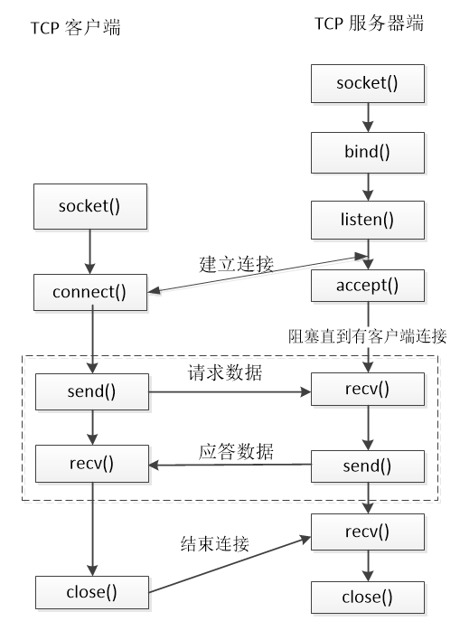

# 网络编程，你应该掌握哪些 socket 函数

Windows 和 Linux 上常用的 socket API 函数并不多，除了特定操作系统提供的一些基于自身系统特性的 API， 大多数 Socket API 都源于
BSD Socket （即伯克利套接字（Berkeley Sockets）），因此这些 socket 函数在不同的平台有着相似的签名和参数。

经常有想学习网络编程的新人询问要掌握哪些基础的 socket API，我这里给一个简单的函数列表，列表中给出的都是应该熟练掌握的
socket 函数。

常用 Berkeley Sockets API 一览表

| 函数名称          | 函数简单描述                       | 附加说明                        |
|---------------|------------------------------|-----------------------------|
| socket        | 创造某种类型的套接字                   |                             |
| bind          | 将一个 socket 绑定到一个 ip 与端口的二元组上 |                             |
| listen        | 将一个 socket 变为侦听状态            |                             |
| connect       | 试图建立一个 TCP 连接                | 一般用于客户端                     |
| accept        | 尝试接收一个连接                     | 一般用于服务端                     |
| send          | 通过一个 socket 发送数据             |                             |
| recv          | 通过一个socket 收取数据              |                             |
| select        | 判断一组 socket 上的读写和异常事件        |                             |
| gethostbyname | 通过域名获取机器地址                   |                             |
| close         | 关闭一个套接字，回收该 socket 对应的资源	    | Windows 系统中对应的是 closesocket |
| shutdown      | 关闭 socket 收或发通道              |                             |
| setsockopt    | 设置一个套接字选项                    |                             |
| getsockopt    | 获取一个套接字选项                    |                             |

对于某个 socket 函数，如果你想查看它的用法，可以通过相应的帮助文档。

## Linux 系统查看 socket 函数帮助
如果是 Linux 系统，你可以通过 man 手册去查看相应的函数签名和用法。举个例子，如果你要查看 connect 函数的用法，只需要在 Linux shell 终端输入 man connect 即可。

```shell
[root@localhost ~]# man connect
CONNECT(2)                                                          Linux Programmer's Manual                                                         CONNECT(2)

NAME
       connect - initiate a connection on a socket

SYNOPSIS
       #include <sys/types.h>          /* See NOTES */
       #include <sys/socket.h>

       int connect(int sockfd, const struct sockaddr *addr,
                   socklen_t addrlen);

DESCRIPTION
       The connect() system call connects the socket referred to by the file descriptor sockfd to the address specified by addr.  The addrlen argument specifies
       the size of addr.  The format of the address in addr is determined by the address space of the socket sockfd; see socket(2) for further details.

       If the socket sockfd is of type SOCK_DGRAM then addr is the address to which datagrams are sent by default, and the only address from which datagrams are
       received.   If  the  socket  is of type SOCK_STREAM or SOCK_SEQPACKET, this call attempts to make a connection to the socket that is bound to the address
       specified by addr.

       Generally, connection-based protocol sockets may successfully connect() only once; connectionless protocol sockets may use connect()  multiple  times  to
       change  their  association.  Connectionless sockets may dissolve the association by connecting to an address with the sa_family member of sockaddr set to
       AF_UNSPEC (supported on Linux since kernel 2.2).

RETURN VALUE
       If the connection or binding succeeds, zero is returned.  On error, -1 is returned, and errno is set appropriately.

ERRORS
       The following are general socket errors only.  There may be other domain-specific error codes.

       EACCES For UNIX domain sockets, which are identified by pathname: Write permission is denied on the socket file, or search permission is denied  for  one
              of the directories in the path prefix.  (See also path_resolution(7).)

       EACCES, EPERM
              The  user  tried  to connect to a broadcast address without having the socket broadcast flag enabled or the connection request failed because of a
              local firewall rule.

       EADDRINUSE
              Local address is already in use.
```

如上面的代码片段所示，man手册对于一个函数的说明一般包括如下几部分：

- 函数声明及相关数据结构所在的头文件，你实际编码时如果需要使用这个函数必须包含该头文件；

- 函数的签名，即该函数的参数类型、个数和返回值；

- 函数用法说明，并可能包括一些注意事项；

- 函数返回值说明；

- 调用函数出错可能得到的错误码值；

- 一些相关函数在 man 手册的位置索引。（connect 没有这个部分）

如下图所示：


需要注意的是，这个方法不仅可以查 socket 函数也可以查看 Linux 下其他通用函数（如 fread）甚至一个 shell 命令（如 sleep）。以 sleep 为例，如果你想查程序中 sleep 函数的用法，由于Linux 内置有一个叫 sleep 的 shell 命令，如果你在 shell 窗口直接输入 man sleep，显示出来的默认会是 sleep 命令而不是我们要的 sleep 函数的帮助信息。


可以通过 man man 命令查看一下 man 手册组成部分：
```shell
[root@localhost ~]# man man
## 无关的部分，省略...
The table below shows the section numbers of the manual followed by the types of pages they contain.

1   Executable programs or shell commands
2   System calls (functions provided by the kernel)
3   Library calls (functions within program libraries)
4   Special files (usually found in /dev)
5   File formats and conventions eg /etc/passwd
6   Games
7   Miscellaneous (including macro packages and conventions), e.g. man(7), groff(7)
8   System administration commands (usually only for root)
9   Kernel routines [Non standard]

A manual page consists of several sections.
```

通过上面的代码片段，我们可以看出来，man 手册的内容总共有9部分组成，而 sleep 函数属于上面的 Section 3，所以我们输入 man 3 sleep 就可以查看 sleep 函数的帮助信息了：

```shell
[root@localhost ~]# man 3 sleep
SLEEP(3)                                                            Linux Programmer's Manual                                                           SLEEP(3)

NAME
       sleep - sleep for the specified number of seconds

SYNOPSIS
       #include <unistd.h>

       unsigned int sleep(unsigned int seconds);

DESCRIPTION
       sleep() makes the calling thread sleep until seconds seconds have elapsed or a signal arrives which is not ignored.

RETURN VALUE
       Zero if the requested time has elapsed, or the number of seconds left to sleep, if the call was interrupted by a signal handler.

CONFORMING TO
       POSIX.1-2001.

BUGS
       sleep() may be implemented using SIGALRM; mixing calls to alarm(2) and sleep() is a bad idea.

       Using longjmp(3) from a signal handler or modifying the handling of SIGALRM while sleeping will cause undefined results.

SEE ALSO
       alarm(2), nanosleep(2), signal(2), signal(7)

COLOPHON
       This  page  is  part of release 3.53 of the Linux man-pages project.  A description of the project, and information about reporting bugs, can be found at
       http://www.kernel.org/doc/man-pages/.
```

## Windows 上查看 socket 函数帮助
Windows 也有类似 man 手册的帮助文档，早些年 Visual Studio 会自带一套离线的 MSDN 文档库，其优点就是不需要电脑联网，缺点是占磁盘空间比较大，内容陈旧。在手机网络都如此普及的今天，还是建议使用在线版本的 MSDN。查看 Windows API 的帮助链接是：https://docs.microsoft.com/en-us/windows/desktop/，在页面的搜索框中输入你想要搜索的 API 函数即可。

> 需要注意的是，建议读者在页面的底部将页面语言设置成English，这样搜索出来的内容会更准确更丰富。如下图所示：

还是以 connect 函数为例，在上述页面的搜索框中输入 socket connect ，然后回车，得到一组搜索结果，我们选择我们需要的页面，打开链接：https://docs.microsoft.com/en-us/windows/desktop/api/winsock2/nf-winsock2-connect。与简陋的 man 手册相比，MSDN 关于connect 函数的说明就比较详细了，大体也分为以下几部分：

- Syntax， 即函数签名，函数的参数类型、个数和返回值；

- Parameters，参数的用法详细说明；

- Return Value， 函数的返回值说明，在返回值部分，还有如果函数调用失败详细的错误码说明信息；

- Remarks，这部分就是该函数的详细用法说明，某些函数还会给出示例代码；

- Requirements，这部分指的是要使用这个函数，操作系统的版本要求，代码需要引入的头文件和库文件（如果有的话）。

- See Also， 这部分一般是一些相关函数和知识点的链接信息。

需要注意的是，在 MSDN 上阅读相关 API 的帮助信息时，你要辩证性地对待其提供的信息，因为很多函数的实际工作原理和行为并不一定如 MSDN 介绍的那样。所以在有些 API 帮助下面会有一些评论信息，这些评论信息或对文档内容做一些补充或纠错，或给出一些代码示例。建议实际查阅时，留意一下这部分信息，或许能得到一些很有用的帮助。

# TCP 网络通信的基本流程
不管多么复杂的服务器或客户端程序，其网络通信的基本原理一定如下所述：

对于服务器，其通信流程一般有如下步骤：

```shell
1. 调用 socket 函数创建 socket（侦听socket）
2. 调用 bind 函数 将 socket绑定到某个ip和端口的二元组上
3. 调用 listen 函数 开启侦听
4. 当有客户端请求连接上来后，调用 accept 函数接受连接，产生一个新的 socket（客户端 socket）
5. 基于新产生的 socket 调用 send 或 recv 函数开始与客户端进行数据交流
6. 通信结束后，调用 close 函数关闭侦听 socket
```

对于客户端，其通信流程一般有如下步骤：
```shell
1. 调用 socket函数创建客户端 socket
2. 调用 connect 函数尝试连接服务器
3. 连接成功以后调用 send 或 recv 函数开始与服务器进行数据交流
4. 通信结束后，调用 close 函数关闭侦听socket
```



对于上面的图，读者可能有疑问，为什么客户端调用 close() ，会和服务器端 recv() 函数有关。这个涉及到 recv() 函数的返回值意义，我们在下文中详细讲解。

服务器端实现代码：
```c
/**
 * TCP服务器通信基本流程
 */
#include <sys/types.h> 
#include <sys/socket.h>
#include <arpa/inet.h>
#include <unistd.h>
#include <iostream>
#include <string.h>

int main(int argc, char* argv[])
{
    //1.创建一个侦听socket
    int listenfd = socket(AF_INET, SOCK_STREAM, 0);
    if (listenfd == -1)
    {
        std::cout << "create listen socket error." << std::endl;
        return -1;
    }

    //2.初始化服务器地址
    struct sockaddr_in bindaddr;
    bindaddr.sin_family = AF_INET;
    bindaddr.sin_addr.s_addr = htonl(INADDR_ANY);
    bindaddr.sin_port = htons(3000);
    if (bind(listenfd, (struct sockaddr *)&bindaddr, sizeof(bindaddr)) == -1)
    {
        std::cout << "bind listen socket error." << std::endl;
        return -1;
    }

	//3.启动侦听
    if (listen(listenfd, SOMAXCONN) == -1)
    {
        std::cout << "listen error." << std::endl;
        return -1;
    }

    while (true)
    {
        struct sockaddr_in clientaddr;
        socklen_t clientaddrlen = sizeof(clientaddr);
		//4. 接受客户端连接
        int clientfd = accept(listenfd, (struct sockaddr *)&clientaddr, &clientaddrlen);
        if (clientfd != -1)
        {         	
			char recvBuf[32] = {0};
			//5. 从客户端接收数据
			int ret = recv(clientfd, recvBuf, 32, 0);
			if (ret > 0) 
			{
				std::cout << "recv data from client, data: " << recvBuf << std::endl;
				//6. 将收到的数据原封不动地发给客户端
				ret = send(clientfd, recvBuf, strlen(recvBuf), 0);
				if (ret != strlen(recvBuf))
					std::cout << "send data error." << std::endl;
				else
					std::cout << "send data to client successfully, data: " << recvBuf << std::endl;
			} 
			else 
			{
				std::cout << "recv data error." << std::endl;
			}
			
			close(clientfd);
        }
    }
	
	//7.关闭侦听socket
	close(listenfd);

    return 0;
}
```

客户端实现代码：
```c
/**
 * TCP客户端通信基本流程
 */
#include <sys/types.h> 
#include <sys/socket.h>
#include <arpa/inet.h>
#include <unistd.h>
#include <iostream>
#include <string.h>

#define SERVER_ADDRESS "127.0.0.1"
#define SERVER_PORT     3000
#define SEND_DATA       "helloworld"

int main(int argc, char* argv[])
{
    //1.创建一个socket
    int clientfd = socket(AF_INET, SOCK_STREAM, 0);
    if (clientfd == -1)
    {
        std::cout << "create client socket error." << std::endl;
        return -1;
    }

    //2.连接服务器
    struct sockaddr_in serveraddr;
    serveraddr.sin_family = AF_INET;
    serveraddr.sin_addr.s_addr = inet_addr(SERVER_ADDRESS);
    serveraddr.sin_port = htons(SERVER_PORT);
    if (connect(clientfd, (struct sockaddr *)&serveraddr, sizeof(serveraddr)) == -1)
    {
        std::cout << "connect socket error." << std::endl;
        return -1;
    }

	//3. 向服务器发送数据
	int ret = send(clientfd, SEND_DATA, strlen(SEND_DATA), 0);
	if (ret != strlen(SEND_DATA))
	{
		std::cout << "send data error." << std::endl;
		return -1;
	}
	
	std::cout << "send data successfully, data: " << SEND_DATA << std::endl;
	
	//4. 从服务器收取数据
	char recvBuf[32] = {0};
	ret = recv(clientfd, recvBuf, 32, 0);
	if (ret > 0) 
	{
		std::cout << "recv data successfully, data: " << recvBuf << std::endl;
	} 
	else 
	{
		std::cout << "recv data error, data: " << recvBuf << std::endl;
	}
	
	//5. 关闭socket
	close(clientfd);

    return 0;
}
```

以上代码，服务器端在地址 0.0.0.0:3000 启动一个侦听，客户端连接服务器成功后，给服务器发送字符串"helloworld"；服务器收到后，将收到的字符串原封不动地发给客户端。

在 Linux Shell 界面输入以下命令编译服务器端和客户端：
```c++
# 编译 server.cpp 生成可执行文件 server   
[root@localhost testsocket]# g++ -g -o server server.cpp
# 编译 client.cpp 生成可执行文件 client
[root@localhost testsocket]# g++ -g -o client client.cpp
```

# 设计跨平台网络通信库时需要注意的一些 socket 函数用法
这里说的跨平台，指的是在 Windows 和 Linux 使用相关 socket 函数，虽然二者的设计均参考 Berkeley Sockets，但是二者在演化的过程中还是存在不少区别。

## socket 数据类型
Windows 上一个 socket 对象其类型是 SOCKET，这是一个句柄对象（本质上也是一个 int 类型），Linux 上一个 socket 对象是 int 类型，习惯上在 Windows 上称为“socket”，在 Linux 上称为 fd。所以在很多网络库中使用如下定义来包裹出一个跨平台使用的 socket 类型：

```c++
#ifdef WIN32
typedef SOCKET SOCKET_TYPE;
#else
typedef int    SOCKET_TYPE;
#endif
```

这样就可以同时在 Windows 和 Linux 使用 SOCKET_TYPE 这个类型代表 socket 了。

无论是 Windows 还是 Linux，创建一个套接字的函数 socket() 调用失败均会返回 -1，Windows 为这种情形定义了一个宏：

> #define INVALID_HANDLE_VALUE (-1)

Linux 不存在，可以自己通过上述语句定义之。


## Windows 系统调用相关 socket 函数需要先初始化 socket 相关 dll 文件
Linux 程序可以直接使用相关 socket 函数，但是对于 Windows 平台必须先调用 WSAStartup() 函数显式将与 socket 相关的 dll 加载到进程地址空间来，程序退出时，需要调用 WSACleanup() 卸载相关 dll。

这两个函数的用法示例如下：
```c++
//程序初始化时调用
bool InitSocket()
{
	//指定版本号
	WORD wVersionRequested = MAKEWORD(2, 2);
	WSADATA wsaData;
	int nErrorID = ::WSAStartup(wVersionRequested, &wsaData);
	if(nErrorID != 0)
		return false;

    if (LOBYTE(wsaData.wVersion) != 2 || HIBYTE(wsaData.wVersion) != 2)
    {
        UnInitSocket();
        return false;
    }

	return TRUE;
}

//程序退出时调用
void UnInitSocket()
{
	::WSACleanup();
}
```

需要注意的是 WSAStartup() 和 WSACleanup() 是进程相关的，任何一个线程都可以调用，对于 WSAStartup() 函数某个线程调用一次之后，其他线程就可以正常使用了；反过来，如果某个线程自己不再使用相关 socket 函数，如果其调用 WSACleanup() 函数，会导致其他线程无法继续使用相关 socket 函数。因为，你调用 WSACleanup() 函数之前应该确保整个程序不再有使用 socket 函数的地方。鉴于此，一般在进程退出时才调用该函数。

## 关闭 socket 函数
由于历史原因，Windows 从来没有以良好兼容的方式实现 Berkeley 套接字 API。关闭套接字的接口，在 Linux(Unix) 中使用 close() 函数，在Windows 中使用 **closesocket() ** 函数，问题是 Windows 也定义了一个 close() 函数，且该函数还不能用于关闭 socket。如果调用该函数关闭 socket，会导致程序崩溃。这是让很多开发者容易犯错的地方。我们可以这样进行包装一下：

```c++
#ifndef WIN32
#define closesocket(s) close(s)
#endif
```

这样我们在 Linux 平台也可以使用 closesocket 来关闭 socket 了。

## 获取 socket 函数错误码
如果某个 socket 函数调用失败，Windows 上需要调用 WSAGetLastError() 获取错误码，Linux 直接使用 errno 变量获取错误码，所以你可能会在一些网络库中看到如下代码：

```c++
#ifdef WIN32
#define GetSocketError() ::WSAGetLastError();
#else
#define GetSocketError() errno;
#endif
```

这样就可以使用 GetSocketError() 函数统一进行处理了。

我们看下 libevent 网络库在这一块的相关实现。

```c++
//Windows上获取一个socket错误码的实现
#ifdef _WIN32
int evutil_socket_geterror(evutil_socket_t sock)
{
	int optval, optvallen=sizeof(optval);
	int err = WSAGetLastError();
	if (err == WSAEWOULDBLOCK && sock >= 0) {
		//不仅使用了WSAGetLastError，还通过 getsocketopt 选项来获取错误
		if (getsockopt(sock, SOL_SOCKET, SO_ERROR, (void*)&optval,
					   &optvallen))
			return err;
		if (optval)
			return optval;
	}
	return err;
}
#endif
```

```c++
//Linux 上设置错误码
#define EVUTIL_SET_SOCKET_ERROR(errcode)		\
		do { errno = (errcode); } while (0)
```

```c++
//Windows上把错误码转换成错误描述信息的函数实现
/** Equivalent to strerror, but for windows socket errors. */
const char *evutil_socket_error_to_string(int errcode)
{
	struct cached_sock_errs_entry *errs, *newerr, find;
	char *msg = NULL;

	EVLOCK_LOCK(windows_socket_errors_lock_, 0);

	find.code = errcode;
	errs = HT_FIND(cached_sock_errs_map, &windows_socket_errors, &find);
	if (errs) {
		msg = errs->msg;
		goto done;
	}

	if (0 != FormatMessageA(FORMAT_MESSAGE_FROM_SYSTEM |
			       FORMAT_MESSAGE_IGNORE_INSERTS |
			       FORMAT_MESSAGE_ALLOCATE_BUFFER,
			       NULL, errcode, 0, (char *)&msg, 0, NULL))
		chomp (msg);	/* because message has trailing newline */
	else {
		size_t len = 50;
		/* use LocalAlloc because FormatMessage does */
		msg = LocalAlloc(LMEM_FIXED, len);
		if (!msg) {
			msg = (char *)"LocalAlloc failed during Winsock error";
			goto done;
		}
		evutil_snprintf(msg, len, "winsock error 0x%08x", errcode);
	}

	newerr = (struct cached_sock_errs_entry *)
		mm_malloc(sizeof (struct cached_sock_errs_entry));

	if (!newerr) {
		LocalFree(msg);
		msg = (char *)"malloc failed during Winsock error";
		goto done;
	}

	newerr->code = errcode;
	newerr->msg = msg;
	HT_INSERT(cached_sock_errs_map, &windows_socket_errors, newerr);

 done:
	EVLOCK_UNLOCK(windows_socket_errors_lock_, 0);

	return msg;
}
```

```c++
//Linux 上就比较简单了，直接调用strerror函数传入错误码即可
#define evutil_socket_error_to_string(errcode) (strerror(errcode))
```

libevent 提供了这些宏访问和操作 socket 错误代码，evutil_socket_geterror() 则返回某特定套接字的错误号，在类 Unix 系统中 EVUTIL_SET_SOCKET_ERROR() 修改当前套接字错误号，evutil_socket_error_to_string() 返回代表某给定套接字错误号的字符串。

## 套接字函数返回值
无论是 Windows 还是 Linux，大多数 socket 函数调用失败后会返回 -1，在 Windows 系统上为这种情形专门定义了一个宏 SOCKET_ERROR。

> #define SOCKET_ERROR (-1)

可以为 Linux 上也定义这样一个宏，这样就方便统一书写了：

```c++
#ifndef WIN32
#define SOCKET_ERROR (-1)
#endif
```

## select 函数第一个参数问题
select 函数的原型是：

```c++
int select(int nfds, 
   	   fd_set *readfds,
          fd_set *writefds,
          fd_set *exceptfds,
          struct timeval *timeout);
```

使用示例：
```c++
fd_set writeset;
FD_ZERO(&writeset);
FD_SET(m_hSocket, &writeset);
struct timeval tv;
tv.tv_sec = 3;
tv.tv_usec = 100;
select(m_hSocket + 1, NULL, &writeset, NULL, &tv);
```

无论是 Windows 还是 Linux，这个函数的 readfds、writefds 和 exceptfds 参数都是一个包含一组 socket 描述符数组的结构体。在 Linux 下，第一个参数必须设置成这三个参数中，所有 socket 描述符句柄中的最大值加 1；但是 Windows 的 select 函数不使用第一个参数，可以随意设置，纯粹是为了保持与 Berkeley 套接字兼容才保留了这个参数。一般为了兼容，在 Windows 上也会将这个参数的值设置为这三个 fd_set 集合中最大套接字值加 1。

## 关于错误码 WSAEWOULDBLOCK 和 EWOULDBLOCK
对于某些套接字函数操作不能立即完成，Windows 上的错误码 WSAEWOULDBLOCK， 在 Linux 上对应 EWOULDBLOCK（Linux 还存在一个 EAGAIN 错误码与此同义）。

为了统一写法，我们可以在 Windows 上使用如下代码来兼容：
```c++
#ifdef WIN32
#define EWOULDBLOCK WSAEWOULDBLOCK
#endif
```

其他套接字函数

对于 IO 复用函数，Windows 和 Linux 都支持 select 函数，此外 Linux 有特有的 poll、epoll 模型，Windows 有 WSAPoll 函数和完成端口模型（IOCP）。

另外，Windows 和 Linux 上有许多自己特有的函数和网络通信模型，Windows 自我扩展的套接字函数一般以 WSA 开头（Windows Socket API 的缩写），例如 WSASend、WSARecv等等，Windows 上提供了方便的 WSAEventSelect 模式和 WSAAsyncSelect 等网络通信模型。Linux 上有 accept4、socketpair 等方便的函数。总之，二者的发展也是相互借鉴，无所谓孰优孰劣。

# bind 函数重难点分析
bind 函数如何选择绑定地址，看一下相关的代码：
```c++
struct sockaddr_in bindaddr;
bindaddr.sin_family = AF_INET;
bindaddr.sin_addr.s_addr = htonl(INADDR_ANY);
bindaddr.sin_port = htons(3000);
if (bind(listenfd, (struct sockaddr *)&bindaddr, sizeof(bindaddr)) == -1)
{
	std::cout << "bind listen socket error." << std::endl;
	return -1;
}
```

其中 bind 的地址我们使用了一个宏叫 INADDR_ANY ，关于这个宏的解释如下：

> If an application does not care what local address is assigned, specify the constant value INADDR_ANY for an IPv4 local address or the constant value in6addr_any for an IPv6 local address in the sa_data member of the name parameter. This allows the underlying service provider to use any appropriate network address, potentially simplifying application programming in the presence of multihomed hosts (that is, hosts that have more than one network interface and address).

意译一下：

> 如果应用程序不关心bind绑定的ip地址，可以使用INADDR_ANY(如果是IPv6，则对应in6addr_any)，这样底层的（协议栈）服务会自动选择一个合适的ip地址，这样使在一个有多个网卡机器上选择ip地址问题变得简单。

也就是说 INADDR_ANY 相当于地址 0.0.0.0。这里我举个例子，假设我们在一台机器上开发一个服务器程序，使用 bind 函数时，我们有多个ip 地址可以选择。首先，这台机器的外网 ip 地址是 120.55.94.78，这台机器在当前局域网的地址是 192.168.1.104；同时这台机器有本地回环地址127.0.0.1。

如果读者只想本机上可以访问，那么 bind 函数中的地址就可以使用127.0.0.1; 如果服务只想被局域网内部机器访问，bind 函数的地址可以使用192.168.1.104 这样的局域网地址；如果希望这个服务可以被公网访问，你就可以使用地址 **0.0.0.0** 或 INADDR_ANY。

## bind 函数端口号问题
网络通信程序的基本逻辑是客户端连接服务器，即从客户端的地址:端口连接到服务器地址:端口上，服务器端的端口号使用 3000，那客户端连接时的端口号是多少呢？TCP 通信双方中一般服务器端端口号是固定的，而客户端端口号是连接发起时由操作系统随机分配的（不会分配已经被占用的端口）。端口号是一个 C short 类型的值，其范围是0～65535，知道这点很重要，所以我们在编写压力测试程序时，由于端口数量的限制，在某台机器上网卡地址不变的情况下压力测试程序理论上最多只能发起六万五千多个连接。注意我说的是理论上，在实际情况下，由于当时的操作系统很多端口可能已经被占用，实际可以使用的端口比这个更少，例如，一般规定端口号在1024以下的端口是保留端口，不建议用户程序使用。而对于 Windows 系统，MSDN 甚至明确地说：

```text
On Windows Vista and later, the dynamic client port range is a value between 49152 and 65535. This is a change from Windows Server 2003 and earlier where the dynamic client port range was a value between 1025 and 5000.
Vista 及以后的Windows，可用的动态端口范围是49152～65535，而 Windows Server及更早的系统，可以的动态端口范围是1025~5000。（你可以通过修改注册表来改变这一设置，参考网址：https://docs.microsoft.com/en-us/windows/desktop/api/winsock/nf-winsock-bind）
```

如果将 bind 函数中的端口号设置成0，那么操作系统会随机给程序分配一个可用的侦听端口，当然服务器程序一般不会这么做，因为服务器程序是要对外服务的，必须让客户端知道确切的ip地址和端口号。

很多人觉得只有服务器程序可以调用 bind 函数绑定一个端口号，其实不然，在一些特殊的应用中，我们需要客户端程序以指定的端口号去连接服务器，此时我们就可以在客户端程序中调用 bind 函数绑定一个具体的端口。

用代码来实际验证一下上路所说的，为了能看到连接状态，我们将客户端和服务器关闭socket的代码注释掉，这样连接会保持一段时间。

- 情形一：客户端代码不绑定端口

修改后的服务器代码如下：
```c++
/**
 * TCP服务器通信基本流程
 */
#include <sys/types.h> 
#include <sys/socket.h>
#include <arpa/inet.h>
#include <unistd.h>
#include <iostream>
#include <string.h>
#include <vector>

int main(int argc, char* argv[])
{
    //1.创建一个侦听socket
    int listenfd = socket(AF_INET, SOCK_STREAM, 0);
    if (listenfd == -1)
    {
        std::cout << "create listen socket error." << std::endl;
        return -1;
    }

    //2.初始化服务器地址
    struct sockaddr_in bindaddr;
    bindaddr.sin_family = AF_INET;
    bindaddr.sin_addr.s_addr = htonl(INADDR_ANY);
    bindaddr.sin_port = htons(3000);
    if (bind(listenfd, (struct sockaddr *)&bindaddr, sizeof(bindaddr)) == -1)
    {
        std::cout << "bind listen socket error." << std::endl;
        return -1;
    }

	//3.启动侦听
    if (listen(listenfd, SOMAXCONN) == -1)
    {
        std::cout << "listen error." << std::endl;
        return -1;
    }
	
	//记录所有客户端连接的容器
	std::vector<int> clientfds;
    while (true)
    {
        struct sockaddr_in clientaddr;
        socklen_t clientaddrlen = sizeof(clientaddr);
		//4. 接受客户端连接
        int clientfd = accept(listenfd, (struct sockaddr *)&clientaddr, &clientaddrlen);
        if (clientfd != -1)
        {         	
			char recvBuf[32] = {0};
			//5. 从客户端接受数据
			int ret = recv(clientfd, recvBuf, 32, 0);
			if (ret > 0) 
			{
				std::cout << "recv data from client, data: " << recvBuf << std::endl;
				//6. 将收到的数据原封不动地发给客户端
				ret = send(clientfd, recvBuf, strlen(recvBuf), 0);
				if (ret != strlen(recvBuf))
					std::cout << "send data error." << std::endl;
				
				std::cout << "send data to client successfully, data: " << recvBuf << std::endl;
			} 
			else 
			{
				std::cout << "recv data error." << std::endl;
			}
			
			//close(clientfd);
			clientfds.push_back(clientfd);
        }
    }
	
	//7.关闭侦听socket
	close(listenfd);

    return 0;
}
```

修改后的客户端代码如下：
```c++
/**
 * TCP客户端通信基本流程
 */
#include <sys/types.h> 
#include <sys/socket.h>
#include <arpa/inet.h>
#include <unistd.h>
#include <iostream>
#include <string.h>

#define SERVER_ADDRESS "127.0.0.1"
#define SERVER_PORT     3000
#define SEND_DATA       "helloworld"

int main(int argc, char* argv[])
{
    //1.创建一个socket
    int clientfd = socket(AF_INET, SOCK_STREAM, 0);
    if (clientfd == -1)
    {
        std::cout << "create client socket error." << std::endl;
        return -1;
    }

    //2.连接服务器
    struct sockaddr_in serveraddr;
    serveraddr.sin_family = AF_INET;
    serveraddr.sin_addr.s_addr = inet_addr(SERVER_ADDRESS);
    serveraddr.sin_port = htons(SERVER_PORT);
    if (connect(clientfd, (struct sockaddr *)&serveraddr, sizeof(serveraddr)) == -1)
    {
        std::cout << "connect socket error." << std::endl;
        return -1;
    }

	//3. 向服务器发送数据
	int ret = send(clientfd, SEND_DATA, strlen(SEND_DATA), 0);
	if (ret != strlen(SEND_DATA))
	{
		std::cout << "send data error." << std::endl;
		return -1;
	}
	
	std::cout << "send data successfully, data: " << SEND_DATA << std::endl;
	
	//4. 从客户端收取数据
	char recvBuf[32] = {0};
	ret = recv(clientfd, recvBuf, 32, 0);
	if (ret > 0) 
	{
		std::cout << "recv data successfully, data: " << recvBuf << std::endl;
	} 
	else 
	{
		std::cout << "recv data error, data: " << recvBuf << std::endl;
	}
	
	//5. 关闭socket
	//close(clientfd);
	//这里仅仅是为了让客户端程序不退出
	while (true) 
	{
		sleep(3);
	}

    return 0;
}
```

将程序编译好后，先启动server，再启动三个客户端。然后通过 lsof 命令查看当前机器上的 TCP 连接信息，为了更清楚地显示结果，已经将不相关的连接信息去掉了，结果如下所示：
```shell
[root@localhost ~]# lsof -i -Pn
COMMAND   PID USER   FD   TYPE DEVICE SIZE/OFF NODE NAME
server   1445 root    3u  IPv4  21568      0t0  TCP *:3000 (LISTEN)
server   1445 root    4u  IPv4  21569      0t0  TCP 127.0.0.1:3000->127.0.0.1:40818 (ESTABLISHED)
server   1445 root    5u  IPv4  21570      0t0  TCP 127.0.0.1:3000->127.0.0.1:40820 (ESTABLISHED)
server   1445 root    6u  IPv4  21038      0t0  TCP 127.0.0.1:3000->127.0.0.1:40822 (ESTABLISHED)
client   1447 root    3u  IPv4  21037      0t0  TCP 127.0.0.1:40818->127.0.0.1:3000 (ESTABLISHED)
client   1448 root    3u  IPv4  21571      0t0  TCP 127.0.0.1:40820->127.0.0.1:3000 (ESTABLISHED)
client   1449 root    3u  IPv4  21572      0t0  TCP 127.0.0.1:40822->127.0.0.1:3000 (ESTABLISHED)
```

上面的结果显示，server 进程（进程 ID 是 1445）在 3000 端口开启侦听，有三个 client 进程（进程 ID 分别是1447、1448、1449）分别通过端口号 40818、40820、40822 连到 server 进程上的，作为客户端的一方，端口号是系统随机分配的。

- 情形二：客户端绑定端口号 0

服务器端代码保持不变，修改下客户端代码：
```c++
/**
 * TCP客户端通信基本流程
 */
#include <sys/types.h> 
#include <sys/socket.h>
#include <arpa/inet.h>
#include <unistd.h>
#include <iostream>
#include <string.h>

#define SERVER_ADDRESS "127.0.0.1"
#define SERVER_PORT     3000
#define SEND_DATA       "helloworld"

int main(int argc, char* argv[])
{
    //1.创建一个socket
    int clientfd = socket(AF_INET, SOCK_STREAM, 0);
    if (clientfd == -1)
    {
        std::cout << "create client socket error." << std::endl;
        return -1;
    }
	
    struct sockaddr_in bindaddr;
    bindaddr.sin_family = AF_INET;
    bindaddr.sin_addr.s_addr = htonl(INADDR_ANY);
	//将socket绑定到0号端口上去
    bindaddr.sin_port = htons(0);
    if (bind(clientfd, (struct sockaddr *)&bindaddr, sizeof(bindaddr)) == -1)
    {
        std::cout << "bind socket error." << std::endl;
        return -1;
    }

    //2.连接服务器
    struct sockaddr_in serveraddr;
    serveraddr.sin_family = AF_INET;
    serveraddr.sin_addr.s_addr = inet_addr(SERVER_ADDRESS);
    serveraddr.sin_port = htons(SERVER_PORT);
    if (connect(clientfd, (struct sockaddr *)&serveraddr, sizeof(serveraddr)) == -1)
    {
        std::cout << "connect socket error." << std::endl;
        return -1;
    }

	//3. 向服务器发送数据
	int ret = send(clientfd, SEND_DATA, strlen(SEND_DATA), 0);
	if (ret != strlen(SEND_DATA))
	{
		std::cout << "send data error." << std::endl;
		return -1;
	}
	
	std::cout << "send data successfully, data: " << SEND_DATA << std::endl;
	
	//4. 从客户端收取数据
	char recvBuf[32] = {0};
	ret = recv(clientfd, recvBuf, 32, 0);
	if (ret > 0) 
	{
		std::cout << "recv data successfully, data: " << recvBuf << std::endl;
	} 
	else 
	{
		std::cout << "recv data error, data: " << recvBuf << std::endl;
	}
	
	//5. 关闭socket
	//close(clientfd);
	//这里仅仅是为了让客户端程序不退出
	while (true) 
	{
		sleep(3);
	}

    return 0;
}
```

再次编译客户端程序，并启动三个 client 进程，然后用 lsof 命令查看机器上的 TCP 连接情况，结果如下所示：
```text
[root@localhost ~]# lsof -i -Pn
COMMAND   PID USER   FD   TYPE DEVICE SIZE/OFF NODE NAME
server   1593 root    3u  IPv4  21807      0t0  TCP *:3000 (LISTEN)
server   1593 root    4u  IPv4  21808      0t0  TCP 127.0.0.1:3000->127.0.0.1:44220 (ESTABLISHED)
server   1593 root    5u  IPv4  19311      0t0  TCP 127.0.0.1:3000->127.0.0.1:38990 (ESTABLISHED)
server   1593 root    6u  IPv4  21234      0t0  TCP 127.0.0.1:3000->127.0.0.1:42365 (ESTABLISHED)
client   1595 root    3u  IPv4  22626      0t0  TCP 127.0.0.1:44220->127.0.0.1:3000 (ESTABLISHED)
client   1611 root    3u  IPv4  21835      0t0  TCP 127.0.0.1:38990->127.0.0.1:3000 (ESTABLISHED)
client   1627 root    3u  IPv4  21239      0t0  TCP 127.0.0.1:42365->127.0.0.1:3000 (ESTABLISHED)
```

通过上面的结果，我们发现三个 client 进程使用的端口号仍然是系统随机分配的，也就是说绑定 0 号端口和没有绑定效果是一样的。

- 情形三：客户端绑定一个固定端口

这里使用 20000 端口，可以根据自己的喜好选择，只要保证所选择的端口号当前没有被其他程序占用即可，服务器代码保持不变，客户端绑定代码中的端口号从 0 改成 20000。修改处的代码如下：

```c++
struct sockaddr_in bindaddr;
bindaddr.sin_family = AF_INET;
bindaddr.sin_addr.s_addr = htonl(INADDR_ANY);
//将socket绑定到20000号端口上去
bindaddr.sin_port = htons(20000);
if (bind(clientfd, (struct sockaddr *)&bindaddr, sizeof(bindaddr)) == -1)
{
    std::cout << "bind socket error." << std::endl;
    return -1;
}
```

再次重新编译程序，先启动一个客户端后，我们看到此时的 TCP 连接状态：
```shell
[root@localhost testsocket]# lsof -i -Pn
COMMAND   PID USER   FD   TYPE DEVICE SIZE/OFF NODE NAME
server   1676 root    3u  IPv4  21933      0t0  TCP *:3000 (LISTEN)
server   1676 root    4u  IPv4  21934      0t0  TCP 127.0.0.1:3000->127.0.0.1:20000 (ESTABLISHED)
client   1678 root    3u  IPv4  21336      0t0  TCP 127.0.0.1:20000->127.0.0.1:3000 (ESTABLISHED)
```

通过上面的结果，发现 client 进程确实使用 20000 号端口连接到 server 进程上去了。这个时候如果我们再开启一个 client 进程，我们猜想由于端口号 20000 已经被占用，新启动的 client 会由于调用 bind 函数出错而退出，实际验证一下：
```shell
[root@localhost testsocket]# ./client 
bind socket error.
[root@localhost testsocket]# 
```

结果确实和预想的一样。

在技术面试的时候，有时候面试官会问 TCP 网络通信的客户端程序中的 socket 是否可以调用 bind 函数，那肯定是可以的。

另外，Linux 的 nc 命令有个 -p 选项（字母 p 是小写），这个选项的作用就是 nc 在模拟客户端程序时，可以使用指定端口号连接到服务器程序上去，实现原理相信读者也明白了。我们还是以上面的服务器程序为例，这个我们不用我们的 client 程序，改用 nc 命令来模拟客户端。在 shell 终端输入：

```shell
[root@localhost testsocket]# nc -v -p 9999 127.0.0.1 3000
Ncat: Version 6.40 ( http://nmap.org/ncat )
Ncat: Connected to 127.0.0.1:3000.
```

-v 选项表示输出 nc 命令连接的详细信息，这里连接成功以后，会输出“Ncat: Connected to 127.0.0.1:3000.” 提示已经连接到服务器的 3000 端口上去了。

-p 选项的参数值是 9999 表示，我们要求 nc 命令本地以端口号 9999 连接服务器，注意不要与端口号 3000 混淆，3000 是服务器的侦听端口号，也就是我们的连接的目标端口号，9999 是我们客户端使用的端口号。我们用 lsof 命令来验证一下我们的 nc 命令是否确实以 9999 端口号连接到 server 进程上去了。

```shell
[root@localhost testsocket]# lsof -i -Pn
COMMAND   PID USER   FD   TYPE DEVICE SIZE/OFF NODE NAME
server   1676 root    3u  IPv4  21933      0t0  TCP *:3000 (LISTEN)
server   1676 root    7u  IPv4  22405      0t0  TCP 127.0.0.1:3000->127.0.0.1:9999 (ESTABLISHED)
nc       2005 root    3u  IPv4  22408      0t0  TCP 127.0.0.1:9999->127.0.0.1:3000 (ESTABLISHED)
```

结果确实与预期的一致。

# select 函数用法和原理
select 函数是网络通信编程中非常常用的一个函数，我们应该熟练掌握它。虽然它是 BSD 标准之一的 Socket 函数之一，但在 Linux 和 Windows 平台，其行为表现还是有点区别的。我们先来看一下 Linux 平台上的 select 函数。

## Linux 平台下的 select 函数
select 函数的作用是检测一组 socket 中某个或某几个是否有“事件”就绪，这里的“事件”一般分为如下三类：

- 读事件就绪：
> 1. socket 内核中，接收缓冲区中的字节数大于等于低水位标记 SO_RCVLOWAT，此时调用 recv 或 read 函数可以无阻塞的读该文件描述符， 并且返回值大于 0；
> 2. TCP 连接的对端关闭连接，此时调用 recv 或 read 函数对该 socket 读返回 0 值 ；
> 3. 侦听 socket 上有新的连接请求；
> 4. socket 上有未处理的错误。

- 写事件就绪：
> 1. socket 内核中，发送缓冲区中的可用字节数(发送缓冲区的空闲位置大⼩) 大于等于低水位标记 SO_SNDLOWAT，此时可以无阻塞的写, 并且返回值大于 0；
> 2. socket 的写操作被关闭(调用了 close 或 shutdown 函数)（ 对一个写操作被关闭的 socket 进行写操作, 会触发 SIGPIPE 信号）；
> 3. socket 使⽤非阻塞 connect 连接成功或失败时。

- 异常事件就绪
> socket 上收到带外数据。

函数签名如下：
```c++
int select(int nfds, 
		   fd_set *readfds,
           fd_set *writefds,
           fd_set *exceptfds,
           struct timeval *timeout);
```

参数说明：

- 参数 nfds， Linux 下 socket 也称 fd，这个参数的值设置成所有需要使用 select 函数检测事件的 fd 中的最大 fd 值加 1。

- 参数 readfds，需要监听可读事件的 fd 集合。

- 参数 writefds，需要监听可写事件的 fd 集合。

- 参数 exceptfds，需要监听异常事件 fd 集合。

readfds、writefds 和 exceptfds 类型都是 fd_set，这是一个结构体信息，其定义位于 /usr/include/sys/select.h 中：

```c++
/* The fd_set member is required to be an array of longs.  */
typedef long int __fd_mask;

/* Some versions of <linux/posix_types.h> define this macros.  */
#undef  __NFDBITS
/* It's easier to assume 8-bit bytes than to get CHAR_BIT.  */
#define __NFDBITS       (8 * (int) sizeof (__fd_mask))
#define __FD_ELT(d)     ((d) / __NFDBITS)
#define __FD_MASK(d)    ((__fd_mask) 1 << ((d) % __NFDBITS))

/* fd_set for select and pselect.  */
typedef struct
  {
    /* XPG4.2 requires this member name.  Otherwise avoid the name
       from the global namespace.  */
#ifdef __USE_XOPEN
    __fd_mask fds_bits[__FD_SETSIZE / __NFDBITS];
# define __FDS_BITS(set) ((set)->fds_bits)
#else
	// 在我的centOS 7.0 系统中的值：
	// __FD_SETSIZE = 1024
	//__NFDBITS = 64
    __fd_mask __fds_bits[__FD_SETSIZE / __NFDBITS];	 
# define __FDS_BITS(set) ((set)->__fds_bits)
#endif
  } fd_set;

/* Maximum number of file descriptors in `fd_set'.  */
#define FD_SETSIZE              __FD_SETSIZE
```

假设未定义宏 __USE_XOPEN，将上面的代码整理一下：
```c++
typedef struct
{ 
    long int __fds_bits[16];	 
} fd_set;
```

将一个 fd 添加到 fd_set 这个集合中需要使用 FD_SET 宏，其定义如下：
```c++
void FD_SET(int fd, fd_set *set);
```

其实现如下：
```c++
#define FD_SET(fd,fdsetp) __FD_SET(fd,fdsetp)
```

FD_SET 在内部又是通过宏 __FD_SET 来实现的，__FD_SET 的定义如下（位于 /usr/include/bits/select.h 中）：
```c++
#if defined __GNUC__ && __GNUC__ >= 2

# if __WORDSIZE == 64
#  define __FD_ZERO_STOS "stosq"
# else
#  define __FD_ZERO_STOS "stosl"
# endif

# define __FD_ZERO(fdsp) \
  do {                                                                        \
    int __d0, __d1;                                                           \
    __asm__ __volatile__ ("cld; rep; " __FD_ZERO_STOS                         \
                          : "=c" (__d0), "=D" (__d1)                          \
                          : "a" (0), "0" (sizeof (fd_set)                     \
                                          / sizeof (__fd_mask)),              \
                            "1" (&__FDS_BITS (fdsp)[0])                       \
                          : "memory");                                        \
  } while (0)

#else   /* ! GNU CC */

/* We don't use `memset' because this would require a prototype and
   the array isn't too big.  */
# define __FD_ZERO(set)  \
  do {                                                                        \
    unsigned int __i;                                                         \
    fd_set *__arr = (set);                                                    \
    for (__i = 0; __i < sizeof (fd_set) / sizeof (__fd_mask); ++__i)          \
      __FDS_BITS (__arr)[__i] = 0;                                            \
  } while (0)

#endif  /* GNU CC */

#define __FD_SET(d, set) \
  ((void) (__FDS_BITS (set)[__FD_ELT (d)] |= __FD_MASK (d)))
#define __FD_CLR(d, set) \
  ((void) (__FDS_BITS (set)[__FD_ELT (d)] &= ~__FD_MASK (d)))
#define __FD_ISSET(d, set) \
  [((__FDS_BITS (set)[__FD_ELT (d)] & __FD_MASK (d)) != 0)
```

重点看下这两行：
```c++
#define __FD_SET(d, set)
  ((void) (__FDS_BITS (set)[__FD_ELT (d)] |= __FD_MASK (d)))
```

__FD_MASK 和 __FD_ELT 宏在上面的代码中已经给出定义：
```c++
  #define __FD_ELT(d)     ((d) / __NFDBITS)
  #define __FD_MASK(d)    ((__fd_mask) 1 << ((d) % __NFDBITS))
```

fd_set 数组的定义是：
```c++
  typedef struct
{ 
      long int __fds_bits[16];	//可以看成是128 bit的数组 
} fd_set;
```

__fds_bits 是 long int 型数组，long int 占 8 个字节，每个字节 8 bit，每个 bit 对应一个 fd 的事件状态，0 表示无事件，1 表示有事件，数组长度是 16，因此一共可以表示 8 * 8 * 16 = 1024 个 fd 的状态， 这是 select 函数支持的最大 fd 数量。

__FD_SET(d, set) 的实际操作是：

> __FDS_BITS (set)[__FD_ELT (d)] |= __FD_MASK (d)

__FD_ELT (d) 确定的是某个 fd（这里用 d 表示）在数组 __fds_bits 中的下标位置，计算方法是计算 fd 与 __NFDBITS 求商（__NFDBITS 值是 64 （8 * 8））。

__FD_MASK 计算对应 fd 在对应 bit 位置上的值，计算方法是先与 __NFDBITS 求余得到 n，然后执行 1 << n，即左移 n 位，然后将值设置到对应的 bit 上（ |= 操作）。

举个例子，假设现在 fd 的 值是 57，那么：
```c++
  FD_SET(57, set)
  实际调用：
  __fds_bits[__FD_ELT(57)] |= __FD_MASK(57)
  即
  __fds_bits[57 / 64] |= (1 << (57 % 64))
  即
  __fds_bits[0] |= （0000 0010 0000 0000 0000 0000 0000 0000 0000 0000 0000 0000 0000 0000 0000 0000）(二进制)
  即数组下标为0的元素（64 bit）中第 57 bit被置为 1（0~63位）
```

> Linux 系统上往 fd_set 集合中添加新的 fd 时决定这个 fd 在 __fds_bits 数组的位置的实现使用的是位图法（bitmap），Windows 系统上添加 fd 至 fd_set 的实现则是依次从数组第 0 个位置开始往后递增。

也就是说 FD_SET 宏的原理本质上是向一个有 1024 个连续 bit （共计 64 个字节）的内存的某个 bit 上设置一个标志。

同理，如果我们需要从 fd_set 上删除一个 fd，即对应的 bit 位置 0，我们可以使用 FD_CLR，其定义如下：

> void FD_CLR(int fd, fd_set *set);

如果，我们需要将 fd_set 中所有的 fd 都清掉，即将所有 bit 位置 0，可以使用宏 FD_ZERO：

> void FD_ZERO(fd_set *set);

### FD_ZERO
当 select 函数返回时， 我们使用 FD_ISSET 宏来判断某个 fd 是否有我们关心的事件，FD_ISSET 宏的定义如下：

>int  FD_ISSET(int fd, fd_set *set);

FD_ISSET 宏本质上就是检测对应的 bit 上是否置位，实现如下：
```c++
  #define __FD_ISSET(d, set) \
    ((__FDS_BITS (set)[__FD_ELT (d)] & __FD_MASK (d)) != 0)
```

这就是与 select 函数相关的几个宏的原理。示意图如下：


- 参数 timeout，超时时间，即在这个参数设定的时间内检测这些 fd 的事件，超过这个时间后 select 函数将立即返回。这是一个 timeval 类型结构体，其定义如下：

```c++
struct timeval 
{
	long    tv_sec;         /* seconds */
	long    tv_usec;        /* microseconds */
};
```

select 函数的总超时时间是 timeout->tv_sec 和 timeout->tv_usec 之和， 前者的时间单位是秒，后者的时间单位是微秒。

说了这么多理论知识，先看一个具体的示例：
```c++
/**
* select函数示例，server端, select_server.cpp
*/
#include <sys/types.h> 
#include <sys/socket.h>
#include <arpa/inet.h>
#include <unistd.h>
#include <iostream>
#include <string.h>
#include <sys/time.h>
#include <vector>
#include <errno.h>

//自定义代表无效fd的值
#define INVALID_FD -1

int main(int argc, char* argv[])
{
  //创建一个侦听socket
  int listenfd = socket(AF_INET, SOCK_STREAM, 0);
  if (listenfd == INVALID_FD)
  {
      std::cout << "create listen socket error." << std::endl;
      return -1;
  }

  //初始化服务器地址
  struct sockaddr_in bindaddr;
  bindaddr.sin_family = AF_INET;
  bindaddr.sin_addr.s_addr = htonl(INADDR_ANY);
  bindaddr.sin_port = htons(3000);
  if (bind(listenfd, (struct sockaddr *)&bindaddr, sizeof(bindaddr)) == -1)
  {
      std::cout << "bind listen socket error." << std::endl;
  	close(listenfd);
      return -1;
  }
  
  //启动侦听
  if (listen(listenfd, SOMAXCONN) == -1)
  {
      std::cout << "listen error." << std::endl;
  	close(listenfd);
      return -1;
  }
  
  //存储客户端socket的数组
  std::vector<int> clientfds;
  int maxfd;
  
  while (true) 
  {	
  	fd_set readset;
  	FD_ZERO(&readset);
  	
  	//将侦听socket加入到待检测的可读事件中去
  	FD_SET(listenfd, &readset);
  	
  	maxfd = listenfd;
  	//将客户端fd加入到待检测的可读事件中去
  	int clientfdslength = clientfds.size();
  	for (int i = 0; i < clientfdslength; ++i)
  	{
  		if (clientfds[i] != INVALID_FD)
  		{
  			FD_SET(clientfds[i], &readset);

  			if (maxfd < clientfds[i])
  				maxfd = clientfds[i];
  		}
  	}
  	
  	timeval tm;
  	tm.tv_sec = 1;
  	tm.tv_usec = 0;
  	//暂且只检测可读事件，不检测可写和异常事件
  	int ret = select(maxfd + 1, &readset, NULL, NULL, &tm);
  	if (ret == -1)
  	{
  		//出错，退出程序。
  		if (errno != EINTR)
  			break;
  	}
  	else if (ret == 0)
  	{
  		//select 函数超时，下次继续
  		continue;
  	} 
  	else
      {
  		//检测到某个socket有事件
  		if (FD_ISSET(listenfd, &readset))
  		{
  			//侦听socket的可读事件，则表明有新的连接到来
  			struct sockaddr_in clientaddr;
  			socklen_t clientaddrlen = sizeof(clientaddr);
  			//4. 接受客户端连接
  			int clientfd = accept(listenfd, (struct sockaddr *)&clientaddr, &clientaddrlen);
  			if (clientfd == INVALID_FD)					
  			{         	
  				//接受连接出错，退出程序
  				break;
  			}
  			
  			//只接受连接，不调用recv收取任何数据
  			std:: cout << "accept a client connection, fd: " << clientfd << std::endl;
  			clientfds.push_back(clientfd);
  		} 
  		else 
  		{
  			//假设对端发来的数据长度不超过63个字符
  			char recvbuf[64];
  			int clientfdslength = clientfds.size();
  			for (int i = 0; i < clientfdslength; ++i)
  			{
  				if (clientfds[i] != INVALID_FD && FD_ISSET(clientfds[i], &readset))
  				{				
  					memset(recvbuf, 0, sizeof(recvbuf));
  					//非侦听socket，则接收数据
  					int length = recv(clientfds[i], recvbuf, 64, 0);
  					if (length <= 0)
  					{
  						//收取数据出错了
  						std::cout << "recv data error, clientfd: " << clientfds[i] << std::endl;							
  						close(clientfds[i]);
  						//不直接删除该元素，将该位置的元素置位INVALID_FD
  						clientfds[i] = INVALID_FD;
  						continue;
  					}
  					
  					std::cout << "clientfd: " << clientfds[i] << ", recv data: " << recvbuf << std::endl;					
  				}
  			}
  			
  		}
  	}
  }
  
  //关闭所有客户端socket
  int clientfdslength = clientfds.size();
  for (int i = 0; i < clientfdslength; ++i)
  {
  	if (clientfds[i] != INVALID_FD)
  	{
  		close(clientfds[i]);
  	}
  }
  
  //关闭侦听socket
  close(listenfd);
  
  return 0;
}
```

编译并运行程序：
```shell
[root@localhost testsocket]# g++ -g -o select_server select_server.cpp 
[root@localhost testsocket]# ./select_server
```

然后，我们再多开几个 shell 窗口，我们这里不再专门编写客户端程序了，我们使用 Linux 下的 nc 指令模拟出两个客户端。

shell 窗口1，连接成功以后发送字符串 hello：

```shell
[root@localhost ~]# nc -v 127.0.0.1 3000
Connection to 127.0.0.1 port 3000 [tcp/hbci] succeeded!
hello
```

shell 窗口2，连接成功以后发送字符串 helloworld：

```shell
[root@localhost ~]# nc -v 127.0.0.1 3000
Connection to 127.0.0.1 port 3000 [tcp/hbci] succeeded!
helloworld
```

此时服务器端输出结果如下：
```shell
[root@localhost testsocket]#./select_server
accept a client connection, fd: 3
clientfd: 3, recv data: hello
accept a client connection, fd: 4
clientfd: 4, recv data: helloworld
```

注意，由于 nc 发送的数据是按换行符来区分的，每一个数据包默认的换行符以 **\n** 结束（当然，你可以 -C 选项换成 \r\n），所以服务器收到数据后，显示出来的数据每一行下面都有一个空白行。

当断开各个客户端连接时，服务器端 select 函数对各个客户端 fd 检测时，仍然会触发可读事件，此时对这些 fd 调用 recv 函数会返回 0（recv 函数返回0，表明对端关闭了连接，这些函数的返回值这是一个很重要的知识点），服务器端也关闭这些连接就可以了。

客户端断开连接后，服务器端的运行输出结果：
```c++
[root@localhost testsocket]#./select_server
recv data error, clientfd: 4
```

以上代码是一个简单的服务器程序实现的基本流程，代码虽然简单，但是非常具有典型性和代表性，而且同样适用于客户端网络通信，如果用于客户端的话，只需要用 select 检测连接 socket 就可以了，如果连接 socket 有可读事件，调用 recv 函数来接收数据，剩下的逻辑都是一样的。上面的代码画一张流程图如下：


关于上述代码在实际开发中有几个需要注意的事项，这里逐一来说明一下：

1. 正如上文介绍 select 函数相关宏所介绍的，select 函数调用前后可能会修改 readfds、writefds 和 exceptfds 这三个集合中的内容，所以如果读者想下次调用 select 函数时复用这些 fd_set 变量，记得在下次调用前使用 FD_ZERO 将 fd_set 清零，然后再调用 FD_SET 将需要检测事件的 fd 重新添加到 fd_set。

2. select 函数也会修改 timeval 结构体的值，这也要求我们如果想复用这个变量，必须给 timeval 变量重新设置值。

上面的例子中在调用 select 函数一次之后，变量 tv 的值也被修改了。具体修改成多少，得看系统的表现。当然这种特性却不是跨平台的，在 Linux 系统中是这样的，而在其他操作系统上却不一定是这样（Windows 上就不会修改这个结构体的值），这点在 Linux man 手册 select 函数的说明中说的很清楚：

> On  Linux,  select()  modifies timeout to reflect the amount of time not slept; most other implementations do not do this.(POSIX.1-2001 permits either behavior.)  This causes problems both when Linux code which reads timeout is ported to  other operating systems, and when code is ported to Linux that reuses a struct timeval for multiple select()s in a loop without reinitializing it.  Consider timeout to be undefined after select() returns.

由于不同系统的实现不一样，man 手册建议将 select 函数修改 timeval 结构体值的行为当作是未定义的，言下之意是如果你要下次使用 select 函数复用这个变量时，记得重新赋值。这是使用 select 函数需要注意的第二个地方。

3. select 函数的 timeval 结构体的 tv_sec 和 tv_usec 如果两个值设置为 0，即检测事件总时间设置为 0，其行为是 select 会检测一下相关集合中的 fd，如果没有需要的事件，则立即返回。

使用下面这段示例代码来验证一下：
```c++
/**
 * 验证select时间参数设置为0，select_client_tv0.cpp
 */
#include <sys/types.h> 
#include <sys/socket.h>
#include <arpa/inet.h>
#include <unistd.h>
#include <iostream>
#include <string.h>
#include <errno.h>
#include <string.h>

#define SERVER_ADDRESS "127.0.0.1"
#define SERVER_PORT     3000

int main(int argc, char* argv[])
{
    //创建一个socket
    int clientfd = socket(AF_INET, SOCK_STREAM, 0);
    if (clientfd == -1)
    {
        std::cout << "create client socket error." << std::endl;
        return -1;
    }

    //连接服务器
    struct sockaddr_in serveraddr;
    serveraddr.sin_family = AF_INET;
    serveraddr.sin_addr.s_addr = inet_addr(SERVER_ADDRESS);
    serveraddr.sin_port = htons(SERVER_PORT);
    if (connect(clientfd, (struct sockaddr *)&serveraddr, sizeof(serveraddr)) == -1)
    {
        std::cout << "connect socket error." << std::endl;
		close(clientfd);
        return -1;
    }

	int ret;
	while (true)
	{
		fd_set readset;
		FD_ZERO(&readset);
		//将侦听socket加入到待检测的可读事件中去
		FD_SET(clientfd, &readset);	
		timeval tm;
		tm.tv_sec = 0;
		tm.tv_usec = 0;	
		
		//暂且只检测可读事件，不检测可写和异常事件
		ret = select(clientfd + 1, &readset, NULL, NULL, &tm);
		std::cout << "tm.tv_sec: " << tm.tv_sec << ", tm.tv_usec: " << tm.tv_usec << std::endl;
		if (ret == -1)
		{
			//除了被信号中断的情形，其他情况都是出错
			if (errno != EINTR)
				break;
		}
        else if (ret == 0)
        {
			//select函数超时
			std::cout << "no event in specific time interval." << std::endl;
			continue;
		}
        else
        {
			if (FD_ISSET(clientfd, &readset))
			{
				//检测到可读事件
				char recvbuf[32];
				memset(recvbuf, 0, sizeof(recvbuf));
				//假设对端发数据的时候不超过31个字符。
				int n = recv(clientfd, recvbuf, 32, 0);
				if (n < 0)
				{
					//除了被信号中断的情形，其他情况都是出错
					if (errno != EINTR)
						break;
				}
                else if (n == 0)
                {
					//对端关闭了连接
					break;
				}
                else
                {
					std::cout << "recv data: " << recvbuf << std::endl;
				}
			}
			else 
			{
				std::cout << "other socket event." << std::endl;
			}
		}
	}		

	
	//关闭socket
	close(clientfd);

    return 0;
}
```

执行结果确实如预期的，这里 select 函数只是简单地检测一下 clientfd，并不会等待固定的时间，然后立即返回。
```shell
[root@localhost testsocket]#./select_client_tv0
tm.tv_sec: 0, tm.tv_usec: 0
no event in specific time interval.
tm.tv_sec: 0, tm.tv_usec: 0
no event in specific time interval.
tm.tv_sec: 0, tm.tv_usec: 0
no event in specific time interval.
tm.tv_sec: 0, tm.tv_usec: 0
no event in specific time interval.
tm.tv_sec: 0, tm.tv_usec: 0
no event in specific time interval.
```

4. 如果将 select 函数的 timeval 参数设置为 NULL，则 select 函数会一直阻塞下去，直到我们需要的事件触发。

将上述代码再修改一下：
```c++
/**
* 验证select时间参数设置为NULL，select_client_tvnull.cpp
*/
#include <sys/types.h> 
#include <sys/socket.h>
#include <arpa/inet.h>
#include <unistd.h>
#include <iostream>
#include <string.h>
#include <errno.h>
#include <string.h>

#define SERVER_ADDRESS "127.0.0.1"
#define SERVER_PORT     3000

int main(int argc, char* argv[])
{
   //创建一个socket
   int clientfd = socket(AF_INET, SOCK_STREAM, 0);
   if (clientfd == -1)
   {
       std::cout << "create client socket error." << std::endl;
       return -1;
   }

   //连接服务器
   struct sockaddr_in serveraddr;
   serveraddr.sin_family = AF_INET;
   serveraddr.sin_addr.s_addr = inet_addr(SERVER_ADDRESS);
   serveraddr.sin_port = htons(SERVER_PORT);
   if (connect(clientfd, (struct sockaddr *)&serveraddr, sizeof(serveraddr)) == -1)
   {
       std::cout << "connect socket error." << std::endl;
    close(clientfd);
       return -1;
   }

int ret;
while (true)
{
    fd_set readset;
    FD_ZERO(&readset);
    //将侦听socket加入到待检测的可读事件中去
    FD_SET(clientfd, &readset);	
    //timeval tm;
    //tm.tv_sec = 0;
    //tm.tv_usec = 0;	
    
    //暂且只检测可读事件，不检测可写和异常事件
    ret = select(clientfd + 1, &readset, NULL, NULL, NULL);
    if (ret == -1)
    {
        //除了被信号中断的情形，其他情况都是出错
        if (errno != EINTR)
            break;
    }
    else if (ret == 0)
    {
        //select函数超时
        std::cout << "no event in specific time interval." << std::endl;
        continue;
    } 
    else
    {
        if (FD_ISSET(clientfd, &readset))
        {
            //检测到可读事件
            char recvbuf[32];
            memset(recvbuf, 0, sizeof(recvbuf));
            //假设对端发数据的时候不超过31个字符。
            int n = recv(clientfd, recvbuf, 32, 0);
            if (n < 0)
            {
                //除了被信号中断的情形，其他情况都是出错
                if (errno != EINTR)
                    break;
            }
            else if (n == 0)
            {
                //对端关闭了连接
                break;
            }
            else
            {
                std::cout << "recv data: " << recvbuf << std::endl;
            }
        }
        else 
        {
        std::cout << "other socket event." << std::endl;
        }
    }
}		
    
//关闭socket
close(clientfd);

   return 0;
}
```

先在另外一个 shell 窗口用 nc 命令模拟一个服务器，监听的 ip 地址和端口号是 0.0.0.0:3000：
```shell
[root@localhost ~]# nc -v -l 0.0.0.0 3000
Ncat: Version 6.40 ( http://nmap.org/ncat )
Ncat: Listening on 0.0.0.0:3000
```

然后回到原来的 shell 窗口，编译上述 select_client_tvnull.cpp，并使用 gdb 运行程序，这次使用 gdb 运行程序的目的是为了当程序“卡”在某个位置时，我们可以使用 Ctrl + C 把程序中断下来看看程序阻塞在哪个函数调用处：
```shell
[root@localhost testsocket]# g++ -g -o select_client_tvnull select_client_tvnull.cpp 
[root@localhost testsocket]# gdb select_client_tvnull
Reading symbols from /root/testsocket/select_client_tvnull...done.
(gdb) r
Starting program: /root/testsocket/select_client_tvnull 
^C
Program received signal SIGINT, Interrupt.
0x00007ffff72e7783 in __select_nocancel () from /lib64/libc.so.6
Missing separate debuginfos, use: debuginfo-install glibc-2.17-196.el7_4.2.x86_64 libgcc-4.8.5-16.el7_4.1.x86_64 libstdc++-4.8.5-16.el7_4.1.x86_64
(gdb) bt
#0  0x00007ffff72e7783 in __select_nocancel () from /lib64/libc.so.6
#1  0x0000000000400c75 in main (argc=1, argv=0x7fffffffe5f8) at select_client_tvnull.cpp:51
(gdb) c
Continuing.
recv data: hello

^C
Program received signal SIGINT, Interrupt.
0x00007ffff72e7783 in __select_nocancel () from /lib64/libc.so.6
(gdb) c
Continuing.
recv data: world

```

如上输出结果所示，我们使用 gdb 的 r 命令（run）将程序跑起来后，程序卡在某个地方，我们按 Ctrl + C

（代码中的 ^C）中断程序后使用 bt 命令查看当前程序的调用堆栈，发现确实阻塞在 select 函数调用处；接着我们在服务器端给客户端发送一个 hello 数据：
```shell
[root@localhost ~]# nc -v -l 0.0.0.0 3000
Ncat: Version 6.40 ( http://nmap.org/ncat )
Ncat: Listening on 0.0.0.0:3000
Ncat: Connection from 127.0.0.1.
Ncat: Connection from 127.0.0.1:55968.
hello
```

客户端收到数据后，select 函数满足条件，立即返回，并将数据输出来后继续进行下一轮 select 检测，我们使用 Ctrl + C 将程序中断，发现程序又阻塞在 select 调用处；输入 c 命令（continue）让程序继续运行， 此时，我们再用服务器端给客户端发送 world 字符串，select 函数再次返回，并将数据打印出来，然后继续进入下一轮 select 检测，并继续在 select 处阻塞。

```shell
[root@localhost ~]# nc -v -l 0.0.0.0 3000
Ncat: Version 6.40 ( http://nmap.org/ncat )
Ncat: Listening on 0.0.0.0:3000
Ncat: Connection from 127.0.0.1.
Ncat: Connection from 127.0.0.1:55968.
hello
world
```

5. 在 Linux 平台上，select 函数的第一个参数必须设置成需要检测事件的所有 fd 中的最大值加 1。所以上文中 select_server.cpp 中，每新产生一个 clientfd，我都会与当前最大的 maxfd 作比较，如果大于当前的 maxfd 则将 maxfd 更新成这个新的最大值。其最终目的是为了在 select 调用时作为第一个参数（加 1）传进去。

> 在 Windows 平台上，select 函数的第一个值传任意值都可以，Windows 系统本身不使用这个值，只是为了兼容性而保留了这个参数，但是在实际开发中为了兼容跨平台代码，也会按惯例，将这个值设置为最大 socket 加 1。

Linux select 函数的缺点也是显而易见的：

- 每次调用 select 函数，都需要把 fd 集合从用户态拷贝到内核态，这个开销在 fd 较多时会很大，同时每次调用 select 函数都需要在内核遍历传递进来的所有 fd，这个开销在 fd 较多时也很大；

- 单个进程能够监视的文件描述符的数量存在最大限制，在 Linux 上一般为 1024，可以通过修改宏定义然后重新编译内核的方式提升这一限制，这样非常麻烦而且效率低下；

- select 函数在每次调用之前都要对传入参数进行重新设定，这样做也比较麻烦。

## Windows 平台上 select 函数不会修改 timeval 的值
上文提到，在 Windows 系统上，select 函数结束后，不会修改其参数 timeval 的值。我们可以使用下面这段代码来验证：

```shell
bool Connect(const char* pServer, short nPort)
{
 SOCKET hSocket = ::socket(AF_INET, SOCK_STREAM, 0);
 if (hSocket == INVALID_SOCKET)
     return false;

 //将socket设置成非阻塞的
 unsigned long on = 1;
 if (::ioctlsocket(hSocket, FIONBIO, &on) == SOCKET_ERROR)
     return false;
 
 struct sockaddr_in addrSrv = { 0 };
 struct hostent* pHostent = NULL;
 unsigned int addr = 0;
 
 if ((addrSrv.sin_addr.s_addr = inet_addr(pServer) == INADDR_NONE)
 {
     pHostent = ::gethostbyname(pServer);
     if (!pHostent)      
         return false;
     else
         addrSrv.sin_addr.s_addr = *((unsigned long*)pHostent->h_addr);
 }
 
 addrSrv.sin_family = AF_INET;
 addrSrv.sin_port = htons((nPort);
 int ret = ::connect(hSocket, (struct sockaddr*)&addrSrv, sizeof(addrSrv));
 if (ret == 0)
     return true;
 
 if (ret == SOCKET_ERROR && WSAGetLastError() != WSAEWOULDBLOCK)       
     return false;
 
 fd_set writeset;
 FD_ZERO(&writeset);
 FD_SET(hSocket, &writeset);
 struct timeval tm = { 3, 200 };
 if (::select(hSocket + 1, NULL, &writeset, NULL, &tm) != 1)
 {
     printf("tm.tv_sec: %d, tm.tv_usec: %d\n", tm.tv_sec, tm.tv_usec);
     return false;
 }
 
 printf("tm.tv_sec: %d, tm.tv_usec: %d\n", tm.tv_sec, tm.tv_usec);
 
 return true;
}
```

上述代码中，调用了 select 函数，无论 select 是成功还是出错，都会打印出其参数的 tm 的值，经测试验证 tm 结构体的两个成员值在 select 函数调用前后并没有发生改变。

> 虽然 Windows 系统并不会改变 select 的超时时间参数的值，但是为了代码的跨平台性，我们在实际开发中不应该依赖这种特性，而是每次调用 select 函数前都重新设置超时时间参数。

## socket 的阻塞模式和非阻塞模式
对 socket 在阻塞和非阻塞模式下的各个函数的行为差别深入的理解是掌握网络编程的基本要求之一，是重点也是难点。

阻塞和非阻塞模式下，我们常讨论的具有不同行为表现的 socket 函数一般有如下几个：

- connect

- accept

- send (Linux 平台上对 socket 进行操作时也包括 write 函数，下文中对 send 函数的讨论也适用于 write 函数)

- recv (Linux 平台上对 socket 进行操作时也包括 read 函数，下文中对 recv 函数的讨论也适用于 read 函数)

先解释一下阻塞模式和非阻塞模式的概念。所谓阻塞模式，是当某个函数“执行成功的条件”当前不能满足时，该函数会阻塞当前执行线程，程序执行流在超时时间到达或“执行成功的条件”满足后恢复继续执行。而非阻塞模式恰恰相反，即使某个函数的“执行成功的条件”不当前不能满足，该函数也不会阻塞当前执行线程，而是立即返回，继续运行执行程序流。

## 如何将 socket 设置成非阻塞模式
无论是 Windows 还是 Linux 平台，默认创建的 socket 都是阻塞模式的。

在 Linux 平台上，我们可以使用 fcntl() 函数或 ioctl() 函数给创建的 socket 增加 O_NONBLOCK 标志来将 socket 设置成非阻塞模式。示例代码如下：
```shell
int oldSocketFlag = fcntl(sockfd, F_GETFL, 0);
int newSocketFlag = oldSocketFlag | O_NONBLOCK;
fcntl(sockfd, F_SETFL,  newSocketFlag);
```
ioctl() 函数 与 fcntl() 函数使用方式基本一致。

当然，Linux 下的 socket() 创建函数也可以直接在创建时将 socket 设置为非阻塞模式，socket() 函数的签名如下：

> int socket(int domain, int type, int protocol);

给 type 参数增加一个 SOCK_NONBLOCK 标志即可，例如：
```c++
int s = socket(AF_INET, SOCK_STREAM | SOCK_NONBLOCK, IPPROTO_TCP);
```

不仅如此，Linux 系统下利用 accept() 函数返回的代表与客户端通信的 socket 也提供了一个扩展函数 accept4()，直接将 accept 函数返回的 socket 设置成非阻塞的。
```c++
int accept(int sockfd, struct sockaddr *addr, socklen_t *addrlen); 
int accept4(int sockfd, struct sockaddr *addr, socklen_t *addrlen, int flags);
```

只要将 accept4() 函数最后一个参数 flags 设置成 SOCK_NONBLOCK 即可。也就是说以下代码是等价的：
```c++
socklen_t addrlen = sizeof(clientaddr);
int clientfd = accept4(listenfd, &clientaddr, &addrlen, SOCK_NONBLOCK);
```
```c++
socklen_t addrlen = sizeof(clientaddr);
int clientfd = accept(listenfd, &clientaddr, &addrlen);
if (clientfd != -1)
{
    int oldSocketFlag = fcntl(clientfd, F_GETFL, 0);
	int newSocketFlag = oldSocketFlag | O_NONBLOCK;
	fcntl(clientfd, F_SETFL,  newSocketFlag);
}
```

在 Windows 平台上，可以调用 ioctlsocket() 函数 将 socket 设置成非阻塞模式，ioctlsocket() 签名如下：

> int ioctlsocket(SOCKET s, long cmd, u_long *argp);

将 cmd 参数设置为 FIONBIO，*argp 设置为 0 即可将 socket 设置成阻塞模式，而将 *argp 设置成非 0 即可设置成非阻塞模式。示例如下：
```c++
//将 socket 设置成非阻塞模式
u_long argp = 1;
ioctlsocket(s, FIONBIO, &argp);

//将 socket 设置成阻塞模式
u_long argp = 0;
ioctlsocket(s, FIONBIO, &argp);
```

Windows 平台需要注意一个地方，如果对一个 socket 调用了 WSAAsyncSelect() 或 WSAEventSelect() 函数后，再调用 ioctlsocket() 函数将该 socket 设置为非阻塞模式会失败，读者必须先调用 WSAAsyncSelect() 将 lEvent 参数设置为 0 或调用 WSAEventSelect() 将 lNetworkEvents 参数设置为 0 来，这样会清除已经设置的 socket 相关标志位，接着调用 ioctlsocket() 将该 socket 设置成阻塞模式才会成功。因为调用 WSAAsyncSelect() 或WSAEventSelect() 函数会自动将 socket 设置成非阻塞模式。MSDN 上原文（https://docs.microsoft.com/en-us/windows/desktop/api/winsock/nf-winsock-ioctlsocket）如下：
```text
The WSAAsyncSelect and WSAEventSelect functions automatically set a socket to nonblocking mode. If WSAAsyncSelect or WSAEventSelect has been issued on a socket, then any attempt to use ioctlsocket to set the socket back to blocking mode will fail with WSAEINVAL.

To set the socket back to blocking mode, an application must first disable WSAAsyncSelect by calling WSAAsyncSelect with the lEvent parameter equal to zero, or disable WSAEventSelect by calling WSAEventSelect with the lNetworkEvents parameter equal to zero.
```

> 注意事项：无论是 Linux 的 fcntl 函数，还是 Windows 的 ioctlsocket，建议在实际编码中判断一下函数返回值以确定是否调用成功。

## send 和 recv 函数在阻塞和非阻塞模式下的行为
send 和 recv 函数其实名不符实。

send 函数本质上并不是往网络上发送数据，而是将应用层发送缓冲区的数据拷贝到内核缓冲区中去，至于什么时候数据会从网卡缓冲区中真正地发到网络中去要根据 TCP/IP 协议栈的行为来确定。如果 socket 设置了 TCP_NODELAY 的选项（即禁用 nagel 算法），存放到内核缓冲区的数据会被立即发出去；反之，一次放入内核缓冲区的数据包如果太小，系统会在多个小的数据包凑成一个足够大的数据包后才会将数据发出去。

recv 函数本质上也并不是从网络上收取数据，而只是将内核缓冲区中的数据拷贝到应用程序的缓冲区中，当然拷贝完成以后会将内核缓冲区中该部分数据移除。

可以用下面一张图来描述上述事实：


通过上图我们知道，不同的程序进行网络通信时，发送的一方会将内核缓冲区的数据通过网络传输给接收方的内核缓冲区。在应用程序 A 与 应用程序 B 建立了 TCP 连接之后，假设应用程序 A 不断调用 send 函数，这样数据会不断拷贝至对应的内核缓冲区中，如果 B 那一端一直不调用 recv 函数，那么 B 的内核缓冲区被填满以后，A 的内核缓冲区也会被填满，此时 A 继续调用 send 函数会是什么结果呢？ 具体的结果取决于该 socket 是否是阻塞模式。我们这里先给出结论：

- 当 socket 是阻塞模式的，继续调用 send/recv 函数会导致程序阻塞在 send/recv 调用处。

- 当 socket 是非阻塞模式，继续调用 send/recv 函数，send/recv 函数不会阻塞程序执行流，而是会立即出错返回，会得到一个相关的错误码，Linux 平台上该错误码为 EWOULDBLOCK 或 EAGAIN（这两个错误码值相同），Windows 平台上错误码为 WSAEWOULDBLOCK。

**1. socket 阻塞模式下的 send 行为**
服务端代码（blocking_server.cpp）如下：
```c++
/**
 * 验证阻塞模式下send函数的行为，server端
 */
#include <sys/types.h> 
#include <sys/socket.h>
#include <arpa/inet.h>
#include <unistd.h>
#include <iostream>
#include <string.h>

int main(int argc, char* argv[])
{
    //1.创建一个侦听socket
    int listenfd = socket(AF_INET, SOCK_STREAM, 0);
    if (listenfd == -1)
    {
        std::cout << "create listen socket error." << std::endl;
        return -1;
    }

    //2.初始化服务器地址
    struct sockaddr_in bindaddr;
    bindaddr.sin_family = AF_INET;
    bindaddr.sin_addr.s_addr = htonl(INADDR_ANY);
    bindaddr.sin_port = htons(3000);
    if (bind(listenfd, (struct sockaddr *)&bindaddr, sizeof(bindaddr)) == -1)
    {
        std::cout << "bind listen socket error." << std::endl;
        close(listenfd);
        return -1;
    }
    
    //3.启动侦听
    if (listen(listenfd, SOMAXCONN) == -1)
    {
        std::cout << "listen error." << std::endl;
        close(listenfd);
        return -1;
    }
    
    while (true)
    {
        struct sockaddr_in clientaddr;
        socklen_t clientaddrlen = sizeof(clientaddr);
    	//4. 接受客户端连接
        int clientfd = accept(listenfd, (struct sockaddr *)&clientaddr, &clientaddrlen);
        if (clientfd != -1)
        {         	
    		//只接受连接，不调用recv收取任何数据
    		std:: cout << "accept a client connection." << std::endl;
        }
    }
    
    //7.关闭侦听socket
    close(listenfd);
    
    return 0;
}
```

客户端代码（blocking_client.cpp）如下：
```c++
/**
 * 验证阻塞模式下send函数的行为，client端
 */
#include <sys/types.h> 
#include <sys/socket.h>
#include <arpa/inet.h>
#include <unistd.h>
#include <iostream>
#include <string.h>

#define SERVER_ADDRESS  "127.0.0.1"
#define SERVER_PORT     3000
#define SEND_DATA       "helloworld"

int main(int argc, char* argv[])
{
    //1.创建一个socket
    int clientfd = socket(AF_INET, SOCK_STREAM, 0);
    if (clientfd == -1)
    {
        std::cout << "create client socket error." << std::endl;
        return -1;
    }

    //2.连接服务器
    struct sockaddr_in serveraddr;
    serveraddr.sin_family = AF_INET;
    serveraddr.sin_addr.s_addr = inet_addr(SERVER_ADDRESS);
    serveraddr.sin_port = htons(SERVER_PORT);
    if (connect(clientfd, (struct sockaddr *)&serveraddr, sizeof(serveraddr)) == -1)
    {
        std::cout << "connect socket error." << std::endl;
        close(clientfd);
        return -1;
    }
    
    //3. 不断向服务器发送数据，或者出错退出
    int count = 0;
    while (true)
    {
    	int ret = send(clientfd, SEND_DATA, strlen(SEND_DATA), 0);
    	if (ret != strlen(SEND_DATA))
    	{
    		std::cout << "send data error." << std::endl;
    		break;
    	} 
    	else
    	{
    		count ++;
    		std::cout << "send data successfully, count = " << count << std::endl;
    	}
    }
    
    //5. 关闭socket
    close(clientfd);
    
    return 0;
}
```

在 shell 中分别编译这两个 cpp 文件得到两个可执行程序 blocking_server 和 blocking_client：
```bash
g++ -g -o blocking_server blocking_server.cpp
g++ -g -o blocking_client blocking_client.cpp
```

先启动 blocking_server，然后用 gdb 启动 blocking_client，输入 run 命令让 blocking_client跑起来，blocking_client 会不断地向 blocking_server 发送"helloworld"字符串，每次 send 成功后，会将计数器 count 的值打印出来，计数器会不断增加，程序运行一段时间后，计数器 count 值不再增加且程序不再有输出。操作过程及输出结果如下：

blocking_server 端：
```shell
[root@localhost testsocket]# ./blocking_server 
accept a client connection.
```

```shell
[root@localhost testsocket]# gdb blocking_client
Reading symbols from /root/testsocket/blocking_client...done.
(gdb) run
//输出结果太多，省略部分...
send data successfully, count = 355384
send data successfully, count = 355385
send data successfully, count = 355386
send data successfully, count = 355387
send data successfully, count = 355388
send data successfully, count = 355389
send data successfully, count = 355390
```

此时程序不再有输出，说明程序应该“卡在”某个地方，继续按 Ctrl + C 让 gdb 中断下来，输入 bt 命令查看此时的调用堆栈，发现程序确实阻塞在 send 函数调用处：
```shell
^C
Program received signal SIGINT, Interrupt.
0x00007ffff72f130d in send () from /lib64/libc.so.6
(gdb) bt
#0  0x00007ffff72f130d in send () from /lib64/libc.so.6
#1  0x0000000000400b46 in main (argc=1, argv=0x7fffffffe598) at blocking_client.cpp:41
(gdb) 
```

上面的示例验证了如果一端一直发数据，而对端应用层一直不取数据（或收取数据的速度慢于发送速度），则两端的内核缓冲区很快就会被填满，导致发送端调用 send 函数被阻塞。这里说的“内核缓冲区” 其实有个专门的名字，即 TCP 窗口。也就是说 socket 阻塞模式下， send 函数在 TCP 窗口太小时的行为是阻塞当前程序执行流（即阻塞 send 函数所在的线程的执行）。

说点题外话，上面的例子，每次发送一个“helloworld”（10个字节），一共发了 355390 次（每次测试的结果略有不同），可以粗略地算出 TCP 窗口的大小大约等于 1.7 M左右 （10 * 355390 / 2）。

再深入一点，利用 Linux tcpdump 工具来动态看一下这种情形下 TCP 窗口大小的动态变化。需要注意的是，Linux 下使用 tcpdump 这个命令需要有 root 权限。

开启三个 shell 窗口，在第一个窗口先启动 blocking_server 进程，在第二个窗口用 tcpdump 抓取经过 TCP 端口 3000 上的数据包：
```shell
[root@localhost testsocket]# tcpdump -i any -nn -S 'tcp port 3000'    
tcpdump: verbose output suppressed, use -v or -vv for full protocol decode
listening on any, link-type LINUX_SLL (Linux cooked), capture size 262144 bytes
```

接着在第三个 shell 窗口，启动 blocking_client。当 blocking_client 进程不再输出时，抓包的结果如下：
```shell
13:58:54.370662 IP 127.0.0.1.39102 > 127.0.0.1.3000: Flags [S], seq 317054582, win 43690, options [mss 65495,sackOK,TS val 2890857589 ecr 0,nop,wscale 7], length 0
13:58:54.370673 IP 127.0.0.1.3000 > 127.0.0.1.39102: Flags [S.], seq 1396473902, ack 317054583, win 43690, options [mss 65495,sackOK,TS val 2890857589 ecr 2890857589,nop,wscale 7], length 0
13:58:54.370684 IP 127.0.0.1.39102 > 127.0.0.1.3000: Flags [.], ack 1396473903, win 342, options [nop,nop,TS val 2890857589 ecr 2890857589], length 0
13:58:54.370699 IP 127.0.0.1.39102 > 127.0.0.1.3000: Flags [P.], seq 317054583:317054593, ack 1396473903, win 342, options [nop,nop,TS val 2890857589 ecr 2890857589], length 10
...省略部分输出...
13:59:37.020155 IP 127.0.0.1.39102 > 127.0.0.1.3000: Flags [.], ack 1396473903, win 342, options [nop,nop,TS val 2890900238 ecr 2890885390], length 0
13:59:37.020183 IP 127.0.0.1.3000 > 127.0.0.1.39102: Flags [.], ack 317972685, win 0, options [nop,nop,TS val 2890900238 ecr 2890870646], length 0
14:00:06.204170 IP 127.0.0.1.39102 > 127.0.0.1.3000: Flags [.], ack 1396473903, win 342, options [nop,nop,TS val 2890929421 ecr 2890900238], length 0
14:00:06.204214 IP 127.0.0.1.3000 > 127.0.0.1.39102: Flags [.], ack 317972685, win 0, options [nop,nop,TS val 2890929421 ecr 2890870646], length 0
```

抓取到的前三个数据包是 blocking_client 与 blocking_server 建立三次握手的过程。
```shell
13:58:54.370662 IP 127.0.0.1.39102 > 127.0.0.1.3000: Flags [S], seq 317054582, win 43690, options [mss 65495,sackOK,TS val 2890857589 ecr 0,nop,wscale 7], length 0

13:58:54.370673 IP 127.0.0.1.3000 > 127.0.0.1.39102: Flags [S.], seq 1396473902, ack 317054583, win 43690, options [mss 65495,sackOK,TS val 2890857589 ecr 2890857589,nop,wscale 7], length 0

13:58:54.370684 IP 127.0.0.1.39102 > 127.0.0.1.3000: Flags [.], ack 1396473903, win 342, options [nop,nop,TS val 2890857589 ecr 2890857589], length 0
```

示意图如下：


当每次 blocking_client 给 blocking_server 发数据以后，blocking_server 会应答 blocking_client，在每次应答的数据包中会带上自己的当前可用 TCP 窗口大小（看上文中结果从 127.0.0.1.3000 > 127.0.0.1.39102 方向的数据包的 win 字段大小变化），由于 TCP 流量控制和拥赛控制机制的存在，blocking_server 端的 TCP 窗口大小短期内会慢慢增加，后面随着接收缓冲区中数据积压越来越多， TCP 窗口会慢慢变小，最终变为 0。

另外，细心的读者如果实际去做一下这个实验会发现一个现象，即当 tcpdump 已经显示对端的 TCP 窗口是 0 时， blocking_client 仍然可以继续发送一段时间的数据，此时的数据已经不是在发往对端，而是逐渐填满到本端的内核发送缓冲区中去了，这也验证了 send 函数实际上是往内核缓冲区中拷贝数据这一行为。

## socket 非阻塞模式下的 send 行为
再来验证一下非阻塞 socket 的 send 行为，server 端的代码不变，我们将 blocking_client.cpp 中 socket 设置成非阻塞的，修改后的代码如下：
```c++
/**
 * 验证非阻塞模式下send函数的行为，client端，nonblocking_client.cpp
 */
#include <sys/types.h> 
#include <sys/socket.h>
#include <arpa/inet.h>
#include <unistd.h>
#include <iostream>
#include <string.h>
#include <stdio.h>
#include <fcntl.h>
#include <errno.h>

#define SERVER_ADDRESS "127.0.0.1"
#define SERVER_PORT     3000
#define SEND_DATA       "helloworld"

int main(int argc, char* argv[])
{
    //1.创建一个socket
    int clientfd = socket(AF_INET, SOCK_STREAM, 0);
    if (clientfd == -1)
    {
        std::cout << "create client socket error." << std::endl;
        return -1;
    }

    //2.连接服务器
    struct sockaddr_in serveraddr;
    serveraddr.sin_family = AF_INET;
    serveraddr.sin_addr.s_addr = inet_addr(SERVER_ADDRESS);
    serveraddr.sin_port = htons(SERVER_PORT);
    if (connect(clientfd, (struct sockaddr *)&serveraddr, sizeof(serveraddr)) == -1)
    {
        std::cout << "connect socket error." << std::endl;
        close(clientfd);
        return -1;
    }
    
    //连接成功以后，我们再将 clientfd 设置成非阻塞模式，
    //不能在创建时就设置，这样会影响到 connect 函数的行为
    int oldSocketFlag = fcntl(clientfd, F_GETFL, 0);
    int newSocketFlag = oldSocketFlag | O_NONBLOCK;
    if (fcntl(clientfd, F_SETFL,  newSocketFlag) == -1)
    {
    	close(clientfd);
    	std::cout << "set socket to nonblock error." << std::endl;
    	return -1;
    }
    
    //3. 不断向服务器发送数据，或者出错退出
    int count = 0;
    while (true)
    {
    	int ret = send(clientfd, SEND_DATA, strlen(SEND_DATA), 0);
    	if (ret == -1) 
    	{
    		//非阻塞模式下send函数由于TCP窗口太小发不出去数据，错误码是EWOULDBLOCK
    		if (errno == EWOULDBLOCK)
    		{
    			std::cout << "send data error as TCP Window size is too small." << std::endl;
    			continue;
    		} 
    		else if (errno == EINTR)
    		{
    			//如果被信号中断，我们继续重试
    			std::cout << "sending data interrupted by signal." << std::endl;
    			continue;
    		} 
    		else 
    		{
    			std::cout << "send data error." << std::endl;
    			break;
    		}
    	}
    	if (ret == 0)
    	{
    		//对端关闭了连接，我们也关闭
    		std::cout << "send data error." << std::endl;
    		close(clientfd);
    		break;
    	} 
    	else
    	{
    		count ++;
    		std::cout << "send data successfully, count = " << count << std::endl;
    	}
    }
    
    //5. 关闭socket
    close(clientfd);
    
    return 0;
}
```

编译 nonblocking_client.cpp 得到可执行程序 nonblocking_client：

>  g++ -g -o nonblocking_client nonblocking_client.cpp 

运行 nonblocking_client，运行一段时间后，由于对端和本端的 TCP 窗口已满，数据发不出去了，但是 send 函数不会阻塞，而是立即返回，返回值是 -1（Windows 系统上 返回 SOCKET_ERROR，这个宏的值也是 -1），此时得到错误码是 EWOULDBLOCK。执行结果如下：
```text
send data error as TCP Window size is too small.
send data error as TCP Window size is too small.
send data error as TCP Window size is too small.
send data error as TCP Window size is too small.
send data error as TCP Window size is too small.
send data error as TCP Window size is too small.
send data error as TCP Window size is too small.
send data error as TCP Window size is too small.
send data error as TCP Window size is too small.
send data error as TCP Window size is too small.
```

## socket 阻塞模式下的 recv 行为
了解了 send 函数的行为，再来看一下阻塞模式下的 recv 函数行为。服务器端代码不需要修改，修改一下客户端代码，如果服务器端不给客户端发数据，此时客户端调用 recv 函数执行流会阻塞在 recv 函数调用处。修改后的客户端代码如下：
```c++
/**
 * 验证阻塞模式下recv函数的行为，client端，blocking_client_recv.cpp
 */
#include <sys/types.h> 
#include <sys/socket.h>
#include <arpa/inet.h>
#include <unistd.h>
#include <iostream>
#include <string.h>

#define SERVER_ADDRESS "127.0.0.1"
#define SERVER_PORT     3000
#define SEND_DATA       "helloworld"

int main(int argc, char* argv[])
{
    //1.创建一个socket
    int clientfd = socket(AF_INET, SOCK_STREAM, 0);
    if (clientfd == -1)
    {
        std::cout << "create client socket error." << std::endl;
        return -1;
    }

    //2.连接服务器
    struct sockaddr_in serveraddr;
    serveraddr.sin_family = AF_INET;
    serveraddr.sin_addr.s_addr = inet_addr(SERVER_ADDRESS);
    serveraddr.sin_port = htons(SERVER_PORT);
    if (connect(clientfd, (struct sockaddr *)&serveraddr, sizeof(serveraddr)) == -1)
    {
        std::cout << "connect socket error." << std::endl;
        close(clientfd);
        return -1;
    }
    
    //直接调用recv函数，程序会阻塞在recv函数调用处
    char recvbuf[32] = {0};
    int ret = recv(clientfd, recvbuf, 32, 0);
    if (ret > 0) 
    {
    	std::cout << "recv successfully." << std::endl;
    } 
    else 
    {
    	std::cout << "recv data error." << std::endl;
    }
    
    //5. 关闭socket
    close(clientfd);
    
    return 0;
}
```


