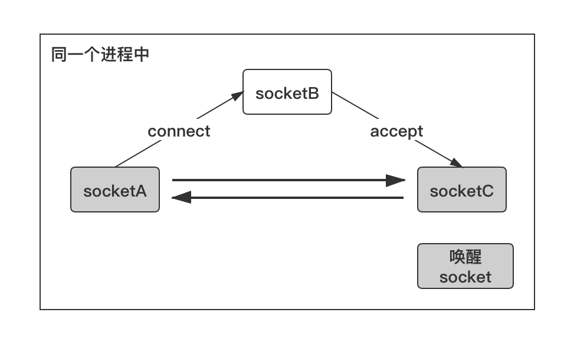
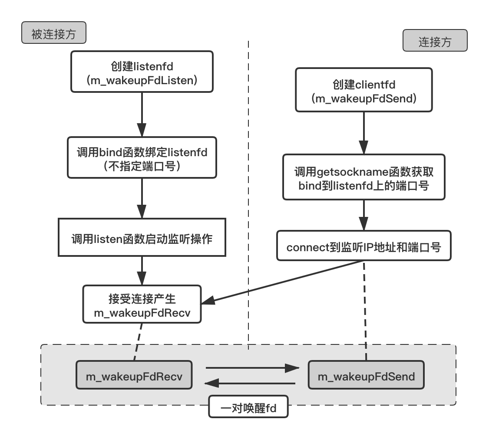
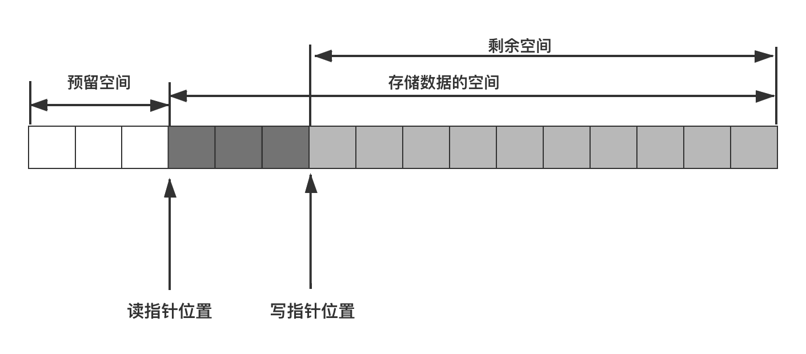
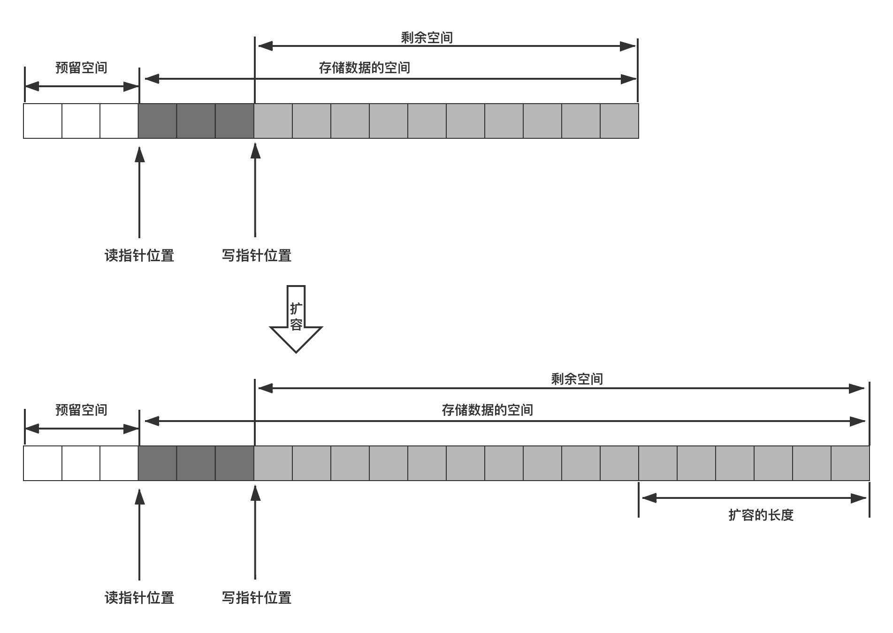
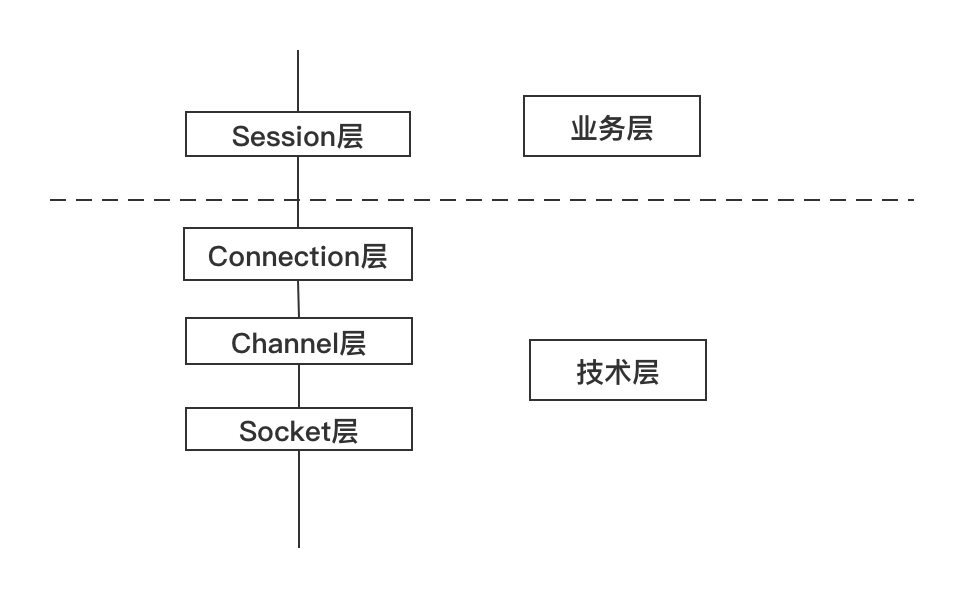

# 网络通信效率

## 网络通信组件的效率问题

### 网络通信框架需要解决哪些问题？
一个服务程序如果要对外服务，就要与外部程序进行通信，这些外部进程往往是位于不同机器上的不同进程（所谓的客户端），一般通信方式就是我们所说的网络通信，即所谓的 socket 通信。因此网络通信组件是一个服务器端程序的基础组件，设计的好坏，直接影响到其对外服务的能力。不同的业务在网络通信框架的一些细节上可能略有不同，但有大多数设计原理都是通用的。

#### 1. 尽量少等待原则
目前，网络上有很多网络通信框架，如 libevent、Boost Asio、ACE 等，但它们的网络通信的常见的技术手段都大同小异。一个好的网络通信框架至少要解决以下问题：

```text
1. 如何检测有新客户端连接？

2. 如何接受客户端连接？

3. 如何检测客户端是否有数据发来？

4. 如何收取客户端发来的数据？

5. 如何检测连接异常？发现连接异常之后，如何处理？

6. 如何给客户端发送数据？

7. 如何在给客户端发完数据后关闭连接？
```

稍微有点网络基础的人，都能回答上面说的其中几个问题，例如接收客户端连接用 socket API 的 accept 函数即可，收取客户端数据用 recv 函数，给客户端发送数据用 send 函数，检测客户端是否有新连接和客户端是否有新数据可以用 IO multiplexing （IO 复用）技术的 select、poll、epoll 等 socket API。确实是这样的，这些基础的socket API 构成了服务器网络通信的地基，不管网络通信框架设计的如何巧妙，都是在这些基础的 socket API 之上构建的。

但是如何巧妙地组织这些基础的 socket API，才是问题的关键。通常我们说服务器的高性能、高并发，实际上只是一个技术实现达到的效果而已，不管怎样，从程序设计的角度来讲无非就是一个程序而已，所以，只要程序能最大可能地满足“尽量少等待”就是高性能的（高效的）。这里说高效不是“忙的忙死，闲的闲死”，而是大家都可以闲着，但是如果有活要干，大家尽量一起干，而不是一部分线程忙着依次做事情一二三四五六七八九，另外一部分线程闲在那里无所事事。

说的可能有点抽象，下面我们举一些例子来具体说明一下。

- 默认情况下，recv 函数如果没有数据的时候，线程就会阻塞在 recv 函数调用处；

- 默认情况下， 如果 TCP 窗口不是足够大，利用 send 函数发数据发不出去，send 函数也会阻塞线程；

- connect 函数默认连接另外一端时会有一定时长的阻塞；

- 给对端发送一份数据，需要使用 recv 函数等待对端应答，如果对端一直不应答，当前线程就阻塞在 recv 函数调用处。

以上都不是高性能服务器的开发思维方式，因为上面的例子都不满足“尽量少等待”的原则。为什么一定要等待呢？有没有一种方法，使上述这些过程不需要等待，最好是不仅不需要等待，而且这些事情完成之后能通知我。这样在这些本来用于等待的 CPU 时间片内，程序就可以做一些其他的事情。

有，就是接下来要讨论的 IO 复用技术（IO Multiplexing）。

#### 2. 减少无用功的时间原则
目前 Windows 系统支持的 IO 复用技术有 select、WSAAsyncSelect、WSAEventSelect、IOCP（完成端口），Linux 系统支持的 IO 复用技术有 select、poll、epoll。来讨论一点深层次的东西，以上列举的 IO 复用函数可以分为两个级别：

- 层次一：select 和 poll；

- 层次二：WSAAsyncSelect、WSAEventSelect、IOCP、epoll。

这种划分级别的依据是什么？

先来分析第一级别的函数，select 和 poll 函数本质上还是在一定时间内主动去查询一组 socket 句柄（可能是一个也可能是多个）上是否有事件（可读事件、可写事件或者出错事件等），也就是说我们还是需要每隔一段时间内主动去做这些检测。如果在这段时间内检测出一些事件来，我们这段时间就算没白花，倘若这段时间内没有事件呢？我们只能是做无用功了，这样也是对系统资源的一种浪费。因为假如一个服务器有多个连接，在 CPU 时间片有限的情况下，我们花费了一定的时间检测了一部分 socket 上的事件，却发现它们什么事件都没有，而在这段时间内我们却有一些事情需要处理，那我们为什么要花时间去做这个检测呢？把这个时间用在做我们需要做的事情不好吗？所以对于服务器程序来说，要想高效，我们应该尽量避免花费时间主动去查询一些 socket 是否有事件，而是等这些 socket 有事件的时候系统主动告诉我们，然后我们再去处理。这也就是层次二的函数做的事情。

第二级别的函数实际相当于变主动查询为被动通知。当有事件时，系统会告诉我们，此时我们再去处理，此时不浪费任何时间。只不过第二级别的函数通知我们的方式是各不相同，比如 WSAAsyncSelect 是利用 Windows 窗口消息队列的事件机制来通知我们设定的窗口过程函数，IOCP 是利用 GetQueuedCompletionStatus 函数从挂起状态唤醒并返回，epoll 是 epoll_wait 函数返回而已。

举个例子，connect 函数连接另外一端时，如果将连接 socket 设置为非阻塞的，我们不需要等待 connect 连接结果，可以立即返回。等连接完成之后：WSAAsyncSelect 会返回 FD_CONNECT 事件告诉我们连接是否成功，epoll 会产生 EPOLLOUT 事件来通知我们；再例如，socket 有数据可读时，WSAAsyncSelect 产生 FD_READ 事件，epoll 产生 EPOLLIN 事件，等等。

总结下上面表达的含义：在追求高性能网络通信设计时，尽量不要主动去查询各个 socket 的事件，而是采用等待操作系统通知我们有事件的策略。

所以基于上面的讨论，这里提出的第二个原则：尽量减少做无用功的时间。

深刻理解这里的意思，在服务程序资源够用的情况下这样做可能体现不出来什么优势，但是如果有大量的任务要处理，需要支持高并发的服务，这基本上是非常有效的方法。

> 通过上面的分析，应该明白了对于高性能的服务，同样是 IO 函数，为什么不使用 select、poll 函数了吧？

另外使用 IO 复用 API，如果套接字无效了，应该及时关闭，并从 IO 复用函数上移除，否则可能造成死循环或者浪费 CPU 检测周期。

#### 3. 检测网络事件的高效姿势
根据上文介绍的两个原则，在高性能服务器设计中，我们一般将 socket 设置成非阻塞的，利用层次二提到的 IO 复用函数来检测各个 socket 上的事件（读、写、出错等事件）。

> 当然，这里不是说阻塞的 socket 通信模式一无是处，这个在少量数据量、低并发量或客户端的情况下，使用阻塞的 socket 通信方式也是可以的。

```text
1. 如何检测有新客户端连接？
2. 如何接受客户端连接？
```

默认 accept 函数会阻塞在那里，如果 epoll_wait 检测到侦听 socket 上有 EPOLLIN 事件；或者WSAAsyncSelect 检测到有 FD_ACCEPT 事件，那么就表明此时有新连接到来，这个时候再调用 accept 函数，就不会阻塞了。

```text
3. 如何检测客户端是否有数据发来？
4. 如何收取客户端发来的数据？
```

accept 产生的新 socket 你也应该设置成非阻塞的，而且应该在 epoll_wait 或 WSAAsyncSelect 报告这些 socket 有可读事件的时候才去收取数据，这样才不会做无用功。

至于一次性收多少数据好呢？我们可以根据自己的实际需求来决定，甚至你可以在一个循环里面反复 recv （或 read）。对于非阻塞模式的 socket，如果没有数据了，recv 或者 read 也会立即返回（返回值是 -1），此时错误码 EWOULDBLOCK （或 EAGAIN）会表明当前已经没有数据了。

代码示例：
```c++
bool CMySocket::Recv()
{
    int nRet = 0;
    while (true)
    {
        char buff[512];
        nRet = ::recv(m_hSocket, buff, 512, 0);
        if (nRet == SOCKET_ERROR)
        {
            //调用recv函数直到错误码是WSAEWOULDBLOCK
            if (errno == EWOULDBLOCK)
                break;
            else
                return false;
        }
        else if (nRet < 1)
            return false;

        m_strRecvBuf.append(buff, nRet);

        ::usleep(1000);
    }

    return true;
}
```

```text
5. 如何检测连接异常？发现连接异常之后，如何处理？
```

同样当我们收到异常事件后例如 EPOLLERR 或关闭事件 FD_CLOSE，我们就知道了有异常产生，我们对异常的处理一般就是关闭对应的 socket。另外，如果 send/recv 或者 read/write 函数对一个 socket 进行操作时，如果返回 0，也说明对端已经关闭了socket，此时这路连接也没必要存在了，我们也可以关闭本端的 socket。

需要说明的是，由于 TCP 连接是状态机，两个端点之间的路由错误导致的链路问题是检测不出来的，这种情形需要定时器结合心跳包去检测。

```text
6. 如何给客户端发送数据？
```

这也是一道常见的网络通信面试题，后台开发职位面试时常常会问这个问题，是考察一个后台开发者对高性能网络通信框架是否真正理解的一个重要知识点。

给客户端发送数据，比收数据要稍微麻烦一点，也是需要讲点技巧的。对于 epoll 的水平模式（Level Trigger），首先我们不能像注册检测数据可读事件一样一开始就注册检测数据可写事件，因为如果注册可写事件的话，一般情况下只要对端正常收取数据，我们的 socket 就通常都是可写的，这会导致频繁地触发可写事件。但是可写事件触发时我们并不一定有数据需要发送。所以正确的做法是：如果有数据要发送，则先尝试着去发送，如果发送不了或者只发送出去部分，剩下的我们需要将其缓存起来，然后再设置检测该socket上可写事件，下次可写事件产生时，再继续发送，如果还是不能完全发出去，则继续设置侦听可写事件，如此往复，一直到所有数据都发出去为止。一旦所有数据都发出去以后，我们要移除侦听可写事件，避免无用的可写事件通知。不知道你注意到没有，如果某次只发出去部分数据，剩下的数据应该暂且存起来，这个时候我们就需要一个缓冲区来存放这部分数据，这个缓冲区我们称为“发送缓冲区”。发送缓冲区不仅存放本次没有发完的数据，还用来存放在发送过程中，上层又传来的新的需要发送的数据。为了保证顺序，新的数据应该追加在当前剩下的数据的后面，发送的时候从发送缓冲区的头部开始发送。也就是说先来的先发送，后来的后发送。

```text
7. 如何在给客户端发完数据后关闭连接？
```

这个问题比较难处理，因为这里的“发送完”不一定是真正的发送完，我们调用 send 或 write 函数即使返回成功，也只能说明向操作系统的协议栈里面成功写入数据，并不是数据被发到网络上去。至于最后数据能否被发出去、何时被发出去很难判断，发出去对方是否收到就更难判断了。所以，我们目前只能简单地认为 send 或者 write 返回我们发出数据的字节数大小，我们就认为“发完数据”了。当然，你也可以调用 shutdown 函数来实现所谓的“半关闭”。

> socket 有一个 linger 选项，可以设置某个 socket 在关闭之后，剩下的数据可以最多逗留的时间。如果在逗留的时间内数据还不能发出去，那数据就真的丢掉了。

### 被动关闭与主动关闭连接
在实际的应用中，被动关闭连接是由于我们检测到了连接的异常事件（例如，触发 EPOLLERR 事件 、send/recv 函数返回 0，对端关闭连接），这个时候这路连接已经没有存在的必要了，我们被迫关闭连接。而主动关闭连接，是我们主动调用 close/closesocket 来关闭连接，例如客户端给我们发送非法的数据，如一些网络攻击中的刺探性数据包，这个时候出于安全考虑，我们主动关闭连接。

### 长连接和短连接
网络通信双方中根据连接的保持状况分为长连接和短连接，长连接是长时间保持通信双方的连接状态，这其实是相对于短连接而言的。通常的短连接操作步骤是：

> 连接 => 数据传输 =>关闭连接

而长连接通常是：

> 连接 => 数据传输 => 保持连接 => 数据传输 => 保持连接 => ...... => 关闭连接

这就要求长连接在没有数据通信时，定时发送数据包，以维持连接状态，短连接在没有数据传输时直接关闭就行了。

那什么时候使用长连接什么时候使用短连接呢？ 长连接主要用于通信双方需要频繁通信的场景，缺点是通信双方需要增加相应逻辑去维护相应的连接状态信息，另外连接信息本身也对需要一定的系统消耗，优点是可以进行实时数据交换。

短连接一般用于数据传输完后即可关闭连接、或者对通信双方的状态信息实时性要求不高的应用，如 Web 服务器与浏览器之间的连接，Web 服务器将页面信息发送给浏览器后即可关闭连接，在需要时可再次建立连接。短连接的优点是通信双方不需要长时间的维护连接状态信息，可节省连接资源；缺点是，如果传输数据频次比较多，可能需要频繁的建立和关闭连接，另外，短连接无法做到很实时的消息推送。

```text
这里说 Web 服务器一般使用短连接与浏览器通信严格来说其实不准确的，在一些 http 通信中，通信双方可能会接受 http 协议包头中的 keepalive 选项的建议，在多次通信之间保持连接状态不断开。

另外，虽然大多数情况下 http 协议都是短链接、不支持消息推送，但这种现状正在改变，最新的 http2.0 标准就支持服务器端的推送。
```

## 最原始的服务器结构
单个服务器的结构，是随着业务需求的升级而不断演进。尽管我们今天看最初的一些服务器结构模型觉得非常简陋和低效，但是它们是最基本的原理和最初的模型，虽然我们今天在商业系统中再也不会使用那些最初的组织结构了，但是了解它们能让你知道现在的复杂的结构最初是什么样子，又是如何一步步地演化成今天的面貌，这就是所谓的知道“从哪里来，到哪里去”。

最原始的服务器结构，是创建好侦听 socket，在一个循环里面接受新的连接，产生对应的客户端 fd，然后利用这个客户端 fd 与客户端进行通信（收发数据）。代码如下：
```c++
/**
 * TCP服务器通信基本模型
 */
#include <sys/types.h> 
#include <sys/socket.h>
#include <arpa/inet.h>
#include <unistd.h>
#include <iostream>
#include <string.h>

int main(int argc, char* argv[])
{
    //1.创建一个侦听socket
    int listenfd = socket(AF_INET, SOCK_STREAM, 0);
    if (listenfd == -1)
    {
        std::cout << "create listen socket error." << std::endl;
        return -1;
    }

    //2.初始化服务器地址
    struct sockaddr_in bindaddr;
    bindaddr.sin_family = AF_INET;
    bindaddr.sin_addr.s_addr = htonl(INADDR_ANY);
    bindaddr.sin_port = htons(3000);
    if (bind(listenfd, (struct sockaddr *)&bindaddr, sizeof(bindaddr)) == -1)
    {
        std::cout << "bind listen socket error." << std::endl;
        return -1;
    }

	//3.启动侦听
    if (listen(listenfd, SOMAXCONN) == -1)
    {
        std::cout << "listen error." << std::endl;
        return -1;
    }

    while (true)
    {
        struct sockaddr_in clientaddr;
        socklen_t clientaddrlen = sizeof(clientaddr);
		//4. 接受客户端连接
        int clientfd = accept(listenfd, (struct sockaddr *)&clientaddr, &clientaddrlen);
        if (clientfd != -1)
        {         	
			char recvBuf[32] = {0};
			//5. 从客户端接受数据
			int ret = recv(clientfd, recvBuf, 32, 0);
			if (ret > 0) 
			{
				std::cout << "recv data from client, data: " << recvBuf << std::endl;
				//6. 将收到的数据原封不动地发给客户端
				ret = send(clientfd, recvBuf, strlen(recvBuf), 0);
				if (ret != strlen(recvBuf))
					std::cout << "send data error." << std::endl;
				
				std::cout << "send data to client successfully, data: " << recvBuf << std::endl;
			} 
			else 
			{
				std::cout << "recv data error." << std::endl;
			}
			
			close(clientfd);
        }
    }
	
	//7.关闭侦听socket
	close(listenfd);

    return 0;
}

```

上面的代码，我们抽出我们关心的主干部分并整理成伪码如下：
```c++
int main(int argc, char* argv[])
{
    //1. 初始化阶段

    while (true)
    {
        //2. 利用 accept 函数接受连接，产生客户端 fd
        
        //3. 利用步骤 2 中的 fd 与某个客户端通信
    }
	
	//3. 资源清理

    return 0;
}

```

上述流程的基本逻辑是程序每轮循环都只能处理一个客户端请求，要处理下一个连接，必须等当前的操作完成后进入下一轮循环才能继续处理。这种结构的弊端是显而易见，它根本就不支持并发，更不用说高并发了。

## 一个连接一个线程模型
正因为最原始的服务器结构不支持并发，随着计算机引入多线程模型后，软件开发者想出了另外一种服务器结构，即给每一个客户端连接创建一个线程，这样多个线程就可以并行执行了，可以同时为多个客户端服务。

示例代码如下：
```c++
//侦听线程
UINT WINAPI MyMainThread(LPVOID lPvoid)
{
    LOG_NORMAL("Start MyMainThread successfully, ThreadID = %u.", ::GetCurrentThreadId());
    
    UINT		nThreadID = 0;
    SOCKET		sListenSocket = (SOCKET)lPvoid;
    SOCKET		sClientSocket = 0;
    while (1)
    {
        //等待客户连接
        sockaddr_in clientAddr = { 0 };
        int clientAddrLength = sizeof(clientAddr);
        if ((sClientSocket = accept(sListenSocket, (struct sockaddr*)&clientAddr, &clientAddrLength)) == INVALID_SOCKET)
            break;

        LOG_NORMAL("New client connected: %s:%d", inet_ntoa(clientAddr.sin_addr), ntohs(clientAddr.sin_port));

        //启动客户签到线程
        _beginthreadex(NULL, 0, MyChildThread, (LPVOID)sClientSocket, 0, &nThreadID);
    }

    closesocket(sListenSocket);
    return 0;
}

```

```c++
//接收连接线程
UINT WINAPI MyChildThread(LPVOID lPvoid)
{
    LOG_NORMAL("Start MyChildThread successfully, ThreadID = %u.", ::GetCurrentThreadId());
    
    //交易处理
    SOCKET sClientSocket = (SOCKET)lPvoid;
    CLIENTITEM	clientItem = { 0 };
    int nCmd = HandleClientMain(sClientSocket, &clientItem);

    LOG_NORMAL("Client cmd = %d", nCmd);
    if (nCmd == -1)
        closesocket(sClientSocket);
    else if (nCmd == CONN_MAIN)
        LoginTrans(sClientSocket, &clientItem);
    else
        InterTrans(sClientSocket, &clientItem, nCmd);
    return 0;
}

```

上述代码中，在某个线程 MyMainThread 中（可以是主线程也可以是非主线程）调用 accept 接受客户端连接，成功接受连接后，为每一个新连接创建一个工作线程（MyChildThread）。当然，为了能让工作线程可以正常处理所负责的连接上的来往数据，利用线程函数参数将 socket 句柄传给工作线程（注意上述代码中参数 sClientSocket 的传递方法）。

## Reactor 模式
目前存在很多的网络通信库，从 C/C++ 的 libevent 库，到 Java 的 Netty 框架，再到 python 的 Twisted 库等，目前主流的网络库使用的都是 Reactor 模式（中文译作： 反应器模式或反射器模式）。那么到底什么是 Reactor 模式呢？Reactor 模式有什么优点？Reactor 模式英文解释如下：

> The reactor design pattern is an event handling pattern for handling service requests delivered concurrently to a service handler by one or more inputs. The service handler then demultiplexes the incoming requests and dispatches them synchronously to the associated request handlers.

翻译成中文的意思就是：

> 反应器设计模式( Reactor pattern )是一种事件处理设计模式，该模式可以将一个或多个 IO 请求服务并发地传递给服务处理器，即当（ IO 处理）请求抵达后，服务处理程序使用多路复用技术，然后同步地派发这些请求至相关的请求处理程序。

流程图如下：


从流程图上来看，这个设计模式看起来很简单，其背后却蕴含着不简单的设计思想。那么上图中到底蕴含着什么样的思想奥妙呢？它解决了计算机世界中普遍存在的一个问题，即请求太多，资源太少。也就是说一个对外服务程序，其接收的各种输入输出请求的数量可能是非常多的，然后由于处理能力有限，其处理这些请求的资源数量是有限的。诚然，大千世界也是这样，如一个公园的游客容量是有限的，而游客数量可能是无限的；一个饭店的座位是有限的，而顾客可能是无限的；一个国家的领土是有限的，其人口可能是无限增长的。所以上图中输入输出请求数量之和一般会远远大于处理程序数量，而多路复用器（IO Demultiplexer）将这些数量众多的输入输出请求分发给有限的处理程序。

所以一个 Reactor 模式结构一般包含以下模块：

- 资源请求事件（Resource Request）

- 多路复用器与事件分发器（IO Demultiplexer & Event Dispatcher）

- 事件处理器（EventHandler）

我们以目前大多数饭店的运营模式这样一个生活中的例子来说明一下reactor模式，顾客去饭店吃饭，由于客户较多，饭店的服务员数量有限，所以饭店都是某个服务员负责某几桌客户，当顾客有需求时（点菜、结账等），可以把需要告诉服务员，由服务员去把这些需求再转发给其他相关人员（点菜转发给厨房，结账交给收银）。如此操作，在即使饭店顾客爆满时，靠几个服务员也能有条不紊地运转着整个饭店。

这是很简单的生活例子，却有着最朴素的思想，在对应具体的服务器程序技术上来说，以 socket 的读写为例，输入输出请求就是 socket 上有数据可读或者需要往 socket 上写入数据，而 IO 复用器就对应着操作系统的相关 API，Windows 操作系统上有 select 技术（函数），Linux 上有 select 函数、poll 函数、epoll 模型（实际对应 epoll_wait）。使用这些IO复用技术之后，Reactor 模式对应的流程图就变成了如下结构：


### one thread one loop 思想

基于 Reactor 模式，我们引出 one thread one loop 思想，所谓 one thread one loop，翻译成中文的意思就是一个线程对应一个循环，这里说的线程针对的是网络相关的线程，也就是说一个每个线程函数里面有一个循环流程，这些循环流程里面做的都是相同的事情。这个线程函数的内容细节如下：

```c++
//线程函数
void* thread_func(void* thread_arg)
{
	//这里做一些需要的初始化工作

	while (线程退出标志)
	{
		//步骤一：利用select/poll/epoll等IO复用技术，分离出读写事件

		//步骤二：处理读事件或写事件

		//步骤三：做一些其他的事情
	}


	//这里做一些需要的清理工具
}

```

关键部分是线程函数里面的 while 循环部分，步骤一利用 IO 复用技术分离出 socket 读写事件。

重点是步骤二，处理读事件和可写事件，需要注意的是，在 Linux 操作系统下，除了 socket 对象以外，其他对象也可以挂到 IO 复用函数去。

这里暂时先讨论 socket 对象，以处理读事件为例：对于侦听 socket，我们认为它的读事件一般就是接收新连接“等”操作，注意这里的“等”我加了个引号，也就是说，我们不仅仅可以接收新连接，也可以多做一点事情，如将由 accept 函数新产生的客户端 socket 绑定到 IO 复用函数上去，创建代表连接的对象等等各种操作；对于普通的 socket 的读事件，在不考虑出错的情况下，我们可以调用 recv 或者 read 函数收取数据，甚至我们可以对收到的数据解包，并做一些业务逻辑的处理。举个例子，假设我们收到的数据经解包后发现是登陆请求包，我们可以接着处理这些登陆数据，并应答客户端。那么这里的处理读事件实际上就包括：收数据、解包、处理数据、应答客户端四个步骤。对于处理写事件，一般就是发送数据了。

步骤三，做一些其他的事情。其他的事情就具体问题具体对待了，如我们可以将上一步的解包或者验证数据放在这里。毕竟从程序设计的结构来说，检测事件（步骤一）和收发数据这个属于网络通信层的工作，而解包和处理数据属于业务层的工作。一个良好的设计，这两个工作应该是分离的。当然，还可以做一些其他的事情。

### 线程的分工
根据上面介绍的线程函数中的循环结构，服务器端为了能流畅处理多个客户端连接，一般在某个线程 A 里面 accept 新的客户端连接并生成新连接的 socket，然后将这些新连接的 socket 传递给另外开的数个工作线程 B1、B2、B3、B4，这些工作线程继续处理这些新连接上的网络 IO 事件（即收发数据），同时，这些工作线程还处理系统中的另外一些事务。这里我们将线程 A 称为主线程，B1、B2、B3、B4 等称为工作线程。使用伪代码表示一下：

```c++
while (!m_bQuitFlag)
{
	epoll_or_select_func();

	handle_io_events();

	handle_other_things();
}

```

在 epoll_or_select_func() 中通过 select/poll/epoll 等 IO 复用函数去检测 socket 上的 IO 事件，若存在这些事件则下一步调用 handle_io_events() 来处理这些事件（收发数据），做完之后可能还要做一些其他任务，调用handle_other_things() 即可。

这样做有三个好处：

1. 线程 A 只需要处理新连接的到来即可，不用处理网络 IO 事件。如果在线程 A 里面既处理新连接又处理网络 IO，则可能由于线程忙于处理 IO 事件，而无法及时处理客户端的新连接请求，这是很不好的。

2. 线程 A 接受的新连接（每个连接对应一个 socket fd），可以根据一定的负载均衡策略将这些新的 socket 分配给各个工作线程。round robin （轮询策略）是其中一种很简便、常用的算法，即在假设不考虑中途有连接断开的情况，一个新连接来了分配给 B1，接着又来一个分配给 B2，再来一个分配给 B3，再来一个分配给 B4，如此反复。线程 A 会记录了各个工作线程上的 socket fd 数量，这样可以最大化地来平衡资源，避免一些工作线程“忙死”，另外一些工作线程“闲死”的现象。

3. 在工作线程不满载的情况下，可以让工作线程做其他的事情。比如现在有四个工作线程，但只有三个连接。那么线程 B4 就可以在 handle_other_thing() 做一些其他事情。

程序的这种基础框架需要解决一个很重要的效率问题：

在上述 while 循环里面，epoll_or_selec_func() 中的 poll/select/epoll_wait 等函数一般设置了一个超时时间。如果设置超时时间为 0，那么在没有任何网络 IO 事件和其他任务处理需要处理的情况下，这些工作线程实际上会空转，白白地浪费 CPU 时间片；如果设置的超时时间大于 0，在没有网络 IO 事件的情况，poll/select/epoll_wait 等函数会在挂起指定时间后才能返回，导致需要 handle_other_thing() 不能及时执行，导致其他任务不能及时处理，也就是说一旦有其他任务需要处理，由于 IO 复用函数需要等待一段时间，导致这些其他任务在一定的延时后才能处理。这两种情形都不好。那如何解决该问题呢？

其实我们想达到的效果是，如果没有网络 IO 事件和其他任务要处理，那么这些工作线程最好直接挂起而不是空转；如果有其他任务要处理，这些工作线程要能立刻处理这些任务而不是在 poll/select/epoll_wait 等函数挂起指定时间后才开始处理这些任务。

为此，我们仍然会给 poll/select/epoll_wait 等函数设置一定的超时事件，但对于 handle_other_thing() 函数的执行，我们采用一种特殊的唤醒策略。以 Linux 为例，不管 epoll_fd 上有没有文件描述符 fd，我们都会给 epoll_fd 绑定一个特殊的 fd，这个 fd 被称为 wakeup fd（唤醒 fd）。当我们有其他任务需要立即处理时，即让 handle_other_thing() 立刻执行，向这个唤醒 fd 上随便写入 1 个字节的，这样这个 fd 立即就变成可读的了，select/poll/epoll_wait 函数会立即被唤醒并返回，接下来就可以马上执行 handle_other_thing() 函数了，其他任务就可以得到立即处理；反之，没有其他任务也没有网络 IO 事件时，epoll_or_select_func() 就挂在那里什么也不做。

### 唤醒机制的实现
这个唤醒 fd 在 Linux 操作系统上可以通过以下几种方法实现：

1. 使用管道 fd（pipe）：创建一个管道，将管道的一端绑定到 epollfd 上，需要唤醒时，向管道的另一端写入一个字节，工作线程立即被唤醒。

```c++
#include <unistd.h>

int pipe(int pipefd[2]);

```

```c++
#include <fcntl.h> 
#include <unistd.h>

int pipe2(int pipefd[2], int flags);

```

2. 使用 Linux 2.6新增的 eventfd

```c++
#include <sys/eventfd.h>

int eventfd(unsigned int initval, int flags);

```

eventfd 使用方法和管道 fd 使用方法一样，将生成的 eventfd() 函数返回的 eventfd 绑定到 epollfd上，需要唤醒时，向这个 eventfd 上写入一个字节，IO 复用函数被立即被唤醒。

3. 使用 socketpair，socketpair 是一对相互连接的 socket，相当于服务器端和客户端的两个端点，每一端都可以读写数据，向其中一端写入数据，就可以从另外一端读取数据。

```c++
#include <sys/types.h>
#include <sys/socket.h>

int socketpair(int domain, int type, int protocol, int sv[2]);

```

调用这个函数返回的两个 socket 句柄就是 sv[0] 和 sv[1]，在一个其中任何一个写入字节，在另外一个收取字节。使用方法与上面其他两种一样，将收取的字节的 socket 句柄绑定到 epollfd 上。需要时，向另外一个写入的socket上写入一个字节，工作线程立即被唤醒。

需要注意的是，和创建普通 socket 稍微不同的是，创建 socketpair，其第一个参数 domain 必须要设置成AFX_UNIX。

在 Windows 操作系统上，如果使用 select 函数作为 IO 复用函数，由于 Windows 系统上的 select 只支持检测套接字这一种，因此 Windows 上一般只能模仿 Linux 的 socketpair 的思路，即手动创建两个 socket，然后调用connect/accept 函数建立一个连接，相当于一个 socket 作为客户端连接 socket（调用 connect），去连接某个侦听 socket，另外一个 socket 作为侦听端接受连接后（调用 accept 函数）返回的 socket。然后将读取数据的那一端的 socket 绑定到 select 函数上并检测其可读事件。这是在写跨两个平台代码时，需要注意的地方。

> 这段文字中一共有三个 socket，这端的 socket（称为 A），调用 connect 函数传入，另外一端的侦听 socket（称为 B） 和调用 accept 函数返回的 socket（称为 C），我们这里唤醒使用 A 和 C。



说了这么多，我们来看一个具体的例子：

创建唤醒 fd：
```c++
bool EventLoop::createWakeupfd()
{
#ifdef WIN32
    wakeupFdListen_ = sockets::createOrDie();
    wakeupFdSend_ = sockets::createOrDie();

    //Windows上需要创建一对socket  
    struct sockaddr_in bindaddr;
    bindaddr.sin_family = AF_INET;
    bindaddr.sin_addr.s_addr = htonl(INADDR_LOOPBACK);
    //将port设为0，然后进行bind，再接着通过getsockname来获取port，这可以满足获取随机端口的情况。
    bindaddr.sin_port = 0;
    sockets::setReuseAddr(wakeupFdListen_, true);
    sockets::bindOrDie(wakeupFdListen_, bindaddr);
    sockets::listenOrDie(wakeupFdListen_);

    struct sockaddr_in serveraddr;
    int serveraddrlen = sizeof(serveraddr);
    if (getsockname(wakeupFdListen_, (sockaddr*)& serveraddr, &serveraddrlen) < 0)
    {
        //让程序挂掉
        LOGF("Unable to bind address info, EventLoop: 0x%x", this);
        return false;
    }

    int useport = ntohs(serveraddr.sin_port);
    LOGD("wakeup fd use port: %d", useport);

    //serveraddr.sin_family = AF_INET;
    //serveraddr.sin_addr.s_addr = inet_addr("127.0.0.1");
    //serveraddr.sin_port = htons(INNER_WAKEUP_LISTEN_PORT);   
    if (::connect(wakeupFdSend_, (struct sockaddr*) & serveraddr, sizeof(serveraddr)) < 0)
    {
        //让程序挂掉
        LOGF("Unable to connect to wakeup peer, EventLoop: 0x%x", this);
        return false;
    }

    struct sockaddr_in clientaddr;
    socklen_t clientaddrlen = sizeof(clientaddr);
    wakeupFdRecv_ = ::accept(wakeupFdListen_, (struct sockaddr*) & clientaddr, &clientaddrlen);
    if (wakeupFdRecv_ < 0)
    {
        //让程序挂掉
        LOGF("Unable to accept wakeup peer, EventLoop: 0x%x", this);
        return false;
    }

    sockets::setNonBlockAndCloseOnExec(wakeupFdSend_);
    sockets::setNonBlockAndCloseOnExec(wakeupFdRecv_);

#else
    //Linux上一个eventfd就够了，可以实现读写
    wakeupFd_ = ::eventfd(0, EFD_NONBLOCK | EFD_CLOEXEC);
    if (wakeupFd_ < 0)
    {
        //让程序挂掉
        LOGF("Unable to create wakeup eventfd, EventLoop: 0x%x", this);
        return false;
    }

#endif

    return true;
}

```

上述代码中，有一个实现细节需要注意一下。在 Windows 平台上，作为服务端的一方，创建一个侦听 socket（代码中的 wakeupFdListen_）后，需要调用 bind 函数绑定特定的 ip 和端口号，我们这里不要使用一个固定端口号，因为工作线程可能存在多个，一旦端口号固定，在创建下一个工作线程时，会因为端口号已经被占用导致 bind 函数调用失败，导致其他工作线程无法创建出来。因此这里将端口号设置为 0，操作系统会给我们分配一个可用的端口号。现在作为客户端一方，调用 connect 函数时需要指定明确的 ip 和端口号，这个时候 getsockname 函数就能获取到操作系统为 bind 函数分配的端口号。



唤醒函数实现：
```c++
bool EventLoop::wakeup()
{
    uint64_t one = 1;
#ifdef WIN32
    int32_t n = sockets::write(wakeupFdSend_, &one, sizeof(one));
#else
    int32_t n = sockets::write(wakeupFd_, &one, sizeof(one));
#endif


    if (n != sizeof one)
    {
#ifdef WIN32
        DWORD error = WSAGetLastError();
        LOGSYSE("EventLoop::wakeup() writes %d  bytes instead of 8, fd: %d, error: %d", n, wakeupFdSend_, (int32_t)error);
#else
        int error = errno;
        LOGSYSE("EventLoop::wakeup() writes %d  bytes instead of 8, fd: %d, error: %d, errorinfo: %s", n, wakeupFd_, error, strerror(error));
#endif


        return false;
    }

    return true;
}

```

无论使用哪种 fd 作为唤醒 fd，一定要在唤醒后及时将唤醒 fd 中的数据读出来，即消耗掉这个 fd 的接收缓冲区里面的数据，否则可能会由于不断的调用，导致这个 fd 接受缓冲区被写满，导致下次唤醒失败（即向 fd 写入数据失败）。

从唤醒 fd 中读取数据：
```c++
bool EventLoop::handleRead()
{
    uint64_t one = 1;
#ifdef WIN32
    int32_t n = sockets::read(wakeupFdRecv_, &one, sizeof(one));
#else
    int32_t n = sockets::read(wakeupFd_, &one, sizeof(one));
#endif

    if (n != sizeof one)
    {
#ifdef WIN32
        DWORD error = WSAGetLastError();
        LOGSYSE("EventLoop::wakeup() read %d  bytes instead of 8, fd: %d, error: %d", n, wakeupFdRecv_, (int32_t)error);
#else
        int error = errno;
        LOGSYSE("EventLoop::wakeup() read %d  bytes instead of 8, fd: %d, error: %d, errorinfo: %s", n, wakeupFd_, error, strerror(error));
#endif
        return false;
    }

    return true;
}

```

EventLoop::handleRead() 函数可以在触发唤醒 fd 的读事件后调用。

### handle_other_things() 方法的逻辑
在了解了唤醒机制之后，来看一下 handle_other_things() 方法的使用，handle_other_things() 可以设计成从一个 "other_things" 集合中取出具体的任务来执行：

```c++
void EventLoop::handle_other_things()
{
    std::vector<OtherThingFunctor> otherThingFunctors;
    callingPendingFunctors_ = true;

    {
        std::unique_lock<std::mutex> lock(mutex_);
        otherThingFunctors.swap(pendingOtherThingFunctors_);
    }

    for (size_t i = 0; i < otherThingFunctors.size(); ++i)
    {
        otherThingFunctors[i](./);
    }
    
    callingPendingFunctors_ = false;
}

```

pendingOtherThingFunctors_ 这里是一个类成员变量，这里的实现使用了 std::vector，工作线程本身会从这个容器中取出任务来执行，这里我们将任务封装成一个个的函数对象，从容器中取出来直接执行就可以了。这里使用了一个特殊的小技巧，为了减小锁 （mutex_，也是成员变量，与 pendingOtherThingFunctors_ 作用域一致）的作用范围，提高程序执行效率，我们使用了一个局部变量 otherThingFunctors 将成员变量 pendingOtherThingFunctors_ 中的数据倒换进这个局部变量中。

添加 "other_things"，可以在任意线程添加，也就是说可以在网络线程之外的线程中添加任务，因此可能涉及到多个线程同时操作 pendingOtherThingFunctors_ 对象，因此需要对其使用锁（这里是 mutex_）进行保护。添加 "other_things" 代码如下：

```c++
void EventLoop::queueInLoop(const Functor& cb)
{
    {
        std::unique_lock<std::mutex> lock(mutex_);
        pendingOtherThingFunctors_.push_back(cb);
    }
	
	//如果在其他线程调用了这个函数，立即尝试唤醒handle_other_things()所在线程
    if (!isInLoopThread() || callingPendingFunctors_)
    {
        wakeup();
    }
}

```

最后，在某些程序结构中，根据需要执行的 other_things 的类型，可以存在多个 handle_other_things() 方法，程序结构就演变成了：

```c++
while (!m_bQuitFlag)
{
	epoll_or_select_func();

	handle_io_events();

	handle_other_things1();
	
	handle_other_things2();
	
	handle_other_things3();
	
	//根据实际需要可以有更多的handle_other_things()
}

```

另外，对于 handle_other_things() 这类方法可以在 one thread one loop 结构中 while 循环内部的任意位置，不一定要位于 handle_io_events() 函数后面，handle_other_things() 系列方法我们有时候也称为钩子函数（Hook Functions）。例如：

```c++
while (!m_bQuitFlag)
{
	handle_other_things1();
	
	epoll_or_select_func();
	
	handle_other_things2();

	handle_io_events();
	
	handle_other_things3();
	
	//根据实际需要可以有更多的handle_other_things()
}

```

### 带上定时器的程序结构
定时器是程序常用的一个功能之一，上述结构中可以在线程循环执行流中加上检测和处理定时器事件的逻辑，添加的位置一般放在程序循环执行流的第一步。加上定时器逻辑后程序结构变为：

```c++
while (!m_bQuitFlag)
{
	check_and_handle_timers();
	
	epoll_or_select_func();

	handle_io_events();

	handle_other_things();
}

```

这里需要注意的是，epoll_or_select_func() 中使用 IO 复用函数的超时时间尽量不要大于 check_and_handle_timers() 中所有定时器中的最小时间间隔，以免定时器逻辑处理延迟较多。

### one thread one loop 的效率保障
需要注意的是，在整个 loop 结构中，为了保证整个 Loop 的各个逻辑步骤高效的运行，除了 epoll_or_select_func 步骤中的 IO 复用函数可能会造成等待，任何其他步骤（包括定时器触发后的回调逻辑）中都不能有阻塞整个流程或者耗时的操作。如果业务决定了定时器回调逻辑（对应 check_and_handle_timers 函数）或读写事件处理逻辑（对应 handle_io_events 函数）或其他自定义逻辑（对应 handle_other_things 函数）中有耗时的操作，那么需要另外再开新的业务线程去处理，IO 线程（即 Loop 所在的线程）本身不能处理，业务线程处理完毕后将处理结果或者数据通过特定的方式返回给 IO 线程。

## 收数据与发数据的正确姿势
对于收数据，当接受连接成功得到 clientfd 后，我们会将该 clientfd 绑定到相应的 IO 复用函数上并监听其可读事件。不同的 IO 复用函数可读事件标志不一样，例如对于 poll 模型，可读标志是 POLLIN，对于 epoll 模型，可读事件标志是 EPOLLIN。当可读事件触发后，我们调用 recv 函数从 clientfd 上收取数据（这里不考虑出错的情况），根据不同的网络模式我们可能会收取部分，或一次性收完。收取到的数据我们会放入接收缓冲区内，然后做解包操作。这就是收数据的全部“姿势”。对于使用 epoll 的 LT 模式（水平触发模式），我们每次可以只收取部分数据；但是对于 ET 模式（边缘触发模式），必须将本次收到的数据全部收完。

> ET 模式收完的标志是 recv 或者 read 函数的返回值是 -1，错误码是 EWOULDBLOCK，针对 Windows 和 Linux 下区别。

### 发数据的正确姿势
对于发数据，除了 epoll 模型的 ET 模式外，epoll 的 LT 模式或者其他 IO 复用函数，我们通常都不会去注册监听该 clientfd 的可写事件。这是因为，只要对端正常收数据，一般不会出现 TCP 窗口太小导致 send 或 write 函数无法写的问题。因此大多数情况下，clientfd 都是可写的，如果注册了可写事件，会导致一直触发可写事件，而此时不一定有数据需要发送。故而，如果有数据要发送一般都是调用 send 或者 write 函数直接发送，如果发送过程中， send 函数返回 -1，并且错误码是 EWOULDBLOCK 表明由于 TCP 窗口太小数据已经无法写入时，而仍然还剩下部分数据未发送，此时我们才注册监听可写事件，并将剩余的数据存入自定义的发送缓冲区中，等可写事件触发后再接着将发送缓冲区中剩余的数据发送出去，如果仍然有部分数据不能发出去，继续注册可写事件，当已经无数据需要发送时应该立即移除对可写事件的监听。这是目前主流网络库的做法。

**直接尝试发送消息处理逻辑：**
```c++
/**
 *@param data 待发送的数据
 *@param len  待发送数据长度
 */
void TcpConnection::sendMessage(const void* data, size_t len)
{    
    int32_t nwrote = 0;
    size_t remaining = len;
    bool faultError = false;
	
    //当前未监听可写事件，且发送缓冲区中没有遗留数据
    if (!channel_->isWriting() && outputBuffer_.readableBytes() == 0)
    {
        //直接发送数据
		nwrote = sockets::write(channel_->fd(), data, len);      
        if (nwrote >= 0)
        {
            remaining = len - nwrote;           
        }
        else //nwrote < 0
        {
            nwrote = 0;
            //错误码不等于EWOULDBLOCK说明发送出错了
			if (errno != EWOULDBLOCK)
            {
                if (errno == EPIPE || errno == ECONNRESET)
                {
                    faultError = true;
                }
            }
        }
    }

	//发送未出错且还有剩余字节未发出去
    if (!faultError && remaining > 0)
    {
        //将剩余部分加入发送缓冲区
        outputBuffer_.append(static_cast<const char*>(data) + nwrote, remaining);
        if (!channel_->isWriting())
        {
            //注册可写事件
			channel_->enableWriting();
        }
    }
}

```

**不能全部发出去监听可写事件后，可写事件触发后处理逻辑：**
```c++
//可写事件触发后会调用handleWrite()函数
void TcpConnection::handleWrite()
{  
	//将发送缓冲区中的数据发送出去
	int32_t n = sockets::write(channel_->fd(), outputBuffer_.peek(), outputBuffer_.readableBytes());
	if (n > 0)
	{
		//发送多少从发送缓冲区移除多少
		outputBuffer_.retrieve(n);
		//如果发送缓冲区中已经没有剩余，则移除监听可写事件
		if (outputBuffer_.readableBytes() == 0)
		{
			//移除监听可写事件
			channel_->disableWriting();
		}
	}
	else
	{
		//发数据出错处理          
		handleClose();
	} 
}

```

对于 epoll LT 模式注册监听一次可写事件后，可写事件触发后，尝试发送数据，如果数据此时还不能全部发送完，不用再次注册可写事件；如果是 epoll 的 ET 模式，注册监听可写事件后，可写事件触发后，尝试发送数据，如果数据此时还不能全部发送完，需要再次注册可写事件以便让可写事件下次再次触发（给予再次发数据的机会）。当然，这只是理论上的情况，实际开发中，如果一段数据反复发送都不能完全发送完（例如对端先不收，后面每隔很长时间再收一个字节），我们可以设置一个最大发送次数或最大发送总时间，超过这些限定，我们可以认为对端出了问题，应该立即清空发送缓冲区并关闭连接。

“收发数据的正确姿势”，其实还可以换一种说法，即“检测网络事件的正确姿势”，这里意指检测一个 fd 的读写事件的区别（对于侦听 fd，只检测可读事件）：

- 在 select、poll 和 epoll 的 LT 模式下，可以直接设置检测 fd 的可读事件；

- 在 select、poll 和 epoll 的 LT 模式下不要直接设置检测 fd 的可写事件，应该先尝试发送数据，因为 TCP 窗口太小发不出去再设置检测 fd 的可写事件，一旦数据发出去应立即取消对可写事件的检测。

- 在 epoll 的 ET 模式下，需要发送数据时，每次都要设置检测可写事件。

### 不要多个线程同时在一个 socket 上 send 或 recv 数据
由于 TCP 通信是全双工的，也就是说收数据和发数据是独立的，一般不会相互影响，这里建议不要多个线程同时在一个 socket 上 send 或 recv 数据指的不是说收发数据必须放在同一个线程里面进行，相反，实际开发中不少应用对于同一个 socket recv 数据使用一个线程，send 数据使用另外一个线程，但是需要额外做一点点在收或者发出错时对 socket 出错状态进行一下同步。

但是单独的 send 或 recv 的操作，一定不要出现多个线程同时使用一个 socket 去 send 数据，或者多个线程同时使用一个 socket recv 数据。

由于 TCP 数据是有序的，以 send 数据为例，如果多个线程同时使用一个 socket 去 send，那么最终对端收到的数据顺序就无法保证了。例如现在三个线程分别要发送 A、B、C 三个数据块，对端期望收到的顺序是 ABC，但是由于发送端使用三个线程发送，对端收到的数据顺序就不一定是 ABC 了。除非你使用一定的线程同步策略让三个线程按 ABC 的顺序发送数据，如果涉及这样的逻辑还不如放在一个线程中去操作。

同样的道理，如果 recv 数据时，多个线程同时调用 recv 函数，那么每个线程可能收到部分数据，那么最终按什么顺序来把这些数据还原成发送端的顺序呢？

不仅是 socket，对于管道也是一样到道理，不建议多个线程同时在同一个管道上读写。

那有可能会有疑问：那平常我们说的多线程上传或者下载文件不是多线程同时对一个文件内容做读写吗？多线程上传或下载文件的原理是将文件按一定的大小切割成不同的内容块，然后开启多个连接，每个线程操作一个连接对指定编号的文件内容块进行读写，最后各个线程都完工后，按内容编号将文件重新组织起来。这本质上也不是多个线程同时操作一个 socket，而是每个线程只操作属于自己的文件块。

## 发送/接收缓冲区设计要点

### 为什么需要发送/接收缓冲区
网络层在发送数据的过程中，由于 TCP 窗口太小，导致数据无法发送出去，而上层可能不断产生新的数据，此时我们需要将数据先存储起来以便等 socket 可写时再次发送，这个存储数据的地方，我们称之为发送缓冲区。

对于接收缓冲区也是一样的道理，当收到数据以后，我们可以直接进行解包，但是这样并不好，理由有三：

**理由一**：除非一些约定俗称的协议格式（例如 http 协议），大多数服务器的业务的协议都是不同的，也就是说一个数据包里面的数据格式的解读应该是业务层的事情。不同的业务一般有不同的协议格式，协议格式与具体的业务有关，网络通信层一般不知道也不需要知道上层协议中的数据具体格式，为了让网络层更加通用，网络通信层应该与业务层解耦。

**理由二**：即使知道协议格式，由于 TCP 协议是流式协议，我们某一次收到的数据长度不一定够一个完整的包大小，此时我们需要一个地方将这些不完整的数据缓存起来，以便等数据足够一个包时再处理。

**理由三**：即便接收到的数据足够一个包，出于一些特殊的业务逻辑要求，我们需要将收到的数据暂时缓存起来，等满足一定的条件时再取出来处理。

鉴于以上三点，我们的网络层确实需要一个接收缓冲区，将收取到的数据放到该缓冲区里面去，并由专门的业务线程或者业务逻辑去从接收缓冲区中取出数据，并解包处理业务。

### 如何设计发送/接收缓冲区
根据前面的描述，无论是接收还是发送缓冲区一般我们建议将其设计成一个内存连续的存储容器。

> 当然，你也可以将其设计为不连续的，如链表结构，每个链表的节点是一块存储数据的内存块。这种设计在存储数据时相对来说比较麻烦。

一般的发送缓冲区和接收缓冲区根据功能至少需要提供两类接口，即存数据和取数据的接口。对于发送缓冲区，由于上层交给网络层的数据是有序的，某次需要发送的数据未发完，其剩余的数据一定排在后续产生的数据前面；对于接收缓冲区，不断从 socket 上读取数据，后面读到的数据一定排在前面读到的数据的后面。

另外，发送和接收缓冲区其容量应该设置成多大？这是一个老生常谈的问题了：预分配的内存太小不够用，太大的话可能会造成浪费。怎么办呢？答案就是像 std::string、vector 一样，设计出一个可以动态增长的缓冲区，按需分配，不够还可以扩展。

既然是用于收发数据的缓冲区，我们可能需要向其中写入或者读取各种数据类型，如 char、short、int32、int64、string 等，所以这是我们在设计缓冲区对象时需要考虑的情形。

对于接收缓冲区，我们可能需要从接收缓冲区中寻找特殊的标志，例如在某个业务的数据包以 \n 为结束标志的，我们需要在其中寻找 \n 标志以确定缓冲区中的数据长度是否至少足够一个包的长度。

这里介绍一个缓冲区结构的例子，这个缓冲区创建时，会自动分配一块固定大小的内容，这个结构中，内存是连续的，内存由两块构成：预留空间和存储数据的空间，其中预留空间可来做一些特殊用途，例如存储一些元数据信息等，预留空间大小可以设置为 0，不是必需的；存储数据的空间顾名思义，即用于存储数据的空间，由于该空间同时提供读数据和写数据的功能，分别使用一个读指针和写指针来标明读写位置。当缓冲区是空的时候，读写指针位置相同。

此时该缓冲区中已存储数据的范围是**读指针位置** ~ **写指针位置**的区间，下一次读数据从缓冲区读指针位置开始读，一共可以读取的数据长度即写指针位置减去读指针位置的长度。假设我们读取了 n 个字节，n 小于可读数据的长度。

下一次写数据会从写指针位置开始继续写，此时会存在多种情形，为了更清楚的说明问题，我们假设预留的空间大小为 prependableBytes，读指针使用 readerIndex，写指针使用 writerIndex，总缓冲区长度为 size，假设我们现在需要写入 m 个字节，有以下几种情形：

- 当 m <= size - writerIndex 时，即即将写入的数据长度小于等于写指针位置到缓冲区结束位置，此时可以直接在 writerIndex 位置写入；

- 当 m > size - writerIndex 时，此时从 writerIndex 位置一直到缓冲区的结束位置的内容已经不够写入了，可以对当前缓冲区的未充分利用的内存进行整理，哪里有未充分使用的内存呢？从预留空间结束位置到读指针之前的位置，这段空间的内存的数据已经被读取了。 将读指针位置挪到预留空间结束处（即起始位置），然后将原来读指针之后的数据也挪到起始位置，然后将写指针向前挪到数据结束的位置。挪动后的缓冲区结构如下：



挪动之后，如果剩余空间足够写入 m 字节的数据，则在新的 writerIndex 位置写入；如果挪动之后，剩余空间仍然不够写入 m 个字节，则需要重新扩展缓冲区了，即新建一个更大的缓冲区将现有的缓冲区结构和数据复制过去。扩容示意图如下：



上述逻辑在代码上实现起来很简单，甚至可以基于 stl 提供的 std::string、std::vector 等现成的类来实现。

关于接收和发送缓冲区，需要另外强调几点：

- 对于服务器端程序来说，由于需要同时服务多个客户端，而每一路连接都会有一个接收和发送缓冲区，即所谓的 per-socket buffer，也就是说不同连接的从 socket 上读取出来但还没被业务处理的数据会放在自己对应的接收缓冲区中，因 TCP 窗口太小，暂时发不出去的数据，也会存放在自己所属连接的发送缓冲区中。

- 上述例子中，我们假定的缓冲区是可以无限扩展的，实际开发中，尤其对于服务器开发，由于存在多个连接，一般接收和发送缓冲区的初始容量都设置的不大，然后按需扩展，但一定有一个上限，且这个上限一般不会太大。如果在较长时间内，发送缓冲区中的数据一直发不出去，我们可以认为这路连接出问题了，可以将其缓冲区回收并关闭连接。同样的道理，如果接收缓冲区的数据一直滞留、甚至积压，我们就要好好的检查一下我们处理数据的逻辑是否有问题，为何不能及时处理数据。当然，实际开发中还会遇到这样一种情况，即对端短时间内给服务器端发送大量数据，此时我们需要做一个限制策略，例如在 1 秒内，某路连接的接收缓冲区中的数据已经达到 30 M，我们可以设置一个标志，不再从该路连接的 socket 上继续读取数据，直到接收缓冲区的数据被处理掉再清除该标志以便继续从该连接的 socket 上收取数据。

### 服务器端发数据时，如果对端一直不收，怎么办？
这类问题一般出现在跨部门尤其是与外部开发人员合作的时候。假设现在有这样一种情况，我们的服务器提供对外的服务，指定好了协议，然后对外提供服务，客户端由外部人员去开发，由于存在太多的不确定性，如果我们在给对端（客户端）发送数据时，对端因为一些问题（可能是逻辑 bug 或者其他的一些问题）一直不从 socket 系统缓冲区中收取数据，而服务器端可能定期产生一些数据需要发送给客户端，再发了一段时间后，由于 TCP 窗口太小，导致数据发送不出去，这样待发送的数据会在服务器端对应的连接的发送缓冲区中积压，如果我们不做任何处理，很快系统就会因为缓冲区过大内存耗尽，导致服务被系统杀死。

对于这种情况，一般建议从以下几个方面来增加一些防御措施：

1. 设置每路连接的发送缓冲区大小上限（如 2 M，或者小于这个值），当某路连接上的数据发送不出去的时候，即将数据存入发送缓冲区时，先判断一下缓冲区最大剩余空间，如果剩余空间已经小于我们要放入的数据大小，也就是说缓冲区中数据大小超过了我们规定的上限，则认为该连接出现了问题，关闭该路连接并回收相应的资源（如清空缓冲区、回收套接字资源等）。示例代码如下：
```c++
//outputBuffer_为发送缓冲区对象
size_t remainingLen = outputBuffer_.remainingBytes();
//如果加入到缓冲区中的数据长度超出了发送缓冲区最大剩余量
if (remainingLen < dataToAppend.length())
{
    //关闭连接
    forceClose();
    return;
}

outputBuffer_.append(static_cast<const char*>(dataToAppend.c_str()), dataToAppend.length());

```

2. 还有另外一种场景，当有一部分数据已经积压在发送缓冲区了，此后服务器端未产生新的待发送的数据，此时如果不做任何处理，发送缓冲区的数据会一直积压，但是发送缓冲区的数据容量也不会超过上限。如果不做任何处理的话，该数据会一直在缓冲区中积压，白白浪费系统资源。对于这种情况一般我们会设置一个定时器，每隔一段时间（如 6 秒）去检查一下各路连接的发送缓冲区中是否还有数据未发送出去，也就是说如果一个连接超过一定时间内还存在未发送出去的数据，我们也认为该连接出现了问题，我们可以关闭该路连接并回收相应的资源（如清空缓冲区、回收套接字资源等）。示例代码如下：
```c++
//每6秒检测一次
const int SESSION_CHECK_INTERVAL = 6000;

SetTimer(SESSION_CHECK_TIMER_ID, SESSION_CHECK_INTERVAL);

void CSessionManager::OnTimer()
{
    for (auto iter = m_mapSession.begin(); iter != m_mapSession.end(); ++iter)
    {
        if (!CheckSession(iter->value))
        {
            //关闭session，回收相关的资源
            iter->value->ForceClose();

            iter = m_mapSession.erase(iter);
        }
    }   
}

//检测相应连接的发送缓冲区中是否还有未发送数据
void CSessionManager::CheckSession(CSession* pSession)
{
 	return pSession->GetConnection().OutputBuffer.IsEmpty();
}

```

上述代码，每隔 6 秒检测所有的 Session 的对应的 Connection 对象，如果发现发送缓冲区非空，说明该连接中发送缓冲区中数据已经驻留 6 秒了，将该连接关闭并清理资源。

## 网络库的分层设计
计算机界有一句经典名言：“计算机科学领域的任何问题都可以通过增加一个间接的中间层来解决”（Any problem in computer science can be solved by anther layer of indirection.）。这句话几乎概括了计算机系统软件体系结构的设计要点，整个体系结构从上到下都是按照严格的层次结构设计的，不仅是计算机系统软件整个体系是这样的，体系里面的每个组件比如 OS 本身，很多应用程序、软件系统甚至很多硬件结构都是按照这种层次的结构组织和设计的。

### 网络库设计中的各个层
在常见的网络通信库中，根据功能也可以分成很多层，根据离业务的远近从上到下依次是：


- Session 层

该层处于最上层，在设计上不属于网络框架本身的部分，其作用是记录各种业务状态数据和处理各种业务逻辑。业务逻辑处理完毕后，如果需要进行网络通信，则依赖 Connection 层进行数据收发。

例如一个 session 类可能有如下接口和成员数据：
```c++
class ChatSession
{
public:
    ChatSession(const std::shared_ptr<TcpConnection>& conn, int sessionid);
    virtual ~ChatSession();
    
    int32_t GetSessionId()
    {
        return m_id;
    }

    int32_t GetUserId()
    {
        return m_userinfo.userid;
    }

    std::string GetUsername()
    {
        return m_userinfo.username;
    }

    std::string GetNickname()
    {
        return m_userinfo.nickname;
    }

    std::string GetPassword()
    {
        return m_userinfo.password;
    }

    int32_t GetClientType()
    {
        return m_userinfo.clienttype;
    }

    int32_t GetUserStatus()
    {
        return m_userinfo.status;
    }

    int32_t GetUserClientType()
    {
        return m_userinfo.clienttype;
    }

    void SendUserStatusChangeMsg(int32_t userid, int type, int status = 0);

private:
	//各个业务逻辑处理方法
    bool Process(const std::shared_ptr<TcpConnection>& conn, const char* inbuf, size_t buflength);
    
    void OnHeartbeatResponse(const std::shared_ptr<TcpConnection>& conn);
    void OnRegisterResponse(const std::string& data, const std::shared_ptr<TcpConnection>& conn);
    void OnLoginResponse(const std::string& data, const std::shared_ptr<TcpConnection>& conn);
    void OnGetFriendListResponse(const std::shared_ptr<TcpConnection>& conn);
    void OnFindUserResponse(const std::string& data, const std::shared_ptr<TcpConnection>& conn);
    void OnChangeUserStatusResponse(const std::string& data, const std::shared_ptr<TcpConnection>& conn);
    void OnOperateFriendResponse(const std::string& data, const std::shared_ptr<TcpConnection>& conn);
    
    std::shared_ptr<TcpConnection> GetConnectionPtr()
    {
        if (tmpConn_.expired())
            return NULL;

        return tmpConn_.lock();
    }
	//调用下层Connection层发送数据的方法
    void Send(int32_t cmd, int32_t seq, const std::string& data);
    void Send(int32_t cmd, int32_t seq, const char* data, int32_t dataLength);
    void Send(const std::string& p);
    void Send(const char* p, int32_t length);

private:
    int32_t           m_id;                 //session id
    OnlineUserInfo    m_userinfo;
    int32_t           m_seq;                //当前Session数据包序列号
    bool              m_isLogin;            //当前Session对应的用户是否已经登录
    
    //引用下层Connection层的成员变量
    std::weak_ptr<TcpConnection>    tmpConn_;
};

```

上述代码中除了业务状态数据和业务接口以外，还有一个 Send 系列的函数，这个函数依赖 Connection 对象进行数据收发。但是需要注意的是 Session 对象并不拥有 Connection 对象，也就是说 Session 对象不控制 Connection 对象的生命周期，这是因为虽然 Session 对象的主动销毁（如收到客户端不合理的数据，关闭 Session 对象）会引起 Connection 对象的销毁，但 Connection 对象本身也可能因为网络出错等原因被销毁，进而引起 Session 对象被销毁。因此，上述类接口描述中，ChatSession 类使用了一个弱指针（weak_ptr）来引用 TCPConnection 对象。这是需要注意的地方。

### Connection 层
该层是网络框架设计中最上面的一层（技术层的最上层），每一路客户端连接对应一个 Connection 对象。一般用于记录该路连接的各种状态，常见的状态信息有，如连接状态、数据收发缓冲区信息、数据流量记录状态、本端和对端地址和端口号信息等，同时也提供对各种网络事件的处理接口，这些接口或被本层自己使用，或被 Session 层使用。Connection 持有一个 Channel 对象，且掌管着 Channel 对象的生命周期。

一个 Connection 对象可能提供的接口和记录的数据状态如下：
```c++
class TcpConnection
{
	public:		
		TcpConnection(EventLoop* loop,
			            const string& name,
			            int sockfd,
			            const InetAddress& localAddr,
			            const InetAddress& peerAddr);
		~TcpConnection();

		const InetAddress& localAddress() const { return localAddr_; }
		const InetAddress& peerAddress() const { return peerAddr_; }
		bool connected() const { return state_ == kConnected; }

		
		void send(const void* message, int len);
		void send(const string& message);		
		void send(Buffer* message);  // this one will swap data
		void shutdown(); // NOT thread safe, no simultaneous calling
		
		void forceClose();

		void setConnectionCallback(const ConnectionCallback& cb)
		{
			connectionCallback_ = cb;
		}

		void setMessageCallback(const MessageCallback& cb)
		{
			messageCallback_ = cb;
		}
		
		void setCloseCallback(const CloseCallback& cb)
		{
			closeCallback_ = cb;
		}
		
		void setErrorCallback(const ErrorCallback& cb)
		{
			errorCallback_ = cb;
		}

		Buffer* inputBuffer()
		{
			return &inputBuffer_;
		}

		Buffer* outputBuffer()
		{
			return &outputBuffer_;
		}

	private:
		enum StateE { kDisconnected, kConnecting, kConnected, kDisconnecting };
		void handleRead(Timestamp receiveTime);
		void handleWrite();
		void handleClose();
		void handleError();
		void sendInLoop(const string& message);
		void sendInLoop(const void* message, size_t len);
		void shutdownInLoop();
		void forceCloseInLoop();
		void setState(StateE s) { state_ = s; }

    private:
		//连接状态信息
		StateE                      state_;
		//引用Channel对象
		std::shared_ptr<Channel>    channel_;
		//本端的地址信息
		const InetAddress           localAddr_;
		//对端的地址信息
		const InetAddress           peerAddr_;
		
		ConnectionCallback          connectionCallback_;
		MessageCallback             messageCallback_;
		CloseCallback               closeCallback_;
		ErrorCallback				errorCallback_;	
		
		//接收缓冲区
		Buffer                      inputBuffer_;
		//发送缓冲区
		Buffer                      outputBuffer_; 
		//流量统计类
		CFlowStatistics				flowStatistics;
};

```

### Channel 层
Channel 层一般持有一个 socket（Linux 下也叫 fd），是实际进行数据收发的地方，因而一个 Channel 对象会记录当前需要监听的各种网络事件（读写和出错事件）状态，同时提供对这些事件的状态的判断和增删改的接口。在部分网络库的实现中，Channel 对象管理着 socket 对象的生命周期，而另外一些库的实现则由 Connection 对象来管理 socket 的生命周期。如果实现是前者，则 Channel 对象也提供对 socket 进行创建和关闭的接口。由于 TCP 收发数据是全双工的（收发走独立的通道，互不影响），收发逻辑一般不会有什么依赖关系，但收发操作一般会在同一个线程中进行操作，这样的目的是为了防止收或发的过程中，改变了 socket 的状态，对另外一个操作产生影响。例如在一个线程中收数据时出错，关闭了连接，另外一个线程正在发送数据，这该情何以堪呢。

一个 Channel 对象提供的函数接口和状态数据如下所示：
```c++
class Channel
{
public:
	Channel(EventLoop* loop, int fd);
	~Channel();

	void handleEvent(Timestamp receiveTime);
	
	int fd() const;
	int events() const;
	void set_revents(int revt);
	void add_revents(int revt);
	void remove_events();
	bool isNoneEvent() const;

	bool enableReading();
	bool disableReading();
	bool enableWriting();
	bool disableWriting();
	bool disableAll();

	bool isWriting() const { return events_ & kWriteEvent; }

private:		
	const int                   fd_;
	//当前需要检测的事件
	int                         events_;
	//处理后的事件
	int                         revents_; 		
};

```

### socket 层
严格意义上说，并不存在所谓的 socket 层，这一层只是对常用的 socket 函数进行了一层封装，例如封装实现跨平台，方便上层（Channel 层或 Connection 层）使用。很多网络库没有这一层。例如下面就是对常用的 socket 函数的功能做了一层简单的封装：

```c++
namespace sockets
{		
        SOCKET createOrDie();
        SOCKET createNonblockingOrDie();

        void setNonBlockAndCloseOnExec(SOCKET sockfd);

        void setReuseAddr(SOCKET sockfd, bool on);
        void setReusePort(SOCKET sockfd, bool on);

		int  connect(SOCKET sockfd, const struct sockaddr_in& addr);
		void bindOrDie(SOCKET sockfd, const struct sockaddr_in& addr);
		void listenOrDie(SOCKET sockfd);
		int  accept(SOCKET sockfd, struct sockaddr_in* addr);
        int32_t read(SOCKET sockfd, void *buf, int32_t count);
#ifndef WIN32
		ssize_t readv(SOCKET sockfd, const struct iovec *iov, int iovcnt);
#endif
		int32_t write(SOCKET sockfd, const void *buf, int32_t count);
		void close(SOCKET sockfd);
		void shutdownWrite(SOCKET sockfd);

		void toIpPort(char* buf, size_t size, const struct sockaddr_in& addr);
		void toIp(char* buf, size_t size, const struct sockaddr_in& addr);
		void fromIpPort(const char* ip, uint16_t port, struct sockaddr_in* addr);

		int getSocketError(SOCKET sockfd);

		const struct sockaddr* sockaddr_cast(const struct sockaddr_in* addr);
		struct sockaddr* sockaddr_cast(struct sockaddr_in* addr);
		const struct sockaddr_in* sockaddr_in_cast(const struct sockaddr* addr);
		struct sockaddr_in* sockaddr_in_cast(struct sockaddr* addr);

		struct sockaddr_in getLocalAddr(SOCKET sockfd);
		struct sockaddr_in getPeerAddr(SOCKET sockfd);
}

```

在实际实践中，有的服务设计网络通信模块时会将 Connection 对象与 Channel 对象合并成一个对象，这取决于当前业务需要记录的技术上的数据的多少和技术上处理这些数据的复杂性高低。所以在某些服务代码中只看到 Connection 对象或者 Channel 对象请不要觉得奇怪。

另外，对于服务器端程序，抛开业务本身，在技术层面上，我们需要管理许多的 Connection 对象，一般会使用一个叫 Server 对象（如 TcpServer）来集中管理，这是网络库本身需要处理好的部分。例如一个 TcpServer 对象可能提供的函数接口和状态数据如下：

```c++
class TcpServer
{
public:
	typedef std::function<void(EventLoop*)> ThreadInitCallback;
	enum Option
	{
		kNoReusePort,
		kReusePort,
	};

	TcpServer(EventLoop* loop,
			  const InetAddress& listenAddr,
			  const std::string& nameArg,
			  Option option = kReusePort);      
	~TcpServer();  

	void addConnection(int sockfd, const InetAddress& peerAddr);		
	void removeConnection(const TcpConnection& conn);

	typedef std::map<string, TcpConnectionPtr> ConnectionMap;

private:
	int                                             nextConnId_;
	ConnectionMap                                   connections_;
};

```

> 对于客户端程序，同样也可以设计出一个 TCPClient 对象管理各个 Connector（连接器对象）。

对于 Session 对象来说，虽然与 Connection 对象一一对应，但在业务层（网络通信框架之外）需要有专门的类去管理这些 Session 对象的生命周期，我们一般把这个专门的类称之为 SessionManager 或者 SessionFactory。

### Session 进一步分层
不同的服务，其业务可能千差万别，实际开发中我们可能根据业务场景，将 Session 层进一步拆分成多个层，每一层专注于其自己的业务逻辑。例如对于即时聊天服务器，我们可以将 Session 划分为两层：ChatSession、CompressionSession 和 TcpSession，ChatSession 专注于聊天业务本身的处理，CompressSession 负责数据的解压缩，TcpSession 用于将数据加工成网络层需要的格式或者将网络层送上来的数据还原成业务需要的格式（如数据装包和解包）。

### 连接信息与 EventLoop/Thread 的对应关系
综合各层对象，一个 socket（fd）只会对应一个channel 对象、一个 Connection 对象以及一个 Session 对象，这一组对象构成了一路连接信息（技术上加业务上的）。结合前面介绍了 one thread one loop 思想，每一路连接信息只能属于一个 loop，也就是只会属于某一个线程；但是，反过来，一个 loop 或者一个线程可以同时拥有多个连接信息。这就保证了只会在同一个线程里面去是处理特定的 socket 的收发事件。


