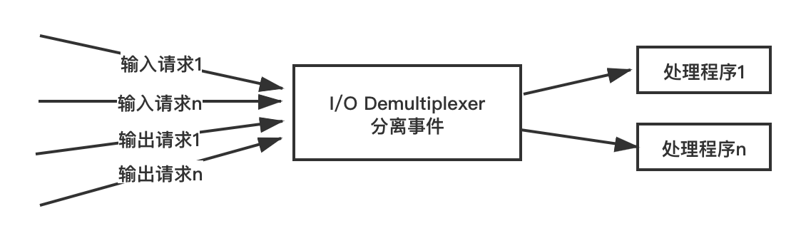
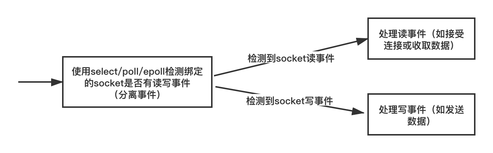

# 网络通信效率

## 网络通信组件的效率问题

### 网络通信框架需要解决哪些问题？
一个服务程序如果要对外服务，就要与外部程序进行通信，这些外部进程往往是位于不同机器上的不同进程（所谓的客户端），一般通信方式就是我们所说的网络通信，即所谓的 socket 通信。因此网络通信组件是一个服务器端程序的基础组件，设计的好坏，直接影响到其对外服务的能力。不同的业务在网络通信框架的一些细节上可能略有不同，但有大多数设计原理都是通用的。

#### 1. 尽量少等待原则
目前，网络上有很多网络通信框架，如 libevent、Boost Asio、ACE 等，但它们的网络通信的常见的技术手段都大同小异。一个好的网络通信框架至少要解决以下问题：

```text
1. 如何检测有新客户端连接？

2. 如何接受客户端连接？

3. 如何检测客户端是否有数据发来？

4. 如何收取客户端发来的数据？

5. 如何检测连接异常？发现连接异常之后，如何处理？

6. 如何给客户端发送数据？

7. 如何在给客户端发完数据后关闭连接？
```

稍微有点网络基础的人，都能回答上面说的其中几个问题，例如接收客户端连接用 socket API 的 accept 函数即可，收取客户端数据用 recv 函数，给客户端发送数据用 send 函数，检测客户端是否有新连接和客户端是否有新数据可以用 IO multiplexing （IO 复用）技术的 select、poll、epoll 等 socket API。确实是这样的，这些基础的socket API 构成了服务器网络通信的地基，不管网络通信框架设计的如何巧妙，都是在这些基础的 socket API 之上构建的。

但是如何巧妙地组织这些基础的 socket API，才是问题的关键。通常我们说服务器的高性能、高并发，实际上只是一个技术实现达到的效果而已，不管怎样，从程序设计的角度来讲无非就是一个程序而已，所以，只要程序能最大可能地满足“尽量少等待”就是高性能的（高效的）。这里说高效不是“忙的忙死，闲的闲死”，而是大家都可以闲着，但是如果有活要干，大家尽量一起干，而不是一部分线程忙着依次做事情一二三四五六七八九，另外一部分线程闲在那里无所事事。

说的可能有点抽象，下面我们举一些例子来具体说明一下。

- 默认情况下，recv 函数如果没有数据的时候，线程就会阻塞在 recv 函数调用处；

- 默认情况下， 如果 TCP 窗口不是足够大，利用 send 函数发数据发不出去，send 函数也会阻塞线程；

- connect 函数默认连接另外一端时会有一定时长的阻塞；

- 给对端发送一份数据，需要使用 recv 函数等待对端应答，如果对端一直不应答，当前线程就阻塞在 recv 函数调用处。

以上都不是高性能服务器的开发思维方式，因为上面的例子都不满足“尽量少等待”的原则。为什么一定要等待呢？有没有一种方法，使上述这些过程不需要等待，最好是不仅不需要等待，而且这些事情完成之后能通知我。这样在这些本来用于等待的 CPU 时间片内，程序就可以做一些其他的事情。

有，就是接下来要讨论的 IO 复用技术（IO Multiplexing）。

#### 2. 减少无用功的时间原则
目前 Windows 系统支持的 IO 复用技术有 select、WSAAsyncSelect、WSAEventSelect、IOCP（完成端口），Linux 系统支持的 IO 复用技术有 select、poll、epoll。来讨论一点深层次的东西，以上列举的 IO 复用函数可以分为两个级别：

- 层次一：select 和 poll；

- 层次二：WSAAsyncSelect、WSAEventSelect、IOCP、epoll。

这种划分级别的依据是什么？

先来分析第一级别的函数，select 和 poll 函数本质上还是在一定时间内主动去查询一组 socket 句柄（可能是一个也可能是多个）上是否有事件（可读事件、可写事件或者出错事件等），也就是说我们还是需要每隔一段时间内主动去做这些检测。如果在这段时间内检测出一些事件来，我们这段时间就算没白花，倘若这段时间内没有事件呢？我们只能是做无用功了，这样也是对系统资源的一种浪费。因为假如一个服务器有多个连接，在 CPU 时间片有限的情况下，我们花费了一定的时间检测了一部分 socket 上的事件，却发现它们什么事件都没有，而在这段时间内我们却有一些事情需要处理，那我们为什么要花时间去做这个检测呢？把这个时间用在做我们需要做的事情不好吗？所以对于服务器程序来说，要想高效，我们应该尽量避免花费时间主动去查询一些 socket 是否有事件，而是等这些 socket 有事件的时候系统主动告诉我们，然后我们再去处理。这也就是层次二的函数做的事情。

第二级别的函数实际相当于变主动查询为被动通知。当有事件时，系统会告诉我们，此时我们再去处理，此时不浪费任何时间。只不过第二级别的函数通知我们的方式是各不相同，比如 WSAAsyncSelect 是利用 Windows 窗口消息队列的事件机制来通知我们设定的窗口过程函数，IOCP 是利用 GetQueuedCompletionStatus 函数从挂起状态唤醒并返回，epoll 是 epoll_wait 函数返回而已。

举个例子，connect 函数连接另外一端时，如果将连接 socket 设置为非阻塞的，我们不需要等待 connect 连接结果，可以立即返回。等连接完成之后：WSAAsyncSelect 会返回 FD_CONNECT 事件告诉我们连接是否成功，epoll 会产生 EPOLLOUT 事件来通知我们；再例如，socket 有数据可读时，WSAAsyncSelect 产生 FD_READ 事件，epoll 产生 EPOLLIN 事件，等等。

总结下上面表达的含义：在追求高性能网络通信设计时，尽量不要主动去查询各个 socket 的事件，而是采用等待操作系统通知我们有事件的策略。

所以基于上面的讨论，这里提出的第二个原则：尽量减少做无用功的时间。

深刻理解这里的意思，在服务程序资源够用的情况下这样做可能体现不出来什么优势，但是如果有大量的任务要处理，需要支持高并发的服务，这基本上是非常有效的方法。

> 通过上面的分析，应该明白了对于高性能的服务，同样是 IO 函数，为什么不使用 select、poll 函数了吧？

另外使用 IO 复用 API，如果套接字无效了，应该及时关闭，并从 IO 复用函数上移除，否则可能造成死循环或者浪费 CPU 检测周期。

#### 3. 检测网络事件的高效姿势
根据上文介绍的两个原则，在高性能服务器设计中，我们一般将 socket 设置成非阻塞的，利用层次二提到的 IO 复用函数来检测各个 socket 上的事件（读、写、出错等事件）。

> 当然，这里不是说阻塞的 socket 通信模式一无是处，这个在少量数据量、低并发量或客户端的情况下，使用阻塞的 socket 通信方式也是可以的。

```text
1. 如何检测有新客户端连接？
2. 如何接受客户端连接？
```

默认 accept 函数会阻塞在那里，如果 epoll_wait 检测到侦听 socket 上有 EPOLLIN 事件；或者WSAAsyncSelect 检测到有 FD_ACCEPT 事件，那么就表明此时有新连接到来，这个时候再调用 accept 函数，就不会阻塞了。

```text
3. 如何检测客户端是否有数据发来？
4. 如何收取客户端发来的数据？
```

accept 产生的新 socket 你也应该设置成非阻塞的，而且应该在 epoll_wait 或 WSAAsyncSelect 报告这些 socket 有可读事件的时候才去收取数据，这样才不会做无用功。

至于一次性收多少数据好呢？我们可以根据自己的实际需求来决定，甚至你可以在一个循环里面反复 recv （或 read）。对于非阻塞模式的 socket，如果没有数据了，recv 或者 read 也会立即返回（返回值是 -1），此时错误码 EWOULDBLOCK （或 EAGAIN）会表明当前已经没有数据了。

代码示例：
```c++
bool CMySocket::Recv()
{
    int nRet = 0;
    while (true)
    {
        char buff[512];
        nRet = ::recv(m_hSocket, buff, 512, 0);
        if (nRet == SOCKET_ERROR)
        {
            //调用recv函数直到错误码是WSAEWOULDBLOCK
            if (errno == EWOULDBLOCK)
                break;
            else
                return false;
        }
        else if (nRet < 1)
            return false;

        m_strRecvBuf.append(buff, nRet);

        ::usleep(1000);
    }

    return true;
}
```

```text
5. 如何检测连接异常？发现连接异常之后，如何处理？
```

同样当我们收到异常事件后例如 EPOLLERR 或关闭事件 FD_CLOSE，我们就知道了有异常产生，我们对异常的处理一般就是关闭对应的 socket。另外，如果 send/recv 或者 read/write 函数对一个 socket 进行操作时，如果返回 0，也说明对端已经关闭了socket，此时这路连接也没必要存在了，我们也可以关闭本端的 socket。

需要说明的是，由于 TCP 连接是状态机，两个端点之间的路由错误导致的链路问题是检测不出来的，这种情形需要定时器结合心跳包去检测。

```text
6. 如何给客户端发送数据？
```

这也是一道常见的网络通信面试题，后台开发职位面试时常常会问这个问题，是考察一个后台开发者对高性能网络通信框架是否真正理解的一个重要知识点。

给客户端发送数据，比收数据要稍微麻烦一点，也是需要讲点技巧的。对于 epoll 的水平模式（Level Trigger），首先我们不能像注册检测数据可读事件一样一开始就注册检测数据可写事件，因为如果注册可写事件的话，一般情况下只要对端正常收取数据，我们的 socket 就通常都是可写的，这会导致频繁地触发可写事件。但是可写事件触发时我们并不一定有数据需要发送。所以正确的做法是：如果有数据要发送，则先尝试着去发送，如果发送不了或者只发送出去部分，剩下的我们需要将其缓存起来，然后再设置检测该socket上可写事件，下次可写事件产生时，再继续发送，如果还是不能完全发出去，则继续设置侦听可写事件，如此往复，一直到所有数据都发出去为止。一旦所有数据都发出去以后，我们要移除侦听可写事件，避免无用的可写事件通知。不知道你注意到没有，如果某次只发出去部分数据，剩下的数据应该暂且存起来，这个时候我们就需要一个缓冲区来存放这部分数据，这个缓冲区我们称为“发送缓冲区”。发送缓冲区不仅存放本次没有发完的数据，还用来存放在发送过程中，上层又传来的新的需要发送的数据。为了保证顺序，新的数据应该追加在当前剩下的数据的后面，发送的时候从发送缓冲区的头部开始发送。也就是说先来的先发送，后来的后发送。

```text
7. 如何在给客户端发完数据后关闭连接？
```

这个问题比较难处理，因为这里的“发送完”不一定是真正的发送完，我们调用 send 或 write 函数即使返回成功，也只能说明向操作系统的协议栈里面成功写入数据，并不是数据被发到网络上去。至于最后数据能否被发出去、何时被发出去很难判断，发出去对方是否收到就更难判断了。所以，我们目前只能简单地认为 send 或者 write 返回我们发出数据的字节数大小，我们就认为“发完数据”了。当然，你也可以调用 shutdown 函数来实现所谓的“半关闭”。

> socket 有一个 linger 选项，可以设置某个 socket 在关闭之后，剩下的数据可以最多逗留的时间。如果在逗留的时间内数据还不能发出去，那数据就真的丢掉了。

### 被动关闭与主动关闭连接
在实际的应用中，被动关闭连接是由于我们检测到了连接的异常事件（例如，触发 EPOLLERR 事件 、send/recv 函数返回 0，对端关闭连接），这个时候这路连接已经没有存在的必要了，我们被迫关闭连接。而主动关闭连接，是我们主动调用 close/closesocket 来关闭连接，例如客户端给我们发送非法的数据，如一些网络攻击中的刺探性数据包，这个时候出于安全考虑，我们主动关闭连接。

### 长连接和短连接
网络通信双方中根据连接的保持状况分为长连接和短连接，长连接是长时间保持通信双方的连接状态，这其实是相对于短连接而言的。通常的短连接操作步骤是：

> 连接 => 数据传输 =>关闭连接

而长连接通常是：

> 连接 => 数据传输 => 保持连接 => 数据传输 => 保持连接 => ...... => 关闭连接

这就要求长连接在没有数据通信时，定时发送数据包，以维持连接状态，短连接在没有数据传输时直接关闭就行了。

那什么时候使用长连接什么时候使用短连接呢？ 长连接主要用于通信双方需要频繁通信的场景，缺点是通信双方需要增加相应逻辑去维护相应的连接状态信息，另外连接信息本身也对需要一定的系统消耗，优点是可以进行实时数据交换。

短连接一般用于数据传输完后即可关闭连接、或者对通信双方的状态信息实时性要求不高的应用，如 Web 服务器与浏览器之间的连接，Web 服务器将页面信息发送给浏览器后即可关闭连接，在需要时可再次建立连接。短连接的优点是通信双方不需要长时间的维护连接状态信息，可节省连接资源；缺点是，如果传输数据频次比较多，可能需要频繁的建立和关闭连接，另外，短连接无法做到很实时的消息推送。

```text
这里说 Web 服务器一般使用短连接与浏览器通信严格来说其实不准确的，在一些 http 通信中，通信双方可能会接受 http 协议包头中的 keepalive 选项的建议，在多次通信之间保持连接状态不断开。

另外，虽然大多数情况下 http 协议都是短链接、不支持消息推送，但这种现状正在改变，最新的 http2.0 标准就支持服务器端的推送。
```

## 最原始的服务器结构
单个服务器的结构，是随着业务需求的升级而不断演进。尽管我们今天看最初的一些服务器结构模型觉得非常简陋和低效，但是它们是最基本的原理和最初的模型，虽然我们今天在商业系统中再也不会使用那些最初的组织结构了，但是了解它们能让你知道现在的复杂的结构最初是什么样子，又是如何一步步地演化成今天的面貌，这就是所谓的知道“从哪里来，到哪里去”。

最原始的服务器结构，是创建好侦听 socket，在一个循环里面接受新的连接，产生对应的客户端 fd，然后利用这个客户端 fd 与客户端进行通信（收发数据）。代码如下：
```c++
/**
 * TCP服务器通信基本模型
 */
#include <sys/types.h> 
#include <sys/socket.h>
#include <arpa/inet.h>
#include <unistd.h>
#include <iostream>
#include <string.h>

int main(int argc, char* argv[])
{
    //1.创建一个侦听socket
    int listenfd = socket(AF_INET, SOCK_STREAM, 0);
    if (listenfd == -1)
    {
        std::cout << "create listen socket error." << std::endl;
        return -1;
    }

    //2.初始化服务器地址
    struct sockaddr_in bindaddr;
    bindaddr.sin_family = AF_INET;
    bindaddr.sin_addr.s_addr = htonl(INADDR_ANY);
    bindaddr.sin_port = htons(3000);
    if (bind(listenfd, (struct sockaddr *)&bindaddr, sizeof(bindaddr)) == -1)
    {
        std::cout << "bind listen socket error." << std::endl;
        return -1;
    }

	//3.启动侦听
    if (listen(listenfd, SOMAXCONN) == -1)
    {
        std::cout << "listen error." << std::endl;
        return -1;
    }

    while (true)
    {
        struct sockaddr_in clientaddr;
        socklen_t clientaddrlen = sizeof(clientaddr);
		//4. 接受客户端连接
        int clientfd = accept(listenfd, (struct sockaddr *)&clientaddr, &clientaddrlen);
        if (clientfd != -1)
        {         	
			char recvBuf[32] = {0};
			//5. 从客户端接受数据
			int ret = recv(clientfd, recvBuf, 32, 0);
			if (ret > 0) 
			{
				std::cout << "recv data from client, data: " << recvBuf << std::endl;
				//6. 将收到的数据原封不动地发给客户端
				ret = send(clientfd, recvBuf, strlen(recvBuf), 0);
				if (ret != strlen(recvBuf))
					std::cout << "send data error." << std::endl;
				
				std::cout << "send data to client successfully, data: " << recvBuf << std::endl;
			} 
			else 
			{
				std::cout << "recv data error." << std::endl;
			}
			
			close(clientfd);
        }
    }
	
	//7.关闭侦听socket
	close(listenfd);

    return 0;
}

```

上面的代码，我们抽出我们关心的主干部分并整理成伪码如下：
```c++
int main(int argc, char* argv[])
{
    //1. 初始化阶段

    while (true)
    {
        //2. 利用 accept 函数接受连接，产生客户端 fd
        
        //3. 利用步骤 2 中的 fd 与某个客户端通信
    }
	
	//3. 资源清理

    return 0;
}

```

上述流程的基本逻辑是程序每轮循环都只能处理一个客户端请求，要处理下一个连接，必须等当前的操作完成后进入下一轮循环才能继续处理。这种结构的弊端是显而易见，它根本就不支持并发，更不用说高并发了。

## 一个连接一个线程模型
正因为最原始的服务器结构不支持并发，随着计算机引入多线程模型后，软件开发者想出了另外一种服务器结构，即给每一个客户端连接创建一个线程，这样多个线程就可以并行执行了，可以同时为多个客户端服务。

示例代码如下：
```c++
//侦听线程
UINT WINAPI MyMainThread(LPVOID lPvoid)
{
    LOG_NORMAL("Start MyMainThread successfully, ThreadID = %u.", ::GetCurrentThreadId());
    
    UINT		nThreadID = 0;
    SOCKET		sListenSocket = (SOCKET)lPvoid;
    SOCKET		sClientSocket = 0;
    while (1)
    {
        //等待客户连接
        sockaddr_in clientAddr = { 0 };
        int clientAddrLength = sizeof(clientAddr);
        if ((sClientSocket = accept(sListenSocket, (struct sockaddr*)&clientAddr, &clientAddrLength)) == INVALID_SOCKET)
            break;

        LOG_NORMAL("New client connected: %s:%d", inet_ntoa(clientAddr.sin_addr), ntohs(clientAddr.sin_port));

        //启动客户签到线程
        _beginthreadex(NULL, 0, MyChildThread, (LPVOID)sClientSocket, 0, &nThreadID);
    }

    closesocket(sListenSocket);
    return 0;
}

```

```c++
//接收连接线程
UINT WINAPI MyChildThread(LPVOID lPvoid)
{
    LOG_NORMAL("Start MyChildThread successfully, ThreadID = %u.", ::GetCurrentThreadId());
    
    //交易处理
    SOCKET sClientSocket = (SOCKET)lPvoid;
    CLIENTITEM	clientItem = { 0 };
    int nCmd = HandleClientMain(sClientSocket, &clientItem);

    LOG_NORMAL("Client cmd = %d", nCmd);
    if (nCmd == -1)
        closesocket(sClientSocket);
    else if (nCmd == CONN_MAIN)
        LoginTrans(sClientSocket, &clientItem);
    else
        InterTrans(sClientSocket, &clientItem, nCmd);
    return 0;
}

```

上述代码中，在某个线程 MyMainThread 中（可以是主线程也可以是非主线程）调用 accept 接受客户端连接，成功接受连接后，为每一个新连接创建一个工作线程（MyChildThread）。当然，为了能让工作线程可以正常处理所负责的连接上的来往数据，利用线程函数参数将 socket 句柄传给工作线程（注意上述代码中参数 sClientSocket 的传递方法）。

## Reactor 模式
目前存在很多的网络通信库，从 C/C++ 的 libevent 库，到 Java 的 Netty 框架，再到 python 的 Twisted 库等，目前主流的网络库使用的都是 Reactor 模式（中文译作： 反应器模式或反射器模式）。那么到底什么是 Reactor 模式呢？Reactor 模式有什么优点？Reactor 模式英文解释如下：

> The reactor design pattern is an event handling pattern for handling service requests delivered concurrently to a service handler by one or more inputs. The service handler then demultiplexes the incoming requests and dispatches them synchronously to the associated request handlers.

翻译成中文的意思就是：

> 反应器设计模式( Reactor pattern )是一种事件处理设计模式，该模式可以将一个或多个 IO 请求服务并发地传递给服务处理器，即当（ IO 处理）请求抵达后，服务处理程序使用多路复用技术，然后同步地派发这些请求至相关的请求处理程序。

流程图如下：


从流程图上来看，这个设计模式看起来很简单，其背后却蕴含着不简单的设计思想。那么上图中到底蕴含着什么样的思想奥妙呢？它解决了计算机世界中普遍存在的一个问题，即请求太多，资源太少。也就是说一个对外服务程序，其接收的各种输入输出请求的数量可能是非常多的，然后由于处理能力有限，其处理这些请求的资源数量是有限的。诚然，大千世界也是这样，如一个公园的游客容量是有限的，而游客数量可能是无限的；一个饭店的座位是有限的，而顾客可能是无限的；一个国家的领土是有限的，其人口可能是无限增长的。所以上图中输入输出请求数量之和一般会远远大于处理程序数量，而多路复用器（IO Demultiplexer）将这些数量众多的输入输出请求分发给有限的处理程序。

所以一个 Reactor 模式结构一般包含以下模块：

- 资源请求事件（Resource Request）

- 多路复用器与事件分发器（IO Demultiplexer & Event Dispatcher）

- 事件处理器（EventHandler）

我们以目前大多数饭店的运营模式这样一个生活中的例子来说明一下reactor模式，顾客去饭店吃饭，由于客户较多，饭店的服务员数量有限，所以饭店都是某个服务员负责某几桌客户，当顾客有需求时（点菜、结账等），可以把需要告诉服务员，由服务员去把这些需求再转发给其他相关人员（点菜转发给厨房，结账交给收银）。如此操作，在即使饭店顾客爆满时，靠几个服务员也能有条不紊地运转着整个饭店。

这是很简单的生活例子，却有着最朴素的思想，在对应具体的服务器程序技术上来说，以 socket 的读写为例，输入输出请求就是 socket 上有数据可读或者需要往 socket 上写入数据，而 IO 复用器就对应着操作系统的相关 API，Windows 操作系统上有 select 技术（函数），Linux 上有 select 函数、poll 函数、epoll 模型（实际对应 epoll_wait）。使用这些IO复用技术之后，Reactor 模式对应的流程图就变成了如下结构：




